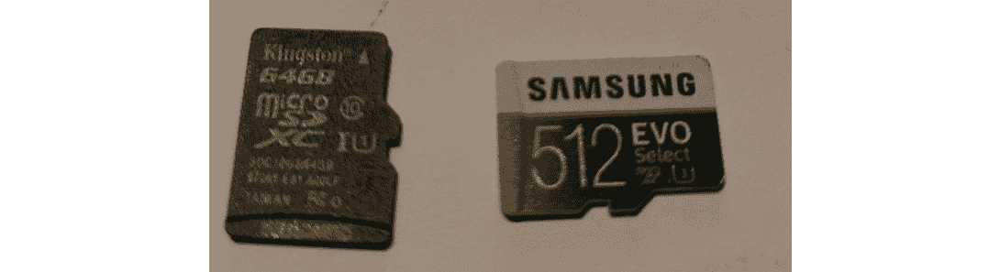

# 第六章：理解文件系统和存储

要成为数字取证调查员，不仅仅需要技术知识。在案件本身，还需要大量的研究、流程和分析。想象一种情景，你需要建造一座房子。当然，我们需要木材、钉子、水泥、金属、玻璃以及所有其他原材料，但我们还需要熟练的工人和承包商来建造并将其组装起来。除了材料、工具和资源外，我们还必须进行研究，以确保我们理解对于这个项目成功所需的一切。

例如，我们必须获得建筑许可证、进行土壤分析、考虑天气，然后根据天气、位置、土壤类型等选择特定类型的材料。毫无疑问，必须对领域中的基本概念有所了解，以有效地执行任务。同样，我们需要了解文件系统、操作系统（OSs）、数据类型、位置，以及保存数据、存储介质和一般证据的方法和程序的彻底理解。

在本章中，我们将学习以下主题：

+   存储媒体的历史

+   文件系统和操作系统

+   数据类型和状态

+   描述易失性和非易失性数据以及其顺序

+   RAM、分页文件和 DFIR 中缓存的重要性

# 存储媒体的历史和类型

任何调查的目标都是证明某件事之前是否存在、当前是否存在或已发生。在笔记本电脑、台式机、移动设备和智能设备中，数据必须存储在某个地方，即使只是暂时性的。大多数人可能熟悉笔记本电脑、台式机、移动设备等中的硬盘驱动器（HDDs），但我们还需要关注无论年龄多大都可能在使用的可移动和便携式存储设备。这些包括 DVD、便携式驱动器、拇指或闪存驱动器、安全数字（SD）和 MicroSD 卡，以及诸如 CD 和软盘等旧媒体以及许多其他媒体类型。

我们还应考虑许多便携式存储设备（如闪存驱动器），作为新颖物品，它们具有许多有趣的形状和尺寸，可能不像普通的矩形驱动器那样普通。另一个需要考虑的问题是，随着技术的发展，许多这些存储介质设备的尺寸已经发生了变化，可能更小了。

## IBM 和存储媒体的历史

提及硬盘驱动器和存储介质的历史时，不得不提及三个字母：IBM。我们都熟悉这个著名的科技巨头，但我们可能不熟悉它的一些伟大成就。

**国际商业机器公司**（**IBM**）已经存在了相当长的时间。早在 20 世纪初，IBM 还以**计算-制表-记录**（**CTR**）公司的名字为人们熟知，IBM 更为人们熟知的是其创造了第一台硬盘、第一台个人计算机，以及它的服务器、台式机和笔记本电脑。

在 1956 到 1957 年间，IBM 通过开发和发布 305 **随机访问会计与控制方法**（**RAMAC**）取得了重大进展，RAMAC 采用了第一代磁盘存储技术。这项革命性的技术的重量大约为一吨，尺寸约为 16 平方英尺。然而，这个庞然大物的磁盘存储容量仅为 5 MB（是的，我说的是兆字节）。

尽管按照今天的标准，5 MB 大约是用移动设备拍摄的高清照片的大小，但考虑到所有因素，这对于当时来说无疑是一个划时代的成就。在 IBM 的发明之前，数据是存储在打孔卡上，可能需要数百万张卡片才能存储几兆字节的数据。

当时引入这种数字存储技术面临的一个主要问题是设备的体积。运输这些设备时，飞机和卡车可能都无法使用，存储空间也会成为问题。

随着技术的进步，IBM 在 1975 年发布了一款更便携的计算机——IBM 5100 便携式计算机。到了 1980 年代，特别是 1981 年，我们见证了 IBM 个人计算机的诞生。它比前代产品轻巧得多，而且价格也更加实惠，介于 8,000 到 20,000 美元之间。

直到 1981 年 IBM 发布了第一台个人计算机，计算机的便携性才成为现实。这台个人计算机的售价为 1,565 美元，配有键盘和鼠标，还可以选择显示器、打印机和软盘驱动器。除了软盘驱动器之外，这几乎就是今天个人计算机的标准配置。

随着这种新型、更加便捷的技术的问世，数据存储介质也随着时间推移不断改进，从磁带存储到软盘、光盘、DVD、蓝光光盘，以及当然的机械硬盘和**固态硬盘**（**SSD**）。

## 可移动存储介质

继续我们的存储介质话题，我首先想讨论一下可移动存储介质，因为它在今天的世界中与固定存储介质一样，扮演了同样重要的角色。

## 磁带驱动器

**磁带**是 IBM 在 1950 年代推出的一种非常快速且便捷的存储数据的方式，数据的存取速度与其处理速度相当。IBM 726 磁带读取机和录音机是第一批提供这种存储方式的设备之一，其磁带密度为每英寸 100 位。磁带的一英寸长度可以帮助你了解磁带的尺寸，它缠绕在一个大轮盘上，类似于老式的电影胶片。

使用磁带媒介时，数据是沿着磁涂层塑料带的宽度写入的，帧之间有间隙，间隙由区块组成。磁带仍然在今天广泛使用，像许多其他存储媒介类型一样，磁带的尺寸大幅减小，而容量和速度却大幅增加。

为了让大家了解磁带存储技术到 2017 年已经发展到什么程度，IBM 开发了更新的磁带存储媒介，其磁带密度为每英寸 200 **千兆位每秒**（**Gps**），单个磁带盒可以记录高达 333 **千兆字节**（**GB**）的数据。这些磁带盒（对于像我这样的老年人来说）大小类似于卡带（对于年轻人来说），比普通智能手机稍小，可以握在手中。

## 软盘

软盘由 IBM 再次推出，并与其软盘驱动器一起在 1971 年首次亮相。尽管当时的主机计算机已经有硬盘和磁带存储媒介，但仍然需要一种简单且更便宜的方式来保存和传递软件与指令，这之前是通过更慢的打孔卡完成的。

软盘的核心是一个小型磁性盘片，虽然比当时的磁带存储和硬盘驱动器（HDD）更为便携，但存储容量远低于我们提到的其他媒介。

### 软盘的演变

这是软盘在尺寸和容量上随时间演变的过程：

+   **尺寸：8 英寸**：

    +   推出年份：1971 年

    +   最大容量：80 **千字节**（**KB**）

+   **尺寸：5.25 英寸**：

    +   推出年份：1976 年

    +   最大容量：360 KB

+   **尺寸：3.5 英寸**：

    +   推出年份：1984 年

    +   最大容量：1.2 **兆字节**（**MB**）

注意

1986 年，软盘的容量增加到 1.44 MB，并保持这一容量，直到 2011 年由索尼（软盘的最后制造商）停产。

## 光学存储媒介

光学存储媒介之所以得名，是因为数据是通过不同类型的激光写入光盘表面的各种媒介类型。

尽管在没有默认标签的情况下，可能很难区分各种光盘，但它们由于用于写入数据的激光大小不同，在颜色和色调上有些许差异。

### 光盘

**光盘**（**CDs**）由坑和凸起组成，这些坑和凸起在光盘的底面上可见，涂有一层薄薄的铝层，形成反射表面。数据是以同心圆的形式写入，并进一步分割为每个 512 字节的扇区，每个扇区称为光盘上的轨道，从光盘的内圈到外圈（或边缘）：

+   直径：120 **毫米**（**mm**）

+   用于写入数据的激光类型：780 **纳米**（**nm**）红外激光

+   光盘的最大容量：650–700 MB

光盘有两大类：

+   **光盘 – 只读内存 (CD-ROM)**：该光盘上预存有程序、游戏、音乐等数据，并且只能从 **光盘可记录** (**CD-R**) 中读取数据。数据可以写入该光盘，但只能写入一次。

+   **光盘 – 可重写 (CD-RW)**：数据可以多次写入此光盘。

### 数字多功能光盘

**数字多功能光盘** (**DVDs**)，尽管与 CD 的直径相同，但能够存储比 CD 更多的数据：

+   **直径**：120 毫米（与 CD 相同）

+   **写入数据的激光类型**：650 nm 红色激光

+   **DVD 的最大容量**：4.7 GB 和 15.9 GB（双层 DVD）

各种类型的 DVD 如下：

+   **DVD – 只读内存 (DVD-ROM)**：该 DVD 已经预先写入数据，类似于 CD-ROM。

+   **DVD – 可记录 (DVD-R)**：数据只能写入 DVD 一次。

+   **DVD + 可记录 (DVD+R)**：数据只能写入 DVD 一次。DVD+R 使用更先进的错误检测和管理技术。

+   **DVD – 可重写 (DVD-RW)**：数据可以多次写入此 DVD。

+   **DVD – 可记录双层 (DVD-R DL)**：此类 DVD 包含双层结构，从而提供更高的存储容量，DVD-9 光盘为 7.95 GB，DVD-18 光盘为 15.9 GB。

+   **DVD – 可记录双层 (DVD+R DL)**：与 DVD-R DL 相同，但被认为是一种更高效的格式，导致更少的错误。

+   **DVD – 随机访问内存 (DVD-RAM)**：主要用于视频录制设备，因其耐用性（可使用达二十年）以及可以重写数据的特性。这种光盘比其他 DVD 格式更贵，并且不兼容许多常见的 DVD 驱动器和播放器。

## 蓝光光盘

当前可移动磁盘介质的标准，蓝光光盘因其读取和写入光盘所使用的激光颜色而得名。由于蓝光光盘的高容量存储，**高清** (**HD**) 内容可以轻松存储在蓝光光盘上而不丧失质量：

+   **直径**：120 毫米（与 CD 和 DVD 相同）

+   **写入数据的激光类型**：405 nm 蓝色激光

+   **DVD 的最大容量**：25 GB 和 50 GB（双层蓝光）

+   **数据传输**：最高可达 72 **兆比特每** **秒** (**Mbps**)

蓝光光盘的两种容量也有可重写和可记录格式：

+   **BD-RE**：蓝光光盘可重写

+   **BD-RE DL**：蓝光光盘可重写双层（50 GB）

+   **BD-R**：蓝光光盘可记录

+   **BD-R DL**：蓝光光盘可记录双层（50 GB）

## 闪存存储介质

闪存之所以得名，是因为数据是通过电荷写入和擦除的。你可能听说过有人说他们需要“刷机”。这与在智能手机和智能设备上擦除闪存存储介质非常相似，不过，像 Android 和 iOS 这类具有操作系统的设备需要一个更加复杂的过程来刷新和重新安装它们的操作系统。然而，最终结果非常相似，即内存和存储区域会被重置或清除。

闪存存储芯片有两种类型，分别称为**非与（NAND）**和 NOR 闪存，它们负责在闪存介质上进行高速和大容量的数据存储。它们是新型的**电可擦除可编程只读存储器**（**EEPROM**）芯片，可以清除数据块或整个驱动器，而不是像较慢的 EEPROM 那样一次只清除一个字节。这种类型的闪存芯片是非易失性的，意味着即使芯片断电，数据仍然保存在芯片上。数据通过一种被称为电路内写入的方法，以电信号的形式发送到芯片，从而擦除数据并相应地更改数据。

下图展示了我的一只旧 1 GB（左）闪存驱动器和一只较新的 32 GB 闪存驱动器（右），其 NAND 芯片已暴露。请注意，尽管这两颗芯片大小相似，但右侧的芯片数据容量是左侧的 32 倍，因为它们的制造时间相差超过十年：

图 6.1 – 闪存驱动板上的 NAND 芯片

闪存媒体存储至今已成为便携性的终极选择，种类繁多，从与你的拇指大小到你小指甲大小不等。闪存的使用寿命取决于使用情况，因为它们都有一个平均的读写使用量，有时会在设备的包装上显示。当前，闪存的读写速度也非常快，这也是为什么硬盘驱动器（HDD）从传统的机械磁盘机制转向了固态机制。固态硬盘（SSD）将在本章稍后讨论。

注意

闪存存储介质的容量范围从 2 GB 到 1 **TB**（**太字节**）及更大，特别是在 SD、microSD 和闪存驱动器上，这些现在可以作为非常快速的可移动驱动器，安装操作系统，并且可以使用各种工具进行分区。因此，的确，Kali Linux 完全可以安装到闪存驱动器、SD 卡或 microSD 卡上（并使其可启动），仅需要 8 GB 的存储空间。

## USB 闪存驱动器

**通用串行总线** (**USB**)接口，于 1995 年发布，已成为所有设备的标准，取代了旧式设备，这些设备需要通过计算机上的特定并行端口连接。如今，几乎所有设备或外设都通过 USB 连接到计算机，包括鼠标、键盘、闪存驱动器、打印机、扫描仪、相机、移动设备，几乎所有其他设备。

这张表格展示了 USB 接口的发展：

| **USB 版本** | **发布年份** | **数据** **传输速度** |
| --- | --- | --- |
| USB 1.0 和 1.1 | 1995 | 12 Mbps |
| USB 2.0 | 2000 | 480 Mbps |
| USB 3.0 | 2008 | 5 Gbps |
| USB 3.1 | 2013 | 10 Gbps |

今天的 USB 闪存驱动器形状和尺寸各异，从标准的矩形形状到各种可以想象的形状都有。USB 闪存驱动器使用 NAND EEPROM 芯片来存储数据，现有多个版本可定义闪存驱动器的读写速度。

下图展示了从最旧到最新的各种闪存驱动器，按从左到右的顺序排列。前三个驱动器都是 USB 2.1；然而，前两个是 8 GB 的闪存驱动器，第三个驱动器明显较小，是一个 32 GB 的闪存驱动器。第四个驱动器（Corsair）是一个 64 GB 的 USB 3.1 驱动器：

图 6.2 – 闪存驱动器尺寸

重要提示

我应该特别提一下“房间里的大象”，即新奇的闪存驱动器，它很容易被误认为是钥匙链或玩具，实际上可能对一些禁止员工带闪存驱动器进出工作场所的组织构成威胁，因为这些闪存驱动器可能包含敏感数据。

## 闪存卡

像闪存驱动器一样，闪存卡（或称记忆卡）也使用 NAND 闪存，这是我们之前了解的非易失性固态内存。然而，与 USB 闪存驱动器不同，这些卡没有 USB 接口，必须通过适配器或读卡器使用。

多年来，甚至几十年里，我们在桌面电脑、笔记本电脑、手机及其他设备中使用过多种记忆卡格式，包括相机、MP3 播放器甚至玩具。虽然我只会介绍一些今天较为流行的卡片，但了解记忆卡并能够识别它们是非常重要的。

以下是闪存卡的类型：

+   **记忆棒 PRO Duo** (**MSPD**)（由索尼开发的专有卡）

+   SD

+   MicroSD

+   **紧凑型** **闪存** (**CF**)

+   **多媒体** **卡** (**MMC**)

+   **xD-图片** (**xD**)

+   **智能** **媒体** (**SM**)

在上述类型中，我选择了三张来自我的收藏的卡片，下面的照片展示了这些卡片。顶部是三星的 SD 卡，SD 卡通常有一个侧面的滑动锁，用于防止数据被覆盖。中间和底部是两张索尼 Memory Stick PRO Duo 卡，尽管它们现在可能已经较为罕见，但它们仍然完好无损：

图 6.3 – SD 卡与 PRO Duo 卡对比

我想简要对比一下*图 6.4*中展示的 PRO Duo 卡、SD 卡和 microSD 卡。PRO Duo 卡至少比 SD 卡和 microSD 卡早了十年以上，较老的 PRO Duo 卡尺寸较大，分别为 2 GB 和 4 GB 容量。虽然*图 6.3*中的 SD 卡未显示其容量，但它的容量为 1 GB，这再次表明，随着技术的发展，较小的芯片能够容纳比其前辈更多的数据。

为了进一步说明这一点，我们可以看看*图 6.4*中的照片（虽然由于我的相机缩放，照片有些模糊），近距离展示了两张 microSD 卡。左边的 microSD 卡容量为 64 GB，标明为 Class 10 U1 卡。右边的三星 microSD 卡容量为 512 GB，Class 10，U3 卡，大小只有指甲盖那么大！尽管如此，microSD 卡仍在研发更大容量的版本，目前已经有 1 TB 及以上的容量：

图 6.4 – MicroSD 卡对比

不同等级的 microSD 卡标识了它们的读写速度和建议用途。如果购买 microSD 卡，我建议选择 Class 10 卡，因为 C10 比其他等级（2、4 和 6）速度更快，能够支持高清甚至 4K 视频录制。

我们来看一下四种等级的速度评定：

| **等级（C）** | **最小写入** **速度（MBps）** |
| --- | --- |
| C2 | 2 |
| C4 | 4 |
| C6 | 6 |
| C10 | 10 |

还有一个**超高速**（**UHS**）等级，可以通过 microSD 卡上的 U 符号识别。

| **UHS（U）等级** | **最小写入** **速度（MBps）** |
| --- | --- |
| U1 | 10 |
| U3 | 30 |

为了应对大文件，特别是 4K 和 8K 视频文件的需求，还有一个视频速度等级：

| **视频** **速度等级** | **最小写入** **速度（MBps）** |
| --- | --- |
| V6 | 6 |
| V10 | 10 |
| V30 | 30 |
| V60 | 60 |
| V90 | 90 |

正如之前提到的，闪存卡需要读卡器，这些读卡器通过 USB 接口与笔记本、台式机和其他媒体播放器连接。*图 6.5*中的照片展示了我的一款读卡器，它支持 CF 卡、Memory Stick PRO Duo 卡、SD 卡，甚至 SM 卡，而*图 6.6*中的更新版读卡器则是一个 SD 和 microSD 卡读卡器，支持 USB 和 Type-C 接口：

图 6.5 – SD 卡、CF 卡和 PRO Duo 卡读卡器

图 6.6 – USB 3.0 和 Type C SD 卡与 microSD 卡读卡器

## 硬盘驱动器

现在我们已经深入了解了非易失性存储，包括磁带存储和闪存存储，接下来我们将进一步探讨作为固定存储介质的硬盘驱动器（HDD）。我会尽量简化内容，重点介绍对取证调查人员来说最为必要的知识。

硬盘技术自 IBM 主机中的巨大存储设备问世以来，已经取得了长足的进展，现在更加紧凑、快速且价格更为实惠，存储容量已达到数 TB 级别。

尽管新型固态硬盘（SSD）使用的是与闪存设备中相同的存储芯片，它们仍然比机械硬盘要昂贵一些。这也许是人们在思考为什么旧款机械硬盘技术仍在使用时的一个原因。机械硬盘由多个活动部件组成，包括磁盘、执行臂和一个非常强大的磁铁。尽管在今天的笔记本电脑和硬盘中仍然常见到这些机械硬盘，但它们比新型固态硬盘慢得多，后者没有活动部件，看起来与 USB 闪存驱动器的芯片组非常相似。

在你的取证调查和冒险过程中，你可能会遇到或被展示不同接口和不同电缆技术连接到主板的旧款硬盘。我们来看看吧？

## 集成驱动电子硬盘（IDE 硬盘）

在 1980 年代中期，许多第一代个人电脑都配备了使用**平行高级技术附件**（**PATA**）和**集成驱动电子技术**（**IDE**）的硬盘。与当时所有的旧设备一样，平行传输（同时但缓慢地传输多个比特）是当时的主流，因此数据吞吐量非常有限。识别旧版 IDE 硬盘的一种简单方法是查看连接到硬盘的数据和电源接口。

如下图所示，这些旧硬盘有四个电源针脚，通过 Molex 连接器连接，间隔有八个针脚用于设置设备为主设备或从设备，然后是 40 个针脚用于 IDE 数据线，这条数据线将数据传输到主板：

图 6.7 – 3.5 英寸 IDE 硬盘

1994 年，随着技术的进步，**增强型集成驱动电子**（**EIDE**）问世，数据线的针脚数量从 40 个增加到 80 个，传输速度也从 4 Mbps 提升到了最高 133 Mbps。

然而，IDE/EIDE 仍然限制每台计算机最多只能连接四个 IDE/EIDE 硬盘，因为硬盘上的跳线针只允许设置两个主盘和两个从盘，且采用主从配置。还需要考虑的是，当时 CD-ROM、RW 设备和 DVD-ROM、RW 设备也在使用 IDE/EIDE 技术。

## 串行高级技术附件硬盘

2002 年，希捷推出了一种名为**串行高级技术附件**（**SATA**）的硬盘技术，它采用了串行传输方式，代替了较慢的并行传输方式。PATA 硬盘的速度为 33/66/133 Mbps，而 SATA 硬盘的速度则为 150/300/600 Mbps。这意味着，SATA 最低传输速度 150 Mbps 就比 PATA 最高速度 133 Mbps 还要快。

SATA 硬盘的连接接口也有所不同，但当时常见的是，SATA 硬盘上会同时有 SATA 和 PATA 电源连接器，以便向下兼容。

SATA 数据线比 PATA 线要细得多，因为它只包含七根连接到七个针脚的导线。SATA 设备每个硬盘使用一根线，而 PATA 设备则通过一根 IDE/EIDE 电缆连接两个硬盘，并设置为主从配置。

SATA 至今仍是桌面和笔记本硬盘技术的标准，并且经历了多次修订，如此处所列。列出的速度单位为 MBps，而不是 Mbps：

+   **SATA 1**：150 MBps

+   **SATA 2**：300 MBps

+   **SATA 3**：600 MBps

以下照片显示了两款 2.5 英寸笔记本硬盘。左侧的是一款较老的 IDE 硬盘，右侧的是一款现代的 SATA 硬盘：

图 6.8 – 2.5 英寸 IDE（左）与 SATA 硬盘

以下照片显示了两款 SATA 2.5 英寸笔记本硬盘。左侧的硬盘已损坏，并被打开，展示了中间的圆形磁盘和顶部略微覆盖在磁盘上的执行臂。执行臂的末端是读写头，用来读取和写入磁盘上的数据。

照片右侧的硬盘是混合硬盘或**固态混合硬盘**（**SSHD**）。它是一个像左边那个机械硬盘一样的硬盘，但它还内置了闪存，能够更快地访问磁盘上的数据：

图 6.9 – 磁盘和执行臂，安装在机械硬盘中

## 固态硬盘

如前所述，固态硬盘（SSD）是一种非易失性存储介质，使用 NAND 闪存阵列来存储数据。固态硬盘已经存在了相当长时间，但由于硬盘成本高昂，主流应用进展缓慢。三星在 1996 年首次推出了 32 GB 的 PATA 接口 SSD，紧接着，SanDisk 也推出了 32 GB 的 SSD，但采用了 SATA 接口。

尽管 SSD 硬盘使用闪存，但其所用材料比闪存盘更高端，这使得它们在作为硬盘使用时非常受欢迎，但同样，这也导致了其非常高的成本。

SSD 的一个优势在于它没有活动部件。没有活动部件使得 SSD 在跌落或快速移动 PC 塔时更加耐用，因为没有磁盘片或驱动臂会被刮伤或撞击。此外，SSD 的更快读写速度和访问时间大大缩短了设备启动或运行的时间，甚至在使用资源密集型软件和游戏时提供了更好的体验。

就数字取证而言，SSD 仍然是一项相对较新的技术，未来一段时间内将持续改进。重要的是要记住，你不是在处理机械硬盘，并且要记住，SSD 上的数据，像闪存驱动器或内存卡一样，可能会在几分钟甚至几秒钟内丢失或被擦除。尽管可以使用传统工具对 SSD 进行成像和数据恢复，但我强烈建议在进行任何取证活动之前，先研究任何 SSD 硬盘，以便更好地理解其工作原理和复杂性，例如去芯片技术和磨损平衡算法。去芯片是从存储芯片中读取数据的一种方法，而磨损平衡涉及用于保护或延长 SSD 使用寿命的技术。

这是一个 250 GB SSD 的照片：

图 6.10 – SSD

注意 SSD 连接器的针脚布局（左侧），它连接到板上的**外围设备组件互连快速通道**（**PCIe**）接口，而不是通常的 SATA 连接器。上一张照片中的连接器是 M.2 **非易失性存储器快速通道**（**NVMe**）SSD 连接器类型，但还有其他类型。在对可能需要使用 USB 适配器的 SSD 进行取证时，请确保了解你正在使用的连接器类型。

SSD 接口类型包括以下几种：

+   M.2 NVMe（最高 32 Gb/s 带宽）

+   M.2 SATA（最高 6 Gb/s 带宽）

+   mSATA（最高 6 Gb/s 带宽）

我们现在已经了解了不同类型的 HDD 及其差异。接下来，让我们讨论可以安装在这些硬盘类型上的文件系统和操作系统。

# 文件系统和操作系统

现在我们已经涵盖了硬盘的物理方面，让我们进入逻辑层面！任何类型的存储介质都需要使用特定的文件系统进行格式化。选择的文件系统也将决定可以安装在哪个操作系统上，并且影响文件和分区的大小。

简单来说，可以把它想象成一张空白纸，代表任何类型的新存储介质或被擦除的存储介质。我们可以在这张纸上写几种类型的信息，但首先我们需要组织或准备这张纸，以便使数据易于理解、访问，甚至存储。我们可以选择从左到右按句子和段落书写英文，或者可以创建行列式的表格。我们甚至可以使用幻灯片显示数据，或使用图片、图表和流程图。此外，我们还可以对存储介质进行格式化，以最好地适应将要存储和使用的数据。

文件系统确保数据以一种可轻松识别和索引的方式进行组织。可以把存储空间想象成一个拥有多个隔间的文件柜。某些隔间可能专门用于按字母顺序存储文件，其他的则按时间顺序排列，部分隔间用于存放文具、杂物，甚至是一些随机物品。尽管这些隔间存放的物品不同，它们都可以被标记并容易识别，且能以一种有序的方式组织，使得每个隔间的内容都能轻松访问或取出。

要在硬盘或可移动存储介质上安装任何操作系统，设备必须先被格式化并选择合适的文件系统进行准备。Windows、macOS、Android、Kali 等操作系统都需要文件系统来组织存储介质，以便操作系统能够成功安装。

以下部分包含一些更受欢迎的操作系统及其文件系统。

## Microsoft Windows

以下是 Microsoft Windows 操作系统的一些简要特点：

+   文件系统：**新技术文件** **系统**（**NTFS**）

+   支持的版本：Windows 11、8、7、Vista、XP、2000、NT，以及 Windows Server 2022、2019、2016、2012 和 2008

+   最大卷大小：在较新的 Microsoft Server（2019 及更新版本）和 Windows 10 版本 1709 及更新版本中为 8**PB**（**拍字节**）。较早版本支持最大 256 TB。

+   最大支持的文件大小：256 TB（取决于簇大小）

+   NTFS 特性：压缩、**加密文件系统**（**EFS**）、磁盘配额

信息

较早版本的 Microsoft Windows 默认支持**文件分配表**（**FAT**）文件系统。较新的 Windows 版本也支持 FAT 和 FAT32，但存在驱动器大小（8 TB）和文件大小（4 GB）的限制。**扩展文件分配表**（**exFAT**）被创建用来去除 FAT32 的限制，但可能不像 FAT32 那样广泛支持。

## Macintosh（macOS）

以下是一些**Macintosh** **OS**（**macOS**）的简要特点：

+   文件系统：**层次化文件** **系统**（**HFS+**）

+   支持的版本：macOS 直到版本 10

+   最大卷大小：2 TB

+   最大支持的文件大小：2 GB

苹果公司已进一步推出了一种新的 64 位文件系统，称为**苹果文件系统**（**APFS**），它取代了 HFS+并专门为 SSD 和 iOS 设备进行了优化。

以下是 APFS 的一些简要特性：

+   支持的版本：macOS 10.13（及更高版本）和 iOS 10.3 及更高版本

+   最大支持文件大小：8 **exbibytes** (**EiB**)

## Linux

以下是 Linux 文件系统的一些简要特性：

+   文件系统：**第四扩展文件系统** (**ext4**)。虽然 Linux 有多种文件系统可供选择，但如果你不确定应该使用哪个文件系统，我推荐使用这个。

+   支持的版本：Red Hat、Kali、Ubuntu 等。

+   最大卷大小：1 EiB。

+   最大支持文件大小：16 **tebibytes** (**TiB**)。

重要提示

许多开源操作系统发行版基于 Linux，包括 Kali Linux 和 Android，因此它们使用 ext2/ext3/ext4 文件系统。它们也能使用 FAT32 文件系统。FAT32 可在任何平台间使用，包括旧版本的 Windows、Macintosh 和 Linux，并且几乎所有带有 USB 端口的设备都支持它。

对于**数字取证与事件响应** (**DFIR**)来说，了解我们所读到的文件系统及其差异非常重要。一旦选择了文件系统（无论是由硬盘制造商还是用户选择），数据就可以存储在存储介质上。接下来我们将查看不同的数据类型和状态。

# 数据类型和状态

首先，有一种数据状态叫做**传输中的数据**，也叫做**运动中的数据**。这仅仅是指数据在移动，可能通过网络在设备之间，甚至在存储介质之间传输，积极地在不同位置之间流动。

还有一种数据状态叫做**正在使用的数据**。处于这种状态的数据当前正被用户访问或被 CPU 处理。当数据被访问或使用时，它会从硬盘中提取并暂时存储在 RAM 中，RAM 的速度远快于硬盘（尤其是机械硬盘），并在用户访问数据且设备保持供电时存储在那里。

当数据不在运动中、传输中或使用中时，它被称为**静止数据**。在这种状态下，数据静止或保存在非易失性介质上，如硬盘、光盘、闪存驱动器和内存卡。

现在我们已经了解了描述数据状态的正式术语，接下来我们将学习元数据和闲置空间。

## 元数据

元数据就是关于数据的数据。以一个存储在仓库中的笔记本为例。在仓库的某个地方（可能还包括其他位置如云端），可能有多项信息可以被称为关于笔记本的数据，甚至是笔记本的元数据，例如以下内容：

+   笔记本电脑在仓库中的位置

+   笔记本品牌和型号

+   制造日期

+   保修日期和信息

+   硬件和软件规格

+   颜色和大小

## 闲置空间

集群是存储介质中存储数据的最小磁盘空间或分配单元。当格式化磁盘时，我们需要定义这些分配单元的大小，或者可以使用 4 KB 的默认集群大小。这就是闲置空间的来源。

空闲空间是集群中的空闲和未使用空间，这些空间包含数据，但没有被数据填充。要充分理解这一点，我们首先需要了解操作系统指定的默认集群大小。使用 NTFS 格式化的驱动器（用于 Windows）默认的集群大小为 4 KB。假设您将一个大小为 3 KB 的文本文件保存到磁盘上，这意味着在该集群中仍然有 1 KB 的未使用或空闲空间。

空闲空间对法医调查员尤其重要，因为数据可以很容易地隐藏在空闲空间中。幸运的是，我们有多个可用工具，如 Kali Linux 中的 Sleuth Kit 和 Autopsy，可以帮助调查空闲空间并找到隐藏的文件。

请确保熟悉“元数据”和“空闲空间”这两个术语，因为在您的调查中它们将不断被提及。随着我们章节内容的推进，您也可以随时在笔记中记录这些和其他术语，以便于后续参考。现在，让我们继续了解不同类型内存的易失性和非易失性特性，同时看看在 DFIR 调查中，易失性顺序的重要性。

# 易失性与非易失性数据以及易失性顺序

在本节中，我们将探讨为什么当易失性内存失去电源时，数据会丢失。

数据可以存在，只要存储数据的介质能够存储数据。硬盘（机械硬盘和固态硬盘）、闪存驱动器和存储卡都是**非易失性存储**介质。尽管固态硬盘（SSD）在数据访问速度上提供并持续进行显著改进，但到目前为止，RAM（通常仅称为内存）仍然是设备内部速度最快的内存类型。

然而，RAM 是**易失性内存**。与硬盘和闪存驱动器中的非易失性内存不同，存储在 RAM 中的数据是暂时保存的，仅在芯片提供电流的情况下才会保留。我们需要了解的 RAM 有两种类型：**静态 RAM**（**SRAM**）和**动态** **RAM**（**DRAM**）。

SRAM 优于 DRAM，但由于制造芯片所需的材料复杂，成本比 DRAM 高得多。SRAM 的物理尺寸也远大于 DRAM。SRAM 可以在 CPU 缓存（L1 或一级缓存）和一些主板芯片（L2/L3）上找到，尽管由于成本和物理尺寸的限制，容量通常非常小（以 KB 为单位）。

尽管 DRAM 较慢，但它便宜得多，仍然是设备中作为主内存使用的原因之一。使 RAM 具有易失性的是它的组件，如晶体管和电容器。你们中的一些人可能已经通过 A+等认证课程了解过这个话题，但为了帮助所有人，我将再详细说明一下。

DRAM 使用电容器，这些电容器在刷新电路中暂时存储电荷。芯片需要不断刷新才能在访问时保持数据。然而，在刷新之间会创建等待状态，这使得 DRAM 相比于使用晶体管而没有等待状态的 SRAM 更慢。

在过去几十年里，出现了许多不同类型的 DRAM 或内存条，大小略有不同，且接触主板的引脚数量有所增加。按年代排序的一些 RAM 类型如下：

+   **扩展数据输出 RAM（EDO RAM）**：早期的 DRAM 类型之一。

+   **同步动态随机存取存储器（SDRAM）**：这是第一种能够与 CPU 时钟速度同步的 RAM 类型。它的最大传输速率为 133 **百万传输**或每秒**百万次传输（MT/s）**。它的标签为 PC100、PC133 和 PC166。

+   **DDR-SDRAM/DDR 1（双倍数据速率 - SDRAM）**：有效地将 SD RAM 的传输速率翻倍。最大传输速率为 400 MT/s。

+   **DDR2**：最大传输速率为 800 MT/s。

+   **DDR3**：功耗比 DDR2 低三分之一。最大传输速率为 1600 MT/s。

+   **DDR4**：最大传输速率为 4400 MT/s（**DDR4-4400**）。

在今天的笔记本和台式机中，常见的内存类型主要是 DDR3 和 DDR4，但碰到带有 DDR2 甚至（奇迹般的）DDR1 的老旧机器也并不罕见。下图展示了不同类型的 RAM **双列直插内存模块**（**DIMM**），从上到下依次为：SDRAM（最上面），DDR1，DDR2，最后是 DDR3：

图 6.11 – RAM 类型

重要提示

笔记本也使用 DDR RAM，但它们采用一种更紧凑的尺寸，称为**小型轮廓 DIMM**（**SODIMM**）模块。

现在我们已经看过了 RAM 的演变及其各种形态类型，接下来让我们了解 RAM 的重要性，并学习分页文件和 RAM 缓存的使用。

# DFIR 中 RAM、分页文件和缓存的重要性

操作系统可以将硬盘的一部分用作 RAM 的扩展。这被称为虚拟内存，通常在计算机或笔记本 RAM 有限的情况下非常有用。尽管硬盘比 RAM 慢得多，但硬盘上的交换文件或分页文件可以存储那些访问频率较低的文件和程序，从而使 RAM 可以存储频繁访问的数据。这个过程涉及操作系统将不常用的数据页交换到硬盘上的专用分页文件区域。

在取证调查中，分页文件对我们非常重要。尽管它不像 RAM 那样具有易失性，因为它存储在硬盘上，但它是 Windows 中的一个隐藏文件，名为**pagefile.sys**，应该始终使用您选择的工具进行检查，因为这个文件可能会揭示加密区域的密码、访问过的网站信息、打开的文档、登录的用户、打印过的项目等等。

机械硬盘上的数据是以碎片化的方式存储的；然而，分页文件或交换文件的优点是，数据可以以连续的方式存储，一个接一个，从而提高访问速度。

建议将分页文件的大小设置为内存大小的 1.5 倍，并且如果可能，存储在一个单独的驱动器上，而不仅仅是一个单独的分区。

关于 Pagefile.sys 的说明

**Pagefile.sys**可以在**HKEY_LOCAL_MACHINE\SYSTEM\CurrentControlSet\Control\Session Manager\Memory Management** Windows 注册表路径下找到。

我希望分页文件和缓存的重要性已经被充分理解，因为在任何数字取证和事件响应调查中，获取和分析分页文件至关重要。在继续下一章之前，随时复习本章并记录下所有涉及的术语。

# 总结

在本章中，我们花时间介绍了一些非易失性存储介质的基础知识，这些介质在没有电源供应时依然能够存储数据。非易失性介质包括不同类型的硬盘，如机械硬盘和固态 PATA、SATA 驱动器，闪存驱动器以及内存卡。

较新的存储介质设备，包括 SSD，使用一种特殊类型的闪存——NAND 闪存来存储数据。这种闪存比传统的机械硬盘更快、更耐用，因为设备没有任何活动部件；然而，目前它们仍然相当昂贵。

我们还看到了与各种操作系统相关的不同文件系统，并了解到数据的最小分配单元称为簇，簇可以位于空闲空间中。空闲空间是簇内未使用的空间，数据可以隐藏在其中。数据本身有不同的状态，可以是静止的、运动中的或正在使用的。无论数据的状态如何，始终存在一些关于数据本身的信息，称为元数据。

用户或操作系统访问的任何数据都会暂时存储在易失性内存或 RAM 中。尽管数据可以在非易失性内存中存储很长时间，但当易失性内存（RAM）的电荷丢失时，数据也会丢失。硬盘上的一个区域，称为分页文件，可以充当虚拟内存，让计算机认为它有比实际安装的内存更多的 RAM。

我确实鼓励你做更多的研究，扩展你在这些主题上的知识，以便更好地理解所涵盖的内容。

现在让我们进入下一个章节，在这里我们将学习调查程序和事件响应的最佳实践，如获取易失性数据和处理及分析实时机器的程序。
