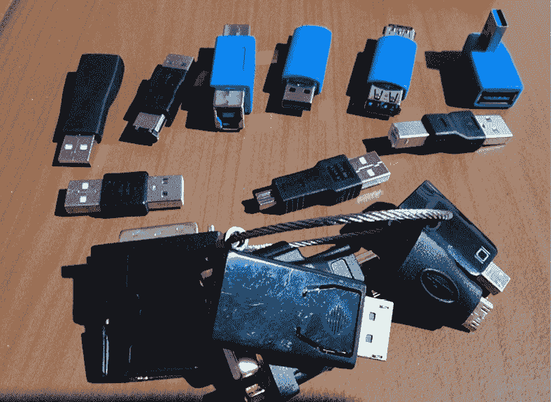
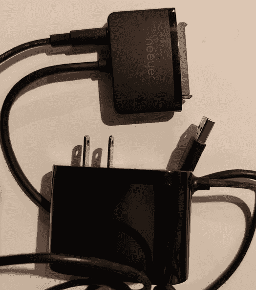
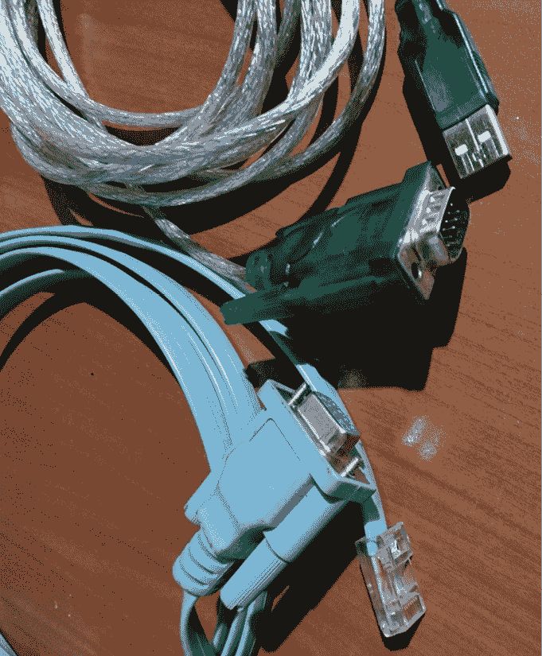
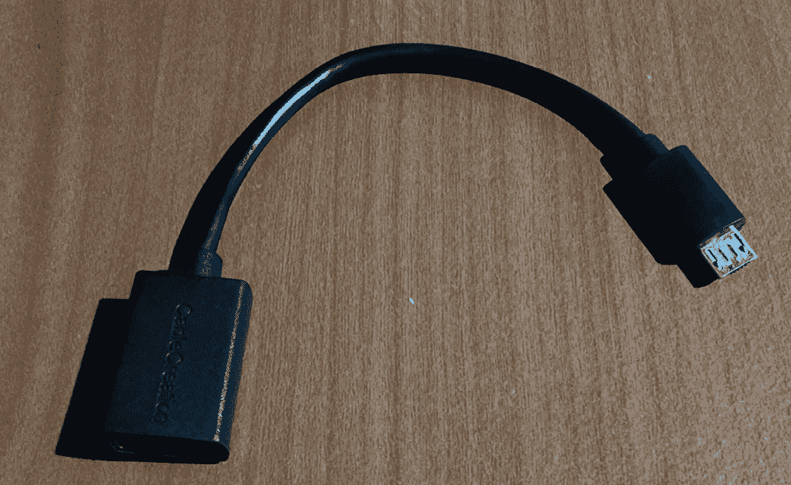
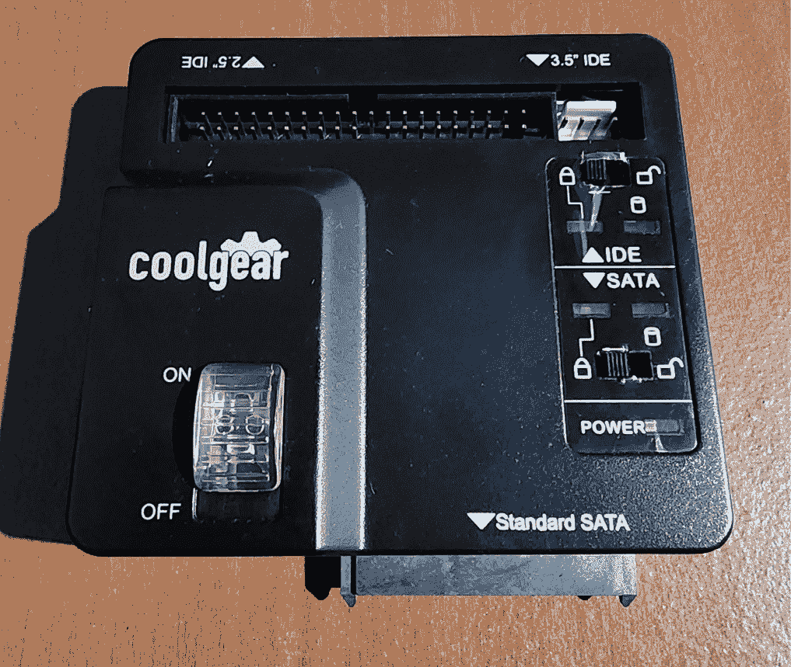
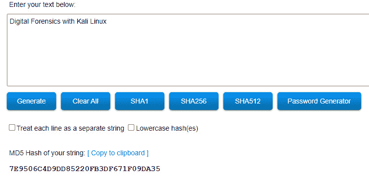
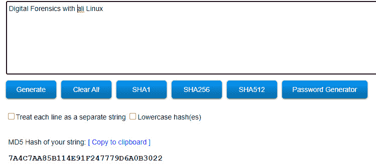

# 第七章：事件响应、数据获取与 DFIR 框架

有时，在调查开始时很难确定什么才算证据，尤其是在关于发生了什么的所有事实尚未收集或陈述的情况下。正如任何调查一样，我们应当了解并遵循获取证据的指南、流程和程序，以确保其不被篡改，或者在最坏的情况下丢失。

在犯罪现场，比如枪击事件，通常会有一些特定物品可以立即被视为证据。物理证据容易收集，放入证据袋中，标记清楚后送往实验室和安全存储区域进行保管。这些证据可能包括弹壳、枪支、指纹和血液样本。不要忘记证人陈述和**闭路电视**（**CCTV**）录像资料。同样，考虑现场执法人员的身份和他们到达的顺序也很重要。看起来似乎很简单。

然而，当涉及计算机或智能设备的漏洞或犯罪事件被报告时，收集证据并不总是那么简单，因为在将任何物品定性为证据之前，需要考虑许多因素。

例如，如果桌面设备参与了事件，我们是只拿走主机塔，还是还需要将显示器、键盘、鼠标和音响一并扣押？打印机和扫描仪等其他外设又该如何处理？现场是否有其他固定或可移动存储介质，我们是否也需要扣押它们？

本章解答了所有这些问题，并提供了关于事件响应、证据获取和其他主题的指南和最佳实践，包括以下内容：

+   证据获取程序

+   事件响应和首批响应人员

+   证据收集与文档记录

+   现场数据获取与事后数据获取

+   **证据链**（**CoC**）

+   写保护器的重要性

+   数据镜像与证据完整性保持

+   数据获取最佳实践、指南和 DFIR 框架

# 证据获取程序

正如我们在上一章中讨论的，数据可以存储在固定和可移动存储介质上。然而，根据多个因素的变化，数据很容易被删除或完全丢失。如果我们要确保数据的保存，必须考虑这些因素。也可以说，数字存储面临的威胁比纸质存储还要多。以下列出了对比这两者的威胁。

针对纸质存储的威胁包括以下内容：

+   水

+   火灾和湿度问题

+   年龄

+   自然灾害——洪水、地震、龙卷风、飓风等

+   人为错误和疏忽

存储介质上的数据威胁包括以下内容：

+   人为错误和疏忽

+   磁性和电磁场

+   水和凝结水

+   热尘

+   影响电压

+   静电

+   自然灾害——洪水、地震、龙卷风、飓风等

那么，数据究竟何时成为证据呢？考虑到发生的事件，某些特定数据可能与调查相关，具有相对的价值。在执行数字取证和事件响应（DFIR）时应考虑这一点，因为此时范围可能不仅限于设备和存储介质，正如我们将在本章中进一步讨论的那样。

接下来，让我们讨论事件响应及第一响应者承担的技术角色。

# 事件响应和第一响应者

保存证据的工作并不仅仅从获取数据开始，而是从物理上查看嫌疑设备时就应开始。对于涉嫌犯罪或安全泄露，应有一定的结构化响应，类似于警方接到报案的处理方式。就像人们拨打紧急电话，紧急服务会派遣警方、消防队、急救人员以及其他第一响应者，随后可能会将问题上报给 FBI 或其他机构。当处理需要进行数字调查的报告时，也应有类似的指挥链。

当发现或怀疑发生泄露或犯罪时，应有一名专门的第一响应者被通知并赶赴现场。通常，这个人对设备、网络，甚至如果适用的话，组织的 IT 基础设施有一定的了解或知识。

第一响应者人员可以包括以下人员：

+   帮助台和 IT 技术人员

+   系统管理员

+   网络管理员

+   安全管理员

+   IT 经理和主管

尽管前述角色的人员可能未接受过数字取证或数字调查的培训或具备相关技能，但他们负责确保现场的安全，确保数据、外设、设备和存储未被未经授权的人员使用、篡改、移除或损坏。

第一响应者的职责包括以下内容：

+   第一响应者是最早抵达现场的人（正如名称所示），并进行初步评估

+   以房间的中心为焦点，环形方式全面记录现场和房间的情况

+   通过不允许未经授权的用户或嫌疑人接触设备或区域，尤其是易变数据和存储介质，来确保现场安全

+   为运输保存和包装证据，确保使用能够追踪证据交换的 CoC（证据链）表格

现在，让我们来看一些证据的例子，以及它们的收集和记录。

# 证据收集与记录

第一响应者还应对现场进行记录，以帮助调查。现场记录应包括以下内容的照片、视频、语音录音和手动记录：

+   设备所在的房间（桌子、天花板、入口/出口、窗户、照明、电源插座和数据插口）

+   设备的状态（开机、关机、电源指示灯闪烁）

+   屏幕内容，如果设备已开启（操作系统、正在运行的程序、日期和时间、有线和/或无线网络连接）

+   书籍、笔记或纸张

+   连接和断开的电缆

+   外设，如打印机、扫描仪和外部硬盘，靠近（无论是否连接）

一旦现场被首响应者确保并记录下来，法医调查员也应该被通知并赶到现场进一步检查和评估情况。

如果首响应者已接受证据收集和保存的培训，他们还可以开始获取可以视为物理证据的过程。

物理证据的例子包括以下内容：

+   台式电脑和计算机主机

+   笔记本电脑

+   平板电脑

+   智能手机

+   物联网设备

+   一般智能设备

+   固定和可移动存储介质：

    +   硬盘

    +   光盘介质

    +   磁带存储

    +   存储卡

    +   卡片读卡器

    +   适配器

    +   托架站

    +   打印机

    +   扫描仪

    +   手机

    +   iPod

媒体和 MP3 播放器及其他可能在执行入侵时使用的设备。路由器和交换机也可能包含证据，如连接日志、源和目的地址，甚至访问过的网站。

+   电缆和充电器

这是一个预算合理但便携且非常有组织的螺丝刀工具包，我将其放在我的 DFIR 首响应急工具包中。它包含了打开台式电脑、笔记本电脑和平板电脑的所有附件，还可以用于拆卸甚至打开可移动存储介质，如硬盘驱动器、光盘驱动器，甚至如果遇到的话，也能处理软盘驱动器：

图 7.1 – 含有各种拆卸设备和驱动器的小工具包

## 物理获取工具

除了你先前提到的工具包外，我们还需要哪些工具来进行数字证据的法医获取和提取？还记得我们在*第六章*中讨论的存储介质种类吗？*理解文件系统和存储*？我们看到其中许多都有各种大小的连接器。

下面是进行证据获取时所需设备的部分列表：

+   写保护器（这些可以是硬件和/或软件基础的）

+   卡片读卡器（最好是 USB 3）

+   各种适配器（USB 到 SATA 和 EIDE，USB 到各种类型的 USB，VGA 到 HDMI）

+   设备电缆，如电源、SATA、EIDE、HDMI 和 VGA

+   网络电缆，包括直通、交叉和控制台电缆

下图展示了各种 USB 适配器的集合，所有这些适配器的价格都低于 10 美元，并且都可以在亚马逊上购买：

图 7.2 – 各种 USB 适配器

对于笔记本硬盘，我还使用 **串行高级技术附加**（**SATA**）转 USB 3.0 适配器，如下图所示。该设备也是自供电的，并配有可拆卸的电源适配器，因此可以为全尺寸硬盘、DVD 和 Blu-ray 驱动器提供电源，这些驱动器带有 SATA 接口：

图 7.3 – USB 3.0 转 SATA 自供电适配器，适用于 2.5 英寸和 3.5 英寸硬盘

在连接路由器和交换机时，控制台电缆和串行转 USB 电缆也可以包含在你的工具包中，像这里所展示的那样：

图 7.4 – 串行转 JJ-45（左）和串行转 USB（右）电缆

所有移动设备，包括手机和平板电脑，也可以通过 USB 端口连接到笔记本电脑和台式机。下图展示了一个 OTG 电缆，它可以将 USB 设备连接到具有 OTG 功能的手机或平板电脑：

图 7.5 – OTG（即插即用）电缆

以下是物理收集和保存的指南清单：

+   标记所有电缆和连接器

+   根据需要使用标记的证据收集袋

+   在存储具有无线和无线电功能的设备时，可能需要使用特殊的强固袋，以防止与其他设备的通信

+   将硬盘和闪存驱动器等敏感设备存放在防静电袋和保护外壳中

+   标记在运输过程中用于存储的容器

+   在将证据从一个人/操作员交接到另一个人时，保持证据链（CoC）表格（本章后面将讨论）

现在，让我们继续了解收集证据时的易变性顺序，并比较实时与事后获取。

# 实时与事后获取

本节将介绍实时和事后证据获取的不同程序。但在开始之前，我们首先必须了解**易变性顺序**。

## 易变性顺序

在收集证据时，我们应当牢记数据的易变性。如本章前面所提到的，数据很容易丢失或损坏。因此，在收集数据时，常见的最佳做法是尽可能按照从最易变到最不易变的顺序收集证据，并做好详细记录。

**数字证据科学工作组**（**SWGDE**）捕捉实时系统文档并列出了从最易变到最不易变的顺序，如下所示：

+   RAM

+   运行中的进程

+   活跃的网络连接

+   系统设置

+   存储介质

## 开机与关机设备的获取

在调查开机和关机设备时，必须特别注意数据的易失性。启动、重启或关闭设备可能会导致数据写入硬盘，甚至丢失在 RAM 和分页文件中。

### 开机设备

在调查开机设备时，应该采取以下预防措施：

+   如果怀疑设备处于*睡眠*状态，可以移动鼠标或滑动触摸板。不要点击按钮，因为这可能会打开或关闭程序和进程。

+   拍照并记录屏幕和所有可见的程序、数据、时间和桌面项目。

+   拔掉桌面设备的电源线，并尽可能地移除便携设备的电池。

最重要的是，在收集 RAM 和分页文件中的数据时，必须尽可能减少对数据的修改。有关更多内容，请参考*第八章*，*证据采集工具*，使用像 FTK Imager 和 Belkasoft RAM Capturer 这样的成像工具。

获取 RAM 映像和数据有许多原因。正如前一章提到的，用户可能加密的数据可以以未加密状态存储在 RAM 中。如果分析 RAM 和分页文件，登录用户、打开的程序、访问的文件以及正在运行的进程都可以被提取和分析。

然而，如果设备被关闭或重启，这些数据和证据可能很容易丢失。

对于开机便携设备和开机设备，电池应当移除（如果可能）。然而，某些设备可能没有可拆卸的电池。在这种情况下，应该按住电源按钮 30 到 40 秒，强制设备关闭。

### 关机设备

除非由取证调查员操作，否则绝不可启动关机设备。必须采取特殊步骤确保现有数据不被擦除，并且不会写入新数据。

设备看起来可能是关机状态，但实际上可能处于睡眠或休眠状态。作为一个简单的测试，可以移动鼠标并打开显示器（如果有的话），以确定设备是否处于这些状态之一。即使它们处于关机状态，仍应拍摄屏幕和端口的照片。

在调查已经关机的便携设备时，建议移除电池（如果可能），并将电池放入证据袋中，以确保在拔掉电池后设备无法被意外开启。

**NIST.SP.800-101r1—移动取证指南**，需要注意的是，即使在关闭状态下，移除电池也可能会改变易失性内存中的内容。

现在我们理解了在获取证据的设备状态上所需的重视，让我们来看看 CoC 表格，它为证据的完整性增加了另一层保障。

# CoC

**CoC** 是一份合法确保证据完整性的表单，随着证据在不同人员之间交换，它也提供了一定的问责制，因为在填写表单时需要个人身份验证。该表单提供了详细的日志和记录，记录了从现场收集到法院呈交的运输和交换过程。

以下是 CoC 表单上一些典型字段：

+   案号

+   受害人和嫌疑人姓名

+   扣押日期和时间：

    +   被扣押时的地点

    +   项目编号

    +   项目描述

    +   释放和接收证据的人员签名和身份证明

+   处置授权

+   证据销毁见证人

+   证据释放（交还给合法所有者）

可以直接从**国家标准与技术研究院**(**NIST**)下载样本 CoC 表单：

[`www.nist.gov/document/sample-chain-custody-formdocx`](https://www.nist.gov/document/sample-chain-custody-formdocx)

我建议你下载前述表单，因为在进行 DFIR 调查时，你可能会用到它。现在，让我们来看一下在获取数据时，写保护器在保持证据完整性方面的重要性。

# 写保护器的重要性

一旦我们的物理证据得到了适当的文档记录和收集，我们就可以开始数字证据的法医采集。我会多次强调这一点：原始证据应该仅用于创建法医副本或镜像，稍后在本章及其他章节中将讨论这一点。

检查和分析应该仅在数据的法医副本/镜像上进行，而**不是**在原始数据或证据上进行，因为在原始证据上工作会（并且通常会）修改介质的内容。例如，启动扣押的笔记本电脑进入其原生操作系统会允许数据写入硬盘，可能还会删除并修改 RAM 和分页文件中的内容。

为了防止这种情况发生，必须使用写保护器。顾名思义，写保护器防止数据写入证据介质。写保护器有硬件和软件两种类型。如果没有硬件写保护器，软件版本也可以作为独立功能在包括 C.A.I.N.E 在内的法医操作系统中找到，正如在*第二章*《数字取证导论》中提到的那样，也可以作为 EnCase 和 Autopsy 等一些商业和开源工具的一部分。

同样，写保护器在调查中至关重要，它可以保护和保存原始证据不被修改。以下照片展示了一款便宜且高效的便携式 SATA 和 IDE 适配器，带有写保护开关，用于驱动器获取和恢复：

图 7.6 – USB 到 SATA 和 IDE 写保护设备

现在我们已经熟悉了写保护器的目的和重要性，让我们来了解一下数据成像和证据完整性算法。

# 数据成像与保持证据完整性

**成像**是指精确复制数据，无论是文件、文件夹、分区，还是整个存储介质或驱动器。当进行常规文件和文件夹复制时，由于文件的属性设置为系统文件或隐藏文件，可能并不是所有文件都会被复制。为了防止文件遗漏，我们执行一种特殊的复制方式，其中每一个比特都会被精确地复制或成像，就像拍摄数据的照片或快照一样。

创建每个数据比特的精确副本被称为 **物理或法医图像**。执行 **比特流复制** 可以确保复制的完整性。为了进一步证明这一点，我们对原始证据和物理镜像进行哈希计算并进行比较（稍后我们将深入探讨）。如果法医副本即使只偏离一个比特的数据，使用相应算法生成的哈希值也会完全不同。

提示

原始证据应仅由合格且授权的专业人员处理，并且只能用于创建具有法医学效力的物理镜像。否则，原始证据绝不应被使用，因为这样会妥协证据的完整性和调查的有效性。

## 信息摘要 (MD5) 哈希

哈希值是由特定算法生成的，用于通过证明数据未被修改来验证证据的完整性。哈希值可以被视为数字指纹，因为它们是唯一的，并且在证据和物理镜像的识别中发挥着重要作用。

其中一种算法，尽管较老，并且现在主要用于验证从互联网上下载内容的真实性，就是 **信息摘要**（**MD5**）加密哈希算法，它生成一个 128 位的十六进制输出值。

作为一个工作示例，让我们打开浏览器并访问 [`passwordsgenerator.net/md5-hash-generator/`](http://passwordsgenerator.net/md5-hash-generator/)。

该网站创建单词和句子的哈希值作为字符串。在这个示例中，我输入了 **Digital Forensics with Kali Linux** 字符串（不含括号）。自动计算的 MD5 值为 **7E9506C4D9DD85220FB3DF671F09DA35**，如下图所示：

图 7.7 – MD5 哈希生成器结果

通过去掉 **K** 字母，从相同的字符串变为 **Digital Forensics with ali Linux**，此时 MD5 值变为 **7A4C7AA85B114E91F247779D6A0B3022**，如下图所示：

图 7.8 – 编辑后的 MD5 生成器结果

作为一个快速比较，我们可以看到，仅仅去掉 **K** 字母，就会产生明显不同的结果：

+   **数字取证与** **Kali Linux**：

**7E9506C4D9DD85220FB3DF671F09DA35**

+   **数字取证与** **ali Linux**：

**7A4C7AA85B114E91F247779D6A0B3022**

我鼓励你亲自尝试，或许可以在字符串中添加逗号或句号，以进一步比较哈希值。

## 安全哈希算法（SHA）

另一种在取证中常用的密码学哈希算法，并将在下一章中使用的是 **安全哈希算法-1** (**SHA1**)。与 MD5 相比，SHA1 更安全，因为它生成的是 160 位输出，而 MD5 生成的是 128 位输出。由于 MD5 和 SHA-1 已知存在碰撞攻击，因此现在更安全、更稳健的哈希算法是 **SHA-2**。

SHA-2 是一组哈希算法，而不仅仅是一个，像 SHA-1 一样，最常见的位长是 SHA-256，它生成 256 位输出。SHA-2 的其他位长算法包括 SHA-224、SHA-384 和 SHA-512。

使用的密码学算法越强大，被攻击或破坏的可能性就越小。这意味着所创建的证据和物理图像的完整性得以保持，这将在取证案件和专家证词中提供有力支持。

关于创建哈希的更多内容将在 *第八章* 中演示，*证据* *采集工具*。

现在，让我们继续讨论数据采集和 DFIR 的最佳实践与框架。

# 数据采集最佳实践与 DFIR 框架

到目前为止，我们已经概述了在收集和保存证据时 DFIR 程序的一般流程。我强烈建议你阅读并熟悉一些官方文件，因为它们详细说明了现场文档记录、证据收集和数据采集的相关指导。

SWGDE 提供了多项关于取证采集、证据收集、取证检查等方面的最佳实践指南。这些非常有用的文件应下载并作为 DFIR 游戏手册的一部分保存，因为它们简明扼要，总结了所有必要的步骤，可以作为 DFIR 调查的检查清单。所有文件可以在 SWGDE 的取证出版物部分找到：[`www.swgde.org/documents/published-by-committee/forensics`](https://www.swgde.org/documents/published-by-committee/forensics)，但就本章而言，我建议至少下载并阅读以下两个关于证据收集和取证采集的最佳实践指南。

第一篇论文详细介绍了在收集数字证据时的最佳实践，第二篇论文则详细介绍了从计算机执行数据采集时的最佳实践：

+   2018-07-11 SWGDE 数字证据收集最佳实践：[`drive.google.com/file/d/1ScBeRvYikHvu6qtE_Lj3JtbOl94a5FDr/view?usp=sharing`](https://drive.google.com/file/d/1ScBeRvYikHvu6qtE_Lj3JtbOl94a5FDr/view?usp=sharing)

+   2018-04-25 SWGDE 计算机取证采集最佳实践：[`drive.google.com/file/d/1ScBeRvYikHvu6qtE_Lj3JtbOl94a5FDr/view?usp=sharing`](https://drive.google.com/file/d/1ScBeRvYikHvu6qtE_Lj3JtbOl94a5FDr/view?usp=sharing)

*SWGDE《实时系统捕获文档，第 2.0 版》*于 2014 年 9 月发布。虽然相对简短且不够详细，但它仍然适用于涉及实时（已开机）系统的法医调查。本文档提供了调查实时系统时的指南，包括易失性顺序、内存取证（包括分页文件取证）以及实时物理和文件系统采集。

本文档仅有六页，可以从此处下载：[`drive.google.com/file/d/10MJ9EJAkj6i6Xqpf3IcFb4dDPNUZ2ymH/view`](https://drive.google.com/file/d/10MJ9EJAkj6i6Xqpf3IcFb4dDPNUZ2ymH/view)

## DFIR 框架

前述的实践指南可以与一个或多个框架结合使用。无论任务是什么，目标应始终保持一致，即在整个 DFIR 过程（证据收集、审查、分析和报告）中始终保持证据的完整性。

尽管不是免费的，但有一本 ISO/IEC 出版物，名为*ISO/IEC 27037:2021《信息技术 — 安全技术 — 数字证据识别、收集、采集和保存指南》*，它是关于 DFIR 最佳实践的极好参考资料。该文档的预览版可以在[`www.iso.org/obp/ui/#iso:std:iso-iec:27037:ed-1:v1:en`](https://www.iso.org/obp/ui/#iso:std:iso-iec:27037:ed-1:v1:en)找到。

**国家标准与技术研究院**（**NIST**）还有一本较早的出版物，名为*NIST 特别出版物（SP）800-86《将取证技术整合到事件响应中的指南》*，该文档包含 121 页关于各种技术和数据识别、采集、审查的有用信息。完整文档可以在[`nvlpubs.nist.gov/nistpubs/legacy/sp/nistspecialpublication800-86.pdf`](https://nvlpubs.nist.gov/nistpubs/legacy/sp/nistspecialpublication800-86.pdf)免费下载。

另一本有用的出版物是*NIST 特别出版物（SP）800-61 修订版 2《计算机安全事件处理指南》*，该文档专门关注事件及其适当响应。该文档的完整版本可以在[`nvlpubs.nist.gov/nistpubs/specialpublications/nist.sp.800-61r2.pdf`](https://nvlpubs.nist.gov/nistpubs/specialpublications/nist.sp.800-61r2.pdf)查看并下载。

此外，*NIST* *《移动设备取证指南》*是另一本非常有用的文档，专门适用于移动设备。此文档的第一版于 2014 年发布，详细讨论了移动设备取证调查的各个方面。其内容包括以下内容：

+   移动设备和蜂窝网络特性

+   现场评估与文档记录

+   设备隔离与包装

+   设备与内存获取

+   检查、分析和报告

完整文档可从以下链接下载：

[`nvlpubs.nist.gov/nistpubs/SpecialPublications/NIST.SP.800-101r1.pdf`](http://nvlpubs.nist.gov/nistpubs/SpecialPublications/NIST.SP.800-101r1.pdf)

与调查网络攻击相关的，应该参考 D4I – 数字取证框架，用于审查和调查网络攻击，作为一个提议的框架。它还引用了网络杀伤链（Cyber Kill Chain）及其与网络攻击相关的各个阶段。你可以在以下位置找到这篇 8 页的文档：

[`tsapps.nist.gov/publication/get_pdf.cfm?pub_id=929147`](https://tsapps.nist.gov/publication/get_pdf.cfm?pub_id=929147)

在过去的二十年中，技术和信息技术（IT）发生了重大变化。除了我们传统上认为的信息技术外，现在还有**运营技术**（**OT**）。OT 主要处理在制造和公用事业领域中传统上使用的设备和机械，这些设备可能通过 IT 流程进行逻辑管理。一个很好的例子是**SCADA**（**监控控制与数据采集**）系统，通常由天然气和公用事业公司使用来监控操作设备。对这些服务的破坏可能影响数百万人的生活和企业，应该实施正式的事件响应程序，以确保业务连续性和灾难恢复。NIST 最近发布了*NISTIR 8428 数字取证与事件响应（DFIR）框架：面向运营技术（OT）（2022 年 6 月）*，作为解决这些问题的框架，并涵盖了非常详细的 OT DFIR 流程，包括资产识别、远程数据收集、过程监控、现场分析等。完整文档可从以下链接下载：

https://nvlpubs.nist.gov/nistpubs/ir/2022/NIST.IR.8428.pdf.

希望本节内容对你有所帮助，我建议你下载并将这些文档保存在一个文件夹中，或者甚至可以打印并装订成册，作为参考资料或整个数字取证与事件响应（DFIR）手册。

# 摘要

如果我只能让你从这一章中记住一件事，那就是要记住，原始证据，特别是硬盘、存储介质和内存镜像，应仅用于创建具有法证效力的位流副本。原始证据永远不应直接操作。

总结一下，当报告发生安全漏洞时，应有一名已建立的首位响应者，按照协议执行记录和保护现场的任务，并收集和保存证据。首位响应者应配备包含各种工具和物品的工具包，用于获取证据，并确保在交接证据时，链条（CoC）得到保持。

此外，我们还探讨了在调查开机和关机设备时的各种程序和最佳实践，并讨论了使用写保护器的重要性，以防止原始证据被篡改，随后使用哈希工具进行完整性验证。最后，我为你提供了一些非常有用的 DFIR 框架，当它们与 SWGDE 指南结合时，便能构成一套令人印象深刻的 DFIR 操作手册。

你已经走到了这一步，我知道这一定有些信息超载，但现在我们可以进入本书的实操部分，开始使用 Kali Linux 中的数字取证工具进行调查。开始吧！
