# 第八章：证据获取工具

在上一章中，我们了解到文档和适当的 DFIR 程序在任何调查中都至关重要。它们通过提供数据真实性的证明和原始证据及文档的保存，确保调查的完整性，这些可以在重复使用工具和方法时获得相同的结果。

本章将重点展示并演示合法的取证技术，通过创建证据的位流副本（包括数据哈希），同时使用各种工具进行驱动器、RAM 和分页文件的证据获取。

这是 DFIR 调查中的第一个技术步骤，因此熟悉本章所涵盖的证据获取工具和流程非常重要。本章结束后，您将了解如何进行正式的证据获取，以供后续章节的分析。

本章将涵盖以下主题：

+   使用**fdisk**命令进行分区识别

+   为证据完整性创建强哈希

+   使用 DC3DD 进行驱动器获取

+   使用 DD 进行驱动器获取

+   使用 Guymager 进行驱动器获取

+   使用 FTK Imager 在 Wine 中进行驱动器和内存获取

+   使用 Belkasoft RAM Capturer 在 Wine 中获取 RAM 和分页文件

# 使用 fdisk 命令进行分区识别

对于任何使用 Kali 作为独立操作系统的用户，挂载可移动驱动器的过程非常简单，只需插入可移动存储驱动器，然后运行**fdisk**命令。然而，对于那些将 Kali 作为虚拟机使用的用户，首先需要确保可移动存储设备被 VirtualBox 识别。为此，请按照以下步骤操作：

1.  在运行 Kali Linux 的 VirtualBox 窗口中，点击**设备**，然后点击**USB**选项，如下图所示，系统会显示所有检测到的 USB 设备列表。您可以截图或拍照保存此列表，以便进行对比。

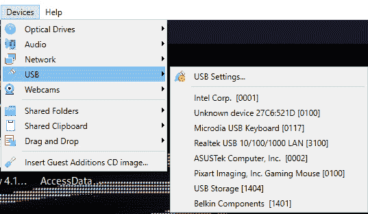

图 8.1 – VirtualBox 管理器设备菜单

1.  在上述步骤中，检测到了八个设备。现在，您可以插入您的 2GB microSD 卡，然后再次点击**设备** | **USB**，查看您的 microSD 卡显示为哪个设备。在下图中，我们可以看到 USB 设备列表中新增了一项条目，**Generic Mass Storage Device [0100]**。点击此条目将设备挂载到 Kali Linux 中。

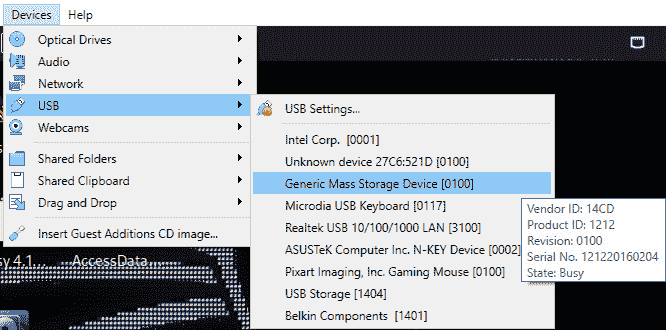

图 8.2 – VirtualBox 管理器 USB 设备菜单

一旦设备被 VirtualBox 识别并在 Kali 中挂载，您应该能在 Kali 桌面上看到设备图标。在以下截图中，我们可以看到 8GB 的 microSD 卡已经挂载并可供 Kali 使用。

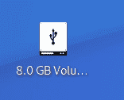

图 8.3 – 存储介质桌面图标

1.  一旦我们的磁盘已挂载，我们现在可以使用 **fdisk** 命令查看驱动器的分区详细信息。

现在我们已成功挂载可移动存储驱动器，在下一节中，我们将学习如何使用 **fdisk** 命令识别设备和分区。

## 使用 fdisk 命令进行设备识别

对于本练习，一张 8GB 的 Sony Pro Duo 卡通过外部 USB 3.0 卡读卡器连接到我的独立 Kali Linux 桌面。你也可以使用任何其他类型的存储介质进行本练习，因为无论使用何种设备，过程完全相同。在开始任何获取过程之前，我们首先会运行 **sudo fdisk -l** 命令，列出所有已连接的存储设备，以便区分它们。这样做是必要的，因为我们将不使用设备所分配的存储设备名称，而是使用其磁盘识别信息。

打开一个新的终端，输入以下命令并按下 *Enter* 键：

```
sudo fdisk -l
```

在以下截图中，主驱动器被列为 **sda**，而附加的 Sony Pro Duo 卡被列为 **sdb**。

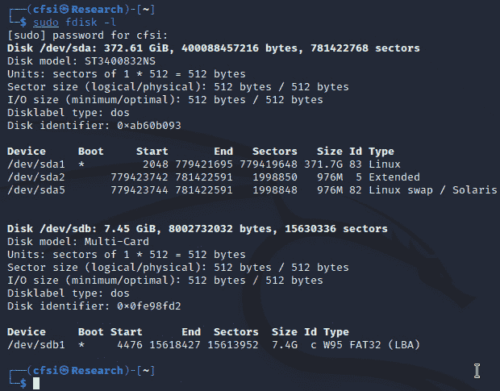

图 8.4 – fdisk –l 命令输出

如上图所示，Sony ProDuo 卡的详细信息如下：

+   **Disk**：**sdb**

+   **Size**：**7.4 GB**

+   **Sector size**：**512 字节**

+   **Filesystem**：**FAT32**

如前面的截图所示，Kali Linux 识别了两个设备：

+   **sda**：包含三个分区的主硬盘

+   **sdb**：需要进行取证获取或镜像的存储驱动器

对于初次接触 Kali 或任何 Linux 版本或变种的用户，可能会发现 Kali 中的驱动器和分区识别及命名规则与 Windows 设备有所不同。

在 Linux 中，典型的设备可以被称为 **/dev/sda**，而在 Windows 中，驱动器通常被识别为 **Disk 0**、**Disk 1**，依此类推：

+   **/dev**：这是指所有可以读取或写入的设备和驱动器的路径，这些设备被 Linux 识别

+   **/sda**：这是指**SCSI**（即**小型计算机系统接口**）、SATA 和 USB 设备

**sd** 代表 **SCSI 大容量存储驱动程序**，后续的字母（例如，a、b 等）表示驱动器编号：

+   **sda**：驱动器 **0**，即第一个识别的驱动器

+   **sdb**：第二个驱动器或存储介质

虽然 Windows 将分区识别为主分区、逻辑分区和扩展分区，但 Linux 分区则是按照驱动器字母后面的数字进行识别的：

+   **sda1**：第一个磁盘（**sda**）上的第一个分区

+   **sda2**：第一个磁盘上的第二个分区

+   **sdb1**：第二个磁盘（**sdb**）上的第一个分区

+   **sdb2**：第二个磁盘上的第二个分区

有关 Linux 设备命名规范的更多信息，请访问 [`www.dell.com/support/kbdoc/en-tt/000132092/ubuntu-linux-terms-for-your-hard-drive-and-devices-explained#:~:text=Under%20Linux%2C%20the%20original%20naming,address%2Dwise%20and%20so%20on`](https://www.dell.com/support/kbdoc/en-tt/000132092/ubuntu-linux-terms-for-your-hard-drive-and-devices-explained#:~:text=Under%20Linux%2C%20the%20original%20naming,address%2Dwise%20and%20so%20on).

现在我们可以识别 Linux 文件系统中的驱动器和分区，接下来让我们学习如何为证据生成哈希，以确保完整性。

# 为证据完整性创建强哈希

为了提供证据未被篡改的证明，必须在法医采集前、期间和之后，对证据驱动器运行加密算法。这些算法会生成一个输出字符串（或哈希输出），该字符串由不同长度的十六进制字符（a–f 和 0–9）组成，具体取决于算法的强度。

常见的加密算法如下：

+   **MD5**：消息摘要 5

+   **SHA-1**：安全哈希算法版本 1

+   **SHA-256**：SHA-2 256 位

注意

有关加密哈希的更多信息，请访问 [`www.tutorialspoint.com/cryptography/cryptography_hash_functions.htm`](https://www.tutorialspoint.com/cryptography/cryptography_hash_functions.htm)。

在 Kali Linux 中，我们可以使用 **md5sum**、**sha1sum** 或 **sha256sum** 命令，后跟设备路径，以生成证据/输入文件的哈希输出。例如，要创建一个 **SHA-256** 哈希，我们可以使用以下命令，其中 **sdx** 表示我们试图采集或映像的驱动器：

```
Sha256sum /dev/sdx.
```

虽然我提到了 **md5sum** 命令，但我建议使用更强的算法，如 **SHA-1** 或 **SHA-256**，因为 **MD5** 是较老的算法，可能会受到攻击：

+   **MD5 强度**：128 位哈希值

+   **SHA-1 强度**：160 位哈希值

+   **SHA-256 强度**：256 位值

+   **SHA-3 强度**：256 位值（但比 SHA-2 更快）

为了对我的 Pro Duo 卡（**sdb**）生成 **MD5** 哈希输出，我使用了以下命令：

```
sudo md5sum /dev/sdb.
```

为了对我的 Pro Duo 卡（**sdb**）生成 **SHA-1** 哈希输出，我使用了以下命令：

```
sudo sha1sum /dev/sdb.
```

为了对我的 Pro Duo 卡（**sdb**）生成 **SHA-256** 哈希输出，我使用了以下命令：

```
sudo sha256sum /dev/sdb.
```

在下面的截图中，我运行了所有前述命令。请注意，**SHA-256** 输出是最长的。

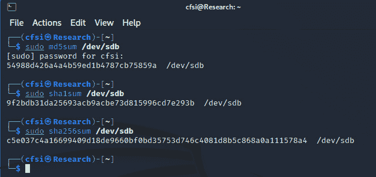

图 8.5 – 加密算法输出哈希值

重要说明

在进行法医采集或法医映像操作时，原始文件的哈希输出必须始终与法医采集的法医映像的输出相匹配，这可以确保证据及证据副本（法医映像）的完整性。

现在我们已经区分了驱动器并确认了要映像的驱动器（**sdb**），我们可以开始使用 DC3DD 进行取证映像。尽管我使用的是一块旧的 8GB Pro Duo 存储驱动器来演示 DC3DD 的使用，但你可以使用任何驱动器（无论是便携式还是其他）来练习本章中的工具。请务必在继续之前使用 **fdisk -l** 命令来识别您的驱动器和分区。

# 使用 DC3DD 获取驱动器

我们将使用的第一个获取工具是 **DC3DD**（由 **国防部网络犯罪中心** 开发）。DC3DD 是非常流行的 **数据转储**（**DD**）工具的一个补丁，用于取证采集和哈希处理。

这些是 DD 的功能：

+   位流（原始）磁盘获取和克隆

+   复制磁盘分区

+   复制文件夹和文件

+   硬盘驱动器错误检查

+   硬盘驱动器的取证擦除或数据的取证及安全删除

每当 DD 更新时，DC3DD 也会更新。DC3DD 提供了 DD 的所有优点，并增加了更多的功能，包括以下内容：

+   即时哈希（或工具即时完成的哈希），使用更多算法选择（**MD5**、**SHA-1**、**SHA-256** 和 **SHA-512**）

+   进度和采集时间监控表

+   将错误写入文件

+   分割输出文件

+   文件验证

+   擦除输出文件（模式擦除）

DC3DD 必须在 Kali Linux 中手动安装。首先，我们将通过使用 **apt-get** **update** 命令更新 Kali Linux 的版本。

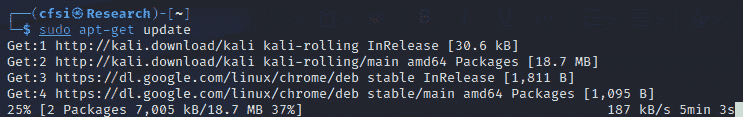

图 8.6 – 更新 Kali Linux

一旦 Kali 更新完成，您可以通过输入 **sudo apt-get install** **dc3dd** 命令手动安装 DC3DD。

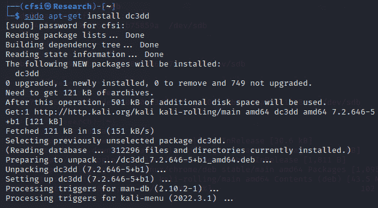

图 8.7 – 安装 dc3dd

DC3DD 是一个 CLI 工具，可以通过首先打开终端并输入 **dc3dd** 在 Kali Linux 中轻松运行。首先，我建议使用 **dc3dd --help** 命令，它列出了与 **dc3dd** 一起使用的可用参数：

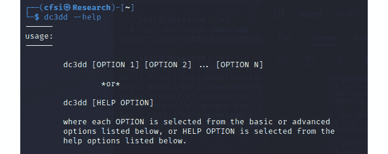

图 8.8 – dc3dd 帮助选项

如前面屏幕截图所示，显示了使用 **dc3dd --help** 命令的情况，DC3DD 命令的典型用法如下所示：

```
dc3dd [option 1] [option 2] ... [option n]
```

为了创建我 8GB 驱动器的取证映像，我在 **dc3dd** 中使用了以下选项：

```
sudo dc3dd if=/dev/sdb hash=sha1 log=dc3dd8gb of=8gbproduo.dd
```

以下屏幕截图显示了前述命令的输出。

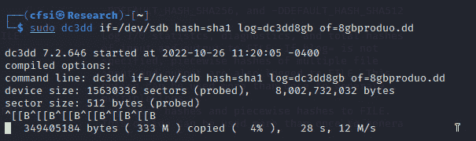

图 8.9 – dc3dd 中的驱动器获取命令

以下列表解释了 *图 8.9* 中显示的屏幕截图的输出：

+   **if**：这指定了 *输入文件*，即我们将要映像的设备。

+   **hash**：这指定了我们将用于完整性验证的哈希算法类型。在这种情况下，我使用了较旧的 **MD5** 哈希。

+   **log**：这指定了日志文件的名称，该文件记录设备和采集的详细信息，包括错误。

+   **of**：这指定了由 DC3DD 创建的取证镜像的输出文件名。虽然在此示例中指定了 **.dd** 镜像文件类型，但 DC3DD 还支持其他格式，包括 **.img**，如稍后示例所示。

应记录设备的大小（以扇区和字节为单位），并在稍后与设备字段的输出结果进行比较。一旦采集过程完成，输入和输出结果将被显示。

在 *图 8.10* 中，最后一行显示了采集过程的进度和状态，显示了已复制的数据量、经过的时间（以秒为单位）以及成像过程的速度（以 Mbps 计）：

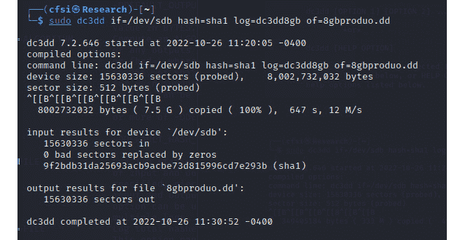

图 8.10 – 完成的 dc3dd 输出

设备或文件越大，所需的采集时间就越长。我建议你去泡杯咖啡或饮品，或者看看 Packt 网站上其他精彩的书籍，链接如下：[`www.packtpub.com/`](https://www.packtpub.com/)。

分析 *图 8.10* 中的结果，我们可以看到相同数量的扇区（**15630336**）已被成像，没有坏扇区被零替换。我们还可以看到为该镜像创建了精确的 **SHA1** 哈希，确保我们创建了没有修改的精确副本。

在终端中，我们还可以使用 **ls** 命令列出目录内容，以确保已经创建了 DC3DD 输出文件（**8gbproduo.dd**）和日志（**dc3dd8gb**）：

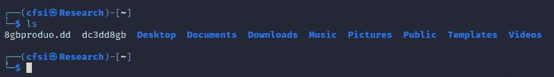

图 8.11 – 使用 ls 命令列出主目录

要访问我们的取证镜像和日志文件，我们可以通过点击桌面左上角的文件夹图标，然后点击 **打开文件夹** 来进入 **/home** 目录。

在 **Home** 文件夹中，第一个文件 **8gbproduo.dd** 是通过 DC3DD 使用 **of=8gbproduo.dd** 命令创建的输出镜像。最后一个文件 **dc3dd8gb** 是日志文件，当我们使用 **log=dc3dd8gb** 命令时创建：

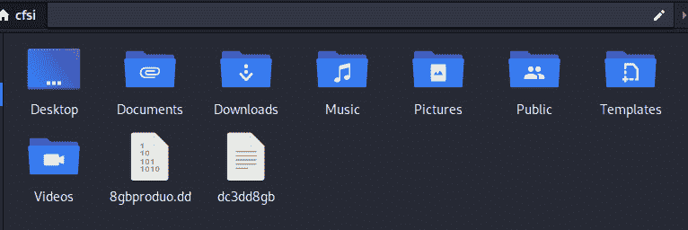

图 8.12 – Home 文件夹中的取证镜像和日志文件

保留此日志文件非常重要，因为它记录了采集过程及其结果，这些结果在完成时会显示在屏幕上：

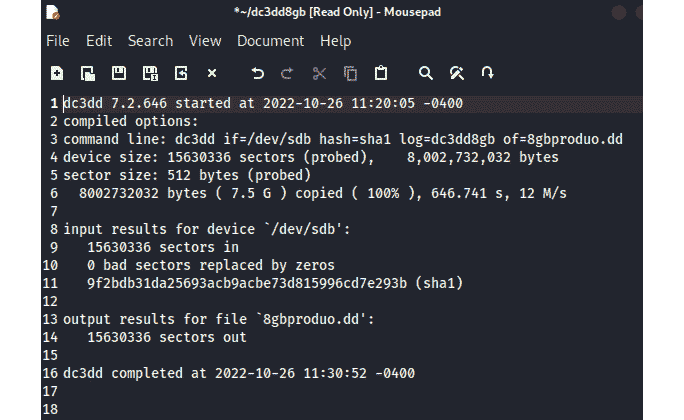

图 8.13 – 日志文件中的内容

在 *第十二章* *Autopsy Forensic Browser* 和 *第十三章* *使用 Autopsy 4 GUI 执行完整的 DFIR 分析* 中，我们将使用 Autopsy 分析已获取的取证镜像；然而，调查员也可以根据需要将获取的证据镜像复制或直接克隆到另一台设备上。

作为示例，我们可以将之前获取的取证镜像（**8gbproduo.dd**）克隆到一个新驱动器上，该驱动器被识别为**sdc**。执行此任务使用的命令如下：

```
dc3dd if=8gbproduo.dd of=/dev/sdc log=drivecopy.log
```

在将镜像复制到驱动器时，目标驱动器的大小应等于或大于镜像文件的大小。

## 验证映像文件的哈希输出

要验证**sdb**的哈希输出，可以使用以下命令：

```
sudo sha1sum /dev/sdb
```

以下截图显示了前一个命令的输出：


图 8.14 – sha1sum 输出

你还可以使用以下命令：

```
cat 8gbproduo.dd | sha1sum
```

以下截图显示了前一个命令的输出：

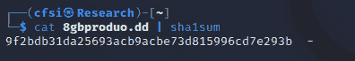

图 8.15 – cat sha1sum 输出

## 使用 DC3DD 擦除驱动器

我们已经看到了 DC3DD 作为一个非常强大的取证采集工具的功能，但我还想更进一步，向你介绍它作为数据擦除工具的能力。

DC3DD 可以通过三种方式覆盖数据并擦除驱动器：

+   使用零填充数据和驱动器。使用的命令如下：

    ```
    dc3dd wipe=/dev/sdb
    ```

以下截图显示了前一个命令的输出：

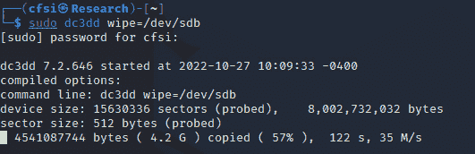

图 8.16 – dc3dd 擦除命令输出

+   使用十六进制模式和**pat**选项进行数据和驱动器的覆盖和填充。使用的命令如下：

    ```
    dc3dd wipe=/dev/sdb pat=10101010
    ```

以下截图显示了前一个命令的输出：

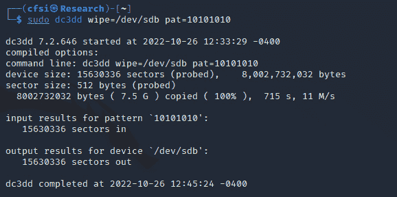

图 8.17 – 使用模式输出的 dc3dd 擦除命令

+   使用文本模式和**tpat**选项进行数据和驱动器的覆盖和填充。使用的命令如下：

    ```
    dc3dd wipe=/dev/sdb tpat=CFSI
    ```

以下截图显示了前一个命令的输出：

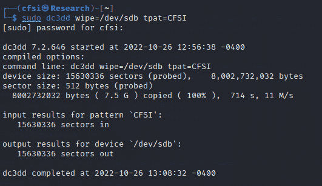

图 8.18 – 使用文本模式输出的 dc3dd 擦除命令

我们已经介绍了**dc3dd**工具的使用及其擦除介质的各种方法。现在让我们来看另一个工具，DD，它也可以用于取证数据复制和擦除。

# 使用 DD 进行驱动器采集

在我们开始使用 DD 之前，我需要再次提醒你注意 DD 的一个特点，即它能够擦除数据、分区和驱动器。因此，你可能会发现 DD 有时被亲切地称为**数据销毁者**。使用 DD 和 DC3DD 时，一定要首先确认你的设备、分区、输入输出文件和参数。

在本章的练习中，我将使用一个较旧但仍可正常使用的 2GB 闪存驱动器进行 DC3DD 采集过程。

如果你还希望使用 DD 工具，其命令和用法与此非常相似。

你可能需要首先确保可以通过运行 **dd –-help** 来访问 dd 工具。如果找不到 **dd** 命令，请通过运行 **apt-get update** 命令来更新 Kali，然后再次运行 **dd –-help** 命令。

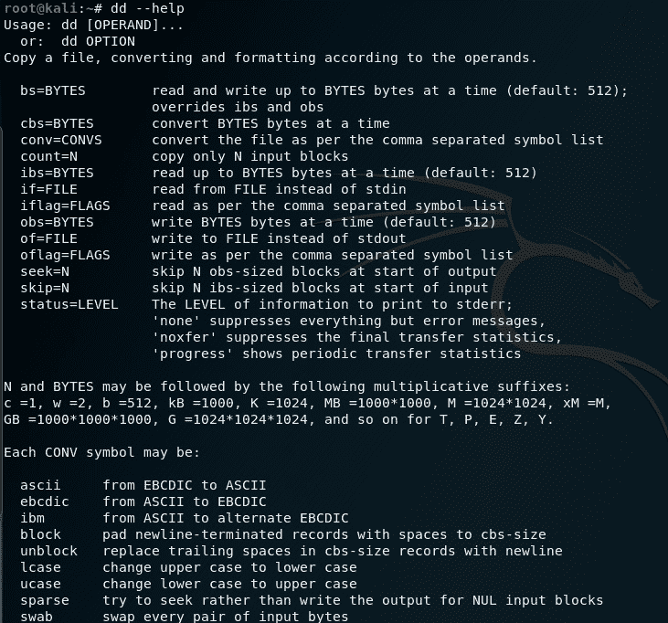

图 8.19 – dd 帮助选项

为了进行镜像获取，我使用了以下命令：

```
dd if=/dev/sdb of=produo8gb.img bs=65536 conv=noerror,sync
```

以下截图显示了前述命令的输出：

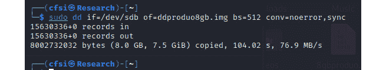

图 8.20 – 使用 dd 进行磁盘获取

让我们分析前述命令中的各个选项：

+   **If**: 输入文件（**sdb** 设备）

+   **Of**: 输出文件（取证镜像的名称）

+   **Bs**: 块大小（默认大小为 512）

+   **conv=noerror, sync**: 即使出现错误也继续进行映像操作（**noerror**），如果出现错误，则将块填充为空（**sync**）。

在前述命令中，指定了 **.img** 输出文件扩展名；然而，你也可以通过在输出文件的 **(****of)** 选项中指定文件扩展名来使用其他格式，例如 **.iso**。

我们可以通过使用 **ls** 命令来查看创建的文件，在这里我们也能看到这两个镜像。

以下截图显示了前述命令的输出：

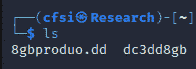

图 8.21 – 主目录中的证据获取文件

我们现在将探索另一个非常流行的获取工具——Guymager，它提供了许多相同的功能，并且具有 **图形用户界面**（**GUI**）。

# 使用 Guymager 进行磁盘获取

Guymager 是另一个独立的获取工具，可用于创建取证镜像，也可以执行磁盘克隆。Guymager 由 Guy Voncken 开发，完全开源，具有许多与 DC3DD 相同的功能，并且仅适用于基于 Linux 的主机。尽管有些调查人员可能更喜欢使用命令行工具，但 Guymager 是一个 GUI 工具，适合初学者，因此可能会被优先选择。

对于这次获取，我将使用与 DC3DD 示例中相同的 2GB 闪存驱动器，在结束时我们可以比较结果。同样重要的是，要记得在获取和创建证据及驱动器的取证镜像时继续使用写保护器，以免向驱动器写入数据或修改原始证据文件。

如同在 DC3DD 获取中所做的那样，我们应该首先确保我们熟悉连接到机器的设备，可以使用 **fdisk -l 或 sudo fdisk -l** 命令。

## 运行 Guymager

可以通过在 Kali 中使用菜单启动 Guymager，点击顶部的 **Applications** 菜单，选择 **11 - Forensics** 选项，然后展开 **Forensic Imaging Tools** 菜单，如下截图所示：

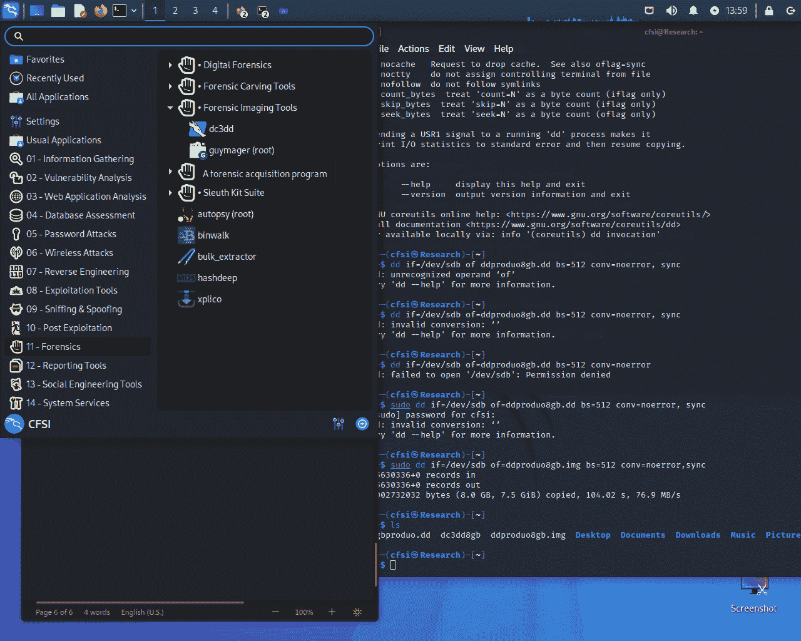

图 8.22 – Kali Linux 取证菜单

Guymager 应用程序启动后，显示在 Kali Linux 中识别的现有驱动器。如以下截图所示，正在使用的 2GB 闪存驱动器的详细信息显示如下：

+   **Linux 设备**：识别为 **/dev/sdb**

+   **型号**：**USB_Flash_Memory**

+   **状态**：显示为 **空闲**，因为图像采集尚未开始

+   **大小**：**2.0GB**

+   **序列号**：**001CC0C60D…**（每个驱动器的序列号都是唯一的）

+   **隐藏** **区域**：**未知**

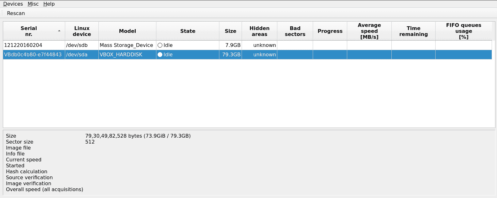

图 8.23 – Guymager 界面

如果你的设备没有出现在 Guymager 中，或者你需要添加一个额外的设备，可以点击应用程序左上角的 **重新扫描** 按钮来检测该设备。

## 使用 Guymager 采集证据

要开始采集过程，右键点击证据驱动器（本例中为 **/dev/sdb**）并选择 **采集镜像**。请注意，如果你希望将证据驱动器克隆到另一个驱动器，还可以选择 **克隆设备** 选项。如前所述，克隆设备时，目标设备的容量必须等于或大于源（原始）证据驱动器的容量：

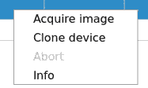

图 8.24 – Guymager 中的采集和克隆选项

在实际采集过程开始之前，调查员会被提示输入他们自己的详细信息以及证据的以下两个部分：

+   **文件格式**：

    +   **文件扩展名**：**.dd**、**.xxx** 和 **.Exx**

    +   **拆分大小**：允许调查员选择多个图像部分的大小

    +   **案件管理信息**：案件编号、证据编号、检查员姓名、描述和备注

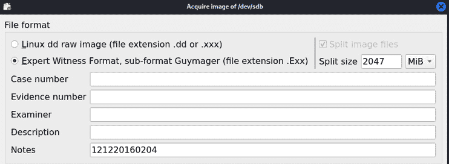

图 8.25 – Guymager 文件格式选项

+   **目标位置**：

    +   **镜像目录**：创建的镜像文件和日志（信息文件）的存储位置

    +   **镜像文件名**：镜像文件的名称

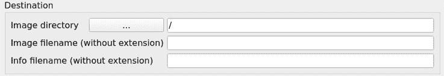

图 8.26 – Guymager 目标文件夹选项

### 哈希计算/验证

可以选择并计算多个哈希算法，允许调查员从 **MD5**、**SHA-1** 和 **SHA-256** 中选择。

**采集后重新读取源以进行验证** 选项用于验证源。

**采集后验证镜像** 选项用于验证目标。

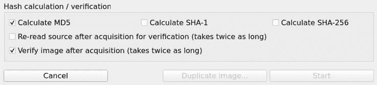

图 8.27 – Guymager 加密算法选项

在 *图 8.27* 的底部，注意有两个灰色选项。

Guymager 增加了一个方便的 **复制镜像...** 按钮（在 *图 8.27* 中为灰色），可以创建镜像的副本，而无需重复输入数据的过程。

对于新用户，您可能需要指定保存图像文件的目录。在目标部分，点击**图像目录**按钮并选择您的位置。对于本次采集，我选择了**桌面**目录作为图像文件和日志/信息文件的保存位置。

以下截图展示了我用于 Guymager 采集的数据，其中选择了**桌面**作为图像目录，并使用了**MD5**和**SHA-1**哈希算法：

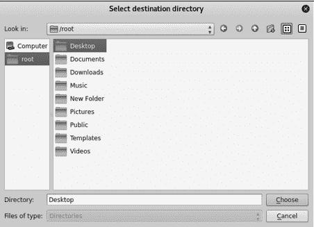

图 8.28 – Guymager 采集图像文件夹选项

一旦点击**开始**按钮（参考*图 8.29*），请注意状态从**空闲**变为**运行中**。**进度**字段现在还显示了进度条：

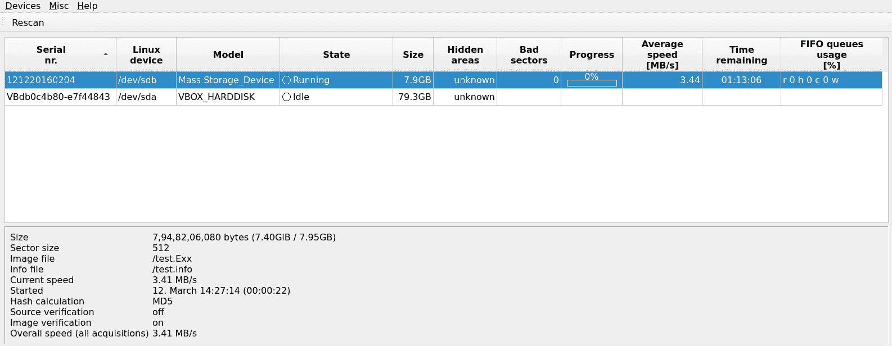

图 8.29 – Guymager 驱动器采集过程

仔细查看屏幕左下角的详细信息，我们可以看到大小、图像和信息文件的路径、名称和扩展名、当前速度，以及选择的哈希计算。我们还可以看到**图像验证**已开启：

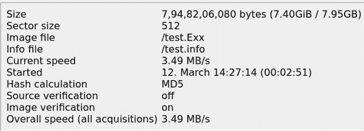

图 8.30 – Guymager 进程详情

一旦采集过程完成，**状态**字段按钮的颜色会从蓝色变为绿色，表示采集过程已完成。如果在**哈希验证/计算**面板中选择了验证选项，它还会显示**完成 - 验证通过**。进度条也会显示**100%**：

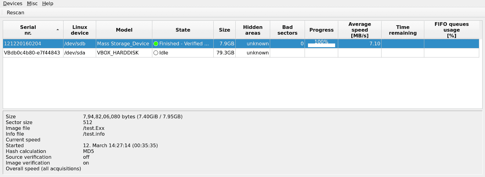

图 8.31 – Guymager 完成的采集过程

我们的输出文件和信息文件可以在桌面上找到，因为这已在证据中指定。接下来，我们将通过验证并比较哈希算法来查看这个过程。

### 探索.info 文件

双击图像目录窗口中的信息文件，可以查看有关采集过程从开始到完成的各种详细信息，包括哈希输出。

这个信息文件包含了比 DC3DD 生成的日志文件更多的数据，包括案件管理的详细信息。

让我们更仔细地查看**.info**文件中的哈希详细信息：

我们可以看到，**MD5**和**SHA-1**哈希已经创建并验证，如以下截图中的最后一行所示：

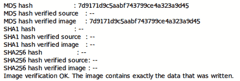

图 8.32 – Guymager 日志文件哈希输出

这完成了使用 Guymager 的证据和驱动器采集过程，相比之前的命令行工具**dc3dd**和**dd**，使用起来要简单得多。

让我们看一下另一个采集工具 FTK Imager，它也可以在 Kali Linux 中使用。

# 使用 FTK Imager 在 Wine 中进行驱动器和内存采集

有几个适用于 Windows 系统的工具，你可能希望利用它们来捕获 Windows 设备上的内存和分页文件。然后，可以在 Kali 机器上使用**Volatility 3**进行内存分析，使用**Autopsy**进行磁盘分析。首先让我们来看一下如何在 Kali Linux 中通过 Wine 安装和使用 FTK Imager。

## 安装 FTK Imager

**FTK**（**Forensic Toolkit**）Imager 是一个免费的 Windows 工具，用于实时获取内存（RAM）、分页文件和磁盘映像。

按照以下步骤在 Kali Linux 中安装 FTK Imager，以创建取证数据：

1.  首先，从官方网站下载 FTK Imager：[`go.exterro.com/l/43312/2022-08-23/f7rytx`](https://go.exterro.com/l/43312/2022-08-23/f7rytx)。在注册页面填写所有相关信息。完成所有字段后，点击**提交**按钮，然后你将被提示下载应用程序。

1.  下载完成后，点击**主页**文件夹图标，然后点击**下载**文件夹，接着选择**打开文件夹**，如图所示：

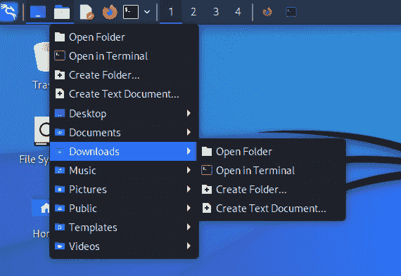

图 8.33 – Kali 文件夹菜单

1.  接下来，右键点击你下载的**AccessData_FTK_Imager**文件，选择**打开方式**，然后选择**使用“Wine Windows 程序加载器”打开**，如以下截图所示。

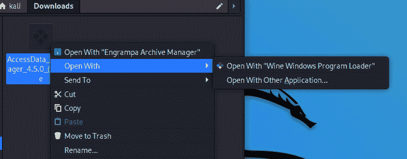

图 8.34 – 在 Wine 中打开 FTK Imager

1.  现在，FTK Imager 将开始在你的 Kali Linux 机器上安装。点击**下一步**继续。

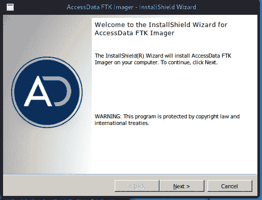

图 8.35 – FTK Imager 安装程序

1.  接受许可协议，点击**下一步**接受目标文件夹，然后点击**安装**按钮。安装完成后，点击**完成**按钮启动 FTK Imager，如图所示。

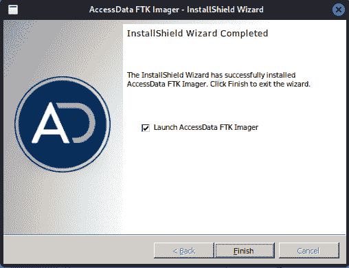

图 8.36 – FTK 安装完成

1.  你可能会被提示下载 Wine Gecko 安装程序，这是某些应用程序正常运行所必需的。点击**安装**继续。


图 8.37 – Wine Gecko 安装程序

现在，FTK Imager 应该已经安装并在你的 Kali Linux 机器上运行。

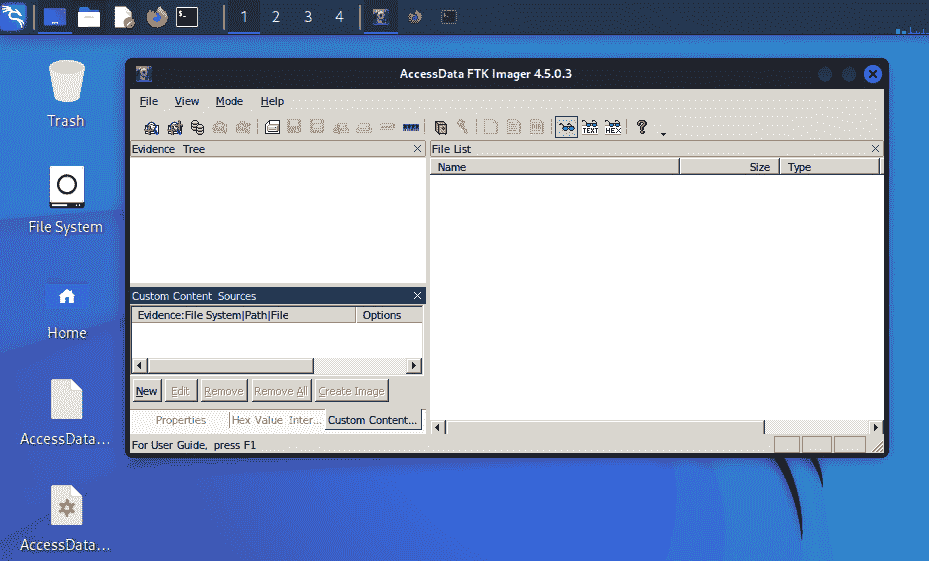

图 8.38 – Kali Linux 中的 FTK Imager 界面

1.  若要查看成像和采集选项，请点击**文件**。

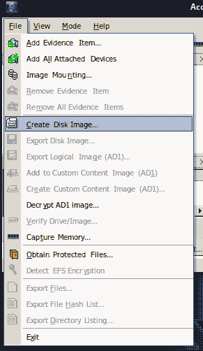

图 8.39 – FTK Imager 文件菜单

1.  在**文件**菜单中，我们可以看到 FTK Imager 提供了多个选项用于证据采集和分析。**创建磁盘映像…**选项允许你对物理和逻辑驱动器、文件夹内容、CD 和 DVD 执行法医采集。点击**创建磁盘** **映像…**选项。

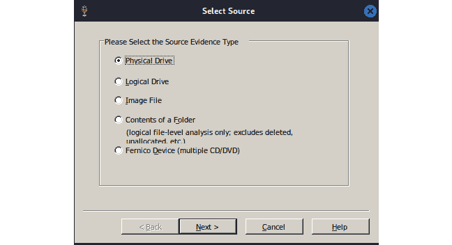

图 8.40 – FTK Imager 源选择选项

1.  点击**下一步**继续。我选择了一个 32 GB 的 Kingston 物理驱动器进行采集。你可以选择任何你想要的驱动器。选定后，点击**完成**。

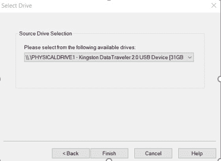

图 8.41 – 源驱动器选择

1.  接下来，我们需要选择一个目标位置来保存映像文件。点击**添加**，选择映像类型（**Raw**、**SMART**、**E01** 或 **AFF**），然后点击**下一步**。

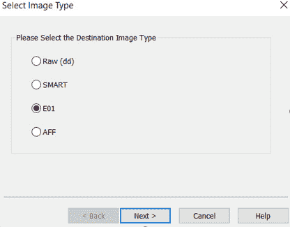

图 8.42 – 映像采集类型

1.  完成表格，填写**证据项目信息**字段，然后点击**下一步**。

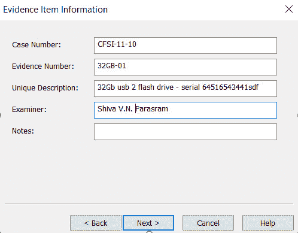

图 8.43 – 采集证据详情

1.  最后，选择映像目标文件夹并输入带扩展名的文件名。

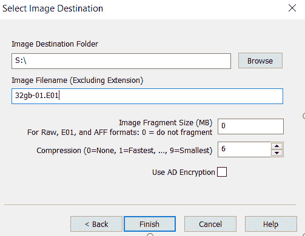

图 8.44 – 映像目标文件夹

我已将映像碎片大小设置为**0**。这意味着软件将不会碎片化或拆分映像文件。点击**完成**，然后点击**开始**以启动采集过程。

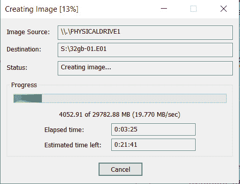

图 8.45 – FTK Imager 证据获取过程

创建的磁盘映像现在可以使用你选择的工具进行分析，例如《法医分析：使用 Autopsy》，该内容将在*第十章*中介绍，*内存取证与 Volatility 3 分析*，以及*第十一章*中，*工件、恶意软件和* *勒索软件分析*。

## 使用 FTK Imager 进行 RAM 采集

我们还可以使用 FTK Imager 执行实时采集，获取 RAM 和页面文件：

1.  点击**文件**和**内存捕获**。

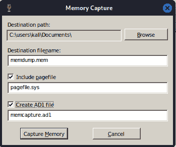

图 8.46 – FTK Imager 内存和页面文件获取过程

1.  接着，选择目标路径，并指定内存转储（**.mem**）文件的文件名。如果要包含页面文件，请勾选**包含** **页面文件**复选框。

1.  点击**捕获内存**以开始采集过程。

状态栏显示进度，表明该过程何时完成。与静态驱动器采集过程相比，这通常不会花费太长时间。在虚拟机中使用可能会遇到问题；但是，你可以在安装了 Wine 的 Kali 独立安装版或任何 Windows 机器上使用此功能。

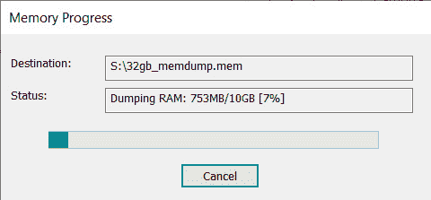

图 8.47 – FTK 内存获取过程

这是使用 FTK Imager 获取 RAM 的一个相对简单的过程。接下来我们来看另一个工具，RAM Capturer，它也可以用于 RAM 获取。

# 使用 Belkasoft RAM Capturer 获取 RAM 和分页文件

**Belkasoft** 是一家创建法医工具的公司，除了提供免费的 RAM Capturer 工具外，还提供完整的法医获取和分析工具套件，该工具可以从 [`belkasoft.com/ram-capturer`](https://belkasoft.com/ram-capturer) 下载。该工具最好在 Windows 上使用，但由于它在进行内存和分页文件分析时的速度和受欢迎程度，这里也提到它。

浏览 https://belkasoft.com/ram-capturer 页面后，点击 **Download Now** 按钮，输入你的电子邮件地址，然后点击 **Proceed**。下载链接的邮件将在 24 小时内发送到你的邮箱。

一旦下载并在你的 Windows 机器上解压，选择合适的版本（**x86** 或 **x64**），然后启动环境。

Belkasoft RAM Capturer 的图形界面非常简单。系统会提示你指定一个输出文件夹路径，点击 **Capture!** 后，它会开始获取内存和分页文件。

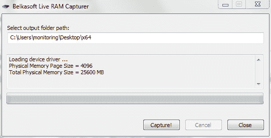

图 8.48 – Belkasoft Live RAM Capturer 获取

该工具需要几分钟来完成获取，之后，你可以使用选择的工具进行哈希计算和分析。这就是我们使用 RAM Capturer 的全部过程，它是用于 RAM 获取的最简单工具之一。

# 总结

在本章中，我们介绍了几种可以在 Kali Linux 中本地使用的工具，以及另一个名为 FTK Imager 的工具，它本地支持 Windows，但一旦安装了 Wine 后也可以在 Kali Linux 中安装，用于获取数字证据。我们首先了解了能够识别设备的重要性，以便能够准确地使用 **fdisk - l** 命令获取证据文件的法医副本或镜像。对于法医分析来说，需要证据的位流副本，因为这些副本提供了证据的精确副本，一比特一比特地复制，这就是为什么我们使用 DC3DD、DD 和 Guymager 等工具的原因。

首先，我们使用了 DC3DD，这是数据转储工具的增强版，并通过终端执行了多个任务，包括设备成像、哈希计算、验证和磁盘擦除。我们还使用 DD 进行获取，DD 与 DC3DD 非常相似。

我们的第三个工具，Guymager，具有内置的案件管理功能，并且与 DC3DD 有许多相似之处，但它是一个图形界面工具，对于初学者来说可能更容易使用。

本章涵盖的所有工具都能提供准确且符合法医标准的结果。对于那些不经常使用 Guymager、DD 和 DC3DD 的用户来说，Guymager 可能是一个更易于使用的工具，因为所有的采集选项，包括克隆，都可以通过 GUI 轻松访问，同时也提供了易于阅读的日志，包含案件管理的详细信息。然而，对于需要高级操作（如磁盘擦除）的用户，可能会希望使用 DC3DD。不过，最终的选择仍然是您的。

我们还查看了 FTK Imager 和 Belkasoft Ram Capturer。FTK Imager 可以在 Windows 上运行，能够获取 RAM 和磁盘镜像，但它也可以通过 Wine 轻松安装在 Kali 上，而 Belkasoft RAM Capturer（同样适用于 Windows）仅进行 RAM 采集。

对于我们在 Kali Linux 中使用的第一批法医工具来说，表现不错！接下来，我们将进入一些分析和文件恢复工具。真是令人兴奋！
