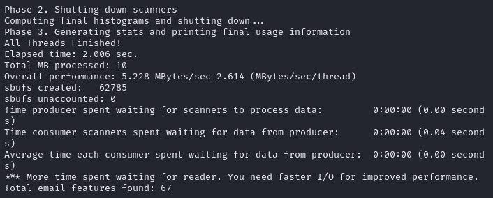
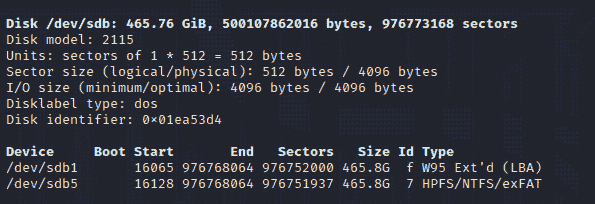

# 第九章：文件恢复和数据雕刻工具

现在我们已经了解了如何创建证据的取证镜像，让我们来看一下文件恢复和数据雕刻过程，使用 Kali Linux 中的特定工具。

文件雕刻通过使用文件结构和文件头等特定特征，从未分配空间中恢复数据和文件，而不是依赖传统的由文件系统创建或与文件系统相关联的元数据。可以将文件雕刻类比为冰雕。它开始时是一个巨大的冰块，当交给一个熟练的人时，可以被雕刻成艺术品。以同样的方式，DFIR（数字取证与事件响应）调查员和分析师可以使用前一章提到的任何工具创建取证镜像，然后使用多种工具从所获取的取证镜像中提取有用的数据和文件。

在本章中，我们将涵盖以下主题：

+   文件基础

+   下载本章实验所需的示例文件

+   使用 Foremost 执行文件恢复和数据雕刻

+   使用 Magicrescue 执行镜像恢复

+   使用 Scalpel 进行数据雕刻

+   使用 **bulk_extractor** 进行数据提取

+   使用 **scrounge_ntfs** 进行 NTFS 恢复

+   使用 Recoverjpeg 进行 JPEG 恢复

# 文件基础

在我们开始实际操作之前，先简要了解一些常见术语。

上一次我们在*第六章*《理解文件系统与存储》中讲解了文件系统时，我们了解到各种操作系统使用自己特定的文件系统来存储、访问和修改数据。存储介质也使用文件系统来完成相同的操作。

**元数据**，即关于数据的数据，帮助操作系统识别数据。元数据包括技术信息，如创建和修改日期以及数据的文件类型。这些数据使文件的定位和索引变得更加容易。

正如其名字所示，**未分配空间**是操作系统或文件表标记为空的存储介质区域，或者是未分配给任何文件或数据的区域。虽然文件的位置和信息可能不存在，甚至可能被破坏，但文件的头部和尾部仍然存在一些特征，可以用来识别文件，甚至是文件的碎片。

即使文件扩展名已更改或完全丢失，文件头仍包含可以识别文件类型的信息，我们可以通过分析头部和尾部信息来尝试雕刻文件。数据雕刻是一个相当漫长的过程，应使用自动化工具来节省时间。如果调查员对正在寻找的文件类型有所了解，能更好地聚焦，也能节省时间。然而，这毕竟是取证，我们知道时间和耐心是关键。

一些常见的文件类型，如在文件头部以十六进制格式显示的文件头信息，包括以下内容：

+   **联合图像专家组（JPEG）**: FF D8 FF E0

+   **便携文档格式（PDF）**: 25 50 44 46

在*第十二章*中将深入分析文件和头部，*第十三章*中则介绍了*使用 Autopsy 进行完整的 DFIR 分析*，使用 Autopsy 工具。首先，让我们下载我们将在 Kali Linux 中用于数据雕刻的示例文件。

# 下载示例文件

在我们开始 DFIR 文件恢复和数据雕刻活动之前，我认为先下载所有示例文件是个好主意，这样我们就可以直接进入使用每个工具的具体操作，而不会被中断。

我们将使用以下网站，这些网站慷慨地向公众提供免费数据集和采集资源。特别感谢所有汇编并投入时间和资源使这些数据集对我们开放的人们：

+   数字取证工具测试镜像：[`dftt.sourceforge.net/`](https://dftt.sourceforge.net/)

+   **计算机取证参考数据集**（**CFReDS**）：[`cfreds.nist.gov/`](https://cfreds.nist.gov/)

+   数字语料库：[`digitalcorpora.org/`](https://digitalcorpora.org/)

+   Foremost 示例文件：[`cfreds-archive.nist.gov/FileCarving/Images/L0_Documents.dd.bz2`](https://cfreds-archive.nist.gov/FileCarving/Images/L0_Documents.dd.bz2)

+   Scalpel：[`prdownloads.sourceforge.net/dftt/11-carve-fat.zip?download`](http://prdownloads.sourceforge.net/dftt/11-carve-fat.zip?download)

+   Bulk Extractor：[`digitalcorpora.s3.amazonaws.com/corpora/drives/nps-2010-emails/nps-2010-emails.E01`](https://digitalcorpora.s3.amazonaws.com/corpora/drives/nps-2010-emails/nps-2010-emails.E01)

尽管我们实验室只会使用上述示例文件，你完全可以从前述网站下载其他示例文件，并尝试使用以下工具进行雕刻。

# 使用 Foremost 进行文件恢复和数据雕刻

Foremost 是一个简单而有效的命令行工具，通过读取文件的头部和尾部来雕刻和恢复文件。我们可以通过点击**应用程序** | **11 - 取证** | **Foremost**来启动 Foremost。但我更倾向于从终端启动 Foremost，并进入存放我们示例采集文件的文件夹，这样可以简化整个过程，避免出错。好了，让我们开始吧：

1.  如果你还没有下载示例取证采集文件，可以通过点击这个链接进行下载：

[`cfreds-archive.nist.gov/FileCarving/Images/L0_Documents.dd.bz2`](https://cfreds-archive.nist.gov/FileCarving/Images/L0_Documents.dd.bz2)

1.  下载该文件后，我建议在**下载**文件夹中右键点击并选择**创建文件夹**，以便创建一个*新文件夹*。我们将这个文件夹命名为**Foremost**。在本章接下来的操作中，我们还将为每个工具创建文件夹，以避免**下载**文件夹凌乱，并且为了确保有一个有序的 DFIR 工作区。


图 9.1 – 带有下载文件夹的文件下载

1.  将**L0_Documents.dd.bz2**文件拖入你刚刚创建的**Foremost**文件夹。默认情况下，**L0_Documents.dd.bz2**文件会被下载到你的**下载**文件夹。下载的文件是压缩的**BunZip (.bz2)**格式，包含一个必须解压的**datadump (.dd)**采集文件。

为了提取**.dd**文件，右键点击**L0_Documents.dd.bz2**文件，然后点击**提取到此处**选项，如图所示。


图 9.2 – 提取下载的文件

现在你应该能在你的**Foremost**文件夹中看到**L0_Documents.dd**证据文件。


图 9.3 – 已提取的图像文件

1.  现在是有趣的部分！点击屏幕顶部的**新建终端**图标，打开一个新终端，开始从我们的法医采集样本中提取和恢复文件。

进入终端后，我们必须使用**cd**命令将工作目录更改为**下载**文件夹中的**Foremost**文件夹。为此，在终端中输入以下命令并按*回车*：

```
cd /Downloads/Foremost
```

重要提示

所有命令都是*区分大小写*的，应该与我输入的完全一致。

1.  接下来，输入**ls**命令来列出并显示文件，以确保我们在正确的目录中，文件也在该目录下。

    ```
    ls
    ```

在下面的截图中，我已经输入了上述命令，并可以看到我们已下载并解压的文件。


图 9.4 – 使用 ls 命令

1.  若想更好地了解 Foremost 及其使用的开关，请尝试浏览**Foremost 系统管理员手册**。可以通过输入以下命令来实现：

    ```
    man foremost
    ```


图 9.5 – Foremost 帮助手册

1.  使用 Foremost 的语法如下：

    ```
    foremost -i (forensic image) -o (output folder) -options
    ```

1.  使用上述格式，输入以下命令和选项，从证据文件中提取文件并恢复到我们选择的文件夹中：

    ```
    foremost -i L0_Documents.dd -o L0_Documents_Recovery
    ```

在这个例子中，我们指定了**L0_documents.dd**文件作为输入文件**(-i)**，并指定了一个名为**L0_Documents_Recovery**的空文件夹作为输出文件**(-o)**。此外，根据需要还可以指定其他开关。


图 9.6 – Foremost 命令输出

尽管前面的输出字符可能难以读取，但雕刻的文件会在指定的输出文件夹中清晰地分类和总结。

1.  要查看我们已雕刻的文件，点击屏幕顶部的 **Home** 文件夹图标，点击 **Downloads** 文件夹，然后点击 **Open Folder**。双击你的 **Foremost** 文件夹，然后打开 **LO_Documents_Recovery** 文件夹。


图 9.7 – Foremost 恢复文件夹

1.  Foremost 已自动为相关文件类型创建了子文件夹。要查看所有已雕刻和恢复的文件列表，可以打开 **audit.txt** 文件。


图 9.8 – audit.txt 文件内容

1.  **audit.txt** 文件告诉我们，共有九个文件被雕刻/恢复，包括图像、MS Office 和 PDF 文档。你可以随意浏览各种子文件夹，以查看雕刻出的文件。


图 9.9 – 恢复的 .xlsx 文档

恭喜你成功完成了第一次 DFIR 恢复！接下来，我们将介绍另一种恢复工具，叫做 Magic Rescue。

# 使用 Magicrescue 恢复图像

**Magicrescue** 是一个较老的工具，但它仍然非常有用，因为它可以快速扫描并恢复某些必须手动指定的文件类型。在这个实验中，我将使用一个 32GB 的 SanDisk 闪存驱动器，它曾包含若干音频、视频和图像文件，这些文件全部被意外删除：

1.  我将首先运行 **fdisk** 命令，通过输入以下内容来查看设备信息：

    ```
    sudo fdisk -l
    ```

以下屏幕截图中的 **fdisk** 命令输出显示，闪存驱动器被识别为 **sdc2**。


图 9.10 – fdisk 命令输出，显示磁盘信息

1.  在继续之前，查看 magicrescue 帮助手册是非常有用的，可以通过输入以下命令来实现：

    ```
    man magicrescue
    ```

以下图示展示了 magicrescue 中的使用选项：


图 9.11 – Magicrescue 使用选项

1.  要运行 magicrescue 并搜索和恢复文件，我们首先需要知道可以恢复哪些文件类型。我已经导航到 **usr** | **share** | **magicrescue** | **recipes** 文件夹，里面显示了 magicrescue 可用的配方或文件类型。这些 *配方*，就是在使用 **magicrescue** 命令时必须手动指定的内容。


图 9.12 – Magicrescue 配方类型

1.  要使用 magicrescue 从我的闪存驱动器恢复 JPEG 文件，该驱动器被识别为 **sdb2**，我将首先在桌面上创建一个名为 **Rescue** 的文件夹，将其设置为保存恢复文件的目标文件夹。

1.  在新的终端中，通过输入以下内容切换到 **Desktop** 目录：

    ```
    cd Desktop
    ```

1.  然后，输入以下命令创建一个新文件夹：

    ```
    mkdir Rescue
    ```

1.  通过输入以下命令切换到**Rescue**目录：

    ```
    cd Rescue
    ```

以下截图显示了切换目录时终端中的输出。


图 9.13 – 切换工作目录

1.  要使用 Magic Rescue 从我的**sdb2**驱动器中恢复文件到桌面上的**Rescue**文件夹，我将输入以下命令，并使用特定的图像文件选项：

    ```
    sudo magicrescue -r png -r jpeg-jfif -r jpeg-exif -d recovered -M io /dev/sdc > logs
    ```

一旦运行，Kali 会输出已恢复文件的详细信息，如以下截图所示。


图 9.14 – Magicrescue 文件切割与恢复

1.  现在我们可以打开桌面上的**Rescue**文件夹来查看恢复的文件。如以下截图所示，几个已删除的图像被快速恢复。


图 9.15 – 切割和恢复的文件

现在让我们继续介绍另一个流行且强大的文件切割工具，名为 Scalpel。

# 使用 Scalpel 进行数据切割

**Scalpel** 是对早期版本的 Foremost 进行改进后创建的。Scalpel 旨在解决 Foremost 在切割数据时出现的高 CPU 和内存占用问题。

与 Foremost 不同，感兴趣的文件类型必须由调查人员在 Scalpel 配置文件中指定。此文件名为**scalpel.conf**，位于**etc/scapel/**目录下：


图 9.16 – Scalpel 配置文件

要指定文件类型，调查人员必须删除包含文件类型的行开头的注释，因为所有支持的文件类型都被井号注释掉。以下截图显示了默认的 Scalpel 配置文件（**scalpel.conf**），其中所有文件类型都被注释掉。请注意，每一行都以井号开始：


图 9.17 – Scalpel 配置文件中的文件类型

我已删除某些行开头的井号，以让 Scalpel 知道搜索这些特定的文件类型；这样也能减少搜索所有支持的文件类型所需的时间。以下截图（*图 9.17*）显示，Scalpel 将搜索 GIF、PNG 和 TIFF 文件，因为注释已经被移除。我还删除了视频、MS Office、电子邮件和 PDF 文件类型前的井号，以允许 Scalpel 搜索更多的文件类型。如果你在保存文件更改时遇到问题，可能需要以具有 root 权限的用户身份进行此操作：

1.  对于这个实验，我们将使用之前下载的**11-carve-fat.dd**证据文件。如果你还没有下载，可以通过点击以下链接现在下载：

[`prdownloads.sourceforge.net/dftt/11-carve-fat.zip?download`](http://prdownloads.sourceforge.net/dftt/11-carve-fat.zip?download)

该文件以 **.zip** 格式下载，必须先解压才能使用。

1.  在 **Downloads** 文件夹中，右键点击 **11-carve-fat.zip** 文件，选择 **Extract Here** 选项，然后将 **11-carve-fat.zip** 文件解压到 **Downloads** 文件夹。

1.  让我们使用终端将目录更改为 **Downloads** 文件夹，就像我们使用 Foremost 时那样，输入以下命令：

    ```
    cd Downloads
    ```

1.  要查看 Scalpel 中可用的选项及其使用方法，输入以下命令：

    ```
    scalpel -h
    ```

如下图所示，使用 **scalpel** 时我们可以进行多种切割和恢复操作。


图 9.18 – Scalpel 使用选项

1.  要对我们的示例证据文件运行 Scalpel，输入以下命令：

    ```
    scalpel -o scalpelOutput/ 11-carve-fat.dd
    ```

以下截图显示了之前使用的命令的输出结果。


图 9.19 – Scalpel 切割命令

以下截图显示了我们刚才使用的命令的继续输出。


图 9.20 – Scalpel 命令输出

在之前的截图中（*图 9.20*），我们可以看到 Scalpel 构建了一个切割列表，显示了文件类型以及头部和尾部信息，并展示了已切割的文件数量。

仔细查看 Scalpel 输出的最后几行，我们可以看到切割过程已完成 100%，共切割了 18 个文件：


图 9.21 – Scalpel 命令输出的一部分

1.  现在我们可以打开 **scalpelOutput** 文件夹查看已切割的文件。Scalpel 输出的结果与 Foremost 类似，两个输出文件夹都包含多个子文件夹，其中存放着切割的文件，并附有一个包含详细发现的 **audit.txt** 文件：


图 9.22 – scalpelOutput 文件夹中的切割内容

到目前为止，我们看到 Foremost、magicrescue 和 Scalpel 在文件切割和数据恢复方面非常出色；然而，它们仅限于特定的文件类型。为了进一步提取数据，我们将介绍另一个工具，称为 **bulk_extractor**。

# 使用 bulk_extractor 提取数据

**bulk_extractor** 工具提取了多种额外类型的信息，这些信息在调查中非常有用。虽然 **bulk_extractor** 相当强大，能够恢复和切割图像、视频和文档文件，但它还能够切割和提取的其他数据类型包括以下内容：

+   信用卡号码

+   电子邮件地址

+   URL

+   在线搜索

+   社交媒体个人资料和信息

对于这个示例，我们将使用一个免费提供的证据文件，名为 **nps-2010-emails.E01**：

1.  **nps-2010-emails.E01** 文件可以直接从数字语料库网站下载，网站允许将法证证据镜像用于法证研究目的。

如果还没有下载，可以在 [`digitalcorpora.s3.amazonaws.com/corpora/drives/nps-2010-emails/nps-2010-emails.E01`](https://digitalcorpora.s3.amazonaws.com/corpora/drives/nps-2010-emails/nps-2010-emails.E01) 下载该文件。

1.  下载完成后，打开新的终端并切换到 **Downloads** 文件夹，就像我们之前做的那样。你可以通过输入以下命令查看可用的选项和用法：

    ```
    bulk_extractor -h
    ```

以下截图展示了之前使用的命令的输出。


图 9.23 – bulk_extractor 使用选项

1.  像 Foremost 和 Scalpel 一样，**bulk_extractor** 的使用语法非常简单，需要指定输出文件夹 (**-o**) 和法证镜像。现在我们使用 **bulk_extractor** 来雕刻证据文件，并将所有发现的文件和信息保存到 **Downloads** 文件夹中的一个名为 **bulk_carved** 的文件夹里，输入以下命令：

    ```
    bulk_extractor -o bulk_carved nps-2010-emails.E01
    ```


图 9.24 – bulk_extractor 命令输出

1.  完成后，**bulk_extractor** 会指示所有线程已完成，并提供过程摘要和一些发现。以下截图的最后一行列出了 67 个找到的电子邮件特征：



图 9.25 – bulk_extractor 输出的片段

1.  为了查看 **bulk_extractor** 的输出和发现，我们可以将目录更改为 **Downloads** 文件夹中的 **bulk_carved** 文件夹，并使用 **ls -l** 命令。以下截图中，我们可以看到几个文本文件，如 **domain_histogram.txt**、**domain.txt**、**email_domain_histogram.txt** 和 **email.txt**，它们包含数据，因为它们的文件大小大于零：


图 9.26 – bulk_extractor 雕刻的文件列表

1.  我们还可以打开 **bulk_carved** 文件夹，双击包含数据的文本文件。请注意，并非所有文件都包含信息。文件大小为 *零* 的文件将不包含任何信息。


图 9.27 – bulk_extractor 输出文件夹中的雕刻文件

让我们查看一下 **email.txt** 文件，如下截图所示。我们可以看到 **bulk_extractor** 雕刻了几个电子邮件地址和附件详细信息。


图 9.28 – 雕刻的 email.txt 文件中的内容

现在我们已经了解了一些最流行的文件雕刻工具，让我们来看一个名为 **scrounge-ntfs** 的文件恢复工具。

# 使用 scrounge-ntfs 恢复 NTFS

**scrounge-ntfs** 是一个小工具，随 Kali Linux 的默认版本以及 **Everything** 元包一起提供。**scrouge-ntfs** 是一个小巧但功能强大的命令行工具，用于恢复格式化为 **NTFS**（即**新技术文件系统**）的驱动器，通常由 Windows 设备使用。大多数存储介质，包括闪存驱动器和存储介质，也可以使用 Windows 系统中的默认格式化工具格式化为 NTFS。

硬盘出现 **MFT**（即**主文件表**）损坏的情况非常常见。该表存储关于所有文件的信息，包括大小、权限、内容和时间戳。如果该表损坏或丢失，驱动器的内容可能无法访问，或者如果驱动器包含可启动的操作系统，它可能无法启动。

无论 NTFS 驱动器因何种原因变得损坏，**scrounge-ntfs** 都是专门为恢复 NTFS 分区内的文件而设计的。对于本实验，我将使用一个格式化为 NTFS 的外部硬盘，并且已删除其中的所有内容：

1.  让我们首先通过运行以下命令来看一下我们的设备在 Kali 中的列出情况：

    ```
    sudo fdisk -l
    ```

以下截图显示了之前输入命令的输出。



图 9.29 – fdisk 输出

如图所示，我的附加驱动器也列为 **sdb**。

1.  在我们开始恢复过程之前，我想在桌面上创建一个名为**Scrounge_recovery**的文件夹，所有**scrounge-ntfs-**恢复的文件将保存在该文件夹中。

为此，我将通过输入以下内容切换到 **Desktop** 目录：

```
cd Desktop
```

1.  然后，我将通过输入以下内容来创建新目录：

    ```
    mkdir Scrounge_recovery
    ```

1.  现在，我将更改输出目录，以避免在输入 **scrounge-ntfs** 命令时每次都指定目录名称，方法是输入以下内容：

    ```
    cd Scrounge_recovery
    ```

以下截图显示了之前输入命令的输出。


图 9.30 – 更改工作目录

请注意在上面的截图中（*图 9.30*），我们可以看到我的当前目录是 **/Desktop/Scrounge_recovery**。

1.  现在，让我们通过输入以下内容查看 **scrounge_ntfs** 的使用情况和选项：

    ```
    Scrounge-ntfs -h
    ```

以下截图显示了之前输入命令的输出。


图 9.31 – scrounge-ntfs 使用选项

1.  让我们通过输入以下内容列出所有驱动器分区：

    ```
    sudo scrounge-ntfs -l /dev/sdb
    ```

以下截图显示了之前输入命令的输出。


图 9.32 – 驱动器详情

现在我们可以看到具体的扇区、簇和偏移量值（我也在这里列出了它们以便清晰说明），我们可以使用前面**scrounge-ntfs -h**输出中指定的格式（*图 9.32*）：

+   **起始** **扇区**：**16128**

+   **结束** **扇区**：**976768002**

+   **簇** **大小**：**8**

+   **MFT** **偏移量**：**24**

1.  **scrounge-ntfs**的默认使用方法如下所示：

    ```
    sudo scrounge-ntfs [-m offset] [-c clustersize] [-o outdir] disk start end
    ```

让我们来逐一分析前面的选项：

+   **-o [outdir]** = 输出目录，用于保存所有恢复的文件

+   **disk** = 要恢复的驱动器

+   **start** = 起始扇区

+   **end** = 结束扇区

1.  对于我的驱动器，命令将如下所示：

    ```
    sudo scrounge-ntfs -m 629456 -c 8 /dev/sdb/ 2048 15726592
    ```

我没有指定输出目录或目录命令，因为我已经在之前创建的**Scrounge_recovery**输出目录中。

1.  一旦你核对过这些值，确保它们正确无误，就按下*Enter*键。


图 9.33 – scrounge-ntfs 命令和输出

在前面的输出中，您可以看到正在恢复的文件。

1.  我现在可以列出**Scrounge_recovery**目录中的所有文件，或者双击桌面上的**Scrounge_directory**以查看我恢复的文件：


图 9.34 – 恢复的文件

正如本节所示，**scrounge-ntfs**是一个非常有用的 NTFS 驱动器和分区恢复工具。接下来我们将介绍本章的最后一个工具——Recoverjpeg，它可以快速恢复图像文件。

# 使用 Recoverjpeg 恢复图像

本章我要介绍的最后一个工具是**recoverjpeg**，顾名思义，它用于恢复 JPEG 图像。这个工具可以快速而轻松地从任何存储介质中恢复已删除的照片。对于本实验，我将使用一只已经格式化的 32GB 闪存驱动器，这只驱动器曾存储着我希望恢复的家庭照片：

1.  我首先会在桌面上创建一个名为**Recoverjpeg**的文件夹，所有恢复的文件都将保存在这个文件夹中。这有助于保持文件的整洁，因为如果不指定一个输出文件夹，所有恢复的文件将被保存在**Home**文件夹或当前工作目录中，这样会使你的工作空间变得凌乱。

在以下截图中，我输入了**cd**命令，后跟**mkdir Recoverjpeg**，以便在桌面上创建这个文件夹：


图 9.35 – 创建输出文件夹

1.  接下来，我将通过输入以下命令来安装**recoverjpeg**工具：

    ```
    sudo apt-get install recoverjpeg
    ```

以下截图显示了先前输入命令的输出。


图 9.36 – 安装 recoverjpeg

1.  请注意，前一截图中的最后一行提示我们按*Y*键以继续安装。按*Y*键后再按*Enter*键继续。

1.  然后，我会通过输入**sudo fdisk –l**来确保 Kali 系统能够识别我的闪存驱动器：


图 9.37 – fdisk 命令输出

在前面的截图中，我们可以看到我的 Cruzer Blade 32GB 闪存驱动器列为**/dev/sdb**。

1.  现在我将通过输入**cd Recoverjpeg**命令，切换到之前创建的**Recoverjpeg**文件夹，在这里所有恢复的文件将被存储：


图 9.38 – 切换到输出目录

1.  要查看 Recoverjpeg 的使用选项，输入**recoverjpeg**：


图 9.39 – recoverjpeg 使用选项

1.  现在我知道了我要从哪个驱动器恢复图片，我使用**recoverjpeg**来扫描并恢复图片，输入以下命令：

```
sudo recover jpeg /dev/sdb
```

以下截图显示了之前输入的命令的输出。


图 9.40 – 使用 recoverjpeg 命令

重要提示

根据驱动器或镜像的大小，这可能需要几分钟时间。一旦恢复完成，recoverjpeg 会显示恢复的文件数量。在*图 8.44*中，我们可以看到总共恢复了 2,021 个文件。


图 9.41 – recoverjpeg 过程完成

恢复的文件保存在桌面上的**Recoverjpeg**文件夹中，但不会保留原始文件名。相反，所有恢复的图片将按数字顺序命名，从**image00000.jpg**开始，如下图所示。


图 9.42 – 输出文件夹中的恢复 jpeg 照片

希望你和我一样觉得这个工具既实用又易于使用。这也标志着我们章节的结束。我鼓励你练习使用这些工具，因为你会发现数据恢复是 DFIR 中最常见的一个方面。

# 总结

在本章中，我们学习了使用 Kali Linux 中的流行开源工具进行文件恢复和数据提取。我们首先使用了非常强大的 Foremost 工具进行文件提取，它从文件头部和尾部提取支持的文件类型，整个下载的取证图像都被提取了出来。然后，我们使用 Magicrescue 和 Scalpel 做了同样的事，但我们需要稍微修改，选择我们希望提取的文件类型。Foremost 和 Scalpel 都生成了**audit.txt**文件，总结了提取列表及其详细信息，并包含了包含实际证据的子文件夹。

**bulk_extractor** 是一款非常棒的工具，它可以提取数据并找到有用的信息，如电子邮件地址、访问过的 URL、Facebook URL、信用卡号码等各种信息。**bulk_extractor** 也非常适合需要文件恢复和数据提取的调查，可以与 Foremost 或 Scalpel 结合使用，甚至两者都可以一起使用。

最后，我们介绍了使用**scrounge_NTFS**和**recoverjpeg**从驱动器而非取证镜像中恢复数据和图像的方法。

现在我们已经讲解了文件雕刻和恢复，接下来我们将转向更具分析性的内容。在下一章，我们将使用非常强大的 volatility，探讨如何作为内存取证的一部分，分析 RAM 和分页文件。到时候见！
