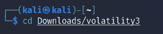
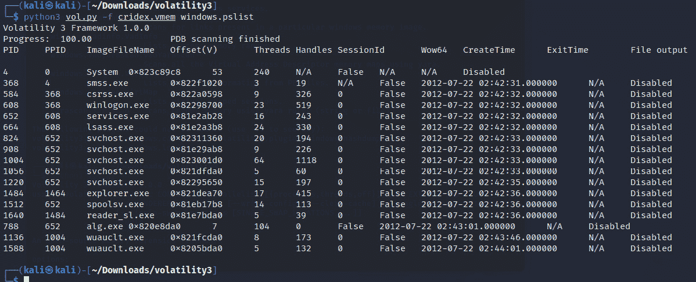

# 第十章：使用 Volatility 3 进行内存取证与分析

在前几章中，我们探讨了数据雕刻和文件恢复的各种方法。在本章中，我们将研究使用非常强大的 Volatility 3 对**随机访问内存**（**RAM**）中存储的内容进行分析。RAM 是易失性的，这意味着当没有电流或电荷传输到 RAM 时，RAM 中的数据会很容易丢失。由于 RAM 中的数据最为易失，它在易失性排序中排得很高，必须作为高优先级进行取证获取和保存。

许多类型的数据和取证物证存储在 RAM 和分页文件中。如前几章所讨论的，登录密码、用户信息、正在运行和隐藏的进程、恶意软件，甚至是加密密码，都是在进行 RAM 分析时可以发现的许多有趣数据之一，这进一步加深了内存取证的必要性。

在本章中，我们将探讨非常强大的 Volatility 框架及其在内存取证中的多种应用，包括以下主题：

+   Volatility 3 的新功能

+   下载用于分析的示例内存转储文件

+   在 Kali Linux 中安装 Volatility 3

+   使用 Volatility 3 进行内存转储分析

# Volatility 3 的新功能

Volatility 框架是一个开源的跨平台事件响应框架，配有许多有用的插件，能够通过内存快照（也称为**内存转储**）为调查人员提供大量信息。Volatility 的概念已经存在了十多年，除了分析正在运行和隐藏的进程外，它也是恶意软件分析中非常流行的选择。

为了创建内存转储，可以使用一些工具，如**Belkasoft RAM Capturer**、**FTK Imager**、**dd**、**dc3dd**、**CAINE**、**Helix**和**LiME**（即**Linux 内存提取器**），这些工具可以获取内存镜像或内存转储（我们之前在*第八章*，*证据获取工具*中做过）并使用 Volatility 框架中的各种插件进行分析。

Volatility 框架可以在任何支持 Python 的**操作系统**（**OS**）上运行，包括 32 位和 64 位操作系统：

+   Windows XP、7、8、8.1 和 Windows 10

+   Windows Server 2003、2008、2012/R2 和 2016

+   Linux 2.6.11-4.2.3（包括 Kali、Debian、Ubuntu 和 CentOS）以及 macOS Leopard（10.5.x）和 Snow Leopard（10.12.x）

Volatility 支持多种内存转储格式（包括 32 位和 64 位），其中包括以下几种：

+   Windows 崩溃和休眠转储（Windows 7 及之前版本）

+   VirtualBox

+   VMware – **.****vmem**转储

+   VMware 保存状态和挂起转储 – **.****vmss**/**.vmsn**

+   原始物理内存 – **.****dd**

+   通过 IEEE 1394 FireWire 进行直接物理内存转储

+   **专家证人格式**（**EWF**）– **.****E01**

+   **QEMU**（**快速虚拟机**）

Volatility 甚至支持不同格式之间的转换，并且宣称能够完成其他类似工具所能完成的所有任务。

在本书的前几版中，我们使用的是基于已废弃的 Python 2 的 Volatility 2。Volatility 3 基于 Python 3，并做出了以下更改：

+   更快的内存转储扫描和处理

+   支持更新的操作系统

+   更高效的插件

+   操作系统特定插件

在开始使用 Volatility 3 之前，首先下载我们将要分析的所有样本内存转储文件。

# 下载样本内存转储文件

本章中，我们将使用一个名为**cridex.vmem**的内存转储文件，通过多种 Volatility 3 插件进行分析。该文件可以从[`files.sempersecurus.org/dumps/cridex_memdump.zip`](http://files.sempersecurus.org/dumps/cridex_memdump.zip)下载。

在[`github.com/volatilityfoundation/volatility/wiki/Memory-Samples`](https://github.com/volatilityfoundation/volatility/wiki/Memory-Samples)上还有许多其他公开可用的图像可以分析。为了练习使用 Volatility 框架并进一步提升你的分析技能，你可以根据需要下载尽可能多的图像，并使用 Volatility 中的各种插件。

首先下载并解压我们的样本内存转储文件，稍后我们将其移至 Volatility 安装文件夹进行分析。如果你还没有下载该文件，请现在下载。

我已经将**cridex.vem**样本文件下载到我的**Downloads**文件夹。要解压文件，请右键点击该文件，然后像之前下载的文件一样点击**Extract Here**。

我们现在将安装 Volatility 3，并将**cridex.vmem**内存转储文件复制到安装文件夹中进行分析。

现在我们已经下载了所有的样本文件，接下来在我们的 Kali 机器上安装 Volatility 3。

# 在 Kali Linux 中安装 Volatility 3

Volatility 不再默认安装在 Kali Linux 中，需要手动安装：

1.  首先从官网[`www.volatilityfoundation.org/releases-vol3`](https://www.volatilityfoundation.org/releases-vol3)下载 Volatility 3。

1.  确保点击**Volatility 3**标签页中的**.zip**文件链接，如下图所示：


图 10.1 – Volatility 下载页面

我选择将文件保存在**Downloads**文件夹中。我还通过右键点击**.zip**文件并选择**Extract Here**来解压文件，如下图所示。


图 10.2 – 解压 Volatility 3 ZIP 文件

注意

我还将解压后的文件夹重命名为**volatility3**，以简化操作。务必准确记下文件夹名称，因为后续会用到。

1.  在安装 Volatility 3 之前，我强烈建议您更新 Kali 安装，以确保所有文件都是最新的。请运行 **sudo apt-get update** 命令来完成此操作。


图 10.3 – 更新 Kali Linux

1.  现在系统已经更新，让我们通过输入以下命令安装 Python 3：

    ```
    sudo apt install python3
    ```

以下截图显示了在安装 Volatility 3 时运行前述命令的输出。


图 10.4 – 在 Kali 中安装 Python 3

1.  Volatility 3 还需要安装一些依赖项才能完全发挥功能。要安装所有必需的依赖项，请输入以下命令：

    ```
    sudo apt install python3-pip python-setuptools build-essential
    ```

以下截图显示了在安装 Volatility 3 时运行前述命令的输出。


图 10.5 – 安装 Volatility 3 依赖项

1.  现在让我们切换到包含所有 Volatility 3 文件的文件夹。在此示例中，我将我的文件夹重命名为 **volatility3**，并将其放在 **Downloads** 文件夹中。要切换到该目录，我将使用以下命令：

    ```
    cd Downloads/volatility3
    ```

以下截图显示了前述命令的输出。



图 10.6 – 更改目录

1.  然后我们可以使用 **ls** 命令列出并显示 **volatility3** 文件夹中的所有文件：


图 10.7 – ls 命令输出

在前述截图中，我们可以看到设置和运行 Volatility 3 所需的所有文件。

1.  在我的 **volatility3** 文件夹中，现在可以通过输入以下命令来安装 Volatility 3：

    ```
    sudo python3 setup.py install
    ```

以下截图显示了在安装 Python 3 时运行前述命令的输出。


图 10.8 – 安装 Volatility 3

1.  现在 Python 3 及所有 Volatility 包和先决条件已经安装完成，我们可以通过输入以下命令来验证安装：

    ```
    python3 vol.py
    ```

以下截图显示了前述命令的输出。


图 10.9 – Volatility 安装验证

Volatility 包含许多插件，您需要不时参考它们。我建议您在另一个终端中打开所有插件的列表，方便参考，因为这样比不断滚动终端顶部查找 Volatility 插件命令要容易得多。

1.  在 **volatility3** 目录中打开一个新的终端，并输入以下命令以查看所有插件：

    ```
    python3 vol.py –h
    ```

以下截图显示了前述命令的输出。


图 10.10 – Volatility 帮助命令

Volatility 3 现在使用针对 Linux、Mac 和 Windows 的**OS 特定**插件，如以下**python3 vol.py –h**输出的片段所示：


图 10.11 – Volatility 3 中的 OS 特定插件

1.  在开始分析我们之前下载的**cridex.vmem**样本内存转储文件之前，让我们将文件从当前目录（**Downloads** 文件夹）复制并粘贴到**volatility3**文件夹中。这样做可以让我们在每次使用插件时，避免每次都指定文件的长路径，方便访问内存转储文件。

1.  保持之前的终端窗口打开，让我们打开一个新终端并切换到我们的**volatility3**文件夹，然后执行**ls**命令，确保我们的**cridex.vmem**内存转储样本可以在该目录中找到，如下图所示。


图 10.12 – volatility3 目录的内容

这里是激动人心的部分，让我们使用 Volatility 3 进行一些 DFIR 分析，看看能发现什么！

# 使用 Volatility 3 进行内存转储分析

对于那些可能已经阅读过本书早期版本，或者熟悉使用 Volatility 2 的读者，你们会发现 Volatility 3 在插件方面有所不同。你们还可能注意到，插件工作的速度在 Volatility 3 中也更快了。

在本次实验中，我们将采用非常结构化的方法使用 Volatility 3 中的各种插件。我们首先查看进程和服务识别，收集一些用户信息，查看注册表信息，发现设备上可能运行的恶意软件。

使用 Volatility 3 非常简单。一旦你进入 Volatility 目录，使用插件的命令基本相同，只是插件名称不同。

语法如下：

```
python3 -f (dump name) (OS.plugin)
```

在前面的例子中，**-f**指定了转储文件的文件名，在我们的案例中是**cridex.vmem**，而**OS.plugin**将是我们希望针对内存转储运行的插件。让我们将**info**插件作为我们的第一个分析任务。

## 图像和操作系统验证

尽管在 Volatility 3 中不再需要，但识别创建内存转储的设备的操作系统版本依然很有用，以确保我们使用正确的插件，因为这些插件现在是针对不同操作系统的，这一点我们在本章前面已经学过。

让我们通过使用**info**插件来找出系统上运行的是哪个操作系统：

```
python3 vol.py -f cridex.vmem windows.info
```

以下截图展示了前述命令的输出。


图 10.13 – Volatility 3 info 插件输出

**info**插件的输出很长；然而，我已在下图中包含了部分输出，我们可以看到该内存转储是从 Windows XP Service Pack 3 机器上获取的：


图 10.14 – info 插件输出片段

这告诉我们，必须仅对这个转储使用 Windows 插件进行分析。现在让我们尝试识别正在运行的进程和服务。

## 进程识别与分析

让我们正式开始 DFIR 内存转储分析，尝试识别和关联连接的进程、它们的 ID、启动时间以及内存映像中的偏移位置。我们将使用几个插件，但首先使用以下三个插件来开始：

+   **pslist**

+   **pstree**

+   **psscan**

### pslist 插件

该工具不仅显示所有正在运行的进程列表，还提供有用的信息，如**进程 ID**（**PID**）和**父进程 ID**（**PPID**），并显示进程启动的时间。

运行**pslist**插件的命令如下：

```
python3 vol.py -f cridex.vmem windows.pslist
```

在以下截图中，我们可以看到**System**、**smss**、**csrss**、**winlogon.exe**、**services.exe**、**lsass.exe**、**svchost.exe**和**explorer.exe**服务首先启动，随后是其他一些服务。注意到任何可疑的服务吗？



图 10.15 – pslist 插件输出

PID 标识进程，PPID 标识进程的父进程。从**pslist**输出中，我们可以看到**winlogon.exe**进程的 PID 是**608**，PPID 是**368**。**services.exe**和**lsass.exe**进程（紧随**winlogon.exe**进程之后）的 PPID 均为**608**，这表明**winlogon.exe**实际上是**services.exe**和**lsass.exe**的 PPID。

对于那些刚接触 PID 和进程的人，快速的 Google 搜索可以帮助识别和描述相关信息。熟悉许多启动进程也非常有用，这样可以迅速指出那些可能不寻常或可疑的进程。

进程的时间和顺序也应注意，因为这些信息可能对调查有帮助。如果我们稍微向下滚动，可以看到**explorer.exe**的 PID 是**1484**，它是**reader_sl.exe**的 PPID。

让我们使用**pstree**插件进一步深入分析。

### pstree 插件

另一个可用于列出进程的命令是**pstree**插件。这个插件显示的进程列表与**pslist**插件相同，但还使用缩进来标识子进程和父进程。

通过输入以下命令运行**pstree**插件：

```
 python3 vol.py -f cridex.vmem windows.pstree
```

在下面的截图中，星号代表树形结构。一个星号表示 PID，而多个星号表示它是子进程。


图 10.16 – pstree 插件输出

让我们查看第一个星号，它代表 PID 为 **386** 的 **smss.exe** 进程。我们可以看到在该进程下，有其他进程显示为多个星号，并且它们的 PPID 是 **386**，表示它们是 **smss.exe** 的子进程。类似地，如果我们进一步查看，我们会发现 PID 为 **1484** 的 **explorer.exe** 是 PPID 为 **1484** 的 **reader_sl.exe** 的父进程。适应这种格式需要一些时间，但它有助于简化 DFIR 分析中的父子进程关系。

### psscan 插件

**psscan** 命令显示了非活动甚至隐藏的进程，这些进程可能被恶意软件（如 rootkits）利用，且以此方式逃避用户和杀毒程序的发现。

让我们通过输入以下命令运行 **psscan** 插件：

```
python3 vol.py -f cridex.vmem windows.psscan
```

以下截图显示了运行 **psscan** 插件时前述命令的输出。


图 10.17 – psscan 输出

到目前为止，似乎没有什么特别的，我们继续深入分析。

### modscan 插件

**modscan** 插件显示内存映像中所有模块的列表。这有助于我们识别进程、系统文件和**动态链接库**（**DLL**）文件的路径和目录。

通过输入以下命令运行 **modscan** 插件：

```
python3 vol.py -f cridex.vmem windows.modscan
```

如下截图所示，**modscan** 插件列出了在之前的进程扫描中未显示的所有正在运行的模块。


图 10.18 – modscan 插件输出

让我们继续查看。

### getsids 插件

所有用户也可以通过 **安全标识符**（**SID**）唯一标识。**getsids** 命令具有四个非常有用的项目，按进程启动的顺序排列（请参考 *图 10.15* 和 *图 10.16* 中的 **pslist** 和 **pstree** 命令截图）。

**getsids** 命令输出的格式如下：

**[进程] (PID) [****SID] (用户)**

列表中的第一个结果例如列出了以下内容：

**系统 (4) : S – 1 – 5-** **18 (用户)**

其中：

+   **系统** 是进程

+   **(4)** 是 PID

+   **S - 1 - 5- 18** 是 SID

+   **用户** 是本地系统

要运行 **getsids** 插件，请输入以下命令：

```
python3 vol.py -f cridex.vmem windows.getsids
```

以下截图显示了运行 **getsids** 插件时前述命令的输出。


图 10.19 – getsids 插件输出

如果我们继续向下滚动，可以看到 **reader_sl.exe** 进程是由名为 Robert 的用户启动的，SID 为 **S-1-5-21**。


图 10.20 – getsids 输出片段

### envars 插件

让我们继续使用**envars**插件进行分析，它显示进程环境变量，并将所有进程与路径和用户很好地映射。

通过键入以下内容运行**envars**插件：

```
python3 vol.py -f cridex.vmem windows.envars
```


图 10.21 – envars 插件输出

滚动浏览冗长的输出，直到看到**reader_sl.exe**进程，我们可以找到一些关于该进程、路径和目录、计算机名称架构、驱动器信息和临时文件位置的非常有用的信息。很有价值的内容。


图 10.22 – envars 输出片段

让我们做一些注册表分析，看看能得出什么结果。

### hivelist 插件

**hivelist**插件列出了在内存转储时存在的注册表蜂巢，并会显示已登录用户。**hivelist**命令显示了虚拟和物理地址的详细信息，以及易于阅读的明文名称和位置。

要运行此插件，请键入以下内容：

```
vol.py -f cridex.vmem windows.registry.hivelist
```

以下截图显示了运行**hivelist**插件时前述命令的输出结果。


图 10.23 – hivelist 插件输出

### 密码转储

**Security Accounts Manager**（**SAM**）文件的位置也通过**hivelist**插件列出，如下图所示（*图 10.24*）。**SAM**文件包含 Windows 机器中用户名的哈希密码。**SAM**文件的路径在以下截图中可以看到：**Windows\system32\config\SAM**。在系统开机时，Windows 用户无法访问此文件。可以进一步使用该文件中的哈希密码，通过使用字典和如 John the Ripper 等密码破解工具（也可以在 Kali Linux 中找到）来破解密码：


图 10.24 – SAM 文件位置

让我们使用**userassist**插件进一步展开分析。

### userassist 插件

**userassist**插件显示更多的注册表信息，正如我们在以下截图中看到的，它提供了关于用户、文件位置、访问的文件和时间戳的更多细节。

要运行**userassist**插件，请键入以下内容：

```
python3 vol.py -f cridex.vmem windows.registry.userassist
```

以下截图显示了运行**userassist**插件时前述命令的输出结果。


图 10.25 – userassist 插件输出

最后，在本章中，让我们看看是否能找到任何恶意代码或应用程序。

### malfind 插件

正如其名所示，**malfind**插件扫描转储文件以查找任何恶意嵌入的代码。在*第十一章*《伪造物、恶意软件和勒索软件分析》中，我们将更详细地讨论这一点，但让我们看看是否能在当前的 DFIR 调查中找到任何嵌入的代码。

要运行**malfind**插件，输入以下命令：

```
python3 vol.py -f cridex.vmem windows.malfind
```

以下截图显示了运行**malfind**插件时的前述命令输出。


图 10.26 – malfind 插件输出

这个插件稍微复杂一些，但一旦理解了基础内容，它就非常有用。我们需要关注的列名如下：

+   **PID**

+   **进程**

+   **提交内容**

+   **私有内存**

让我们更仔细地查看**malfind**输出中的**reader_sl.exe**详细信息，如下所示。


图 10.27 – malfind 代码片段

让我们分析前面**malfind**代码片段的第一行输出：

+   **PID**: **1640**

+   **进程**: **reader_sl.exe**

+   **提交内容**: **PAGE_EXECUTE_READWRITE**

+   **私有内存**: **33**

+   **文件** **输出**: **1**

在前面的输出中，我们看到**reader_sl.exe**是可执行代码，并且在内存中写入了隐藏代码。我们将在下一章深入探讨恶意软件分析。

# 摘要

在本章中，我们探讨了使用 Volatility 3 框架中众多插件之一进行内存取证和分析。我们成功地进行了进程、注册表、DLL，甚至恶意软件分析，使用了这个多功能的工具。正如我们所见，Volatility 可以在 DFIR 分析中执行几个重要功能，应该与我们之前使用的其他工具一起使用，以进行深入和详细的取证分析和调查。

一定要下载更多公开可用的内存镜像和样本，来测试你在这一领域的技能。尽可能多地尝试各种插件，当然，一定要记录你的发现，并考虑在线分享它们。

接下来，我们将更加深入地探讨 Volatility，并进行勒索软件分析，使用更多工具来发现和分析各种 DFIR 伪造物。下章见！
