# 第十一章：痕迹、恶意软件和勒索软件分析

在本章中，我们将介绍几种不同的工具，用于揭示各种数字痕迹、恶意软件和勒索软件，其中一些驻留在 RAM 和交换文件中，正如我们在上一章中学到的，这在 DFIR 调查中非常有用。

首先，我们将探讨使用像 p0f 这样的工具进行痕迹分析，以识别设备和操作系统，使用 swap_digger 进行交换文件分析，然后使用 MimiPenguin 进行密码转储。接下来，我们将深入了解使用 pdf-parser 和 PDFiD 进行 PDF 恶意软件分析，使用混合分析进行恶意文件分析，最后通过使用 Volatility 3 进行勒索软件分析来结束。

本章将涵盖以下主题：

+   使用 p0f 识别设备和操作系统

+   查看 swap_digger 工具以探索 Linux 痕迹

+   使用 MimiPenguin 进行密码转储

+   PDF 恶意软件分析

+   使用混合分析进行恶意文件分析

+   使用 Volatility 3 进行勒索软件分析

# 使用 p0f 识别设备和操作系统

让我们从**p0f**开始。p0f 是一个小工具，可以用于被动扫描和检测网络中的操作系统。此扫描工具被认为是被动的，因为它不会向其他主机发送数据，除非**同步**（**SYN**）数据包。这在 DFIR 调查中静默收集其他主机信息时非常有用。

让我们看看如何安装并使用 p0f 来检测网络上的其他主机操作系统：

1.  根据您运行的 Kali 版本（2019.3 – 2023.1），您可以运行**p0f –h**命令以确定是否已预安装该工具。如果没有，Kali 会询问您是否要安装它。按*y*接受并安装，如以下截图所示。

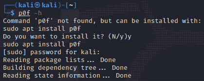

图 11.1 – 在 Kali 中安装 p0f

1.  安装后再次运行**p0f –h**命令。此命令将显示网络接口选项、操作模式、输出设置和性能相关选项。

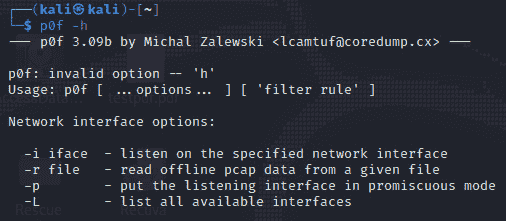

图 11.2 – p0f 使用选项

1.  一旦确认安装，您可以指定要使用的接口（如果您知道选择哪个接口）。通过输入以下命令来检查您的网络接口：

    ```
    ifconfig
    ```

以下截图显示了前面提到的**ifconfig**命令的输出。

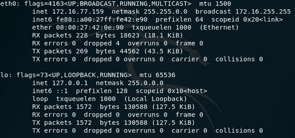

图 11.3 – ipconfig 命令输出

注意

您还可以使用**p0f –L**命令列出所有接口。

1.  *图 11.3*中的输出显示我有两个接口，其中**eth0**是我的以太网/LAN 接口，IP 为**172.16.77.159**，默认**127.0.0.1**环回地址。我将使用**eth0**接口和**p0f**，通过输入以下命令：

    ```
    sudo p0f -i eth0
    ```

以下截图显示了前面命令的输出。

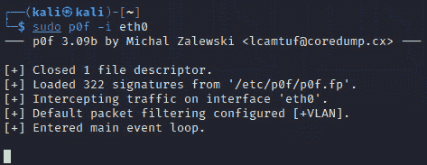

图 11.4 – p0f eth0 输出

这可能需要一些时间来运行，但在以下截图中，我们可以看到输出返回了客户端的详细信息，如 IP 地址和操作系统。

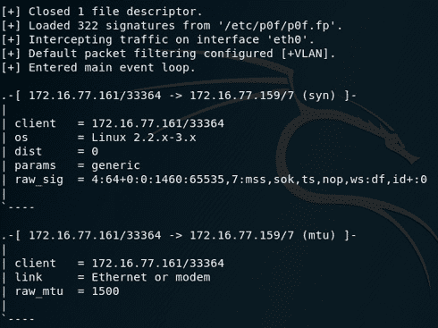

图 11.5 – p0f 结果输出

让我们进一步探索，通过打开浏览器检测我们可能正在与哪些其他主机进行通信。

1.  在 Kali 中打开 web 浏览器，你将看到终端窗口显示更多的 IP 信息。默认情况下，Firefox 浏览器的主页会将我们引导至 Offensive Security 网站，因此 p0f 会显示关于连接和网络跳转到服务器的信息，以及关于服务器的信息。

1.  尝试浏览一个网站。我已经在浏览器中打开了 [www.cfsi.co](http://www.cfsi.co)。**p0f** 会实时更新终端中的信息，显示的第一条记录显示了来自 **172.16.77.159**（我的 Kali 机器）到 **185.230.60.211** 通过端口 **80** 的 SYN 请求。我还可以看到关于我的 Kali 机器的信息，比如操作系统（**Linux 2.2-3.x**），这是 p0f 识别出的指纹：

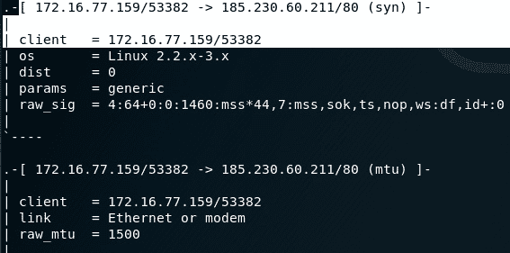

图 11.6 – 浏览后更新的 p0f 输出

1.  让我们获取有关 IP 地址 **185.230.60.211** 的更多信息。在终端窗口中，点击 **文件** | **新建标签页**。在新标签页中，输入以下内容：

    ```
     whois 185.230.60.211
    ```

在以下 **whois** 输出中，我们可以看到该 IP 地址指向 **wix.com**，这是 [www.cfsi.co](http://www.cfsi.co) 网站的主机：

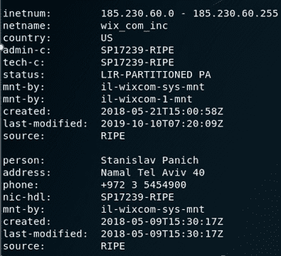

图 11.7 – whois 输出

1.  滚动查看 **p0f** 输出，查看其他一些信息，包括服务器的正常运行时间及其他 IP 地址和中转节点：

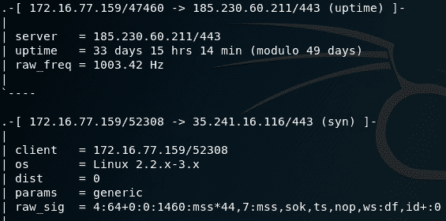

图 11.8 – 额外的 p0f 输出

现在我们已经学会了如何安装并使用 p0f 来检测我们的设备正在与哪些操作系统通信，接下来让我们了解另一个工具 **swap_digger**，用于探索 Linux 工件。

# 查看 swap_digger 工具以探索 Linux 工件

**swap_digger** 工具对 Linux 交换文件进行自动化分析，能够提取如系统密码、用户名、表单凭证等工件，甚至是 Wi-Fi 信息，如 SSID，甚至可能是存储在交换文件中的密码。

## 安装和使用 swap_digger

按照以下步骤安装并使用 **swap_digger** 进行交换分析：

1.  在终端中切换到桌面目录，并通过输入以下命令将 **swap_digger** 克隆到桌面：

    ```
    git clone https://github.com/sevagas/swap_digger.git
    ```

以下截图显示了安装 swap_digger 命令的输出。

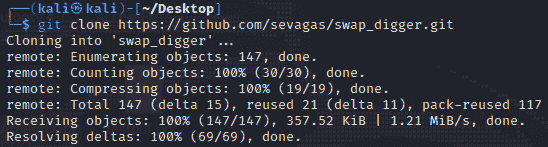

图 11.9 – 安装 swap_digger

1.  输入 **cd swap_digger** 切换到 **swap_digger** 目录，然后输入以下命令以确保 swap_digger 拥有所需的访问权限：

    ```
    chmod +x swap_digger.sh
    ```

1.  要查看所有 **swap_digger** 使用选项，输入以下命令：

    ```
    sudo ./swap_digger.sh -h
    ```

以下屏幕截图显示了前述命令的输出。

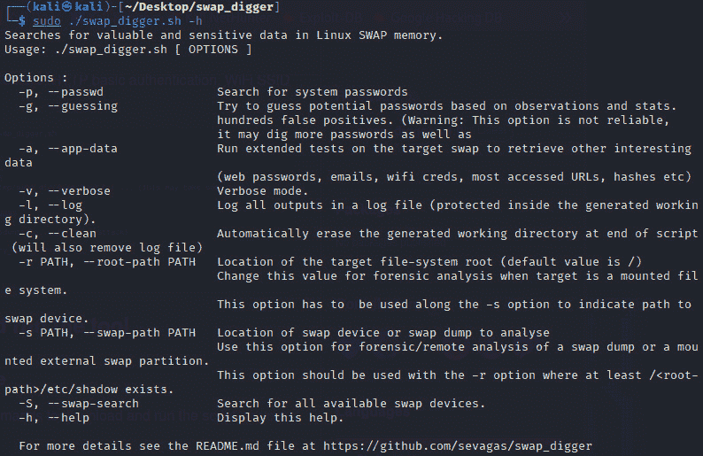

图 11.10 – swap_digger 使用选项

1.  要尝试在交换文件中查找密码，输入以下命令：

    ```
    sudo ./swap_digger.sh -p
    ```

以下屏幕截图显示了前述命令的输出。

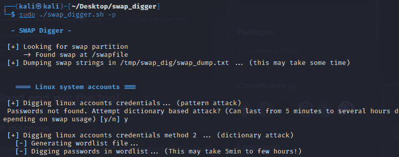

图 11.11 – 使用 swap_digger 查找密码

1.  随时尝试 **swap_digger** 中的其他可用选项，发现 Linux 系统交换文件中的其他工件。

接下来，让我们看看如何使用 **MimiPenguin** 工具进行密码转储。

# 使用 MimiPenguin 进行密码转储

**MimiPenguin** 工具基于非常流行的密码破解工具 Mimikatz。与 **swap_digger** 类似，**MimiPenguin** 也可以通过转储内存进程来检索在内存中运行的工件，这些工件可能包含未加密的明文密码，如以下步骤所示：

1.  首先，我们从当前位置切换到 **Desktop** 文件夹，然后在新的终端中输入以下命令，将 **MimiPenguin** 克隆到桌面：

    ```
    git clone https://github.com/huntergregal/mimipenguin
    ```

以下屏幕截图显示了安装 MimiPenguin 时前述命令的输出。

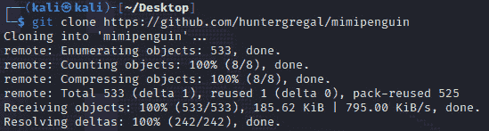

图 11.12 – 安装 MimiPenguin

1.  输入 **cd mimipenguin** 切换到 **mimipenguin** 目录，然后输入 **ls** 显示其中的文件。

以下屏幕截图显示了前述 **ls** 命令的输出。

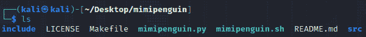

图 11.13 – 查看 mimipenguin 文件夹内容

1.  输入以下命令运行 MimiPenguin：

    ```
    sudo ./mimipenguin.sh
    ```

可能需要一些时间才能找到密码。为了节省时间，我已经将密码更改为一个非常简单的密码：

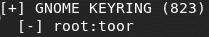

图 11.14 – MimiPenguin 输出显示密码

现在我们已经学会了如何使用 MimiPenguin 转储密码，让我们更进一步，手动分析 PDF 文档中的嵌入式恶意软件。

# PDF 恶意软件分析

在这一部分，我们将看看 PDF 恶意软件取证和分析。PDF 可能是最常见的共享信息文档格式，因为很多人宁愿打开 PDF 文件而不是 Office 文档，如 **.docx** 或 **.xls** 格式的文件，因为后者更可能包含宏甚至病毒。尽管 PDF 是更受信任的文档类型，但仍然常见一些被恶意软件感染或包含隐藏信息的文件。

虽然我们不会分析恶意 PDF 文件，因为这可能导致系统感染或出现不良后果，但我仍然会向你介绍一个叫做 **pdf-parser** 的工具，它可以用来检查 PDF 文档的元素并找出恶意代码和其他可疑元素。

这可能被认为是一个高级工具，因为通常只有具有编程经验的人才会使用它来识别 shellcode、流和过滤器。然而，即使是初学者也能够分析输出结果并识别嵌入的可执行文件 (**.exe**) 文件。网络上和 Twitter 上有一些 PDF 恶意软件样本在流传，但我还是建议你不要尝试下载这些文件，除非你是专业人士，并且是在隔离环境下的沙盒机器上进行操作，确保如果感染，数据或网络不会受到损害。

让我们开始学习如何使用 pdf-parser 分析 PDF 文档：

1.  首先，让我们通过输入以下命令查看 pdf-parser 的使用方法和可用选项：

    ```
    pdf-parser -h
    ```

以下截图展示了前述命令的输出结果。

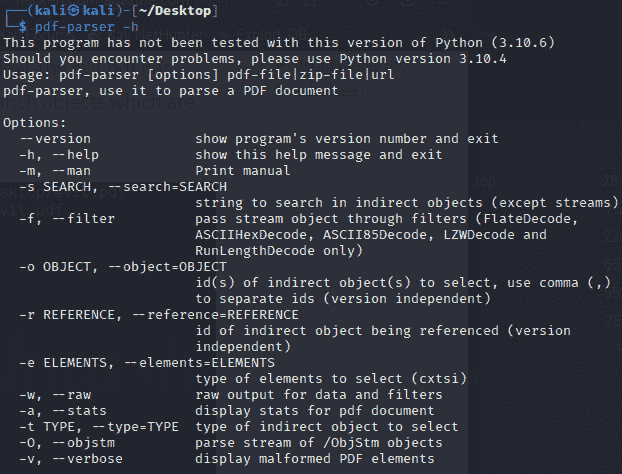

图 11.15 – pdf-parser 使用选项

1.  接下来，让我们查看 Didier Stevens（[`blog.didierstevens.com/about/`](https://blog.didierstevens.com/about/)）创建的测试文件的相关统计信息，我将该文件重命名为 **testpdf.pdf** 并保存在桌面上。我们可以通过输入以下命令分析这个文件，判断它是否包含嵌入代码或隐藏的恶意软件：

    ```
    pdf-parser -a testpdf.pdf
    ```

在以下截图中，我们可以看到，实际上确实有一个嵌入文件，这个文件也可能是一个 JavaScript 文件。

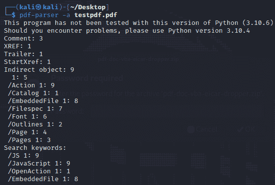

图 11.16 – pdf-parser 结果

1.  让我们使用 **-f** 选项应用过滤器，深入挖掘，看看 **pdf-parser** 是否能够识别嵌入的文件，使用以下选项：

    ```
    pdf-parser -f testpdf.pdf
    ```

在以下截图中，我们可以确认这确实是一个嵌入文件。这个文件是一个名为 **eicar-dropper.doc** 的 Word 文档，它被嵌入在 PDF 文件中。

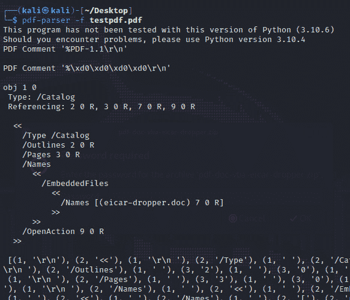

图 11.17 – pdf-parser 发现的嵌入文件

1.  我们也可以通过使用 PDFiD 工具确认 JavaScript 文件的存在，运行以下命令：

    ```
    pdfid testpdf.pdf
    ```

以下截图展示了前述命令的输出结果。

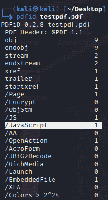

图 11.18 – 使用 PDFiD 发现嵌入文件

现在我们已经学习了如何手动检查和分析可能包含恶意软件的 PDF 文件，接下来让我们看一下一个在线工具，用于自动化恶意软件分析。

# 使用 Hybrid Analysis 进行恶意文件分析

你也可以使用像**Hybrid Analysis**这样的在线工具([`www.hybrid-analysis.com/`](https://www.hybrid-analysis.com/))来分析各种类型的可疑文件。如果你怀疑某个电子邮件中的链接或 URL 可能存在问题，你也可以将链接粘贴到该网站进行分析。

作为示例，我将使用我在前一节中分析过的**testpdf.pdf**文件，这个文件是通过**pdf-parse**和**PDFiD**分析的。我将首先访问[`www.hybrid-analysis.com`](https://www.hybrid-analysis.com)网站，然后将可疑文件拖到上传区域并点击**Analyze**，如下面的截图所示。

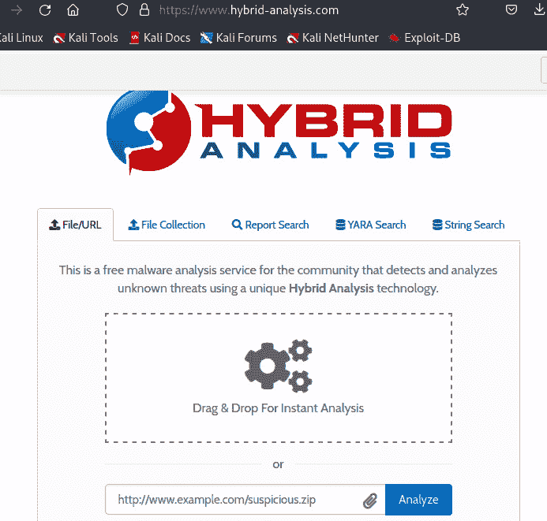

图 11.19 – hybrid-analysis.com 网站

提交 PDF 文件后，结果显示该文件可能是恶意的，如下截图所示：

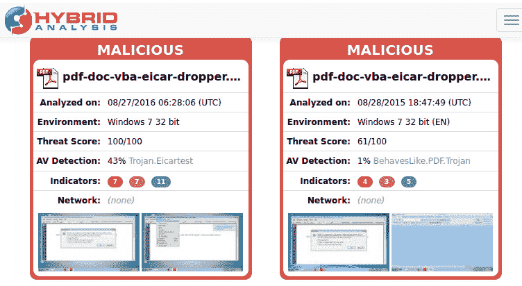

图 11.20 – hybrid-analysis.com 文件分析和结果

文件的异常特征和可疑指示符的详细信息也已提供，如下截图所示：

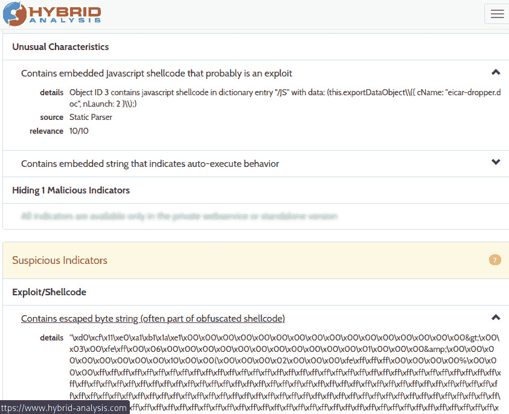

图 11.21 – hybrid-analysis.com 结果页面显示恶意指示符

我希望你在学习 PDF 和文档恶意软件取证与分析方面玩得开心。对于我们的最后一个工具，我们将再次回顾 Volatility 3 来进行勒索软件分析。

# 使用 Volatility 3 进行勒索软件分析

在我们最后一节中，让我们回顾一下非常强大的 RAM 分析工具 Volatility 3，这个工具我们在*第十章*《使用 Volatility 3 进行内存取证与分析》中有讲解。在继续之前，可以花点时间复习一下那一章。

在这个实验中，我们将使用一个名为**wcry.raw**的内存转储文件，里面包含关于 Windows 系统中 WannaCry 勒索软件感染的信息。我们将使用多种 Volatility 3 插件对其进行分析。

让我们首先下载并解压样本内存转储，稍后我们将其移到 Volatility 安装文件夹中进行分析：

1.  WannaCry 内存转储文件可以从[`mega.nz/file/7Z1ySZBT#KX5ZJKYzQgDHSa72lPFwqKL6CsZS7oQGbyyQrMTH9XY`](https://mega.nz/file/7Z1ySZBT#KX5ZJKYzQgDHSa72lPFwqKL6CsZS7oQGbyyQrMTH9XY)下载。

我已将 WannaCry 内存转储文件下载到我的**Downloads**文件夹中，文件名为**wannacry pw- infected.7z**。

1.  为了解压文件，右键点击**.7z**文件，并像之前下载的文件那样点击**Extract Here**。

1.  文件是加密保护的，当系统提示输入密码时，你需要输入**infected**这个词。解压后，你应该会在**Downloads**文件夹中看到一个名为**wannacry pw- infected**的文件夹。双击该文件夹，你应该可以看到**wcry.raw**内存转储文件。

1.  在我们开始分析下载的**wcry.raw**样本内存转储文件之前，先将文件从当前的**wannacry pw- infected**目录复制并粘贴到我们在*第五章*中使用过的**volatility3**文件夹中，分析**cridex.vmem**内存转储。这么做使得访问内存转储文件更为简便，无需每次使用不同插件时都指定一个冗长的文件路径。

1.  为确保我们的 Volatility 3 文件和**wcry.raw**文件都在正确的文件夹中，让我们打开一个新终端并切换目录到我们的**volatility3**文件夹，然后执行**ls**命令，如下截图所示：

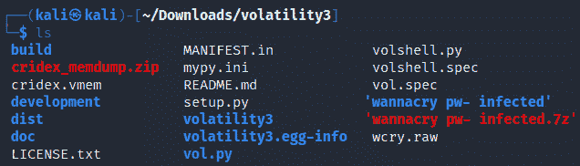

图 11.22 – volatility3 目录的内容

现在进入激动人心的部分。让我们使用 Volatility 3 进行一些勒索软件 DFIR 分析，看看能找到什么：

1.  让我们使用**info**插件找出系统运行的操作系统：

    ```
    python3 vol.py -f wcry.raw windows.info
    ```

以下截图显示了前面命令的输出结果。

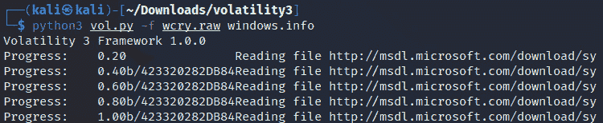

图 11.23 – Volatility 3 info 插件输出

**info**插件的输出很长；不过，我已将输出的一部分列出，如下所示，可以看到该内存转储文件来自一台 Windows XP Service Pack 3 机器。

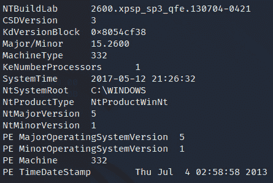

图 11.24 – info 插件输出片段

如前一章所做的那样，让我们再次使用**pslist**、**pstree**和**psscan**插件分别进行一些进程识别与分析。

## pslist 插件

让我们使用**pslist**插件获取所有正在运行的进程列表：

```
python3 vol.py -f wcry.raw windows.pslist
```

在以下截图中，我们可以看到**System**、**smss**、**csrss**、**winlogon.exe**、**services.exe**、**lsass.exe**、**svchost.exe**和**explorer.exe**服务首先被启动，然后是其他一些服务：

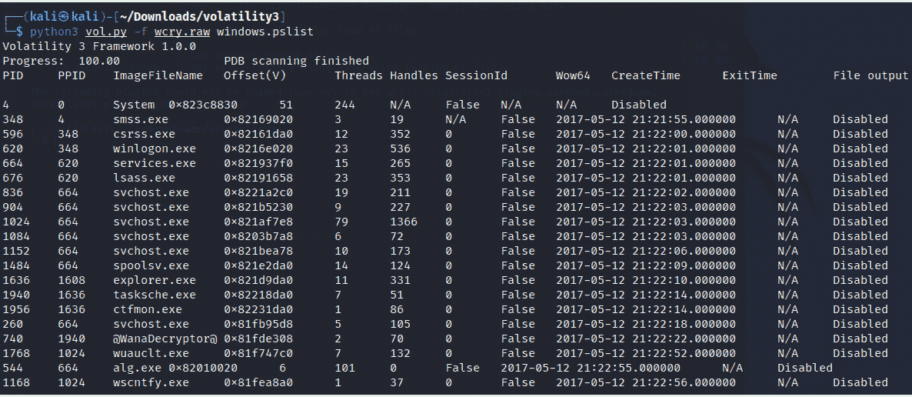

图 11.25 – pslist 插件输出

立即使用**pslist**插件，我们可以看到一个可疑条目（倒数第四个）叫做**@WanaDecryptor@**，它的 PID 是**740**，PPID 是**1940**。为了方便，我将该条目的片段列出如下：

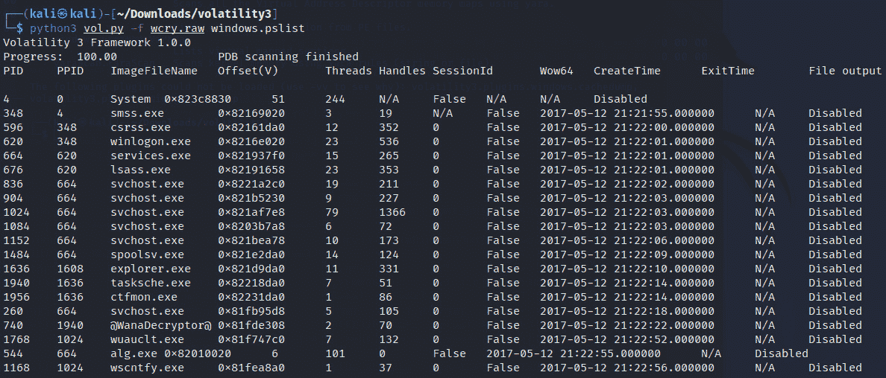

图 11.26 – pslist 插件输出片段，显示@WanaDecryptor@进程

查看**pslist**输出后，我们可以看到**winlogon.exe**进程（图 11**.25**）的 PID 为**620**，PPID 为**348**。**services.exe**和**lsass.exe**进程（紧接在**winlogon.exe**进程后）的 PPID 都是**620**，这表明**winlogon.exe**实际上是**services.exe**和**lsass.exe**的 PPID。

我们还可以看到**explorer.exe**（PID 为**1636**）是**tasksche.exe**和**ctfmon.exe**的父进程（PPID）。

进一步查看，我们看到**tasksche.exe**（任务计划程序）PID 为**1940**，是**@WanaDecryptor@**的父进程（PPID）。

让我们使用**pstree**插件以不同的方式查看这个问题：

```
python3 vol.py -f wcry.raw windows.pstree
```

在以下截图中，我们更容易看到**explorer.exe**是**ctfmon**、**tasksche**和**@WanaDecryptor@**的父进程：

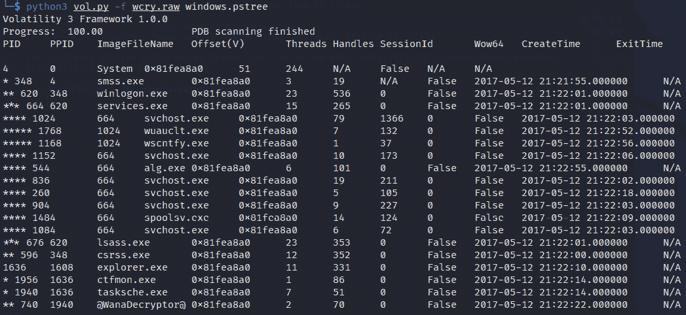

图 11.27 – pstree 插件输出

让我们现在使用**psscan**插件来显示恶意软件可以使用的进程，例如 rootkit，这些进程通常用来逃避用户和杀毒程序的发现：

```
volatility --profile=WinXPSP2x86 -f 0zapftis.vmem psscan
```

以下截图显示了前一个命令的输出。

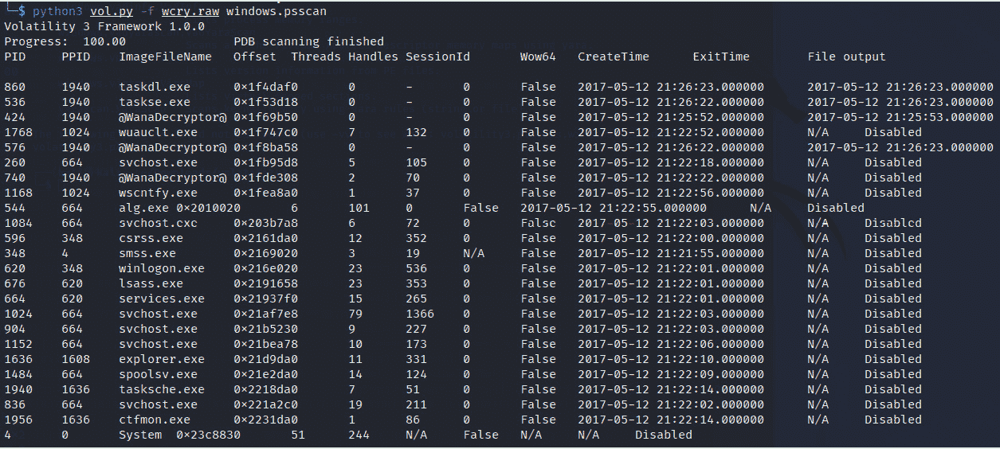

图 11.28 – psscan 插件输出

**pslist**和**psscan**命令的输出应进行比较，以注意它们的相似之处。

让我们运行**cmdline**插件来映射并查看进程和可执行文件的路径：

```
python3 vol.py -f wcry.raw windows.cmdline
```

在下图中，我们现在可以确认系统上有一个**@WanaDecryptor@**可执行文件，且某个时刻已被用户执行：

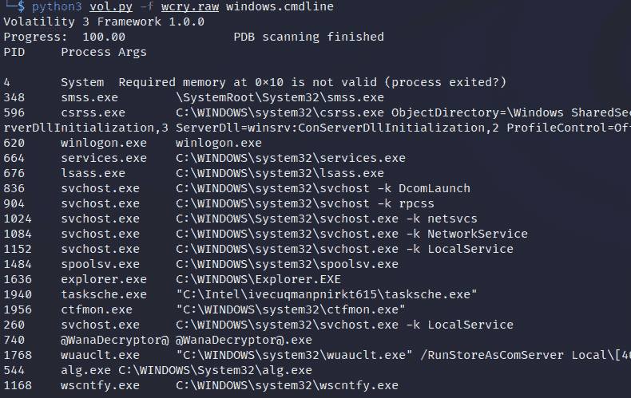

图 11.29 – cmdline 插件输出

让我们尝试使用**envars**插件查找更多关于**@WanaDecryptor@.exe**的信息，以将感染与用户关联：

```
python3 vol.py -f wcry.raw windows.envars
```

以下截图显示了前一个命令的输出。

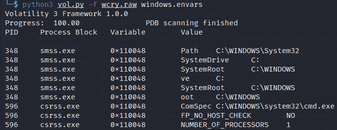

图 11.30 – envars 插件输出

**envars**插件输出较长，因此我已经向下滚动并截取了以下截图中的**@WanaDecryptor@**进程：

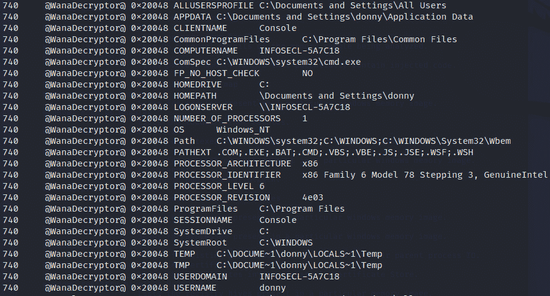

图 11.31 – 额外的 envars 插件输出

在**envars**输出的*图 11.31*中，我们发现了一些非常有用的信息。现在我们可以确定用户 Donny 的文件已被**WannaCry**/**@WanaDecryptor@**感染，并且我们知道所有感染路径。

现在我们使用**getsids**插件查看进程的权限：

```
python3 vol.py -f wcry.raw windows.getsids
```

以下截图显示了**getsids**插件命令的输出：

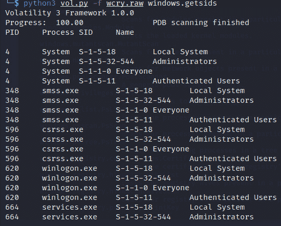

图 11.32 – getsids 插件输出

如果我们向下滚动一点，就能看到**@WanaDecryptor@**进程（PID 为**740**）具有本地用户和管理员权限。

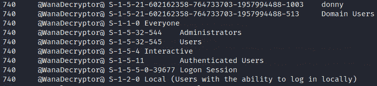

图 11.33 – getsids 插件输出继续

让我们通过运行**privileges**插件来验证这一点，查看**@WanaDecryptor@**的访问权限：

```
python3 vol.py -f wcry.raw windows.privileges
```

如前所述，**@WanaDecryptor@**进程可以执行多个任务，可能还具有读/写访问权限。

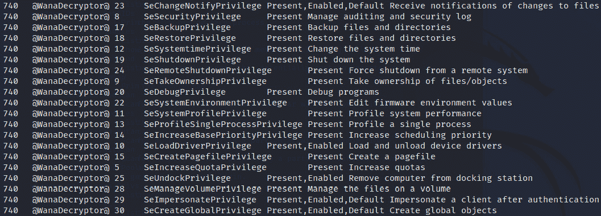

图 11.34 – 额外权限插件输出

我们可以确认这一点，并且通过使用**@WanaDecryptor@**恶意软件的**malfind**插件找到具体的实例，该插件还会指出其他可能已被入侵的进程，如**winlogon**：

```
python3 vol.py -f wcry.raw windows.malfind
```

以下截图显示了前述命令的输出：

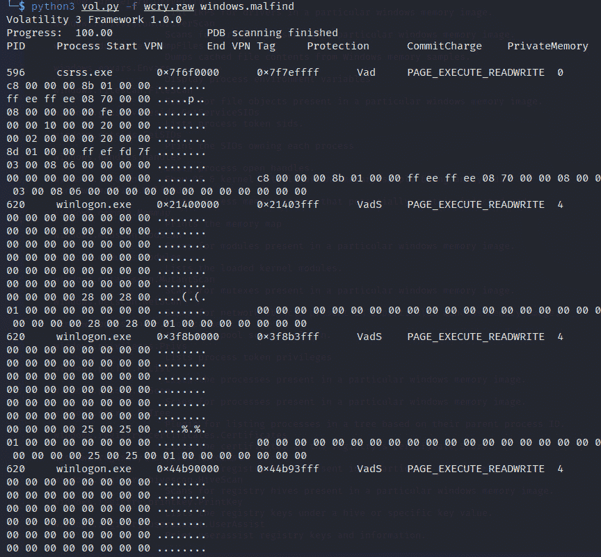

图 11.35 – malfind 插件输出

希望你喜欢使用 Volatility 分析并发现 WannaCry 勒索病毒。这确实需要很多工作，但只要稍加练习，你就能轻松掌握这一非常重要的 DFIR 工具。

# 小结

这一章真是紧张刺激！我们学习了如何使用**p0f**检测正在运行的进程和连接，并且还使用**swap_digger**进行了调查，揭示了许多有用的文件碎片，比如在活动的 Linux 系统的分页文件中存储的密码。然后，我们还使用**MimiPenguin**尝试提取系统当前的密码。

接着，我们进入了一个非常激动人心的话题——恶意软件分析，我们通过使用**pdf-parser**和**PDFiD**发现了嵌入在 PDF 文件中的恶意文件，我还向你介绍了一个我经常用来分析可疑文件和网址的在线工具，[hybrid-analysis.com](http://hybrid-analysis.com)。

最后，我们进行了一个令人兴奋的实验室，使用非常有用的 Volatility 3 工具进行勒索软件分析，发现了属于 WannaCry 勒索病毒的进程，并通过进一步分析，成功定位了被感染的用户、路径、文件和其他进程。

接下来，我们将深入探讨使用 Kali Linux 中的 Autopsy 浏览器进行自动化文件分析。下章见！
