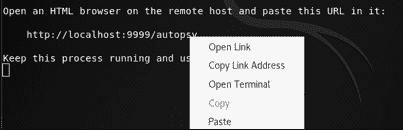
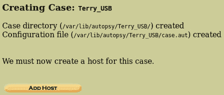
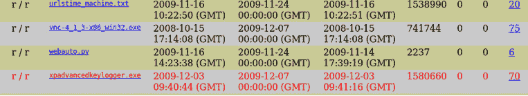
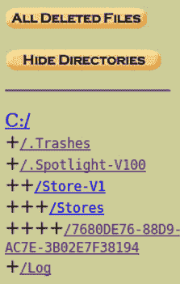

# 第十二章：尸检取证浏览器

**尸检**与**侦探工具包**密切相关。两者均由 Brian Carrier 创建。侦探工具包是一套功能强大的**命令行界面**（**CLI**）取证工具，而尸检则是基于侦探工具包之上的**图形用户界面**（**GUI**；发音为*gooey*），通过网络浏览器进行访问。侦探工具包支持多种磁盘映像文件格式，包括原始**数据转储（DD）**、**EnCase（.01）**以及**高级取证格式**（**AFF**）。

侦探工具包使用 CLI 工具执行以下任务：

+   查找并列出已分配和未分配（已删除）文件，甚至是被 rootkit 隐藏的文件

+   揭示 NTFS**备用数据流**（**ADS**），其中文件可以隐藏在其他文件中

+   按类型列出文件

+   显示元数据

+   创建时间线

尸检可以在**光盘**（**CD**）/**通用串行总线**（**USB**）上以取证模式运行，作为实时分析的一部分，或者可以在专用的 Kali Linux 机器上以死模式进行分析。

本章我们将讨论以下主题：

+   侦探工具包与尸检取证浏览器简介

+   下载样本文件进行使用并在尸检浏览器中创建案件

+   使用尸检取证浏览器进行证据分析

# 侦探工具包与尸检简介

在本章中，我们将重点介绍尸检浏览器，它基于侦探工具包中的数据恢复与磁盘分析工具。侦探工具包中的工具都是命令行工具，尸检浏览器则通过图形界面让我们能够访问这些工具及其功能，从而便于进行磁盘与文件雕刻、恢复、分析和报告。

尸检提供 GUI 访问侦探工具包中的各种调查命令行工具，包括文件分析、图像与文件哈希值计算、已删除文件恢复以及案件管理等功能。虽然尸检的安装有些复杂，但幸运的是，它已经内置在 Kali Linux 中，并且非常容易设置和使用。

尽管尸检浏览器基于侦探工具包，但在使用 Windows 版本与 Linux 版本时，尸检的功能有所不同。我们将在*第十三章*《使用尸检 4 GUI 进行完整 DFIR 分析》中介绍 Windows 版本的尸检，使用 Wine 环境。Kali Linux 中侦探工具包和尸检 2.4 所提供的一些官方功能包括：

+   **图像分析**：分析目录和文件，包括文件排序、恢复已删除文件以及预览文件

+   **文件活动时间线**：根据文件的写入、访问和创建时间戳创建时间线

+   **映像完整性**：创建用于图像文件的 MD5 哈希值，以及单个文件的哈希值

+   **哈希数据库**：将未知文件的数字哈希值或指纹（如疑似恶意**.exe**文件）与 NIST **国家软件参考库**（**NSRL**）中的哈希值进行比对

+   **事件排序器**：按日期和时间排序显示事件

+   **文件分析**：分析整个图像文件，以显示目录和文件信息及内容

+   **关键词搜索**：允许使用关键词列表和预定义表达式列表进行搜索

+   **元数据分析**：允许查看文件的元数据详情和数据恢复所需的文件结构

现在我们已经熟悉了 Autopsy 的一些用途，在开始使用该工具之前，先下载我们的示例文件以进行分析。

# 下载示例文件并在 Autopsy 浏览器中创建一个案例

在本节中，我们将找到下载所需示例文件的链接，这些文件将通过 Autopsy 浏览器进行分析。

下载图像文件

用于分析的图像文件可以通过以下网址公开下载：[`downloads.digitalcorpora.org/corpora/scenarios/2009-m57-patents/usb/`](http://downloads.digitalcorpora.org/corpora/scenarios/2009-m57-patents/usb/)。

请务必记住下载示例文件的位置，因为后续会用到。

我们将要使用的文件是 **terry-work-usb-2009-12-11.E01**，如下面的截图所示：

图 12.1 – digitalcorpora.org 上的示例证据文件

请注意

在调查硬盘和设备时，一定要始终遵循正确的获取程序，并使用写保护器避免篡改原始证据。

现在我们已经下载了示例图像文件（或者可能是我们自己法医获取的图像），让我们通过先了解不同的启动方式来使用 Autopsy 浏览器进行分析。

## 启动 Autopsy

有两种方式可以启动 Autopsy：

+   对于第一种方法，我们通过点击 **Applications** | **11 - Forensics** | **autopsy (root)** 来使用 **应用程序** 菜单：

图 12.2 – Kali Linux 法医菜单中的 autopsy (root)

+   另外，我们可以点击 Kali Linux 屏幕左上角的搜索栏，输入 **autopsy**，然后点击 **autopsy (root)** 图标：

图 12.3 – 搜索 autopsy (root) 应用程序

一旦点击 Autopsy 图标，将打开一个新的终端，显示程序信息以及用于打开 Autopsy 法医浏览器的连接详情。

注

Autopsy 法医浏览器在过去几年没有更新；然而，我们将在下一章中使用更新的 GUI 版本。

在以下截图中，我们可以看到版本号列为**2.24**，并且显示**证据库**文件夹的路径为**/var/lib/autopsy**：

图 12.4 – 启动 Autopsy 法医浏览器的流程

+   或者，您也可以将下列链接复制并粘贴到浏览器中，而不是点击*图 12.4*中显示的链接：**http://localhost:9999/autopsy**。

图 12.5 – 从终端打开 Autopsy

一旦使用任一方法打开链接，您将看到以下界面，即进入 Autopsy 法医浏览器的网页界面。

图 12.6 – Autopsy 法医浏览器网页界面

## 在 Autopsy 法医浏览器中创建新案件

创建新案件，请按照以下步骤操作：

1.  当 Autopsy 法医浏览器打开时，调查员会看到三个选项：**打开案件**、**新建案件**和**帮助**。

点击**新建案件**：

图 12.7 – 新建案件选项

1.  输入**案件名称**、**描述**和**调查员姓名**的详细信息。对于**案件名称**，我输入了**Terry_USB**，因为它与我们用于本次调查的图像名称（**terry-work-usb**）相符。输入完所有信息后，点击**新建案件**：

图 12.8 – 新建案件详情

1.  案件目录和配置文件的位置如*图 12.9*所示。请注意案件目录的位置，如截图中所示：**案件目录（/var/lib/autopsy/Terry_USB/）已创建**。点击**添加主机**以继续：

图 12.9 – 案件位置和目录详情

注意

提供了多个调查员姓名字段，因为可能会有多个调查员共同工作。

1.  输入主机名（被调查的计算机名称）和主机描述的详细信息。

1.  以下是一些可选设置：

    +   **时区**：如果未指定，默认为本地设置

    +   **时间偏移调整**：在秒级别上添加一个值，用于补偿时间差异

    +   **警报哈希数据库路径**：指定已创建的已知坏哈希数据库的路径

    +   **忽略哈希数据库路径**：指定创建的已知好哈希数据库的路径，类似于 NIST NSRL：

图 12.10 – 案件详情信息

1.  点击**添加主机**按钮以继续。

1.  一旦主机添加并创建了目录，我们就可以通过点击**添加映像**按钮来添加要分析的法医映像：

图 12.11 – 主机详情

1.  点击**添加图像文件**按钮以添加图像文件：

图 12.12 – 添加取证图像文件

1.  要导入图像进行分析，必须指定完整路径。在我的机器上，我将图像文件保存在默认的**下载**文件夹中。因此，文件的位置为**/Downloads/terry-work-usb-2009-12-11.E01**，如*图 12.13*所示。

图 12.13 – 位置和导入方法详情

注意

对于**导入方法**，我们选择**Symlink**。这样，图像文件可以从当前所在的位置（**下载**）导入到**证据保管库**目录，而不需要涉及移动或复制图像文件的风险。

1.  点击**下一步**后，显示图像文件的详细信息。点击**添加**按钮继续，然后点击**确定**。

图 12.14 – 图像文件详情

1.  到目前为止，我们已经准备好分析图像文件。确保选择**C:/**选项，然后点击**分析**。

图 12.15 – 卷选择

现在我们已经添加了下载的样本证据文件，并配置了所有案件和目录的详细信息，可以开始对样本证据文件进行分析。

# 使用 Autopsy 取证浏览器进行证据分析

现在，我们已经创建了案件，添加了包含适当目录的主机信息，并添加了样本证据文件，接下来进入分析阶段，涉及以下文件和驱动器分析、文件雕刻和恢复的步骤：

1.  点击**分析**按钮后（见*图 12.15*），我们将看到多个选项以标签的形式呈现，开始我们的调查：

图 12.16 – 分析标签选项

1.  我们通过点击**图像详情**标签来查看图像的详细信息。在以下截图中，我们可以看到卷序列号和操作系统（**OEM 名称**）列为**BSD 4.4**：

图 12.17 – 图像详情标签

1.  接下来，我们点击**文件分析**标签。此标签进入**文件浏览模式**，允许查看图像中的目录和文件。图像中的目录默认在主视图区域列出：

图 12.18 – 文件分析标签

如前面的截图所示，对于每个目录和文件，都会显示该项的书写时间、访问时间、修改时间和创建时间，以及其大小和元数据：

+   **书写时间**：文件最后一次写入的日期和时间

+   **访问时间**：文件最后一次被访问的日期和时间（仅日期是准确的）

+   **更改时间**：文件描述性数据更改的日期和时间

+   **创建时间**：文件创建的日期和时间

+   **元数据**：描述文件的元数据和文件信息

注意

如果我们向下滚动一点，可以看到红色标记的恢复项，它们是已删除的文件，如 *图 12.19* 所示。

图 12.19 – 恢复的文件

1.  如果我们继续向下滚动，还可以看到一个 VNC 的安装文件（**vnc-4_1_3-x86_win32.exe**），它可能被下载并用于另一台机器，因为该操作系统不是 Windows。

还有一个键盘记录器安装文件（**xpadvancedkeylogger.exe**）被列为红色，意味着它已被删除。

图 12.20 – 发现已删除的键盘记录器软件

1.  Autopsy 浏览器窗口的左侧窗格还包含四个主要功能，可以帮助我们进行 DFIR 调查和分析：

    +   **目录查找**：允许搜索目录

    +   **文件名查找**：允许通过 Perl 表达式或文件名搜索文件

    +   **所有已删除的文件**：在镜像中搜索已删除的文件

    +   **展开目录**：展开所有目录，便于查看内容

图 12.21 – 其他分析菜单

1.  点击 **展开目录** 按钮，可以轻松查看并访问左侧窗格和主窗口中的所有内容。目录旁边的 **+** 图标表示该目录可以进一步展开，以查看子目录（**++**）及其内容：

图 12.22 – 左侧窗格中的展开目录

1.  要查看已删除的文件，我们点击左侧窗格中的 **所有已删除的文件** 按钮。已删除的文件用红色标记，并且也遵循相同的格式，包括 **写入时间**、**访问时间**、**更改时间** 和 **创建时间**。在下面的截图中，我们可以看到该镜像包含多个已删除的文件：

图 12.23 – 查看所有已删除的文件

这就是我们使用 Autopsy 法医浏览器进行分析的全部内容。然而，在下一章中，我们将继续介绍另一个版本，称为 **Autopsy GUI v4**。

# 摘要

在本章中，我们介绍了使用 Autopsy 法医浏览器和 The Sleuth Kit 进行自动化 DFIR 调查和分析。与单独的工具相比，Autopsy 拥有案例管理功能，支持多种类型的文件分析、搜索和已分配、未分配、隐藏文件的排序。Autopsy 还可以在文件和目录级别执行哈希操作，以维护证据的完整性。

在下一章，我们将使用更新且更强大的独立版 Autopsy GUI 4.0 来分析本章中使用的相同文件进行对比。
