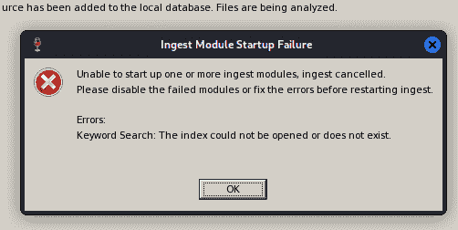
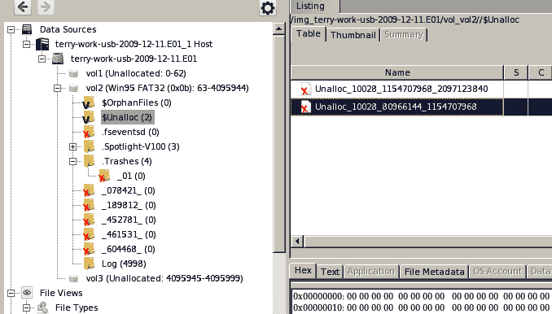

# 第十三章：使用 Autopsy 4 图形界面进行全面的 DFIR 分析

如我们在*第十二章*中所学，*Autopsy 取证浏览器*，当我们使用 Kali Linux 中自带的 Autopsy 取证浏览器时，Autopsy 在自动化证据和文件分析方面非常强大。然而，Autopsy 取证浏览器有一些限制，尤其是它的版本较旧，并且更新频率较低，相比之下，**图形用户界面**（**GUI**）版本的更新频繁。Autopsy 取证浏览器已经有许多年没有更新，仍然处于 2.2 版本，而 Autopsy GUI 目前（在写作时）已经更新至 4.19 版本。

本章将重点介绍 Autopsy v4 图形界面（也称为 Autopsy 4 图形界面），并分析与上一章使用的相同文件，以便比较使用情况、功能和分析结果的差异（如有）。本章将涵盖以下主题：

+   Autopsy 4 图形界面功能

+   使用 Wine 在 Kali Linux 中安装 Autopsy 4

+   下载示例文件进行自动化分析

+   创建新案件并熟悉 Autopsy 4 界面

+   使用 Autopsy 4 分析目录并恢复已删除的文件和证据

# Autopsy 4 图形界面功能

Autopsy 4 图形界面提供许多易于使用的功能，适用于相对简单和快速的分析。Autopsy 4 是少数几款全面的数字取证套件之一，完全免费使用，且被专业人员和执法部门广泛使用。

一些功能包括以下内容：

+   简单且直观的用户界面

+   案件管理，每个案件的所有文件都存储在各自的目录中

+   可用的第三方插件和模块

+   索引关键词搜索

+   从浏览器提取 Web 证据，包括从 Chrome 和 Firefox 中提取 cookies 和浏览历史

+   使用 PhotoRec 进行自动化文件恢复

+   使用照片和视频分析提取**可交换图像文件**（**EXIF**）数据

+   高级时间线分析与事件查看

+   **妥协指示器**（**IoC**）分析

+   并行任务处理以实现快速分析

+   可自由下载，支持 Windows、Linux 和 Mac

Autopsy 的详细信息可以在其主页找到：[`www.sleuthkit.org/autopsy/#:~:text=Autopsy%C2%AE%20is%20a%20digital,from%20your%20camera%E2%80%99s%20memory%20card`](https://www.sleuthkit.org/autopsy/#:~:text=Autopsy%C2%AE%20is%20a%20digital,from%20your%20camera%E2%80%99s%20memory%20card)

现在我们已经熟悉了 Autopsy 4 图形界面的一些功能，让我们使用 Wine 在 Kali 中安装它。

# 使用 Wine 在 Kali Linux 中安装 Autopsy 4

在本示例中，我们将使用 Autopsy for Windows，安装方式为 Wine。Autopsy 4 也可以在 Linux 上下载；不过，这可能更适合高级用户。如果你还没有在 Kali Linux 上安装 Wine，可以回顾一下*第五章*中的内容，*在 Kali Linux 中安装 Wine*，然后再返回当前章节。

现在，让我们开始在 Kali Linux 中使用 Wine 安装 Autopsy 4：

1.  所有版本的 Autopsy 4 可在此找到：[`www.autopsy.com/download/`](https://www.autopsy.com/download/)

要下载适用于 Windows 的 Autopsy，可以点击这里的直接链接：[`github.com/sleuthkit/autopsy/releases/download/autopsy-4.19.3/autopsy-4.19.3-64bit.msi`](https://github.com/sleuthkit/autopsy/releases/download/autopsy-4.19.3/autopsy-4.19.3-64bit.msi)

上一个版本是适用于 Windows 的最新稳定 64 位版本，当前版本为 4.19.3。该教程同样适用于后续版本，因为多年来其使用方法保持不变。

1.  一旦下载了 Autopsy 4.19.3，你可以双击下载的文件，或者右键点击 **autopsy-4.19.3-64bit.msi** 文件，选择 **使用 Wine Windows 程序加载器打开** 来启动程序。这样将会启动 **Autopsy 设置** 窗口，如下图所示：

图 13.1 – Autopsy 向导欢迎屏幕

1.  点击 **下一步** 继续。安装文件夹将显示为通常在 Windows 安装过程中显示的内容。点击 **下一步** 继续。

图 13.2 – Autopsy 安装文件夹

1.  点击 **安装** 开始安装过程。

图 13.3 – Autopsy 安装过程

安装可能需要几分钟，具体取决于分配给 Kali 环境的 RAM 和 CPU 资源。

图 13.4 – 安装过程中复制文件

1.  当所有文件安装完成后，向导会告诉我们安装已完成。点击 **完成** 启动 Autopsy。

图 13.5 – 完成的 Autopsy 安装

安装后，你将看到 Autopsy 4 的启动画面，加载所有所需模块可能需要一分钟时间。

图 13.6 – Autopsy 4 启动画面

1.  在所有模块加载完毕后，会显示案例库信息，如下图所示。点击 **确定** 继续。

图 13.7 – 案例库信息

我们已经完成了在 Kali Linux 上通过 Wine 安装和初始配置 Windows 版本的 Autopsy 4 GUI。接下来，在继续之前，我们先确保已经下载了所有必要的示例文件。

# 下载用于自动化分析的示例文件

我们将使用的样本证据文件是之前章节中通过 Autopsy 取证浏览器分析的同一个**terry-work-usb-2009-12-11.E01**文件。你可以再次从这里直接下载：[`digitalcorpora.s3.amazonaws.com/corpora/scenarios/2009-m57-patents/usb/terry-work-usb-2009-12-11.E01`](https://digitalcorpora.s3.amazonaws.com/corpora/scenarios/2009-m57-patents/usb/terry-work-usb-2009-12-11.E01)。

我还希望你借此机会从[digitalcorpora.com](http://digitalcorpora.com)网站下载其他示例文件，你可以自己分析这些文件，完全熟悉 Autopsy 4，因为这是 DFIR 调查员和分析师使用的主要开源免费工具之一：

+   **Charlie-work-usb**文件：[`digitalcorpora.s3.amazonaws.com/corpora/scenarios/2009-m57-patents/usb/charlie-work-usb-2009-12-11.E01`](https://digitalcorpora.s3.amazonaws.com/corpora/scenarios/2009-m57-patents/usb/charlie-work-usb-2009-12-11.E01)

+   **Jo-favorites-usb**文件：[`digitalcorpora.s3.amazonaws.com/corpora/scenarios/2009-m57-patents/usb/jo-favorites-usb-2009-12-11.E01`](https://digitalcorpora.s3.amazonaws.com/corpora/scenarios/2009-m57-patents/usb/jo-favorites-usb-2009-12-11.E01)

+   **Jo-work-usb**文件：[`digitalcorpora.s3.amazonaws.com/corpora/scenarios/2009-m57-patents/usb/jo-work-usb-2009-12-11.E01`](https://digitalcorpora.s3.amazonaws.com/corpora/scenarios/2009-m57-patents/usb/jo-work-usb-2009-12-11.E01)

再次提醒，无论是在阅读完本章后，还是在书籍结束后，你都可以随时回到这些文件来提升你的 DFIR 分析技能。

现在让我们回到 Autopsy 4 的安装界面，熟悉一下它的界面。

# 创建新案例并熟悉 Autopsy 4 的界面

现在我们已经在 Kali 上通过 Wine 安装了 Autopsy 4 的 GUI，并且从上一部分下载了所需的文件，我们可以通过创建一个新案例并使用样本证据文件来开始，接下来的部分我们将分析这些文件。

让我们首先在 Autopsy 4 的 GUI 中创建一个新案例：

1.  无论是从之前下载样本证据文件之前的状态继续，还是从桌面或应用菜单中打开 Autopsy 4，你都会看到选择开始新案例或打开现有案例的选项。为了我们的目的，点击**New Case**来创建一个新案例：

图 13.8 – 在 Autopsy 中创建新案例

1.  接下来，我们可以添加一个案例名称。我还在 Kali 中选择了**Documents**文件夹作为我的**Base Directory**文件夹，用来存放所有文件和日志。点击**Next**继续。

图 13.9 – 新建案例详情

1.  我们接下来需要为案件分配一个编号，并填写检查员的详细信息。完成后，点击**完成**按钮以继续。

图 13.10 – 检查员详情

创建新案件可能需要几分钟时间，因为 Autopsy 正在为使用做好准备。

图 13.11 – 打开新案件状态显示

1.  然后，选择主机。我们可以暂时保留默认选项**根据数据源名称生成新的主机名称**，然后点击**下一步**以继续。

图 13.12 – 案件主机名称

1.  下一步是一个重要步骤，我们必须特别注意。在这里，我们选择数据源类型。我们的示例文件（**terry-work-usb-2009-12-11.E01**）是一个法医获取的证据镜像文件，因此我们将选择第一个选项，**磁盘镜像或虚拟机文件**。选择后，点击**下一步**以继续。

图 13.13 – 选择数据源

1.  我们现在将选择要分析的文件。我已将示例证据文件下载到 Kali Linux 中的**Downloads**文件夹。您可以点击**浏览**按钮，导航到**C:\users\kali\Downloads**文件夹，然后选择证据文件（**terry-work-usb-2009-12-11.E01**）或直接输入文件路径。选择您的时区后，点击**下一步**以继续。

图 13.14 – 数据源路径指定

1.  接下来，我们可以配置摄取模块，决定 Autopsy 将在哪些项目上运行已选择的模块进行完全自动化的 DFIR 分析。我保留了默认设置，选择了所有文件和目录。点击**下一步**以继续。

图 13.15 – 配置摄取模块

重要提示

对于较大的证据文件、磁盘和镜像，由于需要处理的项目数量庞大，分析过程可能会更长。运行所有模块可能不可行。然而，如果您没有手动指定模块，Autopsy 将自动取消任何无法运行的模块。

如果 Autopsy 在运行模块时遇到任何错误，它们将被自动移除，如以下截图所示。点击**确定**以接受并继续：

图 13.16 – 摄取模块失败错误

1.  一旦错误信息被关闭，点击**完成**按钮开始分析文件：

图 13.17 – 完成数据源分析详情

现在我们可以在 Autopsy 界面中查看所有分析过的文件，如以下截图所示。

图 13.18 – Autopsy 界面

让我们开始在 Autopsy 界面中探索我们的发现，以查看分析结果。

# 使用 Autopsy 4 分析目录并恢复已删除的文件和遗迹

如前所述，Autopsy 拥有一个非常简单且不复杂的界面。Autopsy 窗口分为三个窗格，如下所述：

+   左侧窗格显示了被分析和检查的数据源，以及 Autopsy 所发现和恢复的所有目录和文件。

+   主窗格显示了数据源文件夹中所有发现的文件。

+   下方的窗格显示了文件的详细信息，如**十六进制**、**文本**、**文件元数据**和**数据遗迹**。

在以下截图中，我通过点击每个提到的项目旁边的加号（**+**）扩展了**数据源**、**文件视图**和**已删除文件**文件夹，这些文件夹都显示了子目录，如下图所示：

图 13.19 – Autopsy 中分析的数据源发现

通过在左侧窗格中展开**数据源**项目，我们可以看到证据文件包含两个卷。卷 1 是未分配的空间，卷 2 是 Windows 95 FAT32 卷，展开后可以看到孤立文件、未分配文件，甚至已删除的文件夹，如下图所示。

图 13.20 – 数据源卷和发现的遗迹

如果我们仔细查看**文件类型**，我们可以看到 Autopsy 已将文件类型分类为**图片**、**视频**、**音频**、**压缩文件**，甚至**文档**子文件夹，这些文件夹可能包含已发现的遗迹。

在以下截图中，我们可以看到 Autopsy 已发现几种类型的文件，包括 4,992 张图片、4 个数据库和 24 个已删除文件。我点击了扩展后的**图片**文件夹，其中包含 4,992 个文件。在右侧窗格中，我们可以看到所有图片的列表，以及这些图片文件的修改、访问和创建时间。

图 13.21 – 查看发现的图片及其相关时间戳

耐心是关键！

逐一浏览这些文件以发现任何有用的信息或遗迹可能看起来是一项繁琐的任务，但成功的数字取证和响应（DFIR）调查与分析的关键是耐心！

接下来，我选择了**已删除文件**文件夹，然后选择了**文件系统**文件夹。**文件系统**文件夹的内容显示在主窗口中，每个已删除文件旁边都有一个红色的**X**，如*图 12.22*所示。我还向下滚动并点击了已删除的**xpadvancedkeylogger.exe**文件，报告显示它最后一次修改的时间为 2009-12-03 08:40 EST。

图 13.22 – 发现并恢复的人工制品

在前面的截图中，我们可以看到，当需要筛选已删除的文件时，Autopsy 是多么有用，因为所有文件都被分组并附有时间戳。

我在这个非常简短的教程中想向你展示的最后一个功能是**时间轴**功能。点击应用程序顶部的**时间轴**按钮，生成按月排列的事件时间轴，正如下面的截图所示。

图 13.23 – Autopsy 时间轴功能

在前面的时间轴中，你还可以按月查看事件。让我们点击红色的**十月**标记。在下方的窗格中，我们可以看到有两个可执行文件是在 2008-10-15 17:14 创建和修改的。这些文件是**vnc**文件，可以用来获取或提供远程访问，可能还会危及设备安全。

图 13.24 – 时间轴功能中的 VNC 文件

这也标志着我们使用 Autopsy 4 进行的自动化 DFIR 分析的结束。我鼓励你使用本章开头提到的样本文件返回到这个工具中，并分析本章中“*下载用于自动化分析的样本文件*”部分提到的其他下载样本文件。

# 总结

在这一章中，我们下载并安装了更强大的 Windows 版本 Autopsy，称为 Autopsy 4 GUI，并通过 Wine 在 Kali Linux 上运行了它。我们还了解了如何利用这个版本的 Autopsy 自动分析证据文件，查找诸如已删除文件之类的人工制品。我希望你喜欢这一章，因为它展示了比我们在*第十二章*中看到的 Autopsy 浏览器更强大的 Autopsy 版本，*Autopsy* *Forensic Browser*。

接下来，我们将了解一些流行的扫描和侦察工具，尽管这些工具并非专为 DFIR 目的而创建，但在网络取证分析和调查中非常有用。我们在*第十四章*中见！
