# 第十四章：网络发现工具

在本章中，我将介绍一些常见工具，这些工具有助于网络发现、网络信息收集与侦察过程，并且总体上有助于网络取证分析。特定的网络取证分析工具，如 Xplico 和 NetworkMiner，将分别在*第十五章*《使用 Xplico 进行数据包捕获分析》和*第十六章*《网络取证分析工具》中进行讲解。

在本章中，我们将首先进行网络主机发现，详细介绍主机本身的具体信息，如**操作系统**（**OS**）和开放端口，然后使用一个在线工具来发现外部和公开可识别的主机。

在本章中，我们将学习以下内容：

+   在 Kali Linux 中使用 netdiscover 识别网络上的设备

+   在 Kali Linux 中使用**网络映射器**（**Nmap**）识别网络上的设备

+   使用 Nmap 对主机详细信息（端口、操作系统等）进行指纹识别

+   使用 Shodan.io 查找外部物联网设备，包括防火墙、监控摄像头系统和服务器

到本章结束时，你将能够使用这些工具帮助进行 DFIR 调查，收集有关本地和远程连接设备的信息，如 IP 地址、设备类型、操作系统详细信息、开放端口等。

# 在 Kali Linux 中使用 netdiscover 识别网络上的设备

我们将从使用一个非常简单的工具——**netdiscover**开始网络主机发现。netdiscover 工具已在 Kali Linux 中预装；不过，几乎任何版本的 Linux 都可以通过以下命令安装它：

```
sudo apt install netdiscover
```

netdiscover，顾名思义，用于通过广播**地址解析协议**（**ARP**）请求，在有线或无线网络上发现在线主机。netdiscover 易于使用的一大特点是它允许用户自动扫描整个 IP 地址范围或子网，从而检测在线主机。netdiscover 的另一个非常有用的功能是它可以显示**媒体访问控制**（**MAC**）地址以及设备或**网络接口卡**（**NIC**）的厂商信息，这在区分终端用户、服务器和网络设备时，能使主机发现变得更加简单。

在开始使用 netdiscover 之前，我们应该注意扫描设备上的网络接口信息。这还可以告诉我们 IP 地址、子网掩码和网络范围。

为此，输入以下内容：

```
ifconfig
```

在*图 14.1*中的以下输出中，我们可以看到有两个接口，分别是以太网（**eth0**）和回环（**lo**）接口：

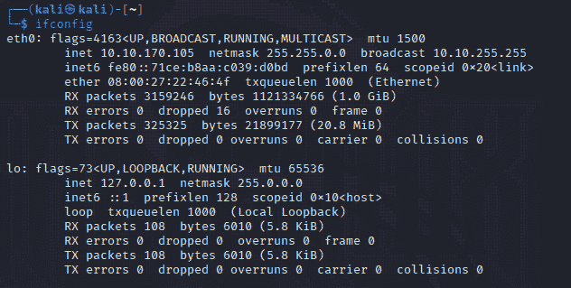

图 14.1 – ifconfig 命令输出

在**eth0**接口的详细信息中，我们可以看到我的 IP 地址是**10.10.170.105**，子网掩码是**255.255.0.0**。我们将使用这个接口与**netdiscover**命令。

现在我们知道了将使用的接口和 IP 范围，我们可以继续使用 netdiscover 来识别网络主机：

1.  我们将首先启动 netdiscover，并使用帮助选项查看 netdiscover 中所有可用的选项和开关。为此，请键入以下命令：

    ```
    sudo netdiscover –h
    ```

要使用 netdiscover 自动扫描网络中的设备，我们将使用**–r**选项来指定子网或 IP 地址范围。

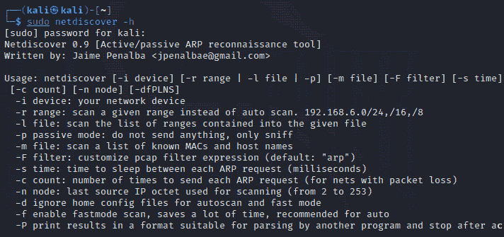

图 14.2 – netdiscover 选项

1.  我将使用以下命令扫描我的整个**10.10.0.0**网络范围：

    ```
    netdiscover –i eth0 –r 10.10.0.0/16
    ```

注意

请确保使用的是你自己的网络范围，因为你的范围可能与我的不同。

1.  现在，按*Enter*键。按下*Enter*后，netdiscover 将开始运行。请等待片刻，直到它完成并编制出包含 IP、MAC 地址和厂商/主机名的列表，如下图所示：

注意

为了保护隐私，我已屏蔽了部分 MAC 地址。

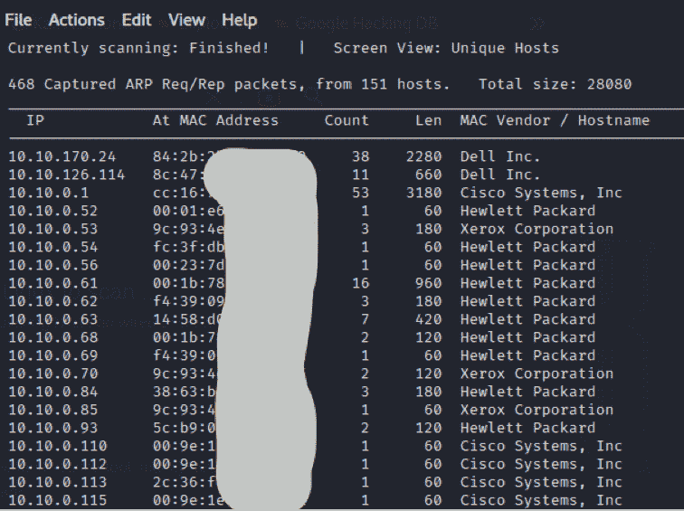

图 14.3 – netdiscover 输出

在前述输出中，我们可以看到 netdiscover 已捕获**468**个 ARP 数据包并检测到**151**个活动主机，列出了它们的 IP、MAC 地址以及厂商/主机名。

现在我们来看一下如何使用 Nmap 来执行主机发现。

# 使用 Nmap 查找网络中其他主机和设备

由戈登·里昂（Gordon Lyon），也就是*Fyodor*，创建的**Nmap**是进行漏洞评估和渗透测试时最常用的网络扫描和枚举工具之一。它在数字取证和响应（DFIR）任务中也非常有用，特别是在调查需要披露网络上主机详细信息的网络通信时。

Nmap 也是一个名声在外的工具，曾出现在诸如*黑客帝国重装上阵*、*谍影重重*、*惊天危机 4*、*龙纹身的女孩*等热门电影中，并且还在非常受欢迎的电视剧《*Mr. Robot*》中出现。

Nmap 是一个**命令行界面**（**CLI**）工具，已预装在 Kali Linux 中。Windows 和 Mac 设备也有**图形用户界面**（**GUI**），但我个人认为，使用 CLI 可以访问更多选项和功能。

Nmap 有许多开关，并且需要了解端口、**传输控制协议/互联网协议**（**TCP/IP**）协议和 TCP 标志。如果你对这些主题不熟悉，请在继续之前阅读相关资料。有关 TCP 的更多信息，请访问这个链接：[`en.wikipedia.org/wiki/Transmission_Control_Protocol`](https://en.wikipedia.org/wiki/Transmission_Control_Protocol)。

让我们按照以下步骤使用 Nmap 查找网络中其他主机和设备：

1.  要启动 nmap 并查看可用的开关和选项，我们可以使用以下命令：

    ```
    sudo nmap –h
    ```

如前述输出所示，nmap 的一般格式和用法是**nmap [扫描类型] [选项] {****目标规范}**。

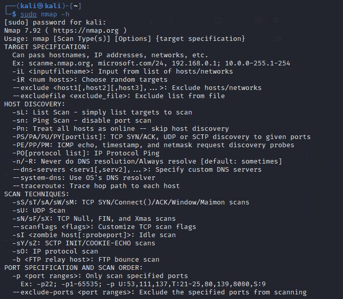

图 14.4 – nmap 帮助选项输出的一个片段

1.  首先，我将尝试使用 **–sn** 选项进行基本的 ping 扫描，以列出可以进一步扫描的主机，就像 netdiscover 在前一节中发现我网络中的在线主机一样。

要执行基本的 ping 扫描，我们可以输入 **sudo nmap –sn**，后跟网络范围，在我的情况下是 **10.10.0.0/24**。你的网络范围可能不同，所以请确保使用自己的网络范围。

1.  我们还可以使用 **–v** 选项以原样列出 nmap 中的输出：

    ```
    sudo nmap –sn –v 10.10.0.0/24
    ```

以下截图显示了前述 Nmap 命令的输出。

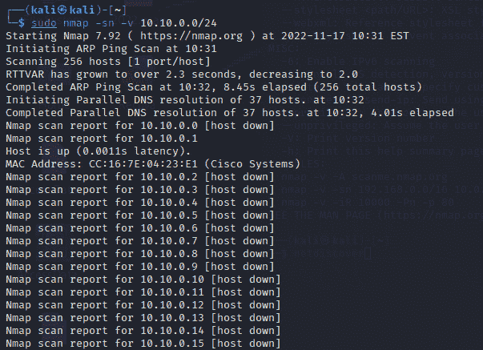

图 14.5 – nmap ping 扫描输出

如果我们向下滚动 nmap 输出，可以看到通过 ping 扫描发现的在线主机列表。尽管没有 netdiscover 那么有条理，nmap 仍然显示了相同的结果，如下所示。

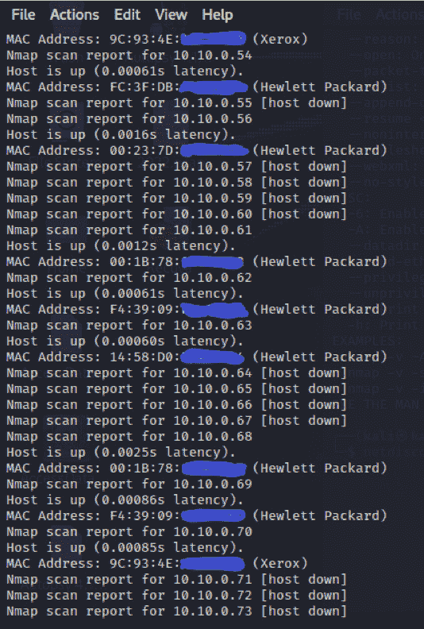

图 14.6 – nmap 输出显示已发现的存活主机

在这一节中，我们学习了 Nmap 的基础知识，现在我们已经能够使用这个命令行工具扫描内部网络。

现在让我们进一步进行 Nmap 扫描，学习如何识别已发现设备的端口和服务。

# 使用 Nmap 获取主机详细信息指纹

现在我们已经熟悉了如何查看 nmap 开关并运行基本扫描，让我们通过发现运行中的服务、端口，甚至被发现主机的操作系统，来进行主机枚举，这可能是我们 DFIR 调查中的有用线索。

如前一节所示，一旦你熟悉了可以使用的各种开关，nmap 的使用相当简单。可以再次运行 **sudo nmap –h** 命令来查看可用的开关和选项。

对于我们的目的，nmap 中的 **–A** 选项在枚举主机或整个网络时可以执行以下任务：

+   操作系统检测

+   服务版本检测

+   脚本扫描

+   路由追踪

**–A** 选项在对整个网络运行时可能需要较长时间，因此我将其仅针对一台主机运行，这台主机在我之前对我的网络进行 ping 扫描时被显示为存活。

要运行此服务扫描，我将执行以下命令：

```
sudo nmap –A –v 10.10.10.10
```

以下截图显示了 Nmap 中 **-A** 选项的输出。

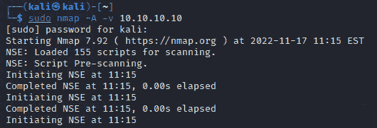

图 14.7 – nmap 服务扫描

滚动浏览服务扫描输出，nmap 还显示了开放端口列表，并识别了正在运行的服务及其版本，如下所示。

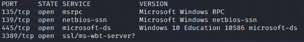

图 14.8 – nmap 输出显示开放端口和正在运行的服务

在继续浏览同样的输出时，nmap 显示了主机的详细信息，例如主机（目标）名称、域名和计算机名，如图所示。出于隐私原因，我已经模糊了部分输出。

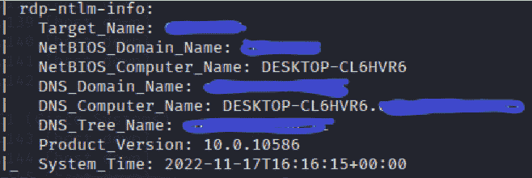

图 14.9 – nmap 输出显示主机信息

滚动到 nmap 输出的几乎底部，我还可以看到主机操作系统的详细信息，如图所示：

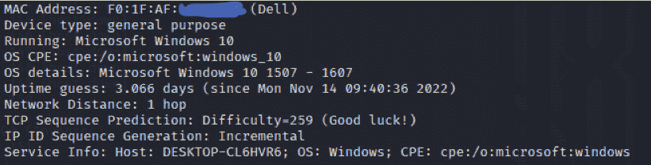

图 14.10 – nmap 输出显示主机操作系统详情

在前面的输出中，我们可以看到主机是运行 Windows 10（**1507 -** **1607**）的戴尔设备。

我们现在已经知道如何扫描内部网络，并使用 Nmap 来识别活动系统及其详细信息，如操作系统、MAC 地址、正常运行时间，甚至开放端口。

现在让我们走出本地网络，学习如何使用 Shodan 定位和识别外部及物联网设备。

# 使用 Shodan.io 查找包括防火墙、监控摄像头和服务器在内的物联网设备

快速想象一个允许你搜索任何内容的网站。虽然我不是预言家，但我猜你会想到 Google。也许我还是老老实实做我的本职工作吧。就像 Google 扫描和抓取互联网上的主要部分，索引网站和资源一样，Shodan 采取类似的方法来扫描互联网和 IP 地址，并索引可以通过网络访问的设备的有用信息。

**物联网**（**Internet of Things**）设备是指那些能够连接到互联网，但可能不是传统计算机（如笔记本电脑和台式机）的设备。物联网设备包括智能设备，如可穿戴的健身设备和追踪器、智能微波炉和烤箱、亚马逊 Echo、门铃摄像头，甚至智能汽车。物联网设备还扩展到工业系统，被称为**工业物联网**（**IioT**）设备。比如，一家大型饮料制造公司就需要有系统和设备来计算瓶子、瓶盖和标签，检查温度，并促进需要通过**可编程逻辑控制器**（**PLCs**）、**监控控制与数据采集**（**SCADA**）和**工业控制系统**（**ICS**）进行网络连接的传感器之间的通信。这适用于每个工业领域，甚至是核电厂！将这种**操作技术**（**OT**）与 IioT 结合在一起的情况也很常见，这就是**OT-IIoT**，因为 OT 设备可以通过 IIoT 系统进行远程控制。

这里的问题在于确保物联网（IoT）和工业物联网（IIoT）设备的安全性，以及设备访问权限，尤其是远程访问。作为一名渗透测试员，我经常使用**Shodan.io**来查找属于不同类型公司的系统，尤其是大型组织。在进行数字取证和事件响应（DFIR）调查时，这项技能也非常有用，因为关于外部设备和物联网设备的信息可以通过 Shodan.io 很容易地找到。

Shodan 团队声称，Shodan 可以找到所有连接到互联网的设备，并揭示关于设备的重要元数据。这是有益的，因为它允许公司使用 Shodan 查找其设备是否可以被公开访问，但同样也将这些信息展示给攻击者。这并不是说 Shodan 是一个坏的或恶意的工具，因为还有数百种其他工具可以一起使用，泄露相同的信息。Shodan 只是让这一过程变得更简单。

Shodan 是一项付费订阅服务；然而，你可以免费使用它，虽然只能获得非常有限的结果，或者注册一个免费账户，在进行物联网和工业物联网搜索时可以访问两页结果。如果你不想购买他们的订阅套餐，可以等他们的年终促销（通常在黑色星期五和感恩节期间），这时可以以 5 美元的价格购买一个个人使用的限时终身订阅。对于这个练习，我将使用 5 美元的付费订阅，但我鼓励你注册该网站，这样至少可以每次访问两页结果。

## 使用 Shodan 过滤器进行物联网搜索

Shodan 搜索不像 Google 搜索那样直观，但进行 Shodan 过滤器搜索并查找特定设备并不难。你可以查看 Shodan 过滤器参考文档，地址是 [`beta.shodan.io/search/filters`](https://beta.shodan.io/search/filters)。

这是你可以使用的一些基本搜索过滤器：

+   **product**：搜索硬件制造商或软件开发商的名称

+   **hostname**：根据搜索的主机名查找设备

+   **os**：按操作系统搜索设备

+   **port**：查找设备的开放端口

+   **city**：查找特定城市内的设备

+   **country**：查找特定国家内的设备

+   **geo**：根据 GPS 坐标查找设备

让我们来试试几个搜索。我住在加勒比海的一个小岛上，叫做特立尼达。如果我想查看特立尼达岛内的设备列表，可以在 Shodan 搜索框中使用**国家**过滤器，后跟国家代码：

```
country:"TT"
```

如果不确定自己国家的代码，简单的网络搜索应该能帮你找到答案。我发现 [`www.countrycode.org/`](https://www.countrycode.org/) 这个网站非常有用。

在下方的截图中，我们可以看到国家过滤器的结果，其中**TT**代表特立尼达和多巴哥的国家代码。在屏幕左侧，我们可以看到找到的**124, 921**个物联网设备的结果，下面列出了**顶级城市**，每个城市列出了设备的数量，随后是顶级开放端口、顶级组织等信息。在屏幕的中间和右侧，我们可以看到实际的 IP 地址和这些设备的信息。

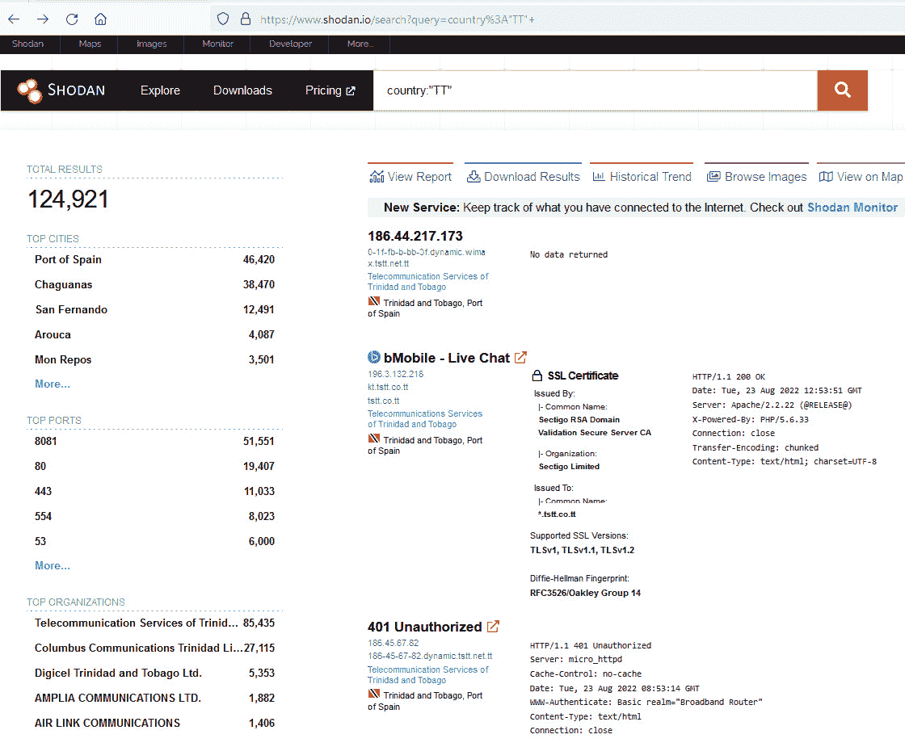

图 14.11 – Shodan 国家过滤器结果

由于隐私和法律问题，我不会点击这些结果，因为这会将我们带到另一个页面，显示公司和主机的详细信息，甚至公开设备的开放端口和操作系统。请务必在继续操作之前，进行网络搜索并查看您所在国家和州的法律。如果不确定，您可能希望先联系执法机关或了解当地法律和法规的专家。

让我们尝试另一种搜索，使用 **国家** 过滤器和 **产品** 过滤器，搜索特立尼达的 **Fortinet** 防火墙，输入如下内容：

```
country:"TT" product:"Fortinet"
```

在以下搜索结果中，我们可以看到 Shodan 返回了特立尼达的 54 个 Fortinet 防火墙结果。再次出于法律和隐私的考虑，我不会点击 IP 地址，因为这将显示比主页列出的更多设备细节。

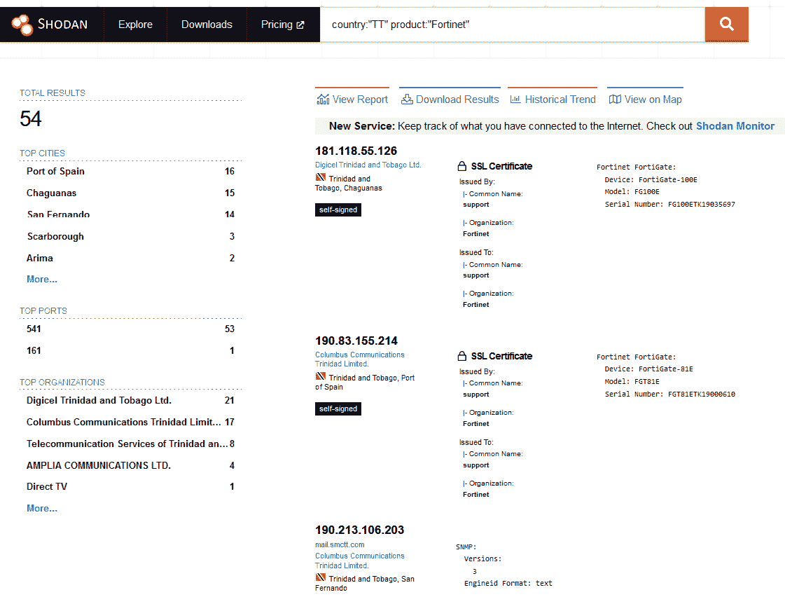

图 14.12 – 特立尼达 Fortinet 防火墙的产品过滤器

我们还可以使用 Shodan 查找特定的服务器。假设我想搜索使用 **2.2.3** 版本的 Apache Web 服务器。可以通过使用 **服务器** 过滤器并输入服务器版本来实现，输入如下内容：

```
country:"TT" apache 2.2.3
```

在这里，我们看到 Shodan 显示了 11 个结果，主要位于特立尼达的西班牙港和查瓜纳斯。

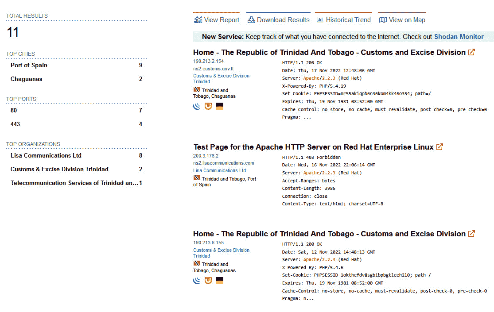

图 14.13 – 使用 Shodan 查找 Web 服务器

在我们的最后一次搜索中，我想使用 Shodan 搜索 CCTV IP 摄像头。为此，我们可以再次使用 **产品** 过滤器。我将指定 **海康威视** 摄像头系统，因为这是一个非常常见的 CCTV 系统，输入如下内容：

```
country:"TT" product:"Hikvision IP Camera"
```

如最终示例所示，Shodan 返回了 7,689 个海康威视摄像头实例。如果你的 DFIR 调查需要监控摄像头录像，这也会非常有用，它能提醒你摄像头可能的位置，甚至可能提供一个公司名称，你可以联系并请求查看他们的录像。

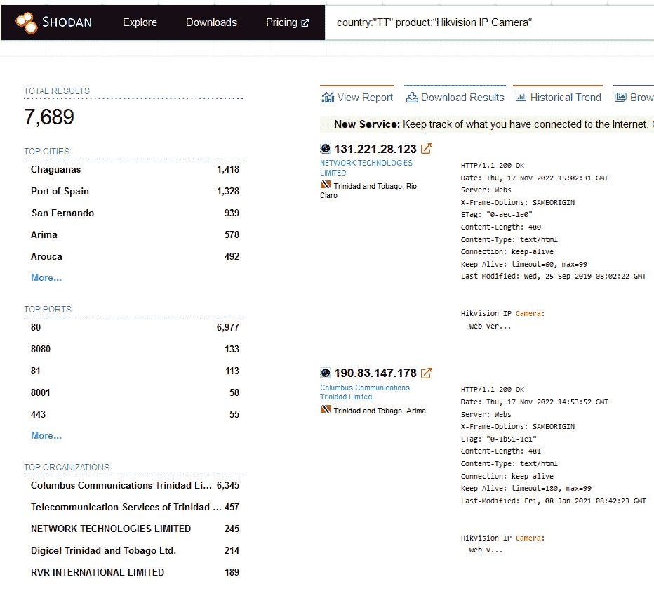

图 14.14 – 使用 Shodan 发现 CCTV 摄像头

随时尝试更多 Shodan 过滤器，但请检查适用的当地法规，确保这些搜索是合法的。

# 总结

在本章中，我们了解了网络发现和枚举工具 netdiscover 和 nmap，并学习了如何扫描网络以寻找开放的主机，并查看 IP 地址、MAC 地址和主机名等详细信息。我们还进一步使用 Nmap 探索更多主机细节，如开放端口、正在运行的服务及其版本、计算机名称和域名。接着，我们使用 Shodan.io 查找 IoT 设备，并通过各种搜索过滤器查找防火墙、服务器和 CCTV 摄像头。

这些工具对于任何收集本地和远程设备信息的人来说，尤其是在网络 DFIR 调查中，都是非常有用的。

接下来，我们将介绍一款叫做 **Xplico** 的 **网络取证分析工具** (**NFAT**)。下章见。
