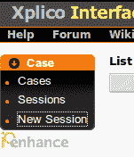

# 第十五章：使用 Xplico 进行数据包捕获分析

在本章中，我们将介绍 Xplico，它是一款自动化的**网络取证分析工具**（**NFAT**）。Xplico 可以在 Kali Linux 中找到；然而，我发现，在过去的几个版本（2019-2022 年）中，尝试运行 Xplico 时会遇到一些问题，这可能是由于 Kali 本身的更新所致。

虽然我会为那些有幸能够顺利运行 Xplico 的人解释如何在 Kali Linux 中启动 Xplico，但对于那些在 Kali 本身中运行 Xplico 时可能遇到困难的人，我们将使用运行 DEFT Linux 8.1 的虚拟机来运行 Xplico。

本章将涵盖以下主要主题：

+   在 Kali Linux 中安装 Xplico

+   在 VirtualBox 中安装 DEFT Linux 8.1

+   下载样本分析文件

+   在 DEFT Linux 中启动 Xplico

+   使用 Xplico 自动分析网页、电子邮件和语音流量

# 在 Kali Linux 中安装 Xplico

按照以下步骤在 Kali Linux 中安装 Xplico：

1.  如果 Xplico 没有包含在你当前使用的 Kali Linux 版本中，你可以首先更新 Kali Linux，并通过输入以下命令安装 Kali 取证仓库：

    ```
    sudo apt update && sudo install kali-linux-forensics
    ```

1.  然后，通过输入以下命令更新你的 Kali：

    ```
    sudo apt update
    ```

1.  一旦 Kali 更新完成，使用以下命令在 Kali 中安装 Xplico：

    ```
    sudo apt-get install xplico
    ```

1.  当提示你点击**Yes**并下载和安装必要的文件时，按*Y*键。

接下来，我们需要启动 Apache 和 Xplico 服务。

1.  输入以下命令启动**apache2**服务：

    ```
    sudo apache2 start
    ```

1.  通过输入以下命令启动 Xplico 服务：

    ```
    sudo xplico start
    ```

1.  要以 root 用户的身份完全管理员权限运行 Xplico，请输入以下命令：

    ```
    sudo /etc/init.d/xplico start
    ```

1.  在搜索框中输入**Xplico**并点击第一个 Xplico 选项：


图 15.1 – Xplico 在搜索菜单中的选项

1.  Xplico 界面将在浏览器中打开。你也可以手动输入**http://localhost:9876/**，在你选择的浏览器中打开。

如果前面的步骤不起作用，你可以使用 Xplico 在 DEFT Linux 中，我们将在下一节进行介绍。

# 在 VirtualBox 中安装 DEFT Linux 8.1

安装 DEFT Linux 非常简单，只需几分钟。我们很快就能启动并运行 Xplico。对于那些能够在 Kali Linux 中启动 Xplico 的用户，你可以跳过这个过程，直接进入*下载样本分析文件*部分，在那里我们将下载并开始使用 Xplico 分析样本文件。

对于那些选择安装 DEFT 以便使用 Xplico 的用户，让我们毫不拖延地开始吧：

1.  DEFT 非常用户友好，基于一个名为 Lubuntu 的轻量级 Ubuntu 版本。你可以在[`archive.org/details/deft-8.2`](https://archive.org/details/deft-8.2)下载 DEFT Linux 的 ISO 镜像文件。

1.  下载完成后，打开 VirtualBox 并点击**新建**选项来创建一个新的虚拟机，如下所示。


图 15.2 – VirtualBox 中的“新建”选项

1.  在相关字段中输入详细信息，如下图所示：


图 15.3 – 新虚拟机详细信息

我为 DEFT 虚拟机分配了 6 GB 的内存。


图 15.4 – VirtualBox 内存分配

1.  对于**硬盘**选择，选择**立即创建虚拟硬盘**选项，并点击**创建**。

1.  对于**硬盘文件**类型选择，选择 **VDI**（**VirtualBox 磁盘映像**）选项并点击**下一步**。

1.  对于**物理硬盘上的存储**选择，选择**动态分配**选项，点击**下一步**，然后点击**创建**。

1.  接下来，点击 VirtualBox 管理器窗口中的 **DEFT Linux** 条目，然后点击绿色的**开始**按钮：


图 15.5 – VirtualBox 管理器窗口中的 DEFT 详细信息

1.  接下来，点击**选择启动** **磁盘**窗口右下角的黄色文件夹图标，选择 DEFT ISO 镜像。

注意

还不要点击**开始**。


图 15.6 – 虚拟光盘文件选择

1.  然后，点击蓝色的**添加**按钮。


图 15.7 – 光盘选择

1.  现在，浏览到你下载的 **deft-8.2.iso** 文件所在的文件夹，点击该文件，然后点击**打开**。


图 15.8 – 选择 DEFT.iso 文件

现在你应该在磁盘选择窗口中看到 **deft-8.2.iso** 文件。

1.  点击**deft-8.2.iso**文件，然后点击**选择**按钮：


图 15.9 – 选择光盘

1.  一旦选择完成，你应该能够在**选择启动磁盘**窗口中看到 **deft-8.2.iso** 文件。现在可以点击**开始**按钮启动 DEFT Linux 8.2。


图 15.10 – 选择启动磁盘窗口

1.  一旦完成所有先前的步骤，你将看到 DEFT Linux 启动屏幕。选择**DEFT Linux 8 Live**选项并按 *Enter*。


图 15.11 – DEFT Linux 启动画面

所有进程加载完毕后，你现在可以访问 DEFT Linux 桌面，如下所示。


图 15.12 – DEFT Linux 桌面界面

希望你已经顺利到达这里。继续分析之前，我们现在先下载我们的样本文件以供分析。

## 下载样本分析文件

现在，让我们下载三个样本文件进行 Xplico 的自动化分析。我们将下载三个样本数据包捕获（**.pcap**）文件进行分析。所有三个文件和其他许多文件可以在[`wiki.wireshark.org/SampleCaptures`](https://wiki.wireshark.org/SampleCaptures)找到；不过，您可以通过以下直接链接立即下载这三个必需的捕获文件：

+   http_with_jpegs.cap.gz: [`wiki.wireshark.org/uploads/__moin_import__/attachments/SampleCaptures/http_with_jpegs.cap.gz`](https://wiki.wireshark.org/uploads/__moin_import__/attachments/SampleCaptures/http_with_jpegs.cap.gz)

+   **smtp.pcap**: [`wiki.wireshark.org/uploads/__moin_import__/attachments/SampleCaptures/smtp.pcap`](https://wiki.wireshark.org/uploads/__moin_import__/attachments/SampleCaptures/smtp.pcap)

+   **nb6-telephone.pcap**: [`wiki.wireshark.org/uploads/__moin_import__/attachments/SampleCaptures/nb6-telephone.pcap`](https://wiki.wireshark.org/uploads/__moin_import__/attachments/SampleCaptures/nb6-telephone.pcap)

现在我们已经下载了所有样本文件并准备好使用，最后，让我们启动 Xplico。

# 在 DEFT Linux 中启动 Xplico

我们在本章开头已经学习了如何在 Kali Linux 中启动 Xplico，现在让我们在 DEFT Linux 中做同样的操作：

1.  在你的 DEFT Linux 虚拟机中，点击 DEFT 桌面左下角的 DEFT 菜单按钮，它看起来像是字母**d**旁边有一个黑色八号球。


图 15.13 – DEFT Linux 菜单按钮

DEFT 菜单将会打开。

1.  点击**Service**选项，然后点击**Apache start**按钮。终端将会打开并启动该服务。

1.  接下来，返回**Service**选项并点击**Xplico Start**按钮。终端将会打开并启动 Xplico 服务。

1.  最后，我们可以通过点击**DEFT**菜单按钮/图标，向上导航到**DEFT**菜单，再横向选择**Network Forensics**菜单，最后选择**Xplico**来启动 Xplico，如下所示。


图 15.14 – 在 DEFT 中启动 Xplico

1.  Xplico 现在将在默认浏览器中打开，你也可以通过在网址栏输入**localhost:9876**来访问它。

重要提示

用户名和密码都是**xplico**（全小写）。


图 15.15 – Xplico 界面登录

现在我们已经登录到 Xplico，接下来让我们创建一个案例和会话来进行分析。

# 使用 Xplico 自动分析网页、电子邮件和语音流量

一旦我们在 Kali Linux 或 DEFT Linux 中启动了 Xplico，就可以开始创建和分析我们的 **.pcap** 文件。Xplico 拥有非常直观的用户界面，还允许单独管理案例和会话。在上传并自动分析 **.pcap** 文件之前，我们必须先创建一个案例和会话：

1.  要创建一个新案例，点击 Xplico 窗口左侧的 **新建案例** 选项。


图 15.16 – Xplico 中的新建案例选项

1.  接下来，给你的案例命名。我将我的案例命名为 **CFSI-HTTP-2023**，因为在这个案例中，我们将分析之前下载的 HTTP **.pcap** 文件：


图 15.17 – 案例名称创建

1.  点击 **创建** 继续，然后点击已创建的案例名称以继续。如图所示，案例名称列出为 **CFSIHTTP2023**。


图 15.18 – 案例列表

1.  现在新案例已经创建，我们必须创建一个新的会话。在 Xplico 的左侧菜单中点击 **新建会话** 按钮，如图所示。



图 15.19 – Xplico 中的新建会话

1.  给你的会话起一个与案例名称不同的名称，然后点击 **创建**：


图 15.20 – 案例会话创建

1.  创建案例会话后，点击红色文字列出的会话名称。如图所示，我的会话名称为 **CFSIHTTPAnalysis**：


图 15.21 – 案例会话详情

这将把我们带到 Xplico 的主窗口，在这里我们可以上传文件进行分析。

注意

对于每个下载的 **.pcap** 示例文件，你需要创建一个新的案例。创建新案例和会话时，随时可以根据需要查看本部分内容。

创建案例后，我们可以开始使用 Xplico 进行实际的数据包分析。

## 自动化的 Web 流量分析

在本节中，我们将使用 Xplico 执行自动化的 Web 流量和 HTTP 分析：

1.  让我们继续进行 **CFSIHTTPAnalysis** 会话。在这个会话中，我们将分析 **http_witp_jpegs.pcap** 文件，该文件包含在我们下载的 **http_witp_jpegs.gz** 文件中。要提取 **.pcap** 文件，右键点击下载的 **http_witp_jpegs.gz** 文件，并点击 **解压到此**。

解压后，你将看到 **http_witp_jpegs.pcap** 文件与其他下载的文件一起列出，如下所示。


图 15.22 – 所有已下载并解压的示例文件

1.  现在让我们返回浏览器中的 Xplico 网络界面，并点击 **浏览…** 按钮，位于 **Pcap 集合** 部分，如下所示。


图 15.23 – Xplico 中的 Pcap 集合部分

1.  转到**http_witp_jpegs.pcap**并点击**打开**。

1.  然后，在**Pcap 集合**部分点击**上传**按钮上传文件进行分析。文件上传可能需要几秒钟，这将以红色文字显示，如图所示。


图 15.24 – Pcap 文件解码

一旦文件被解码并分析完毕，您将在 Xplico 的**会话数据**区域看到**解码完成**的字样，如图所示。


图 15.25 – 解码完成

重要提示

上传并解码文件的过程也必须对每个**.pcap**文件进行。根据需要随时返回此部分。

1.  为了分析我们上传的文件，我们将使用左侧菜单，这允许我们检查网页、邮件、**VoIP**（**语音传输协议**）和其他工件。


图 15.26 – Xplico 分析菜单栏

1.  让我们通过点击**网页**菜单并选择**网站**选项开始分析。Xplico 已经显示了访问过的网站列表。我们还可以点击每个网站进行访问。


图 15.27 – Xplico 解码的网站

1.  让我们点击侧边菜单中的**图像**选项。我们可以看到，Xplico 已经为我们解码并处理了四张图像，如图所示。


图 15.28 – 解码后的图像

现在我们知道如何执行自动化 HTTP 分析并查找各种网页工件，包括已查看和下载的图像，接下来让我们使用 Xplico 进行一些自动化的 SMTP 和电子邮件分析。

## 自动化 SMTP 流量分析

让我们创建一个新案例来执行**简单邮件传输协议**（**SMTP**）分析。SMTP 用于发送电子邮件，分析 SMTP 流量可以揭示邮件的发送者、接收者和其他详细信息，包括附件。所以，让我们开始创建新案例并进行 SMTP 流量分析：

1.  对于本次练习，我已重复前面的步骤来创建一个新案例和会话。案例详情如下：

    +   案例名称：**CFSI-SMTP-2023**

    +   外部参考：**SMTP 分析**

    +   会话名称：**CFSI SMTP** **分析 2023**

1.  一旦我们的案例和会话被创建，点击会话继续。


图 15.29 – SMTP 会话

1.  现在我们可以浏览**smtp.pcap**文件并上传它进行处理、解码和分析。解码完成后，您将再次收到通知，如图所示。


图 15.30 – 解码完成

1.  让我们点击侧边栏中**邮件**菜单下的**电子邮件**选项，以查看 Xplico 解码的内容。


图 15.31 – 解码的电子邮件

在前面的屏幕中，我们可以看到 Xplico 解码了从**gurupartap@patriots.in**发送到**raj_deo2002in@yahoo.com**的电子邮件。

1.  如果我们点击**SMTP**这个词，如*图 15**.31*所示，我们可以查看电子邮件的内容，如*图 15**.32*所示。


图 15.32 – 解码电子邮件的内容

现在让我们继续进行另一项分析练习。

## 自动化 VoIP 流量分析

如果捕获并保存在**.pcap**文件中，Xplico 还可以解码 VoIP 流量。进行此分析，请按照以下步骤操作：

1.  让我们再次创建一个新的案例和会话。

这里是案例和会话的详细信息：

+   案例名称：**CFSI-Voice-2023**

+   外部参考：**CFSI** **Voice 分析**

+   会话名称：**CFSIVoice2023**

1.  一旦我们创建了案例和会话，我们就可以导航到并上传我们之前下载的**nb6-telephone.pcap**文件。


图 15.33 – 解码的 VoIP 文件

1.  让我们点击**Voip**菜单栏中的**SIP**选项，查看 Xplico 揭示了什么。


图 15.34 – 解码的 VoIP 流量

1.  正如之前所示，Xplico 已经自动解码了捕获的 VoIP 对话。您还可以点击通话持续时间以回放对话，如下面的截图所示。


图 15.35 – 解码的 VoIP 通话

您可能需要安装插件来播放音频文件。如*图 15**.35*所示，您将被提示自动安装相关插件。

# 摘要

在本章中，我们学习了如何在 Kali Linux 和 DEFT Linux 中使用 Xplico，这两者我们分别在 VirtualBox 中单独安装。对于那些在 Kali 中安装 Xplico 时遇到问题的人来说，DEFT 可以是一个很好的替代品，它还提供了许多其他工具，如果你愿意的话可以去探索。我们学到了每个数据包捕获(**.pcap**)文件分析都需要创建一个新的案例和会话，并且 Xplico 会自动解码和分析**.pcap**文件，以揭示对我们 DFIR 调查有用的证据。最后，我们学会了如何使用 Xplico 查找有用的证据，比如访问的网站、查看和下载的图片、电子邮件和 VoIP 对话。希望你喜欢使用这个自动化工具。我们将在下一章中介绍其他 NFAT 工具。下一章见。
