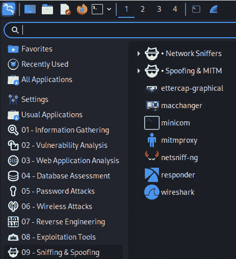
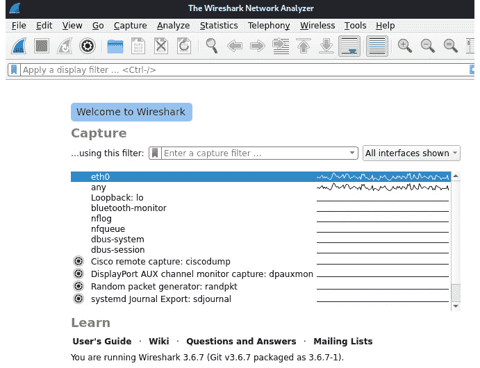

# 第十六章：网络取证分析工具

我们到了最后一章。我相信“强势完成”这一概念，所以让我们继续保持节奏，通过一些**网络取证分析工具**（**NFAT**）来继续我们的 DFIR 之旅，我相信你会觉得这些工具非常有用。

到目前为止，我们已经进行了相当多的获取和分析工作，包括硬盘、存储、RAM 和交换文件分析，恶意软件分析，甚至是一些网络数据包分析，目的是获取、记录和分析证据，以期找到或恢复证据。然而，让我们进一步分析数据包、协议和网络通信，因为它们也可能是有用的证据，有助于我们在 DFIR 调查中找到线索。

认识到一些事件和犯罪发生在互联网或**局域网**（**LAN**）上，捕获和分析网络流量应该是我们调查过程中不可或缺的一部分，有助于发现可能帮助我们更好地理解事件的证据，指向事件的起源，甚至在某些情况下，如果怀疑事件不是孤立的，还能帮助扩大调查范围。

本章将涵盖以下主题：

+   使用 Wireshark 创建**数据包捕获**（**PCAP**）文件

+   使用 NetworkMiner 进行数据包分析

+   使用 PcapXray 进行数据包分析

+   使用[packettotal.com](http://packettotal.com)进行在线 PCAP 分析

+   使用[apackets.com](http://apackets.com)进行在线 PCAP 分析

+   报告与展示

# 使用 Wireshark 捕获数据包

**Wireshark**是一款非常流行且知名的网络和数据包分析工具，广泛用于网络故障排除。它在 Kali 中预装，并且一旦了解了过滤器、协议和颜色代码，使用起来相对简单。

如果你是 Wireshark 协议分析器和数据包分析的新手，你可以在网上找到一些很好的教程，包括官方文档：[`www.wireshark.org/docs/wsug_html_chunked/ChapterCapture.xhtml`](https://www.wireshark.org/docs/wsug_html_chunked/ChapterCapture.xhtml)。

首先，让我们看看我们的网络接口是什么，然后开始使用 Wireshark：

1.  启动 Wireshark 后，我们需要指定接口来捕获数据包。要在 Kali Linux 中查看你的接口信息，打开终端并输入**ifconfig**：


图 16.1 – ifconfig 输出

在前面的屏幕截图中，**ifconfig**命令显示了两个接口的输出。我将使用的接口是我的以太网接口，列为**eth0**，另外还有一个回环接口，列为**lo**。

请注意

如果你使用无线网络接口卡（NIC）来捕获接口，它将显示为**wlan0**。

1.  现在我们知道了将用于捕获数据包和嗅探网络的接口，我们可以通过在终端中输入**sudo wireshark**来启动 Wireshark。

1.  你也可以通过点击**应用程序** | **09-嗅探与伪装** | **Wireshark**来运行 Wireshark：



图 16.2 – 在嗅探与伪装菜单中查找 Wireshark

1.  启动 Wireshark 后，如前所述，我们需要选择一个接口来开始捕获数据包。在这个实例中，我的**eth0**接口被高亮显示，但请确保选择你将用于捕获数据包的接口。



图 16.3 – Wireshark 接口

1.  选择接口后，我们可以通过点击*蓝色鲨鱼鳍*图标或点击**捕获** | **开始**来开始数据包捕获过程：


图 16.4 – 在 Wireshark 中启动数据包捕获过程

点击**开始**按钮后，数据包捕获过程会自动开始。


图 16.5 – Wireshark 显示 eth0 上的流量

在前面的截图中，我们可以看到 Wireshark 将显示分为三个部分，顶部的主部分包含以**源**、**目标**、**协议**等信息为行的内容，所有信息都进行了颜色编码。

1.  要停止捕获，点击顶部的*停止*按钮（红色方块图标）：


图 16.6 – Wireshark 停止捕获按钮

1.  请确保通过点击**文件** | **另存为**来保存数据包捕获文件。


图 16.7 – 在 pcapng 文件中保存流量

1.  我们还可以使用特定的 Wireshark 过滤器来排序数据，从而呈现数据包的逻辑性和更简洁的视图。

Wireshark 过滤器

你可以在[`www.networkdatapedia.com/single-post/2019/01/29/Top-10-Wireshark-Filters`](https://www.networkdatapedia.com/single-post/2019/01/29/Top-10-Wireshark-Filters)查看所有 Wireshark 过滤器的列表。

要为具有特定源或目标 IP 地址的数据包设置过滤器，我们使用**ip.addr==a.b.c.d**格式，如下例所示：

```
ip.addr==172.16.79.21
```

以下图显示了前面**ip.addr**过滤器的输出：


图 16.8 – ip.addr Wireshark 过滤器输出

1.  要为特定的 TCP 端口设置过滤器，我们可以使用**tcp.port==**过滤器，如以下示例所示：

    ```
    tcp.port==443
    ```

以下图显示了前面**tcp.port**过滤器的输出：


图 16.9 – tcp.port 过滤器

1.  要设置一个过滤器以搜索特定的单词、字符串甚至用户，可以使用 **frame contains** 过滤器。例如，我访问了一个网站（[www.malware-traffic-analysis.net](http://www.malware-traffic-analysis.net)），该网站托管了恶意软件感染的样本 PCAP 文件，并下载了一个样本 PCAP 文件。要搜索 *malware* 这个词，我将使用 **frame contains** **malware** 过滤器。

下图展示了 **frame contains** **malware** 过滤器的输出：


图 16.10 – frame contains malware 过滤器输出

1.  要设置一个过滤器以查看两个 IP 之间的对话，我们使用 **ip.addr==a.b.c.d && ip.addr==w.x.y.z** 格式，如下所示：

    ```
    ip.addr==172.16.79.94 && ip.addr==172.16.0.1
    ```

下图展示了前述过滤器的输出：


图 16.11 – 设备间的数据包交换

注意

你可以在这里找到有关 Wireshark 过滤器的更多信息：[`wiki.wireshark.org/DisplayFilters`](https://wiki.wireshark.org/DisplayFilters)。

使用 Wireshark 确实需要花费一些时间来学习，但我向你保证，它不仅对我们作为 NFAT 在 DFIR 方面的用途非常有用，而且还是一款非常好的网络故障排除工具。接下来我们将介绍一个类似的工具，它以更易读的格式展示数据包分析结果。

# 使用 NetworkMiner 进行数据包分析

对于一些新接触协议分析器的人来说，分析来自 Wireshark 的捕获数据可能会有些挑战，因为这需要了解协议、过滤器并能够跟踪数据流（所有这些随着实践会变得更容易）。

**NetworkMiner** 是一个易于使用的数据包捕获查看器，某些用户可能会发现它比 **.packet** 捕获（PCAP）分析更易于使用，因为它通过解析 PCAP 文件，将找到的数据提取并分类为主机（带有操作系统指纹）、文件、图像、消息、会话等。

NetworkMiner 提供免费版和付费专业版，可以安装在 Windows 和 Linux 上。

我们现在将下载 NetworkMiner，使用 Wine 安装它，然后分析一个样本 PCAP 文件：

1.  你可以通过此链接访问 NetworkMiner 的官方网站：[`www.netresec.com/?page=NetworkMiner`](https://www.netresec.com/?page=NetworkMiner)。

你还可以在 [`www.netresec.com/?download=NetworkMiner`](https://www.netresec.com/?download=NetworkMiner) 下载安装文件。

1.  下载文件后，右键点击文件并选择 **Extract Here** 选项。这将提取 **NetworkMiner_2-7-3** 文件夹。打开该文件夹查看提取的内容。


图 16.12 – 提取的 NetworkMiner 文件

1.  运行 NetworkMiner 非常简单，因为我们已经安装了 Wine。只需双击 **NetworkMiner.exe** 即可打开程序。


图 16.13 – 在 Kali Linux 的 Wine 中运行的 NetworkMiner 界面

1.  要查看更多文档和视频，并访问示例 PCAP 文件，请访问此链接：[`www.netresec.com/?page=Resources`](https://www.netresec.com/?page=Resources)。

1.  在本次分析中，我们将使用来自[`wiki.wireshark.org/uploads/__moin_import__/attachments/SampleCaptures/http_with_jpegs.cap.gz`](https://wiki.wireshark.org/uploads/__moin_import__/attachments/SampleCaptures/http_with_jpegs.cap.gz)的 PCAP 文件，您可以将其下载并保存到您的 Kali 机器上。该文件之前在*第十五章*中，用于与 Xplico 一起使用，因此您可能已经将其保存到您的**下载**文件夹中。

我决定使用这个文件，这样我们可以比较 Xplico 和 NetworkMiner 在结果上有什么不同。

1.  我已经将文件下载并解压到我的**下载**文件夹中。在 NetworkMiner 程序中，点击**文件**和**打开**，然后浏览到**Downloads**文件夹中的**http_witp_jpegs.cap**文件（或者您下载文件的位置）。点击该 PCAP 文件，然后点击**打开**。


图 16.14 – 在 Kali 中浏览样本文件

1.  点击**打开**后，NetworkMiner 会加载并分析该文件，并自动为我们分类结果，如下所示：


图 16.15 – 分析和分类的样本 PCAP 文件的结果

1.  一开始，我们会在**主机**标签中看到有关设备的信息。**.pcap**文件包含每个类别的多个命中：

    +   **主机** – **4**

    +   **文件** – **11**

    +   **图片** – **5**

    +   **消息** – **0**

    +   **凭证** – **8**

    +   **会话** – **19**

    +   **DNS** – **0**

    +   **参数** – **257**

1.  在**主机**标签中，点击 IP 地址旁的展开（**+**）按钮，即可查看每个主机的详细信息。我们可以展开第二个 IP 地址（**10.1.1.1**）来查看详细信息。我们还可以展开其他项，如**操作系统**，**外发会话**和**主机详细信息**，以查看 NetworkMiner 自动解析的所有信息。


图 16.16 – 主机标签中的结果

在前面的截图中，我们可以看到诸如 MAC 地址、NIC 制造商、操作系统（Linux）、开放端口、外发会话到服务器，甚至是主机详细信息，这些信息告诉我们该系统是运行在 Red Hat Linux 上的 Apache web 服务器。

1.  接下来，让我们点击**文件**标签。我们可以看到多个条目和文件类型（**html**，**xapc**，和**jpeg**）。


图 16.17 – 文件标签列表

1.  我们还可以打开这些链接并查看文件。右键点击**index.xhtml**文件并选择**打开**。这将在浏览器中打开**.xhtml**文件。你也可以对其他文件（如**.jpeg**文件）执行此操作。

1.  点击**图像**标签。在这种情况下，NetworkMiner 已经找到了**5**张带预览图像。你也可以右键点击图像，选择**打开图像**来查看该图像。


图 16.18 – 图像标签

1.  在**消息**标签中，有三条消息显示了源主机和目标主机，以及消息/电子邮件的发送者和接收者，如果我们向右滚动的话。

1.  在**凭据**标签中，我们发现了一些非常有趣的证据。此标签显示了客户端和服务器的 IP 地址、操作系统类型、协议以及可能在该会话中使用的任何关联用户名和密码，这些密码很可能是未加密的明文密码。

1.  **会话**标签显示了数据包捕获时设备之间的会话信息。

1.  **关键字**标签/部分允许调查员输入单个关键字（字符串或十六进制格式），或从文本文件中添加关键字进行搜索，以查找结果列表。如果使用关键字，您可能需要重新指定一个关键字列表或文件，然后重新打开**.pcap**文件来使用 NetworkMiner。

如我们所见，NetworkMiner 是一个强大的数据包捕获分析工具，它通过自动解析和分类在**.pcap**文件中找到的信息，使得分析对调查员和网络人员来说更加简便。

我相信很多人会发现，在进行数据包分析时，NetworkMiner 比 Wireshark 更简单易用，因为其结果以更简洁、更易读的格式展示。请记住，NetworkMiner 的免费版有一些限制，这就是我们需要了解多个 NFAT 工具的原因。接下来，我们将介绍另一个工具——PcapXray。

# 使用 PcapXray 进行数据包捕获分析

与 NetworkMiner 类似，**PcapXray**是另一个强大而全面的数据包捕获分析工具。该工具的主要功能之一是识别恶意流量、隐蔽通信、网页流量，甚至是 Tor 流量。

现在，我们将在 Kali Linux 中安装并配置 PcapXray，然后开始分析数据包捕获文件：

1.  让我们通过从 GitHub 克隆 PcapXray 来安装它，在终端中输入以下命令：

    ```
    sudo git clone https://github.com/Srinivas11789/PcapXray.git
    ```

像往常一样，我已经将目录更改为桌面。当你将 PcapXray 克隆到桌面时，这会花费一些时间，因为文件的大小为 115MB。


图 16.19 – 将 PcapXray 克隆到 Kali

1.  接下来，我们需要通过输入以下命令来安装**graphviz**：

    ```
    sudo apt install graphviz
    ```

以下图示展示了前述命令的输出：


图 16.20 – 安装 graphviz

1.  通过在终端中运行以下命令安装**python3-pil.imagetk**：

    ```
    sudo apt install python3-pil python3-pil.imagetk
    ```

下图显示了前面命令的输出结果：


图 16.21 – 安装 python3-pil.imagetk

1.  我们现在应该能够看到一个包含启动应用所需文件的 PcapXray 文件夹。使用**ls**命令列出并显示文件夹，然后使用**cd PcapXray**命令切换到**PcapXray**文件夹。


图 16.22 – 切换到 PcapXray 目录

1.  在运行 PcapXray 之前的最后一步是通过输入以下命令安装应用所需的所有依赖项：

    ```
    pip3 install -r requirements.txt
    ```

这可能需要一些时间，因为它将下载**pyshark**、**stem**、**pyvis**和其他所需的组件。


图 16.23 – 安装额外的 PcapXray 依赖项

1.  在**PcapXray**目录内，我们现在可以通过输入以下命令启动 PcapXray GUI：

    ```
    python3 Source/main.py
    ```


图 16.24 – 在终端中启动 PcapXray

1.  首先，从[`www.malware-traffic-analysis.net/2019/07/19/index.xhtml`](https://www.malware-traffic-analysis.net/2019/07/19/index.xhtml)下载名为**2019-07-19-traffic-analysis-exercise.pcap**的文件进行分析。点击文件名下载它，然后解压文件以开始分析。当系统提示输入密码时，输入**infected**。

1.  现在，我们可以返回到 PcapXray GUI，并浏览到提取的**.pcap**文件，指定输出目录，如下所示：


图 16.25 – PcapXray 文件上传界面

1.  点击**Analyze!**按钮，接下来会花费一些时间来执行分析。当分析完成后，你应该能够点击**Visualize!**按钮，查看可视化结果。


图 16.26 – 自动化 PcapXray 分析结果

1.  尽管在前面的截图中有些难以看到，它对源和目的地之间的流量进行了分析。点击**InteractiveMagic!**按钮，查看设备之间的不同视图及其相互关系。


图 16.27 – PcapXray InteractiveMagic 视图

这些视图可以帮助确定哪些设备彼此通信，无论是合法的还是隐蔽的，并帮助进行事件分析。

1.  我们还可以通过点击流量可视化上方菜单中的**All**按钮，来缩小视图范围，选择我们希望查看的流量类型。


图 16.28 – PcapXray 全部流量视图

1.  点击**恶意**，然后再次点击**可视化！**按钮。


图 16.29 – 恶意流量通信

在这里，我们可以看到标记为**恶意**的流量，以及与通信设备相关的 IP 和网关地址。如果我们将流量视图切换为 HTTPS，然后再次点击**可视化！**按钮，我们还可以看到 HTTPS 网页流量，从而开始重建或还原恶意软件、设备和网页流量在捕获时的场景。

现在让我们开始使用在线工具进行 PCAP 分析。我们从[packettotal.com](http://packettotal.com)开始。

# 使用 packettotal.com 进行在线 PCAP 分析

现在让我们来看一个独特的在线自动化 PCAP 分析资源，它是免费提供给我们的。这将通过使用[www.packettotal.com](http://www.packettotal.com)来完成。


图 16.30 – PacketTotal 文件上传界面

PacketTotal 完全免费，界面简单，用户可以将 PCAP 文件拖入上传区域，或者点击**上传**按钮上传并自动分析**.pcap**文件。唯一的限制是**.pcap**文件上传的大小限制为 50MB。

现在我们将下载一个示例数据包捕获文件，并将该文件上传到 PacketTotal 进行自动分析：

1.  下载用于分析的样本文件，[`mega.nz/file/6FciHZhY#bF1M-9kwmWLgUfQ_uq2_9k1DICIUkeY4lrT58X8XVXs`](https://mega.nz/file/6FciHZhY#bF1M-9kwmWLgUfQ_uq2_9k1DICIUkeY4lrT58X8XVXs)。该文件名为**SQL 注入测试.pcap**。

1.  点击**上传**按钮，浏览到已下载的文件，然后点击**打开**。


图 16.31 – PacketTotal PCAP 文件上传状态

1.  在点击**分析**按钮之前，您需要点击**我不是机器人**以继续。


图 16.32 – PacketTotal reCAPTCHA 验证

1.  一旦分析完成，PacketTotal 会提供一个非常详细的流量捕获视图。注意顶部的分类（**恶意活动**、**可疑活动**、**连接**和各种协议）。首先显示的是**可疑活动**页面。


图 16.33 – PacketTotal 可疑活动标签

我们可以看到**HTTP::SQL_Injection_Attacker**和**HTTP::SQL_Injection_Victim**警报立即被检测到！

1.  接下来点击**连接**。

在这里，我们可以看到**连接 ID**以及**发送者**和**目标**IP，以便获得更多关于**192.168.0.107** IP 地址的信息。


图 16.34 – PacketTotal Connections 标签页

1.  最后，让我们点击**Strange Activity**。


图 15.35 – PacketTotal Strange Activity 标签页

1.  欢迎继续在 PacketTotal 和其他工具上进行分析，使用在[`www.malware-traffic-analysis.net/index.xhtml`](https://www.malware-traffic-analysis.net/index.xhtml)和[`www.malware-traffic-analysis.net/training-exercises.xhtml`](https://www.malware-traffic-analysis.net/training-exercises.xhtml)提供的免费 PCAP 文件。

让我们进入本章和本书的最后一个工具。

# 使用 apackets.com 进行在线 PCAP 分析

在我们的最后一个练习中，让我们看看另一个在线数据包分析工具，网址为[`apackets.com/`](https://apackets.com/)。那么，让我们开始这个练习吧：

1.  让我们从[`www.malware-traffic-analysis.net/2022/06/07/index.xhtml`](https://www.malware-traffic-analysis.net/2022/06/07/index.xhtml)下载一个示例文件。这个文件的名称是**Emotet-epoch5-infection-with-Cobalt-Strike-.pcap**。


图 16.36 – A-Packets 文件上传界面

1.  点击**From Device**按钮并浏览到下载的示例文件，以进行上传分析。


图 16.37 – A-Packets 文件上传状态

1.  一旦 A-Packets 自动处理并分析了我们的**.pcap**文件，接下来会呈现一个非常详细并分类的分析结果，如下图所示：


图 16.38 – A-Packets 分析结果

如果我们向下滚动一点，我们应该能看到更多的结果，包括 DNS 和 DHCP 协议，甚至是通信中使用的以太网设备：


图 16.39 – 更多 A-Packets 分析结果

如果你看一下页面左侧的菜单，你会注意到有几个标签，其中一些标签旁边可能会有数字。这些数字表示每个项目的发现数量。

1.  作为示例，让我们点击**Connections**标签页，它显示了所有连接到捕获数据包的本地机器的连接，如下所示：


图 16.40 – A-Packets Connections 标签页结果

如果你再向下滚动一点，你会看到一个展示通信设备地理位置的视图：


图 16.41 – A-Packets Connections 标签页通信图

1.  现在，让我们点击**Open Ports**标签页，查看 A-Packets 发现的**45**项结果，如下所示：


图 16.42 – A-Packets 开放端口标签页发现

在前面的截图中，我们可以看到涉及此通信的各种 IP 地址的开放端口。

1.  让我们继续查看**服务器**标签页，以查看服务器通信发现：


图 16.43 – A-Packets 服务器标签页

1.  在**服务器**标签页中，我们可以看到 DNS 信息。让我们通过点击左侧菜单中的**DNS**标签，进一步深入查看 DNS 发现：


图 16.44 – A-Packets DNS 标签页发现

从前面的截图中查看 DNS 发现，我们可以看到许多不存在的域名出现在 DNS 条目列表中，这可能表明可疑的网页活动和通信，需要进一步调查。

如你所见，[apackets.com](http://apackets.com) 网站为我们提供了非常详细的封包捕获分析，尽管它是一个在线 NFAT 工具，但它应该成为你网络 DFIR 工具库的一部分。接下来，让我们简要介绍一下报告和展示部分，为本书画上句号。

# 报告与展示

每个人在创建和展示报告时可能有自己的风格。然而，通常的格式是典型的 PDF 格式分析报告。标题结构通常如下：

+   标题

+   目录

+   调查员和案件详情

+   工作范围

+   执行摘要

+   技术发现

+   附录

尽管这仍然是个人偏好，但通常会包括所有的发现、文档和截图，以确保充分披露。将包含所获证据、文档和发现的所有媒体交给客户也是一种常见做法，以确保保密性。

# 总结

恭喜！你已经读完了本书，或者说，跟我一起完成了 DFIR 的旅程，因为这是我们一起的最后一章！现在你已经能够使用 Wireshark 创建自己的 PCAP 文件，同时也可以选择某种工具，或者像我一样，使用本章中的所有工具，在进行网络取证时尽可能多地收集信息，使用 Wireshark、NetworkMiner、PcapXray、PacketTotal 和 A-Packets。

希望你喜欢这本书，并且在你的 DFIR 调查中能找到有用的信息。如果你有任何问题或需要建议，欢迎在 LinkedIn 上加我：[`tt.linkedin.com/in/shiva-parasram-87a66564`](https://tt.linkedin.com/in/shiva-parasram-87a66564)。
