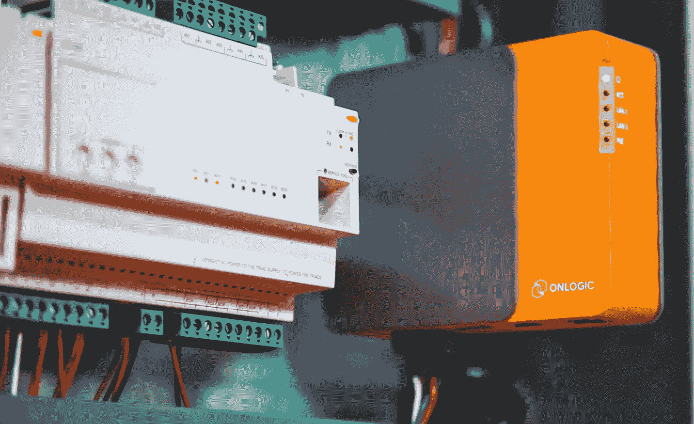

# 第三章：3  

# 应用设计要求标准——硬件选择  

在本章中，我们将深入探讨设计标准，这些标准将决定你选择什么硬件。仅仅选择一个平台的简单决定，可能会带来成千上万的其他依赖项，而这些依赖项你可能之前从未考虑过。本章及下一章（即本章的伴侣）将成为你在构建设备时所有未来工作的基石。  

此外，我理解如果你正在阅读本书（顺便说一句，我非常感激你选择了这本书！），那么你对其核心主题有一定的兴趣。作为作者，我假设你不仅对**嵌入式 Linux 系统**感兴趣，而且你可能正深入参与此类项目。基于这一点，我认为你应该具备一定的基础技术知识。我相信本章及下一章中提供的信息足够有价值，能够为你的项目增添助力，而又不会过于基础到冒犯你已经掌握的技能。本章及下一章的目的是帮助你连接所有隐喻性的点，照亮你的解决方案可能达到的更大图景。  

重要说明  

如果你打算构建**虚拟设备**，本章的内容可能对你和你的团队不太相关，因为我们将重点讨论硬件。本章主要面向物理设备。我们将简要回顾虚拟设备。在虚拟设备（或云服务）方面，你需要考虑为哪些平台创建镜像。近年来，虚拟设备变得越来越普遍，特别是在任何**超大规模云服务商**（如 Azure、AWS 或 Google）的应用商店中。许多人仍在为 OpenStack、KVM、Hyper-V 和（主要）VMware ESXi 构建虚拟设备。  

无论你选择将产品做成物理的、虚拟的，还是两者兼具，本章将帮助你和你的设计团队理清所有标准，以便做出合适的硬件平台选择。此外，我们还将回顾最佳实践如何在性能和可扩展性方面影响这些选择。这些最佳实践直接关联到你的安全性足迹，但它们也会帮助你构建更好的产品。  

在本章中，我们将讨论以下内容：  

+   目标性能要求是什么？  

+   是否存在任何环境限制？  

+   **现成商品**（**COTS**）与定制硬件  

+   当前有哪些主流硬件平台可用？  

+   硬件和使用案例标准将决定你操作系统的选择

让我们开始吧。  

# 目标性能要求是什么？  

现在，是时候进入技术层面了。希望你的解决方案开发人员至少对虚拟设备的最终需求有一个大致的了解。如果没有这些关键信息，你的原型设计过程可能会非常昂贵，因为你可能需要测试多个硬件平台的不同迭代版本。

无论你的解决方案的规模大小，或是物理的还是虚拟的，你都必须确保进行广泛的性能测试，以确保所实施的安全措施仍然能够让解决方案按预期执行任务。我们将在后续章节中讨论如何将这些安全措施集成到解决方案中。

另一个需要考虑的关键因素是你解决方案的未来状态。确保你为应用程序、安全措施和用户数据规模设定的规格具有一定的安全缓冲。未来的安全补丁或应用程序的变化对性能的影响是无法预见的。给你的解决方案额外分配一些 CPU、内存和存储，能在未来为你的支持团队节省不少麻烦。

现在，让我们来了解一下，如果我们决定这样做，我们需要哪些内容，以便能够虚拟化我们的解决方案。

## 虚拟设备

如果你计划将你的产品交付为虚拟设备，这个过程将会减少很多压力。你不需要测试硬件！你不需要担心采购符合生命周期需求的平台。这是令人解放的。决定创建一个虚拟设备（或公共云产品）将资源需求交给客户。

然后，你的客户可以决定具体分配多少 vCPU、RAM、存储和网络带宽给虚拟设备。他们提供平台。这样做的附加好处是，你知道你需要选择的操作系统必须支持 Intel/AMD，因为这是企业中的通用标准。当然，你的公司可以为这些基准提供建议。在公共云提供商方面，你可以将基础虚拟机大小作为市场产品的一部分。

在这个阶段，关键的决定变成了你打算为哪个虚拟化平台提供你的解决方案——VMware、OpenStack、KVM、Hyper-V、Google、Azure 还是 AWS。最初，你可能会从一个平台开始，然后根据团队的可行性决定是否添加其他平台。

我不得不提到，一个优秀的产品经理会进行调研，以确定最适合平台化的选择。根据这些调研，你可能会发现目标用户群体之间的差异，包括他们的偏好、采购周期，以及最重要的，他们对云平台和/或本地虚拟化平台的偏好。

尽管许多解决方案无法以虚拟设备的形式交付，但如果你的产品可行，我建议认真考虑这一方法。它可以提供巨大的灵活性，我们将在本书后面进行详细介绍。

现在我们已经讨论了物理设备的性能，接下来考虑硬件设计。

## T 恤尺寸划分

**T 恤尺寸划分**是一种根据所需容量来扩展和交付解决方案的方法。它旨在标准化并简化将解决方案交付给最终客户的过程，适用于最常见的需求规模。

让我通过一个例子来帮助描述 T 恤尺寸划分方法。为了讨论的方便，假设某公司想要提供一个独立的存储解决方案。该公司计划提供小型、中型和大型解决方案。现在很清楚为什么他们称之为 T 恤尺寸划分。

他们决定小型解决方案将具有以下硬件属性：

+   单个多核 CPU（具有低核心数）

+   32 GB 内存

+   双千兆以太网接口

+   4 个 1 TB SATA SSD 驱动器

进入下一个级别，他们决定中型存储解决方案具有以下硬件属性：

+   单个多核 CPU（具有高核心数）

+   64 GB 内存

+   四个千兆以太网接口

+   8 个 1 TB SATA SSD 驱动器

他们在确定硬件配置时决定，大型存储设备的硬件属性如下：

+   双多核 CPU（具有高核心数）

+   128 GB 内存

+   四个千兆以太网接口

+   双 10G 以太网接口

+   16 个 1 TB SATA SSD 驱动器

这些例子已简化以说明一个观点。虚构的公司选择了三个级别，每个级别的规模都比前一个大。在物理设备的世界里，这种尺寸划分方法也意味着，要创建一个 T 恤大小的产品，必须做更多工作，确保每次发布的解决方案都能稳定地提供预期的性能和安全性。选择创建这种分步尺寸的产品，可能迫使企业完全采用不同的硬件供应商和平台，这种情况并不罕见。

为解决方案进行 T 恤尺寸划分会给团队带来额外的工作量，但我认为这是一个值得考虑的优秀方法。这样做可以使你为不同需求规模的广泛受众提供解决方案。现在我们已经回顾了规模对设计的影响，接下来看看硬件领域的其他因素。

## CPU/VCPU

CPU 是决定解决方案其他所有方面的最重要因素。它在性能、功耗和价格方面有着广泛的差异。解决方案的外形、环境阈值和性能需求最终将决定选择。

在我们讨论每个 CPU 系列带来的优点之前，我希望您了解这个方程式的阴暗面。没错——我从坏消息开始，希望在接下来的几个部分中能够以积极的消息结束。由于本书聚焦于安全性，我们必须深入探讨选择错误平台时可能出现的局限性、漏洞、利用这些弱点的行为以及其他不当行为。

本书稍后将深入探讨您团队可以使用的所有资源，这些资源将帮助您了解新的威胁、漏洞、修复和缓解措施。目前，让我们先来了解今天需要避免的那些问题。以下列表基于**常见漏洞和暴露（CVE）**数据库中的条目。

值得注意的是，那些严重的漏洞会被命名，但并不会使用像热带风暴、飓风和台风这样的友好人类名称。它们会被命名为让人感到不祥和压抑的名字。通常，发现漏洞的团队还会为其设计一个标志。

目前 CVE 数据库中大约有 24 万个已知的各类漏洞，我将只回顾一些在全球范围内引起关注的漏洞。这个列表将帮助您入门，但请不要止步于此——在做出选择之前，继续进行研究。以下列表突出显示了一些最具影响力的 CVE，这些 CVE 应该影响您的 CPU 和平台尽职调查。我们还将探讨它们的影响以及缓解技术：

+   **Meltdown**：这一漏洞家族包含在多个 CVE 中，核心问题是能够利用 CPU 中的竞争条件，获取特权信息。它有 5 个 CVE——CVE-2023-46836，CVE-2022-42331，CVE-2018-7112，CVE-2018-19965 和 CVE-2017-5754：

    +   **影响**：Intel x86 微处理器，AMD 微处理器，IBM Power 处理器以及一些 ARM 微处理器。

    +   **缓解措施**：大多数操作系统供应商已经创建了补丁来缓解这一漏洞，但一旦应用这些修复，系统的性能会受到严重影响。2019 年以后制造的较新处理器应该内置了硬件和固件缓解措施，但仍然存在 2023 年才出现的新型瞬态执行 CPU 漏洞。

+   **Spectre**：这一漏洞家族包含在许多 CVE 中，其漏洞利用方式与 Meltdown 非常相似，都是通过 CPU 条件的漏洞来获取未经授权用户的特权信息。它有 31 个 CVE，所以我将重点介绍最重要的两个——CVE-2017-5753 和 CVE-2017-5715：

    +   **影响**：Intel x86 微处理器，AMD 和 ARM 微处理器。

    +   **缓解措施**：大多数操作系统厂商已经创建了补丁来缓解这个漏洞，但一旦这些修复应用到系统中，会对性能产生严重影响。2019 年后发布的较新处理器应内置硬件和固件缓解措施，但仍然存在新的瞬态执行 CPU 漏洞，最早可追溯到 2023 年。

+   **崩溃**：也被称为**数据采样收集**（**GDS**），崩溃是另一种瞬态执行 CPU 漏洞，攻击的是 CPU 中的推测执行功能，称为**高级向量扩展**（**AVX**）。通过这一弱点，有可能利用漏洞访问向量寄存器中的数据（CVE-2022-40982）：

    +   **影响范围**：第 6 代至第 11 代 Intel X86-64 消费级微处理器，第一代至第四代 Intel Xeon X86-64 处理器。

    +   **缓解措施**：预计 Linux 内核 6.5 或更高版本将包含用来缓解此漏洞的代码。然而，即便到了 2024 年，几乎所有现代消费类计算机仍然容易受到这一漏洞的影响。

+   **预示**：此漏洞也被称为**L1 终端故障**（**L1TF**）。它通过攻击内存管理来瞄准虚拟机、虚拟机监控程序（hypervisor），最终影响相关的操作系统（CVE 编号：CVE-2018-3615 和 CVE-2018-3620）：

    +   **影响范围**：几乎所有 Intel 和 AMD 微处理器系列。

    +   **缓解措施**：更换处理器似乎是解决该问题的最佳方法。此问题在 Intel Xeon 处理器系列中已经得到解决，从 Cascade Lake 版本开始。所有较新的芯片组应对这些漏洞免疫。

+   **起源**：此漏洞，也称为**返回地址安全**（**RAS**），是一种新型的侧信道攻击，针对的是推测执行（CVE-2023-20569）：

    +   **影响范围**：几乎所有近期的 AMD 微处理器。

    +   **缓解措施**：AMD 已发布 BIOS 和固件补丁包来缓解这一漏洞。此外，操作系统厂商可能也已经发布了替代性补丁。截至 2024 年 2 月 28 日，AMD 已更新其发布的白皮书，提供了有关如何在未来的 AMD 处理器上缓解此攻击的最新信息（[`www.amd.com/content/dam/amd/en/documents/corporate/cr/speculative-return-stack-overflow-whitepaper.pdf`](https://www.amd.com/content/dam/amd/en/documents/corporate/cr/speculative-return-stack-overflow-whitepaper.pdf)）。

这个列表是我自己版本的五个最需要警惕的可利用漏洞。每个漏洞通常都与多个 CVE 关联，并且并非所有漏洞都已得到完全缓解。新的变种或类似的攻击仍在困扰所有 CPU 平台，威胁与 AI 使用不断演变，寻找新漏洞。

在有了这些基础信息后，你可以看到硬件选择如何影响你的安全性足迹。当我们进入下一部分时，记住这些因素将在下章讨论操作系统选择时重新出现。现在，我们先来看看各种内存考虑事项。

## 内存

内存类型与 CPU 及其相关的内存控制器密切相关。这些都是系统主板或母板上不可更改的部分。由于这些依赖关系，这是一个相对简单的选择点。然而，从安全性和可靠性角度来看，在做设计选择时需要考虑一些差异。每一个因素都有其成本和其他影响。

根据我的经验，你可能被迫考虑的唯一值得质疑的选择是使用**错误校正码内存**（**ECC RAM**）或非 ECC RAM。

什么是 ECC RAM？它是一种容错内存，主要用于高端服务器和工作站。虽然它确实提供更高的可靠性，但使用它可能会稍微影响性能。如果你需要可靠性，那么大约 2%的性能损失可能并不重要。

由于 ECC RAM 的成本高于标准 RAM 模块，它在物联网设备或小规模嵌入式 Linux 系统中并不常见。

接下来，我们将考虑一个更重要的因素，它可能会受到你的安全性足迹的影响。

## 磁盘输入/输出（I/O）

为了最好地理解这对你的设计的影响，你必须了解**输入/输出每秒操作次数**（**IOPS**）这一术语的定义。由于本书的重点是安全性，而不是教学技术术语，我认为在这里使用一个标准的、公开接受的定义是合适的。

IOPS 定义为“*一种输入/输出性能测量，用于描述计算机存储设备，如硬盘驱动器（HDD）、固态硬盘（SSD）和存储区域网络（SAN）。像基准测试一样，存储设备制造商发布的 IOPS 数字与实际应用性能没有直接关系*。”

提示

欲了解更多相关信息，请访问维基百科页面：[`en.wikipedia.org/wiki/IOPS`](https://en.wikipedia.org/wiki/IOPS)。维基百科是一个宝贵的公共资源，如果它对你有帮助，应该考虑向其捐赠。多年来，它确实帮了我不少忙。

其次，你必须理解加密对系统性能的影响，特别是在开销和 IOPS 下降方面。

第三个也是最后一个需要考虑的因素是你的解决方案将使用哪种类型的存储。无论你是在创建虚拟设备还是物理设备，这一点都很重要。两种交付方式之间的痛苦区别在于，物理设备可以控制内建的存储类型，而虚拟设备则无法控制，只能提供建议。如果最终用户可以控制所使用的存储类型，你的解决方案可能无法如广告中所示那样工作，甚至更糟的是，如果存储速度过慢而无法满足应用需求，可能根本无法正常运行。那么，让我们看看有哪些存储选项。

在接下来的存储分类列表中，我将重点关注存储本身的基本单元，而不是讨论不同的海量存储选项，比如阵列或网络附加存储。这本身可能就是一本书。那么，让我们看看各类独立存储驱动器的选项：

+   **硬盘驱动器**（**HDD**）是计算机系统中最古老的存储设备之一。几十年来，旋转磁盘的尺寸大大缩小，但存储容量却不断增加。早期的 HDD 容量以兆字节为单位，但如今它们可以容纳多达几个太字节。限制这种存储平台整体性能的其他因素包括连接驱动器的总线和 IOPS 数量：

    +   **总线**: SATA

    +   **IOPS**: 平均在 50 到 80 之间

提示

所有提到的存储平台都提供总线和 IOPS。

+   **固态硬盘**（**SSD**）是存储技术从 HDD 硬盘的一个飞跃。SSD 没有活动部件，且通常以非常小的形式因数提供。它们一般以 2.5 英寸硬盘或卡片形式交付：

    +   **总线**: SATA 或 PCIe

    +   **IOPS**: 根据平台不同，从 4,000 到数万（或更多）

+   **非易失性内存快照**（**NVME**）是最新的消费者存储平台。NVME 驱动器通常以小卡片的形式提供。有时，多个 NVME 驱动卡可以安装到一个更大的 PCIe 卡上以提高存储密度：

    +   **总线**: PCIe

    +   **IOPS**: 根据平台不同，从 10,000 到数百万不等

现在我们已经深入探讨了一些最常见的存储类型，让我们看看添加加密如何影响它们的性能。

在磁盘、卷或文件系统级别的加密可以轻松分为两种交付方式。这两种方式是基于硬件的加密和基于软件的加密。每种方式都有其优缺点。

基于硬件的解决方案通常通过 PCIe RAID 卡提供。这些卡不仅可以让你创建弹性卷，还能将加密的开销从主 CPU 或操作系统中卸载出去。唯一的缺点是需要有适合的插槽来安装这些卡，以及这些卡的成本较高。

**Linux 统一密钥设置**（**LUKS**）是 Linux 发行版中标准的软件加密方法。LUKS 被广泛应用于各种规模的解决方案中，尽管它在内存和 CPU 性能上会增加一些开销。大规模应用时，它需要外部密钥管理，但在单个系统上，它会要求用户在访问文件系统之前输入密码短语。这可能会对启动和更新过程造成一定的麻烦，因为它需要手动干预。除了这些因素外，实施 LUKS 不需要额外的费用。

对静态数据进行加密被认为是系统安全的基石。另一方面，传输中的数据加密通常是在应用程序或网络层处理的。

## 网络

在本节中，我们将回顾几种可以实施的选项，以增强网络配置的安全性，同时减轻解决方案 CPU 的负担。对于每一个选项，我们将为你提供一些链接，进一步了解其技术。每一项技术将在这里简要介绍，但它们都能大大帮助你的团队设计出更加安全的解决方案。

我不想浪费你时间去讨论防火墙、VLAN、地址段白名单或其他基本网络安全内容。由于本书专注于设计、构建和支持安全的嵌入式 Linux 系统设备，我打算重点介绍能帮助你的硬件。让我们来看看几个有趣的技术，你应该考虑将其纳入你的解决方案中。

### TCP 卸载引擎

近年来，一些高端**网络接口卡**（**NICs**）增加了内建的附加功能，可以将整个 TCP/IP 网络栈从系统的主 CPU 中卸载。这种功能以**TCP 卸载引擎**的形式出现。目前几乎所有操作系统都支持这些 NIC。

利用一张或多张这样的卡片可以提高你解决方案的性能，但现实中，你仍然需要在应用程序和系统配置中考虑加密和安全性。将网络栈迁移到 NIC 上，可以让其他类型的应用程序安全性在主 CPU 上不受阻碍地运行。

你可以通过[`en.wikipedia.org/wiki/TCP_offload_engine`](https://en.wikipedia.org/wiki/TCP_offload_engine)了解更多关于该技术的信息。

### TLS 加速卡

**传输层安全性**（**TLS**）加速器（以前也称为**SSL 加速器**）是用于卸载与加密和解密网络流量相关的处理器密集型工作卡。通过利用这些解决方案，性能提升和网络安全能力的增强是显著的。一些高端设备制造商将这些硬件直接集成在主板上，尽管如果系统有 PCI 插槽，也可以轻松通过该插槽添加。

你可以在[`en.wikipedia.org/wiki/TLS_acceleration`](https://en.wikipedia.org/wiki/TLS_acceleration)了解更多关于此技术的信息。

## GPU

好吧——我知道我的观点可能会引起一些争议。近年来，GPU 在全球许多设备解决方案中更多地被用来卸载工作负载，而不是处理视频输出。可以争论并讨论，大多数现代 GPU 在工作负载处理方面比大多数主流 CPU 更为出色。

无论你对其使用的看法如何，将计算处理任务卸载到 GPU 上已成为许多 Linux 系统中的主流功能。这通常与**人工智能**（**AI**）和**机器学习**（**ML**）应用相关。

这是一个设计问题，基于你选择的操作系统可能支持的内容（我们计划在下一章深入探讨这一点）。将 GPU 添加到系统中并不是一个小决定。这些卡通常在大小上相当显著，并且它们需要大量额外的电力（通过系统本身的**电源供应单元**（**PSU**）的直接电缆提供）。在大多数情况下，这些额外的电力为卡的冷却风扇提供动力，因为它们会像烤箱一样产生热量！

实现一个需要显著 GPU 或多个 GPU 的解决方案，将需要更大的电源供应单元（PSU）和更强的冷却系统来构建在设备内。我认为有必要提到这一点，因为我们很快将讨论环境因素对你的解决方案的影响。

接下来，我们将考虑在你的设备中可能需要的其他定制硬件。

## 定制硬件和外围设备

这是一个可能与你息息相关的部分，因为你正在构建定制解决方案。根据你的解决方案将连接到什么或内部包含什么内容，存在巨大的安全影响和因素需要考虑。构建一个设备解决方案几乎意味着在硬件和软件层面上都需要某种程度的定制。最能说明这一点的是，你正在解决一个或多个最终客户无法轻松应对的问题。

抛开物理安全问题，我们来探讨一下使用定制硬件和/或外部外围硬件设备可能带来的安全隐患。这些硬件可以是内部的，也可以是外部连接到你的解决方案的。它们可能需要你的解决方案安装第三方驱动程序和软件，而你对这些软件的生命周期几乎没有控制权或输入。

对于外部连接的设备，问题不仅在于软件超出了你的控制范围，还在于你的解决方案与这些设备连接的物理介质。也许你的解决方案是为了控制或维护外部工业机器。你的解决方案与这些机器的连接方式以及使用的协议是最大的安全隐患。

如果定制硬件或外设需要第三方支持和软件，你的团队必须确保生命周期和支持周期与你预计的解决方案的时间表一致。如果你正在构建一个预计会持续 5-10 年的解决方案，但所需的第三方软件可能在几年后就不再提供支持，那么这就会造成巨大的差距。没有做好这方面的规划是一个安全问题。如果发现了新的漏洞，但你的供应商不再提供支持或更新，你的解决方案最终将被妥协。

对你的产品而言，这里的影响可能非常重大，因此我建议在确认任何第三方构建的解决方案是否可支持之前，做好尽职调查。*关键在于* *细节*。

现在，让我们进入另一个至关重要的因素——涉及到终端客户可能部署你的解决方案的方式和地点。这就是它将存在的环境。

# 是否存在任何环境限制？

在这一部分，我们将涵盖一组通常交织在一起的关注点，这些关注点将影响你产品的设计和物理安全性。并非所有硬件都能适应挑战性环境。让我们面对现实，承认大多数电子设备需要一个相当稳定和安全的环境才能高效运作。暴露在外部环境、冷却不足、电力供应、缺乏互联网连接和物理安全性等因素都在这里发挥作用（还有更多）。这些因素可能会极大地影响你的团队是否能够利用现有的现货硬件平台，或者是否需要设计并构建一个定制平台。无论如何，全球有许多供应商可以提供帮助，但最终决定权在于你和你的团队。让我们来看一下你必须考虑的因素。

## 电力

电力消耗与冷却要求直接相关，另一个至关重要的计算和要求就是你的解决方案的电力消耗。电力消耗受到硬件平台电源的限制。根据容量的规模和解决方案中的组件，这些电力消耗可能会有很大差异。

另一个需要考虑的电力因素与部署的位置和方式有关。让我们回顾一些例子。

一般的 CPU 并不消耗太多电力。然而，如果你构建的解决方案中包含了一个或多个 GPU，那么就需要为额外的电力和更强的冷却能力做好规划。这可能需要额外的组件，如额外的风扇、液体冷却系统或额外的散热片。

运行过热的系统无法长时间保持高效工作。它们更容易随机崩溃，导致解决方案受到损害或造成负面的客户体验问题。热量是一个关键的环境因素。我们将在本章稍后再次讨论环境因素，并讨论一些供应商如何应对这些问题。

让我们继续讨论另一个影响因素。

## 离线/隔离网络

尽管对于嵌入式 Linux 系统设备来说，无法连接互联网是非常常见的，但这并不一定是坏事。被屏蔽在外部威胁之外可以被视为系统的一种积极特性。可悲的是，这种保护也有代价。通过基于网络的资源直接提供设备更新的简单方法变得不可行。

这些系统需要为其接口编写额外的代码，并采用其他方法来处理软件更新。这可以像在防火墙后面为设备创建一个 DNF 仓库来更新一样简单，也可以像通过加密的 tarball、ISO 镜像或二进制文件引入更新的接口一样复杂。

你必须充分了解你的目标市场，以便为这一需求做好规划。对于一些行业，例如政府，这是被视为必须遵循的基础标准。然而，也有例外，这就是为什么我们在本书中早些时候提到影响级别的原因。一些机构可能会允许那些非关键且不包含任何敏感数据的系统通过互联网更新。虽然这种情况确实存在，但不能假设这是标准做法。通常，标准会更加严格。

如果你的设备是某辆车的组成部分呢？我们假设这辆车本身没有互联网接入，并且它的更新仅在车主将车辆送到经销商进行维修时提供。听起来像是未来的事情吗？其实不然。今天这种情况已经是现实。对于一些最先进的车辆来说，也许它们可以在停放在你家外面时通过你的 Wi-Fi 连接自我更新。有些甚至有卫星连接。你能明白这会带来什么吗？但大多数情况下，这种更新是严格由制造商控制的。老实说，我认为他们更愿意通过经销商向你收费提供这些服务。

许多设备部署在那些无法连接到蜂窝网络、Wi-Fi 或局域网的地方。因此，了解你的目标用户并规划如何最好地为他们服务至关重要。

我们将在接下来的章节中进一步讨论这个话题，并通过实际练习深入探讨（你也可以通过本书的 GitHub 仓库访问相关资源）。

我本可以继续讲述离线系统的事情。我猜你现在在想，*请不要继续！*。所以暂时让我们继续讨论下一个我们需要规划的重要因素。

## 气候控制

你的解决方案将部署在哪里？这是另一个关键的信息点。为什么？请做好准备，因为它真的很重要。如果你的目标用户在沙漠环境下工作，比如说，那么普通的现成硬件将无法满足需求。你需要能够在那种环境中生存并茁壮成长的硬件。这样的例子还会带来其他系统设计的考量。这个系统会暴露在阳光下并面临天气元素的侵蚀吗？

希望你能理解我想表达的意思。如果你还不明白，我们来看另一个示例情境。假设你的设备面向农业行业，并且安装在为广阔农田服务的巨大拖拉机上。在这种情况下，你的解决方案能否承受温度、湿度和天气的巨大变化？

现在，让我们考虑一个极端的例子，这种情况已经存在了几十年。如果你的解决方案是某个在外太空中运行的设备的组成部分，比如卫星或深空探测器呢？你的解决方案是否能承受辐射、极端的高温和低温情况，以及最重要的是，是否能抵御每小时时速达到 10 万公里的太空尘埃或碎片？

如果没有做好充分的规划，环境条件很容易会影响你的解决方案。然而，如果机器不在受保护的地方，还有一个额外的安全层级需要考虑：设备的物理安全。很少有平台内建防篡改功能，因此，如果你的解决方案可能位于户外或暴露在人群中，这一点也需要考虑。也许你需要确保解决方案有一个带锁的外壳或其他保护措施。

保护你的解决方案免受目标环境的影响。保护你的解决方案免受未经授权的访问。保护你的解决方案免受最终用户的影响。是的，我说的没错——保护你的设备免受最终用户的影响。你的解决方案可能部署的整体环境决定了我们下一个设计因素。结合你至今收集到的所有信息，让我们继续选择使用现成硬件还是定制硬件。

# 现成硬件与定制硬件

是的，我把这一*小*部分留到了最后，因为之前的所有内容都引出了这一点。在这里，我真心希望你一直在关注那些可能影响你最终解决方案设计的各种情况。

在我为这本书进行深入研究的过程中，我联系了几家对嵌入式 Linux 系统市场有影响的硬件供应商，无论是在北美还是全球。我震惊地发现，几家公司不再提供完全定制的解决方案，只提供定制的外框和外壳，因此我觉得有必要在这里提到这一点。

一些较小的或国外的商店会根据规格为你定制系统，但你需要知道，选择这种服务，你将需要支付额外的费用。我谦虚地承认，根据你的解决方案的需求，这可能是你唯一的选择。

一些全球供应商，如戴尔、HPE 和联想，乐于创建他们已经生产的硬件的重新品牌版本。然而，至少在美国，很少有供应商会从主板开始为你定制系统。那些愿意从主板开始创建完整定制构建的供应商，除非你订单的系统数量达到天文数字，否则价格通常不会便宜。

由于定制化成本非常高，因此利用大厂商现有的外形因子/构建确实有其优势。首先，你知道交付给你的系统是有支持的，具备一定的质量，并且可以轻松复制。更大的优势在于，通过这种方式你可以获得符合你环境需求和外形因子要求的系统。

在本节中，我们将介绍几家全球公司，它们生产出色的系统，可以作为嵌入式 Linux 系统的基础平台。我在本职工作中得到了极好的机会与这两家公司（以及其他几家公司）进行接触，但我需要声明，全球范围内还有更多这样的公司。这两家公司都有许多优秀的产品和服务，可以帮助你的团队创建最终的安全嵌入式 Linux 系统。

## 戴尔

那么，戴尔到底是谁，他们在嵌入式 Linux 系统领域做了什么呢？作为全球最大的 OEM 技术解决方案制造商之一，戴尔拥有先进的能力和服务，可以定制帮助其嵌入式合作伙伴在物流、构建和提供关键解决方案生命周期服务。换句话说，他们可以帮助你构建、设计，并为你的团队承担所有的重担。这意味着，一旦你确定了设计规格，戴尔的服务可以进行构建、发货给客户，甚至提供最终客户的更新和支持。你可以通过 [www.dell.com](http://www.dell.com) 或在 YouTube 上通过 [`www.youtube.com/channel/UC01FW5V9UVohbPtqKSmXX-w`](https://www.youtube.com/channel/UC01FW5V9UVohbPtqKSmXX-w) 了解更多信息。

戴尔生产广泛的服务器和工作站产品。戴尔另一个著名的特点是，它是全球首批将 Linux 预装在其系统上的主要 OEM 供应商之一。

## OnLogic™

那么，OnLogic™ 是谁？他们在嵌入式 Linux 系统领域做什么？正如官方网站上所述 ([`www.OnLogic.com/company/press/cl250/`](https://www.OnLogic.com/company/press/cl250/))，*“OnLogic™ 是一家全球性的工业计算机制造商，设计高度可配置、以解决方案为导向的计算机，专为物联网边缘可靠性而工程打造。它们的系统可在世界上最恶劣的环境中运行，帮助客户解决他们最复杂的计算挑战，无论所属行业如何。公司成立于 2003 年，拥有美国、荷兰、台湾和马来西亚的办事处。OnLogic™ 帮助了全球超过 70,000 名客户推进他们的创意，提供经久耐用、按需定制、并且在几天内交付的计算机。* 了解更多请访问 [www.OnLogic™.com](http://www.onlogic.com) 或在 YouTube 上访问 [www.youtube.com/](http://www.youtube.com/onlogic)OnLogic™*。”*

OnLogic 提供多种可定制的系统，适用于创建解决方案的用户，涵盖从非常小的基于 ARM™ 的系统，到一系列坚固的 PC，再到坚固的模块化小型工业服务器。这些系统针对各种环境条件而设计，能够在极端气候和情境中进行操作，承受普通系统无法承受的挑战。

让我们考虑一个 OnLogic 系统在工业环境中的应用示例。下图展示了一台基于 ARM 的 OnLogic Factor 201™ 系统，安装在电气柜中，作为 **可编程逻辑控制器** (**PLC**) 控制工厂环境中的机器功能：

图 3.1 – OnLogic Factor 201

关于 OnLogic Factor 201 系统解决方案的更多信息，请访问之前提供的 OnLogic Factor 201 系统网站链接。

现在我们已经回顾了一些 COTS 系统的示例，如果你认为它们无法满足你的需求，那么是时候考虑从头开始定制构建。这是一项艰巨的任务，我没有任何深刻的建议。

# 目前有哪些主流的 CPU/硬件平台可用？

现在，让我们快速了解一些最常见的平台（以及一些不那么常见的平台），这些平台通常被用于构建嵌入式 Linux 系统的公司。每个平台都有其独特的性能特征和成本。以下平台是我过去十年与合作伙伴一起使用过的。一些平台比其他平台更为流行。让我们深入了解。

## Xeon™

英特尔 Xeon™ 处理器系列自 1998 年推出以来，一直是高性能服务器和工作站解决方案的旗舰。这些处理器通常用于 AI、HPC、数据库和分析，以及关键应用工作负载。

有关如何为你的解决方案选择合适的 Xeon 处理器的更多信息，请访问英特尔® 官网 [`www.intel.com/content/www/us/en/products/docs/processors/xeon/server-processor-overview.html`](https://www.intel.com/content/www/us/en/products/docs/processors/xeon/server-processor-overview.html)。

## Core™

英特尔® Core™ 系列处理器涵盖了从物联网设备到笔记本电脑，再到高端游戏 PC（i3、i5、i7 和 i9）等各种设备。这个处理器家族能够轻松应对从边缘计算到商业应用，再到高端游戏的所有需求。

有关如何为你的解决方案选择合适的 Core 处理器的更多信息，请访问英特尔官网 [`www.intel.com/content/www/us/en/products/details/processors/core.html`](https://www.intel.com/content/www/us/en/products/details/processors/core.html)。

## Atom™

英特尔® Atom™ 系列处理器提供低功耗的 x64 平台，专为家电和物联网设备设计。你甚至可能认为这些处理器是为大多数网络设备、边缘设备，尤其是嵌入式 Linux 系统解决方案的多样化环境需求量身定做的。别让它们轻巧的体积和较低的功耗欺骗了你——这些处理器在处理能力方面表现不凡。要了解更多关于 Atom 处理器的信息，请访问英特尔官网 [`www.intel.com/content/www/us/en/products/details/processors/atom.html`](https://www.intel.com/content/www/us/en/products/details/processors/atom.html)。

## Ryzen™

AMD® Ryzen™ 系列处理器具有内建的 AI 能力和 Radeon GPU 功能。它使这些芯片组不仅能够满足游戏 PC 市场的需求，还能在小型化设计中处理 AI 工作负载。AMD 还承诺将继续支持这一系列处理器所使用的插槽技术多年。如果你希望为你的解决方案做好未来兼容性准备，或者希望简单地更换 CPU 本身，这无疑是一个非常酷的特点。要了解更多关于 Ryzen™ 系列处理器的信息，请访问 AMD 官网 [`www.amd.com/en/products/processors/business-systems/ryzen-ai.html`](https://www.amd.com/en/products/processors/business-systems/ryzen-ai.html)。

## 高级精简指令集计算机（ARM™）

**ARM®** 不仅仅是一个平台——它是一种授权架构，因此许多制造商将这一架构的定制变体集成到他们的系统中。近年来，NVIDIA 曾尝试收购拥有这一架构权利和专利的公司。虽然这一计划未能如愿以偿，但现在 NVIDIA 因为结合其行业领先的 GPU 技术，推出最先进的基于 ARM 的解决方案而闻名，而这些解决方案正在快速占领日益增长的 AI/ML 战场。

ARM 作为平台的使用案例数量与其在性能方面的可扩展性一样广泛。从手机到物联网设备，再到搭载多个 GPU 驱动的 ARM 大规模数据中心集群，这一切都能跨越并适用于不同领域。这些都需要其制造商向 ARM 公司支付许可费用。如果你有兴趣了解更多关于这一切是如何运作的，建议访问他们的网站：[`www.arm.com/`](https://www.arm.com/)。

随着众多公司推出自己版本的架构，Linux 社区在尝试支持整个平台时遇到了一些障碍。许多问题将在下一章中深入讨论。如果你想提前了解一些即将讨论的内容，我可以简要概述一下：UEFI BIOS 兼容性、驱动程序问题以及常见工具是支持这个平台时遇到的主要难题。

无论是感知到的问题还是实际情况，某些 Linux 发行版在这个领域蓬勃发展，而其他一些则在努力跟上进度，仅能支持 ARM 平台架构的有限实现。这一平台以及接下来要讨论的平台，确实是值得密切关注的领域。接下来我们继续。

## RISC-V®

RISC-V® 是一种新的国际开放标准架构，提供了一个框架，任何人都可以基于此构建解决方案。其许可模式类似于开源软件模式。我认为这是一次颠覆性的变革。在写这篇文章时，关于这一新兴平台的支持几乎没有，但在未来一年左右，我猜测 RISC-V 可能会给 ARM 带来强有力的竞争，甚至在市场上超过 ARM。最近，我开始在我的家庭实验室中尝试这个平台。许多 Linux 发行版正急于为这一改变游戏规则的平台添加支持。你应该密切关注它。非常，非常密切。

欲了解更多关于这一开放架构的信息，请访问 RISC-V 官网：[`riscv.org/`](https://riscv.org/)。

## Power® 和 IBM Z®

这两款 IBM® 平台通常以其巨大的规模和弹性而闻名。IBM Z® 是一款主机平台，已经投入生产的时间比我能想象的还要久，而且它在 Linux 世界中仍然强劲运行。IBM® Power® 系统虽然问世的时间不如 Z 系列长，但它也提供了某种特定的环境，这在一些行业领域中仍然存在。

这些系统是弹性和持续运行的支柱。它们是承受损害后依然能够继续前行的基石。也就是说，它们通常不是嵌入式 Linux 系统设备的首选平台。它们体积庞大，需要一套在 IT 行业中已不再普及的特殊技能。

这就是我多年经验发挥作用的地方。在过去十年里，我看到过几个例子，这些平台作为设备解决方案交付。是的，我说的就是它们。这些庞然大物作为设备交付给最终客户。这些稀有的解决方案通常专注于为需要此类高级服务的最终客户提供高级存储和灾难恢复解决方案，这些客户觉得在今天以 X86 为主的世界中，这些服务过于复杂。

如今，设计、构建和支持这些解决方案被认为是一项巨大的努力。随着时间的推移，掌握这些平台所需的技能变得越来越稀有。有关 Power 平台的更多信息，请访问 IBM 网站：[`www.ibm.com/power`](https://www.ibm.com/power)。此外，关于 Z 系列平台的更多信息，请访问 IBM 网站：[`www.ibm.com/z`](https://www.ibm.com/z)。这些系统非常有韧性，但需要进行深度投资。

到此为止，我们已经结束了这一章。那么，接下来让我们总结一下我们学到的内容。

# 总结

在本章中，我们涵盖了众多的选择标准。本章中回顾的所有数据将直接影响我们在下一章选择的操作系统。它们是相互依赖的。你为解决方案选择的硬件将限制能够正确支持你的硬件和需求的 Linux 发行版的选择。

这里没有*简单按钮*，你不能按一下就得到答案。你决定的平台将与可用的 Linux 发行版选择深度相关。这可能不是坏事，因为有很多 Linux 发行版可以选择。任何有助于推动选择的帮助都可能是有用的。在本章中，你了解了许多复杂的硬件因素如何影响你系统的支持性、限制安全性配置，或者变得如此复杂，以至于你可能需要雇佣更多专门人员来处理该平台。

我在这里能给出的最重要建议是，做足功课，并且在选择过程中不要限制自己。拥有更多的选择是好事。我祝你在这项工作中好运。

在下一章中，我们将把这里所回顾的所有内容应用到不同的选择标准上，以便你为公司的解决方案选择最合适的 Linux 发行版。
