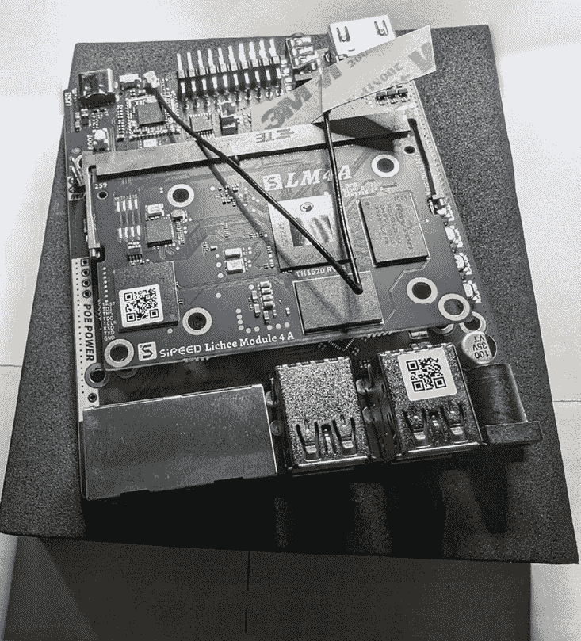

# 第四章：应用设计需求标准——操作系统

在上一章中，我们深入探讨了选择硬件平台标准时需要考虑的许多因素。在前面的章节中，我们也回顾了其他需要考虑的因素。每一章的内容都在为此做铺垫，所有内容最终都与解决方案的安全性紧密相连——有些是直接的，有些是间接的。

在本章中，我们希望能为你介绍你团队在选择适合你设备的 Linux 操作系统时需要考虑的所有因素。本章结束时，你将准备好最终确定设计标准，并真正开始构建你的初步原型。

自 1990 年代末以来，我一定尝试了无数种 Linux 发行版。在最早的日子里，新的发行版层出不穷。早在高速互联网普及之前，我们必须购买包含新发行版 CD-ROM 的每月 Linux 杂志。我这些年来一定买过数百本这样的杂志。遗憾的是，只有少数 Linux 发行版经受住了时间和流行度的考验。多年来，毫无疑问地说，我一直是并且依然是一个真正的 Linux 爱好者。

在本章中，我们将涵盖以下内容：

+   将操作系统与基础硬件平台匹配

+   驱动程序支持、厂商支持和稳定性

+   企业版与社区版 Linux 发行版

+   操作系统的生命周期与你的解决方案

+   硬性成本与软性成本

让我们开始吧。

# 将操作系统与基础硬件平台匹配

精心挑选最适合你的硬件平台的 Linux 发行版，可以比作为你的美味大餐搭配一款上等的美酒。我希望在这里的结果是，你的团队能够考虑所有相关因素，并结合你们自己的研究成果，最终达成一个普遍的设计共识。

如果你打算利用 Intel 或 AMD `x86_64`-类型处理器，那么这个选择过程可能会相当繁琐，因为几乎所有现有的 Linux 发行版的主要平台都是这种类型。自从 Linux 诞生之初，它作为 x86 平台便宜的替代品，取代了运行昂贵且专有的 Unix 发行版的大型 RISC 系统。从 2024 年开始，至少有一百个面向`x86_64`平台的 Linux 发行版。大多数是主流发行版的冷门分支。我敢说，几乎可以肯定地认为，有一款发行版能满足任何人的需求。

当你决定在非 x86_64 平台上构建时，选择的范围会被缩小。选择 Power、System z、Arm 或 RISC-V 作为平台，可能会使可选的发行版减少到不到几个。有人可能认为这是一种限制，而其他人则可能欢迎不必在实验室中研究或试验许多发行版的实现。

例如，在我自己的家庭实验室中，我维护超过 20 个系统，全部由我自己支付（而不是我的雇主）。虽然它们维护起来很昂贵，但对我来说能够满足多平台和操作系统测试的需求至关重要。这也使我有自由根据需要构建我想要的东西，使用我认为适合任务的任何工具。我建立，测试，拆除，重复这个过程，根据需要更改操作系统或硬件平台本身。

理解如何将所选硬件与安全操作系统配对所考虑的因素可以与美食餐厅中的大厨如何将优质葡萄酒与他们的烹饪佳肴搭配相比较。本章的接下来几节将做到这一点。我们现在要进入我们的建筑厨房，所以让我们继续并开始做饭。

## IBM Power

IBM® Power® 系列服务器具有相当可扩展性和优质硬件。这些系统在将物理硬件划分为部分并将其专门分配给个别操作系统方面与主机非常相似。在 Power 系列中，这种功能被称为**LPAR**（**逻辑分区**）。

该平台在嵌入式 Linux 系统空间中越来越稀少。

该平台被认为是今天使用它的人的一种利基市场。请注意，您的操作系统选择在很大程度上受到付费发行版的限制。Red Hat® Enterprise Linux®，SUSE Linux Enterprise Server™和 Ubuntu®似乎是今天可用的选择。

让我们继续到下一个平台。

## IBM System z

IBM Z® 系列（又名 System z）主机显然是任何现存的嵌入式 Linux 系统设备可能拥有的最昂贵的硬件平台，也是我认为在今天这种设备中最稀有的平台的最佳示例。

此外，该平台在物理尺寸上是最大的，并且在我的专业观点中，可能是最难找到人员资源的。如果您绝对不需要像主机提供的大量基于硬件的冗余性等好处，我绝对会说这不是适合您的平台。话虽如此，我也怀疑，到目前为止，是否有比 Z 系列主机更具容错性和弹性的硬件平台。

然而，在当今背景下，我必须使用宠物与牲畜的伟大类比，这基本上是云技术的服务模式——使用大量廉价的可替换机器集群（即牲畜），而不是单一昂贵的单体机器。由于互联网上有无数关于这一点的引用，我会让你自己对这种方法论做出评判。

最终，我必须承认，Z 系列机器是韧性和可靠性的典范。可惜，仅仅是它们的尺寸和成本就让它们失去了 99.99% 嵌入式 Linux 系统市场的机会。Z 系列机器简直就是最昂贵的“宠物”。

这里的选择很有限。就像 Power 平台一样，Z 系列，你只能选择像 IBM LinuxOne、zLinux 和 Red Hat Enterprise Linux 这样的付费发行版。这些似乎是目前市场上对于这些非常规嵌入式 Linux 平台的有限选择。

让我们继续讨论另一个平台。

## RISC-V

在物联网领域，最新的“亮点”是 RISC-V® 系统。我最近刚刚购买了我的第一台**尖端系统**。目前，在选择这个平台时，你的选择不仅有限，而且在系统本身上获得它们也变得更加困难。记住，这个平台正在快速发展，每天都在增长。尽管如此，我个人对这个新兴平台充满了期待。

由于我使用的测试设备没有 UEFI BIOS，安装任何操作系统都相当麻烦。

这是我从亚马逊上获得的样品 RISC-V IoT 开发板的照片。

图 4.1 – 亚马逊上可购买的初始通用 RISC-V 开发板

我最近才开始使用这款新硬件，因此在撰写时，这个平台的支持还相当有限。正是社区发行版在这一领域大放异彩，它们处在硬件支持的最前沿。到目前为止，我发现的支持有 Debian、Ubuntu 和 Fedora® 的兼容性。

在这里，Ubuntu 似乎是领先的发行版，而 Fedora 也在迅速赶上。不过，我期待有一天，付费的企业级操作系统能够将这个新平台纳入它们的支持范围。

我们未来肯定会更多地讨论这个平台。目前，咱们先转到可能是整个嵌入式 Linux 系统领域中最重要的一个平台。让我们来看看**高级精简指令集机器**（**ARM**）架构。

## ARM

在过去的几年里，ARM® 架构在嵌入式 Linux 系统的生态系统中得到了广泛应用。如前一章所述，ARM 是由 Arm 公司授权的架构，或者可以说是一个蓝图。硬件制造商可以选择将哪些芯片放置到他们的定制板上。此外，还有许多预先构建的、极其廉价的 ARM 系统，例如树莓派类型的开发板。

在这个生态系统中，最接近 Linux 世界最新动态的 Linux 发行版往往拥有最大的采用率。换句话说，社区发行版（其中大部分最新的开发工作都在测试）可能与最新的硬件板具有最深的兼容性。像 Raspberry Pi OS、Ubuntu 和 Fedora 这样的发行版在这一领域是关键角色。其他开源项目，如 Yocto（[`www.nvidia.com/en-us/data-center/`](https://www.nvidia.com/en-us/data-center/)），也为 Linux 用户提供了极好的构建和部署工具。

社区与企业之间的差距正在迅速缩小。随着全球范围内物联网设备的爆炸性增长，企业市场被迫加入其中，否则将被甩在后头。Wind River Linux 在这方面似乎处于领先地位，特别是在工业 ARM 系统方面。Ubuntu Pro 服务器、SUSE Linux Enterprise Server 和 Red Hat Enterprise Linux 在努力争取自己在 ARM 生态系统中的份额方面也毫不落后。

边缘计算和物联网市场并不是企业发行版希望占领的唯一市场。随着 NVIDIA 将 ARM 平台带入数据中心，推出其全新的超级 AI 处理系统，这些系统将大核心 ARM 处理器与 GPU 芯片相结合，NVIDIA Grace Hopper 系统将会改变全球计算机和操作系统的格局。

各种形式的 ARM 支持正在迅速提升。我要归功于 NVIDIA 将它们带入数据中心并推动了更大的平台认知。ARM 绝对是一个值得考虑的平台。我们继续讨论。

# 驱动程序支持、供应商支持与稳定性

在我们讨论 Linux 生态系统中所有可用的硬件平台时，我认为有必要提醒你和你的团队，确保你们考虑的任何 Linux 发行版也能满足你们产品的需求（以及你们客户的期望）。

我是什么意思呢？基本上，我建议你和你的团队在确定最终选择之前，评估不止一个操作系统。确保硬件在候选操作系统上以预期的速度运行。记录指标。记录软件包版本。对原型进行压力测试。这个过程保证了，当你比较和对比候选操作系统时，你的团队能够做出最好的选择。

并非所有的发行版都基于相同的内核版本，这直接影响到可能包含的驱动程序（或在某些情况下，从发行版中废弃的驱动程序）。此外，根据你计划使用的硬件，你可能还需要第三方驱动程序，而这些驱动程序并未包含在你的发行版中。这些驱动程序是否与发行版的内核和库兼容？

此外，每个发行版都配备了不同的一组核心软件包和一组扩展的可选软件包。您的发行版是否能够支持您的设备应用堆栈所需的正确软件包/版本组合？您是否需要寻找第三方库或应用程序来完成您的解决方案？

为什么我要让您和团队提出这些问题？让我来解释一下。很遗憾，这其实相当简单。大多数社区发行版并未充分测试软件包组合及其基础内核。有些社区发行版基本上就像一个厨房水槽，里面包含了开发者假设您可能想尝试的东西，但实际上，他们希望您能帮助他们测试稳定性和报告错误。

这正是我为何主张采用您所选择的企业 Linux 操作系统的原因。企业级发行版以稳定性、安全性、支持性和二进制兼容性为傲，因为这些正是商业对它们的需求。因此，让我们进入下一部分，深入探讨这一思路。

# 企业与社区 Linux 发行版的对比

在本节中，我们将讨论社区 Linux 发行版与企业 Linux 发行版的区别，或者说，正如我们许多 Linux 行业内的人所称之的，*免费与收费*。您所选择的发行版受前面章节中所讨论的多种因素的驱动。合规性、支持、生命周期以及您自身的需求都将在此过程中发挥作用。

选择标准的这一点不仅影响构建设备的成本，还能帮助您的产品更好地定位为更安全，因为企业发行版提供了安全功能、文档、培训机会、自动化工具以及最佳实践，以支持您的团队。

收费发行版往往具有较长的生命周期，这是客户群体所期望的。企业级 Linux 的平均支持生命周期为 10 年。这些发行版通常还会提供更长的支持期限（需额外付费）。这一点至关重要，因为它确保您的团队能够访问关键的安全修复，即使社区驱动的操作系统已经停止支持其发行版。

考虑选择企业发行版而非免费的社区版的一个重要原因是软件供应链的安全性。这是本书中我们将多次提到的话题。在 2024 年 3 月，发现了一个在与上游开发者最接近的发行版中存在的最高等级 CVE。*CVE-2024-3094*（[`www.cve.org/CVERecord?id=CVE-2024-3094`](https://www.cve.org/CVERecord?id=CVE-2024-3094)）是由于一个名为**xz**的软件包的供应链被破坏，GitHub 仓库被入侵，其中恶意代码被注入到软件包中。这段恶意代码随后通过在系统中创建后门来干扰 OpenSSH。

这个漏洞直接影响了数十万台运行社区版 Linux 操作系统的系统；然而，那些使用企业版 Linux 发行版的客户，如 Suse 或 Red Hat，并未受到影响，因为这些发行版的供应链被认为是高度安全且经过充分测试的。

既然我们在讨论社区版和企业版的差异，我认为有必要为你展示一个对比列表，列出两者的例子。实际上，有成百上千个小型社区发行版，但最有可能出现在嵌入式 Linux 系统设备中的大多数都列在这里。

这里列举了一些可以用于嵌入式设备的优秀免费社区发行版的例子：

+   Fedora

+   OpenSuse

+   AlmaLinux™

+   Rocky Linux™

+   Ubuntu

+   Debian

+   Arch Linux™

+   Slackware

+   Raspberry Pi® OS

这里列举了一些付费企业版发行版的例子，它们提供更高的安全性、更多的支持选项，并可能提供延长的生命周期选项：

+   Red Hat Enterprise Linux

+   Ubuntu Pro Server

+   Suse Enterprise Linux Server

+   Oracle Enterprise Linux

+   Wind River Linux™

现在我们已经列出了更多常见的免费/社区发行版，并与更稳定、更安全的企业版进行对比，我相信你已经看到了它们之间的真实区别。接下来，让我们看看它们如何经受住时间的考验。

# 操作系统生命周期与解决方案的关系

确保你所选的操作系统的支持时间窗口与基于其构建的硬件的支持时间窗口相匹配是至关重要的。

在现场更换设备的操作系统是一项痛苦的工作。一般来说，可以安全地假设你的支持团队无法直接访问任何已售出并正在客户现场使用的系统。除非你的产品作为远程管理服务提供给最终用户，否则嵌入式系统通常无法与母公司（即制造商）进行通信，除非这些系统被允许自动在线获取来自厂商的更新。

更换操作系统就像进行全新安装。通常，我们会尽量避免让最终用户看到这个过程，因为如果他们在过程中参与并且有权限访问，系统很容易被破坏，并且可能会给予最终用户一些原本不应获得的访问权限。这会让你的解决方案面临配置被篡改或破坏的风险，或者给未授权人员赋予访问权限。没错，这就是一个安全问题！

所以，明智地选择操作系统和硬件。计划好硬件和 Linux 发行版的支持窗口时间的充足缓冲区。如果这一点无法完全对齐，确保你有一个计划来管理未来的升级，既能保持解决方案的安全性，又能防止数据丢失。尽可能地将最终客户远离这个过程（在可行的情况下）。我想你明白我的意思。我们继续。

# 硬成本与软成本

这个讨论可能会给你的公司带来棘手的情况，但它是一个必须进行的讨论。这肯定会影响设计决策和未来的支持结构。最终，你为解决方案收取的费用必须合理高于设计、构建和支持它的成本。我强烈建议你和你的团队在项目设计阶段彻底制定所有成本模型。功能膨胀、培训成本、物流成本、技术债务、延误、研究和营销预算以及其他因素都在此深刻影响。简单来说，这与安全相关，因为如果没有提前规划所有成本，极有可能你将以固定预算运作，并且某些事情可能没有得到应有的关注，从而导致某些问题被忽视，进而成为安全漏洞。

成本模型在现代世界中主导一切。利润至关重要。找到最小化成本与提供最佳产品之间的平衡，是产品经理面临的持续挑战。你需要确定产品的适当平衡点。我恳请你不要在影响产品安全的因素上偷工减料。深入了解你的人工成本、硬件成本、软件成本，以及你研究所确定的产品价格在客户心中最合适的“甜点”将对你的决策产生重大影响。接下来，我们将讨论一些这些因素。

## 硬件成本

这些成本可能是最容易计算的，却是你项目中最大的开销。这些成本超出了你选择的平台。你可能需要建立一个全新的工具链来构建和支持你的设备。我鼓励你和你的团队确保计划足够的系统储备，保留这些系统用于测试和故障排除。

如前一章所述，定制硬件有额外的成本。这些成本不仅仅是金钱上的，还包括所需时间的增加。定制硬件需要更长的时间来设计和原型制作；此外，它通常还需要进行更多的测试。如果你打算使用企业级 Linux 发行版，提供该发行版的公司可能会要求你对硬件进行兼容性认证。如果没有考虑到这一点，可能会导致操作系统供应商无法提供对该硬件解决方案的支持。这可能会给你的公司带来实际或潜在的问题。

我理解任何组织在削减成本方面的驱动力至关重要，但我还是要鼓励你考虑并获得足够的资源，以便为未来的开发维护一组系统，并解决未来可能出现的终端客户问题。测试直接影响产品的质量，当然也包括产品的安全性。不要在测试上省钱。

让我们继续讨论其他成本。

## 软件成本

就像为硬件成本规划一样，为团队的软件需求进行规划同样重要。这不仅仅涉及产品本身的操作系统成本，还涵盖了设计、构建和支持电器解决方案的各个方面。所有软件都必须考虑在内——操作系统、应用程序、源代码控制系统、自动化系统、安全扫描系统、备份和恢复系统等。

与软件供应商的合作可以大大帮助减少成本。此外，为了合法地将他们的产品作为自己产品的一部分使用，这种合作可能是必要的。这些合作伙伴计划通常也需要支付会员费用，无论是项目费用、最低购买要求，还是维持软件或服务订阅的要求。

## 软件成本

软件成本是任何项目的渐进性死敌，因为它们往往很难核算或预测。硬成本指的是材料、硬件和软件，而软件成本通常与员工有关。更具体地说，这受到他们目前所拥有的技能和设计、构建并支持所需电器解决方案的技能差距的影响。

当你的设计团队进行电器原型设计时，这些需求可能并不明显。在设计/构建嵌入式 Linux 系统的团队与负责提供客户支持服务的团队之间，很可能会存在知识空白。这些空白必须通过培训和知识转移来填补。

如果不解决这些知识空白，可能会带来许多问题。假如你的设计团队不熟悉目标平台，或者更糟糕的是，连它选择的操作系统都不熟悉呢？这就会让最终的设计暴露出可能无数的漏洞，而这些漏洞在此情况下可能还没有被考虑到。此外，未能解决在推出最佳产品时所需的技能空缺，最终会导致技术债务，而技术债务本身也是一种安全风险。

最好通过培训来填补这些空白，或者在最坏的情况下，雇佣新的员工或顾问，他们可以帮助提升其他产品和支持团队的能力。不管这些知识空白存在于哪里（例如硬件、配置、操作系统或一般使用），如果不加以解决，就会成为一个安全挑战。

好吧，我已经把这个话题说得够多了。我相信它不会让你感到太痛苦。确实，我承认当我想要强调一个观点时，有时可能会显得过于戏剧化。但我们不能低估每个团队成员为设计桌上以及设计之外所带来的真正价值。不全力以赴会产生负面影响。让我们继续前进。

# 总结

目前为止我们所讨论的内容都是为这一刻做铺垫。在过去的四章中，我们涵盖了影响设计标准的众多因素，并在本章中将这些内容与 Linux 操作系统结合，这将成为你解决方案中应用程序的基础。

你从本章学到的知识是复杂的。市面上有许多优秀的 Linux 发行版和公司。它们的每个发行版，或者在某些情况下，它们的定制版本（这些是发行版的变种），都针对特定的硬件平台或最终用户使用场景。这些使用场景可以从定制的图形界面到工业控制管理，从人工智能驱动的分析到高级安全策略执行不等。

我们在本章中涵盖了许多内容，接下来我们来总结一下你需要记住的要点。你的硬件选择将完全决定你选择的 Linux 发行版的能力或限制。在浩瀚的 Linux 发行版宇宙中， 希望你现在能更好地理解免费社区发行版与稳定安全的付费企业版之间的差异。你还应该了解硬件和软件选择的生命周期如何赋能或限制你的解决方案。最后，你的团队还应该理解相对于你所做决策的整体成本模型。所有这些共同构成了你产品架构计划的基础。

现在，是时候将你学到的东西付诸实践了。我们将进入下一章，其中包含一些实践练习，帮助你搭建构建链、工具，并实施我们之前提到的一些技术，还有一些可能对你来说是新的内容。

# 第二部分：设计组件

在这一部分，我们将深入探讨与您的设备相关的安全活动，同时在实验室中进行高级 Linux 配置和安全技术的实践操作。

本部分包含以下章节：

+   *第五章*，*构建链中的基本需求*

+   *第六章*，*磁盘加密*

+   *第七章*，*受信平台模块*

+   *第八章*，*启动、BIOS 和固件安全*

+   *第九章*，*基于镜像的部署*

+   *第十章*，*解决方案的儿童防护：保护免受最终用户及其环境的影响*
