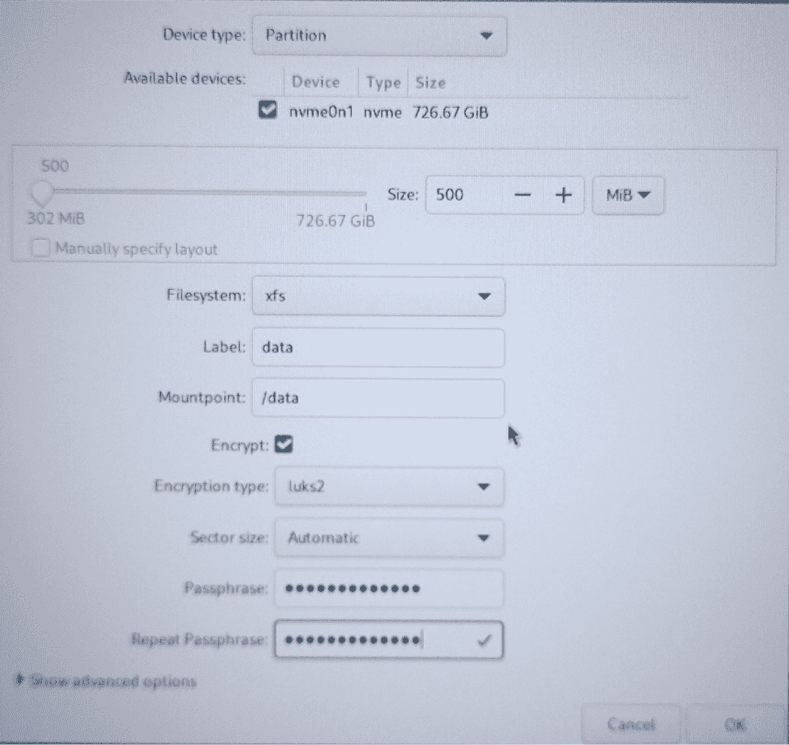

# 第六章：磁盘加密

**Linux 统一密钥设置**（**LUKS**）标准用于加密 Linux 中的块设备，它的创建可以追溯到 2004 年。难怪我觉得自己好像已经使用它很久了！二十年是一个工具稳定并丰富功能的漫长时间。它也已经存在了足够长的时间，成为全球工程师喜爱和推崇的工具。几乎每个 Linux 发行版的安装器选项中，都能看到它作为配置存储的一部分。但每个安装器所能提供的 LUKS 功能都有所限制。你将不得不每次启动或重启时手动输入密钥。由于本书并非入门书籍，我们假设你具备一定的 Linux 基础技能，并将继续深入复杂的技术领域，培养更高级的技能。

本章的目标是拓宽你对系统存储安全的思路。在这里，我计划扩展你对如何以其他方式配置存储安全的理解。

拿上一些含咖啡因的饮料和零食吧。这将是一次更深入的探讨，帮助你了解如何将 LUKS 应用于你的未来产品。

本章我们将涵盖以下主题：

+   LUKS 介绍

+   在配备自动化密钥的设备上实现 LUKS

+   恢复是否可能？

让我们开始吧。

# 技术要求

本章的练习要求你拥有一台物理或虚拟机器，你可以在上面安装或重新安装 Linux 以完成这些任务。需要具有管理员（root）权限。你需要创建一些自定义分区/文件系统。你需要一个全新的 Linux 系统安装，并创建你常规使用的文件系统。同时，创建一个 500 MiB 的 XFS LUKS 加密分区，标记为 `data3`，挂载点设置为 `/data3`。初始密钥密码短语使用 `CreatePass`。需要 root 或 sudo 权限。我无法强调这个前提条件有多重要——如果不按指定操作，将影响你顺利完成本章练习的能力。

# LUKS 介绍

使用 LUKS 后，任何 Linux 文件系统都可以被加密。但在此之前，你应该了解一些预先需要注意的事项。

对你的数据进行静态加密（即存储在磁盘、SSD 或 NVME 上的所有内容）不仅仅是一个“锦上添花”的选项，它几乎在你的目标客户群体中是一个默认要求。为了便于讨论，我们假设你的解决方案的预期客户是政府实体。大多数政府客户（无论我们指的是哪个国家）都被要求在其部署的任何系统中都具备极高的安全标准。他们的标准远高于常规标准，风险也更大。可以说，磁盘加密是被默认要求的。稍后我们将在*第十三章*中讨论如何实施一些更严格的政府安全标准。

加密过程中的关键工具是一个名为`cryptsetup`的开源实用程序。它依赖于`dm-crypt`Linux 内核模块提供的功能。这些工具以及你自己的发行版特定的存储管理工具，通常会在每个 Linux 发行版中默认安装。一旦使用 LUKS 加密了一个卷，只有在卷脱机且未挂载时，才能完全移除加密。

简单来说，LUKS 利用`dm-crypt`模块对磁盘上的数据进行加密/解密。LUKS 要求每次挂载和访问一个卷时，都需要输入密码短语。其内部工作原理对我们这些最终用户来说是隐藏的，实际上相当复杂。自动化这个过程更为复杂。

对于使用`/boot`分区的系统，GRUB 和 GRUB2 都支持这种加密。其他一些引导程序可能不支持此功能，因此在考虑此选项之前需要检查。

最常见的做法是加密根分区以及任何应用分区，以防止系统被篡改。交换分区和用户主目录分区也应该考虑加密。

当前版本的 LUKS（LUKS2）支持每个加密卷最多 32 个加密密钥，而 LUKS1 最多只支持 8 个密钥。当我们在本章后面讨论恢复时，这将是一个至关重要的黄金法则。

## 基本实现回顾

在今天的 Linux 发行版中，优秀的图形化安装程序已经可以让你看到它们如何在构建过程中帮助你配置 LUKS 加密。我们不会深入讲解 LUKS 的基础知识，但如果你需要参考资料，请查看该项目的仓库：[`gitlab.com/cryptsetup/cryptsetup/blobmC5#WdW07?dhVJ4aster/README.md`](https://gitlab.com/cryptsetup/cryptsetup/blobmC5#WdW07?dhVJ4aster/README.md)。不过，我想特别指出的是，通过基础安装程序配置 LUKS 时，每次系统启动或重启时都会强制手动输入密钥密码短语。

由于这不是一个 Linux 安装的初学者指南，我想强调一个重要点。安装程序只能最小化地配置 LUKS 加密。这种配置可能适合在实验室中构建东西的人，但从客户的角度来看，当他们为一个精心设计的安全解决方案支付高额费用时，这种配置是不可接受的。

这是一个通过 Linux 发行版安装程序配置 LUKS 的示例：



图 6.1 – 通过安装程序配置加密

通过安装程序创建加密文件系统无疑是保护设备构建的一个积极的起点，但如果仅止于此，客户关于可用性和安全性的投诉（因为他们至少需要将密码短语提供给所有管理员）迟早会迫使你进行更改。

当我们继续在本书中构建每个安全性和可用性标准的基础上，让我们继续到下一节，这将显然改善客户的最终用户体验，并且毫无疑问，将改善设备本身的安全性。自动化加密/解密过程并保护此信息免受最终用户访问变得至关重要。能够解密数据的人员越少，解决方案就会被认为越好。现在让我们确切地探讨这种自动化的样子，并开始动手。

# 在具有自动化密钥的设备上实施 LUKS

在实施任何安全因素的解决方案中，始终将您的最终用户体验放在首位。本书旨在帮助您和您的团队创建一个安全但可用的嵌入式 Linux 系统。

根据您的解决方案及其被最终用户使用的方式，防止最终用户每次启动系统时必须输入密钥是至关重要的。首先，该设备可能甚至没有连接控制台或键盘。其次，强制最终用户手动输入这样的密钥最终将导致他们在工作场所的某处或其他地方清晰可见的地方写下密钥。如果可能，应避免让最终用户输入密钥短语。

这里是一个例子截图，显示您在引导顺序继续之前可能会提示输入密码短语的方式：


图 6.2 – 启动时手动输入加密密钥密码

现在您可以看到，强制最终用户输入密码短语并不是一个好主意，我们将在下一节中展开旅程，看看如何可以安全地自动化这个过程。让我们继续。

## 练习 - 使用存储的密钥实现 LUKS 并利用 crypttab 文件

在我们开始猛击键盘之前，请允许我介绍一个可能是您在这场战斗中拥有的盟友。`/etc/crypttab`文件被所有 Linux 发行版用于存储关于加密块设备的信息，以便它们可以在启动时自动解锁。在我看来，这是 Linux 中真正的隐藏宝藏之一。

对于此练习，我们将使用本章节“技术要求”部分提到的机器，并且我们将自动解锁`/data3`文件系统。让我们从以下步骤开始：

1.  以 root 身份登录。

1.  检查设备可用性。识别您为此练习创建的分区的 UUID 和设备名称。您的输出很可能会有所不同：

    ```

    $ sudo lsblk
    NAME           MAJ:MIN RM   SIZE RO TYPE  MOUNTPOINTS
    sda            8:0    0 476.9G  0 disk
    ├─sda1         8:1    0     2M  0 part
    ├─sda2         8:2    0     3G  0 part  /boot
    ├─sda3         8:3    0    55G  0 part  /
    ├─sda4         8:4    0    64G  0 part  [SWAP]
    ├─sda5         8:5    0    40G  0 part  /var
    ├─sda6         8:6    0    40G  0 part  /home
    └─sda78:7    0   500M  0 part
      └─luks-8e1fb810-b471-491a-adcf-32048a0eb534 253:0    0   484M  0 crypt /data3
    zram0          252:0    0     8G  0 disk  [SWAP]
    ```

1.  现在，让我们确定我们特定卷的 UUID。您的设备可能是不同的，请注意：

    ```

    $ sudo blkid /dev/sda7
    /dev/sda7: UUID="8e1fb810-b471-491a-adcf-32048a0eb534" TYPE="crypto_LUKS" PARTUUID="b5906739-06d2-44d2-8770-17f2ffd75212"
    ```

重要说明

对我而言，我的设备名称是`/dev/sda7`——由于种种原因，你的设备名称可能会不同（磁盘类型、系统的分区方案等）。无论何时我输入`/dev/sda7`或该卷的唯一 UUID 时，*你必须用自己的信息替换它*。

1.  以 root 用户生成一个随机的密码并将其保存在`/etc`下，命名为`luks-keyfile`：

    ```

    # dd if=/dev/random of=/etc/luks-keyfile \
    bs=1024 count=4
    4+0 records in
    4+0 records out
    luks-keyfile file as root:

    ```

    luks-keyfile 文件：

    ```

    # restorecon -vvRF /etc/luks-keyfile
    luks-keyfile file as another way of decrypting the drive we just created. You will be prompted for the original passphrase that you used in the prep for this exercise – CreatePass:

    ```

    # cryptsetup luksAddKey /dev/sda7 /etc/luks-keyfile

    `/etc/crypttab`文件由 Linux 安装程序创建。我们需要查看安装程序是否为我们的卷手动解密创建了定义（在我的情况下，确实创建了）：

    ```

    # cat /etc/crypttab
    /data3 volume and then run the command to ensure the LUKS has also closed the volume:

    ```

    # umount /data3

    # cryptsetup -v luksClose luks-8e1fb810-b471-491a-adcf-32048a0eb534

    命令成功。

    ```

    ```

    ```

    ```

    ```

    ```

重要提示

在这个练习中，我们还将卷命名为`data3`。由于我的`/data3`分区是在安装过程中创建的（为了提高速度），所以已经有一个与我的`/data3`卷相同 UUID 的条目，因此我创建了一个新的条目，将`data3`作为新的第一个条目，并将原始条目注释掉了。这是一个非常重要的步骤。你可以稍后选择删除旧的条目，但在测试中，我建议仅将其注释掉。此外，我必须提醒你，你的 UUID 与我的不同。

1.  使用你喜欢的编辑器编辑`/etc/crypttab`文件：

    ```

    $ sudo vi /etc/crypttab
    ```

/etc/crypttab

```

data3   UUID=8e1fb810-b471-491a-adcf-32048a0eb534 /etc/luks-keyfile luks
###luks-8e1fb810-b471-491a-adcf-32048a0eb534 UUID=8e1fb810-b471-491a-adcf-32048a0eb534 none discard
```

1.  现在，让我们手动强制 LUKS 使用我们的新密钥文件并测试解密，然后挂载该卷：

    ```

    # cryptsetup -v luksOpen /dev/sda7 data3 \
    --key-file=/etc/luks-keyfile
    No usable token is available.
    Key slot 2 unlocked.
    Command successful.
    ```

1.  现在，让我们挂载设备：

    ```

    /data3 is mounted. Depending on how you built your test machine, your output may vary. Please pay attention:

    ```

    $ df –h

    文件系统      大小  已用 可用 使用% 挂载点

    /dev/sda3        55G  7.2G   48G  13% /

    devtmpfs        4.0M     0  4.0M   0% /dev

    tmpfs            16G     0   16G   0% /dev/shm

    tmpfs           6.3G  1.9M  6.3G   1% /run

    tmpfs            16G   76K   16G   1% /tmp

    /dev/sda2       3.0G  406M  2.6G  14% /boot

    /dev/sda5        40G  2.6G   38G   7% /var

    /dev/sda6        40G  875M   40G   3% /home

    tmpfs           3.2G  224K  3.2G   1% /run/user/1000

    /dev/dm-0       444M  135K  415M   1% /data3

    ```

    ```

1.  最后，我们需要重新启动系统并重新验证所有自动挂载的文件系统。

到目前为止，我们通过一些高级自动化已经走了很长一段路。你的客户一定会非常欣赏你对细节的关注以及你的解决方案提供的易用性（同时还包含加密）。但我们还没有结束。让我们在下一部分深入探讨百万美元问题。

# 恢复可能吗？

哇。恢复有可能吗？这是百万美元的问题。请允许我为你描绘一幅图，并提供一个可能是唯一解决方案的建议。最真实的答案是*是*和*不是*。大部分情况下是*不是*！那么，让我们来探讨一下我的意思，以及为什么我称之为百万美元问题。

请稍微容忍我一会儿。让我们设想最糟糕的情况已经发生——由于一个完美的风暴，无论是因为损坏的 TPM 模块、文件系统损坏，还是更糟糕的情况，由于某个恶意员工或黑客的行为，您客户设备上的自动加密密钥库丢失了。

您的支持团队感到手足无措。不仅该客户离线，而且很可能会涉及到重大的数据丢失。“*天哪*，”你自言自语，“*为什么我今天没请病假呢？*”

您的支持团队如何帮助客户？您的公司会失去信誉或最终客户的信任吗？您本可以如何防止这种情况发生？

好吧，坏消息来了。做好心理准备。如果您只有一个密钥，并且它丢失、被破坏或者发生了其他问题，您和客户肯定会度过一个非常非常糟糕的日子。丢失唯一的密钥/密码存储是无法恢复的。就此而已。这种加密方式是有深远影响的。它内置于设计中。没有密钥或密码就意味着完全无法访问，这正是它的目的！

无法帮助客户恢复的后果可能是昂贵的，但也许并不容易预测究竟会有多昂贵。如果您无法帮助客户从密钥/加密问题中恢复，他们失去了数据，也失去了时间。我们无法知道，也无法计算这是否会影响到他们的客户。您很可能会失去他们作为客户。您将失去市场的信誉。希望他们不会因损失起诉您的公司。正如我所说，这是代价惨重的。

现在，在这里我要说：“*有志者事竟成!*” 完全公开地说，完全无法防止不可预见的故障，但一些额外的工程和规划将为您的支持团队提供虚拟的救生艇，以便在发生船难时能生还。请再稍微容忍我一点时间。

我们已经提到，当前版本的 LUKS（即 LUKS2）支持最多 32 个密钥或密码槽。这样做是有充分理由的。您需要不止一个。从我的经验来看，您实际上需要几个。不要偷懒。设置多个。为您的产品和支持团队记录它们。它们可以在灾难发生时成为客户的救生艇。

如何应用这些知识取决于您自己。我推荐至少拥有三种选择，我再强调一次，这是最低标准。它们如下：

+   在安装程序中使用的 LUKS 密码

+   您为自动解密文件系统创建的密钥

+   所有加密文件系统的紧急密码，仅为您的支持团队所知

话虽如此，根据某些客户实现您解决方案的规模，您可能考虑将标准的恢复密码作为第四种选择。这将使您的支持团队能够与客户更密切、更自由地合作，处理任何加密问题。

到这个阶段，您自己的内部文档和构建及支持流程必须是精确无误的。然而，在这一切中，谁能够访问这些特定的密钥/密码短语必须加以控制和规范。有人可能会问：“*为什么？*” 让我直言不讳。最坏的情况是，一名心怀不满的员工获取了这些关键信息并将其泄露——*无论在哪里*——例如在互联网上。如果所有客户的安全受到威胁，其后果将是灾难性的。

您可能在想，“*天哪，这本书充满了灾难和悲观情绪!*” 嗯，是的——这毕竟是一本安全书籍。恐惧是一种激励因素。继续往下看。但说正经的，这确实是一个非常严肃的话题，也是您和您的团队必须做出的设计决策。

# 总结

现在，让我们回顾一下本章的内容。我们已经超越了常见 Linux 安装程序中的 LUKS 基础配置。我们回顾了如何自动化 LUKS 来提高安全性和最终用户体验的高级方法；我们还讨论了配置加密密钥和密码短语的更高级方法；最后，同样重要的是，我们介绍了通过使用多个密钥和密码短语来采取预防措施，几乎消除了在关键支持问题期间数据丢失的可能性。我希望您和我一样，享受了这次对 LUKS 的深入分析。

利用这种加密自动化的好处是显而易见的。通过实施这一措施，您将立即创造更好的最终用户体验，因为用户在每次启动时不再需要强制记住或输入密码短语。这种加密保护了您的设备以及最终客户的数据或知识产权。强大的加密使最终客户在获取和使用您的解决方案时能获得更大的*安心感*。归根结底，一切都是为了帮助您的客户解决问题，并创造回头客，他们又会向朋友和同事推荐您的解决方案。

使用 LUKS 不应为您的客户和最终用户增加复杂性。这就是自动化密码密钥实施至关重要的原因。最终，用户体验和安全性都可以在这种情况下同时实现。我希望这次对 LUKS 的深入探讨能给您带来启发，并为您提供关于如何保护文件系统的新思路。

现在，让我们进入下一章，深入探讨 BIOS 和启动安全性。
