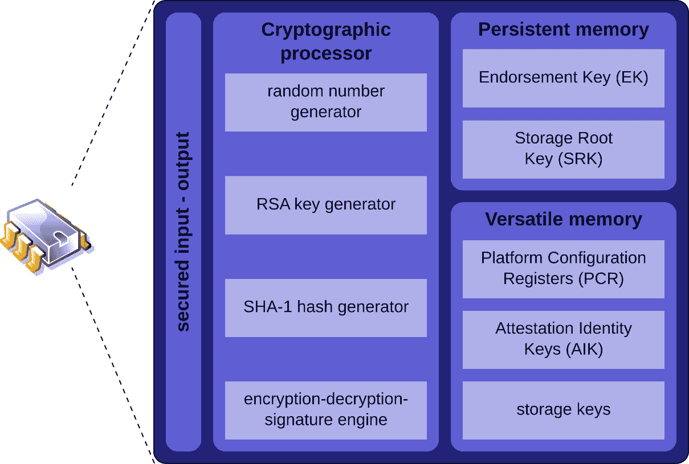

# 第七章：受信平台模块

通常简称为**TPM**，即**受信平台模块**，这种专注于安全的微控制器芯片组使用先进的加密技术来存储重要或敏感信息。这些信息可能是凭证、密码、生物识别数据、加密密钥或其他非常敏感的数据。

本章中的练习将挑战你对家电中可以或应该自动化的内容的认知。在本章中，我们将基于方法论，利用这个工具进一步自动化你在解决方案中的加密密码短语认证，正如在*第六章*中最初介绍的那样。当 TPM 得当使用时，它可以成为你实现更高安全性和良好用户体验的催化剂。话虽如此，TPM 并非没有缺点和怪异之处。它 notoriously 不够用户友好，有时它的一些寄存器可能不可靠。无论这是硬件问题还是软件问题，我无法确定。无论如何，我将演示如何操作它以实现成功。

无论你是否选择利用 TPM，都不是一个简单的决定。权衡利弊。如果你允许它，它确实可以将你的家电带到一个新的高度。本章将包括以下几个部分：

+   什么是 TPM？

+   通过示例配置 TPM

让我们开始吧。

# 什么是 TPM？

超越作为你主板上数百个芯片中的一个，大多数人甚至无法识别的 TPM，它正在迅速成为大多数操作系统的重要工具。在本书写作时，普通的 Linux 系统甚至不需要你激活 TPM。而其他操作系统，比如 Microsoft Windows 11，实际上要求它才能安装操作系统。

TPM 提供了机制来安全存储各种信息。这些对象可以是（但不限于）许可证密钥、用户凭证、加密密钥或其他类型的数据，这些数据允许在没有用户互动的情况下进行消费。

TPM 的实现有不同类型——固件 TPM、离散 TPM 和集成 TPM。TPM 还可以通过软件实现（即虚拟 TPM），但由于它没有比运行在操作系统上的任何其他软件程序更多的保护，因此可能会被绕过。除非是最后的手段，否则避免使用软件 TPM。

**固件 TPM**利用系统 CPU 的受信执行功能。默认情况下，这会创建一个被称为**信任锚**的系统元素。这些只能通过物理到控制台并通过**UEFI BIOS**设置清除。这些是最常见的——在我看来也是最可靠的。

**独立 TPM**类似于基于固件的 TPM，只不过它们是通过其他 API 和软件在 UEFI BIOS 之外进行控制。独立 TPM 利用的是 CPU 本身的功能，而非固件。如果更换 CPU 或更改操作系统，您将丧失先前存储的所有 TPM 数据。否则，这些 TPM 功能几乎和固件中的 TPM 一样好。

最后，**集成 TPM**出现了；这类芯片组执行许多功能，但也内建了 TPM 功能。这种类型的 TPM 功能在这一领域中最为少见。

我曾被问过*“选择使用其中一个会使自己更易受到攻击吗？”*。简短且正确的答案是，不使用任何 TPM 解决方案才可能使解决方案变得脆弱。所有 TPM 实现都有效，选择哪一个完全取决于您自己的标准以及您所选择的平台是否有该功能。

当前的黄金标准是 TPM 2.0。TPM 2.0 功能丰富，能够存储多个密钥和值。它几乎出现在所有最新的服务器、PC 和笔记本电脑中。其算法和内建加密技术令人印象深刻。

较旧的系统可能会使用较早版本的 TPM 1.2。此版本容量有限，加密技术较弱，但它仍然远胜于没有任何 TPM。

全球大多数政府的要求标准将 TPM 1.2 设定为接触敏感数据的任何系统的最低要求。当然，TPM 2.0 是最敏感平台的必要标准。

现在让我们简要回顾一下 TPM 的发展历史。

## TPM 的历史

我将为您总结一个简短的历史概述，并且会刻意保持简洁，避免任何繁琐内容。TPM 是由一个名为*可信计算组*的技术行业智囊团在 2009 年进行头脑风暴的结果。这个概念在**国际标准化组织**（**ISO**）与**国际电工委员会**（**IEC**）的合作下转变为全球标准。因此，TPM 诞生为*ISO/IEC 11889:2009*。

TPM 1.2 在 2011 年成为全球标准，并统治了许多年。直到 2019 年，*ISO/IEC 11889:2015*发布，才由 TPM 2.0 取而代之。遗憾的是，现在大多数安全组织认为它已经不足够且过时。我依然认为使用 TPM 1.2 模块总比什么都不用要好。所以，显然，您可以根据自己的判断做出决定。

这里是 TPM 工作原理的图示（图片来源，维基百科，[`upload.wikimedia.org/wikipedia/commons/thumb/b/be/TPM.svg/2880px-TPM.svg.png`](https://upload.wikimedia.org/wikipedia/commons/thumb/b/be/TPM.svg/2880px-TPM.svg.png)）：



图 7.1 – TPM 描述

截至本书出版时，TPM 2.0 仍然是全球标准。本章的练习将仅聚焦于 TPM 2.0 版本。现在，我们就开始这些练习吧。

# 通过示例配置 TPM

在这个练习中，我们将通过将加密密码存储在 TPM 中来实现存储卷解密的自动化。这样做可以让你的解决方案更安全，并防止将加密密码与公众分享，从而本质上提高你的解决方案的安全性。

练习要求

对于这个实验，我将 Fedora40（工作站版）安装到裸机硬件上。在此安装过程中，我创建了一个 500 MiB 的加密 XFS 文件系统，并将其挂载到 `/data`。我使用 `TPMmaster2024` 作为加密密钥。

这是在创建过程中该设置的样子：


图 7.2 – Fedora 安装过程中的加密文件系统设置

安装完成后，当系统启动时，我们会被提示输入 **LUKS 密钥**，以便启动并挂载该文件系统：


图 7.3 – 在启动时手动输入 LUKS 密钥

对于这个实验，我建议你向现有的测试机器添加一个非常小的 LUKS 加密分区，而不是进行完整的重新安装。由你决定。在我的示例中，我使用了一个非系统分区/文件系统，但在生产环境中，你将加密几乎所有内容，除了 `/boot` 和 EFI 分区。

## 练习 – 启用 TPM 2 与 LUKS 加密结合使用

首先，让我们确保你的系统确实拥有正确的硬件。我们将浏览日志，查看上一次启动周期是否检测到 TPM 2.0 模块。如果没有返回良好的结果，可能是你的硬件不符合这个实验的要求：

```

$ sudo dmesg | grep TPM
```

这个命令的输出可能会比较长，因此我不会展示所有可能的输出。在你运行命令后，最重要的是观察输出中的 `TPM2`：

```

[    0.011277] ACPI: TPM2 0x000000009AECAF08 000034 (v04 LENOVO TC-M1U   00001450 AMI  00000000)
[    0.011320] ACPI: Reserving TPM2 table memory at [mem 0x9aecaf08-0x9aecaf3b]
[    1.105253] tpm_tis MSFT0101:00: 2.0 TPM (device-id 0x1B, rev-id 16)
[    1.726489] systemd[1]: systemd 255.6-1.fc40 running in system mode (+PAM +AUDIT +SELINUX -APPARMOR +IMA +SMACK +SECCOMP -GCRYPT +GNUTLS +OPENSSL +ACL +BLKID +CURL +ELFUTILS +FIDO2 +IDN2 -IDN -IPTC +KMOD +LIBCRYPTSETUP +LIBFDISK +PCRE2 +PWQUALITY +P11KIT +QRENCODE +TPM2 +BZIP2 +LZ4 +XZ +ZLIB +ZSTD +BPF_FRAMEWORK +XKBCOMMON +UTMP +SYSVINIT default-hierarchy=unified)
[    4.604247] systemd[1]: systemd 255.6-1.fc40 running in system mode (+PAM +AUDIT +SELINUX -APPARMOR +IMA +SMACK +SECCOMP -GCRYPT +GNUTLS +OPENSSL +ACL +BLKID +CURL +ELFUTILS +FIDO2 +IDN2 -IDN -IPTC +KMOD +LIBCRYPTSETUP +LIBFDISK +PCRE2 +PWQUALITY +P11KIT +QRENCODE +TPM2 +BZIP2 +LZ4 +XZ +ZLIB +ZSTD +BPF_FRAMEWORK +XKBCOMMON +UTMP +SYSVINIT default-hierarchy=unified)
[    5.477528] systemd[1]: systemd-pcrextend.socket - TPM2 PCR Extension (Varlink) was skipped because of an unmet condition check (ConditionSecurity=measured-uki).
[    5.507674] systemd[1]: systemd-pcrmachine.service - TPM2 PCR Machine ID Measurement was skipped because of an unmet condition check (ConditionSecurity=measured-uki).
[    5.508733] systemd[1]: systemd-tpm2-setup-early.service - TPM2 SRK Setup (Early) was skipped because of an unmet condition check (ConditionSecurity=measured-uki).
```

重要说明

如果你没有收到任何 `TPM2` 输出，可能可以安全地说，你的实验硬件不足以支持本章的练习。

既然我们已经确认你有一个 TPM 2.0 模块，让我们确保它在 UEFI BIOS 中正确设置。重启你的计算机，打断启动过程以进入 UEFI BIOS 设置，然后找到 TPM 配置：


图 7.4 – UEFI BIOS – 设置 TPM

你可能会有多个 TPM 选项；如果是这样，选择 **Firmware TPM** 而不是 **Discrete TPM**。将芯片组设置为 **Enabled**，并确保清除芯片内的任何旧数据，然后再继续。别忘了保存并退出 UEFI BIOS（并重启）。

让我们安装所需的包来利用 TPM 自动化解密过程：

```

$ sudo dnf install -y clevis clevis-luks clevis-dracut clevis-systemd clevis-pin-tpm2
```

这个输出相当长，所以我已经将显示的内容进行了截断。需要注意的是，包安装必须成功完成：

```

Installed:
  clevis-20-2.fc40.x86_64               clevis-dracut-20-2.fc40.x86_64    clevis-luks-20-2.fc40.x86_64
  clevis-pin-tpm2-0.5.3-5.fc40.x86_64   clevis-systemd-20-2.fc40.x86_64   jose-13-1.fc40.x86_64
  libjose-13-1.fc40.x86_64              libluksmeta-9-22.fc40.x86_64      luksmeta-9-22.fc40.x86_64
Complete!
```

我们还没有完成。还有更多的软件包需要确保正确安装：  

```

$ sudo dnf install -y tpm2-tss tpm2-tools tpm2-abrmd tpm2-pkcs11
```

该命令的输出内容较为冗长，因此我已将其截断，只显示我建议你在执行过程中检查的内容（即，软件包安装已成功完成——请注意，某些软件包可能已经预先安装，这取决于你如何配置实验机器）：  

```

Installed:
  tpm2-abrmd-3.0.0-5.fc40.x86_64                 tpm2-abrmd-selinux-2.3.1-10.fc40.noarch
  tpm2-pkcs11-1.9.0-5.fc40.x86_64
Complete!
```

接下来，我们需要确定加密设备的确切设备名称：  

```

$ lsblk
```

该命令的输出内容相当重要，因为它将引导你了解磁盘如何分配以及文件系统的大小：  

重要提示  

你的系统输出可能与我的结果不同——请注意你如何分配磁盘。这在本练习中非常重要。  

```

NAME                                          MAJ:MIN RM   SIZE RO TYPE  MOUNTPOINTS
sda                                             8:0    0 476.9G  0 disk
├─sda1                                          8:1    0   200M  0 part  /boot/efi
├─sda2                                          8:2    0     3G  0 part  /boot
├─sda3                                          8:3    0    50G  0 part  /
├─sda4                                          8:4    0    64G  0 part  [SWAP]
├─sda5                                          8:5    0    50G  0 part  /var
├─sda6                                          8:6    0    50G  0 part  /usr
├─sda7                                          8:7    0    50G  0 part  /home
└─sda8                                          8:8    0   500M  0 part
  └─luks-463aba53-7189-4920-a128-b4db2a314848 253:0    0   484M  0 crypt /data
zram0                                         252:0    0     8G  0 disk  [SWAP]
```

例如，我的块设备是`/dev/sda8`（请注意，你的设备名会有所不同）。  

我们将把这些信息输入到下一个命令中，该命令会将我们的密钥绑定到 TPM 中：  

```

$ sudo clevis luks bind -d /dev/sda8 tpm2 '{"hash":"sha256","key":"rsa","pcr_bank":"sha256","pcr_ids":"6,7"}'
```

请注意，此命令将要求你进行身份验证以使用提升的权限。然后，它会要求你确认希望用于自动解密卷的现有 LUKS 密码：  

```

[sudo] password for mstonge:
Enter existing LUKS password:
```

现在，让我们告诉`systemd`在尝试访问该驱动器时始终优先使用 TPM2 模块：

```

$ sudo systemctl enable clevis-luks-askpass.path --now
$ sudo systemd-cryptenroll --tpm2-device=auto --tpm2-pcrs=6+7 /dev/sda8
```

此命令将要求你确认现有的 LUKS 密码：  

```

 Please enter current passphrase for disk /dev/sda8: •••••••••••••
New TPM2 token enrolled as key slot 2.
```

好的，我们还没有完成。我们将使用`dracut`重新生成正确的启动设置。  

```

$ sudo dracut -fv --regenerate-all
```

同样，该命令的输出将非常冗长，但我确实要求你密切关注你自己的输出结果。在这里，我将截断我的结果并仅突出显示最终状态：  

```

dracut[I]: *** Stripping files ***
dracut[I]: *** Stripping files done ***
dracut[I]: *** Creating image file '/boot/initramfs-6.8.5-301.fc40.x86_64.img' ***
dracut[I]: Using auto-determined compression method 'pigz'
dracut[I]: *** Creating initramfs image file '/boot/initramfs-6.8.5-301.fc40.x86_64.img' done ***
```

现在我们已经配置了新的启动参数和内核映像，是时候重新启动系统了。如果一切顺利，你将*不会*被要求输入 LUKS 密码（它会通过 TPM 自动为你完成）：  

```

$ sudo systemctl reboot
```

重要提示  

TPM2 可能会比较麻烦。根据你的系统情况，常常需要在一些修补周期后，使用`clevis`重新绑定 LUKS 密码。  

众所周知，TPM 对 Linux 来说是一个麻烦，甚至是难以合作的技术。许多 Linux 开发者正在努力解决这些问题。我怀疑，在不久的将来，随着这些问题的解决，我们将看到一些发行版像今天的 Windows 一样强制使用 TPM2。  

我相信你享受了这个平台练习模块。（看到了吧？父亲笑话——抱歉，哈哈哈！）  

# 总结  

在本章中，我们介绍了 TPM、其版本和历史。我尽量简洁，以免让你感到无聊。本书的目的是帮助你了解如何提高安全性，而不是作为技术演变的编年史。  

你获得了一瞥这种低调的 TPM 技术如何帮助你自动化设备的安全性。尽管 TPM 并不是一个完美的解决方案，但它有其优点和风险。更重要的是，你应该考虑实施 TPM 来自动化你的加密文件系统。  

在下一章中，我们将深入探讨磁盘加密功能。让我们继续。

# 加入我们社区的 Discord

加入我们社区的 Discord 空间，与作者和其他读者讨论：

[`packt.link/embeddedsystems`](https://packt.link/embeddedsystems)


