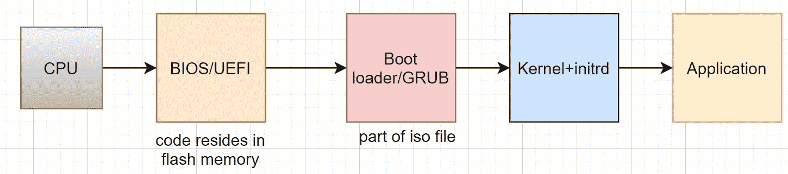
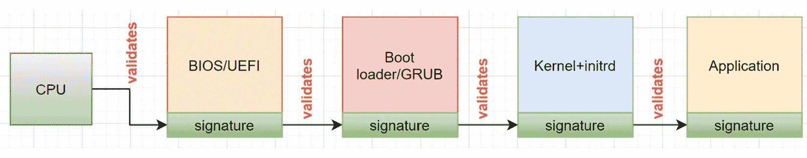

# 第八章：启动、BIOS 和固件安全性

到目前为止，我们已经讨论了 TPM 和 LUKS 磁盘加密来保护数据。本章将促使你更深入思考最基础的硬件功能和你的启动系统本身。我事先警告你，这些设置确实是把双刃剑，换句话说，它们可以保护系统，但也可能使在客户现场支持同一系统变得异常困难。

了解如何最好地锁定和保护你的 BIOS（基本输入输出系统），其固件，以及操作系统安全启动的能力，将确保你的客户获得更具韧性的产品，同时你的团队可以减少公司面临的风险。

尽管锁定 BIOS 和启动选项是一个好主意，但它确实有支持方面的影响，我觉得有必要强调一下。我们将在后续详细讨论其中的一些问题。

本章将涉及以下主题：

+   深入探讨各种启动系统组件

+   使用实例理解启动级安全性

+   固件中的潜在威胁

# 深入探讨各种启动系统组件

曾经想过开机时 Linux 系统发生了什么吗？我们来快速了解一下实际发生的事情。

首先，我们将深入研究系统的 BIOS。几乎所有现代 x86_64 平台都使用统一可扩展固件接口（UEFI）BIOS，它基本上是一个固件接口，作为操作系统与其控制的硬件之间的桥梁。较旧的平台使用厂商特定或遗留的 BIOS 类型，遵循的标准在不同系统之间有限。为了便于理解遗留 BIOS 与新标准 UEFI BIOS 之间的差异，我在这里创建了一个表格来对比它们的功能或特性。

| **关注点** | **遗留 BIOS** | **UEFI BIOS** |
| --- | --- | --- |
| 标准化 | 每个厂商都有自己的功能/特性 | 无论厂商如何，都是行业标准功能 |
| 数字签名 | 无 | 安全启动 |
| 分区表支持 | 仅支持 MBR 分区表 | 增加了对 GUID 分区表的支持 |
| 平台 | 有限 | x86, X86_64, ARM, ARM64, PowerPC 等 |
| 模块化 | 无 | 模块化 – 厂商可以添加额外的支持（例如：网络、存储等） |

表 8.1 – 两种 BIOS 类型的对比

一切从按下电源按钮开始。现代技术的连锁反应随之展开。系统的固件 BIOS/UEFI 启动工作。它执行 POST（电源自检）。完成自检后，它搜索并启动主引导记录（MBR）。

MBR 启动引导程序，我们的例子中是 GRUB2。GRUB2 然后加载定义的内核可执行文件。接着 Initramfs 启动并处理诸如解密、软件 RAID 和文件系统加载程序等任务。

一旦所有的协调工作完成并且根文件系统被加载，systemd 就会启动。systemd 会加载所有其他文件系统并启动所有启用的网络功能和应用服务。就这样…一个功能完备的 Linux 系统。


图 8.1 – 启动

没有你的固件 UEFI BIOS，这一切都无法实现。限制可以访问的内容以及如何使用启动设备至关重要。如果没有这样的预防措施，将无法保护系统免受重大变化，例如使备用启动源可用，这将使任何有直接访问硬件的人不仅能够从未批准的设备启动，还可能向系统中引入恶意代码，甚至更糟糕的是，清除你整个系统的驱动器。

接下来，我们将进入下一个部分，讨论一些安全示例。

# 通过示例理解启动级安全性

在本节中，我们将看看如何访问 UEFI 配置，然后逐步了解一些你需要注意的关键安全设置。我们还将回顾这些配置的优缺点。

根据你选择部署的 Linux 发行版（以及该发行版的版本），你可用的工具和使用这些工具的复杂性千差万别。再次强调，选择一个企业支持的 Linux 版本最终会带来更好的结果。

此外，硬件平台越新，你的固件、CPU 以及当然还有 BIOS 中可能包含的安全增强功能也就越新。现在让我们继续讨论如何访问这些安全设置。

## 访问 UEFI 配置

让我从保障 UEFI 配置安全的关键步骤开始。这个步骤要求你有物理访问计算机控制台的权限。

如何访问计算机上的 UEFI BIOS 界面？有几条路径都可以通向相同的目的地。

首先，可以中断启动序列；通常，在 GRUB 开始其启动过程之前，通过按下某个功能键来完成此操作。具体按哪个键通常因供应商和系统型号而异。我认为这是中断 POST 过程的真正方式，也是进入 BIOS 的最简单方法。

第二，可以使用 GRUB2 的菜单。通常会有一个选项允许你进入 UEFI 配置，但这并非所有系统或发行版都有。某些平台可能会将编辑 UEFI 固件设置作为与启动加载程序分开的手动操作。

第三，从操作系统内部……嗯，严格来说并非如此。操作系统可以在没有提示的情况下重启并进入固件设置。这里有一个快速而准确的例子，教你如何让系统直接重启并进入 UEFI 配置工具。像所有管理功能一样，这个操作必须以 root 身份执行：

```

# systemctl reboot --firmware-setup
```

上述命令本身没有输出，但会立即重新启动并进入 UEFI 配置屏幕。

好吧，既然我们在谈论引导过程，那么我们也应该提到这里可能存在（或设置的）密码。根据我的专业意见，UEFI 管理员密码设置是一把双刃剑。出于同样的原因，我对设置引导加载程序（即 GRUB2）密码的看法也一样。这与我在*第六章*和*第七章*中提到的，利用类似 LUKS 而没有 TPM 自动化的问题非常相似。

假设你选择为其中一个设置密码。我们来看看这对最终用户的影响。对于 UEFI 管理员密码，虽然概率很小——大约 1/100,000 的概率，最终用户才会有合理的理由访问这个密码——这可能永远都不是问题。不幸的是，这种情况并不适用于设置引导加载程序（即 GRUB2）密码。每次启动或重启都会迫使用户手动在控制台上输入密码才能启动系统。对于没有键盘永远连接的设备来说，这几乎是不可能的，甚至不切实际。对于有键盘的设备，最终用户往往会在设备上贴个便条，写上启动系统的密码，这样一来，原本设置密码的好处就完全没有了。

所以，你可能会问，为什么这会是一个问题？我的回答是人性和坏习惯。一般来说，可以安全地假设大多数人总是会选择最轻松的路径。这显然适用于每次引导周期都需要的情况。最终客户绝对需要访问这个密码。

以 UEFI 管理员密码为例，假设这是一个支持问题，迫使你的公司必须将这个信息提供给客户。在这两种情况下，密码所暗示的安全性会被削弱，因为最终用户不仅有这些密码，而且他们将其分享给客户组织外部的概率是最大的威胁。

我建议谨慎使用这两者，除非每个设备都分配了唯一的密码，并且你的支持团队有这些密码的数据库。即便如此，一旦与最终客户共享，密码也应视为已泄露，从而失去其原本的保护作用。

## 什么是安全启动？

简而言之，**安全启动**是向用户表明你的操作系统运行的是经过你公司亲自测试并签署的内核和二进制文件的一个优秀方式。

有一些关键变量在发挥作用，如*表 8.2*所示：

| **凭证/变量** | **目的** | **创建实体** |
| --- | --- | --- |
| 平台密钥 (PK) | 根密钥 | 平台制造商 |
| 密钥交换密钥 (KEK) | 证书拥有者列表 | 操作系统合作伙伴或 OEM |
| 授权数据库 (db) | 允许的驱动程序或应用程序列表 | 操作系统合作伙伴或 CA |
| 排除数据库 (dbx) | 被撤销的签名者列表 | 签名授权机构 |
| SetupMode | 1 = 设置模式，0 = 启用安全启动 |  |
| SecureBoot | 1 = 强制启用安全启动，0 = 禁用安全启动 |  |

表 8.2 – 安全启动中关键变量及其角色

在我们开始进行练习之前，先看看没有启用安全启动和启用安全启动时启动过程的不同。这里是没有启用安全启动的启动过程的图示。



图 8.2 – 非安全启动链

正如前面的图示所示，在没有任何检查或平衡的情况下，任何东西都可以被加载。一般来说，在构建产品时这是一个不好的主意。因此，让我们朝着确保我们的客户正在运行经过验证、真实且安全的系统的目标努力。这是描述安全启动过程的图示。



图 8.3 – 利用安全启动和密钥

对大多数尝试使用自定义密钥的人来说，配置 Linux 中的安全启动变得更加困难了。在本书编写时，实现此功能的主要工具是一个名为**efitools**的包。这个全面的工具箱提供了密钥的备份和恢复，直接在 UEFI 固件中设置密钥等功能。可惜的是，正如开源项目时常发生的那样，一个关键工具被遗弃，而其替代品尚未准备好投入使用。

根据我目前看到的最佳信息，计划中的替代方案是一种名为**sbctl**的新工具。目前关于这个工具的信息有限。我希望它能很快出现在 Fedora 42 和其他发行版中。这是该项目 GitHub 的链接 – [`github.com/Foxboron/sbctl`](https://github.com/Foxboron/sbctl) – 在这里你可以找到一些关于这个激动人心的项目的有趣信息。

因此，这确实为那些想在自己的设备上使用自定义密钥进行安全启动的用户带来了一个临时的困境。有几个选项。在新的工具进入主流 Linux 发行版之前，你必须做出自己的判断。我很难在这里给出具体的建议：

+   **选项 1**：你可以仅依赖 Linux 发行版本身的密钥来启用安全启动。这可能会起作用，也可能不起作用，取决于你的解决方案是否需要自定义内核模块，而这些模块可能包含正确的签名，或者根本没有签名。

+   **选项 2**：暂时放弃使用安全启动，直到你能在自己的条件下并用自己的密钥来运行。除非你考虑探索其他选项，否则目前还没有时间表告诉你何时可以偏离这个路径。正如一位好朋友提醒我的，这还缺少一个免责声明，告知你可能会暴露在恶意软件的风险中。

+   **选项 3**：尽管直接使用您自己的密钥并仅使用您自己的密钥启用 Secure Boot 是可行的，您可以下载适用于您的发行版的 *efitools* 包，或从源代码自行编译。

+   **选项 4**：如果您有点冒险精神，您可以尝试使用 *sbctl* 的早期版本，通过从项目的 GitHub 获取并自行构建来实现。

对于这个 Secure Boot 问题，您并非没有选择，但这是您需要考虑的其中一个问题。接下来让我们讨论其他可能影响您固件的问题。

# 固件中的潜在威胁

恶意代码感染固件，例如 BIOS rootkit，似乎是全球范围内最新的攻击方式。这也是一个安全团队很难发现的问题。这个问题在整个行业中都存在，因此几乎所有为 x86_64 平台系列开发解决方案的硬件厂商都会受到影响。一个典型的恶意攻击案例就是名为 LogoFAIL 的攻击。

LogoFAIL 利用所有制造商的 UEFI BIOS 中的一个功能，该功能使他们能够在启动时创建自定义的启动画面，从而显示他们的公司 logo。它找到了一种方法，将恶意代码注入到该过程当中，进而在用户不知情的情况下执行代码，带来了严重的安全隐患。

在过去几年里，已经创建了两打高危 CVE 漏洞，这些漏洞影响了全球数百万系统——网络硬件、存储系统、服务器、工业控制器、边缘设备和笔记本电脑几乎都受到了影响。几乎所有全球制造商都被迫进行紧急更新，以应对这些潜在的攻击途径。截止到今天（2024 年 9 月），当我在 NIST 的国家漏洞数据库中进行搜索时，查询结果仅固件 CVE 就超过了 4500 个。对我来说，这个数量令人震惊，难以想象。唯一的好消息是，绝大多数漏洞已经被报告为已解决。

这些漏洞中的一些源于支持访问的硬编码凭据被泄露，另一些则源于它们自身字节码存在严重的安全漏洞。最严重的情况是，恶意代码已被安装，但最终用户根本不知道。无论漏洞的起因是什么，它的影响都可能是毁灭性的。这些都是定时炸弹，因为攻击者可以妥协一个系统，然后静静等待再利用漏洞。

对于产品经理来说，这些 CVE（公共漏洞和暴露）必须被记录、跟踪和修复。从这些固件噩梦故事中，你的主要收获有两点。首先，确保你的设备固件版本符合硬件厂商的推荐版本。其次，确保你的固件供应链本身是安全的。只接受来自可信来源或厂商本身的更新。不要假设你系统出厂时的固件版本就应该是你团队发货时的版本。同样的，信任但要验证，仔细检查，再仔细检查。

病毒扫描器无法帮助检测。它们查看的是已拆解的文件，而不是固件。它们有其作用，但它们只是整体安全评估的一部分，而不是全部。

一代新工具已被创建，帮助管理员检测、报告和更新脆弱的固件和 BIOS 模块。开源在这项工作中起到了极大的帮助。硬件厂商可以通过像固件更新管理器（也叫 Linux 厂商固件服务）这样的工具，公开与社区分享他们的更新。厂商可以选择公开具体固件的版本信息，或将更新提供给生态系统。通过 Linux 中的这一新服务，管理员可以轻松地了解到可用的更新，并/或自动将它们安装到设备上。这也是一种将更新发送到现场设备的好方法。

# 总结

我希望你已经将本章内容牢记于心。我们在这里讨论了一个话题，它由于所带来的复杂性，常常被安全领域称为黑暗艺术。我的意思是，保护固件和启动过程，以及你技术栈的数字签名。我相信本章已经帮助你更深入地理解如何配置启动级别的安全性。最后，我们还涉及了那些隐藏且常常不被谈论的固件漏洞。通过像 Linux 提供的服务或 NIST 数据库，你可以及时了解已报告的威胁。知道问题就是胜利的一半。在下一章中，我们将探索通过不可变镜像部署 Linux 设备的新方法。
