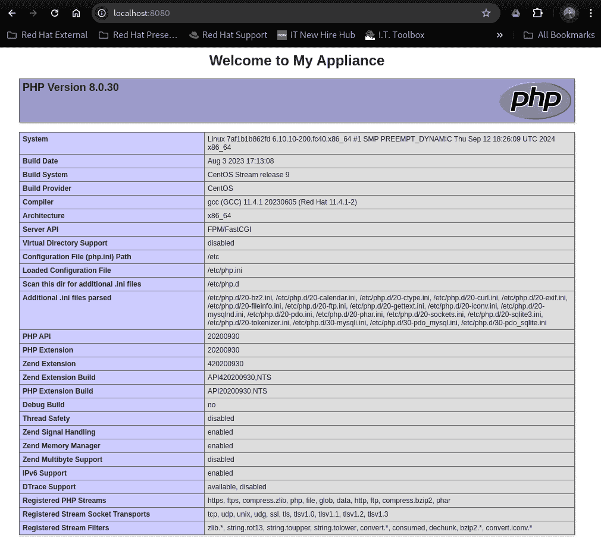

# 第九章：基于镜像的部署

在本章中，我们将真正偏离现有的基于软件包的安装（和更新）规范，而这已经是 Linux 三十多年之久的主流方式。让我们来谈谈**不可变的基于镜像的系统**。不可变镜像只出现了几年，最近才引起了广泛关注。有些人会争辩（包括我自己在内），认为面向设备的不可变操作系统是所有嵌入式系统的未来。想到一个不可变且不变的系统，给人的感觉比其他系统更安全。或者它真的是吗？如果你也认为它更安全，那么你是对的。更安全——是的——但并非完美……本章将为您提供一个关于这个话题的概述，在我专业的看法中，由于其复杂性和迅速发展的未来，它应该有一本专门的书。本章中，我们将回顾并进行一些集中练习，帮助您更好地理解不可变操作系统所提供的安全级别。我们将了解一些可用的工具，并且学习如何利用它们构建、部署，并在客户拿到设备后继续支持您的设备。

到本章结束时，您可能会说服自己，认为这种新的 Linux 部署方式是为我们嵌入式 Linux 系统社区量身定制的。相反，在深入了解这项技术之后，您也许会决定它并不适合您（至少现在不适合）。

在本章中，我们将涵盖以下主要内容：

+   引入基于镜像的 Linux 部署

+   bootc 和可启动容器镜像

+   特殊工具和支持基础设施的差异

+   基于镜像部署的局限性

+   更新和回滚更改

+   实践练习 —— 按步骤演示如何部署基于镜像的系统

现在，让我们继续深入探索。

# 技术要求

为了顺利完成本章中的练习，您将需要两台可以修改或重新安装操作系统的裸机或虚拟机。需要具备根权限、互联网访问权限和 DHCP IP 地址分配。此外，您还需要能够下载 ISO 镜像并且拥有一个 16 GB（或更大）USB 闪存驱动器。最后，您需要一个免费的 Red Hat 开发者账户，并能访问您自己的**Quay**注册表（也是免费的）。由于这些练习的结果更为重要，因此对要求的配置也更高。我希望您在过程中能够享受乐趣，在我看来，这也是一个必须的条件。

在这些练习中，我使用 CentOS Streams 9 作为我的构建机器操作系统，并且我们将创建一个 CentOS Streams 9 可启动容器镜像。现在，让我们继续深入探讨本章的主题——基于镜像的 Linux 部署。

# 引入基于镜像的 Linux 部署

这个主题对我来说非常重要，因为我是嵌入式系统专家，过去十年专注于这项工作。我坚信这套技术几乎是专门为我们的嵌入式 Linux 系统设备以及支持它们的人群量身定制的。你可能会质疑，为什么我和许多行业领袖认为这是未来的技术。我会在这里简短地回答，但在本章的进展中我们将深入讨论。简化的生命周期管理是采纳这项新技术的最大理由。

在接下来的章节中，我将介绍这两种方法论、它们的特点、限制以及工具，还有一些实践操作让你更加了解。

## rpm-ostree 和 atomic images

我们将要审查的第一种基于镜像的安装方法是**rpm-ostree**。这种部署类型有时也被称为*atomic*，因为它是不可变的。一些供应商有他们自己的营销名称。红帽® 将其称为 RHEL for Edge™。不管他们怎么称呼，我称之为改变游戏规则的技术。在最近几年，许多其他发行版都添加了 rpm-ostree 部署选项。也许你还想听几个例子？Fedora® Silverblue，NixOS，openSUSE® MicroOS，Nitrux，Vanilla OS，Talos Linux™ 和 BlendOS 是许多完全基于 atomic 的发行版之一。

任何你之前在 Linux 上使用的用例，现在都可以通过基于镜像的部署来提供更高的安全性和稳定性。你部署的位置无关紧要；这些系统可以轻松运行在裸机、虚拟机或云实例上。

`/etc` 和 `/var`。由于这种镜像格式，传统的分区方法基本上已经不再适用。……或者说是不可变的？

OSTree 的核心通过 HTTP 复制只读树。它还具有应用层和安装机制，可以在 `/var` 或 `/home` 中进行（关于它们实际的文件系统布局的更多细节将在下一节介绍）。这种机制类似于 rpm 存储库的托管方式；然而，它们在镜像作为参考数据（版本控制、标签等）的方式上有所不同。为了你的解决方案，你需要创建支持已部署设备的基础设施。

如果你想大概了解在标准部署模型中可能作为其自己可写分区的变化有多大，看看这种新模型的处理方式吧。因为 `/var` 是可写的，这里有几个关键目录/文件系统映射与你在 Linux 中习惯的不同。请仔细留意。

让我们看看文件系统是如何映射及其权限：

+   `/home` 链接到 `/var/home` 作为 RW

+   `/srv` 链接到 `/var/srv` 作为 RW

+   `/root` 链接到 `/var/roothome` 作为 RW

+   `/opt` 链接到 `/var/opt` 作为 RW

+   `/mnt` 链接到 `/var/mnt` 作为 RW

+   `/sysroot` 是只读的

+   `/boot` 和 `/boot/efi` 是 RW

注意

`rpm-ostree` 是启用 `ostree` 镜像基础的机制。使用 `rpm-ostree` 安装 RPM 包会强制创建一个新镜像，这个镜像只是基础镜像的更新。

为了简化说明，我会尽量将这种方法论与我自己的理解相联系：一系列相互叠加的提交，可以轻松回滚，并以不可变的镜像部署方式呈现，类似于设备化部署。我再说一遍，我感觉有时这简直是为嵌入式 Linux 系统和定制化设备解决方案量身定做的。

那么，我们如何利用 `rpm-ostree` 并在其上添加更多强大的功能呢？让我们快速看一下几种方法，因为我们已经知道基础镜像本身是不可变的。首先，给你一个免责声明：你在其上层叠的任何内容可能不会作为该镜像的一部分进行维护，并且随着系统更新的推进，可能会被遗忘。

也就是说，我们可以在 rpm-ostree 系统之上添加一些东西（镜像本身之外）。这可以通过完全自包含的应用程序（通过 flatpacks 部署）或作为一个运行中的容器镜像（部署在镜像之外）来实现。在这种用例中，基础镜像仅仅是一个提供动态应用程序的平台。

另一种方法是将 RPM 包安装到镜像之上。我想可能有人有这种用例，但我认为这应该是镜像的一部分，系统应该通过包含额外 RPM 包的最新镜像进行更新。现在我们了解了 rpm-ostree 及其关键特性，下面是可以作为 *可选* rpm-ostree 部署的发行版示例。请注意，这只是一个不完全的列表：

+   Red Hat® Enterprise Linux®

+   Fedora®（多种变体；最常见的是 Silverblue）

+   Vanilla OS（基于 Ubuntu®/Debian® 的变体）

+   Debian® ostree

+   openSUSE®（Slowroll）

+   SUSE Linux Enterprise Server™

+   CoreOS®

+   Rocky Linux®

+   AlmaLinux®

+   Oracle Enterprise Linux™

+   CentOS® Stream

所以，请了解你有许多选项可以测试 rpm-ostree。更多详情，请访问 libostree 在线文档：[`ostreedev.github.io/ostree/`](https://ostreedev.github.io/ostree/)。

让我们进入下一个主题，那就是可启动容器。

# bootc 和可启动容器镜像

自从我开始写这本书之前，我就深度参与了与产品团队在这一前沿技术的范围、测试和文档方面的工作。这些努力让我结识了一些非常优秀的工程师，他们善于从不同角度思考问题。

什么是 bootc？一种简化的理解方式是将 bootc 定义为将 Linux 内核层叠到容器镜像中的工具，这样容器镜像就可以独立启动，无需外部操作系统来托管它。

如果你有兴趣参与这一全球技术变革的努力（或者只是想了解更多），这里是 bootc 的 GitHub 仓库：[`github.com/containers/bootc`](https://github.com/containers/bootc)。在这里，你可以找到维护得很好的广泛文档。

让我们明确一点，bootc 是前沿技术。红帽®（引领这一新技术的组织）将其视为*技术预览*状态，直到工具和支持基础设施到位，他们才会考虑其完全可支持性。基本上，在 RHEL 10 和 RHEL 9.6 发布之前，这项技术将不会被视为完全可支持的，或者像红帽所说的，**一般可用**（**GA**）并且适合生产工作负载，预计这两个版本都将在 2025 年 5 月发布。

这并不意味着你应该坐等。我强烈建议你进行全面的测试和尽职调查，看看这种部署方法现在及未来是否能为你的产品带来价值。

bootc 究竟是什么？bootc 是一个开源项目，利用**开放容器倡议**（**OCI**）标准的容器镜像创建完整的操作系统镜像。它采用了现有容器基础设施中用于创建和更新容器镜像的相同分层技术。它还利用其他项目的功能，例如 rpm-ostree，来创建和更新这些操作系统镜像。

bootc 与 rpm-ostree 的区别是什么？两者都是基于镜像的部署方法，都具有一定程度的不可变性。它们的不同之处在于构建方式和更新方式。最重要的区别是 bootc 独特的能力，它能以容器为基础构建不可变镜像。

bootc 方法的独特优势在于，已经有一个庞大的开发者生态系统和工具集，专门用于构建容器。如果你能构建容器，你现在就可以构建一个完整的系统。这个构建链已经发生了变革，对于大多数公司来说，如果它们现在已经在使用容器化应用，那么适应这种新方法几乎不需要额外的工具。

但等等……在美国公司和全球其他地区，并不是每个容器化应用都需要转换为基于镜像的设备。对于我们来说，真正的变革是嵌入式 Linux 系统社区。通过这项技术，我们可以设计、创建、构建和自动化驱动公司成功的产品生命周期。

目前，许多工程师正在努力工作，以提供支持这种部署方法的新工具。等到 RHEL 9.5 发布时，社区应该已经能够在被认为是构建系统镜像和安装程序的首选工具中，获取所有的新功能，这个工具就是**Image Builder**。Image Builder 自 RHEL 8.3 以来就存在（已经有一段时间了），但它一直在不断发展，并且每个月都在变得更好。

对于在 Fedora 和 CentOS Stream 中构建镜像的我们来说，我们可以今天就利用新的功能，虽然这样做意味着我们处于前沿阶段，可能缺乏企业发行版的支持和稳定性。我强烈推荐查看在这个 GitHub 仓库中关于 Image Builder 功能的持续开发：[`github.com/osbuild/bootc-image-builder`](https://github.com/osbuild/bootc-image-builder)。

现在我们已经介绍了 rpm-ostree 和 bootc 镜像，让我们继续前进，看看它们有何不同。

## 特殊工具和支持基础设施差异

这就是我们可以轻松将一种方法论与另一种方法论进行对比的地方。两种方法都能巧妙地工作；然而，仅仅通过 rpm-ostree 来创建、维护和支持构建的设备更加困难，并且它们的工具也更需要动手操作。

在接下来的几节中，我将主要聚焦于最相关的开源工具，适用于这两种方法论。让我们从查看可以帮助你交付 rpm-ostree 解决方案的工具开始。

### rpm-ostree 开源工具

今天，开源社区为团队提供了大量可用的工具，无论你选择了什么操作系统。也就是说，每个发行版可能会有一些轻微的修改或功能差异，旨在使工具更适应其特定发行版的基础。

一些很好的示例工具，用于在跨发行版的 rpm-ostree 镜像部署中构建或维护功能，包含：

+   **Composer-cli**: 一款用于定义 Linux 镜像复杂内容的命令行工具，并能够将镜像渲染为多种格式

+   **Osbuild**: 一款用于构建 Linux 镜像的命令行工具

+   **Composer**（在一些发行版中也称为 **Image Builder**）：一款图形化的基于 web 的工具，用于定义、构建和更新 Linux 镜像

+   **Cockpit-composer**: 一个在 Linux 机器上的 web 控制台插件，使用户能够在 cockpit/web 控制台的网页 UI 中使用 Composer。

+   **Toolbox**: 一款交互式命令行工具，帮助排查操作系统故障

接下来让我们继续探讨我们可以利用的其他镜像部署方法工具。

### bootc 可启动容器镜像工具

在我看来，这里是事情变得有趣的地方。bootc 基于镜像的系统并不需要一堆复杂的工具来构建和支持。在本章的动手练习中，我们将深入探讨这一概念。

请允许我详细说明。正如我们将很快看到的，你在构建机上所需的只是一款文本编辑器和对注册表的访问权限，就能构建和更新你的应用程序。在构建过程中，我们还将利用一些容器工具。

这是一个可以利用的工具列表示例，用于创建和支持 bootc 基于镜像系统的生命周期：

+   编辑器（vi、emacs、nano 等）：简单的文本编辑程序，可以是基于控制台或图形界面的，但功能不如 IDE 套件丰富。

+   Podman：一个容器管理工具，用于在 Linux 上构建、运行和管理容器

+   IDE（Podman-Desktop、Eclipse、Visual Studio）：各种图形化的综合开发工具

+   Image Builder：一个图形化的基于 Web 的工具，用于定义、构建和更新 Linux 镜像。

+   Cockpit-composer：一个用于 Linux 机器上 Web 控制台的插件，允许用户在 cockpit/Web 控制台 Web UI 中使用 Composer。

+   Console.redhat.com：由 Red Hat® 托管的一个全面服务，可以协助系统的构建、维护和自检

+   注册表：注册表对于托管容器镜像并提供分发更新的中心位置至关重要，例如 Quay™、Amazon Elastic Container Registry™（ECR）、Harbor、Azure Container Registry（ACR）、GitHub Container Registry™、Google Container Registry™（GCR）、JFrog Container Registry™。

让我们进入一个更严肃的话题，今天基于镜像的部署的局限性。

# 基于镜像的部署的局限性

虽然基于镜像的部署是我们创建和维护解决方案的范式转变，但它们确实具有标准基于包的部署所没有的特殊性。对于基于镜像的系统，更新以重启的速度进行。而基于包的系统更新操作可能需要数小时，并且需要多次重启，同时希望没有依赖关系被破坏，最后一切正常。

一个显著的被认为的局限性是文件系统被定义为不可写。尽管许多人将不可变性的更广泛概念视为一项特性，但如果你试图将第三方解决方案安装到镜像中，而该解决方案期望被安装在一个非常特定的位置（文件系统），该位置需要是可读可写的，而实际位置是只读的，那么问题会立刻显现。

这是一个被认为的局限性，而非实际局限性。通过创造性地使用符号链接，这个问题很可能可以轻松绕过。

对于那些未参与生态系统的人来说，这些部署有时可能会被误分类或被认为是缺乏灵活性，或者认为它们在定制或调整解决方案方面的能力有限，而且通常必要的软件可能需要被添加到非标准文件系统位置，以便这些应用程序能够在读/写模式下运行。这其中有些是误解，但并非全是。让我们深入探讨一下。

## rpm-ostree 镜像局限性

好的，rpm-ostree 是一个很好的解决方案。它确实很棒，我必须给予它应有的赞扬。我非常喜欢它。话虽如此，我也必须回应一些人认为它可能不够灵活的看法。我提出这样一个说法，实际上它的确是有意如此的。它是一个非常安全、不可变的基于镜像的部署方式。它的工具本身有助于使 rpm-ostree 成为一种非常规范化的部署方法。rpm-ostree 的设计本质上是为了成为一个安全的平台，能够轻松地托管容器化应用或虚拟机，同时保持非常小的系统占用。

但我必须揭示一些限制和难点。首先，内核定制是一项挑战，因为目前的工具并没有在这方面提供帮助（还没有）。我认为，如果你有任何想在最终状态中实现的定制需求，你的团队应该为这些定制创建自定义的 RPM 包。这还要求你对计划作为设备基础的具体硬件有深入了解。管理操作系统级别的用户账户可能会是一个重要的挑战，因为任何添加到部署后，诸如密码或用户组关联等修改，都可能会丢失，因为它们有可能被下一个镜像更新覆盖。在 *第十章* 中，我们会更深入地探讨这一点；我们将回顾最佳实践，即永远不要让最终用户直接登录到操作系统。 我能理解在企业环境中，这可能被看作一个巨大的问题，但在一个安全的设备中，我想问：这真的是问题吗？

此外，数据实际上是可读/写的地方，确实会增加设计和支持过程中的额外工作。用户数据、应用数据等，都是这种部署方法中的一些复杂因素。规划、测试，以及创造性地使用符号链接到可写位置，将是帮助你克服大部分这些感知问题的关键概念。

我经常争辩说，前面提到的这些方面其实并不是限制，而只是设计上的考虑，因为如果你选择通过 rpm-ostree 部署，你将开始一段不同且复杂的旅程，并且能获得许多安全上的好处。记得我曾说过，安全从设计桌开始吗？

让我们继续讨论其他系统为何可能被视为受限。

## bootc 可启动容器镜像的限制

在这里，我觉得我必须宽容一些，因为这项技术甚至还没有达到 1.0 版本的状态。bootc 仍在不断发展，而且它的潜力巨大。此外，我还需要重申，支持 bootc 的先进工具也仍在不断演进。或许我有些偏见，但我看到 bootc 镜像的未来前景极为光明。

对于嵌入式设备来说，拥有一个稳定且安全的更新方法论是一个重要的设计点。今天，bootc 镜像最容易通过访问其创建者的在线注册表来支持。如果你的解决方案在客户将其部署到自己的环境中后可以访问互联网，那就没问题。今天，对于基于 bootc 的嵌入式 Linux 系统设备来说，*在线* 是最佳选择。

我今天看到的一个被认为的限制实际上并不是真正的限制，而是一个必须在设计阶段认真考虑的重大设计问题。今天，离线的 bootc 镜像部署是可能的，只是稍微复杂一些。如果你的产品需要在**隔离环境**或无网络环境中部署，就必须在设备的接口中设计一种更新导入方式。这实际上意味着要有一种方式，能够在本地导入新的容器镜像，作为更新和重建的基准。

再次提醒，像 rpm-ostree 一样，我建议通过仅允许应用程序级别的访问并限制操作系统账户，来将操作系统从终端用户面前隐藏。这将解决在每次更新/镜像重构时，操作系统用户账户维护的类似难题。是的，在 bootc 镜像中，管理或控制操作系统级别的用户也是一个问题。我猜随着 bootc 的发展，可能会为此开发更多的工具。

与 rpm-ostree 相比，bootc 超越了灵活性和定制化。内核修改变得更容易实现。为什么？因为容器本身非常灵活，并且更容易维护。

我的专业观点是，这项技术值得密切关注，因为它可以改变并简化你构建设备的方式。我不会说它没有痛点，但我确实认为它有着非常光明的未来。接下来我们来看看如何更新或者在最糟糕的情况下回滚。

# 更新和回滚更改

**基于包的系统**，无论是哪个包管理系统（RPM、DNF、APT、Zypper 等），在升级操作系统版本或尝试回滚安装时，都可能出现问题和遗留问题，导致一些意想不到的后果。如果你曾经遇到过这种情况，你一定明白我说的意思，我向你表示同情。对于那些幸运或没有遭遇过失败包更新过程的人来说，这就是区别所在。

基于包管理的系统在处理更新时必须实时检查其依赖项。这一过程的结果是，某些包可能会被添加或废弃，而你可能在过程中都没有意识到。这个过程不仅笨拙且难以理解，而且还会消耗大量时间。希望你在向客户发布更新之前，已经对每个版本进行了*无休止*的测试。有时，甚至经常需要多次重启。我为那些在经历这些的人感到同情。这就是停机时间。希望它第一次就能成功，因为如果不能，回滚通常需要从备份或快照中恢复，哈哈哈哈——如果这些备份或快照甚至存在的话。

基于镜像的操作系统不会受到那些问题的困扰。无论是提供增量更新，还是完全新的操作系统，这种交付方式都能快速进行就地升级，而不会影响用户或应用数据。如何做到的？这些系统准备好新的镜像后，直接重启进入新的镜像。快速、干净、高效。更重要的是，由于你和你的团队已经测试过这些镜像，所以几乎不需要担心新镜像是否有问题。

所以，假设最坏的情况：镜像在下载过程中出现了某些损坏。*没问题*。我们可以轻松地从之前的镜像中恢复。这真是太棒了，对吧？！接下来，让我们看看这些系统如何在不增加压力的情况下进行就地升级。

## 就地升级操作系统版本

这是另一个所有基于镜像的部署闪光点：就地升级。

对于 atomic/rpm-ostree 系统，我们所需要做的就是基于更新的操作系统创建一个新镜像，并将该镜像放入设备的更新仓库中。设备可以下载并准备新镜像，重启后将升级到操作系统的新版本。

对于 bootc-based 系统，我们所需要做的就是基于更新的操作系统镜像创建我们的容器镜像，重新构建容器，然后将容器上传到注册表。当系统检查更新时，它会拉取新的容器并重新渲染自己为一个升级后的系统。

就像我说的，这些东西几乎是为嵌入式 Linux 系统量身定做的，对吧？现在让我们开始动手实践，自己构建一个吧。

# 实践练习

现在是我们卷起袖子，敲击键盘的时候了。如果你按照呈现的顺序进行操作，最后你将为自己设置一个基于 bootc 镜像的部署生态系统。

在我们开始之前，我想与您分享一些有用的信息。此类基础设施的工具正在快速发展，已经不止一种方法可以设计、构建和部署这些镜像。我认为这是 Linux 社区一个令人惊叹的机会。我在这里展示的方法简单且易于通过像 Ansible 这样的工具进行脚本化或自动化。在整个练习过程中，我会提到其他方法或替代工具，它们可以增强开发者体验并使系统更具扩展性。

由于这些练习要求我们创建的配置文件要非常精确，我强烈建议你在选择通过复制粘贴的方式快速创建文件时要非常小心。因为这样做很容易将隐藏的 ASCII 字符（或格式化字符）复制到文件中，导致你的配置文件无法正常工作，并且几乎无法调试，因为当你打开文本编辑器时，可能只会看到一个空白空间（如果有的话）。我已经提供了可以下载并根据你自己实验室环境进行定制的模板文件。它们可以在本书的 GitHub 仓库中找到（[`github.com/PacktPublishing/The-Embedded-Linux-Security-Handbook/tree/main/Chapter09/exercises`](https://github.com/PacktPublishing/The-Embedded-Linux-Security-Handbook/tree/main/Chapter09/exercises)），同时它们还会为你提供一些我们没有涵盖的其他选项。

所以，拿出一只可格式化的 16 GB USB 闪存驱动器和你最喜欢的饮料（也许不止一瓶），让我们开始吧。

## 练习 1 – 准备环境

在第一个练习中，我们将安装必要的工具，并安装一些可选工具，以创建我们的最小可启动容器镜像构建链。让我们按照以下步骤来操作：

1.  首先，我们将设置一个构建环境，配置我们的注册表，并创建一个容器，作为我们应用程序及操作系统的基础：

    ```

    $ sudo dnf install -y containers-common crun \ 
    iptables netavark nftables slirp4netns \
    composer-cli cockpit cockpit-composer \
    skopeo buildah runc podman
    ```

1.  现在我们将确保 web 控制台已启用：

    ```

    $ sudo systemctl enable cockpit.socket
    ```

1.  在这里，我们将启动 web 控制台的 socket：

    ```

    $ sudo systemctl start cockpit.socket
    ```

1.  确认 web 控制台已经启动：

    ```

    $ sudo systemctl status cockpit.socket
    ```

    你的输出应类似于以下内容：

    ```
    ● cockpit.socket - Cockpit Web Service Socket
         Loaded: loaded (/usr/lib/systemd/system/cockpit.socket; enabled; preset: disabled)
         Active: active (listening) since Fri 2024-08-09 12:39:24 EDT; 1 month 13 days ago
    Triggers: ● cockpit.service
           Docs: man:cockpit-ws(8)
         Listen: [::]:9090 (Stream)
          Tasks: 0 (limit: 38320)
         Memory: 648.0K (peak: 2.5M)
            CPU: 26ms
         CGroup: /system.slice/cockpit.socket
    Aug 09 12:39:24 bm03.local systemd[1]: Starting cockpit.socket - Cockpit Web Service Socket...
    centos-bootc repository.
    ```

1.  点击链接访问 **centos-bootc/centos-bootc**。

1.  请记下这个 URL，我们很快会用到它，也可以考虑将此页面添加到书签。


图 9.1 – 搜索 CentOS Stream 的 bootc 基础镜像

1.  回到终端，配置你的非 root 用户帐户，使其能够搜索注册表：

    ```

    $ cd ~
    ```

1.  创建所需的目录来存储你的容器配置，这样 Podman 就知道从哪里查找信息：

    ```

    $ mkdir -p ~/.config/containers
    ```

1.  让我们切换到刚刚创建的目录：

    ```

    registries.conf file to contain the defined contents:

    ```

    $ vi registries.conf

    ```

    Set the file’s contents to match the following and save the file:

    ```

    # 我们将仅使用这些注册表

    [registries.search]

    registries = ['registry.redhat.io','quay.io']

    ```

    ```

1.  现在，我们将返回到我们的主目录：

    ```

    $ cd ~
    ```

1.  让我们下载 CentOS Stream 9 DVD ISO 镜像，以便稍后在创建自定义安装程序时使用。使用你的网页浏览器访问 [`centos.org/download/`](https://centos.org/download/)，然后点击 **x86_64** 按钮。


图 9.2 – CentOS Stream 9 下载

1.  让我们验证文件大小，并确保它已完全下载：

    ```

    quay.io via the command line. Use your own user account and the password you have previously set in order to access the quay.io registry:

    ```

    $ podman login quay.io

    ```

    If the login was successful, you will receive the following message:

    ```

    登录成功！

    ```

    ```

重要提示

如果你选择了生成加密的 CLI 密码，`login` 命令应该会有所不同。将 `[your username]` 替换为你自己的用户名，将 `[encrypted pass]` 替换为你长而加密的密码：

`$ podman login -u='[your username]' -p='[encrypted` `pass]' quay.io`

1.  让我们拉取基础容器镜像：

    ```

    $ podman pull quay.io/centos-bootc/centos-bootc:stream9
    ```

    这个输出非常长（再次）。在这里，我们已经截断了输出，向你展示你一般可以预期看到的内容：

    ```
    ((( output truncated)))
    Copying blob 775d29f76a39 done   |
    Copying blob 7eff373befa3 done   |
    Copying blob 8c789e616763 done   |
    Copying blob fd730fb4a24b done   |
    Copying blob 54246c915569 done   |
    Copying blob 232fb94490b0 done   |
    Copying blob ad312c5c40cc done   |
    Copying blob bd9ddc54bea9 done   |
    Copying config a1163a9d15 done   |
    Writing manifest to image destination
    a1163a9d15d2f9a3f7f81748baf8fbcfc69690ed38030e770fe2006c090b0f83
    ```

1.  让我们检查一下本地容器清单，并验证我们是否在清单中拥有预期的 CentOS Stream 9 启动镜像：

    ```

    $ podman images
    ```

    你的输出应该类似于此：

    ```
    REPOSITORY                         TAG         IMAGE ID      CREATED       SIZE
    quay.io/centos-bootc/centos-bootc  stream9     a1163a9d15d2  43 hours ago  1.52 GB
    ```

1.  现在，在 Quay.io 网页界面中，我们将为我们的容器镜像项目创建一个公共仓库。我们将从 **Repositories** 标签开始。

重要提示

简单提醒一下，这不是生产环境中应当采用的方法。我们这里只是为了实验室目的使用公共配置。私有、安全的注册表才是我推荐在连接互联网时使用的部署方式。


图 9.3 – Quay – 仓库主页

1.  接下来，我们点击 `bootc`，确保选择了 **Public** 单选按钮，并且选择了 **(Empty repository)** 单选按钮。然后，点击底部的 **Create Public Repository** 按钮。


图 9.4 – 在 Quay 中创建一个新仓库

记下你的仓库 URL；我们稍后会使用它。我还建议你在浏览器中将其加入书签。


图 9.5 – 你的自定义 Quay 仓库

现在，我们已经在你的系统上配置了基础构建环境。通过配置我们如何利用注册表、安装容器工具，并准备容器基础镜像和 Linux 安装 ISO 镜像，我们已经拥有了成功所需的一切。此外，我们还设置了构建系统的网页控制台，稍后会派上用场。接下来，让我们开始构建我们的初始容器，它将作为未来不可变镜像的基础。

## 练习 2 – 创建一个容器文件

在本练习中，我们将创建一个容器文件，我们将使用在前一个练习中下载的基础镜像来构建它。此练习的结果将为我们提供一个可以运行简单的 **Linux Apache mySQL 和 PHP**（**LAMP**）堆栈的容器。如果你决定不手动输入此文件，书籍的 GitHub 仓库中有一个预构建的文件供参考。

让我们构建我们的容器：

1.  让我们创建容器文件并命名为`mycontainerfile.cf`：

    ```

    $ vi mycontainerfile.cf
    ```

    将文件内容设置为如下所示：

    ```
    FROM quay.io/centos-bootc/centos-bootc:stream9
    #install the lamp components
    RUN dnf install -y httpd mariadb mariadb-server php-fpm php-mysqlnd && dnf clean all
    #start the services automatically on boot
    RUN systemctl enable httpd mariadb php-fpm
    #create an awe inspiring home page (all one command line)
    RUN echo '<h1 style="text-align:center;">Welcome to My Appliance</h1> <?php phpinfo(); ?>' >> /var/www/html/index.php
    ```

1.  让我们构建我们的容器镜像：

重要提示

在命令行中，将`[my_account]`替换为你自己的 Quay.io 用户名。

```

$ podman build -f mycontainerfile.cf -t quay.io/[my_account]/bootc/lamp-bootc:latest
```

这个输出也非常长。为了节省空间，我们对输出进行了部分截断，同时仍然展示了你可以预期看到的内容：

```

STEP 1/4: FROM quay.io/centos-bootc/centos-bootc:stream9
STEP 2/4: RUN dnf install -y httpd mariadb mariadb-server php-fpm php-mysqlnd && dnf clean all
--> Using cache a525b1bb126820c8522199f6d42b292210f06e4d178efbc148d97a92b94a64ed
--> a525b1bb1268
STEP 3/4: RUN systemctl enable httpd mariadb php-fpm
--> Using cache 9400a8bbc0287454ae0db9f42f9b49e518daf2b410fd3c3d0bb91a8b58e0a2a3
--> 9400a8bbc028
STEP 4/4: RUN echo '<h1 style="text-align:center;">Welcome to My Appliance</h1> <?php phpinfo(); ?>' >> /var/www/html/index.php
--> Using cache 4bcb220e3de6429f9f83264e84f064f2101c715c78e1104e388d11f6007b560e
COMMIT quay.io/matt_st_onge/bootc/lamp-bootc:latest
--> 4bcb220e3de6
Successfully tagged quay.io/matt_st_onge/bootc/lamp-bootc:latest
4bcb220e3de6429f9f83264e84f064f2101c715c78e1104e388d11f6007b560e
```

很棒！我们现在有了容器镜像。让我们做一个快速测试，看看它运行得如何：

重要提示

在命令行中，将`[my_account]`替换为你自己的 Quay.io 用户名。

```

$ podman run -d --rm --name lamp -p 8080:80 \ 
quay.io/[my_account]/bootc/lamp-bootc:latest
```

你的输出大致会像这样：

```

7d9c474d9dd4e6ab32d910c72775cdb111adfed764f29887c110461ca67c54a6
```

1.  启动容器后，让我们打开浏览器窗口并验证你是否可以查看提供的内容：http://[your_ip_address]:8080。

    如果页面没有加载，仔细检查你的防火墙设置。如果你在运行容器的同一系统上，回送地址应该也能正常工作。



图 9.6 – 测试我们的容器

1.  现在我们应该也能在容器运行时进入容器：

    ```

    $ podman exec -it lamp /bin/bash
    ```

1.  当出现提示时，可以自由测试一些命令，但记得退出：

    ```

    bash-5.1# exit
    ```

    然后你将返回到系统中的常规 shell 提示符。

1.  停止正在运行的容器，因为我们知道镜像已经能够正常工作：

    ```

    lamp.
    ```

1.  我们的最后一步是将我们功能齐全的容器镜像保存到你自己在 Quay.io 中的仓库：

重要提示

如果你还没有登录，请通过命令行重新登录 Quay.io。

在命令行中，将`[my_account]`替换为你自己的 Quay.io 用户名。

```

$ podman push quay.io/[my_account]/bootc/lamp-bootc:latest
```

这个操作的输出会非常长，所以我只展示最后几行：

```

(((output truncated)))
Copying blob 7685af3680f8 skipped: already exists
Copying blob 9046686a9227 skipped: already exists
Copying blob d1c1676ee4e9 skipped: already exists
Copying blob 7a1c4a9ce068 skipped: already exists
Copying blob 0811ec9b544a done   |
Copying blob abef090ec865 done   |
Copying blob 6394663daed5 done   |
Copying blob 2daf40f13a19 skipped: already exists
Copying blob 9dad063a624b skipped: already exists
Copying config 8a4585ebc8 done   |
Writing manifest to image destination
```

很棒！你通过基础镜像创建了未来操作系统的基础，并叠加了应用堆栈，所有这些都通过创建一个可工作的容器镜像来完成。在接下来的练习中，我们将创建一个安装程序，以便将其部署为可引导镜像。

## 练习 3 – 创建一个安装程序

在这个练习中，我们将创建一个 Kickstart 文件，然后将这个 Kickstart 文件与供应商提供的标准 ISO 安装镜像一起，创建我们自己定制的 ISO 安装镜像用于我们令人惊叹的新系统。这种安装方式非常适合在实验室或数据中心使用。如果你是在云服务提供商环境中部署系统，可能需要使用其他方法。关于如何构建 Kickstart 文件的一个好参考可以参考这个指南：[`docs.fedoraproject.org/en-US/fedora/f36/install-guide/appendixes/Kickstart_Syntax_Reference/`](https://docs.fedoraproject.org/en-US/fedora/f36/install-guide/appendixes/Kickstart_Syntax_Reference/)。

让我们开始本练习的第一步：

1.  在第一步中，你将创建一个 Kickstart 文件（`mykickstart.ks`）。在这个文件中，你需要将我提到的 `[you]` 替换为你自己的账户用户名，并设置操作系统的文件系统布局和 root 密码的基本配置。完成后保存并退出该文件。如果你选择不输入整个文件，书本的 GitHub 仓库中有一个示例：

重要提示

在文件内容中，将出现`[my_account]`的位置替换为你自己的 Quay.io 用户名。

```

mykickstart.ks look similar (with your substitutions) to this:

```

# mykickstart.ks

# 版本 1

# anaconda 安装程序类型

文本

# 确保将设备连接到一个具有活动 DHCP 的以太网网络。

network -–bootproto=dhcp -–device=link -–activate

# 基本分区

clearpart –-all -–initlabel -–disklabel=gpt

reqpart --add-boot

part / --grow --fstype xfs

# 这是我们引用容器镜像的地方

# 注意这个 Kickstart 文件没有包裹部分

ostreecontainer –-url quay.io/ [quay_username]/bootc/lamp-bootc:latest –-no-signature-verification

# 用于演示目的的附加设置

# 在生产环境中使用更好的设置

# 这个练习的目的是不是教你如何使用 Kickstart。

# 但为了展示如何在自定义安装程序中使用它

firewall –-disabled

services –-enabled=sshd

# 将你自己的用户账户添加到系统中

user –-name=mstonge –-groups=wheel –-plaintext –-password=embedded

# 设置 root 密码

rootpw –-plaintext embedded

```

				1.  Now, we will install the `lorax` software package, which will enable us to create a custom installer ISO image:

    ```

    完成：

    ```
    ((( output truncated)))
    mkksiso command, which is part of the lorax RPM package we just installed. This will create a custom installer for us:
    ```

    ```

			Important note
			You will need to substitute exact paths of your own here.
			For example,
			`sudo mkksiso --ks /``home/mstonge/mykickstart.ks \`
			`/``home/mstonge/CentOS-Stream-9-latest-x86_64-dvd1.iso \`
			`/``home/mstonge/mycustominstaller.iso`

```

$ sudo mkksiso –ks [mykickstart.ks 的绝对路径] \

[CentOS Stream 9 ISO 的绝对路径] \

[你希望创建的新 ISO 的绝对路径]

```

			The output for this step is significantly long. I have truncated it here to prevent my editor from murdering me. The part you must pay attention to is the last line, which confirms the operation has completed successfully and that it wrote your custom ISO image:

```

((( 输出已截断)))

xorriso : 更新 : 写入： 830548s 74.1% fifo 0% buf 50% 137.6xD

xorriso : 更新 : 写入： 932628s 83.2% fifo 0% buf 50% 150.7xD

xorriso : 更新 : 写入： 1007616s 89.9% fifo 29% buf 50% 110.7xD

xorriso : 更新 : 写入： 1097728s 97.9% fifo 10% buf 50% 133.0xD

生成的 ISO 镜像：1120832 扇区

已写入介质：1121008 个扇区，LBA 48

写入 '/home/mstonge/mycustominstaller.iso' 完成。

```

				1.  Now that we have our own custom installer ISO image, let’s create boot media. For this step, you will need to use Fedora Media Writer. It should already be on your system; if not, download it first. If you need assistance downloading or installing the tool (which works on all major platforms), check out this reference link: [`docs.fedoraproject.org/en-US/fedora/latest/preparing-boot-media/#_fedora_media_writer`](https://docs.fedoraproject.org/en-US/fedora/latest/preparing-boot-media/#_fedora_media_writer).

			Important note
			This step may be optional if you are working with virtual machines – you might be able just to boot from the ISO file itself within the hypervisor.
			Let’s look at how Fedora Media Writer can simplify the creation of boot media.

					

			Figure 9.7 – Fedora Media Writer

				1.  Here, you select the ISO image and the USB thumb drive that you want to commit the bootable image to.

					

			Figure 9.8 – Choosing ISO images
			As the Fedora Media Writer requires elevated access, you’ll be prompted for authentication to achieve `sudo` status.

					

			Figure 9.9 – Elevated permissions – authentication
			It will definitely take a few minutes to render the ISO image to the physical media. Have patience, grab a beverage, and enjoy the break.

					

			Figure 9.10 - ISO build in progress
			Once the ISO build is completed, you’ll be greeted by this screen.

					

			Figured 9.11 – ISO image created
			You can now remove the thumb drive from the USB port. We’re just moments away from installation. You’ve successfully created your own custom installer. Let’s move on and put it to good use.
			Exercise 4 – initial installation
			In this exercise, we will install our first **Image Mode system** with our newly created custom installer. You will boot the test system from the newly created thumb drive (or from the ISO file we just created in the case of a virtual machine). You may need to interrupt your system’s normal boot process to get it to boot from the USB thumb drive.
			Sit back, relax, and watch the magic happen. Let’s move on to deploying our first system leveraging the automated installer that we just created:

				1.  With your newly created boot media, use it to boot (or create a new virtual machine). If you are booting onto physical hardware, you need to be aware of some things before your installation:
    1.  Ensure all previous partitions are removed from the drive (especially the **UEFI** partition) before the installation process begins.
    2.  Ensure that, within your **UEFI BIOS**, any previous entries for **Secure Boot** are removed (**RESET**) and that **Secure Boot** is set to **DISABLED** before the installation.
    3.  Boot your system from the USB media (physical hardware) or directly from the ISO image (virtual machine). This is an automated install and it will notify you upon completion (or failure).

    Here’s what a successful text-based unattended installation looks like.

					

			Figure 9.12 – Installation success!

				1.  Once the installation is complete, test your login credentials at the console.

					

			Figure 9.13 – First login to our new appliance

				1.  Next, let’s determine the IP address of our new system:

    ```

    $ ip addr show

    ```

    Your output should indicate that you have successfully obtained a DHCP address. Make a note of that IP address.

    				2.  Now, let’s open a web browser on another machine and test the LAMP stack.

    Go to the IP address that you found in the previous step.

    Your result should look something like this:

					

			Figure 9.14 – Viewing your appliance’s application
			Welcome to the new world where, if you can create a container, you can build a whole system. Let’s now move on to how we update these awesome beasts.
			Exercise 5 – creating an updated container
			In this exercise, we will make updates to our previously built container image, which will in turn provide updates to our Image Mode machine:

				1.  Your new appliance is defined by its container image. To create an update for your appliance, all we need to do is create a new container and then publish it to our registry. In this step, we will start by creating a new container file called `mycontainerfile2.cf`:

    ```

    $ vi mycontainerfile2.cf

    ```

    The contents of your file should look like this. Don’t forget to save the file:

    ```

    FROM quay.io/centos-bootc/centos-bootc:stream9

    RUN dnf install -y httpd mariadb mariadb-server php-fpm php-mysqlnd && dnf clean all

    RUN systemctl enable httpd mariadb php-fpm

    # 下面的命令是单行命令，尽管看起来像是多行

    # 像两个或更多

    运行 echo '<h1 style="Text-align:center;">Welcome to My Appliance</h1><?php phpinfo(); ?>' >> /var/www/html/index.php

    # 新内容

    运行 dnf 安装 -y cockpit

    运行 systemctl enable cockpit.socket

    ```

    				2.  Build the new version of your container image:

			Important note
			Replace your own Quay.io username where `[my_account]` appears in the command line. You may also have to log in to Quay before running this command (see *Exercise 1*, *step 13*).

```

$ podman build -f mycontainerfile2.cf -t \

quay.io/[my_account]/lamp-bootc:latest

```

			The output for this one is significantly long. I have truncated the output in a few locations, so what we can see here is more of a short summary:

```

(((输出被截断)))

已更新的已安装产品。

已安装：

PackageKit-1.2.6-1.el9.x86_64

PackageKit-glib-1.2.6-1.el9.x86_64

abattis-cantarell-fonts-0.301-4.el9.noarch

adobe-source-code-pro-fonts-2.030.1.050-12.el9.1.noarch

((( 输出被截断更多 )))

sscg-3.0.0-7.el9.x86_64

tracer-common-1.1-2.el9.noarch

udisks2-iscsi-2.9.4-11.el9.x86_64

udisks2-lvm2-2.9.4-11.el9.x86_64

webkit2gtk3-jsc-2.44.3-2.el9.x86_64

完成！

--> 6ab95e317a3c

步骤 6/6：运行 systemctl enable cockpit.socket

创建符号链接 /etc/systemd/system/sockets.target.wants/cockpit.socket → /usr/lib/systemd/system/cockpit.socket。

提交 quay.io/matt_st_onge/bootc/lamp-bootc:latest

--> fe247cf7e89d

成功标记 quay.io/matt_st_onge/bootc/lamp-bootc:latest

fe247cf7e89d97d5832d889718750d63cc5f2f24dcfd5ed4cce39dfafd150778

```

				1.  Now that you’ve rebuilt your container image, feel free to test it in the same way we did in a previous exercise, or don’t (it’s optional). We do, however, have to push this new image to our registry and set it as the latest version:

			Important note
			Replace your own Quay.io username where `[my_account]` appears in the command line.

```

$ podman push quay.io/[my_account]/bootc/lamp-bootc:latest

```

			The output from this command has been truncated significantly due to its length. You can expect your output to resemble this:

```

(((输出被截断)))

复制 blob ad312c5c40cc 被跳过：已存在

复制 blob bd9ddc54bea9 被跳过：已存在

复制 blob 386e8ecea514 完成   |

复制 blob 2463de35bc3e 被跳过：已存在

复制 blob d4cfe3c3d422 被跳过：已存在

复制 blob eedcea4f81f6 完成   |

复制 blob 2bca4ceb08f4 被跳过：已存在

复制配置 fe247cf7e8 完成   |

将清单写入镜像目标

```

			Wow! This is all that you have to do if you want your system to pick up an update automatically. As we are impatient creatures, let’s move on to the next exercise and force the update manually.
			Exercise 6 – updating your system
			In this exercise, we will leverage the latest updates to the container you have created to improve and update our bootable container (bootc) machine.
			Important note
			Your machine will check for updates automatically every few hours. The default time check period can be modified.
			Log back into the console of your appliance machine. Run the following as root:

```

#  /usr/bin/bootc update –-apply –-quiet

```

			Your machine will pull down its updates and reboot itself automatically.
			Well done! You have not only created your first bootc machine, but you have established an update mechanism and successfully updated your new machine. Congratulations!
			Success! You have updated your appliance by adding the web console to your image. Although you probably cannot log in as root, I hope you know that you can add additional users in the kickstart if you want to rebuild or you can add a user in your console now. Here, we only wanted to show just how easy it is to create an update. It works… gorgeously.

					

			Figure 9.15 – Appliance is updated with new functionality
			I hope that you have enjoyed walking through these exercises and that they have inspired thoughts as to how you could leverage this technology to build a better appliance. Additionally, I hope you continue to experiment and add to what we’ve covered in this chapter in your own lab.
			Summary
			Thanks for sticking with me. I never said this journey would be easy. rpm-ostree has been around now for several years, but its time in the limelight has been overshadowed by bootc and bootable container images, an upcoming technology that builds upon its positive facets and the management is much simpler.
			In this chapter, we have done an overview of the option of deploying your Linux appliance as an immutable system. I truly believe this technology could fill an entire book itself, so I do use the term overview quite sparingly. As this does greatly enhance the security of the system, it clearly will add some additional complexity to your build and support processes. Now that you’ve been armed with the knowledge of the tools you may need, you will clearly have some homework to do to determine whether this methodology is right for your team or your product. If time permits, I highly recommend your team does additional research into the feasibility of leveraging this technology in your future solutions. I know that may be a heavy lift. So, let’s now move on to the next chapter, where we will dive deep into the art of tamper-proofing.

```
