# 第十章：对解决方案进行儿童保护：防止最终用户及其环境的影响

本章将为您提供一个关于如何在确保积极客户体验的同时对设备进行儿童保护的速成课程。没错，这两者必须同时进行。提供一个出色的用户界面（UI）绝对是一个挑战，需要在解决方案开发中投入一些额外的努力。只需提前知道，您的付出将在采用率上获得指数级的回报。

在本章中，您将学习一些关键信息，比如为什么将最终用户锁定在操作系统之外对安全至关重要。此外，您还将了解硬件级别的一些关键安全问题。我们还将回顾托管的应用程序本身是否是最终用户真正需要访问的内容。最后，我们将通过提供对 UI 设计影响的更深入理解，帮助您提高设备成功的机会。

本章包含以下主要章节：

+   儿童保护介绍（即，保护设备免受最终用户干扰）

+   确保硬件级别的保护

+   操作系统级别和应用程序保护

+   构建一个简化配置的 UI，同时提供出色的用户体验（UX）

# 儿童保护介绍（即，保护设备免受最终用户干扰）

如何对设备原型进行**儿童保护**，绝对是我最喜欢与产品团队讨论的话题之一。请允许我详细阐述。这一过程可能是决定什么符合设备定义的最大因素。所有确保最终解决方案安全并专注于其预定功能的努力都是至关重要的。必须在初始设置要求上正确引导最终用户，并将其控制在您选择允许他们访问设备/功能之外的范围内。

这里需要考虑很多努力。我的产品最终用户将如何访问解决方案？我们可以做什么来最小化或防止任何最终用户获得未经授权的提升或 root 权限？需要通过设备的 UI 进行哪些自动化，并使其隐藏？

我在这里描述的一个典型例子是防止最终用户利用退出键序列*逃脱*您的应用程序，无论它是基于控制台的还是图形化的。我称之为*No Escape!* 这是通过巧妙地修改一般控制台设置或编辑键盘映射来实现的。在本章将讨论的所有可能的保护措施中，我认为这是一个必须采取的第一步。

让我们继续进行硬件访问的安全保护。

# 确保硬件级别的保护

好的，我知道我们在 *第八章* 中已经讨论过这个问题……但我觉得我必须提醒你，这是真的。确保最终用户无法更改配置是关键。你在这方面有两个主要责任。第一个责任是保护解决方案，第二个责任是防止最终用户控制操作系统。通过实现这两点，你可以确保你的团队控制最终用户的体验。

如果你创建一个简化设备安全操作的用户界面，最终该设备将易于使用，而最终用户无需了解其工作原理。我恳请你考虑所有这些因素。将最终用户从操作系统的所有访问权限中剥离。

创建一种体验，让最终用户可以信任你已经实现了最重要的——一个安全且用户友好的平台。这才是真正的梦想之地。这是我们所有人都渴望创造的目标。这应该是我们的遗产。

硬件安全性是我们已经深入讨论过的内容。然而，我仍然觉得我们必须重新审视这个话题，哪怕只是简短地提及。所以，让我们深入探讨。请原谅我提前提醒，你会看到在这一章中我会重复一些细节。这是为了保护你和你的解决方案。所以，现在让我们继续讨论如何正确配置你的 BIOS 设置。

## BIOS 安全性防篡改

在这一部分，我想要加强之前在许多章节中提到的内容。仔细选择你的安全设置。请了解每个配置选项的利弊。并不是每个设置都会提供最佳的结果。有些设置，甚至大多数，都有我们之前审查过的限制，我们将继续深入探讨。

锁定 BIOS 管理员密码是把双刃剑。是的，你可以完全确保最终用户无法更改 BIOS 设置……但是……这也确保了你的支持团队必须更换设备——而不是远程维修。如果你需要更多关于 BIOS 和启动安全功能的想法，随时可以重新查阅 *第八章*。

这是你的支持计划至关重要的地方。知道它是什么，并拥有它。让我们继续讨论下一个硬件安全选项。

## 禁用 USB

对于这种安全预防措施和防篡改方法，我持中立态度，我将解释为什么。禁用系统上的 USB 端口，无论是通过 BIOS 设置还是操作系统，都可以是一个复杂的安全措施，或者它会永久确保你的支持模式不是故障排除，而是直接更换。消除连接设备（如 USB 闪存驱动器）的能力，通过防止数据传输、未经授权的系统启动或运行你团队未授权的代码，增加了另一层安全性。

选择这种级别的安全性是一个重要的决定。或者……也许并不是。对于某些解决方案，禁用 USB 端口是显而易见的。我们可以举几个例子，说明禁用任何可能的外部 USB 端口在解决方案机箱上的理由。

第一个例子是一个假设的移动呼吸机，用于医院和救护车队以及医疗行业中的其他设备。它有一个 LED 显示屏，所有的控制都集成在触摸屏中。禁用 USB 端口是出于防篡改的目的。因为大多数这些呼吸机可能永远不会连接到网络，或者会被放置在走廊和储物间，直到在它们服务需要的那个关键时刻，防篡改至关重要。这些设备需要经过政府审查和认证。因此，更新操作仍然由经过培训的人员来执行。

我的第二个假设例子是军用车辆中的视觉目标系统。这个设备有自己的显示屏和定制的硬接线控制。禁用 USB 是默认的，因为这个设备永远不会在现场进行更新或维护，只有当车辆本身送到维护厂时，才会由该解决方案的制造商派出的工程师进行服务。现场士兵无法接触，也不应该接触到底层系统。

这些理由足够支持“赞成”这一立场。接下来是一些“反对”的理由。我将以医疗成像系统为例。这可以是 MRI 或 CT 扫描仪——这些只是一些假设例子。这些系统复杂但维护良好，必须如此。它们并不是由拥有（或租赁）它们的医院维护。定期的维护是支持协议的一部分，尤其是当获取这些昂贵设备时。通常，这些复杂的系统由制造商派出的现场工程师按月或按季度进行维护。这些支持工程师绝对需要 USB 端口来运行诊断、修补操作等。医院的工作人员与此无关，这些系统都被保存在有严格限制访问的安全房间中，所以篡改的风险要小得多。

我的第二个例子是一个医疗健康领域的病人监控解决方案设备，需要与键盘、鼠标保持持久连接，更重要的是，需要一个指定的 USB 扬声器，用于在护士站提醒护士。

我最后一个关于禁用 USB 端口的例子适用于任何物理设备，其中可能通过类似自助终端的触摸屏提供正常的用户界面。如果需要对该设备进行任何支持活动，可能需要物理键盘和鼠标，仅仅是为了在等待支持人员帮助解决问题时能操作界面。这只是我认为的简化版示例，至少允许连接键盘和鼠标在任何情况下可能都是必要的。

对于这一套安全预防措施，我相信你和你的团队会权衡利弊。我们继续看下一个防篡改选项。

## 外壳防篡改

这在最终阶段是一个有限价值的选项。很少有硬件制造商启用了这种详细程度。要确定你的最终用户是否在没有你的允许或指导下打开了外壳，是一项徒劳的努力。

我说，谁在乎他们是否打开了系统外壳？如果你的团队正确地锁定了操作系统和 BIOS，那么恶意行为者几乎无法做任何事来破坏系统。他们肯定无法在没有你帮助的情况下添加新硬件。也不应该允许他们这么做。

在最好的情况下，只有在外壳被*打开*时，才会通过在系统启动时显示消息来突出显示（假设能看到控制台）……对于这种类型的封锁，如果你的硬件甚至支持它，你（和你的团队）也无法得知，最终用户可能有能力从任何日志中完全删除此信息，前提是没有任何东西阻止他们进入并更改 BIOS 设置。

奇怪的是，技术供应商可以从运输行业获得一些启示——更具体来说，是卡车运输和航运。你的外壳将需要类似于锁或防篡改夹具或编号标签的东西，以防止最终用户打开外壳（在某种程度上）。一些示例可以通过亚马逊轻松获得。类似的设备可以大大增强并保护你的产品免受篡改。我建议像这些示例一样定制制作。你应该考虑在标签上放置两个信息。首先，放置一个序列号，你可以在内部追踪，它与销售给客户的硬件绑定。其次，放置一个警告，表示破坏封条将使任何保修失效（为了你的保护）。

亚马逊的示例：

+   钢制安全电缆封条 – 亚马逊：[`www.amazon.com/dp/B0CTJZL4QX/ref=sspa_dk_detail_1?pd_rd_i=B0CTJZL4QX&pd_rd_w=2YM0o&content-id=amzn1.sym.8c2f9165-8e93-42a1-8313-73d3809141a2&pf_rd_p=8c2f9165-8e93-42a1-8313-73d3809141a2&pf_rd_r=TAADTD9FHXQ62YCV3V3W&pd_rd_wg=IKKNk&pd_rd_r=cf146379-ab39-49c5-bb8a-048e05de0a7b&s=office-products&sp_csd=d2lkZ2V0TmFtZT1zcF9kZXRhaWw&th=1`](https://www.amazon.com/dp/B0CTJZL4QX/ref=sspa_dk_detail_1?pd_rd_i=B0CTJZL4QX&pd_rd_w=2YM0o&content-id=amzn1.sym.8c2f9165-8e93-42a1-8313-73d3809141a2&pf_rd_p=8c2f9165-8e93-42a1-8313-73d3809141a2&pf_rd_r=TAADTD9FHXQ62YCV3V3W&pd_rd_wg=IKKNk&pd_rd_r=cf146379-)

+   容器、货物的标签锁定…… – 亚马逊：[`www.amazon.com/Numbered-Security-Anti-Tamper-Self-Locking-Container/dp/B07QXWS9DV/ref=asc_df_B07QXWS9DV/?tag=hyprod-20&linkCode=df0&hvadid=693270340443&hvpos=&hvnetw=g&hvrand=8112534262958122670&hvpone=&hvptwo=&hvqmt=&hvdev=c&hvdvcmdl=&hvlocint=&hvlocphy=9001911&hvtargid=pla-757440487320&mcid=3443569f9f6738f8a4a870639b788988&th=1`](https://www.amazon.com/Numbered-Security-Anti-Tamper-Self-Locking-Container/dp/B07QXWS9DV/ref=asc_df_B07QXWS9DV/?tag=hyprod-20&linkCode=df0&hvadid=693270340443&hvpos=&hvnetw=g&hvrand=8112534262958122670&hvpone=&hvptwo=&hvqmt=&hvdev=c&hvdvcmdl=&hvlocint=&hv)

由于有几种方法可以防篡改并保护硬件本身，我谦虚地承认，并非所有方法都适合你的解决方案。请明智地选择。现在，让我们继续探讨如何为你的解决方案锁定操作系统。

# 操作系统级别和应用程序保护

好的，这里事情可能会变得有些复杂。我知道你可能会对我这样的陈述感到一些担忧。所以考虑到这一点，我提供一下免责声明：我不了解你的应用程序。我怎么会知道呢？我（和你）必须相信你的团队了解它。

在这一部分，我将挑战你和你的团队构建一个全面的界面，不仅仅是为你的应用程序，还包括用户访问、更新等。你能通过应用程序/用户界面隐藏的越多，你的设备就会越安全。这一部分以及接下来的几节内容，致力于帮助你实现这一目标。我给你的挑战最终可能决定你的产品是成功还是失败。你在提供丰富且愉悦的用户体验上投入的努力越多，最终客户就越有可能称赞你的产品并全面采纳它。

这些措施不仅仅是为了安全，还能为最终用户创造丰富而愉悦的体验。现在让我们深入探讨其中的几个因素。

## 最小化对根目录的访问

从定义上讲，设备应该易于使用，但不要求最终用户具有深厚的应用程序管理或操作系统管理技能。这些因素是隐含的。如果最终用户的组织具备（或有意愿）维护这样的解决方案，他们最终会自己构建这些解决方案。

因此，在这一思维过程中，我的建议可能显得有些过于严苛。当我写下这些时，我不禁感到有些不安，但我觉得你也应该采纳这种心态。这将最终保护你的支持团队，免受无数不必要的电话困扰。防篡改你的解决方案。是的，我刚刚说了。你越是防止最终用户直接访问操作系统，你的解决方案就会越安全。

如果不采取措施，最终用户获得 root 权限可能会给你的设备带来重大情绪性事件。此时，他们可以对设备做任何他们想做的事。我是不是该列出一些可能出现的恐怖情况？哦，是的，我会。

如果你的最终用户拥有 root 权限，他们可能会在有或没有恶意意图的情况下执行以下任何行为：

+   添加或删除软件

+   修改系统配置

+   向系统或应用程序添加或删除用户

+   删除安全预防措施或配置

+   修改或删除日志以掩盖痕迹（或完全删除日志记录）

+   在系统中进行更改，使得设备无法实现其采购目的

我甚至没有提到那些可能发生的真正邪恶、恶意的活动。对于这些，我将允许你展开想象。尽情享受吧！也许现在你明白为什么我恳求你和你的团队采取一切合理步骤来保护你的解决方案了。

无论你的解决方案是如何访问或交互的，将这些设置从所有最终用户处隐藏并在后台处理，将确保你的解决方案的安全性和稳定性（希望还包括持久性）。

## SUDO 和限制控制台访问

根据你的解决方案的具体设计和实现方式，接下来的建议可能并不可行。嗯……至少可能并不是最初设想的那样。请张开思维，我是为了帮你避免未来的麻烦。

现在我将再次强调一些最佳实践，希望你已经知道。最小化或完全消除最终用户直接访问操作系统的权限。设备*应当*是一个黑箱。最终用户应该只能访问为解决方案设计的服务，以及解决方案未自动化的任何管理任务。

对于管理任务，我认为至关重要的是遮蔽并移除最终用户直接访问操作系统的能力。将 root 权限交给用户群体，实际上会确保在某个时刻，一些恶意（或意外）用户将故意破坏某些东西、逆向工程解决方案，或者——更糟糕的是——重新配置系统以执行恶意活动。

那么，我们如何实现这一点呢？其实并不难。在你的图形界面或 Web UI 背后，设置以非 root 用户身份运行的脚本，该用户具有受限的 sudo 权限。这是保持用户远离操作系统或 shell 的最简单方法。

但是，如果最终用户可以登录系统并有终端访问权限怎么办……限制他们能看到的内容，限制他们可以执行的操作。确保他们被允许执行的操作受到 ACL、SUID、SGID 和其他文件权限设置的控制。此外，对于任何可以访问系统的用户，我建议提供一个受限的界面（即使是基于 shell 的），唯一的例外是你为支持人员（如果有的话）创建的访问权限。

在这种情况下，最终用户可以被视为敌人——无论是有意还是无意。因此，您在界面中所能做的任何防止直接访问操作系统的努力都应该被视为强制性措施。让我们继续。

## 非交互式 LUKS 加密

我们已经在*第六章*和*第七章*中详细介绍了确保磁盘加密（无需最终用户交互）的方法；然而，我觉得如果不再提一次会显得疏忽，因为这也是确保解决方案“防儿童”的另一种方式。

使用自动化磁盘加密时，您将责任从最终用户手中移除，并且防止其恶意更改。不进行自动化会导致糟糕的最终用户体验，并使您的解决方案存在漏洞。既然我知道您已经理解我的意思，那么我们继续。

## 保持用户在应用程序空间中

他所说的“保持用户在应用程序空间中”是什么意思？这是个好问题。为此，我有一个很好的推荐，请允许我详细说明。

另一种有效防止您的应用程序或最终用户破坏操作系统的方式是将所有最终用户保持为应用程序级别的用户，而非操作系统级别的用户。通过这种方式，您的应用程序界面将是用户唯一能够与之互动的地方——永远如此。我的意思是，最终用户在您的应用程序堆栈中只有一个用户帐户，该帐户由应用程序控制，而不是 Linux 本身。这可以防止最终用户访问命令行界面。

可以将其视为应用程序沙箱化...但我们是将其应用于最终用户...这是一个很好的隔离层，能够为您的解决方案增加一层保护性安全。

## 启动时自动启动应用程序

确保您的界面和应用程序在启动时自动启动是理所当然的，但我建议再进一步。以非 root 用户身份使用**systemd**来运行它们。

这是如何设置 systemd 和 `myapplication` 的示例。启用 linger 允许应用程序或服务在非 root 用户登录时正确运行，无需交互。

启动并启用您的应用程序：

```

$ systemctl --user start myapplication.service
$ systemctl --user enable myapplication.service
```

为了确保服务即使在`$USER`未登录时也能运行，我们需要使用`linger`。请记住，`$USER`是您希望运行应用程序/服务的用户帐户：作为。

```

$ sudo loginctl enable-linger $USER
```

现在，您的应用程序将在每次启动时以定义的用户身份运行，无需任何提升或 root 访问权限。通过采用本节中详细说明的定制，我们已采取更多措施确保系统安全性和稳定性。接下来，让我们继续探讨如何在确保安全性的同时提供良好的用户体验。

# 构建一个用户界面以简化配置，同时提供出色的用户体验（UX）

在某个时刻，你的潜在客户已经做出了决策，决定寻求一个商业化解决方案来解决他们遇到的问题。这个决定是是否选择自行开发解决方案，还是购买别人已开发的解决方案。这确实是一个需要记住的重要事实。总有一天——希望尽快——有人会选择购买你的未来产品！

尊重那些做出这个决定的人，通过提供积极且有意义的**用户体验**（**UX**）来回馈他们。为他们提供一个安全的解决方案是显而易见的。如果你的解决方案是一个聚焦于安全服务的家电，他们对你公司的信任将更为深厚。在这种情况下，信任也意味着责任。你的团队需要负责创建一个不需要客户 IT 员工是火箭科学家的家电，甚至不需要任何 IT 员工帮助他们使用你的解决方案。我要挑战你们超越这一点，向最终客户提供一个超出预期的界面，涵盖以下几个方面：

+   在直观性方面超出所有预期（即，用户能够轻松导航）。

+   向最终用户提供适当数量的细节，并且不会让他们在管理问题上负担过重。

+   考虑到所有可能出现的支持和配置需求，以确保最终用户永远不需要直接访问操作系统。

+   为最终用户提供在无需大量培训的情况下使用家电功能的能力。

一个安全且成功的家电体验可以通过其界面中规划和自动化的程度来突出。这些决策在设计阶段早期就已做出，并在此得以实施。无论用户如何与家电交互，隐藏或完全移除操作系统对用户的可见性至关重要。让我们来探讨一些文本和网页 UI 的例子。

## 初始配置 – 文本 UI

对于这一组示例界面，我将向你展示一个最基础的文本 UI，用于家电的初始配置。为了讨论的方便，我们假设最终用户已连接键盘并具有控制台访问权限。

对于这种类型的初始配置 UI，你至少需要为用户设置一个非 root 用户，以便他们能够登录，并且希望在登录后，这个用户只能运行这个简单的设置工具。

我们的第一张截图模拟了一个欢迎界面，供最终用户使用。你也可以添加一些其他友好的信息，比如*感谢选择我们……*或类似的内容。

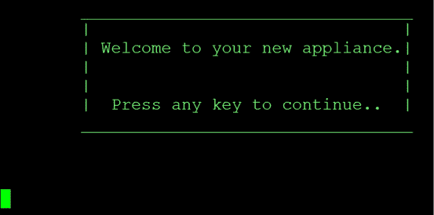

图 10.1 – 文本 UI – 欢迎界面

一旦通过欢迎界面，最终用户将看到一个配置选项的主菜单。

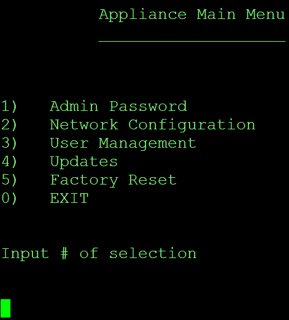

图 10.2 – 文本 UI – 主菜单

让我们也假设这个设备在网络中有一些功能。因此，让我们帮助最终用户定义网络设置。他们只需提供属性值，而你的后台自动化真正进行配置更改，限制最终用户可以访问和执行的内容 – 没有 root 访问权限。

接下来的几个界面将展示用户定义网络设置的交互过程，并最终要求确认以便保存和应用这些设置。

用户可能首先需要提示输入设备的主机名设置。

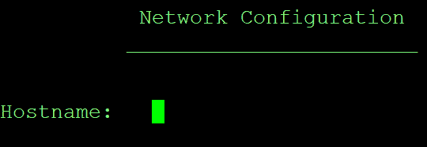

图 10.3 – 文本 UI – 网络配置 – 开始

随着我们继续进行网络配置，IP 地址分配开始：

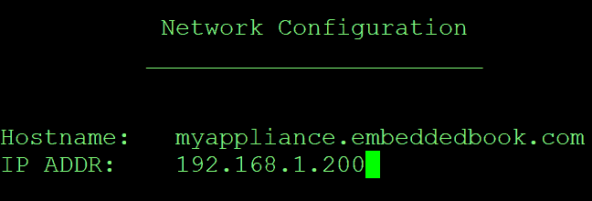

图 10.4 – 文本 UI – 网络配置 – 进行中

随着我们的进展，还有更多的网络设置。在这里，我们展示了更多向内部的设置，其中可以配置子网掩码和 DNS 设置。

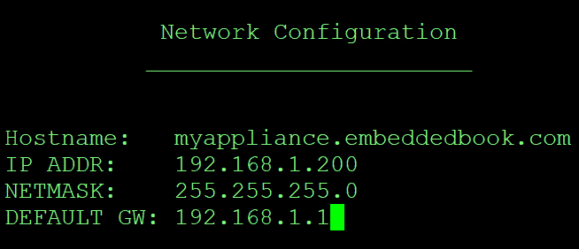

图 10.5 – 文本 UI – 网络配置 – 继续

作为最佳实践，我们应该始终在最后提示用户确认（或取消）设置，然后再将其提交到运行配置中。

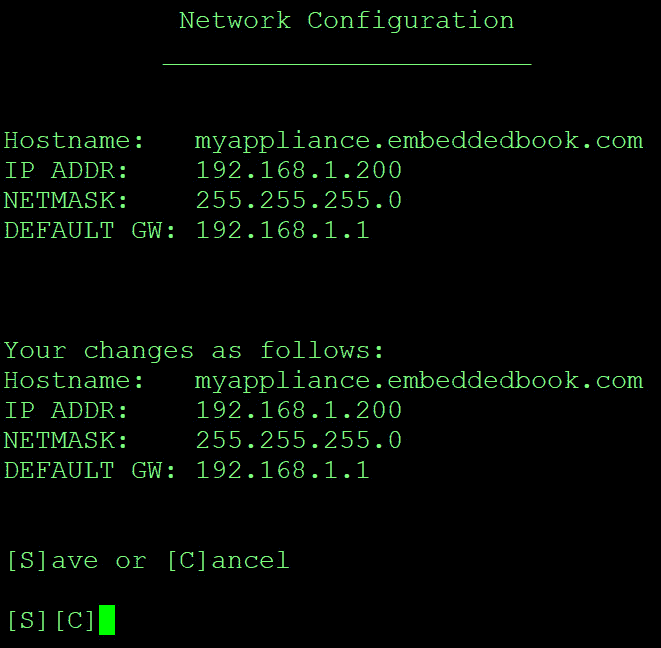

图 10.6 – 文本 UI – 网络配置 – 确认

现在，你的后台自动化正在进行实际的配置工作。

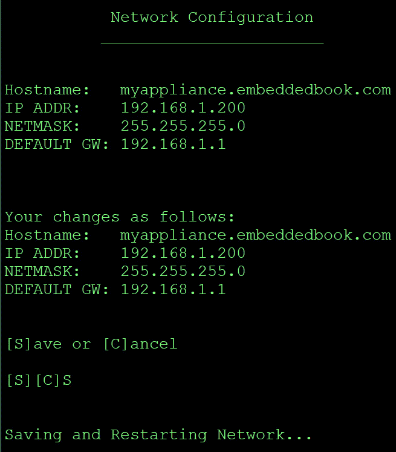

图 10.7 – 文本 UI – 网络配置 – 后台执行

所以，这就是简单的基于文本的设备网络配置。尽量保持尽可能简单，但考虑到所有设备用途和配置的方面添加到这样的菜单系统中。隐藏所有操作系统操作，同时保护系统免受最终用户的影响。

让我们继续看看模拟的简化 Web 配置界面可能会是什么样子。

## 初始配置 – Web UI

基于 Web 的界面可以提供更美观的体验，但需要更多的编程。你仍然会收集与文本 UI 相同的信息，但是不是立即调用 sudo 脚本，而是通过 `cgi-bin GET` 或 `POST` 操作来执行 sudo 脚本。我不会远程教你如何编写网页，因为有成百上千本书可以比我做得更好。

但是，对于初始配置，你应该考虑利用预定义和文档化的 IP 地址，以便新的最终用户访问你的初始设置页面。

在接下来的几张截图中，我们将看到一个简化的 Web UI 初始设备配置的模拟演示。

让我们从一个欢迎页面开始。欢迎您的新客户，并让他们知道系统正在正常工作！该页面礼貌地表明，我们需要进行一些基本的配置工作，才能让最终用户开始使用该设备提供的服务。

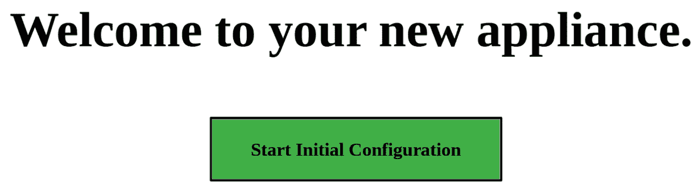

图 10.8 – Web UI – 欢迎页面

从欢迎页面开始，我们选择**开始初始配置**并进入一个模拟的主菜单，侧边栏中有简单的导航选项。此时，最终用户将看到一些明显的选项，这些选项在初始配置事件之后也应继续保持可用。

在这个主要配置菜单中，最终用户将拥有一些关键选项，这些选项应根据需要进行规划——管理员访问、用户访问、网络配置、恢复出厂设置，当然，还有处理更新的方法。

由于最终用户急于开始使用该设备，逻辑的第一步包括引导最终用户设置管理员密码，然后配置网络/主机名。

在这个示例中，我们将看到设备管理主菜单的简化基于 Web 的 UI 至少应包含哪些内容。

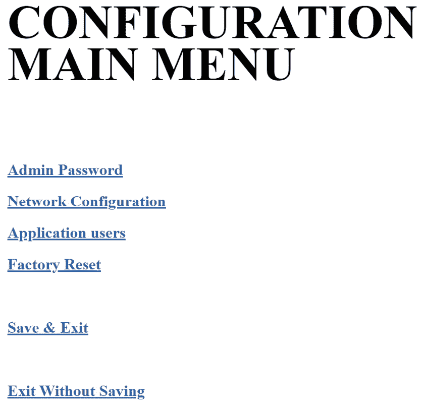

图 10.9 – Web UI – 设备主配置菜单

假设我们在这里选择了**网络配置**，并希望为该设备设置基本的网络设置。此类初始配置的基本需求不仅应包括网络配置，还应允许最终用户分配适当的主机名，以便系统也能通过他们自己的 DNS 系统进行引用。

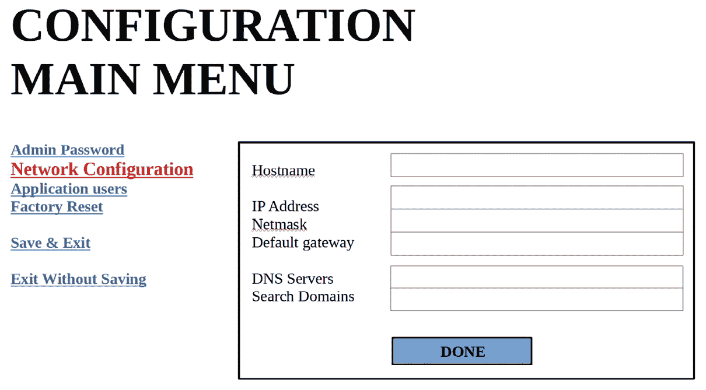

图 10.10 – Web UI – 网络配置

现在，我们已经通过简洁的基础设备配置过程引导了新的最终用户，他们可以利用您的产品提供的所有出色服务。最终，和现在的任何计算机系统一样，该设备将需要打补丁和更新，这将引导我们进入下一部分。

## 更新控制 – 文本 UI

您设备的最终用户体验将不完整，除非您为设备添加一个获取更新的方法。所谓更新，指的是操作系统的错误修复和增强、应用程序的补丁和增强、新功能，甚至如果您的解决方案是物理设备，还包括固件更新。

创建这种类型的界面还创建了一个边界层，将最终用户能够做的事情与设备可以为自己做的事情区分开来。我们必须消除任何可能导致最终用户直接访问操作系统本身的需求或借口。

根据使用场景和部署方法，界面应考虑如何呈现更新。由于隔离的系统无法连接互联网检查更新，因此界面应能够以其他方式接收更新。USB 闪存盘、tar 包和 ISO 镜像都是可以将更新传递给最终用户的方式，然而，最终用户需要将它们传送到界面，并且设备应处理这些更新，而不让最终用户访问操作系统。

这是一个文本 UI 中的设备更新控制示例，其中设备可以访问互联网检查更新。

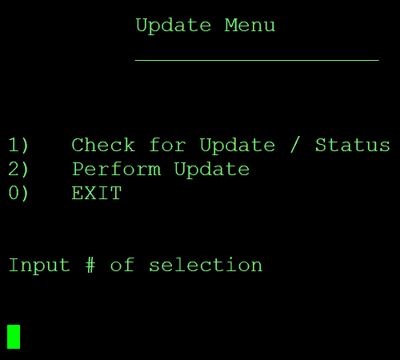

图 10.11 – 文本 UI 更新菜单

现在我们已经解决了为设备提供更新的基本需求，接下来我们可以讨论另一个关键的最终用户功能：设备重置。

## 恢复出厂设置控制

每个好的设备都应有一种将其恢复到出厂新状态的方法。为最终用户创建这个体验，还可以简化他们将设备重新配置到公司不同网络或位置的过程，通过删除任何存储的应用数据或以前的配置。这种功能还可以让客户放心，如果他们将设备寄回公司，可能敏感的数据已经被擦除。接下来的截图将展示这在文本 UI 和网页上的示例。

让我们从一个网页 UI 重置功能页面开始。这个页面将呈现一个两步流程，确保他们确实知道机器将恢复到全新状态（所有数据和配置已被擦除）。为了实现这一状态，他们首先需要在界面中勾选复选框，然后按下**重置**按钮。

重要提示

我还建议弹出窗口询问他们是否再次确认是否真的想恢复出厂设置，如果你想做得更人性化的话。

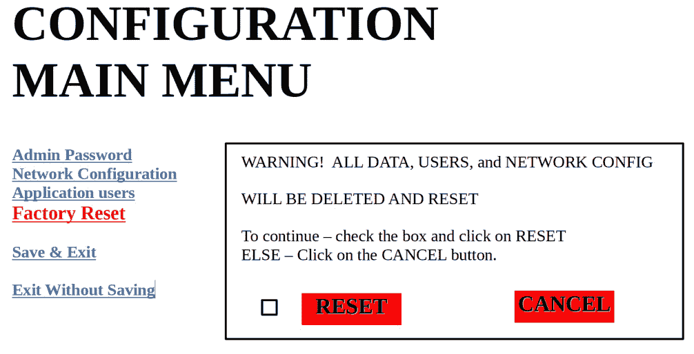

图 10.12 – 网页恢复出厂设置示例

这里是一个文本 UI 中的恢复示例。最终用户会看到一个提示，确认他们是否真的要将设备恢复到出厂新配置并擦除所有数据。就像之前展示的网页示例一样，他们始终可以选择取消操作。

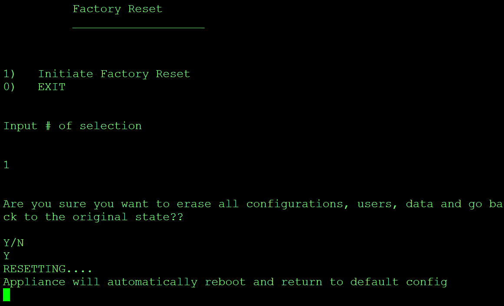

图 10.13 – 文本 UI 中的示例恢复出厂设置

我相信这些针对您未来 UI 所需功能的模拟已经为您提供了有价值的见解。当然，您的 UI 将显得更加精致，并与贵公司产品的品牌指南保持一致。通过建立一个安全的 UI/终端用户环境，您为您的解决方案确保了另一个安全因素——防篡改性。现在，让我们进入章节总结部分。

# 总结

再次感谢你与我一同继续这段旅程。在本章中，我们回顾了为什么锁定我们的设备至关重要。我们总结了一些需要考虑的硬件和存储安全选项。最重要的是，我们已经确定了确保良好用户体验的关键方法，同时通过将操作系统的访问隐藏起来，保持安全性。

在下一章中，我们将深入探讨所有可用的信息资源，帮助你和你的团队保持在威胁环境的前沿。

# 第三部分：构建链、设备生命周期与持续改进

在这一部分，我们将回顾您的设备的额外加固过程，探讨如何将一些关键的政府安全标准应用于系统，以及如何从各个方面收集信息，以便在设备生命周期内持续改进。

本部分包括以下章节：

+   *第十一章*，*了解威胁环境——保持信息更新*

+   *第十二章*，*我的设备通信和交互安全吗？*

+   *第十三章*，*应用政府安全标准——系统加固*

+   *第十四章*，*客户和社区反馈循环*
