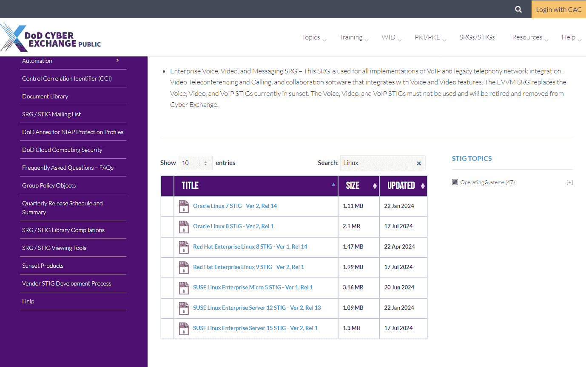

# 第十一章：了解威胁格局 – 保持信息畅通

在本章中，我们将进行一次数据收集之旅，这与超级技术性的动手练习略有不同。相反，我们将通过增强数据收集工作来锻炼思维。这不是用户数据或性能数据，而是潜在的威胁和预防数据——贯穿其中的宝贵信息。

我将带你快速浏览一些网站、博客和其他各种资源，这些你将想要加入到你个人的安全工具包中。在我带你穿越这片丛林之前，我会先给出几个免责声明。首先，单单提到这些内容，并不意味着我对其进行推荐。你聪明且富有资源，完全能够根据即将学到的内容做出自己的决策。其次，我承认我的语言能力有限；我知道我遗漏了许多外文和非英语网站。这并不是因为我没有结论，而是因为一旦语言障碍存在，几乎不可能涵盖所有内容。幸运的是，大多数国际技术网站自然都会使用英语。

跟随这些资源，订阅新闻通讯，并确保你的供应商通过电子邮件向你发送更新，这是确保你和你的团队保持信息畅通并做好准备的重要一步。我还建议你不仅仅是观察；如果可能的话，积极参与并在安全社区内产生积极影响。

请理解，本章旨在引导你到可用的信息资源（大多数是免费资源）。我希望这能为你和你的团队提供一个良好的起点，帮助你们在收集信息时做出更明智的决策。

作为本章的补充，将会有一份包含大量网址和建议的备忘单，其中涵盖了我们在本章讨论的内容。你可以在本书的 GitHub 仓库中找到它（[`github.com/PacktPublishing/The-Embedded-Linux-Security-Handbook/blob/main/Chapter11/Resource_Cheat_Sheet.pdf`](https://github.com/PacktPublishing/The-Embedded-Linux-Security-Handbook/blob/main/Chapter11/Resource_Cheat_Sheet.pdf)）。我计划将这份备忘单保持为一个动态文档，并在有更新时进行更新。所以，记得定期查看该仓库以获取最新信息。

在本章中，你将学习到许多公开和商业上可用的资源。你将了解如何找到与设备相关的安全数据，以及如何将这些信息应用到你的构建链中。我也希望能引导你积极参与，并加入 Linux 社区。

本章将涵盖以下主要内容：

+   在网络上导航信息与虚假信息

+   了解哪些漏洞可能会影响你的构建

+   成为解决方案的一部分

# 在网络上导航信息与虚假信息

正如我们大家所知道的，并非所有互联网资源都是平等的。有些可以被视为璞玉，而大多数网站一般只是*还可以*。我还觉得有必要提到的是，有些网站根本是需要避免的地方，哪怕是付出任何代价也不要去触碰。我们很少知道哪些网站属于这一类，直到为时已晚。可以肯定地说，我们每个人至少都有过一次点击了某个链接，然后在页面加载完成之前就对自己说，“天啊，为什么我点了这个？！”瞬间的后悔。我的唯一建议是，仔细考虑并筛选自己的信息来源。

在接下来的几个部分中，我将重点介绍一些你和你的团队应该利用的优秀资源。这些资源包括政府机构的合规性资源、开源资源、商业可用内容以及博客、新闻通讯和视频频道。我并不是说你必须使用所有这些资源，我只是为你提供了一场永远不会过时的知识盛宴。吃得好，吃得常。有时，我建议你换个口味，尝试不同的资源。

由于我更喜欢保持积极态度，因此我选择不去过多关注那些我认为无效或根本没有生产力的网站。我也从不愿意为把某人引导到这些网站上负责。永远不会。如果我做了那样的事，我想我都无法安然入睡。话虽如此，带上你对知识的渴求，让我们继续深入探索我们的一大堆安全资源盛宴吧。

## 政府资源

让我们从常见的网站开始——这些网站由于您的行业、地点或市场地位，受到一个或多个合规性法规的约束。弄清楚到底需要什么可能会很繁琐，而实施这些要求则更加*有趣*。

不要期待直观的界面、时尚的主题和图形，甚至有时连导航的简便性都没有。政府网站通常考验人的耐心。然而，它们也是在需要详细技术安全要求和配置以确保合规时，真实可靠的信息来源。不过，你可以期待的是极高的专业性和技术细节。忽视这些资源可能会自担风险。以下是我个人认为的美国政府资源，它们是收集和维护与安全威胁相关信息的关键起点，可以应用到您的设备构建链中。

### 计算机安全资源中心（CSRC）

这是由 NIST 托管的网站。可以说，这是进入北美所有网络安全领域的门户。世界上没有其他网站或组织能提供如此详细和深度的信息。

话虽如此，这里很容易迷失。为什么呢？因为信息实在是太多了，而且它们还在不断变化。项目、事件、出版物，甚至是如何正确与 NIST 互动的信息，都可以在这里找到。

从这里开始。做笔记，收藏书签，规划后续操作。

### 国家漏洞数据库 (NVD)

这个也由 NIST 主办，是 CVE 数据库的所在地。如果是风险或漏洞，这里都有记录。经常在这里搜索。它维护得很好，是网络安全漏洞的真实支柱。

这个资源的价值在于其可搜索性。这里是一个示例：

图 11.1 – 搜索 NIST 的 NVD

很可能，你很快就会与 NIST 网站中的搜索功能变得非常熟悉。希望本书的介绍能够帮助你找到所需的资源。这就是事情的本质。这个网站将成为你在风暴中的灯塔，所以越早习惯它的独特性和用户友好性越好——这里提供的信息真的是无价的。我只是希望他们能让界面看起来更舒服一些，懂我意思吗？接下来，让我们继续旅程，学习如何以及配置什么来增强我们的系统安全。

### 安全技术实施指南 (STIGs)

这些是由**国防信息系统局**（**DISA**）发布的，针对他们的主要客户——美国国防部（DOD）。这些作为完整的配置库发布。DISA 宣传其使命是：“为联合战斗员开展 DODIN 操作，确保在所有战斗领域中实现致命性，以捍卫我们的国家。”由于其军事背景，访问该网站会受到监控，甚至不登录时，你也需要同意追踪你的使用情况。

这里是今天可用于 Linux 的 STIG 示例：

图 11.2 – 今天可用的 Linux STIG

为了正确查看这些内容，你还需要下载它们的**查看器**工具。利用它们的建议将有助于确保你的解决方案已经以最佳的安全级别进行配置。

就我个人而言，我在我的实验室中的多个系统以及我的工作笔记本上都安装了 STIG 查看器。我更倾向于保持随时可以深入了解可能需要的配置，无论我身处何地。随着你自己旅程的推进，你可能也会得出相同的结论。

让我们继续旅程，了解一下商业可用资源。

## 商业资源

我们必须去那里。书中提到的并非所有内容都是免费的。这是可以预料的，尤其是在企业安全领域。并非所有这些工具和资源都能在家庭实验室中可行运行，因为成本和硬件要求最终可能会使大多数人无法实现。尽管如此，所有这些解决方案提供商确实提供了免费且公开可用的资源，大家都可以利用。

这份供应商列表并非详尽无遗，也不应将此处的任何列出公司视为背书。了解主要玩家。以下是其中的一些。

### Reversing Labs®

总部位于马萨诸塞州剑桥的 Reversing Labs®为那些具备高级安全意识的用户提供了独特的产品。它们的旗舰产品具有在没有源代码访问权限的情况下检查风险的能力。它们还提供广泛的企业安全和物料清单解决方案。

### Qualys®

总部位于加利福尼亚州福斯特市的 Qualys®提供广泛的产品，专门为多个行业领域量身定制，包括政府。它们最为人知的是能够扫描并检测企业范围内的风险。Qualys 在安全行业中是一个巨大的玩家。

### Tenable®

总部位于马里兰州哥伦比亚的 Tenable®是另一家安全行业的巨头。它们同样以其安全扫描工具而闻名，尽管它们还有许多其他产品和解决方案。

### McAfee®

总部位于加利福尼亚州圣荷西的 McAfee®是病毒防护领域的知名品牌。它们还提供许多其他产品和服务，主要集中在安全 VPN 和身份保护方面。

### 诺顿® 

总部位于亚利桑那州坦佩和捷克共和国布拉格的 Norton®以其杀毒解决方案、身份保护、性能管理和 VPN 解决方案而闻名。Norton 的产品通常仅支持 Windows、macOS 和 Android（实际上是 Linux 的一个变种）。

### 卡巴斯基® 

总部位于英国伦敦的卡巴斯基®公司是另一个在杀毒领域的巨头。它还在身份保护和智能家居监控领域拥有产品，并且提供广泛的 Linux 支持。

## 社区资源

无论是 Linux 社区还是安全社区，都为公众提供了丰富的在线资源。用户组、新闻通讯、文档、最佳实践指南以及项目网站仅仅是你开始收集数据的起点。

这些资源不需要你支付任何费用，只需时间和精力。在我看来，这段时间非常值得。打字时我并没有忽略这一点；这句话将会出现在我的书里。是的，我其实重复了一遍自己，并笑出了声。我坚持这个立场。参与社区，成为社区的一部分。

### 网络安全中心®（CIS®）

**CIS**基准通常被视为配置安全 Linux 系统的全球标准。预计会有从简单到复杂的优秀详细配置建议，可以应用于你的解决方案。CIS®是一个由社区驱动并支持的非营利组织，旨在帮助全球社区构建更安全的解决方案。

当我第一次开始探索 Linux 安全资源时，那似乎是一个世纪之前的事情了，而 OpenSCAP 网站是我的第一个“中途站”。也许这只是因为我自认为是一个以社区为先的工程师。花时间在这个网站上就是高质量的时间。CIS 网站拥有大量的信息、安全基准、配置建议，甚至是预构建的、准备好部署的系统镜像。

如果政府合规性不是你的任务要求，那么这里只提供的资源可能就足以满足你大部分甚至所有的需求。我不会代替你做任何假设，因此我建议你在利用 CIS 提供的资源时，形成你自己的观点和评估。

### OpenSCAP

一个重要的社区资源是 OpenSCAP 网站。这个网站为你提供了对系统进行行业标准、政府或自定义政策扫描的工具。它真的是你团队构建链中不可或缺的工具。我们将在后面的章节中更深入讨论这个工具。如果不使用这个工具或类似工具，可能会让你的产品面临未来的风险。选择时请谨慎。我真心希望你成功。

这是 OpenSCAP 网站上可用工具的一个很好的例子：

图 11.3 – 来自 OpenSCAP 的工具

### Linux 用户组

Linux 用户组是以最低的投入方式参与的绝佳途径。参加这些会议可以远离营销人员和销售人员的干扰，给人一种耳目一新的感觉。大多数时候，它是工程师们与其他工程师分享经验的场所。多年来，我主持了许多这样的会议，发现与会者来自技术领域的各行各业。然而，我常常发现学生、IT 经理甚至高管也悄悄地参加这些会议，目的是在一个无压力的环境中了解新技术。与其他所有社区资源相比，用户组是与那些活跃参与技术的人建立联系的最佳途径。

### 安全用户组

安全用户组（或网络安全用户组）与以 Linux 为焦点的用户组一样具有教育意义。它们通常由产品供应商主办，但并非总是如此。这些小组通常更专注于某个行业领域或特定产品集。我强烈推荐加入一个或多个安全用户组。你所获得的知识将是无价的，甚至可能帮助你提前防止产品灾难的发生。

了解你的团队使用的工具以及他们希望在设备中使用的社区资源是关键知识，并且是进入下一部分的完美过渡。

# 了解哪些漏洞可能会影响你的构建

与追踪产品内容同样重要的是，追踪这些内容与现存漏洞之间的关系，它不仅为你提供了一个明确的清单，帮助你从缺陷和安全漏洞的角度确定需要追踪的内容。这些清单不是持久的，因为随着更新，某些包可能会被弃用，依赖关系也会发生变化。追踪工作随着产品的结束而结束，但安全问题永无止境。黑客和不法分子从不休息。投资优质的软件和更好的流程。始终，始终，始终知道你的“配方”中的成分。

在前面的章节中，我们详细回顾了如何创建一个软件清单，列出你产品的特定构建或发布版本中包含的内容。我们还回顾了硬件方面的影响，如固件和驱动程序。这些知识为你提供了一个虚拟的检查清单，帮助你检查所有可能存在的缺陷和安全问题，并为所有问题提供解决方案。这些清单成为你开始可能漫长且永无止境调查的起点。

平均的 Linux 发行版可能有 7,000 个或更多的软件包可供选择。你的安全团队是否希望为你追踪所有 7,000 个包？他们是否希望你使用如此多的包？这就是人们通常讨论如何最小化软件足迹的地方（即，只安装最基本的软件包以确保系统正常运行）。一旦你自己进行这样的追踪，你会更加欣赏最小化安装的价值。

更小的足迹不仅让从更新角度支持解决方案变得更容易，还减少了攻击者可能攻击解决方案的途径。所以，我建议在初始原型阶段使用你喜欢的任何内容，但在去除（或根本不安装）任何不需要的东西时要精确和谨慎。这项工作将使你更加贴近你的产品，并进一步帮助你在我们深入了解如何追踪解决方案组件时。

## 基于你的组件进行智能搜索

查找可能影响你产品的所有问题，可能会变成一项全职工作，所以除非你拥有无限的预算，否则你和你的团队需要高效地完成这项工作。在可能的情况下，使用自动化确认是否存在问题。

这可能需要你创建一些脚本或一个组件数据库，并将所有来自社区源或供应商的电子邮件更新、发布说明和通讯信息输入到该机制中。

如果没有自动化，这将是一项非常繁琐的工作——总有一些问题会漏掉，哪怕是最强大的团队也难免出现这种情况。所以，我强烈建议整理这些数据，以便你的团队能够定期审查任何有趣的发现。在我看来，知道某个软件包有一个未修复的公开 CVE 漏洞是关键信息。我敢肯定，你的团队也会同意这一点。

可惜的是，这里并没有一个真理支柱可以为你提供指导。从多个来源获取漏洞和安全问题数据是最好的。首先是你希望已经订阅的供应商电子邮件更新，但这并不是最后的途径。你还可以从博客、新闻通讯和政府合规网站收集数据。通过这些，你应该能够为你的产品创建一个虚拟的安全天气报告，并将这些知识与产品的路线图结合起来。

将所有收集的数据存储为文本。这时，一套好的脚本可以帮助你查看你的清单，看看是否有任何软件包或硬件受到影响。尽管这是一个复杂的过程或工作流，但你最终应该能够创建一个自己的数据库来进行报告。在你完全识别出所有数据和数据源之前，电子表格可能会更方便。CSV 格式也能给你一个快速入门的机会。无论如何，你可以通过多种方式梳理这些数据，创建一个简洁的组件级报告，将为你提供所需的虚拟安全天气报告。这可能会有一些盲点，因为你是从已知的可搜索数据构建的。尚未发现的零日漏洞仍然可能对我们造成伤害。

构建链中的安全扫描工具是另一个数据来源，而且是一个至关重要的源头，不容忽视。但请不要 100%依赖它们。一些供应商还提供额外的产品，以补充他们销售的扫描工具。这些工具，如 Tenable 的漏洞管理套件，能协助你的工作，并提供你所寻求的全局视角。

我发现自己陷入了困境，虽然不太愿意提及，但我认为在不久的将来，AI 的创造性应用可能会是件好事。所以，请稍微容忍我一下。当安全专家今天开发 AI 增强的安全工具时，你也可以相信，全球各地一定有不法分子在寻求利用 AI 将他们的恶意行为提升到一个新的水平。话虽如此，我还是建议保持警觉，接下来让我们看看你如何能成为解决方案的一部分。

# 成为解决方案的一部分

你可以通过许多方式为 Linux 和安全社区做出贡献。

通过阅读这本书，如果你还没有深入研究嵌入式 Linux 系统的安全性，你已经开始了这段旅程。欢迎加入，感谢你购买我的书。不要让这只是一个单一的事件。时不时查看这本书的 GitHub（[`github.com/PacktPublishing/The-Embedded-Linux-Security-Handbook`](https://github.com/PacktPublishing/The-Embedded-Linux-Security-Handbook)）。随着事态的发展，它也会进行更新。

这个社区可能和现在寻求教育、答案或指导的许多人一样古老（甚至更久）。年龄在这里几乎没有意义，也不应该有意义。重要的是你是否有学习或分享知识和经验的渴望。安全风险是不分年龄的。如果你不做好准备，它们会找上你。因此，我们有一个充满活力和多样化的工程师、开发者、测试员、技术写作人员和思想领袖的社区。我并不打算做出过于自命不凡的规划，告诉你该如何或不该如何参与或贡献。我和社区中的许多人一样希望的，只是你能迈出那一步，积极参与其中。在接下来的章节中，你将看到我所说的内容。

## 参与开发过程

你不需要是开发者才能在这里做出贡献。你可以志愿测试早期版本的代码，提交错误报告，甚至提交增强请求（RFE）。你提供的反馈对于开发人员来说至关重要。

如果你决定成为这一过程的一部分，你可以加入多个 Linux 社区。每个开源社区都有自己的贡献和积极参与的流程与指南。每个社区都有其独特的文化，但所有社区都会欢迎你的加入。

下面是一些关于如何加入多个流行的社区 Linux 发行版的测试和开发工作的链接：

+   Fedora® ([`docs.fedoraproject.org/en-US/project/join/`](https://docs.fedoraproject.org/en-US/project/join/))

+   CentOS Streams® ([`centos.org/`](https://centos.org/))

+   Ubuntu® ([`ubuntu.com/community/contribute/ubuntu-development`](https://ubuntu.com/community/contribute/ubuntu-development))

+   openSUSE® ([`en.opensuse.org/openSUSE:Heroes`](https://en.opensuse.org/openSUSE:Heroes))

谁知道呢？你的贡献可能会帮助别人避免很多麻烦，同时解决你自己遇到的 Linux 安全问题。作为社区的活跃成员，这不也会让人感到些许自豪吗？让我们继续看看如何在社区中积极参与。

多年来，我的个人和工作经验让我对许多社区开发项目有了独特的了解。我还是 OpenStack 社区的成员（也叫 OpenInfra 社区）。对我来说，选择一个要参与的群体并不容易。有许多很棒的群体。我推荐的做法是跟随你的内心。加入一个离你最喜欢的 Linux 发行版最近的社区。如果那不适合你，至少可以考虑加入一个专注于你在工作中使用的发行版的用户组，这也是我们接下来要讨论的内容——用户组。

## 加入用户组

我认为，**聚会**和**用户组**是社区中最好的社交方式。它们没有过多的产品推销，而是专注于分享解决实际技术和安全问题的创新方案。

你不需要成为火箭科学家或拥有什么高级头衔。对我来说，这两种情况都不适用。我只是一个普通人，在我的职业生涯中获得了一些相当有趣的知识和经验。这些小组是学习或分享你所学的好地方。一天，你可能甚至会选择参与到小组的领导工作中，或展示你和你的团队所制定的解决方案。我真的很喜欢用户小组，并且在我的日程允许时，享受分享。

了解所有的事情，我想我们都能同意，实际上这是完全不可能的。30 年来，我一直活跃在 Linux 社区，而且我仍然在不断学习新的东西。有时很难传达 Linux 的广度、深度和影响力。你可以遇到、与其他专注于 Linux 不同方面的人建立联系并向他们学习，而这些你可能并未关注过（反之亦然——你也可以帮助他们）。我的意思是，永远不要认为你的经验不重要。它们很重要。分享你的经验和解决方案，可能会为别人省下大量的麻烦。

加入用户小组是一个让你在职业上成长的途径，唯一需要付出的就是你的时间和注意力。即使你选择仅仅旁观，我敢保证，你也会有大量的学习机会。有一天，我敢打赌，会有一个讨论，而你（没错，就是你！）将是那个提供别人一直在寻找答案的人。或许，这种情境也能成为你想要更多参与和投入的催化剂。组织、设置、展示，以及在即兴技术主题上进行快速演讲——这些都是你可以参与的方式。你可能会发现你也很喜欢用户小组。

为什么我们要这样做？很简单：分享就是关心……而关心有助于建立社区。不论你在哪个层次上参与，都可以参与。知识和网络的可能性是无穷的。

### 利用 MeetUp

**MeetUp** 是一个旨在赋能和连接具有共同兴趣的人的网站。这里不仅有技术爱好者，还有登山者、书籍爱好者、动物保护主义者、骑行者以及更多的兴趣小组（比我能想到的还要多），他们都在寻找你。

查找你附近的 Linux 用户组或网络安全小组：[`www.meetup.com/`](https://www.meetup.com/)。这是一个无价的资源，可以帮助你与成千上万的志同道合的爱好者建立联系。我鼓励你试试 MeetUp：你可能会喜欢它。我期待着不久后在 Linux 见面会上见到你。

# 总结

感谢你和我一起继续踏上这段探索 Linux 世界中网络安全资源和参考资料的精彩旅程。正如我之前提到的，请经常查看本书的 GitHub 仓库，了解更新和新信息，特别是更新的备忘单资源。

我相信你已经享受了这一章的内容，它不同于让你输入代码并测试新技术。我知道技术领域每天都在变化。这就是为什么我强烈建议你尽可能寻找可靠的资源。

本章我们简要提到了一许多公司和资源。你现在应该对一些最具影响力的公共和私营资源（超出你自己供应商的范围）有了牢固的掌握。既然你已经知道如何确定构成整体解决方案的内容，你也已具备了如何在这些组件中寻找风险的能力。最后，也是最重要的，你现在知道有一个庞大的以 Linux 和安全为核心的社区，随时准备帮助你并欢迎你加入。他们重视你的想法和反馈。分享并参与其中，真的是双赢的。

现在让我们进入下一章，回到一些严肃的技术工作。准备好在下一章中了解你的设备和外围设备是如何进行通信的吗？
