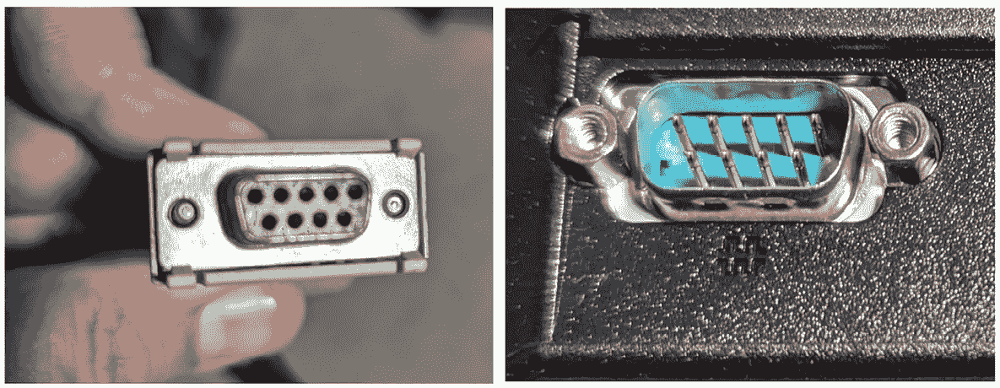
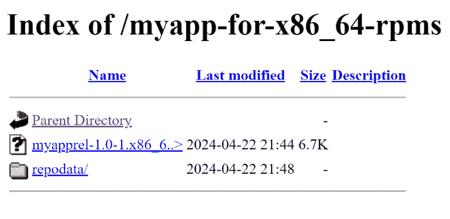
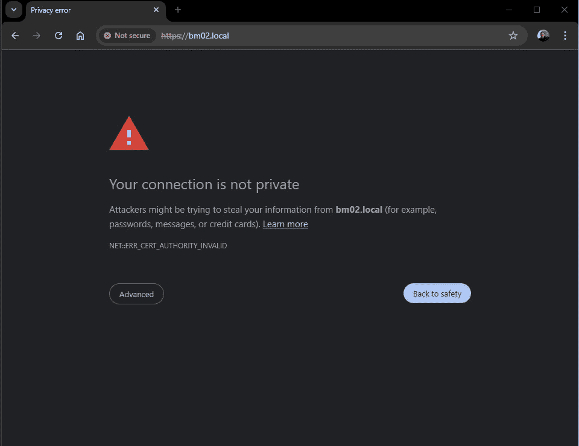
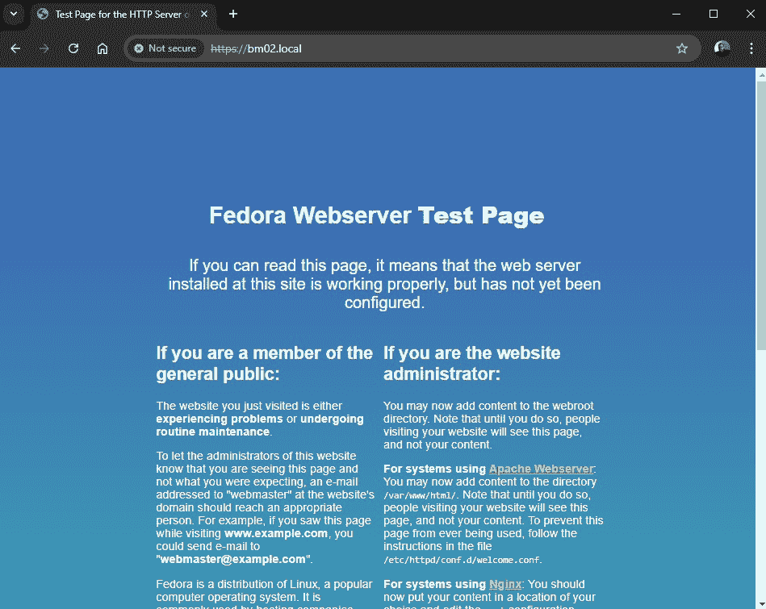
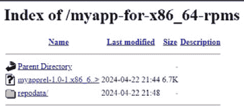
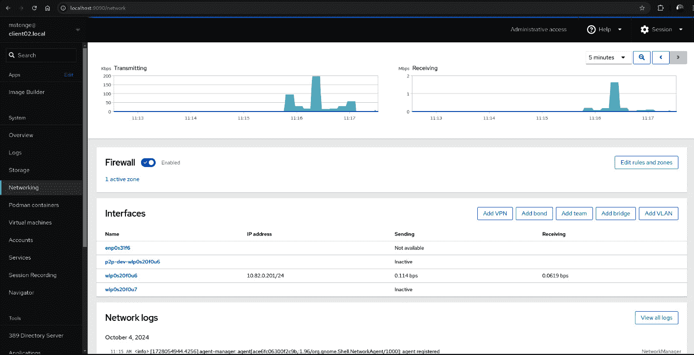
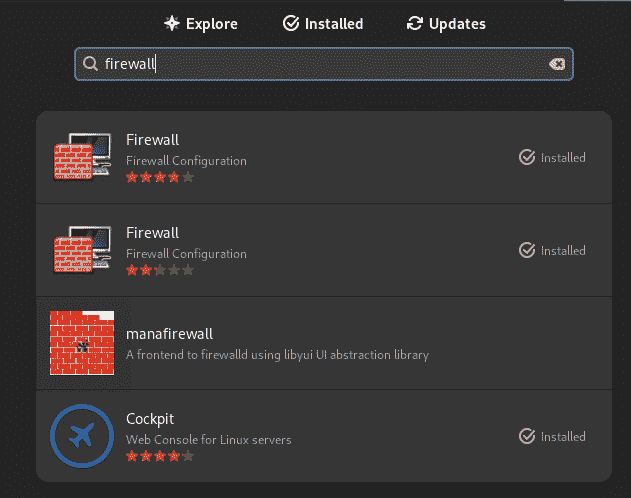
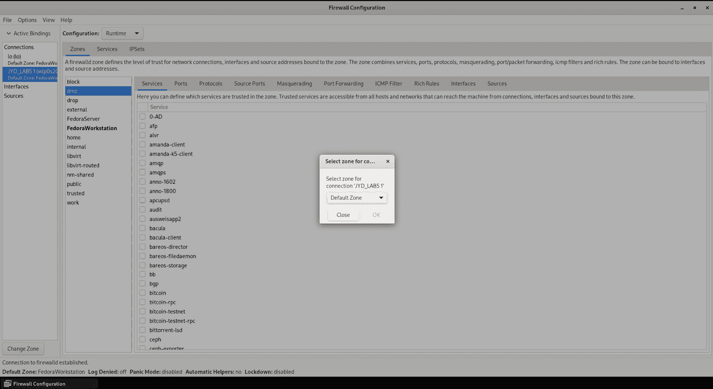

# 第十二章：我的设备的通信和交互安全吗？

可以说，唯一真正安全的计算机就是关机并锁在保险库里的那台。虽然这样没有乐趣，也没有可用性，但我们必须采取适当的措施，以限制漏洞暴露，同时确保系统能够继续执行它原本的任务。

在本章中，你将学习如何确定常用外部总线在硬件通信中的使用场景和局限性。我们将回顾防火墙网络安全。我们会通过一些实际操作来加固你基于 Web 的服务，使用 SSL 证书。我们还会深入探讨传统硬件和软件的问题，并以设备安全验证来结束本章内容。

你可能会问：“这对我的项目为什么重要？”简而言之，你可能把系统本身的安全性做好得无懈可击，但这个系统与外设或其他应用程序的连接，可能并不像你想象的那样安全。知晓即为预警。

本章的主要内容包括：

+   总线类型及其问题

+   通过证书增强安全性

+   确认你的网络是安全的

+   传统硬件和软件的限制

+   在交付前验证你的解决方案

让我们进入第一部分，看看不同的系统总线。

# 技术要求

要完成本章的练习，你需要对你之前在*第五章*中构建的自定义 DNF 仓库所在的 Web 服务器拥有 root 权限。

如果你已经删除了该服务器/工作，你需要按照之前练习中的详细说明重新建立一个新的自定义仓库服务器，然后再开始本次练习。

# 总线类型及其问题

那么，什么是**总线**呢？最简单来说，总线是一种设备与系统 CPU 之间的通信通道。通过这个通道，设备的数据信号（来自或发送到设备）可以被 CPU 处理。如果没有这条通信线路，连接的设备将无法工作。

更通俗地讲，总线可以从最少的技术术语来描述。让我们看一下整体，忽略细节。总线是硬件、软件和所需电缆的总和，它们共同允许数据传输。我举一个非技术性的童年例子。你有没有用两个锡罐和一根绳子做过通信系统？那两个罐子通过绳子连接，当绳子拉紧时，它承载了你的声音（即数据），从一个罐子（外设）传递到另一个罐子（主处理器），接收端的最终用户会解读这些声音。

**系统总线**以更为技术化的方式实现这一功能，但结果是一样的。数据从外设传输到 CPU 并被处理。对于我的超级技术读者们，请允许我更深入一点。传感器、摄像头、控制器或其他直接连接外设时，会涉及多种总线，它们的交互通过连接介质传输，最终由系统 CPU 接收和处理。有几种标准总线，但在本章中，我们将重点介绍你在嵌入式 Linux 系统工作时可能遇到的最重要的几种，具体来说就是**CAN 总线**和**USB**。在接下来的几节中，我们将重点讨论系统总线（以及标准连接类型和协议），这些总线利用外部连接到你的硬件。继续往下走时，我希望你能设想所有可能连接到你的解决方案的事物，无论是否经过你的许可。有时，正如我们在*第十章*中推测的那样，你必须几乎假设最终用户是个可能把三明治塞进录像机的婴儿。我知道提到录像机可能让人感觉自己变老了，但这样做是为了强调一个点，我希望这个点能被理解。计划最坏的情况，期待最好的结果。

会出什么问题呢？嗯，如果你的系统使用不安全的总线或外设连接，并且某个不法分子能够物理接触到该连接，它可能在你不知情的情况下被劫持（或者更糟）。当不安全连接被利用时，物理安全必须作为设计考虑和部署计划的一部分。

让我们也希望你的完美解决方案有一个定制外壳或外壳，遮住任何你不希望最终用户知道的端口。这种选项并不常见，但我觉得有必要提一下。此外，定制外壳还可以让解决方案看起来更美观。有些外壳甚至具有内置的防天气性。让你的使用场景引导你的设计。

重要提示

对于嵌入式 Linux 系统，我们假设外壳具有一定的防篡改功能，即使它只是一个警告贴纸，声明如果打开外壳则所有保修失效。因此，我们不会涉及系统硬件内部，如著名的**PCI 总线**……关于硬件和内核开发有无数相关文献，所以我们将专注于外部连接的部分。

说完这些，我们来谈谈一个家喻户晓的名字——我们都知道的总线和连接类型——**通用串行总线**（**USB**）。

## USB

自 1996 年首次推出以来，USB 接口已经成为几乎所有消费类设备的全球标准连接方式。现代 USB 端口具有如此多的多功能性（取决于设备），这也是它们在日常生活中无处不在的原因。

USB 使计算机能够连接鼠标、键盘、存储设备、打印机、游戏控制器、认证密钥以及许多其他类型的商业硬件。同一个端口还可以为一些设备如手机、平板电脑或便携电源单元充电。USB 甚至可以用来为系统添加多个显示器。

USB 在数据传输过程中并不保护你的数据。大多数人选择加密 USB 附加存储设备，但默认情况下，在访问或处理数据时，传输中的数据并没有加密。这一限制不仅限于 Linux 系统，而是所有使用 USB 框架的系统。

市面上有一些商用解决方案可以保护数据在传输过程中安全；然而，它们不是开源的，而且肯定不是免费的。它们作为企业级的数据丢失防护系统出售，支持多个平台（不仅仅是 Linux）。如果在将数据传输到 USB 存储设备时需要加密，你将需要使用这些第三方解决方案。

现在让我们进入下一部分，回顾 USB 连接。

### USB 连接器

USB 系列**连接器**多年来一直在演变，但从一开始到现在，USB-A 可能是世界上最常见的连接接口。它可以在家庭墙插座、个人电脑、笔记本电脑、外部存储设备、客机座椅背后、汽车和休闲车的仪表板、太阳能发电机、充电宝中找到，简直无处不在……（是的，我知道这语法不太对，但我真想强调的是 USB-A 是*无处不在的!!*）

USB 的讽刺之处在于，几乎所有展示的连接器至今仍然在积极使用。诚然，当前版本与旧版在所用材料的质量上有所不同，但这是为了更好地支持数据传输速度。数据线本身并不是安全问题，问题出在芯片和 USB 总线上。让我们快速看一下这些连接器类型。

在下图中，从左到右分别是 USB-B、USB-A、USB-mini、USB-micro 和 USB-C：


图 12.1 – 多年来的 USB 连接器

在思考如何比较你将遇到的各种 USB 标准版本时，我认为有必要以表格的形式展示一些关键数据，以便更易查看。尽管这些连接器可能都兼容，但不同版本的速度和吞吐量差异巨大且令人震惊。

下面是一个关于 USB 版本、性能和当前使用连接器的表格：

| **USB 版本** | **带宽** | **数据** **传输速度** | **连接器** |
| --- | --- | --- | --- |
| USB4 | 20 或 40 Gbps | 2560–5120 MB/s | C |
| USB 3.2 | 20 Gbps | 2560 MB/s | C |
| USB 3.1 | 10 Gbps | 1280 MB/s | A, C |
| USB 3.0 | 5 Gbps | 640 MB/s | A, B, C |
| USB 2.0 | 480 Mbps | 60 MB/s | A, B, Mini, Micro |
| USB 1.1 | 12 Mbps | 1.5 MB/s | A, B, Mini, Micro |
| USB 1.0 | 1.5 Mbps | 1.5 MB/s | A, B, Mini, Micro |

表 12.1 – 不同 USB 版本的速度和能力

从上表可以看出，USB 标准在过去 30 年间的广泛连接范围经历了巨大的发展。USB 已经成为游戏规则的改变者和潮流的引领者，并将在未来许多年继续发展。接下来，我们来看一下它的前身——串行总线。

## 串行端口

因为**串行端口**以其极易受攻击而闻名，自旧版 Unix 时代以来，它们一直提供文本终端访问。如今，仍有许多串行设备被每天使用。键盘和鼠标（如今通过 USB 使用）仍然是非常普遍的，并且可能也是你解决方案的一部分。串行连接依然是工程师从笔记本电脑到网络设备（如交换机、防火墙和路由器）之间常用的方式。如今，这通常需要一个适配器设备，它通过 USB 连接到工程师的笔记本电脑，然后通过串行电缆连接到要管理的设备上的串行端口。这些设备一旦连接到你的 Linux 系统，便会自动建立连接，你无需做任何操作。

串行端口（更常被称为终端端口）可以是物理的也可以是虚拟的。如今，大多数物理串行连接通过 USB 总线自动协商；然而，在旧系统上，这些设备可能使用 PS2 连接或更早的串行端口，也就是**DB9**。串行端口还可以被工业自动化系统、打印机、扫描仪和一些医疗设备使用。下图展示了串行连接的女性连接器（左）和男性连接器（右）：



图 12.2 – 串行连接器示例

Linux 系统也可以有**虚拟串行连接**。了解你的系统如何映射这些连接非常重要。那么，为什么你需要关心这个呢？这直接影响到可以同时与系统建立多少个终端会话。如果你的设备是基于控制台/文本的设备，这一指标对于其管理和控制至关重要。用最简单的术语来说，这个指标表示可以同时打开多少扇门。当这些 TTY 控制台会话对你的设备用户体验不至关重要时，它们应该尽量受到限制，而不会破坏设备的正常运行。

为了更好地了解你的系统在启动时启动了多少个 TTY 会话，这里有一个示例命令，展示了你的系统如何命名和映射这些端口。可以将每一个端口视作一个打开的门，它要么应该被锁上，要么被封住，要么只是被看守。

让我们来看看在当前系统中可以进行多少个 TTY 会话：

```

$ ls -l /sys/class/tty/*
```

这部分的输出肯定会很长，因此我已经进行了截断……你将看到的是一个详尽的物理和虚拟终端端口可能性列表。

```

     ((( output truncated )))
lrwxrwxrwx. 1 root root 0 Aug 25 09:33 /sys/class/tty/ttyS4 -> ../../devices/pci0000:00/0000:00:16.3/0000:00:16.3:0/0000:00:16.3:0.0/tty/ttyS4
lrwxrwxrwx. 1 root root 0 Aug 25 09:33 /sys/class/tty/ttyS5 -> ../../devices/platform/serial8250/serial8250:0/serial8250:0.5/tty/ttyS5
lrwxrwxrwx. 1 root root 0 Aug 25 09:33 /sys/class/tty/ttyS6 -> ../../devices/platform/serial8250/serial8250:0/serial8250:0.6/tty/ttyS6
lrwxrwxrwx. 1 root root 0 Aug 25 09:33 /sys/class/tty/ttyS7 -> ../../devices/platform/serial8250/serial8250:0/serial8250:0.7/tty/ttyS7
lrwxrwxrwx. 1 root root 0 Aug 25 09:33 /sys/class/tty/ttyS8 -> ../../devices/platform/serial8250/serial8250:0/serial8250:0.8/tty/ttyS8
lrwxrwxrwx. 1 root root 0 Aug 25 09:33 /sys/class/tty/ttyS9 -> ../../devices/platform/serial8250/serial8250:0/serial8250:0.9/tty/ttyS9
```

了解如何追踪这些连接对于维护设备安全至关重要。接下来我们来看一下另一种也使用 DB9 连接器的总线——CAN 总线。

## CAN 总线

**控制器局域网** (**CAN**) 总线是一种车辆标准。它的主要目的是控制 **电子控制单元** (**ECUs**) 之间的通信。它最早于 1983 年推出；然而，至今仍没有标准连接器，尽管 DB9 连接器今天似乎已经成为事实上的标准。

由于如今的汽车正变成滚动的数据中心（即使是非自动驾驶的汽车），我觉得有必要提到这种总线类型，因为许多制造商正在跃跃欲试，准备在这一不断发展的领域中构建嵌入式系统。

然而，CAN 并不限于汽车。CAN 总线架构可以在海事环境、农业设备，甚至是大型建筑中用于控制电梯、自动扶梯和其他建筑自动化系统中看到。它甚至被现代机器人技术所利用。

可惜，CAN 没有加密功能。请保持警惕，留意这个问题。CAN 的另一个问题是缺乏身份验证。这意味着，最终，任何能够访问总线的人都能控制总线。所有的安全性都将被放弃。会发生什么不好的事情呢？

有一个专门的社区致力于破解汽车的控制系统。大多数参与这项活动的人，目的是从自己的车辆中挤出更多的性能。没有恶意，只是工程师的好奇心。不过，恶意行为者很容易访问到汽车的锁、GPS 记录或控制系统，甚至可能进行其他恶意活动。

另一个因素，像 USB 和串口一样，缺乏加密意味着任何通过总线传输的凭证都是以明文方式传输的。任何监控总线流量的人都可以看到这些数据，并可能利用它做一些不太友好的事情。

随着越来越多的车辆依赖电子设备来创造更好的驾驶体验，大家都希望 CAN 标准本身能在下一个版本中加入一些急需的安全功能。

接下来我们来讨论设置加密时的一个关键组件——创建证书。

# 使用证书增强安全性

**证书**被用于全球许多安全通信领域。你的硬件和软件供应商通常会为他们的驱动程序和操作系统包进行数字签名。受信任的机构使用证书来确保你可以安全地使用 DNS 和互联网。证书的使用案例非常广泛。通常，这些安全证书是通过全球 **证书颁发机构** (**CA**) 获得的。许多互联网服务提供商（ISP）也能够为他们的客户颁发 SSL 证书。

这些共享的系统证书使得像 NSS、TLS、OpenSSL 以及应用程序等能够通过系统证书（信任锚）共享信任源。没有 SSL 证书将阻止你使用加密的 Web 服务器。

在 Linux 中也可以创建自签名证书。这些证书通常足够用于内部实验室工作，但在生产环境中被认为不足够，绝对不适合用于你的产品。

在思考在哪里展示一个适合实验室或演示用途的例子时，我想到这个问题：“我们可以在哪些地方考虑使用证书？你的 DNF 仓库服务器？”

让我们通过一些动手练习来探索这个思路。

## 练习 1：创建一个自签名证书

在这个动手练习中，我们将创建一个自签名证书，可能用于加密一个 Web 服务器。让我们开始：

1.  首先，我们将验证网络服务器是否按之前在*第五章*中配置的方式托管我们的仓库。

    ```

    $ sudo systemctl status httpd.service
    ● httpd.service - The Apache HTTP Server
         Loaded: loaded (/usr/lib/systemd/system/httpd.service; enabled; preset: disabled)
        Drop-In: /usr/lib/systemd/system/service.d
                 └─10-timeout-abort.conf
         Active: active (running) since Sun 2024-10-06 17:53:55 EDT; 2min 43s ago
           Docs: man:httpd.service(8)
       Main PID: 1215 (httpd)
         Status: "Total requests: 1; Idle/Busy workers 100/0;Requests/sec: 0.00617; Bytes served/sec:  12 B/sec"
          Tasks: 178 (limit: 38323)
         Memory: 21.2M (peak: 22.4M)
            CPU: 225ms
    CGroup: /system.slice/httpd.service
                 ├─1215 /usr/sbin/httpd -DFOREGROUND
                 ├─1294 /usr/sbin/httpd -DFOREGROUND
                 ├─1295 /usr/sbin/httpd -DFOREGROUND
                 ├─1296 /usr/sbin/httpd -DFOREGROUND
                 ├─1297 /usr/sbin/httpd -DFOREGROUND
                 └─1298 /usr/sbin/httpd -DFOREGROUND
     Oct 06 17:53:55 bm02.local systemd[1]: Starting httpd.service - The Apache HTTP Server...
    Oct 06 17:53:55 bm02.local (httpd)[1215]: httpd.service: Referenced but unset environment variable evaluates to an >
    Oct 06 17:53:55 bm02.local httpd[1215]: Server configured, listening on: port 443, port 80
    Oct 06 17:53:55 bm02.local systemd[1]: Started httpd.service - The Apache HTTP Server.
    ```

重要提示

你需要替换成你为系统配置的主机名或 IP 地址。

1.  确认服务通过浏览器托管了你的仓库。



图 12.3 – 通过浏览器验证你的仓库

1.  我们现在将开始设置环境，首先设置一个系统变量。在这一步中，将`<hostname>`替换为你系统的 FQDN。作为 root，执行以下命令。

    ```

    .pem file, which will store your certificate information.

    ```

    .pem 文件。

    ```

    # ls -l *.pem
    EmbeddedBook as the challenge password at the end. Please feel free to use your own challenge password (but do make a note of it for later). As root, run the following command:

    ```

    # openssl req -new -key ${ssl_name}.pem -out ${ssl_name}.csr

    ```

    Let’s see the interactive prompts/output:

    ```

    你即将被要求输入一些信息，这些信息将被纳入

    输入到证书请求中。

    你即将输入的内容被称为“区分名称”或 DN。

    有很多字段，但你可以留空某些字段

    对于某些字段，将有默认值，

    如果你输入'.'，该字段将留空。

    -----

    国家名称（2 个字母代码）[XX]：US

    州或省名称（全名） []：MA

    本地名称（例如，城市）[默认城市]：威尔明顿

    组织名称（例如，公司）[默认公司有限公司]：嵌入式安全书籍

    组织单位名称（例如，部门） []：开发

    通用名称（例如，你的名字或服务器的主机名） []：bm02.local

    电子邮件地址 []：admin@bm02.local

    请按要求输入以下“额外”属性

    将随证书请求一起发送

    挑战密码 []：嵌入式书籍

    .csr 文件正确。

    ```

    # ls -l *.csr
    -rw-r--r--. 1 root root 1850 Aug 25 21:22 bm02.local.csr
    ```

    这个 CSR 文件是你在申请企业 SSL 证书时会发送给 CA 的文件。我们也可以利用这个文件在本地创建一个临时的自签名证书。

    ```

    ```

    ```

    ```

1.  让我们创建一个有效期为 90 天的临时证书。

    ```

    # openssl x509 -req -days 90 -in ${ssl_name}.csr \
    -signkey ${ssl_name}.pem \
    -out ${ssl_name}.cert
    ```

    你的输出应该类似于以下内容：

    ```
    Certificate request self-signature ok
    <hostname> with your system’s hostname. Mine is shown just for example purposes.

    ```

    # ls -l *<hostname>*

    ```

    Your output should contain at least the files shown that are identified by your system’s hostname.

    ```

    -rw-r--r--. 1 root root 2110 8 月 25 21:30 bm02.local.cert

    -rw-r--r--. 1 root root 1850 8 月 25 21:22 bm02.local.csr

    -rw-------. 1 root root 3272 8 月 25 21:12 bm02.local.pem

    ```

    ```

哇，难道这不简单吗？！你现在已经创建了第一个自签名的服务器证书。除非没有其他方式来保护你的网络服务，否则请永远不要在生产环境中使用这个证书。现在我们已经创建了证书，让我们在下一个练习中将它应用到实际的网络服务中。

## 练习 2：将证书添加到自定义仓库服务器

在本练习中，我们将把之前创建的自签名证书安装到你之前搭建的 web 服务器中，用来托管你自定义的 DNF 仓库。完成后，web 服务器将默认使用 HTTPS 协议，而不是之前的默认 HTTP 协议。协议的更改意味着你还需要确保防火墙规则已经更新。我们开始吧。

1.  以 root 用户安装 `mod_ssl`。

    ```

    # dnf install -y mod_ssl
    ```

    你的输出可能很长，但它应该大致像这样——我已将输出截断以节省空间。

    ```
    ((( truncated output )))
    Running transaction check
    Transaction check succeeded.
    Running transaction test
    Transaction test succeeded.
    Running transaction
      Preparing        :                               

               1/1
      Installing       : mod_ssl-1:2.4.62-2.fc40.x86_64

               1/1
      Running scriptlet: mod_ssl-1:2.4.62-2.fc40.x86_64

               1/1
    Installed:
      mod_ssl-1:2.4.62-2.fc40.x86_64
    .cert file (mine is shown as an example).

    ```

    将 .pem 文件放到正确的目录。记得替换成你自己的 .pem 文件（我的文件作为示例）。

    ```

    .pem file to an additional directory. Remember to substitute your own .pem file (mine is shown as an example).

    ```

    /etc/httpd/conf.d/ssl.conf 文件以 root 用户身份编辑。按照指示取消注释并编辑相应行。完成修改后，保存并退出编辑器。

    ```

    443.
    ```

    ```

    ```

    ```

    ```

```
#ServerName www.example.com:443
ServerName bm02.local:443
```

1.  将这一行更改为你自己的 CRT 文件——我的文件作为示例。

```
SSLCertificateFile /etc/pki/tls/certs/localhost.crt
SSLCertificateFile /etc/pki/tls/certs/bm02.local.cert
```

1.  将这一行更改为你自己的 PEM 文件——我的文件作为示例。

```
SSLCertificateKeyFile /etc/pki/tls/private/localhost.key
.pem file – mine is shown for example.

```

#SSLCertificateChainFile /etc/pki/tls/certs/server-chain.crt

以 root 用户身份运行 httpd 服务并进行测试。以下命令以 root 用户身份运行。

```

httpd service is running as expected.

```

# systemctl status httpd

```

Your output should resemble something like this:

```

● httpd.service - Apache HTTP 服务器

已加载: 加载 (/usr/lib/systemd/system/httpd.service; 启用; 预设: 禁用)

Drop-In: /usr/lib/systemd/system/service.d

└─10-timeout-abort.conf

活跃状态: 活跃（运行中），自 2024 年 8 月 25 日 22:14:15 EDT 起，已运行 8 秒

文档: man:httpd.service(8)

主进程 PID: 4907 (httpd)

状态: "已启动，监听端口：443，端口 80"

任务: 178（限制: 38323）

内存: 16.2M（峰值: 17.8M）

CPU: 115ms

CGroup: /system.slice/httpd.service

├─4907 /usr/sbin/httpd -DFOREGROUND

├─4908 /usr/sbin/httpd -DFOREGROUND

├─4909 /usr/sbin/httpd -DFOREGROUND

├─4910 /usr/sbin/httpd -DFOREGROUND

├─4911 /usr/sbin/httpd -DFOREGROUND

└─4912 /usr/sbin/httpd -DFOREGROUND

2024 年 8 月 25 日 22:14:15 bm02.local systemd[1]: 正在启动 httpd.service - Apache HTTP 服务器...

2024 年 8 月 25 日 22:14:15 bm02.local (httpd)[4907]: httpd.service: 引用但未设置的环境变量被解析为 e>

2024 年 8 月 25 日 22:14:15 bm02.local httpd[4907]: 服务器配置完成，监听端口：443，端口 80

https）。由于我们使用了自签名证书，浏览器肯定不喜欢它，并且会要求你确认是否要继续访问该网站。某些浏览器比其他浏览器更宽容（无论它们运行在哪个操作系统上）。在浏览器窗口中确认你希望继续，点击 `https` 并接受自签名证书。

                    

            图 12.4 – 因为自签名证书而出现的 SSL 警告

            如果一切按计划顺利进行，您应该能够访问到新加密的 Web 服务器，页面应该如下所示：

                    

            图 12.5 – HTTPS 主要测试页面

                1.  现在让我们测试仓库 URL。记得在 URL 中使用 HTTPS（而不是 HTTP）。您可能会看到相同的 SSL 证书警告。继续并确认它是安全的（替换为您自己的 URL——这里再次使用的是我的 URL 作为示例）。

                    

            图 12.6 – 我们自定义的 DNF 仓库现在使用 HTTPS !!!

            现在，我们已经完成了自签名证书的创建，并使我们的自定义 DNF 仓库启用了 SSL，在结束之前，我想再给你们一个需要考虑的事项。

            如果您的解决方案将使用 HTTPS，请在界面中提供一种方式，让最终用户可以点击按钮，自动执行此过程。更好的是，在界面中加入让设备自动从 CA 获取密钥和证书的选项。这些工作与*第十章*中讨论的防篡改和用户体验主题相一致。我们应该始终致力于为最终用户提供积极的用户体验。

            在本节中，我们通过加密和证书确保了 HTTPS 服务的安全性。接下来我们将进入下一节，回顾用于保护您的设备服务和端口实际网络连接的工具。

            确认您的网络是否安全

            几乎所有机器在某种程度上都会与其他机器进行通信。在嵌入式 Linux 系统领域，这一点并不总是成立。某些设备仅仅是独立解决方案，没有连接到任何网络。在其他使用案例中，它们可能所在的安全环境要求它们位于一个严格限制的局域网段，只有有限的对其他系统的访问权限，且完全无法访问互联网或企业的其他网络段。

            网络配置和安全化是基本 Linux 系统管理的一部分。但我们并不是设计要部署在自己数据中心或网络中的系统。我们在构建将部署在客户生态系统中的产品，不论这种部署需要何种级别的安全性。我们的客户已将信任和责任交给我们，确保我们交付给他们的产品已经过锁定并安全可靠。很多时候，这比他们有限的员工可能具备的技能要好。这也是他们购买你解决方案的原因。

            在接下来的几个模块中，我们将简要介绍我真心希望你已经了解的命令行和图形工具。我的理由直白且简单：使用适合你的团队、环境和公司构建链风格的工具。我实际上希望这一部分对你来说是多余且不必要的。如果它能稍微帮上一点忙，那就更好了。接下来，让我们快速回顾一下如何通过使用工具来为我们的设备（稍微）做好迎接新家准备，确保在下一部分的防火墙章节中可以控制哪些流量能够通过。

            防火墙

            这是一个关于 Linux 防火墙主要设置组的快速概览：

                +   **连接**：这是一个定义好的*命名*网络连接。

                +   **区域**：一个 firewalld 区域是你可以利用的预定义信任级别。

                +   **接口**：这个很简单明了。它是你计划应用新设置的接口。

                +   **服务**：这些是可以使其可访问的预定义服务。预定义服务在配置过程中大有帮助，因为记住每个服务与端口的映射关系，以及它是 UDP 还是 TCP，都可能让人头大。

                +   **端口**：这是快速定义多个端口或端口范围使其可访问的一种方式。

                +   **配置**：你正在编辑的配置有两种可能的状态——**运行时**和**永久性**。运行时状态的更改在重启或重启**firewalld**服务后会丢失。

                +   **IPSets**：这些是你可以管理和轻松部署的白名单或黑名单。

            有几种不同的方式可以配置 Linux 防火墙（firewalld）。让我们浏览一些示例。

            命令行

            管理防火墙的命令行工具在你构建新系统时几乎总是会预装。我们在这里重点介绍的主要工具是**firewall-cmd**。正如你从*大幅缩减*的所有可能设置列表中看到的，firewall-cmd 是一个功能丰富的工具集。它也可以轻松地编写脚本。

            对于所有选项的示例，可以在终端中运行以下命令。

```

$ firewall-cmd --help
```

            那个命令的输出内容相当长。我建议你在自己的机器上研究它，将输出结果通过管道传输给 `more` 或 `less` 命令，然后分页浏览。

```

Usage: firewall-cmd [OPTIONS...]
General Options
  -h, --help        Prints a short help text and exits
  -V, --version     Print the version string of firewalld
  -q, --quiet       Do not print status messages
Status Options
  --state           Return and print firewalld state
((( output truncated )))
Options to Handle Bindings of Sources
  --list-sources    List sources that are bound to a zone
                    [P] [Z]
  --add-source=<source>[/<mask>]|<MAC>|ipset:<ipset>
                    Bind the source to a zone [P] [Z]
  --change-source=<source>[/<mask>]|<MAC>|ipset:<ipset>
                    Change zone the source is bound to [Z]
  --query-source=<source>[/<mask>]|<MAC>|ipset:<ipset>
                    Query whether the source is bound to a
                    zone [P] [Z]
  --remove-source=<source>[/<mask>]|<MAC>|ipset:<ipset>
                    Remove binding of the source from a
                    zone [P] [Z]
Helper Options
  --new-helper=<helper> --module=<module> [--family=<family>]
                    Add a new helper [P only]
  --new-helper-from-file=<filename> [--name=<helper>]
                    Add a new helper from file with optional name [P only]
  --delete-helper=<helper>
                    Delete an existing helper [P only]
  --load-helper-defaults=<helper>
                    Load helper default settings [P only]
  --info-helper=<helper> Print information about an helper
(((output truncated)))
Lockdown Options
  --lockdown-on      Enable lockdown.
  --lockdown-off     Disable lockdown.
  --query-lockdown   Query whether lockdown is enabled
Lockdown Whitelist Options
  --list-lockdown-whitelist-commands
                     List all command lines that are on the
                     whitelist [P]
  --add-lockdown-whitelist-command=<command>
                     Add the command to the whitelist [P]
(((output truncated)))
Panic Options
  --panic-on         Enable panic mode
  --panic-off        Disable panic mode
  --query-panic      Query whether panic mode is enabled
```

            命令行是设置防火墙参数最强大、最灵活的方式，但说实话，掌握它需要一点技巧。这种方法是全球系统管理员的首选，因为它可以编写脚本并轻松重复。正是脚本化的便利将大大帮助你的团队，在用户看不见的后台实现这些功能。

            让我们来看看其他一些配置防火墙的替代方式。

            Web 控制台

            **网络控制台**在过去几年里快速发展，逐步将其基础的系统管理员功能扩展到创建系统镜像或管理容器和虚拟机等方面。网络控制台的进一步增强降低了其他平台管理员对 Linux 系统管理的门槛，尤其是当他们的技能来源于其他平台时。

            这是一个展示在 Fedora 40 上运行的网络控制台（即 Cockpit）的截图。在**网络**子菜单下，我们可以轻松修改防火墙规则，并配置连接和其他网络设置。

                    

            图 12.7 – 通过网络控制台配置防火墙

            网络控制台非常适合在实验室或数据中心环境中配置您的系统；然而，我强烈建议避免终端用户在您的设备上使用它，因为执行大多数任务需要管理员权限……而现在我们又回到了防护措施的讨论。接下来，我们将快速回顾防火墙的图形用户界面工具。

            基于图形用户界面的工具

            在 Fedora（以及大多数 Linux 发行版）中，实际上有多个图形防火墙配置工具。任何工具都可以通过 gnome-software 应用程序或命令行进行安装。这些工具使得配置和管理防火墙比尝试记住命令行中成千上万的选项要容易得多。

            请注意，当您搜索管理防火墙的工具时，gnome-software（Gnome 桌面中的应用商店）也会提供网络控制台（Cockpit）作为一种解决方案。

                    

            图 12.8 – 通过 gnome-software 图形界面搜索软件

            这是防火墙管理图形用户界面的截图，展示了它在 Gnome 桌面环境下运行的样子。

                    

            图 12.9 – 防火墙图形用户界面

            我对这些基于图形用户界面的防火墙工具的态度与网络控制台相同。它们在数据中心和实验室中很有用，但我不会让任何设备的终端用户访问它们。永远不会。真的。

            如果您的设备提供可能需要终端用户打开额外端口的服务，您应该自动化并将所有可能需要终端用户具有 root 权限的功能集成到您的界面中——就像我们在*第十章*中深入讨论的那样。这不仅仅是防篡改。您应该把它当作是未来-proofing，或者更好的是，增强用户体验。

            说实话，没人会在乎你用了哪些工具或没用哪些工具来配置你的设备。这里我们从配置防火墙转到确认你认为已配置的内容是否就是设备的实际状态。再次提醒你那句老话，*信任，但要验证*。信任你团队的努力，但要验证你认为自己已配置的内容是否与设备的实际状态一致。我强烈建议在适当的地方进行自动化处理，但要确保依然有人工接触设备、人工检查设备，并且每个单元的所有操作都要有文档记录。

            让我们继续讨论在构建或升级周期结束时应始终严格执行的活动。让我们回顾一下如何验证你的解决方案。

            遗留硬件和软件的局限性

            这里我觉得有必要传达一些坏消息。你可能无法总是选择你的解决方案所使用的硬件、连接方式或总线。解决方案的长期可维护性可能迫使你和你的团队实现某些不理想的设计，以保持向前和向后兼容性（一个典型的例子就是 CAN 总线）。

            如果没有一个普遍的做法来淘汰对极其老旧或不支持芯片组的驱动程序支持，老旧的遗留硬件可能不会那么糟糕。这意味着你可能被迫使用不受支持的驱动程序，这些驱动程序可能不包含在操作系统中，可能已经很久没有更新，或者来自不可靠的来源。不受支持的驱动程序（软件）也可能意味着有一些风险和漏洞没有得到解决。这是一个定时炸弹。

            一个加重的问题是，较新的操作系统往往需要更新的组件。似乎每发布一个新的 Linux 版本（无论是哪个发行版），我们就能获得更多的功能和能力。这些新的花里胡哨的功能都有一个代价——需要更新、更强大的硬件。

            为什么使用最新的硬件和软件很重要？这里有一个现实的例子：大多数汽车，除非发生灾难性事故，否则通常可以在路上行驶多年，甚至超出其计算机子系统的正常生命周期。这只是无数可能性中的一个例子。

            安全从设计阶段开始，但这并不意味着你总是能选择到最好的组件（硬件或软件）。要记住，总会有一些限制。

            在交付前验证你的解决方案

            在我们尽可能确保解决方案安全的过程中，仍然有一些关键活动必须完成，才能让你自信地交付解决方案。这些活动应视为不可妥协的，忽视它们后果自负。

            首先是合规集成和测试，你需要确认你的设备是否符合或超出了可能适用于它使用领域的任何政府或行业标准。我认为这是一个至关重要的主题，整个下一个章节将专门讲解这一部分内容。

            其次，**渗透测试**（也称为**渗透测试**）通过第三方可以让你安心，并深入了解任何你可能忽略的细节。在这种情况下，专业的道德黑客（承包商）将利用所有行业工具，试图获取未经授权的访问权限或降低设备的可用性。通过这种测试将是你团队成功和你产品未来前景光明的证明。

            让我们继续进行章节总结。

            摘要

            你的解决方案所附带的内容以及它与之通信的对象绝对重要。这些通信也将决定需要主动解决的安全问题。在本章中，我们介绍了一组你最有可能遇到的关键总线和连接类型，以及它们的独特应用场景。随着内容的推进，我们审视了一个关键的安全措施集——你的防火墙和网站流量加密。这些活动需要特别关注细节。本章中获得的知识应使你和你的团队能够为此类连接风险做好准备并进行设计。最后，我们通过一个简单的提醒结束本章，你可能需要考虑向前和向后兼容性问题，这将影响你的安全配置。

            再次感谢你继续和我一起走这段旅程。在接下来的章节中，我们将深入探讨如何将安全标准应用到我们的解决方案中。

```

```

```

```
