# 第十三章：应用政府安全标准 – 系统加固

无论你的团队是试图通过增强安全性为你的产品提供竞争优势，还是你的客户群体（即政府、军队或其他公共部门客户）对所有系统有合规性要求，应用一个或多个政府安全标准通常都不是一项简单的任务。

对于这一层次的合规性，你必须基于已接受和认证的操作系统构建解决方案。显然，这一合规性要求将把大多数社区发行版排除在外，正如我们在*第二章*中所讨论的那样。在这个领域，符合要求的 Linux 操作系统列表非常短暂。你可以用一只手指数出这个领域的参与者（或许还能剩下几根手指）。这并不是贬低任何发行版，无论是社区版还是商业版。这个过程冗长、昂贵，并且毫无疑问，对于大多数人来说可能非常令人沮丧。很少有发行版拥有资源与 NIST 一同完成这一过程。

对你来说，好消息是经过认证的 Linux 操作系统的列表正在扩大，但很少有操作系统能够与**Red Hat**® **Enterprise Linux**®（**RHEL**）相媲美，它遵循广泛的政府认证和标准，并且被视为美国政府领域 Linux 的事实标准。这个领域的其他几个参与者通常是 RHEL 的克隆或衍生版本，唯独 Ubuntu®是最受欢迎的 Debian Linux 变种。

在这个过程中，我们将探索的另一个因素是额外的工具，这些工具使得遵循这些安全标准的艰巨任务成为可能。**安全内容自动化协议**（**SCAP**）可以说是最常见的自动化应用集安全措施的标准（也就是 SCAP 服务器配置文件），用于系统或应用堆栈。实施这些配置文件的实际过程需要工具支持。这正是开源工具再次发挥作用的地方。OpenSCAP 项目提供了广泛的工具。许多 Linux 发行版在其安装程序和软件仓库中都包括这些工具包。SCAP 定义为应用安全标准和修复提供了一种行业标准的方式。无论你试图应用什么安全标准，它们都是实现合规性的“高速公路”。在本章中，我们将通过实例展示如何应用美国服务器安全的两个最常见标准——FIPS 140-3 和通用的**STIG**（即**安全技术实施指南**）。

本章的主要内容包括：

+   遵守美国政府的关键标准

+   我该如何实现这一点？

+   我该如何认证我的解决方案？

让我们进入下一个部分，详细讨论你可能需要完成本章练习的相关细节。

# 技术要求

在本章的实践练习中，你将需要两台 RHEL 9.4（或更新版本）机器（可以是物理机或虚拟机），并且它们都应该是干净的安装。我们将在练习中一起完成其中一台机器的安装。

为了实现这一点，你需要访问一个 Red Hat® 账户（开发者账户或生产账户）、安装介质、Fedora® 媒体写入工具，以及能够在这两台机器上安装/重新安装操作系统的能力。

此外，你需要能够从第三方或政府网站下载并安装额外的包。STIG Viewer 工具可以安装在 Windows® 或 Linux 系统上。你也需要这个工具，但它不必专门安装在你的实验室机器上。可以查看本书的 GitHub 仓库以获取有用的链接：[`github.com/PacktPublishing/The-Embedded-Linux-Security-Handbook/blob/main/Chapter11/Resource_Cheat_Sheet.pdf`](https://github.com/PacktPublishing/The-Embedded-Linux-Security-Handbook/blob/main/Chapter11/Resource_Cheat_Sheet.pdf)。

让我们继续讨论*为什么*遵守安全标准可能很重要。

# 遵守美国政府关键标准

很多人寻求将他们的解决方案维持在比要求的标准更高的水平。很多人会同意我的看法；我赞赏这种对安全的承诺以及超越最低要求的精神。通过这样做，他们可以轻松地将自己的解决方案与任何竞争对手的解决方案区分开来。为什么？因为如果解决方案符合美国军方或某些三字母机构的苛刻安全标准，那么它一定足够好。嗯，应该是这样理解的。

继续这个思路，我想强调的是，通过在特定行业中超越最低要求（或通常认为的标准），你可以有效地在目标社区内建立信任。通过提高自己和产品的标准，你最终会提前（且非正式地）为他人设定一个新的标准，促使他们去努力达到这个标准。这将使你的客户的审计工作变得更加轻松，他们一定会感激这种减少压力的合规工作。

遵守政府标准，即使不是特别要求，也可以让潜在客户在选择你的解决方案时更加安心。客户的审计人员也可能会感谢他们在选择你的产品时进行了更多的尽职调查。这对每个人来说都是双赢的局面。你团队的额外努力将大大促进你产品的广泛采用。

除了信任和安心外，减少一个客户网络上的系统也为他们带来了好处。我向你保证，他们也一定会对此表示感激。

然后是另一面。当合规性由于客户群体的要求而被强制执行时，你的团队将面临重重任务。无论你的产品在需求空间中处于何种位置，产品越安全，所有相关方的结果就会越好。

让我们回顾一下*第二章*中的早期讨论，当时我们确定了最重要的因素：你的目标客户群体的合规性需求。也许你的产品面向多个行业领域。

如果你的用户群体位于政府部门，那么你的产品最好能展现出*最佳表现*。未能遵守政府基础设施中对任何系统施加的适用标准，将导致你的解决方案无法被采纳。

政府只是一个需要关注细节的行业领域。医疗保健和金融服务也有自己的监管安全标准（尽管与政府/军事标准差异不大）。

无论你销售的行业领域和部门是什么，从合规性角度拉宽网格都是一种聪明的做法。此外，我觉得如果我没有提到这一点就结束，那就是许多安全标准在多个行业之间存在大量重叠。

让我们更重要地讨论如何成功地将这些标准应用到我们的解决方案中。

# 我该如何实施这一点？

问题*我该如何实施这一点？*并没有单一的答案。真实的回答是*这很复杂*。维持合规性有许多接触点。它从设计桌开始，在那里你必须确定哪些标准会影响整体解决方案。有些人可能会认为，大量的研究时间是花费最多时间的部分。我不同意。我相信（并且我猜你很快也会这么认为）从发布到发布，长时间保持合规性，远远比最初在产品中实施这些措施更加繁重。

这里面也有一个陷阱。保持合规性并不是一次性完成的过程。做好心理准备，因为接下来会有一些挫折。设置服务器配置文件，无论是在安装期间还是之后，都不是终点，而是起点。每次对配置进行更改时，无论大小，你都必须重新扫描并确认合规性。这一维护和测试过程可能相当繁琐，但它是必要的。

接下来的几个部分中，我们将探讨如何在产品的生命周期中实施并维持标准合规性。

## 安全标准的实施

安全性从设计阶段开始，但安全措施的实施和维护才是真正的关键所在。关注最细微的细节，可能会在保护你的产品免遭破坏上产生决定性的作用。我们为什么要这么做（好像我们需要提醒一样）？永恒的风险缓解。

我们首次涉足实施安全标准的工作从 Linux 安装程序开始。

近年来对一些安装程序的改进，确实让这一过程对实施者来说变得更容易。但正如我之前所说，这只是你和你的团队所投入的长期承诺的开始。

### 在安装时利用 RHEL 服务器配置文件

RHEL 安装程序 Anaconda 具有让最终用户选择预定义 SCAP 安全指南服务器配置文件的能力。这些服务器配置文件代表了多个政府机构和行业标准。在安装时利用其中之一，可以大大加速确保系统符合相关标准的进程。这并不意味着在完成服务器设置后，它就 100%符合标准。你仍然需要在后续的质量检查过程中确认合规性。

你可以在 Anaconda 安装过程中选择多个 SCAP 配置文件（或其他标准）中的一个。再次感谢那些开发者，他们花时间使这一繁琐的过程变得更加简单。

对于那些好奇有哪些配置文件被包含的朋友，不必再等了。最近，几乎所有主要 Linux 发行版的公开共享 SCAP 配置文件的主列表已移至 GitHub，可以通过这个链接找到：[`complianceascode.github.io/content-pages/guides/index.html`](https://complianceascode.github.io/content-pages/guides/index.html)。RHEL 9 安装程序中包含的 SCAP 配置文件列表相当广泛。以下是安装程序中包含的一些配置文件的简短列表：

+   法国信息系统安全国家局（ANSSI BP-028）定义的各种安全级别（低、中、高和增强）

+   西班牙**国家密码中心**（**Centro Criptológico Nacional aka CCN**）定义的各级服务器安全级别

+   各种 CIS 基准级别

+   草案版非机密 FIPS 标准（NIST 800-171）

+   **澳大利亚网络安全中心**（**ACSC**）基本八项

+   ACSC ISM 官方标准

+   **健康保险可携带性与责任法案**（**HIPAA**）

+   通用操作系统的保护配置文件

+   PCI-DSS 版本 3.2.1 控制基准

+   **国防信息系统局**（**DISA**）**STIG**针对 RHEL 9 Server 和带 GUI 的 RHEL 9 Server

以下是浏览 RHEL 9 安装过程中可用 SCAP 配置文件的广泛列表时拍摄的截图。在单个截图中不可能显示所有内容。

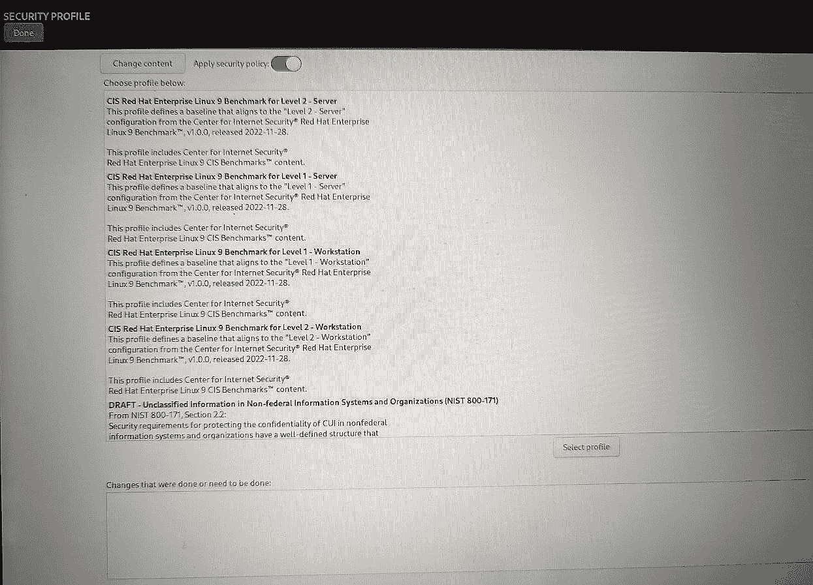

图 13.1 – 在 RHEL 安装程序中选择服务器配置文件

### 在 RHEL 中启用 FIPS 模式

自几年前开始初步开发以来，RHEL 9 一直专注于 FIPS 140-3 标准。Red Hat 已经确定，如果尝试将 FIPS 140-3 添加到已获得 FIPS 140-2 认证的 RHEL 8 中，所需的重构工作量过大，而且由于该操作系统处于生命周期的最后五年，因此这种努力是不可行的。在 RHEL 发布的最后五年里，操作系统通常处于维护模式，不再引入新功能，但会继续进行安全和错误修复。

构建 FIPS 合规的系统从安装时开始，通过将安装程序置于 FIPS 模式来实现。这一步非常简单，只需在系统启动过程中编辑一行。在安装过程中，在安装程序的启动内核选项中附加 `fips=1` 到内核行。

这是我在 GRUB 中设置内核启动选项的截图，以便让安装程序以 FIPS 模式启动：

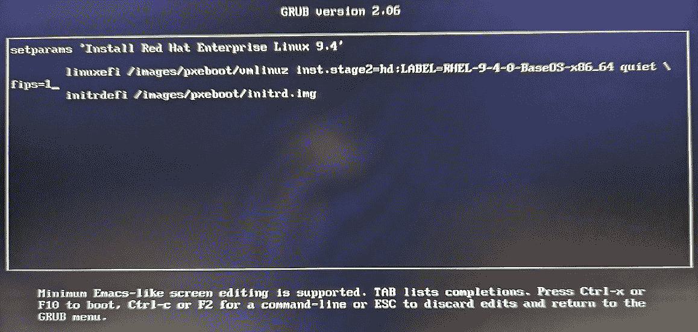

图 13.2 – 配置安装程序以 FIPS 模式启动

让系统更接近 FIPS 合规性的下一个步骤是在安装过程中选择 FIPS SCAP 服务器配置文件。

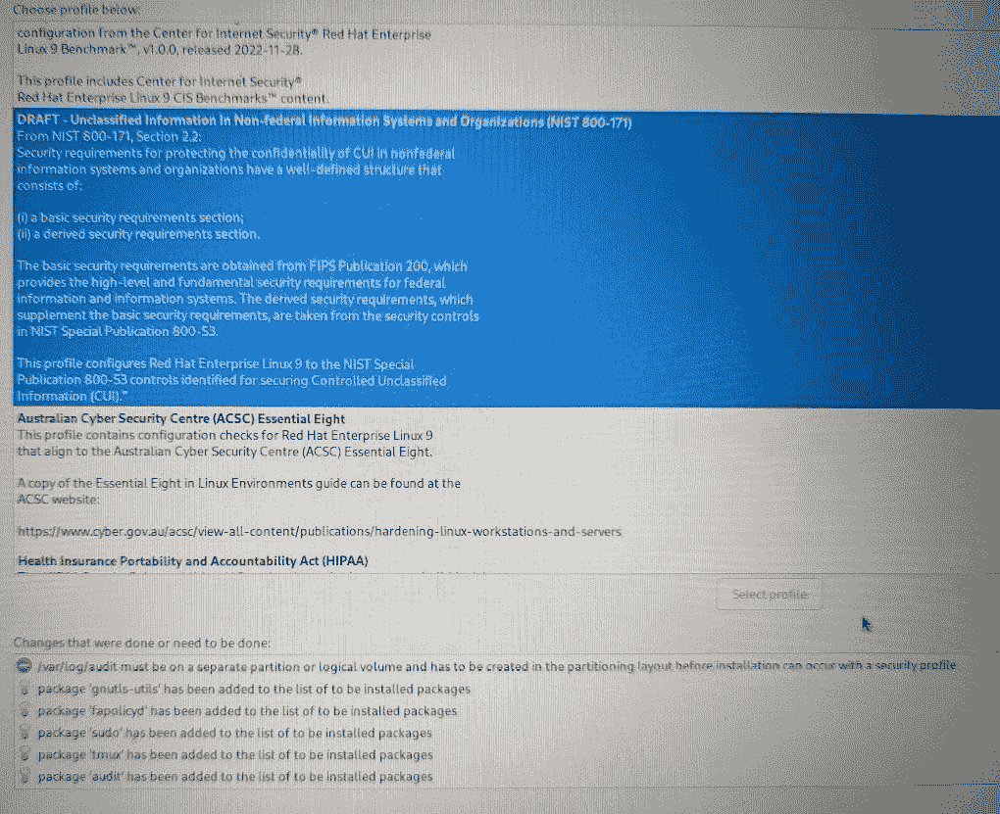

图 13.3 – 安装过程中选择 FIPS 服务器配置文件

如果你像我一样（注重细节）并希望再次检查你的工作，你也可以在安装后配置 FIPS 合规模式。系统发生任何更改后，都需要进行此过程。

让我们看一个通过命令行在安装后强制启用 FIPS 模式的配置示例。这本身就是企业发行版（如 RHEL）如何简化复杂标准遵循的一个明显例子。在这种情况下，您可以以 root 用户身份运行以下命令：

```

#  fips-mode-setup
```

输出可能非常长，晦涩且冗长。你可以根据自己的需求在实验室中进行尝试。

现在，我们可以查看在执行系统扫描之前验证 FIPS 模式的几个步骤。这些步骤并没有特定的顺序，但我认为所选顺序看起来有一定的逻辑性。

通过在实际启动 Linux 之前检查内核启动选项，确保已设置 FIPS 支持的内核启动选项。然而，这并不保证已完成 FIPS 140-3 合规性所需的所有其他配置。这仅仅是旅程的开始。

在这个示意图中，你可以看到启动的配置，并清楚地展示了内核选项……更具体地说，就是我们关注的那个 `fips=1`：

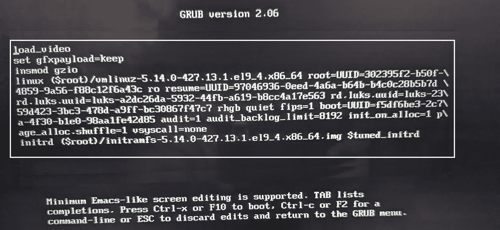

图 13.4 – 确认 GRUB 中的 FIPS 模式启动选项

这是确保在你的 RHEL 服务器上启用 FIPS 模式的另一种方法。它将为你在配置过程中做很多繁重的工作。

你应该运行以下命令以强制设置系统策略：

```

#  update-crypto-policies  –-set FIPS
```

你可能会好奇（或非常担心）你的系统在遵循 FIPS 140-3 标准方面的表现如何，因此我们提供了这个示例步骤来教你如何检查。我们将确保 FIPS 模式验证完成（无论它以前是如何配置的）：

1.  首先，我们将通过以 root 身份运行以下命令来检查 FIPS 模式是否已启用：

    ```

    #  fips-mode-setup --check
    ```

    在这一点上，你需要密切关注输出结果，因为你可能会看到这样的输出——然后你还需要做更多的工作。这是正常的。完美是难以实现的。你的输出很可能会像下面这样，通知你还需要完成更多的工作：

    ```
    Installation of FIPS modules is not completed.
    FIPS mode is disabled.
    ```

1.  假设你的系统需要更多的工作，因为你没有从上一个命令中得到理想的结果，让我们继续往下走。然后我们可以运行下一个命令，并（当然）重新验证 FIPS 模式是否在我们的主机上正常。这可能比大多数命令需要更多的时间，请耐心等待。

    ```

    #  fips-mode-setup –-enable
    ```

    该命令将需要一些时间——预计输出将类似于以下内容：

    ```
    Kernel initramdisks are being regenerated. This might take some time.
    Setting system policy to FIPS
    Note: System-wide crypto policies are applied on application start-up.
    It is recommended to restart the system for the change of policies
    to fully take place.
    FIPS mode will be enabled.
    Please reboot the system for the setting to take effect.
    ```

1.  好的，现在情况好多了。由于我们从上一个命令中得到了结果，我们需要做一些修复。这是预期的。现在按照建议重启系统：

    ```

    #  reboot
    ```

1.  系统重启后，让我们回到 root 提示符下，并重新运行验证命令。正如我一直说的，*信任* *但验证！*

    ```

    #  fips-mode-setup --check
    FIPS mode is enabled.
    ```

现在我们可以松一口气了。我们已经完成了如何实现 FIPS 模式并测试结果的过程。接下来，让我们进入另一组安全措施，即 DISA 的 STIG 配置文件。

### DISA STIG SCAP 配置文件

在我们深入了解 STIG 合规系统的设置之前，让我们首先达到一个可以真正理解 STIG 标准文档的水平。这需要你从 DISA 安装一个工具。是的，你将需要另一个工具来查看 STIG 本身的详细信息。DISA STIG Viewer 是一款免费的软件工具，支持 Windows 和 Linux 系统。抱歉大家——不支持 Mac®。我相信有一些有趣的背景故事解释了*为什么*不支持 Mac，但我不知道具体情况。这个工具由 DISA 的安全专家维护，并公开提供给所有人使用。

首先，让我们打开浏览器并访问 DISA 网站，然后下载免费的 STIG Viewer 工具。该工具可以在以下网址找到：[`public.cyber.mil/stigs/srg-stig-tools/`](https://public.cyber.mil/stigs/srg-stig-tools/)。

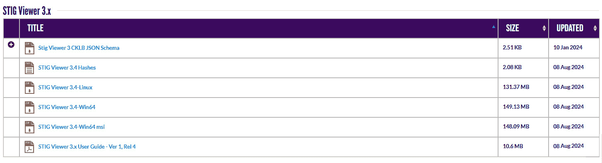

图 13.5 – 下载 STIG Viewer

现在我们有了这个极好的免费工具，让我们充分利用它，下载适用于我们示例 RHEL 9.x 实验服务器的 STIG。这也是一个相对简单的过程。

前往 [`public.cyber.mil/stigs/downloads/?_dl_facet_stigs=operating-systems`](https://public.cyber.mil/stigs/downloads/?_dl_facet_stigs=operating-systems) 并选择 RHEL 9 STIG。您可能需要浏览几个其他操作系统的 STIG 条目才能找到它（我认为它在第三页）。

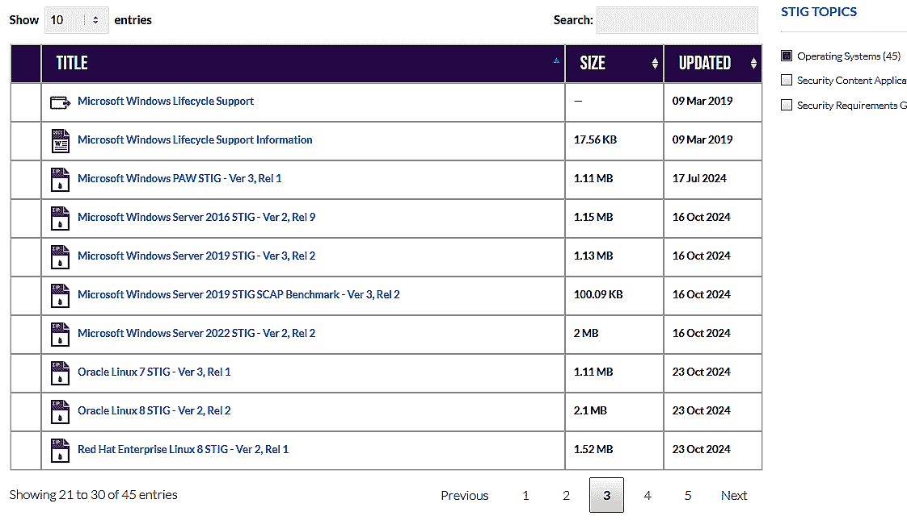

图 13.6 – 下载 RHEL 9 STIG SCAP 配置文件

在我的实验室中，我在我的 Windows 笔记本电脑和几台 Linux 服务器上都安装了 STIG Viewer。这是使用 STIG Viewer 进入 RHEL 9 STIG 库的屏幕截图。

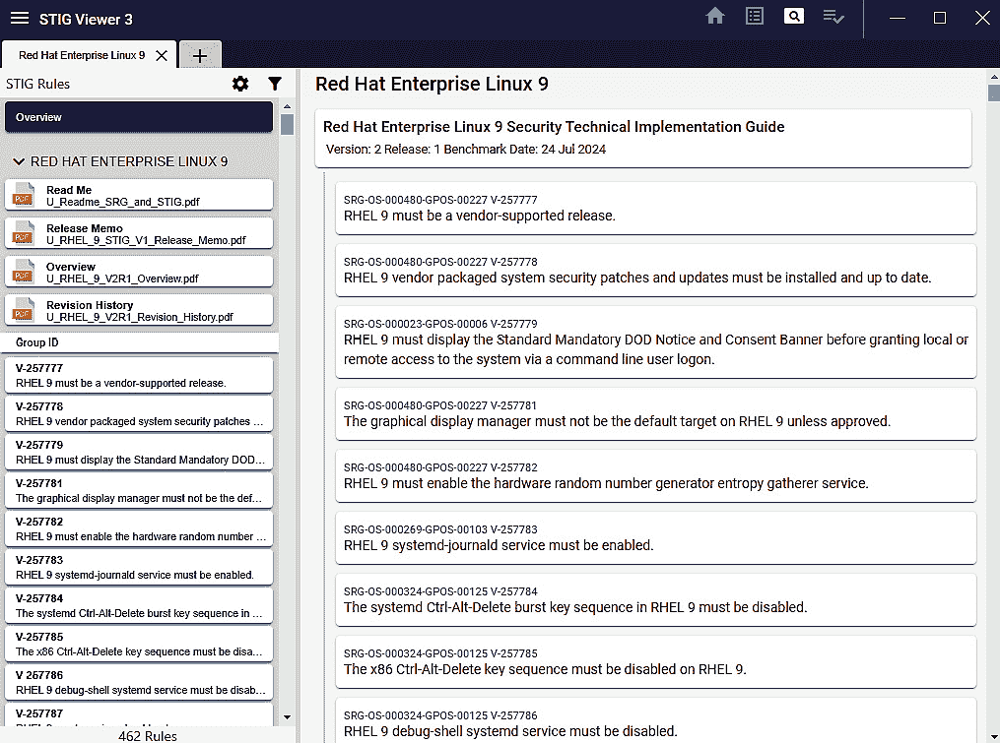

图 13.7 – 查看 RHEL 9 STIG 库

这是我建议您花一些时间不仅熟悉 STIG 查看工具，而且使用它来检查不仅仅是 RHEL 9.x STIG SCAP 配置文件，还有您想更加熟悉的任何其他配置文件。这个工具是无价的。

现在我们已经花时间查看了我们可以应用于产品的配置文件，让我们继续进行实际允许我们将系统配置强制符合规定的工具。

无论您选择在安装（和配置过程）期间遵循哪些标准，您仍然需要详细验证解决方案作为发布流程的一部分。让我们看看这可能是什么样子。

## 作为 QA 过程的一部分进行验证

我之前有没有说过*信任但要验证*？我想我有。是的。我再说一遍。

知道在哪里获取关于如何应用 SCAP 配置文件和扫描的最新信息是很重要的。由于我们专注于这些活动和 RHEL，这里是 Red Hat 关于这一过程的文档链接：[`docs.redhat.com/en/documentation/red_hat_enterprise_linux/9/html/security_hardening/scanning-the-system-for-configuration-compliance-and-vulnerabilities_security-hardening#configuration-compliance-tools-in-rhel_scanning-the-system-for-configuration-compliance-and-vulnerabilities`](https://docs.redhat.com/en/documentation/red_hat_enterprise_linux/9/html/security_hardening/scanning-the-system-for-configuration-compliance-and-vulnerabilities_security-hardening#configuration-compliance-tools-in-rhel_scanning-the-system-for-configuratio)。

提示

您需要一个帐户来登录查看信息。

让我们继续进行一个练习，我们将运行我们的第一个扫描。

## 练习：安装 OpenSCAP 工具并运行扫描

在这个练习中，您将在您的实验室机器上安装 OpenSCAP 工具，下载一个 RHEL 9 SCAP 配置文件，并运行安全扫描。让我们看看如何做：

1.  安装软件包：

    ```

    $  sudo dnf install -y scap-workbench  \
    openscap-utils openscap-engine-sce \
    openscap-scanner scap-security-guide bzip2
    ```

    这个输出非常长；但是，我已经截断了它以显示安装的重要部分：

    ```
    Updating Subscription Management repositories.
    Last metadata expiration check: 0:04:16 ago on Wed 16 Oct 2024 04:52:00 AM EDT.
    Package openscap-scanner-1:1.3.10-2.el9_3.x86_64 is already installed.
    Package bzip2-1.0.8-8.el9.x86_64 is already installed.
    Dependencies resolved.
    ==========================================================
         ((( output truncated )))
    Installed products updated.
    Installed:
      adwaita-gtk2-theme-3.28-14.el9.x86_64         gtk2-2.24.33-8.el9.x86_64                        ibus-gtk2-1.5.25-5.el9.x86_64
      libcanberra-gtk2-0.30-27.el9.x86_64           openscap-engine-sce-1:1.3.10-2.el9_3.x86_64      openscap-utils-1:1.3.10-2.el9_3.x86_64
      openssh-askpass-8.7p1-38.el9_4.4.x86_64       pcre2-utf16-10.40-5.el9.x86_64                   qt5-qtbase-5.15.9-10.el9_4.x86_64
      qt5-qtbase-common-5.15.9-10.el9_4.noarch      qt5-qtbase-gui-5.15.9-10.el9_4.x86_64            qt5-qtdeclarative-5.15.9-3.el9.x86_64
      qt5-qtxmlpatterns-5.15.9-2.el9.x86_64         rpmdevtools-9.5-1.el9.noarch                     scap-workbench-1.2.1-13.el9.x86_64
      xcb-util-image-0.4.0-19.el9.x86_64            xcb-util-keysyms-0.4.0-17.el9.x86_64             xcb-util-renderutil-0.3.9-20.el9.x86_64
      xcb-util-wm-0.4.1-22.el9.x86_64
    Complete!
    ```

1.  从 Red Hat 下载一个适用于 RHEL 9 的通用 SCAP 配置文件。就像我们之前下载的 STIG SCAP 配置文件一样，这将是一个 XML 文件，用于扫描工具：

    ```

    #  wget -O - https://www.redhat.com/security/data/oval/v2/RHEL9/rhel-9.oval.xml.bz2 | bzip2 --decompress > rhel-9.oval.xml
    ```

    这个输出也相当长；我已对其进行了截断，以节省空间，只保留了一些重要的信息：

    ```
    --2024-10-16 04:59:45--  https://www.redhat.com/security/data/oval/v2/RHEL9/rhel-9.oval.xml.bz2
    Resolving www.redhat.com (www.redhat.com)... 23.37.1.210, 2600:1401:4000:58d::d44, 2600:1401:4000:58b::d44
    Connecting to www.redhat.com (www.redhat.com)|23.37.1.210|:443... connected.
    HTTP request sent, awaiting response... 301 Moved Permanently
    Location: https://security.access.redhat.com/data/oval/v2/RHEL9/rhel-9.oval.xml.bz2 [following]
    --2024-10-16 04:59:45--  https://security.access.redhat.com
    /data/oval/v2/RHEL9/rhel-9.oval.xml.bz2
    Resolving security.access.redhat.com 
    (security.access.redhat.com)
    ... 23.194.190.138, 23.194.190.193, 
    2600:1401:2000::b819:94a8, ...
    Connecting to security.access.redhat.com 
    (security.access.redhat.com)|23.194.190.138|:443... connected.
    HTTP request sent, awaiting response... 200 OK
    Length: 444671 (434K) [application/x-bzip2]
    Saving to: 'STDOUT'
    -                                   100%[===============
    =========
    ========================================>] 434.25K  --.-KB/s
        in 0.1s
    2024-10-16 04:59:46 (3.26 MB/s) - written to stdout 
    [444671/444671]
    ```

1.  运行一次测试扫描：

    ```

    $  oscap-ssh <username>@<hostname> <port> oval eval --report 
    <scan-report.html> <path to rhel-9.oval.xml>
    ```

重要说明

oscap 工具（即 `openscap-utils` 包）必须安装在目标主机和执行命令的主机上。请根据需要替换适当的用户名、主机名和文件路径。请注意，这个命令的输出可能非常长。如果你没有两台安装了工具的机器，可以简单地在本地主机上针对自己的用户帐户运行该命令。这个练习的重点仅仅是展示过程。

这个命令的交互式输出相当长。为了节省空间，我已将显示的内容进行了截断：

```

Connecting to 'mstonge@testmachine' on port '22'...
mstonge@testmachine's password:
Connected!
Copying input file '/home/mstonge/rhel-9.oval.xml' to remote 
working directory '/tmp/tmp.10rp1SVS0z'...
rhel-9.oval.xml                                                  
                                         100% 9879KB 336.5MB/s
   00:00
Starting the evaluation...
Definition oval:com.redhat.rhsa:def:20248112: false
Definition oval:com.redhat.rhsa:def:20248111: false
     ((( output truncated )))
Definition oval:com.redhat.rhba:def:20228256: false
Definition oval:com.redhat.rhba:def:20228077: false
Definition oval:com.redhat.rhba:def:20225749: false
Definition oval:com.redhat.rhba:def:20223945: false
Definition oval:com.redhat.rhba:def:20223893: false
Evaluation done.
oscap exit code: 0
Copying back requested files...
report.html                                       

      100%  700KB 241.9MB/s   00:00
Removing remote temporary directory...
Disconnecting ssh and removing control ssh socket
 directory...
Exit request sent.
```

1.  接下来，打开浏览器查看报告。

提示

如果没有安装图形桌面，你可能希望将报告的 HTML 文件复制到其他系统中查看。查看所有项目。你的输出会与我的不同。

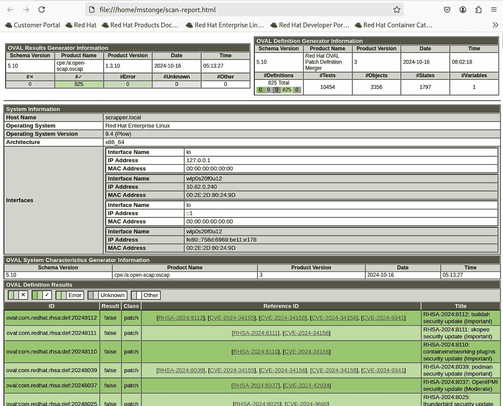

图 13.8 – 查看扫描报告 HTML 文件

现在你已经有了第一次扫描报告，请花些时间吸收内容及其格式。注意它可能发现的任何缺陷，因为这些正是我们用这个工具来寻找的。提供的详细报告可以轻松节省数小时或数天的人工检查时间。

此外，我强烈建议将这些报告作为构建和测试操作的文档保存，因为它们将成为你在提交产品进行政府认证时，证明你尽职调查的证据。

在这个练习中，我们安装了 SCAP 工具，下载了一个来自 Red Hat 的通用 SCAP 配置文件，然后执行了第一次扫描。这个过程可以轻松地通过不同的 SCAP 配置文件来重复，这些配置文件可以来自 NIST、其他第三方，或者你自己创建的。我们刚刚看到的是一个很好的命令行扫描工具示例。

现在你已经通过命令行执行了第一次扫描，让我们继续前进，看看图形化工具如何帮助处理配置文件和扫描。

## 示例：使用 OpenSCAP Workbench

在之前的练习中，我们安装了多个软件包。提前，你已经安装了 `scap-workbench` 和 `scap-security-guide` 包。当你的扫描系统处于图形用户界面模式时，你将能够查看、编辑和创建自己的 SCAP 配置文件，针对主机运行这些配置文件，甚至自动修复扫描工具发现的缺陷。

让我们逐步了解如何在 UI 中打开并使用 OpenSCAP 工作台：

1.  首先，让我们在 Gnome 桌面环境中打开 OpenSCAP Workbench 应用程序。进入 **Applications**，然后选择 **SCAP Workbench**。

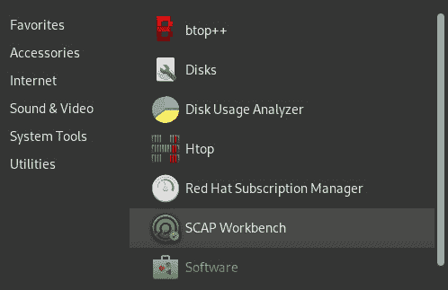

图 13.9 – 在 Gnome 的应用菜单中启动 OpenSCAP Workbench

1.  启动工作台应用程序后，系统会首先提示你选择加载哪个 SCAP 配置文件。在这里，我们将从下拉菜单中选择 **Other SCAP Content**。

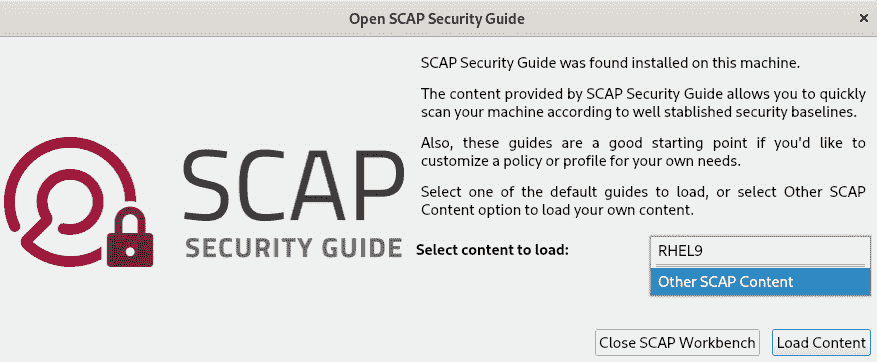

图 13.10 – 从下拉菜单中选择“Other SCAP content”

1.  接下来，我们将选择之前下载的 RHEL 9 STIG SCAP 配置文件。

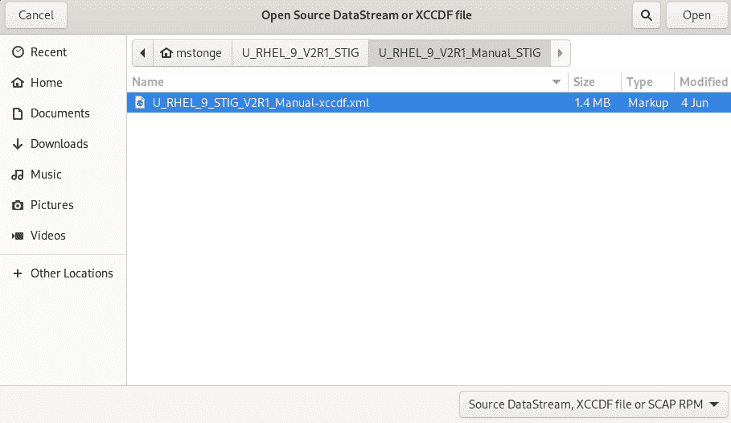

图 13.11 – 选择 RHEL 9 STIG SCAP 配置文件（之前已下载）

在决定执行路径之前，你可以在此审查设置并选择前进的方向。

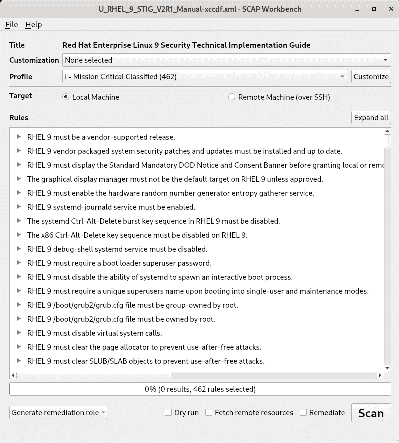

图 13.12 – 准备执行

在此屏幕上，你可以执行多种操作。你可以选择远程执行扫描。其他人可能会选择编辑此配置文件以满足公司需求。显然的路径是对本地主机或远程主机执行扫描。在此我还要指出，一旦扫描完成，这个工具可以帮助你生成修复自动化。

OpenSCAP Workbench 是一款功能强大且丰富的工具，我认为它值得比本书由于篇幅限制所能提供的更多的细节。如果你喜欢这个介绍，别忘了查看本书的 GitHub 仓库，里面有更多关于如何利用这个强大工具以及许多其他资源的内容。

现在，让我们继续进入下一个部分，在这里我们将讨论如何将安全扫描集成到你的 CI/CD 链中。

## 作为持续集成/持续部署（CI/CD）过程的一部分进行实施

这不仅仅是对你的质量保证工作的重复，而是对你当前所维护的标准和认证进行审查，以及你可能选择添加到产品中或停止维护的工作。

紧跟为你的设备提供安全标准的机构的更新非常重要，以便及时了解变化或新的法规。

对于敏捷团队，我强烈建议将这些活动添加到你的待办事项中，并确保每年至少进行两次此类审查。你们团队审查的频率越高，希望他们心中对安全的重视也能维持得更好。

此外，我还建议在此处实施一种独立的自动化程度，自动对任何发布候选主机进行扫描。你选择的自动化工具由你决定，或者由你的雇主已定为公司标准。也许你更喜欢脚本。让我们深入探讨一下。

在之前的练习中，我们下载了 STIG SCAP 配置文件和通用 RHEL SCAP 配置文件，设置了扫描主机，并学习了如何执行扫描。为了使这一过程更加标准化，我有一些针对您的 CI/CD 链和产品原型的建议。

接下来，我想分享一些我为您的构建链、原型测试以及更多任务提供的建议。

这是我对您 CI/CD 链的建议：

+   为运行这些 OpenSCAP 扫描构建一个永久主机

+   维护适当的 SCAP 配置文件库

+   自动化扫描活动和结果报告的分发

+   将您的扫描结果作为工件与构建/发布一起保存，以便将来参考

+   不丢弃任何东西——保持审计痕迹（始终）

这是我对您原型/发布候选版的建议：

+   从可能的最高安全级别开始

+   仅启用对您设备功能至关重要的插座、端口或服务

+   拥有非 root 的服务帐户，这些帐户可以运行 systemd 服务，并用于支持和扫描活动

+   确保每个主机都启用了 SSH

+   确保安装了`openscap-utils`包

如果未能将合规扫描集成并自动化到您的长期（也许是短期）流程中，将会对您产品的质量产生负面影响。我的最终建议是在产品生命周期的任何阶段都不要忽视安全问题。将其作为每个过程的组成部分，最终，它将成为您和您的产品团队的第二天性。

让我们进入您努力的最终阶段：实际获得产品认证。

# 如何认证我的解决方案？

关于如何获得您的解决方案认证，可能值得写一本完整的书。不同的行业和政府标准有许多不同类型的认证。也就是说，针对我们的安全重点，我选择将其精炼为认证的圣杯：与 NIST 共同获得的 FIPS 140-3 认证。

并不是要打击或劝阻您，但我必须提到，已经有一些公司构建了商业模式，*帮助*其他企业在实验室和 NIST 之间通过这项艰苦且漫长的过程。您可以通过简单的 Google 搜索在寻找 FIPS 认证时轻松找到它们。它们的服务很可能会出现在所有搜索结果的顶部。

FIPS 140-3 认证不仅仅是软件认证，它还是针对特定硬件的验证。为该过程提供这些服务的测试实验室每个测试周期使用特定的硬件平台。每个实验室所使用的平台可能有所不同。

这个过程是复杂的，并且不是没有成本的。根据您解决方案认证的安全级别，您可能需要向 NIST 支付从$1,000 到超过$4,000 的费用。这还不包括由为 NIST 进行繁重工作的实验室收取的任何费用。

要找到一个 NIST 认证的实验室，你需要在 NIST 网站上进行搜索。这里是一个很好的起点：[`www-s.nist.gov/niws/index.cfm?event=directory.search#no-back`](https://www-s.nist.gov/niws/index.cfm?event=directory.search#no-back)。

一旦实验室测试了你的产品并将结果提交给 NIST，NIST 团队将审核所有文档，并希望最终发出认证。此备受追捧的奖项随后可以被搜索，因为所有经过验证的 FIPS 解决方案（及其状态）都可以在 NIST 网站上找到，如下图所示。

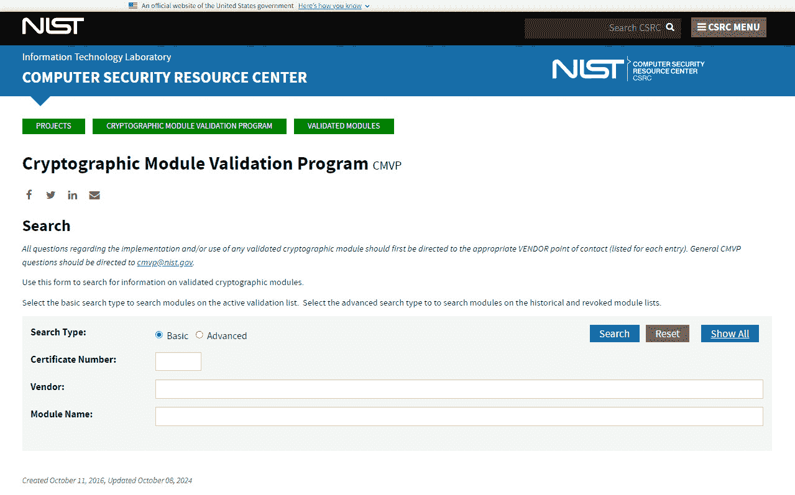

图 13.13 – 寻找已验证/认证的模块

## 供应商的 FIPS 认证重新品牌

提交、测试、验证和认证过程可能需要超过两年的时间。对于任何试图将新竞争产品推向市场的人来说，这段时间简直不可思议。即使是已经认证的操作系统供应商，也很少能提供帮助。红帽有一个计划，在这个计划中，嵌入式系统合作伙伴可以利用他们基于 RHEL 构建的产品的现有认证。我怎么知道这些？因为我曾是该计划的三位创始人之一。

选择走这条路径的红帽合作伙伴可以与红帽嵌入式团队合作，他们将提供适当的文件（即关于现有软件认证的文件），合作伙伴可以将这些文件带到 NIST 及其选择的实验室，加速认证过程。凭借这份认证重新品牌的文档，原本可能需要超过两年的过程，可能会缩短为几周或几个月，因为无需对已认证的模块进行测试。这为合作伙伴提供了巨大的价值，并为其带来了收入的路径。

# 总结

在本章中，我们走了很长一段路。我们回顾了遵守政府标准的重要性，无论你的行业是否要求这样做。我们还简要了解了一些跨越多个领域的关键标准，并学习了如何实施最重要的标准。最后，我们总结了如何通过 NIST 认证你的设备以及这个过程可能带来的乐趣。你在例子和练习中的经历应该让你获得了新的信心，这些努力并非不可能，而是非常可实现的。

让我们进入最后一章，在这一章中，我们将讨论最重要的资源——最终用户，以及他们的反馈如何帮助你的流程。我们还将对本书中学到的所有内容进行全面回顾。
