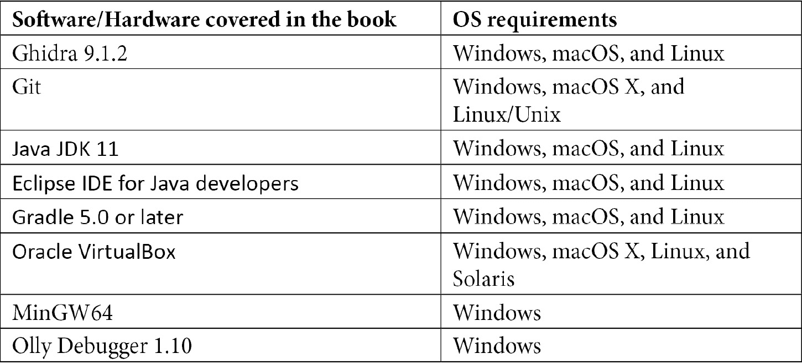

# 前言

本书是一本 Ghidra 逆向工程工具的实用指南。在书中，你将从零开始学习如何使用 Ghidra 进行不同的工作，如恶意软件分析和二进制审计。随着初始章节的深入，你还将学习如何使用 Ghidra 脚本自动化那些耗时的逆向工程任务，并如何查阅文档以解决疑问并自行扩展知识。

在阅读了初始章节后，一旦你成为 Ghidra 的高级用户，你将学习如何扩展此逆向工程工具的功能，支持新的图形用户界面插件、二进制格式、处理器模块等。在这一部分书籍后，你将获得 Ghidra 开发技能，能够调试 Ghidra 并根据自己的需要开发功能，扩展 Ghidra。

接下来，有一整章内容专门讲解如何为 Ghidra 社区做贡献，在这里你将学习如何将自己的代码、反馈、发现的漏洞等贡献给**国家安全局**（**NSA**）项目，并与其他社区成员互动。

本书的最后一章将介绍高级逆向工程话题，带你进入一个极具趣味的世界，激发你思考可以开发的新功能，以改进 Ghidra 逆向工程工具。

# 本书的读者对象

本书的读者对象包括逆向代码工程师、恶意软件分析师、漏洞猎人、渗透测试人员、漏洞开发人员、法医实践者、安全研究人员和网络安全学生。事实上，任何希望通过减少学习曲线并开始编写自己工具来学习 Ghidra 的人，肯定会享受这本书并实现他们的目标。

# 本书的内容

*第一章*，*Ghidra 入门*，带你回顾 Ghidra 的历史并从用户的角度概述该程序。

*第二章*，*使用 Ghidra 脚本自动化逆向工程任务*，解释了如何使用 Ghidra 脚本自动化逆向工程任务并介绍了脚本开发。

*第三章*，*Ghidra 调试模式*，介绍了如何设置 Ghidra 开发环境，如何调试 Ghidra，以及关于 Ghidra 调试模式漏洞的所有内容。

*第四章*，*使用 Ghidra 扩展*，为你提供开发 Ghidra 扩展的背景知识，并展示如何安装和使用它。

*第五章*，*使用 Ghidra 逆向恶意软件*，通过逆向分析一个真实的恶意软件样本，展示如何使用 Ghidra 进行恶意软件分析。

*第六章*，*脚本化恶意软件分析*，通过脚本化 Java 和 Python 两种语言，继续上一章，分析在恶意软件样本中发现的 Shellcode。

*第七章*，*使用 Ghidra 无头分析器*，解释了 Ghidra 无头分析器，并将这一知识应用于通过本章开发的脚本获取的一组恶意软件样本。

*第八章*，*审计程序二进制文件*，介绍了如何使用 Ghidra 发现内存破坏漏洞及其利用方法。

*第九章*，*脚本化二进制审计*，继续上一章，讲解如何通过脚本自动化漏洞猎捕过程，充分利用强大的 PCode 中间表示。

*第十章*，*开发 Ghidra 插件*，通过解释 Ghidra 插件扩展是充分利用 Ghidra 已实现功能的方式，深入探讨了 Ghidra 扩展开发。

*第十一章*，*加入新的二进制格式支持*，展示了如何编写 Ghidra 扩展来支持新的二进制格式，并以一个实际的文件格式为例。

*第十二章*，*分析处理器模块*，讨论了如何使用 SLEIGH 处理器规范语言编写 Ghidra 处理器模块。

*第十三章*，*贡献给 Ghidra 社区*，解释了如何通过社交网络、聊天工具与社区互动，并如何贡献自己的开发、反馈、错误报告、评论等。

*第十四章*，*为高级逆向工程扩展 Ghidra*，介绍了高级逆向工程的主题和工具，如 SMT 求解器、微软 Z3、静态和动态符号执行、LLVM 和 Angr，并解释了如何将它们与 Ghidra 结合使用。

# 为了充分利用本书

读者应该具备足够的汇编语言、C 语言、Python 和 Java 语言的理解，以便阅读书中的代码。了解操作系统内部、调试器和反汇编器的知识会有所帮助，但并非严格必要：



所需的软件列在相关章节的*技术要求*部分。

# 下载示例代码文件

你可以从 GitHub 下载本书的示例代码文件，链接为[`github.com/PacktPublishing/Ghidra-Software-Reverse-Engineering-for-Beginners`](https://github.com/PacktPublishing/Ghidra-Software-Reverse-Engineering-for-Beginners)。如果代码有更新，将会在现有的 GitHub 库中进行更新。

我们还提供了其他代码包，来自我们丰富的书籍和视频目录，访问 [`github.com/PacktPublishing/`](https://github.com/PacktPublishing/) 查看吧！

# 实战代码

本书的实战代码视频可以在 [`bit.ly/3ot3YAT`](https://bit.ly/3ot3YAT) 上观看。

# 下载彩色图像

我们还提供了一个 PDF 文件，其中包含本书中使用的截图/图表的彩色图像。你可以在这里下载： [`static.packt-cdn.com/downloads/9781800207974_ColorImages.pdf`](https://static.packt-cdn.com/downloads/9781800207974_ColorImages.pdf)。

# 使用的约定

本书中使用了许多文本约定。

`文本中的代码`：表示文本中的代码词汇、数据库表名、文件夹名称、文件名、文件扩展名、路径名、虚拟 URL、用户输入和 Twitter 用户名。例如：“`compressed_malware_samples`，即恶意软件样本下载的位置。”

代码块如下所示：

```
00  @PluginInfo(
```

```
01    status = PluginStatus.STABLE,
```

```
02    packageName = ExamplesPluginPackage.NAME,
```

```
03    category = PluginCategoryNames.EXAMPLES,
```

```
04    shortDescription = "Plugin short description.",
```

```
05    description = "Plugin long description goes here."
```

```
06  )
```

任何命令行输入或输出都如下所示：

```
>>> s = Solver()
```

```
>>> s.add(y == x + 5)
```

```
>>> s.add(y>x)
```

```
>>> s.check()
```

```
sat
```

```
>>> s.model()
```

```
[x = 0, y = 5]
```

**粗体**：表示新术语、重要词汇或你在屏幕上看到的词汇。例如，菜单或对话框中的词汇在文本中会像这样出现。这里是一个示例：“我们首先用**CodeBrowser**打开它，并进入入口点。”

提示或重要注意事项

如此显示。

# 联系我们

我们始终欢迎读者的反馈。

**一般反馈**：如果你对本书的任何部分有疑问，请在邮件主题中注明书名，并将邮件发送至 customercare@packtpub.com。

**勘误**：尽管我们已经尽一切努力确保内容的准确性，但错误仍然可能发生。如果你发现本书中有错误，感谢你报告给我们。请访问 www.packtpub.com/support/errata，选择你的书籍，点击勘误提交表单链接，并填写详细信息。

**盗版**：如果你在互联网上发现任何我们作品的非法复制品，感谢你提供相关位置地址或网站名称。请通过电子邮件与我们联系，邮箱地址为 copyright@packt.com，并附上相关材料的链接。

**如果你有兴趣成为作者**：如果你在某个主题方面有专长，并且有兴趣撰写或参与书籍的编写，请访问 authors.packtpub.com。

# 读者评论

请留下评论。在阅读并使用完本书后，何不在你购买书籍的网站上留下评论？潜在读者可以看到并参考你的客观意见来做出购买决策，我们也能了解你对我们产品的看法，而我们的作者也可以看到你对他们书籍的反馈。谢谢！

欲了解更多关于 Packt 的信息，请访问 packt.com。
