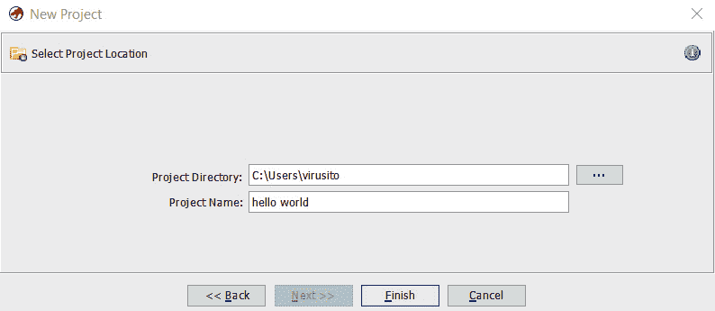

# 第一章：*第一章*：开始使用 Ghidra

在本章节中，我们将从某些方面概述 Ghidra。开始之前，了解如何获取和安装程序会非常方便。如果你只是想安装程序的发布版本，这显然是一件简单且琐碎的事情。但我猜你可能想更深入地了解这个程序。在这种情况下，我可以提前告诉你，你可以通过源代码自行编译该程序。

由于 Ghidra 的源代码是公开的，并且可以修改和扩展，你可能也会对它的结构、包含的代码片段类型等感兴趣。这是一个发现 Ghidra 提供给我们的巨大可能性的绝佳机会。

从逆向工程师的角度回顾 Ghidra 的主要功能也是很有趣的。这将激发你对这个工具的兴趣，因为它有自己的独特性，而这正是 Ghidra 最有趣的地方。

在本章中，我们将涵盖以下主要主题：

+   WikiLeaks Vault 7

+   Ghidra 与 IDA 以及其他许多竞争者的比较

+   Ghidra 概述

# 技术要求

包含本章所需所有代码的 GitHub 仓库可以通过以下链接找到：

[`github.com/PacktPublishing/Ghidra-Software-Reverse-Engineering-for-Beginners`](https://github.com/PacktPublishing/Ghidra-Software-Reverse-Engineering-for-Beginners)

查看以下链接，观看《代码实战》视频：[`bit.ly/3qD1Atm`](https://bit.ly/3qD1Atm)

# WikiLeaks Vault 7

2017 年 3 月 7 日，WikiLeaks 开始泄露 **Vault 7**，成为美国 **中央情报局**（**CIA**）最大的一次机密文档泄漏。这次泄露包含了 24 部分的秘密网络武器和间谍技术，分别命名为 Year Zero、Dark Matter、Marble、Grasshopper、HIVE、Weeping Angel、Scribbles、Archimedes、AfterMidnight、Assassin、Athena、Pandemic、Cherry Blossom、Brutal Kangaroo、Elsa、OutlawCountry、BothanSpy、Highrise、UCL/Raytheon、Imperial、Dumbo、CouchPotato、ExpressLane、Angelfire 和 Protego。

虽然 2006 至 2009 年期间担任 CIA 署长、1999 至 2005 年担任 NSA 署长的迈克尔·文森特·海登（Michael Vincent Hayden）作为发言人没有确认或否认这一巨大泄密的真实性，但一些 NSA 的情报官员曾匿名泄露了这些材料。

Ghidra 的存在是在 Vault 7：Year Zero 的第一部分泄露出来的。这部分内容包括了从美国中央情报局（CIA）位于弗吉尼亚州兰利的网络情报中心窃取的大量文件和文档。泄露的内容涉及 CIA 的恶意软件库、零日漏洞武器化利用，以及苹果 iPhone、谷歌 Android 设备、微软 Windows 设备，甚至三星电视如何被变成隐蔽的麦克风。

Ghidra 在此次泄露中被提及三次 ([`wikileaks.org/ciav7p1/cms/index.html`](https://wikileaks.org/ciav7p1/cms/index.html))，展示了如何安装 Ghidra、如何使用 Ghidra 进行 64 位内核缓存的手动分析的逐步教程（附截图），以及当时可用的最新版本 Ghidra 7.0.2。

## NSA 发布

正如在 2019 年 RSA 大会期间宣布的，NSA 网络安全高级顾问 Rob Joyce 解释了 Ghidra 独特的能力和功能，在名为 *Get your free NSA reverse engineering tool* 的会议中，他还发布了 Ghidra 的程序二进制文件。

在这次会议中，解释了以下一些功能：

+   团队协作单一项目功能

+   扩展和扩展 Ghidra 的能力

+   通用处理器模型，也称为`SLEIGH`

+   两种工作模式：交互式和非图形用户界面模式

+   Ghidra 强大的分析功能

最终，在 2019 年 4 月 4 日，NSA 在 GitHub 上发布了 Ghidra 的源代码 ([`github.com/NationalSecurityAgency/ghidra`](https://github.com/NationalSecurityAgency/ghidra))，并在 Ghidra 网站上发布了 Ghidra 的发布版本，你可以在这里下载可以使用的 Ghidra 版本：[`ghidra-sre.org`](https://ghidra-sre.org)。该网站上可用的第一个 Ghidra 版本是 Ghidra 9.0。Ghidra 网站可能对美国以外的访问者不可用；如果是这种情况，你可以使用 VPN 或像 HideMyAss 这样的在线代理来访问 ([`www.hidemyass.com/`](https://www.hidemyass.com/))。

不幸的是，几小时后，`@hackerfantastic`（马修·希基）于 2019 年 3 月 6 日凌晨 1:20 发布了第一个 Ghidra 漏洞。他在 Twitter 上说了以下内容：

Ghidra 在调试模式下打开 JDWP，并监听端口 18001，你可以用它远程执行代码（人脸掌击）。要修复这个问题，需要将 support/launch.sh 文件的第 150 行从 * 改为 127.0.0.1 [`github.com/hackerhouse-opensource/exploits/blob/master/jdwp-exploit.txt`](https://github.com/hackerhouse-opensource/exploits/blob/master/jdwp-exploit.txt)。

然后，关于 NSA 和 Ghidra 的许多疑问浮现出来。然而，考虑到 NSA 的网络间谍能力，你认为 NSA 需要在其软件中包括后门来黑客攻击自己的用户吗？

显然，不需要。他们不需要这样做，因为他们已经有了网络武器。

使用 Ghidra 时你会感到很舒适；可能，NSA 只是想做一些有荣誉感的事情来改善自己的形象，而且既然 Ghidra 的存在已经被 WikiLeaks 泄露，那有什么比在 RSA 大会发布它并将其作为开源发布更好的方式呢？

# Ghidra 与 IDA 及其他许多竞争者的对比

即使你已经掌握了强大的逆向工程框架，如 IDA、Binary Ninja 或 Radare2，仍然有充分的理由开始学习 Ghidra。

没有单一的逆向工程框架是终极的。每个逆向工程框架都有其优点和缺点。有些框架甚至无法相互比较，因为它们是以不同的理念设计的（例如，基于 GUI 的框架与基于命令行的框架）。

另一方面，你会看到这些产品一直在相互竞争并互相学习。例如，IDA Pro 7.3 引入了 `undo` 功能，而该功能之前是由其竞争对手 Ghidra 提供的。

在以下截图中，你可以看到官方 Twitter 账号 `@GHIDRA_RE` 对 IDA Pro 的 `undo` 功能的幽默回应：


图 1.1 – IDA Pro 7.3 添加了撤销功能，以与 Ghidra 竞争

框架之间的差异会因竞争而有所变化，但我们可以提到 Ghidra 当前的一些优点：

+   它是开源且免费的（包括其反编译器）。

+   它支持许多架构（这可能是你正在使用的框架尚未支持的）。

+   它可以在一个项目中同时加载多个二进制文件。这个功能使你可以轻松地在多个相关二进制文件（例如，一个可执行二进制文件及其库）上执行操作。

+   它通过设计支持协作式逆向工程。

+   它支持大容量固件镜像（1 GB+）且没有问题。

+   它有很棒的文档，其中包括示例和课程。

+   它允许对二进制文件进行版本跟踪，帮助你在不同版本的二进制文件之间匹配函数、数据及其标记。

总之，建议尽可能学习多种框架，以便了解并利用每个框架的优势。从这个意义上说，Ghidra 是一个你必须了解的强大框架。

# Ghidra 概述

类似于 RSA 大会的做法，我们将在此提供 Ghidra 概述，以展示该工具及其功能。你很快就会意识到 Ghidra 的强大，以及为什么这个工具不仅仅是另一个开源的逆向工程框架。

在撰写本书时，Ghidra 的最新可用版本是 9.1.2，可以从本章前面部分提到的官方网站下载。

## 安装 Ghidra

建议通过点击红色的 **Download Ghidra v9.1.2** 按钮下载 Ghidra 的最新版本（[`ghidra-sre.org/`](https://ghidra-sre.org/)），但如果你想下载旧版本，需要点击 **Releases**：


图 1.2 – 从官方网站下载 Ghidra

下载 Ghidra 压缩文件（`ghidra_9.1.2_PUBLIC_20200212.zip`）并解压后，你将看到以下文件结构：


图 1.3 – 解压后的 Ghidra 9.1.2 结构

内容可以描述如下（来源：[`ghidra-sre.org/InstallationGuide.html`](https://ghidra-sre.org/InstallationGuide.html)）：

+   `docs`：Ghidra 文档和一些非常有用的资源，如适用于各级别的 Ghidra 学习课程、备忘单以及逐步安装指南

+   `Extensions`：可选的 Ghidra 扩展，允许您增强其功能并与其他工具集成

+   `Ghidra`：Ghidra 程序本身

+   `GPL`：独立的 GPL 支持程序

+   `licenses`：包含 Ghidra 使用的许可证

+   `server`：包含与 Ghidra 服务器安装和管理相关的文件

+   `support`：允许您在高级模式下运行 Ghidra，并控制它的启动方式，包括将其启动以进行调试

+   `ghidraRun`：用于在 Linux 和 iOS 上启动 Ghidra 的脚本

+   `ghidraRun.bat`：用于在 Windows 上启动 Ghidra 的批处理脚本

+   `LICENSE`：Ghidra 许可证文件

除了下载预编译的 Ghidra 发行版本外，您还可以根据下一节所述自行编译该程序。

### 自行编译 Ghidra

如果您希望自行编译 Ghidra，可以从以下 URL 下载源代码：[`github.com/NationalSecurityAgency/ghidra`](https://github.com/NationalSecurityAgency/ghidra)。

然后，您可以使用 Gradle 运行以下命令来构建它：

```
gradle --init-script gradle/support/fetchDependencies.gradle init
```

```
gradle buildGhidra
```

```
gradle eclipse
```

```
gradle buildNatives_win64
```

```
gradle buildNatives_linux64
```

```
gradle buildNatives_osx64
```

```
gradle sleighCompile
```

```
gradle eclipse -PeclipsePDE
```

```
gradle prepDev
```

这将生成一个压缩文件，其中包含 Ghidra 的编译版本：

```
/ghidra/build/dist/ghidra_*.zip
```

在启动 Ghidra 之前，请确保您的计算机符合以下要求：

+   4 GB 内存

+   1 GB 存储空间（用于安装 Ghidra 二进制文件）

+   强烈建议使用双显示器

由于 Ghidra 是用 Java 编写的，如果在安装 Java 11 64 位运行时和开发工具包之前执行 Ghidra，可能会显示以下错误消息：

+   当未安装 Java 时，您将看到以下内容：

    ```
    "Java runtime not found..."
    ```

+   当缺少 **Java 开发工具包**（**JDK**）时，您将看到以下内容：


图 1.4 – 缺少 JDK 错误

因此，如果收到以下消息中的任何一条，请从以下来源之一下载 JDK：

+   [`adoptopenjdk.net/releases.html?variant=openjdk11&jvmVariant=hotspot`](https://adoptopenjdk.net/releases.html?variant=openjdk11&jvmVariant=hotspot)

+   [`docs.aws.amazon.com/corretto/latest/corretto-11-ug/downloads-list.html`](https://docs.aws.amazon.com/corretto/latest/corretto-11-ug/downloads-list.html)

    如何解决安装问题

    Ghidra 的逐步安装指南，包括已知问题，可以在 Ghidra 文档目录中的 `docs\InstallationGuide.html` 找到。

    也可以通过以下链接在线访问：[`ghidra-sre.org/InstallationGuide.html`](https://ghidra-sre.org/InstallationGuide.html)。

    请注意，你可以通过以下链接报告在 Ghidra 中发现的新问题：[`github.com/NationalSecurityAgency/ghidra/issues`](https://github.com/NationalSecurityAgency/ghidra/issues)。

安装 Ghidra 后，你可以通过在 Linux 和 iOS 上使用 `ghidraRun` 或在 Windows 上使用 `ghidraRun.bat` 启动它。

## Ghidra 功能概述

在本节中，我们将概述一些 Ghidra 的基本功能，以便理解程序的整体功能。这也是一个很好的入门点，帮助你熟悉 Ghidra。

### 创建一个新的 Ghidra 项目

正如你所注意到的，与其他逆向工程工具不同，Ghidra 不直接操作文件。而是，Ghidra 操作项目。让我们通过点击 **文件** | **新建项目…** 来创建一个新项目。你也可以通过按 *Ctrl* + *N* 快捷键更快地完成此操作（完整的 Ghidra 快捷键列表可在 [`ghidra-sre.org/CheatSheet.html`](https://ghidra-sre.org/CheatSheet.html) 上找到，也可以在 Ghidra 的文档目录中找到）：


图 1.5 – 创建一个新的 Ghidra 项目

此外，项目可以是非共享的或共享的项目。由于我们想分析一个不与其他逆向工程师合作的 `hello world` 程序，我们将选择 `hello world`) 并选择存储位置：



图 1.6 – 选择项目名称和目录

该项目由 `hello world.gpr` 文件和 `hello world.rep` 文件夹组成：


图 1.7 – Ghidra 项目结构

Ghidra 项目（`*.gpr` 文件）只能由单个用户打开。因此，如果你尝试同时打开同一个项目两次，使用 `hello world.lock` 和 `hello world.lock~` 文件实现的并发锁将阻止你这样做，如下截图所示：


图 1.8 – Ghidra 项目已锁定

在接下来的章节中，我们将介绍如何向项目中添加二进制文件。

### 导入文件到 Ghidra 项目

我们可以开始向我们的 `hello world` 项目中添加文件。为了使用 Ghidra 分析一个极其简单的应用程序，我们将编译以下 C 语言编写的 `hello world` 程序（`hello_world.c`）：

```
#include <stdio.h>
```

```
int main(){
```

```
	printf("Hello world.");
```

```
}
```

我们使用以下命令来编译它：

```
C:\Users\virusito\Desktop\hello_world> gcc.exe hello_world.c
```

```
C:\Users\virusito\>\
```

让我们分析生成的 Microsoft Windows 可移植可执行文件：`hello_world.exe`。

让我们将我们的 `hello world.exe` 文件导入项目中；为此，我们需要进入 **文件** | **导入文件**。或者，我们可以按 *I* 键：


图 1.9 – 导入文件到 Ghidra 项目

Ghidra 自动识别了`hello_world.exe`程序为 32 位架构的 x86 可移植执行二进制文件。由于成功识别，我们可以点击**OK**继续。导入后，你将看到文件的总结：


图 1.10 – Ghidra 项目文件导入结果总结

通过双击`hello_world.exe`文件或点击**Tool Chest**的绿色 Ghidra 图标，文件将被 Ghidra 打开并加载：


图 1.11 – 一个包含可移植执行文件的 Ghidra 项目

将文件导入项目后，你可以开始逆向工程它们。这是 Ghidra 的一个酷功能，允许你将多个文件导入到一个项目中，因为你可以对多个文件（例如可执行二进制文件及其依赖项）执行一些操作（例如搜索）。在接下来的部分中，我们将看到如何使用 Ghidra 分析这些文件。

### 执行和配置 Ghidra 分析

系统会询问你是否分析该文件，你可能会想回答**是**，因为分析操作会识别函数、参数、字符串等。通常，你会希望让 Ghidra 为你获取这些信息。确实有很多分析配置选项。你可以通过点击每个选项查看它的描述；描述会显示在右上角的**Description**部分：


图 1.12 – 文件分析选项

让我们点击**Analyze**来执行文件分析。然后，你将看到 Ghidra 的**CodeBrowser**窗口。如果你忘记分析某个内容，不要担心；你可以稍后重新分析程序（进入**Analysis**标签，然后选择**Auto Analyze 'hello_world.exe'…**）。

### 探索 Ghidra CodeBrowser

默认情况下，Ghidra CodeBrowser 具有一个非常合理的停靠窗口分布，如下截图所示：


图 1.13 – Ghidra 的 CodeBrowser 窗口

让我们看看 CodeBrowser 默认是如何分布的：

1.  与往常一样，在逆向工程框架中，默认情况下，Ghidra 会在屏幕中央显示文件的反汇编视图。

1.  由于反汇编级别有时过于低级，Ghidra 集成了自己的反编译器，位于反汇编窗口的右侧。程序的主函数通过 Ghidra 签名被识别，然后自动生成了参数。Ghidra 还允许你在很多方面操作反编译后的代码。当然，文件的十六进制视图也可以在相应的标签中查看。这三个窗口（反汇编、反编译器和十六进制窗口）是同步的，提供了同一事物的不同视角。

1.  Ghidra 还允许你轻松地在程序中导航。例如，要跳转到另一个程序部分，你可以参考位于 CodeBrowser 左上角的**程序树**窗口。

1.  如果你更喜欢导航到一个符号（例如，程序函数），那么就往下看，找到**符号树**窗格的位置。

1.  如果你想处理数据类型，那么再往下看，找到**数据类型管理器**。

1.  由于 Ghidra 支持脚本化逆向工程任务，脚本结果会显示在底部的相应窗口中。当然，**书签**标签也可以在相同位置使用，让你创建文档齐全且有条理的书签，以便快速访问任何内存位置。

1.  Ghidra 还在顶部提供了一个快速访问栏。

1.  在右下角，第一个字段显示当前地址。

1.  紧接着当前地址，当前函数会显示出来。

1.  除了当前地址和当前函数外，当前的反汇编行也会显示出来，以完成上下文信息。

1.  最后，在 CodeBrowser 的最上方，主工具栏位于此处。

现在你已经了解了 Ghidra 的默认视角，是时候学习如何自定义它了。我们将在接下来的部分讨论这一内容。

### 自定义 Ghidra

这是 Ghidra 的默认视角，但你也可以修改它。例如，你可以通过点击**窗口**菜单并选择一个感兴趣的窗口，来向 Ghidra 添加更多窗口：


图 1.14 – Ghidra 窗口子菜单中的一些项目

Ghidra 拥有许多强大的功能——例如，位于反汇编窗口右上角的工具栏可以让你通过移动字段、添加新字段、扩展反汇编列表中字段的大小等方式自定义反汇编视图：


图 1.15 – 反汇编列表配置

它还允许你启用 Ghidra 的一个非常有趣的功能，即其中间表示或中间语言，称为**PCode**。它使你能够开发与汇编语言无关的工具，并以更舒适的语言开发自动化分析工具：


图 1.16 – 启用反汇编列表中的 PCode 字段

如果启用了，**PCode** 会在列表中显示。正如你很快会发现的那样，**PCode** 不太适合人类阅读，但有时它对于脚本化逆向工程任务来说更为高效：


图 1.17 – 启用 PCode 的反汇编列表

### 发现更多 Ghidra 功能

Ghidra 还包含了一些在其他逆向工程框架中也能找到的强大功能。例如，像其他逆向工程框架一样，你也可以使用图形视图：


图 1.18 – 一个 hello world 程序的主函数的图形视图

正如你所注意到的，Ghidra 有许多功能和窗口；我们不会在本章中覆盖所有内容，也不会修改和/或扩展所有功能。实际上，我们还没有提到所有内容。相反，我们将在接下来的章节中通过实践来学习它们。

# 摘要

在本章中，我们介绍了 Ghidra 的激动人心和独特的起源。接着，我们讲解了如何从源代码下载、安装并自行编译它。你还学会了如何解决问题以及如何向 Ghidra 开源项目报告新问题。

最后，你了解了 Ghidra 的结构和主要功能（其中一些尚未涉及）。现在，你可以自行探索并稍微实验一下 Ghidra 了。

本章帮助你理解了 Ghidra 的全貌，这对于接下来的章节将会有帮助，后续章节将更专注于具体细节。

在下一章中，我们将讲解如何通过使用、修改和开发 Ghidra 插件来自动化逆向工程任务。

# 问题

1.  是否有一种逆向工程框架绝对比其他框架更好？Ghidra 在解决哪些问题方面优于大多数框架？请列举一些优点和缺点。

1.  如何配置反汇编视图以启用 PCode？

1.  反汇编视图和反编译视图有什么区别？
