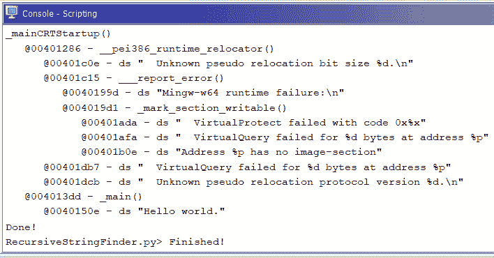
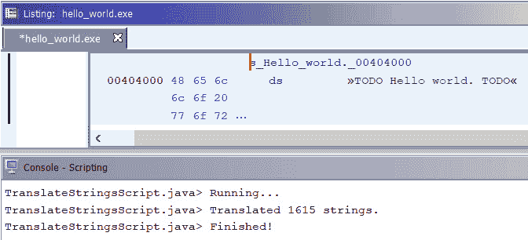

# 第二章：*第二章*：使用 Ghidra 脚本自动化逆向工程任务

在本章中，我们将讲解如何通过脚本化 Ghidra 来自动化**逆向工程**（**RE**）任务。我们将首先回顾内置在工具中的大量且结构良好的 Ghidra 脚本库。这些几百个脚本通常足以满足主要的自动化需求。

一旦你了解了这个库，你可能还会想了解它是如何工作的。接下来，我们将概览 Ghidra 脚本类，以便理解其内部结构并获得一些背景知识，这对本章最后一部分会非常有帮助。

最后，你将学习如何开发自己的 Ghidra 脚本。为此，必须先了解 Ghidra API 的概览。幸运的是，你可以根据个人偏好选择使用 Java 或 Python，因为 Ghidra API 在这两种语言中的实现是相同的。

在本章中，我们将覆盖以下主要主题：

+   探索 Ghidra 脚本库

+   分析 Ghidra 脚本类和 API

+   编写你自己的 Ghidra 脚本

# 技术要求

本章所需的所有代码可以在 GitHub 仓库找到：[`github.com/PacktPublishing/Ghidra-Software-Reverse-Engineering-for-Beginners/tree/master/Chapter02`](https://github.com/PacktPublishing/Ghidra-Software-Reverse-Engineering-for-Beginners/tree/master/Chapter02)。

查看以下视频，看看代码如何运行：[`bit.ly/3mZbdAm`](https://bit.ly/3mZbdAm)

# 使用和修改现有脚本

Ghidra 脚本允许你在分析二进制文件时自动化逆向工程任务。让我们从 `hello world` 程序的使用概述开始。我们这里的起点是一个加载到 Ghidra **代码浏览器**中的 `hello world` 程序，如*第一章*的*Ghidra 功能概览*部分所解释。

如本章引言中提到的，Ghidra 包含了一个真正的脚本库。要访问它，请进入**窗口**，然后选择**脚本管理器**。或者，点击以下截图中高亮显示的按钮：


](img/B16207_02_001.jpg)

图 2.1 – 快速访问栏中高亮显示的运行脚本按钮

正如你在左侧的文件夹浏览器中看到的，这些脚本按文件夹分类，选择某个文件夹时会显示其中包含的脚本：


](img/B16207_02_002.jpg)

图 2.2 – 脚本管理器

在前面的截图中，当点击位于**脚本管理器**窗口右上角的任务列表图标时，将显示脚本目录的路径：


](img/B16207_02_003.jpg)

图 2.3 – 脚本目录

这是一个非常好的起点，可以用来实验现有脚本。你可以通过 Ghidra 分析和编辑所有这些脚本，它将帮助你理解它们是如何工作的，以及如何根据你的需求进行调整。使用下图所示的高亮图标来编辑脚本或创建新脚本：


图 2.4 – 快速访问栏中高亮的编辑脚本和创建新脚本按钮

由于我们正在分析一个只会在屏幕上打印 `hello world` 的 `hello world` 程序，我们可以选择一个与字符串相关的 Ghidra 脚本，然后查看它如何加速分析。如下图所示，Python 和 Java 脚本在 **Script Manager** 中混合显示：


图 2.5 – Script Manager 中可用的与字符串相关的脚本

例如，`RecursiveStringFinder.py` 文件可以通过显示所有函数及其相关字符串来加速分析。它加速分析的原因是，字符串可以揭示一个函数的用途，而无需读取任何一行代码。

让我们执行前面提到的脚本，以 `hello world` 程序的 `_mainCRTStartup()` 函数作为输入（你需要将光标放在此函数上），同时在脚本控制台中查看输出。

如下图所示，`RecursiveStringFinder.py` 打印出一个缩进的（根据调用深度）函数列表，每个函数都包含其引用的字符串。

例如，`_mainCRTStartup()` 函数是第一个将被执行的函数（我们知道这一点是因为它的缩进；它是最靠左的那个）。之后，编译器引入的 `__pei386_runtime_relocator()` 函数将被调用。这个函数包含字符串 `" Unknown pseudo relocation bit size %d. \n"`，我们知道它是一个字符串，因为有 `ds` 指示符。你可以看到，在一些由编译器引入的函数和字符串之后，`_main()` 函数包含了 `"Hello world."` 字符串，这揭示了我们的程序功能：



图 2.6 – 运行 RecursiveStringFinder.py 脚本时，在 Hello World 程序中得到的结果

之前的脚本是用 Python 开发的，它使用 `getStringReferences()` 函数（第 `04` 行）获取引用某些内容的指令的操作数（第 `07` 行）（第 `10` 行）。当被引用的内容是数据，更准确地说是字符串（第 `12-14` 行）时，它会被添加到结果列表中，最终显示在脚本控制台中。

我们修改了这个脚本，在将字符串附加到 `isAnInterestingString()` 函数的结果列表时实现了过滤器（第 `15` 行），以决定是否将其附加到结果列表中（第 `16`–`20` 行）。

假设你在分析的程序代码中寻找 URL，这在分析恶意软件时非常有用，因为它可以揭示攻击者的服务器。你只需要打开 `strings` 文件夹（该脚本处理字符串）。然后，打开 `RecursiveStringFinder.py` 脚本并向其中添加过滤条件，通过实现 `isAnInterestingString()` 函数（以下代码片段中的第 `00`–`02` 行）。

一般来说，编写脚本之前要先检查是否已经有类似的脚本存在于 Ghidra 的工具库中：

```
00 def isAnInterestingString(string):
```

```
01     """Returns True if the string is interesting for us"""
```

```
02     return string.startswith("http")
```

```
03
```

```
04 def getStringReferences(insn):
```

```
05     """Get strings referenced in any/all operands of an 
```

```
06        instruction, if present"""
```

```
07     numOperands = insn.getNumOperands()
```

```
08     found = []
```

```
09     for i in range(numOperands):
```

```
10         opRefs = insn.getOperandReferences(i)
```

```
11         for o in opRefs:
```

```
12             if o.getReferenceType().isData():
```

```
13                 string = getStringAtAddr(o.getToAddress())
```

```
14                 if string is not None and \
```

```
15                              isAnInterestingString(string):
```

```
16                     found.append(StringNode(
```

```
17                                       insn.getMinAddress(),
```

```
18                                       o.getToAddress(), 
```

```
19                                       string))
```

```
20     return found
```

这个脚本可以很容易地修改为搜索代码中的 URL，这在分析恶意软件时非常有用。你只需要将 `isAnInterestingString()` 中的条件替换为合适的正则表达式。

前面的脚本是用 Python 编程语言开发的。如果你想尝试 Java，可以分析 `TranslateStringsScript.java` 中的代码。为了简洁，以下代码清单省略了导入部分：

```
00 public class TranslateStringsScript extends GhidraScript {
```

```
01
```

```
02   private String translateString(String s) {
```

```
03     // customize here
```

```
04     return "TODO " + s + " TODO";
```

```
05   }
```

```
06
```

```
07   @Override
```

```
08   public void run() throws Exception {
```

```
09
```

```
10     if (currentProgram == null) {
```

```
11       return;
```

```
12     }
```

```
13
```

```
14     int count = 0;
```

```
15
```

```
16     monitor.initialize(
```

```
17             currentProgram.getListing().getNumDefinedData()
```

```
18     );
```

```
19     monitor.setMessage("Translating strings");
```

```
20     for (Data data : DefinedDataIterator.definedStrings(
```

```
21                                       currentProgram,
```

```
22                                       currentSelection)) {
```

```
23       if (monitor.isCancelled()) {
```

```
24         break;
```

```
25       }
```

```
26       StringDataInstance str = StringDataInstance. \
```

```
27                                getStringDataInstance(data);
```

```
28       String s = str.getStringValue();
```

```
29       if (s != null) {
```

```
30 	      TranslationSettingsDefinition. \ 
```

```
31            TRANSLATION.setTranslatedValue(data,
```

```
32              translateString(s));
```

```
33
```

```
34          TranslationSettingsDefinition. \ 
```

```
35            TRANSLATION.setShowTranslated(data, true);
```

```
36          count++;
```

```
37          monitor.incrementProgress(1);
```

```
38       }
```

```
39     }
```

```
40     println("Translated " + count + " strings.");
```

```
41   }
```

```
42 }
```

前面的脚本允许你通过在程序中引用的字符串前后加上 `TODO` 字符串来修改这些字符串（第 `04` 行）。这个脚本在某些情况下很有用。例如，如果你需要解码大量的 Base64 编码字符串或破解类似的恶意软件混淆，可以修改 `translateString()` 函数，该函数负责获取输入字符串，应用某些转换并返回结果。

`run()` 函数是 Ghidra 脚本的主函数（第 `08` 行）。在这种情况下，首先将字符串计数器初始化为零（第 `14` 行），然后对于每个字符串（第 `20` 行），计数器会递增，同时产生字符串转换（第 `30`–`32` 行）并在每次循环迭代中显示（第 `34`–`35` 行）。

按照当前脚本的执行方式，它会通过在所有程序字符串前后添加 `TODO` 来进行修改。正如你在下面的截图中看到的，我们的 `Hello world` 字符串就是以这种方式被修改的。脚本还计算了转换过的字符串数量：



图 2.7 – 运行 TranslateStringsScript.java 处理 Hello World 程序的结果

我们已经了解了如何使用现有的脚本，并且也知道如何将它们调整以满足我们的需求。接下来，我们将学习 Ghidra 脚本类是如何工作的。

# 脚本类

要开发一个 Ghidra 脚本，你需要点击 **创建新脚本** 选项，该选项可通过 **脚本管理器** 菜单找到。然后，你将能够选择使用哪种编程语言：


图 2.8 – 新建脚本时的编程语言对话框

如果你决定使用 Java，脚本的骨架将由三部分组成。第一部分是注释：

```
//TODO write a description for this script
```

```
//@author 
```

```
//@category Strings
```

```
//@keybinding 
```

```
//@menupath 
```

```
//@toolbar 
```

有些注释显而易见，但有些值得特别提及。例如，`@menupath` 允许你指定脚本启用时应该放置在菜单中的位置：


图 2.9 – 启用脚本与 Ghidra 集成

请注意，路径必须由 `.` 字符分隔：

```
//@menupath Tools.Packt.Learn Ghidra script
```

前面的源代码注释生成了与 Ghidra 菜单集成的脚本如下：


图 2.10 – 将新脚本集成到 Ghidra 后的结果

下一部分是导入，其中最重要且绝对必要的是 `GhidraScript`。所有脚本必须继承此类并实现 `run()` 方法（这是主方法）：

```
import ghidra.app.script.GhidraScript;
```

```
import ghidra.program.model.util.*;
```

```
import ghidra.program.model.reloc.*;
```

```
import ghidra.program.model.data.*;
```

```
import ghidra.program.model.block.*;
```

```
import ghidra.program.model.symbol.*;
```

```
import ghidra.program.model.scalar.*;
```

```
import ghidra.program.model.mem.*;
```

```
import ghidra.program.model.listing.*;
```

```
import ghidra.program.model.lang.*;
```

```
import ghidra.program.model.pcode.*;
```

```
import ghidra.program.model.address.*;
```

所有导入的内容都在 Ghidra 的 Javadoc 文档中有记录；在开发脚本时，你应该参考该文档。

Javadoc Ghidra API 文档

通过点击 **帮助** 然后选择 **Ghidra API 帮助**，如果 JavaDoc 文档尚不存在，Ghidra 的 JavaDoc 文档将会自动生成。然后，你就可以访问上述导入包的文档：/api/ghidra/app/script/package-summary.html/api/ghidra/program/model/。

最后，脚本的主体继承自 `GhidraScript`，其中 `run()` 方法必须用你自己的代码实现。在你的实现中，你可以访问以下 `GhidraScript` 状态：`currentProgram`、`currentAddress`、`currentLocation`、`currentSelection` 和 `currentHighlight`：

```
public class NewScript extends GhidraScript {
```

```
    public void run() throws Exception {
```

```
//TODO Add User Code Here
```

```
    }
```

```
}
```

如果你想使用 Python 编写脚本，API 与 Java 相同，脚本的骨架包含一个头部（脚本的其余部分必须由你自己填写），这与 Java 的非常相似：

```
#TODO write a description for this script
```

```
#@author 
```

```
#@category Strings
```

```
#@keybinding 
```

```
#@menupath 
```

```
#@toolbar 
```

```
#TODO Add User Code Here
```

事实上，Java API 通过 Jython 被暴露给 Python，Jython 是一个设计用于在 Java 平台上运行的 Python 编程语言实现。

如果你进入 **窗口** 然后选择 **Python**，将会出现一个 Python 解释器，当按下 *Tab* 键时会启用自动完成：


图 2.11 – Ghidra Python 解释器的自动完成特性

它还允许你通过使用 `help()` 函数查看文档。如你所见，在开发 Ghidra 脚本时，强烈推荐保持 Ghidra Python 解释器打开，这样可以快速访问文档、测试代码片段等，非常有用：


图 2.12 – 使用 Python 解释器查询 Ghidra 帮助

在这一部分，我们介绍了脚本类及其结构，如何查询 Ghidra API 文档以实现它，以及 Python 解释器在开发过程中如何帮助我们。在下一部分，我们将通过编写 Ghidra 脚本来实践这一点。

# 脚本开发

现在你已经了解了实现自己脚本所需的一切。我们从编写头部开始。这个脚本将允许你用无操作指令（`NOP` 汇编操作码）修补字节。

首先，我们开始编写头部。请注意，`@keybinding` 允许我们通过 *Ctrl* + *Alt* + *Shift* + *N* 快捷键组合来执行脚本：

```
//This simple script allows you to patch bytes with NOP opcode
```

```
//@author Packt
```

```
//@category Memory
```

```
//@keybinding ctrl alt shift n 
```

```
//@menupath Tools.Packt.nop
```

```
//@toolbar 
```

```
import ghidra.app.script.GhidraScript;
```

```
import ghidra.program.model.util.*;
```

```
import ghidra.program.model.reloc.*;
```

```
import ghidra.program.model.data.*;
```

```
import ghidra.program.model.block.*;
```

```
import ghidra.program.model.symbol.*;
```

```
import ghidra.program.model.scalar.*;
```

```
import ghidra.program.model.mem.*;
```

```
import ghidra.program.model.listing.*;
```

```
import ghidra.program.model.lang.*;
```

```
import ghidra.program.model.pcode.*;
```

```
import ghidra.program.model.address.*;
```

然后，我们的脚本只需要做的是获取 Ghidra 中当前的光标位置（`currentLocation` 变量），然后获取该位置的地址（第 `03` 行），该地址处的指令是未定义的（第 `06` 到 `08` 行），用 `NOP` 指令操作码（即 `0x90`，第 `09` 到 `11` 行）修补该字节，再次反汇编字节（第 `12` 行）。这里要做的重要工作是寻找合适的 API 函数，这些函数可以在提到的 Javadoc 文档中找到：

```
00 public class NopScript extends GhidraScript {
```

```
01
```

```
02   public void run() throws Exception {
```

```
03     Address startAddr = currentLocation.getByteAddress();
```

```
04     byte nop = (byte)0x90;
```

```
05     try {
```

```
06       Instruction instruction = getInstructionAt(startAddr)
```

```
07       int istructionSize = 
```

```
                instruction.getDefaultFallThroughOffset();
```

```
08       removeInstructionAt(startAddr);
```

```
09       for(int i=0; i<istructionSize; i++){
```

```
10         setByte(startAddr.addWrap(i), nop);
```

```
11       }
```

```
12       disassemble(startAddr);
```

```
13     }
```

```
14     catch (MemoryAccessException e) {
```

```
15       popup("Unable to nop this instruction");
```

```
16       return;
```

```
17     }
```

```
18   }
```

```
19 }
```

当然，如你所知，将这段代码转换为 Python 非常简单，因为如前所述，两个语言的 API 是相同的：

```
#This simple script allows you to patch bytes with NOP opcode
```

```
#@author Packt
```

```
#@category Memory
```

```
#@keybinding ctrl alt shift n
```

```
#@menupath Tools.Packt.Nop
```

```
#@toolbar 
```

```
currentAddr = currentLocation.getByteAddress()
```

```
nop = 0x90
```

```
instruction = getInstructionAt(currentAddr)
```

```
instructionSize = instruction.getDefaultFallThroughOffset()
```

```
removeInstructionAt(currentAddr)
```

```
for i in range(instructionSize):
```

```
    setByte(currentAddr.addWrap(i), nop)
```

```
disassemble(currentAddr) 
```

在这一部分，我们介绍了如何用两种支持的语言编写简单的 Ghidra 脚本：Java 和 Python。

# 总结

在这一章，你学习了如何使用现有的 Ghidra 脚本，如何轻松地根据需求调整它们，最后，如何为你喜欢的编程语言编写一个极其简单的脚本，作为本主题的入门。

在 *第六章*，*脚本化恶意软件分析*，和 *第九章*，*脚本化二进制审计*，你将通过开发和分析更复杂的脚本来提高你的 Ghidra 脚本技能，这些脚本用于恶意软件分析和二进制审计。

在下一章，你将学习如何通过将 Ghidra 与 Eclipse IDE 集成来调试 Ghidra，这是一个极其有用且必备的技能，能帮助你扩展 Ghidra 的功能，同时也是探索其内部工作原理的关键。

# 问题

1.  为什么 Ghidra 脚本有用？你能用它们做些什么？

1.  脚本在 Ghidra 中是如何组织的？这种组织方式是与它自身的源代码有关，还是与脚本在文件系统中的位置相关？

1.  为什么 Java 和 Python 的 Ghidra 脚本 API 之间没有区别？
