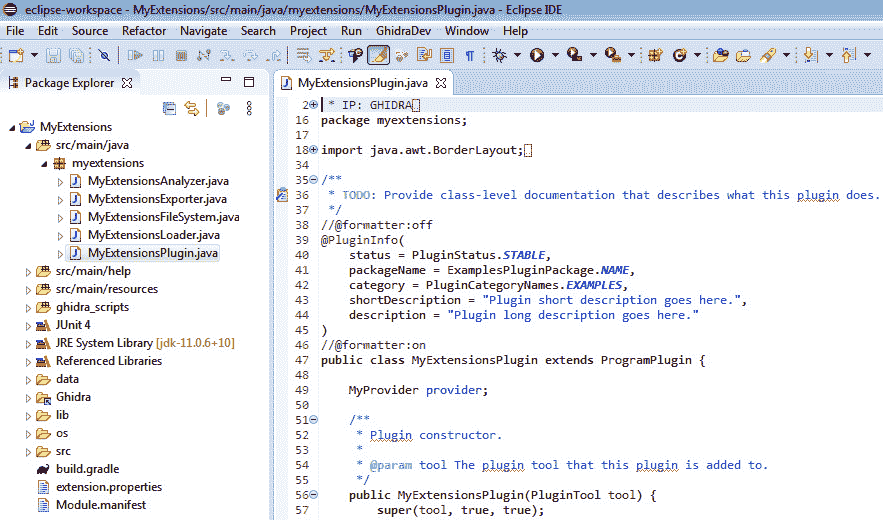

# 第四章：*第四章*：使用 Ghidra 扩展

在本章中，我们将介绍 Ghidra 扩展或模块。通过使用 Ghidra 扩展，您将能够根据需要将新功能集成到 Ghidra 中。

扩展是可选组件，可以通过实验性或用户贡献的 Ghidra 插件或分析器扩展 Ghidra 的功能。例如，使用扩展，您可以将其他工具集成到 Ghidra 中，如 Eclipse 或 IDA Pro。

我们将继续使用 Eclipse IDE 进行开发，但还需要安装 Gradle 以编译 Ghidra 扩展。Ghidra 程序及其扩展都已准备好使用 Gradle 进行构建。

通过开发扩展或模块（以前称为 contribs），您将能够对 Ghidra 项目做出更高的贡献（例如，增加与其他逆向工程工具的集成、支持新的文件格式和处理器等），而不仅仅是开发简单的插件。

最后，您将学习如何使用 Eclipse IDE 进行扩展开发，以及如何在开发过程结束后从 Eclipse 导出 Ghidra 扩展。

在本章中，我们将涵盖以下主要内容：

+   安装现有的 Ghidra 扩展

+   理解 Ghidra 扩展骨架

+   开发 Ghidra 扩展

# 技术要求

本章的要求如下：

+   针对 x86_64 架构的 Java JDK 11（可在此下载：[`adoptopenjdk.net/releases.html?variant=openjdk11&jvmVariant=hotspot`](https://adoptopenjdk.net/releases.html?variant=openjdk11&jvmVariant=hotspot)）

+   Java 开发人员版的 Eclipse IDE（任何支持 JDK 11 的版本，点击此链接下载：[`www.eclipse.org/downloads/packages/`](https://www.eclipse.org/downloads/packages/)），因为它是 Ghidra 官方集成并支持的 IDE

+   Gradle（编译 Ghidra 扩展所需的构建自动化工具）：[`gradle.org/install/`](https://gradle.org/install/)

+   PyDev 6.3.1（可在此下载：[`netix.dl.sourceforge.net/project/pydev/pydev/PyDev%206.3.1/PyDev%206.3.1.zip`](https://netix.dl.sourceforge.net/project/pydev/pydev/PyDev%206.3.1/PyDev%206.3.1.zip)）

假设您已经按照上一章的说明安装了 Java JDK 11、PyDev 6.3.1 和 Eclipse Java 开发人员版 IDE，您还需要一些额外的软件要求才能编译 Ghidra 扩展：[`gradle.org/next-steps/?version=5.0&format=bin`](https://gradle.org/next-steps/?version=5.0&format=bin)。

安装 Gradle 是一个简单的过程。它包括将 ZIP 文件解压到`C:\Gradle\`文件夹（按照官方安装文档的说明），然后设置`GRADLE_HOME`系统环境变量指向`C:\Gradle\gradle-5.0`，最后将`%GRADLE_HOME%\bin`添加到`PATH`系统环境变量中。

包含本章节所有必要代码的 GitHub 仓库可以在 [`github.com/PacktPublishing/Ghidra-Software-Reverse-Engineering-for-Beginners/tree/master/Chapter04`](https://github.com/PacktPublishing/Ghidra-Software-Reverse-Engineering-for-Beginners/tree/master/Chapter04) 中找到。

查看以下链接，观看“代码实践”视频：[`bit.ly/2VTiUfw`](https://bit.ly/2VTiUfw)

安装 Gradle 文档

有关安装 Gradle 的更多详细信息，请参阅官方在线文档：[`docs.gradle.org/current/userguide/installation.html`](https://docs.gradle.org/current/userguide/installation.html)。您也可以参考 Gradle ZIP 文件中的离线文档：`getting-started.html`。

# 安装现有的 Ghidra 扩展

Ghidra 扩展是扩展 Ghidra 功能的 Java 代码，作为可安装的包进行分发。Ghidra 扩展可以访问 Ghidra 的内部，允许它们自由扩展 Ghidra。

在安装 Ghidra 后，您可以在适当的 `ghidra_9.1.2\ Extensions\Ghidra` 文件夹中找到一些现成可用的扩展：

+   `ghidra_9.1.2_PUBLIC_20200212_GnuDisassembler.zip`

+   `ghidra_9.1.2_PUBLIC_20200212_sample.zip`

+   `ghidra_9.1.2_PUBLIC_20200212_SampleTablePlugin.zip`

+   `ghidra_9.1.2_PUBLIC_20200212_SleighDevTools.zip`

让我们看看安装这些现成扩展的步骤。请打开 `Chapter04` Ghidra 项目，`hello world.gpr`，并按照以下步骤操作：

1.  这些扩展可以通过点击 Ghidra 中的 `Extensions\Ghidra` 目录轻松安装。

1.  在勾选 **SampleTablePlugin** 并点击 **确定** 后，您将看到以下屏幕，这样您就可以确认已勾选该扩展：

    图 4.2 – 安装 SampleTablePlugin 后出现的“扩展已更改！”消息

1.  点击**确定**并手动重启 Ghidra 后，当通过 **工具** | **运行工具** | **代码浏览器** 打开 **CodeBrowser** 时，会弹出一个提示消息，询问是否配置插件：

    图 4.3 – 安装 SampleTablePlugin 并重启 Ghidra 后出现的“发现新插件！”消息

1.  通过肯定回答，我们可以趁机配置我们感兴趣的插件：

    图 4.4 – 样本表插件配置

1.  完成此步骤后，名为 **样本表提供者** 的新选项将出现在 **窗口** 菜单中：

    图 4.5 – 插件实现的样本表提供者窗口

1.  点击它，你将看到 Ghidra 的功能已经通过一个停靠窗口得到了扩展，允许你计算函数度量。在这种情况下，我在反汇编窗口中检查了`__main`函数。

    你可以使用**过滤器**选项在**符号树**窗格中轻松定位`__main`函数（注意它以两个`_`字符开头）：


图 4.6 – 使用符号树在反汇编中定位`__main`函数

运行针对`__main`的算法结果如下所示：


图 4.7 – 在 __main 函数上执行的示例表格提供器

在接下来的章节中，我们将分析这个 Ghidra 扩展的源代码。

## 分析示例表格提供器插件的代码

大多数 Ghidra 组件都是可扩展的，但在开发时，你必须首先决定你处理的项目类型：分析器、插件、加载器、文件系统或导出器。

在这种情况下，示例表格提供器由一个 Ghidra 插件扩展组成。插件扩展是一个从`ghidra.app.plugin.ProgramPlugin`类扩展的程序，使其能够处理最常见的程序事件，并实现 GUI 组件。

让我们查看`ghidra_9.1.2_PUBLIC_20200212_SampleTablePlugin.zip`中的`SampleTablePlugin\lib\SampleTablePlugin-src\ghidra\examples`目录下可用的代码。

示例表格提供器的插件部分由`SampleTablePlugin.java`文件实现，该类从`ghidra.app.plugin.ProgramPlugin`扩展，使你能够在与当前函数相关的事件发生时更新其内部`currentFunction`属性，正如在*第三章*中提到的，*Ghidra 调试模式*：

```
public class SampleTablePlugin extends ProgramPlugin {
```

```
    private SampleTableProvider provider;
```

```
    private Function currentF	unction;
```

由于`SampleTableModel.java`通过继承`ThreadedTableModelStub`实现了表格模型，`ThreadedTableModelStub`允许作为一行的抽象数据类型，这样你就可以定义一个自定义类来存储这些行。在这种情况下，行是其类为`FunctionStatsRowObject`的对象：

```
class SampleTableModel extends ThreadedTableModelStub<FunctionStatsRowObject> {
```

```
    private SampleTablePlugin plugin;
```

```
    SampleTableModel(SampleTablePlugin plugin) {
```

`FunctionStatsRowObject.java`类是一个包含行字段的 Java 类：

```
import ghidra.program.model.address.Address;
```

```
import ghidra.program.model.listing.Function;
```

```
public class FunctionStatsRowObject {
```

```
    private final Function function;
```

```
    private final String algorithmName;
```

```
    private int score;
```

```
    FunctionStatsRowObject(Function function, String algorithmName, int score) {
```

`SampleTableProvider.java`类负责在屏幕上绘制表格、填充内容，并定义与之交互时的行为：

```
public class SampleTableProvider extends ComponentProviderAdapter implements OptionsChangeListener {
```

```
    private SampleTablePlugin plugin;
```

```
    private JComponent component;
```

```
    private GFilterTable<FunctionStatsRowObject> filterTable;
```

```
    private SampleTableModel model;
```

```
    private List<FunctionAlgorithm> discoveredAlgorithms;
```

```
    private GCheckBox[] checkBoxes;
```

```
    private GhidraFileChooserPanel fileChooserPanel;
```

```
    private boolean resetTableData;
```

```
    public SampleTableProvider(SampleTablePlugin plugin) {
```

`FunctionAlgorithm.java`类定义了用于检索数据以填充表格的接口：

```
public interface FunctionAlgorithm extends ExtensionPoint {
```

```
    public int score(Function function, TaskMonitor monitor) throws CancelledException;
```

```
    public String getName();
```

```
}
```

最后，还有一些类允许你计算示例表格提供器中`Score`列的值：

+   `BasicBlockCount``erFunctionAlgorithm.java`

+   `FunctionAlgorithm.java`

+   `ReferenceFunctionAlgorithm.java`

+   `SizeFunctionAlgorithm.java`

例如，`SizeFunctionAlgorithm`类检索当前函数中包含的地址数量，以确定函数的大小。显然，检索的数据是通过 Ghidra API 调用获得的：

```
import ghidra.program.model.address.AddressSetView;
```

```
import ghidra.program.model.listing.Function;
```

```
import ghidra.util.task.TaskMonitor;
```

```
public class SizeFunctionAlgorithm implements FunctionAlgorithm {
```

```
    @Override
```

```
    public String getName() {
```

```
        return "Function Size";
```

```
    }
```

```
    @Override
```

```
    public int score(Function function, TaskMonitor monitor) {
```

```
        AddressSetView body = function.getBody();
```

```
        return (int) body.getNumAddresses();
```

```
    }
```

```
}
```

我们将在*第三部分*、*扩展 Ghidra*中深入探讨各种扩展的特点。

Ghidra 扩展继承

请记住，您可以在 Ghidra 的源代码中搜索您正在扩展的类：[`github.com/NationalSecurityAgency/ghidra/blob/master/Ghidra/Features/Base/src/main/java/ghidra/app/plugin/ProgramPlugin.java`](https://github.com/NationalSecurityAgency/ghidra/blob/master/Ghidra/Features/Base/src/main/java/ghidra/app/plugin/ProgramPlugin.java)。这些类有详细的注释，您还可以通过**帮助** | **Ghidra API 帮助**检查 Ghidra 自动生成的文档。

在本节中，您了解了什么是 Ghidra 扩展、它的内部工作原理以及从用户的角度看它在 Ghidra 中的表现。在下一节中，我们将介绍扩展的骨架。

# 理解 Ghidra 扩展骨架

在`ghidra_9.1.2\Extensions\Ghidra` Ghidra 扩展文件夹中，还有一个`skeleton`文件夹，其中包含五个位于`ghidra_9.1.2\Extensions\Ghidra\Skeleton\src\main\java\skeleton`的骨架源代码，这使我们能够编写任何类型的 Ghidra 扩展。

接下来，我们将通过概述其骨架来讨论不同类型的插件扩展。这些骨架可以从 Eclipse 中获取，我们稍后将在*开发 Ghidra 扩展*部分使用骨架创建一个扩展。

## 分析器

分析器使我们能够扩展 Ghidra 的代码分析功能。用于开发分析器的骨架可在`SkeletonAnalyzer.java`文件中找到，该文件扩展自`ghidra.app.services.AbstractAnalyzer`。

分析器骨架包含以下元素：

+   一个构造函数，表示分析器的名称、描述和分析器的类型。此外，在调用`super`之前，可以调用`setSupportOneTimeAnalysis`，以指示分析器是否支持：

    ```
    public SkeletonAnalyzer() {
            super("My Analyzer", "Analyzer description goes here", AnalyzerType.BYTE_ANALYZER);
    }
    ```

    分析器的类型可以是以下之一：`BYTE_ANALYZER`、`DATA_ANALYZER`、`FUNCTION_ANALYZER`、`FUNCTION_MODIFIERS_ANALYZER`、`FUNCTION_SIGNATURES_ANALYZER`、`INSTRUCTION_ANALYZER`或`ONE_SHOT_ANALYZER`。

+   `getDefaultEnablement`方法返回一个布尔值，指示该分析器是否将始终启用。

+   `canAnalyze`方法返回 true 表示程序可以被分析。您可以在这里检查，例如，您的分析器是否支持程序的汇编语言。

+   如果您希望让用户为分析器设置一些选项，则可以重写`registerOptions`方法。

+   最后，当程序中添加了内容时，所添加的方法将被调用以执行分析。

    分析器技巧

    如果您的分析器速度不够快，请不要让`getDefaultEnablement`返回 true，因为这可能会使 Ghidra 变慢。

分析器可以在分析 C++程序以获取面向对象编程信息时非常有用。

## 文件系统

文件系统允许我们扩展 Ghidra 以支持归档文件。归档文件的示例包括 APK、ZIP、RAR 等。用于开发文件系统的框架可以在`SkeletonFileSystem.java`文件中找到，它继承自`GFileSystem`。

文件系统框架由以下元素组成：

+   一个构造函数。它接收文件系统的根目录作为**文件系统资源定位符**（**FSRL**）和文件系统提供者作为参数。

+   文件系统的实现是复杂的。它包含以下方法：`mount`、`close`、`getName`、`getFSRL`、`isClosed`、`getFileCount`、`getRefManager`、`lookup`、`getInputStream`、`getListing`、`getInfo`和`getInfoMap`。

## 插件

插件使我们能够通过访问 GUI 和事件通知系统以多种方式扩展 Ghidra。开发插件的框架可以在`SkeletonPlugin.java`文件中找到，它继承自`ghidra.app.plugin.ProgramPlugin`。

插件框架由以下元素组成：

+   一个构造函数。它接收父工具作为参数，并允许我们自定义或移除插件的提供者和帮助。

+   一个`init`方法，允许我们在需要时获取服务。

+   它还包括一个扩展自`ComponentProvider`的提供者示例，使我们能够自定义 GUI 和操作。

    插件提示

    如果你想查看完整的服务列表，请在 Ghidra 的 Java 文档中搜索`ghidra.app.services`：`/api/ghidra/app/services/package-summary.html`。

如你所想，插件扩展非常灵活多样。

## 导出器

导出器允许我们通过实现导出 Ghidra 程序数据库中部分程序的能力来扩展 Ghidra。开发导出器的框架可以在`SkeletonExporter.java`文件中找到。

导出器框架由以下元素组成：

+   一个构造函数。它允许我们设置导出器的名称，并将文件扩展名与之关联。

+   还提供一个`getOptions`方法，用于定义自定义选项（如果需要）。

+   一个`setOptions`方法，用于为导出器分配自定义选项（如果存在）。

+   一个`export`方法，必须实现导出操作，并返回一个布尔值，表示操作是否成功。

一些预装的 Ghidra 导出器示例如下：`AsciiExporter`、`BinaryExporter`、`GzfExporter`、`HtmlExporter`、`IntelHexExporter`、`ProjectArchiveExporter`和`XmlExporter`。

## 加载器

加载器允许我们通过添加对新二进制代码格式的支持来扩展 Ghidra。二进制代码格式的示例包括`SkeletonLoader.java`文件，它继承自`AbstractLibrarySupportLoader`。

加载器框架由以下元素组成：

+   一个`getName`方法，必须重写以返回加载器的名称。

+   一个 `findSupportedLoadSpecs` 方法，必须返回一个 `ArrayList`，如果能够加载文件，则包含文件的规范。如果无法加载，则返回一个空的 `ArrayList`。

+   一个 `load` 方法，主要实现部分。它将从提供者加载字节到程序中。

+   如果加载器有自定义选项，则必须在 `getDefaultOptions` 方法中定义它们，并在 `validateOptions` 方法中进行验证。

在本节中，我们讨论了每种类型的 Ghidra 扩展的框架。可以根据需要修改任何框架，以帮助开发。在接下来的章节中，我们将介绍 Ghidra 扩展框架在 Eclipse 中的样子。

# 开发 Ghidra 扩展

在本节中，我们将介绍如何在 Eclipse 中创建 Ghidra 扩展，然后如何将其导出到 Ghidra：

1.  首先，要在 Eclipse 中创建一个新的 Ghidra 扩展，点击 **GhidraDev** | **新建** | **Ghidra 模块项目...**:

    图 4.8 – 创建新的 Ghidra 模块项目

1.  设置 Ghidra 项目的名称以及项目根目录。在此案例中，我将项目名称设置为 `MyExtensions`，并将其余参数保持为默认值：

    图 4.9 – 设置项目名称

1.  正如前一节所述，Ghidra 提供了一些模块模板。选择那些对您有用的模板。我们选择了所有模板，因为我们希望拥有所有的 Ghidra 模块框架。点击 **下一步 >**，而不是 **完成**，以进行两个额外且有用的步骤：

    图 4.10 – 选择此 Ghidra 模块项目所需的模块模板

1.  将 Ghidra 安装与您的模块项目关联。这是一个重要步骤，因为 Ghidra 模块将为此版本的 Ghidra 生成：

    图 4.11 – 将 Ghidra 安装与您的模块项目关联

1.  还可以通过点击 **启用 Python** 并选择 Jython 解释器来启用 Python：

    图 4.12 – 启用 Python 支持

    可以通过点击 **GhidraDev** | **链接 Ghidra...** 在以后任何时间配置 Ghidra 安装和 Python 支持：

    

    图 4.13 – 链接 Ghidra 安装并在任何时候启用 Python 支持（如果需要）

1.  使用 Eclipse IDE 开发 Ghidra 扩展：



图 4.14 – 使用 Eclipse IDE 开发 Ghidra 扩展

在开发完 Ghidra 扩展后，你可以使用以下步骤将其导出到 Ghidra：

1.  进入 **文件** | **导出…**，选择 **Ghidra 模块扩展**，然后点击 **下一步 >** 按钮：

    图 4.15 – 从 Eclipse 导出 Ghidra 模块扩展

1.  选择你要导出的 Ghidra 模块项目：

    图 4.16 – 选择要导出的 Ghidra 模块项目

1.  设置 Gradle 安装目录。如果你按照本章开头的步骤进行操作，它将保存在 `GRADLE_HOME` 环境变量中：


图 4.17 – 设置 Gradle 安装目录

点击 `dist` 目录后，你的 Ghidra 模块项目已经生成：


图 4.18 – 导出 Ghidra 扩展项目后的控制台输出

如前所述，生成的扩展仅对在模块项目创建时选择的 Ghidra 版本有效。

# 摘要

本章中，你学习了如何安装现有的 Ghidra 扩展，以及如何将新的扩展放入 Ghidra 中以便稍后安装。我们分析了一个示例插件 Ghidra 扩展的代码，还分析了各种类型 Ghidra 扩展的开发模板。最后，我们按照步骤在 Eclipse IDE 中创建了一个新的 Ghidra 模块项目，并介绍了如何将新项目导出到 Ghidra。

现在，你已经能够识别有用的扩展并安装它们。你也能够理解代码的工作原理，并在需要时进行修改和调整。当然，你现在也可以编写自己的 Ghidra 扩展，但你将在 *第三章*，*扩展 Ghidra* 中进一步提高这些技能。

在本书的下一章中，我们将介绍如何使用 Ghidra 进行恶意软件逆向工程，这是一个很好的机会，展示如何利用这些知识解决现实世界的挑战。

# 问题

1.  Ghidra 扩展与 Ghidra 脚本有什么区别？

1.  如果你正在分析一个用 C++ 开发的程序（这是一种面向对象的编程语言），什么样的 Ghidra 扩展可以帮助你识别类、方法等？

1.  正如你所知，Ghidra 扩展可以访问 Ghidra 内部，这非常强大。那么，写一个 Ghidra 扩展总比写一个 Ghidra 脚本更好吗？

# 进一步阅读

如果你想了解更多本章涉及的主题，可以查看以下书籍和链接：

+   Ghidra 高级开发课程：[`ghidra.re/courses/GhidraClass/AdvancedDevelopment/GhidraAdvancedDevelopment_withNotes.html#GhidraAdvancedDevelopment.html`](http://ghidra.re/courses/GhidraClass/AdvancedDevelopment/GhidraAdvancedDevelopment_withNotes.html#GhidraAdvancedDevelopment.html)

+   *Python 开发*，*Burkhard. A Meier*，*2016 年 11 月* [视频]：[`www.packtpub.com/eu/application-development/python-projects-video`](https://www.packtpub.com/eu/application-development/python-projects-video)

+   PyDev 官方手册：[`www.pydev.org/manual.html`](http://www.pydev.org/manual.html)

+   *Java 项目 - 第二版*，*Peter Verhas*，*2018 年 8 月*：[`www.packtpub.com/eu/application-development/java-projects-second-edition`](https://www.packtpub.com/eu/application-development/java-projects-second-edition)
