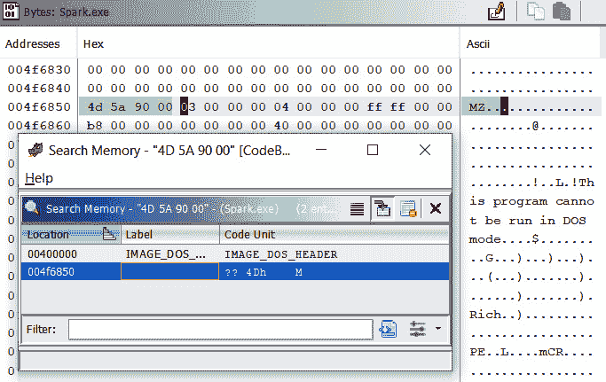
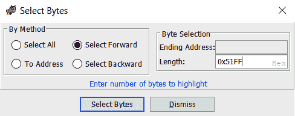
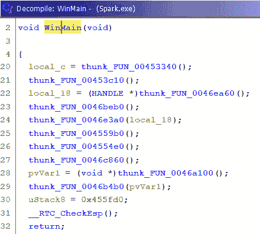
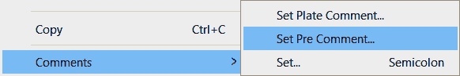
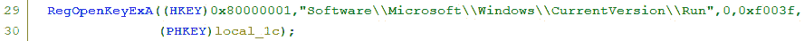
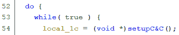

# 第五章：*第五章*：使用 Ghidra 逆向分析恶意软件

在本章中，我们将介绍使用 Ghidra 进行恶意软件的逆向工程。通过使用 Ghidra，您将能够分析包含恶意代码的可执行二进制文件。

本章是一个绝佳的机会，让您将*第一章*，《Ghidra 入门》和*第二章*，《使用 Ghidra 脚本自动化逆向工程任务》中的知识应用于实践。为了将这些知识付诸实践，我们将分析 Alina **销售点** (**PoS**) 恶意软件。该恶意软件基本上通过刮取 PoS 系统的内存来窃取信用卡和借记卡信息。

我们的方法将从设置安全的分析环境开始，然后我们将寻找恶意软件样本中的恶意软件指示符，最后，我们将通过使用 Ghidra 进行深入的恶意软件分析来结束。

在本章中，我们将覆盖以下主要主题：

+   设置环境

+   寻找恶意软件指示符

+   剖析有趣的恶意软件样本部分

# 技术要求

本章的要求如下：

+   VirtualBox，x86 和 AMD64/Intel64 虚拟化软件：[`www.virtualbox.org/wiki/Downloads`](https://www.virtualbox.org/wiki/Downloads)

+   VirusTotal，一种在线恶意软件分析工具，汇集了多种杀毒引擎和在线引擎进行扫描：[`www.virustotal.com/`](https://www.virustotal.com/)

本章所需的所有代码可以在以下 GitHub 仓库中找到：[`github.com/PacktPublishing/Ghidra-Software-Reverse-Engineering-for-Beginners/tree/master/Chapter05`](https://github.com/PacktPublishing/Ghidra-Software-Reverse-Engineering-for-Beginners/tree/master/Chapter05)

请查看以下链接，观看“Code in Action”视频：[`bit.ly/3ou4OgP`](https://bit.ly/3ou4OgP)

# 设置环境

在撰写本书时，Ghidra 的公开版本尚不支持二进制文件的调试。这将 Ghidra 的功能范围限制为静态分析，即分析文件时不执行它们。

但当然，Ghidra 的静态分析可以补充您选择的任何现有调试器（例如 x64dbg、WinDbg 和 OllyDbg）所执行的动态分析。这两种分析可以并行进行。

设置恶意软件分析环境是一个广泛的话题，因此我们将介绍使用 Ghidra 进行此目的的基础知识。请记住，设置恶意软件分析环境时的黄金法则是将其与您的计算机和网络隔离。即使您正在进行静态分析，建议还是设置一个隔离的环境，因为无法保证恶意软件不会利用某些 Ghidra 漏洞并最终执行。

CVE-2019-17664 和 CVE-2019-17665 Ghidra 漏洞

我发现 Ghidra 存在两个漏洞，当恶意软件文件名为 `cmd.exe` 或 `jansi.dll` 时，可能会导致意外执行。在撰写本书时，CVE-2019-17664 仍未修复：[`github.com/NationalSecurityAgency/ghidra/issues/107`](https://github.com/NationalSecurityAgency/ghidra/issues/107)。

为了分析恶意软件，你可以使用一台物理计算机（通过硬盘备份恢复到干净的状态）或者虚拟机。第一个选项更为现实，但恢复备份时速度较慢且成本更高。

你还需要隔离你的网络。一个好的例子是，在分析过程中勒索软件会加密共享文件夹。

让我们使用一个 VirtualBox 虚拟化环境，设置只读（出于安全原因）共享文件夹，以便从宿主机转移文件到虚拟机，并且不连接互联网，因为静态分析不需要网络连接。

然后，我们按照以下步骤进行：

1.  通过以下链接下载并安装 VirtualBox：[`www.virtualbox.org/wiki/Downloads`](https://www.virtualbox.org/wiki/Downloads)

1.  创建一个新的 VirtualBox 虚拟机，或者从 Microsoft 下载：[`aka.ms/windev_VM_virtualbox`](https://aka.ms/windev_VM_virtualbox)

1.  设置一个 VirtualBox 只读共享文件夹，允许你将文件从宿主机转移到虚拟机：[`www.virtualbox.org/manual/ch04.html#sharedfolders`](https://www.virtualbox.org/manual/ch04.html#sharedfolders)。

1.  将 Ghidra 及其所需的依赖项转移到虚拟机上，安装它，并且还要转移你打算分析的恶意软件。

此外，你还可以转移你自己的一套 Ghidra 脚本和扩展。

# 寻找恶意软件指示符

正如你可能记得的那样，Ghidra 通过包含零个或多个文件的项目来工作。Alina 恶意软件由两个组件组成：一个 Windows 驱动程序（`rt.sys`）和一个便携式可执行文件（`park.exe`）。因此，一个包含这两个组件的压缩 Ghidra 项目（`alina_ghidra_project.zip`）可以在本书为此创建的相关 GitHub 项目中找到。

如果你想直接获得 Alina 恶意软件样本，而不是 Ghidra 项目，你也可以在 GitHub 项目中找到它（`alina_malware_sample.zip`），它已被压缩并使用密码 `infected` 保护。这种共享恶意软件的方式很常见，以避免它被意外感染。

接下来，我们将尝试快速猜测我们正在处理的恶意软件的大致类型。为此，我们将寻找字符串，很多情况下它们可以揭示有用的信息。我们还会检查外部来源，如果恶意软件已经被分析或分类，这些信息可能会很有用。最后，我们将通过查找**动态链接库**（**DLL**）函数来分析它的功能。

## 寻找字符串

我们先打开 Ghidra 项目，双击 Ghidra 项目中的 `park.exe` 文件，然后使用 `park.exe` 外部分析它，因为它是恶意软件，您的系统可能会被感染。一个好的起点是列出文件中的字符串。我们将去 **搜索** | **查找字符串...** 开始分析：

图 5.1 – 在 park.exe 中发现的一些有趣的字符串

如上图所示，用户 `Benson` 似乎编译了这个恶意软件。这些信息可能对调查该恶意软件的归属有所帮助。这里有很多可疑的字符串。

例如，很难想象一个合法程序会引用 `windefender.exe`。此外，`SHELLCODE_MUTEX` 和 **系统服务分派表**（**SSDT**）的挂钩引用显然是恶意的。

系统服务分派表

SSDT 是针对 32 位 Windows 操作系统的内核例程的地址数组，或者是针对 64 位 Windows 操作系统的相对偏移数组，用于相同的例程。

对程序字符串的快速概览有时可以揭示它是否为恶意软件，无需进一步分析。简单且强大。

## 情报信息和外部资源

使用外部资源（如情报工具）调查发现的信息也是很有用的。例如，在下面的截图中，我们通过查找字符串识别出了两个域名，这些域名可以通过 VirusTotal 进一步调查：

图 5.2 – 字符串中找到的两个域名

要在 VirusTotal 中分析一个 URL，请访问以下链接，输入域名，然后点击放大镜图标继续：[`www.virustotal.com/gui/home/url`](https://www.virustotal.com/gui/home/url)：

图 5.3 – 查找要分析的 URL

搜索结果是动态的，可能会随时变化。在这种情况下，这两个域名在 VirusTotal 中均产生了正面结果。结果可以在以下链接查看：[`www.virustotal.com/gui/url/422f1425108ae35666d2f86f46f9cf565141cf6601c6924534cb7d9a536645bc/detection:`](https://www.virustotal.com/gui/url/422f1425108ae35666d2f86f46f9cf565141cf6601c6924534cb7d9a536645bc/detection)

图 5.4 – 字符串中找到的两个域名

此外，VirusTotal 还可以提供更多有用的信息，您可以通过浏览页面找到这些信息。例如，它检测到 `javaoracle2.ru` 域名也被其他可疑文件引用：

图 5.5 – 引用 javaoracle2.ru 的恶意软件威胁

在分析恶意软件时，建议在开始分析之前先查看公共资源，因为它可以为你提供许多有用的信息，帮助你找到分析的起点。

如何查找恶意软件指示

在寻找恶意软件指示时，不仅要寻找用于恶意目的的字符串，还要注意异常情况。恶意软件通常容易被识别，原因有很多：某些字符串永远不会出现在良性文件中，且代码可能被人为地复杂化。

还可以通过检查文件的导入项来调查其功能。

## 检查导入函数

由于该二进制文件引用了一些恶意服务器，它必须实现某种网络通信。在这种情况下，通信是通过 HTTP 协议进行的，以下导入函数位于 Ghidra 的 CodeBrowser **符号树**窗口中：

图 5.6 – 与 HTTP 通信相关的导入项

查看`ADVAPI32.DLL`，我们可以识别出名为**Reg***的函数，这些函数允许我们操作 Windows 注册表，而其他提到**Service**或**SCManager**的函数则允许我们与 Windows 服务控制管理器交互，从而加载驱动程序：

图 5.7 – 与 Windows 注册表和服务控制管理器相关的导入项

`KERNEL32.DLL`中有很多导入项，因此，它允许我们与命名管道、文件和进程进行交互并执行相关操作：

图 5.8 – HTTP 通信

运行时导入项

记住，运行时导入的库和/或在运行时解析的函数不会列出在**符号树**中，因此要注意程序的功能可能并没有被完全识别。

通过非常快速的分析，我们已经识别出了很多东西。如果你有经验，你会知道恶意软件的代码模式，从而通过将 API 函数与字符串相匹配，轻松推测恶意软件在给定前面所示信息时会尝试做什么。

# 剖析有趣的恶意软件样本部分

如前所述，这个恶意软件由两个组件组成：一个可执行文件（`park.exe`）和一个 Windows 驱动文件（`rk.sys`）。

当计算机上发现多个恶意文件时，通常其中一个会生成其他恶意文件。由于`park.exe`可以通过双击执行，而`rk.sys`必须由另一个组件加载，如 Windows 服务控制管理器或其他驱动程序，我们可以初步假设是`park.exe`被执行后，将`rk.sys`写入磁盘。实际上，在我们对导入项的静态分析过程中，我们注意到`park.exe`具有处理 Windows 服务控制管理器的 API。如以下截图所示，该文件以如下模式开始：`4d 5a 90 00`。这些起始字节也常用作文件的签名，这些签名也被称为魔术数字或魔术字节。在本例中，签名表明该文件是可执行文件（Portable Executable，适用于 32 位和 64 位 Windows 操作系统中的可执行文件、目标代码、DLL 等文件格式）：

图 5.9 – rk.sys 文件概览

通过计算起始地址和结束地址之间的差值，我们获得了文件的大小，即`0x51ff`，这一值稍后将用于提取嵌入在`park.exe`中的`rk.sys`文件。使用 Python 解释器进行这个简单的计算是个不错的主意：

图 5.10 – rk.sys 文件大小

然后，我们打开`park.exe`，并通过点击`4D 5A 90 00`模式来查找文件。点击**搜索所有**以查看所有出现的实例：

图 5.11 – 查找 PE 头部

你将看到该头部模式出现两次。第一次对应我们正在分析的文件头部，即`park.exe`，而第二次则对应嵌入的`rk.sys`文件：

图 5.12 – 在 park.exe 中发现的 PE 头部

如我们现在所知，它从`0x004f6850`地址开始，且如前面使用 Python 解释器计算得到的那样，大小为`0x51FF`字节，我们可以通过点击**选择** | **字节...**，输入要选择的字节长度，从当前地址开始，最后点击**选择字节**来选择这些字节：

图 5.13 – 在 park.exe 内选择 rk.sys 文件

通过右键点击选定的字节并选择**提取并导入...**，也可以使用 *Ctrl* + *Alt* + *I* 快捷键，我们将看到以下界面，其中包含选定字节的数据文件被添加到项目中：

图 5.14 – 数据块作为 *.tmp 文件被添加到项目中

我们识别了所有恶意软件组件。现在，让我们从程序的入口点开始分析这些恶意软件。

## 入口点函数

让我们分析 `park.exe`。我们通过 **符号树** 中的 `entry` 函数来打开它并进行分析：

图 5.15 – 入口点函数

这个函数的反编译结果很容易阅读。`__security__init_cookie` 是一个由编译器引入的内存损坏保护函数，因此继续分析 `__tmainCRTStartup`，双击它。这里有很多 Ghidra 已识别的函数，所以我们集中分析唯一一个尚未识别的函数 – `thunk_FUN_00455f60`：

图 5.16 – 未识别的 WinMain 函数

这是程序的主函数。如果你有一定的 C++ 背景，你也会注意到 `__wincmdln` 初始化了一些全局变量、环境以及进程堆，然后调用了 `WinMain` 函数。因此，紧跟在 `__wincmdln` 后面的 `thunk_FUN_00455f60` 函数就是 `WinMain` 函数。让我们通过按下 *L* 键并聚焦在 `thunk_FUN_00455f60` 上，将 `thunk_FUN_00455f60` 重命名为 `WinMain`：

图 5.17 – 将 thunk_FUN_00455f60 函数重命名为 WinMain

Ghidra 允许你重命名变量和函数，加入注释，并在多个方面修改反汇编和反编译代码。这在逆向工程恶意软件时至关重要：

图 5.18 – 省略了一些无关代码（第 5–19 行）的 WinMain 函数

我们采取这些步骤来确定恶意软件的启动位置，并从头分析其流程，但反编译代码列表中有一些我们不清楚的函数。因此，我们的任务是揭示这些函数的功能，以便理解恶意软件。

请记住，恶意软件分析是一项耗时的任务，因此不要在细节上浪费时间，但也不要忽视任何重要内容。接下来，我们将分析 `WinMain` 反编译代码中列出的每个函数。我们将从分析第一个函数开始，它位于第 `20` 行，名为 `thunk_FUN_00453340`。

## 分析 0x00453340 函数

我们将从分析第一个函数 `thunk_FUN_00453340` 开始：

图 5.19 – FUN_00453340 函数的部分代码

它通过 `operator_new` 创建一个类，然后调用其构造函数：`thunk_FUN_0044d440`。

在这个函数中，你会看到一些 Windows API 调用。接下来，你可以重命名（按下 *L* 键）局部变量，使代码更加可读：

图 5.20 – 重命名函数参数 computerName

你可以根据微软文档来执行此操作（[`docs.microsoft.com/en-us/windows/win32/api/winbase/nf-winbase-getcomputernamea`](https://docs.microsoft.com/en-us/windows/win32/api/winbase/nf-winbase-getcomputernamea)）：

图 5.21 – 在微软文档中查找 API 信息

实际上，也可以通过点击 **编辑函数签名** 完全修改一个函数：

图 5.22 – 编辑函数签名

在这种情况下，这个函数是 `strcpy`，它将 `errorretriving` 字符串复制到 `computerName` 字符串的末尾（当执行到这一行时，`computerName` 的值为 `NULL`）。然后，我们可以根据其名称和参数修改签名。

我们还可以修改函数的调用约定。这很重要，因为某些关键细节依赖于调用约定：

+   参数是如何传递给函数的（通过寄存器或压入栈中）

+   指定被调用函数或调用函数有责任清理堆栈

请参考下面的截图，查看 `thunk_FUN_004721f0` 是如何被重命名为 `strcpy` 的：

图 5.23 – 函数签名编辑器

我们还可以在第 `105` 行设置以下前置注释 – `0x1a = CSIDL_APPDATA`：

图 5.24 – 设置前置注释

这表明 `SHGetFolderPathA` 的第二个参数代表 `%APPDATA%` 目录：

图 5.25 – 反编译代码中的前置注释

经过一些分析后，你会注意到这个函数会将恶意软件的一个 RC4 加密副本作为 `windefender.exe` 保存到 `%APPDATA%\ntkrnl\` 目录下。

## 分析 0x00453C10 函数

有时候，反编译的代码不正确并且不完整，因此也需要检查反汇编列表。在这种情况下，我们处理的是一个表示要删除的文件的字符串列表，但在反编译的代码中并没有显示：

图 5.26 – 显示字符串列表

该函数通过删除这些文件来清除之前的感染。正如你所看到的，恶意软件尝试使用合法程序的名称来伪装自己。让我们将这个函数重命名为 `cleanPreviousInfections`，然后继续处理其他函数。

## 分析 0x0046EA60 函数

该函数创建了一个名为 `\\\\.\\pipe\\spark` 的管道，这是一个 **进程间通信**（**IPC**）机制：

图 5.27 – 创建命名管道

进程间通信

IPC 是一种机制，允许进程之间相互通信并同步它们的操作。这些进程之间的通信可以视为它们之间的协作方法。

由于创建了命名管道，我们可以预期看到恶意软件组件之间使用它进行某种通信。

## 分析 0x0046BEB0 函数

这个函数设置了命令和控制的 URL：

图 5.28 – 命令和控制域名及端点

## 分析 0x0046E3A0 函数

## 通过分析这个函数，我们注意到管道用于某种同步。`CreateThread` API 函数接收的参数是要作为线程执行的函数和传递给该函数的参数；因此，当线程创建出现时，我们必须分析一个新函数——在这种情况下是 `lpStartAddress_00449049`：

图 5.29 – 每 30 秒保持恶意软件的存在

有趣的是，一个无限循环每隔 `30000` 毫秒（30 秒）迭代一次，执行持久化操作。让我们分析一下 `thunk_FUN_00454ba0` 函数：

图 5.30 – 通过 Run 注册表键实现持久化

它正在打开 `Run` 注册表键，当 Microsoft Windows 用户会话启动时会执行该键。这通常被恶意软件用来保持感染，因为每次计算机启动时都会执行它。我们将此函数重命名为 `persistence`。

## 分析 0x004559B0 函数

该函数通过服务控制管理器 API（如 `OpenSCManagerA` 或 `OpenServiceA`）处理服务：

图 5.31 – 使用服务控制管理器打开服务

在重命名后，我们注意到它检查用户是否具有创建服务所必需的管理员权限。如果有，它会删除先前的 rootkit 实例（rootkit 是一种允许我们隐藏系统元素的应用程序：进程、文件等……但在这种情况下是恶意软件元素），将 rootkit 写入磁盘，并最终再次创建一个带有 rootkit 的服务。如您所见，服务被命名为 `Windows Host Process`，而 rootkit 安装在 `%APPDATA%`（如果不可用，则为 `C:\`）并命名为 `rk.sys`：

图 5.32 – 安装 rootkit，但如果存在，则删除先前的 rootkit

因此，我们将此函数重命名为 `installRookit`。

## 分析 0x004554E0 函数

它试图打开 `explorer.exe` 进程，该进程应该是用户的 shell：

图 5.33 – 打开 explorer.exe

如你所见，它创建了一个互斥量，这是一个同步机制，并防止`explorer.exe`进程被打开两次。互斥量的名称非常有特点，且是硬编码的。我们可以将其用作`7YhngylKo09H`。

在分析恶意软件时，有些代码模式和 API 序列像一本打开的书：

图 5.34 – 将代码注入到 explorer.exe 进程

在这种情况下，你可以看到以下内容：

+   `VirtualAllocEx`：为`explorer.exe`进程分配`0x3000`字节的内存，`0x40`标志表示`PAGE_EXECUTE_READWRITE`（允许在此处写入和执行代码）

+   `WriteProcessMemory`：将恶意代码写入`explorer.exe`

+   `CreateRemoteThread`：在`explorer.exe`进程中创建一个新线程以执行代码。

我们可以将`thunk_FUN_004555b0`重命名为`injectShellcodeIntoExplorer`。

我们现在理解了它的参数：

+   用于注入代码的 explorer 进程处理器

+   注入代码的指针（也就是 shellcode）

+   注入代码的大小是`0x616`字节

    Shellcode

    "shellcode"这个术语最早用于描述目标程序由于漏洞利用而执行的代码，用来打开远程 Shell——即命令行解释器的一个实例——以便攻击者能够利用该 Shell 进一步与受害者的系统进行交互。

通过双击**shellcode**参数，我们可以看到 shellcode 的字节，但按下*D*键，我们也可以将其转换为代码：

图 5.35 – 将 shellcode 转换为代码以便用 Ghidra 分析

通过点击一些`shellcode`字符串，你可以看到按程序使用的相同顺序存储的字符串，因此你可以通过读取这些字符串推断程序的行为：

图 5.36 – 通过读取字符串快速分析代码

我们有一个加密的恶意软件副本，存储在`%APPDATA%\ntkrnl`中，这点从之前的分析中得知。它使用密码`7YhngylKo09H`解密。然后，创建一个`windefender.exe`解密的恶意软件，并通过`ShellExecuteA`最终执行。这个过程在一个由互斥量机制控制的无限循环中执行，如最后的字符串`SHELLCODE_MUTEX`所示。

Mutex

互斥量对象是一种同步对象，其状态可以是非信号或信号的，具体取决于它是否被某个线程拥有。

因此，我们可以将`thunk_FUN_004554e0`重命名为`explorerPersistence`。

## 分析 0x0046C860 函数

在使用`operator_new`初始化类后，调用它的`thunk_FUN_0046c2c0`构造函数。如你所见，我们有一个线程需要分析：

图 5.37 – 线程创建

`lpStartAddress_00447172`函数包含一个无限循环，它调用我们分析过的`setupC&C`函数，因此我们可以预期会有一些**命令与控制**（**C&C**）通信。C&C 是控制并接收来自恶意软件样本信息的服务器。它由攻击者管理：

图 5.38 – C&C 通信循环

让我们点击其中一个函数字符串，看看会发生什么。我们还可以将其变为美化版。点击**创建数组…**选项，通过选择这些字节并右键单击它来连接空字节：

图 5.39 – 将数据转换为类型和结构

它似乎是用于 C&C 通信的 HTTP 参数字符串，因为使用此协议非常常见。最相关的字符串是`cardinterval`。cardinterval 是什么意思？

图 5.40 – C&C 通信 HTTP 参数

我们将这个函数重命名为`C&Ccommunication`，然后继续处理下一个函数。

## 分析 0x0046A100 函数

再次，我们看到一个`thunk_FUN_00464870`构造函数调用`lpStartAddress_04476db`线程函数。让我们将注意力集中在线程函数上：

图 5.41 – 数学函数

这个函数有点复杂。我们可以看到很多数学运算，由此产生了许多数字数据类型。不要浪费时间！将其重命名为`mathAlgorithm`，如果需要，稍后再回来处理。

下一个函数遍历进程，并使用`__stricmp`函数跳过黑名单中的进程，该黑名单包含 Windows 进程和常见应用程序。我们可以推测它在寻找一个非常见应用程序：

图 5.42 – 黑名单进程

通过分析位于`FUN_0045c570`中的`lpStartAddress0047299`线程函数，我们注意到它在抓取进程内存，寻找某些东西：

图 5.43 – 读取进程内存

它首先通过`VirtualQueryEx`获取内存区域权限，并检查该区域是否处于`MEM_IMAGE`状态，这表示该区域内的内存页面已映射到图像段的视图中。它还会保护`PAGE_READWRITE`。

然后，它调用`ReadProcessMemory`来读取内存，最后在`FUN_004607c0`中查找信用卡号码：

图 5.44 – 内存抓取过程

如你所见，`local_28`变量的大小为`0x10`字节（`0x10`代表信用卡号的 16 位数字），其首字节与数字`3`进行比较，正如我使用 Python 解释器打印的表格所示。该恶意软件在抓取过程中实现了 Luhn 算法，用于验证信用卡号的校验和：

](img/B16207_05_045.jpg)

图 5.45 – WinMain 中的重命名函数

Luhn 算法使得可以通过控制码（称为校验和，即数字的某种表示形式）检查数字（在这种情况下是信用卡号）。如果某个字符被误读或写错，Luhn 算法将会检测到这个错误。

Luhn 算法因 Mastercard、**美国运通**（**AmEx**）、Visa 及所有其他信用卡都使用它而广为人知。

# 总结

在本章中，你学习了如何使用 Ghidra 分析恶意软件。我们分析了功能丰富的 Alina POS 恶意软件，涉及的功能包括管道、线程、`ring0` rootkit、shellcode 注入和内存抓取。

你还学到了坏人是如何通过网络犯罪活动每天赚钱的。换句话说，你了解了卡片技术。

在本书的下一章中，我们将介绍如何通过脚本化恶意软件分析来提高分析速度和效果，特别是提升我们对 Alina POS 恶意软件的分析。

# 问题

1.  在恶意软件分析过程中，便携式可执行文件的导入信息提供了什么样的内容？通过结合`LoadLibrary`和`GetProcAddress` API 函数可以做些什么？

1.  处理 C++程序时，反汇编是否可以以某种方式得到改进？

1.  在将代码注入到另一个进程中与在当前进程中执行代码相比，恶意软件注入代码有什么好处？

# 进一步阅读

你可以参考以下链接获取本章所涵盖主题的更多信息：

+   在本章的分析中，我们并没有使用 Ghidra 的所有功能。查看以下 Ghidra 备忘单，获取更多细节：[`ghidra-sre.org/CheatSheet.html`](https://ghidra-sre.org/CheatSheet.html)

+   *学习恶意软件分析*，*Monnappa K A*，*2018 年 6 月*：[`www.packtpub.com/eu/networking-and-servers/learning-malware-analysis`](https://www.packtpub.com/eu/networking-and-servers/learning-malware-analysis)

+   Alina，最新的 POS 恶意软件 – PandaLabs 分析：[`www.pandasecurity.com/en/mediacenter/pandalabs/alina-pos-malware/`](https://www.pandasecurity.com/en/mediacenter/pandalabs/alina-pos-malware/)

+   *恶意软件分析基础*，*Munir Njenga*，*2018 年 3 月* [视频]：[`www.packtpub.com/networking-and-servers/fundamentals-malware-analysis-video`](https://www.packtpub.com/networking-and-servers/fundamentals-malware-analysis-video)

+   混合分析 – 分析和检测已知威胁：[`www.hybrid-analysis.com/?lang=es`](https://www.hybrid-analysis.com/?lang=es)
