# 第六章：*第六章*：脚本化恶意软件分析

在本章中，我们将应用 Ghidra 的脚本能力进行恶意软件分析。通过使用和编写 Ghidra 脚本，你将能够更加高效地分析恶意软件。

你将学习如何静态解析 Alina shellcode 中使用的 Kernel32 API 哈希函数，该函数在上一章中进行了表面分析。

Flat API 是 Ghidra API 的*简化*版，但功能强大。它们是任何想要开发 Ghidra 模块和/或脚本的人的绝佳起点。

我们将通过将 Ghidra Flat API 函数分类来开始，以便在查找函数时更加得心应手。接下来，我们将学习如何使用 Java 和 Python 遍历代码，最后，我们将使用上述代码进行恶意软件的去混淆。

去混淆是将一个难以理解的程序转化为一个简单、易懂、直观的程序。现有工具可以将复杂的代码或程序转换为简单易懂的形式。混淆通常是为了防止逆向工程，使得恶意意图的人难以理解程序的内在功能。同样，混淆也可以用来隐藏软件中的恶意内容。去混淆工具用于逆向工程这些程序。虽然去混淆总是可能的，但攻击者通常试图利用以下的不对称性：混淆所需的努力较小，而去混淆则需要大量的努力。

本章将涵盖以下主要内容：

+   使用 Ghidra 脚本 API

+   使用 Java 编程语言编写脚本

+   使用 Python 编程语言编写脚本

+   使用脚本去混淆恶意软件样本

# 技术要求

本章的代码可以在[`github.com/PacktPublishing/Ghidra-Software-Reverse-Engineering-for-Beginners/tree/master/Chapter06`](https://github.com/PacktPublishing/Ghidra-Software-Reverse-Engineering-for-Beginners/tree/master/Chapter06)找到。

查看以下链接，观看《代码实战》视频：[`bit.ly/36RZOMQ`](https://bit.ly/36RZOMQ)

# 使用 Ghidra 脚本 API

Ghidra 脚本 API 分为 Flat API（`ghidra.app.decompiler.flatapi`）和其他函数（[`ghidra.re/ghidra_docs/api/overview-tree.html`](http://ghidra.re/ghidra_docs/api/overview-tree.html)），后者更为复杂。

Flat API 是 Ghidra API 的简化版，总结起来，它允许你执行以下操作：

+   这些函数允许你处理内存地址：`addEntryPoint`、`addInstructionXref`、`createAddressSet`、`getAddressFactory` 和 `removeEntryPoint`。

+   使用这些函数进行代码分析：`analyze`、`analyzeAll`、`analyzeChanges`、`analyzeAll` 和 `analyzeChanges`。

+   使用以下函数清除代码列表：`clearListing`。

+   以下函数允许你声明数据：`createAsciiString`、`createAsciiString`、`createBookmark`、`createByte`、`createChar`、`createData`、`createDouble`、`createDWord`、`createDwords`、`createEquate`、`createUnicodeString`、`removeData`、`removeDataAt`、`removeEquate`、`removeEquate` 和 `removeEquates`。

+   使用以下函数从内存地址获取数据：`getInt`、`getByte`、`getBytes`、`getShort`、`getLong`、`getFloat`、`getDouble`、`getDataAfter`、`getDataAt`、`getDataBefore`、`getLastData`、`getDataContaining`、`getUndefinedDataAfter`、`getUndefinedDataAt`、`getUndefinedDataBefore`、`getMemoryBlock`、`getMemoryBlocks` 和 `getFirstData`。

+   以下函数允许你处理引用：`createExternalReference`、`createStackReference`、`getReference`、`getReferencesFrom`、`getReferencesTo` 和 `setReferencePrimary`。

+   这些函数允许你处理数据类型：`createFloat`、`createQWord`、`createWord`、`getDataTypes` 和 `openDataTypeArchive`。

+   使用以下函数将值设置到某个内存地址：`setByte`、`setBytes`、`setDouble`、`setFloat`、`setInt`、`setLong` 和 `setShort`

+   这些函数允许你创建代码片段：`getFragment`、`createFragment`、`createFunction`、`createLabel`、`createMemoryBlock`、`createMemoryReference`、`createSymbol`、`getSymbol`、`getSymbols`、`getSymbolAfter`、`getSymbolAt`、`getSymbolBefore`、`getSymbols` 和 `getBookmarks`。

+   使用以下函数进行字节反汇编：`disassemble`。

+   这些函数允许你处理事务：`end` 和 `start`。

+   如果你想查找值，可以使用以下函数：`find`、`findBytes`、`findPascalStrings` 和 `findStrings`。

+   以下函数允许你在函数级别进行操作：`getGlobalFunctions`、`getFirstFunction`、`getFunction`、`getFunctionAfter`、`getFunctionAt`、`getFunctionBefore`、`getFunctionContaining` 和 `getLastFunction`。

+   以下函数允许你在程序级别进行操作：`getCurrentProgram`、`saveProgram`、`set` 和 `getProgramFile`。

+   以下函数允许你在指令级别进行操作：`getFirstInstruction`、`getInstructionAfter`、`getInstructionAt`、`getInstructionBefore`、`getInstructionContaining` 和 `getLastInstruction`。

+   这些函数允许你处理等式：`getEquate` 和 `getEquates`。

+   如果你想删除某个内容，可以使用以下函数：`removeBookmark`、`removeFunction`、`removeFunctionAt`、`removeInstruction`、`removeInstructionAt`、`removeMemoryBlock`、`removeReference` 和 `removeSymbol`。

+   这些函数允许你处理注释：`setEOLComment`、`setPlateComment`、`setPostComment`、`setPreComment`、`getPlateComment`、`getPostComment`、`getPreComment`、`getEOLComment` 和 `toAddr`。

+   使用以下函数对字节进行反编译：`FlatDecompilerAPI`、`decompile` 和 `getDecompiler`。

+   最后，其他一些杂项函数：`getMonitor`、`getNamespace` 和 `getProjectRootFolder`。

这个参考资料在你开始使用 Ghidra 脚本时非常有用，可以帮助你识别所需的函数并在文档中查找原型。

# 使用 Java 编程语言编写脚本

正如你从上一章中了解到的，Alina 恶意软件包含注入到 `explorer.exe` 进程中的 shellcode。如果你想解混淆 shellcode 中的 Kernel32 API 函数调用，你需要识别调用指令。你还需要过滤这些函数，以便只提取所需的内容，最后，当然，你需要进行解混淆：

```
01\. Function fn = getFunctionAt(currentAddress);
```

```
02\. Instruction i = getInstructionAt(currentAddress);
```

```
03\. while(getFunctionContaining(i.getAddress()) == fn){
```

```
04.     String nem = i.getMnemonicString();
```

```
05.     if(nem.equals("CALL")){
```

```
06.         Object[] target_address = i.getOpObjects(0);
```

```
07.         if(target_address[0].toString().equals("EBP")){
```

```
08.             // Do your deobfuscation here.
```

```
09.         }
```

```
10.     }
```

```
11.     i = i.getNext();
```

```
12\. }
```

让我逐行解释这段代码是如何工作的：

1.  它获取包含当前地址（聚焦地址）的函数（第`01`行）。

1.  当前地址的指令也被获取（第`02`行）。

1.  执行从当前指令到函数末尾的循环（第`03`行）。

1.  获取指令的助记符（第`04`行）。

1.  它检查助记符是否对应于 `CALL` 指令，这是我们感兴趣的指令类型（第`05`行）。

1.  还会检索指令操作数（第`06`行）。

1.  由于混淆的调用与存在哈希表的 `EBP` 地址相关，我们检查 `EBP` 是否是一个操作数（第`07`行）。

1.  解混淆过程必须在这一行实现（第`08`行）。

1.  检索下一条指令（第`11`行）。

在本节中，你学习了如何使用 Java 语言和 Ghidra API 编写脚本。在下一节中，你将学习如何使用 Python 完成相同的任务，我们将比较这两种语言在 Ghidra 脚本编写中的应用。

# 使用 Python 编程语言编写脚本

如果我们使用 Python 重写解混淆代码框架，代码如下：

```
01\. fn = getFunctionAt(currentAddress)
```

```
02\. i = getInstructionAt(currentAddress)
```

```
03\. while getFunctionContaining(i.getAddress()) == fn:
```

```
04.     nem = i.getMnemonicString()
```

```
05.     if nem == "CALL":
```

```
06.         target_address = i.getOpObjects(0)
```

```
07.         if target_address[0].toString()=='EBP':
```

```
08.             # Do your deobfuscation here.
```

```
09.     i = i.getNext()
```

如你所见，它与 Java 相似，不需要额外的解释。

开发 Ghidra 脚本时，并不需要记住所有函数。唯一重要的是明确你想做什么，并定位所需的资源，如文档，以便找到正确的 API 函数。

Python 是一门很棒的语言，拥有一个活跃的社区，开发了大量的库和工具。如果你想快速编写代码，Python 是一个不错的选择。不幸的是，Ghidra 没有实现纯 Python 支持，Ghidra 主要是用 Java 实现的，然后通过 Jython 移植到 Python。

理论上，你可以选择使用 Python 或 Java，但实际上，Jython 存在一些问题：

+   Jython 依赖于已废弃的 Python 2.x。

+   有时，一些代码在 Java 中按预期工作，但在 Jython 中却不起作用。以下是一些例子：

    - [`github.com/NationalSecurityAgency/ghidra/issues/1890`](https://github.com/NationalSecurityAgency/ghidra/issues/1890)

    - [`github.com/NationalSecurityAgency/ghidra/issues/1608`](https://github.com/NationalSecurityAgency/ghidra/issues/1608)

由于这里提到的因素，你可以决定是否使用更稳定的语言（如 Java）或更快但稍微不稳定的语言（如 Python）来编写脚本。请随意评估这两种选择并做出决定！

# 使用脚本对恶意软件样本进行去混淆

在上一章中，我们展示了 Alina 如何将 shellcode 注入到 `explorer.exe` 进程中。我们通过简单地读取字符串来分析这一过程，这是一种快速且实用的方法，但我们可以更准确地进行分析。让我们聚焦于一些 shellcode 的细节。

## 增量偏移

在注入代码时，它被放置在开发时未知的位置。因此，数据不能通过绝对地址访问；相反，必须通过相对位置访问。shellcode 在运行时检索当前地址。换句话说，它检索 `EIP` 寄存器。

`EIP` 寄存器在 x86 架构（32 位）中的作用是指向下一个要执行的指令；因此，它控制程序的执行流程。它决定了下一条要执行的指令。

但是，由于 `EIP` 寄存器是通过控制转移指令、中断和异常间接控制的，无法直接访问，因此它通过恶意软件执行以下技术来恢复：

1.  执行一个 `CALL` 指令，指向 5 字节远的地址。因此，调用会执行两个更改：

    - 它将返回地址（下一条指令的地址）推入堆栈，该地址为 `0x004f6105`：

    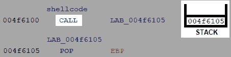

    图 6.1 – CALL 指令将返回地址推入堆栈

    - 它将控制权转移到目标地址：

    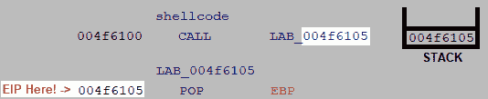

    图 6.2 – CALL 指令将控制流转移到目标地址

1.  然后，它通过 `POP EBP` 恢复堆栈中存储的地址。该指令执行以下操作：

    - 它移除堆栈上最新推入的值：

    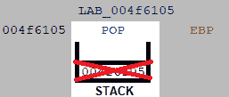

    图 6.3 – POP 指令移除堆栈上最新推入的值

    - 它将值存储到目标寄存器中，此处为 `EBP`：

    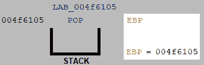

    图 6.4 – POP 指令将移除的堆栈值存储到目标 EBP 寄存器

1.  最后，它从 `EBP` 寄存器中减去 `0x5` 单位，以获取存储在 `EBP` 中的 `EIP` 值（即我们在执行 `CALL` 指令时的值，而非当前的值）：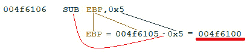

图 6.5 – SUB 指令从 EBP 寄存器中减去 5 个单位

通过使用这个技巧，恶意软件开发者可以通过`EBP`寄存器（shellcode 的起始地址）加上偏移量来引用数据值。使用这种技术，生成的代码是位置无关的；无论将 shellcode 放置在哪个位置，它都会正常工作。

你可以通过以下代码片段检查这一点：

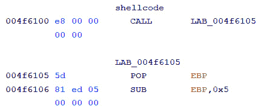

图 6.6 – 存储在 EBP 寄存器中的增量偏移量，用于位置无关代码

这个技巧通常被称为`0x5e2`，它是相对于 shellcode 起始地址的偏移量：

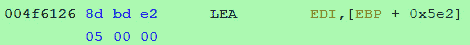

图 6.7 – 存储 API 哈希表的基地址

之后，一个函数负责将 Kernel32 API 函数的哈希值替换为函数地址，从而允许你从程序中调用它。

一旦替换完成，很多调用就通过这个哈希表的偏移量进行，这个哈希表现在已经被转换为一个 API 地址表：

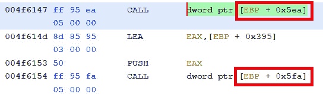

图 6.8 – 通过相对偏移量调用已解析的 API 函数

如你所见，反汇编显示了指向`EBP`相对偏移量的`CALL`指令。更希望看到被调用函数的名称。我们提升反汇编以显示函数名的目标是这样的，但是作为第一步，在下一部分，你将学习如何将 API 哈希替换为它们相应的 API 函数地址。

## 翻译 API 哈希为地址

以下函数负责用对应的函数地址替换函数的哈希值：

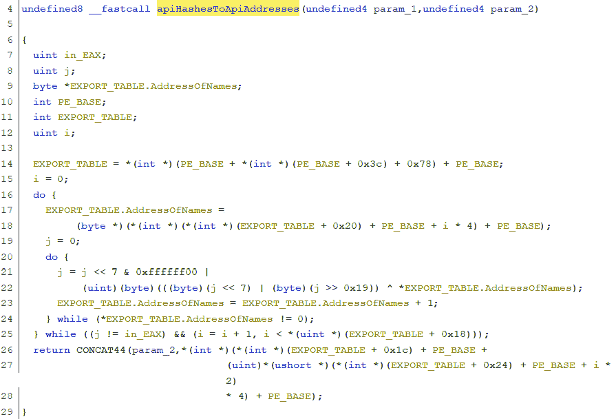

图 6.9 – 负责用地址替换函数哈希表的函数

之前的代码遍历了每个 API 名称，这些名称从`kernel32.dll`库的导出表的`AddressOfNames`部分提取出来。

如果你有分析可移植执行文件（Portable Executable，PE）格式的背景，识别上述功能就很容易了，因为代码中的一些偏移量非常显眼。让我们来看一下在之前的`apiHashesToApiAdresses`反汇编中显示的偏移量和可移植执行文件格式字段之间的对应关系：

+   `0x3c` 对应于 `e_lfanew` 字段，表示**相对虚拟地址**（**RVA**）的可移植执行文件头。

+   `0x78` 是导出表的 RVA。

+   `0x20` 是指向导出表的名称指针表的 RVA。

+   `0x1c` 是指向导出表的地址表的 RVA。

+   `0x24` 是指向导出表的顺序表的 RVA。

+   `0x18` 是名称数量的 RVA，这是循环迭代的最大次数。

*图 6.9*中的第`21`行和第`22`行是去混淆代码的关键部分。在这些行中，对于 API 的每个字符，都会应用一系列逻辑操作。这些操作可以很容易地转化为 Python 代码，如以下 Python shell 命令所示：

```
>>> apiname = "lstrlenW"
```

```
>>> hash = 0
```

```
>>> for c in apiname:
```

```
...     hash = hash << 7 & 0xffffff00 | ( (0xFF&(hash << 7)) | (0xFF&(hash >> 0x19)) ^ ord(c))
```

```
...
```

```
>>> print(hex(hash))
```

```
0x2d40b8f0L
```

让我澄清这四条 Python 命令：

1.  我们将`lstrlenW`字符串存储在`apiname`变量中，因为我们要计算它的哈希值。通过这种方式，我们正在对一个真实的`kernel32.dll` API 名称测试我们的 Python 代码。

1.  我们将`hash`值初始化为`0`。这是此哈希算法的第一步。

1.  我们遍历`lstrlenW`字符串中的每个字符（变量`c`），同时根据哈希算法更新`hash`变量的值。

1.  最后，我们使用十六进制表示法打印哈希值。请注意，哈希值末尾的`L`字符表示长整型数据类型，并不属于哈希的一部分。

当然，提到的代码也可以转换成 Java：

```
class AlinaAPIHash {
```

```
	public static void main(String args[]) {
```

```
		int hash = 0;
```

```
		String apiName = "lstrlenW";
```

```
		for (int i=0; i<apiName.length(); i++) {
```

```
			hash = (hash << 7 &
```

```
                        0xFFFFFF00 | hash << 7 &
```

```
                        0xFF | hash >> 0x19 &
```

```
                        0xFF ^ apiName.charAt(i)
```

```
                 );
```

```
			System.out.println(String.format("0x%08X",
```

```
                                                 hash)
```

```
                 );
```

```
		}
```

```
		System.out.println(String.format("0x%08X", hash))
```

```
	}
```

```
}
```

在本节中，你了解了 API 哈希如何工作，并且学习了如何将算法从汇编语言转换为 Python 和 Java。在下一节中，我们将使用提到的代码来解析被调用函数的名称，并将其添加到反汇编列表中。

## 使用 Ghidra 脚本去混淆哈希表

在自动去混淆程序之前，我们需要`Kernel32.dll`导出的 API 函数名称的完整列表。你可以在专门的 GitHub 仓库中找到以下脚本（`get_kernel32_exports.py`），它使用 Python 的`pefile`模块来实现这一目的：

```
01 import pefile
```

```
02 pe=pefile.PE("c:\windows\system32\kernel32.dll")
```

```
03 exports=set()
```

```
04 for exp in pe.DIRECTORY_ENTRY_EXPORT.symbols:
```

```
05    exports.add(exp.name.encode('ascii'))
```

这个列出的代码执行了以下操作：

1.  导入`pefile`模块，允许解析便携式可执行文件格式，这是微软 Windows 操作系统中用于可执行文件、目标代码、DLL 等的 32 位和 64 位版本的文件格式。

1.  将解析后的`Kernel32.dll`便携式可执行文件的实例存储在`pe`中

1.  创建一个空的`Kernel32.dll`导出函数集合

1.  遍历`Kernel32.dll`导出的函数

1.  检索导出函数的名称（使用 ASCII 字符编码）并将其添加到**exports**集合中。

前面脚本生成的结果是一个包含 Kernel32 导出函数的集合，如以下部分输出所示：

```
exports = set(['GetThreadPreferredUILanguages', 'ReleaseMutex', 'InterlockedPopEntrySList', 'AddVectoredContinueHandler', 'ClosePrivateNamespace', … ])
```

最后，我们可以将所有部分组合在一起，从而自动化解决哈希 Kernel32 API 地址的任务：

```
01\. from ghidra.program.model.symbol import SourceType
```

```
02\. from ghidra.program.model.address.Address import *
```

```
03\. from struct import pack
```

```
04.
```

```
05\. exports = set(['GetThreadPreferredUILanguages', 'ReleaseMutex', 'InterlockedPopEntrySList', 'AddVectoredContinueHandler', 'ClosePrivateNamespace', 'SignalObjectAndWait', …])
```

```
06\. def getHash(provided_hash):
```

```
07.     for apiname in exports:
```

```
08.         hash = 0
```

```
09.         for c in apiname:
```

```
10.             hash = hash << 7 & 0xffffff00 | ( (0xFF&(hash << 7)) | (0xFF&(hash >> 0x19)) ^ ord(c))
```

```
11.             if(provided_hash==pack('<L', hash)):
```

```
12.                 return apiname
```

```
13.     return ""
```

```
14\. fn = getFunctionAt(currentAddress)
```

```
15\. i = getInstructionAt(currentAddress)
```

```
16\. while getFunctionContaining(i.getAddress()) == fn:
```

```
17.     nem = i.getMnemonicString()
```

```
18.     if nem == "CALL":
```

```
19.         target_address = i.getOpObjects(0)
```

```
20.         if target_address[0].toString()=='EBP':
```

```
21.             current_hash = bytes(pack('<L', getInt(currentAddress.add(int(target_address[1].toString(),16)))))
```

```
22.             current_function_from_hash = getHash(current_hash)
```

```
23.             setEOLComment(i.getAddress(), current_function_from_hash)
```

```
24.             print(i.getAddress().toString() + " " + nem + "[EBP + "+target_address[1].toString()+ "]" + " -> " + current_function_from_hash)
```

```
25.     i = i.getNext()
```

总结一下，我们正在做以下操作：

1.  我们在第`05`行声明了 Kernel32 API 名称的集合。

1.  我们正在寻找与提供的哈希值匹配的 API 名称，位于第`06`行。

1.  我们在第`14`行到第`20`行之间遍历函数，寻找混淆的调用。

1.  最后，我们在第`23`行和第`24`行分别设置了一个注释并打印了函数的名称。

脚本的执行会在反汇编列表中产生以下变化（关于调用函数的注释）：

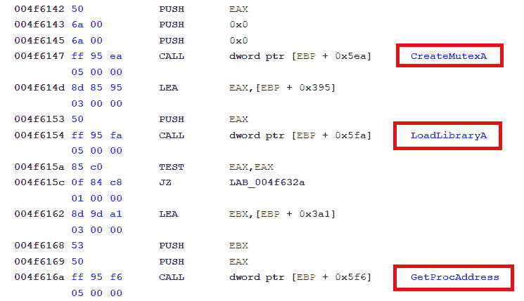

图 6.10 – 脚本生成的注释，指示已解析的 Kernel32 API 函数

显示函数名称总比什么都不显示好，但显示符号更好，因为它们不仅引用函数，还显示了函数名称。在接下来的部分，你将看到如何添加这个改进。

## 改进脚本结果

你还可以通过向其中添加必要的 Kernel32 符号来改善结果。例如，你可以在**符号树**窗口中查找`CreateFileA`符号：

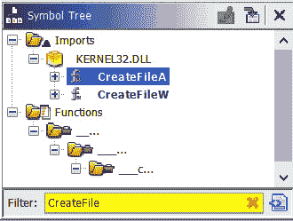

图 6.11 – 查找 CreateFileA 符号

将此符号附加到当前程序，并通过双击它访问函数地址：

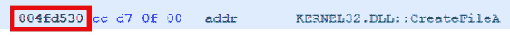

图 6.12 – 查找 CreateFileA API 地址

然后，使用*Ctrl* + *Shift* + *G*键组合修补`CALL`指令：

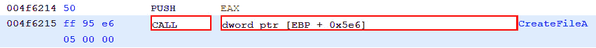

图 6.13 – 编辑 CALL 指令

使用之前获得的`CreateFileA`地址修补它：

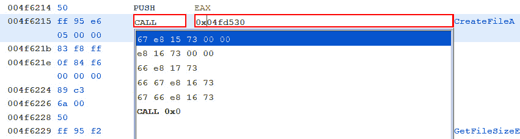

图 6.14 – 使用目标 CreateFileA API 地址修补 CALL 指令

按下*R*键，并将此引用设置为`INDIRECTION`：

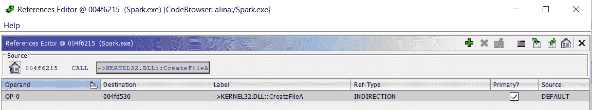

图 6.15 – 修改 CALL 地址引用类型为 INDIRECTION

经过此修改后，代码被更改，允许 Ghidra 在分析代码时识别函数参数、识别对函数的引用等，这总比添加注释要好。在下方的截图中，你可以看到修改后的反汇编清单：

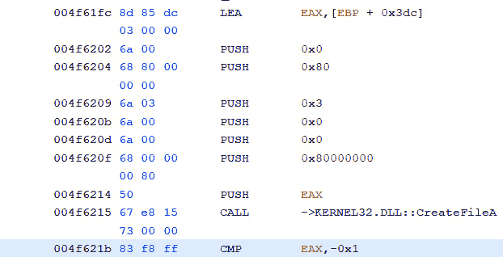

图 6.16 – 使用符号而非注释的反汇编清单

如你所见，在分析恶意软件时，脚本非常有用，因为诸如字符串去混淆、解析 API 地址、代码去混淆等重复性任务，可以通过编写几行简单的代码来完全自动化。

此外，你写的脚本越多，你的效率就会越高，你也可以在未来的脚本和项目中复用更多代码。

# 总结

在本章中，你学习了如何使用脚本在使用 Ghidra 分析恶意软件时提高效率。我们已经使用脚本突破静态分析的局限，解决了一些在运行时计算的 API 函数哈希值。

你还学到了在开发脚本时使用 Python 或 Java 的优缺点。

你学会了如何将汇编语言算法转换为 Java 和 Python，并且在开发第一个极为有用的脚本时，还学到了脚本编写技能。通过使用提供的 Ghidra Flat API 函数分类，你现在可以快速识别自己脚本所需的 Ghidra API 函数，而无需记住或浪费时间查找文档中的函数。

在本书的下一章中，我们将介绍 Ghidra 的无头模式，它在一些情况下非常有用，例如分析大量二进制文件或单独使用 Ghidra 将其与其他工具集成。

# 问题

1.  给定一个内存地址，哪个 Ghidra Flat API 允许你设置位于该内存地址的字节？描述你在寻找这个函数时遵循的步骤。

1.  Ghidra 最佳支持的编程语言是什么？Ghidra 如何支持 Python？

1.  是否可以静态分析那些在运行时解决的问题？

# 进一步阅读

你可以参考以下链接以获取更多关于本章涉及话题的信息：

+   Ghidra 脚本课程：[`ghidra.re/courses/GhidraClass/Intermediate/Scripting_withNotes.html#Scripting.html`](https://ghidra.re/courses/GhidraClass/Intermediate/Scripting_withNotes.html#Scripting.html)

+   *Java 基础知识*，*Gazihan Alankus, Rogério Theodoro de Brito, Basheer Ahamed Fazal 等人*，*2019 年 3 月*：[`www.packtpub.com/eu/application-development/java-fundamentals`](https://www.packtpub.com/eu/application-development/java-fundamentals)

+   *Python 自动化食谱*，*Jaime Buelta*，*2020 年 5 月*：[`www.packtpub.com/eu/programming/python-automation-cookbook-second-edition`](https://www.packtpub.com/eu/programming/python-automation-cookbook-second-edition)
