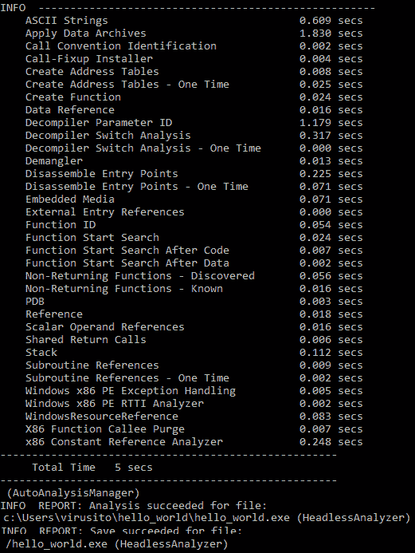
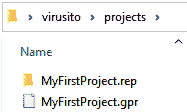
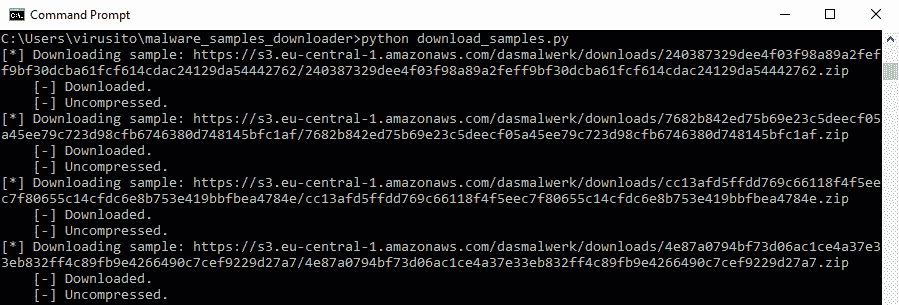
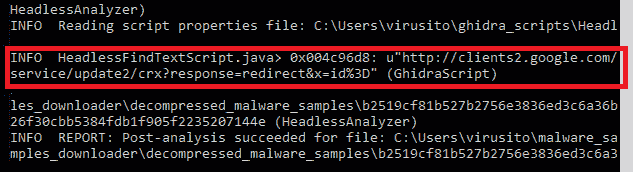
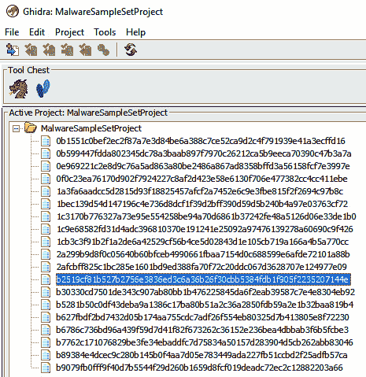
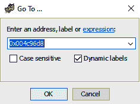
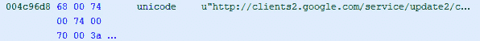

# 第七章：*第七章*：使用 Ghidra 无头分析器

在本章中，你将了解 Ghidra 的非 GUI 功能，这些功能在分析多个二进制文件、自动化任务或将 Ghidra 与其他工具集成时非常有用。

你可能看过一些电影，里面的黑客使用黑色终端和绿色字体。这种刻板印象是有一定事实依据的。GUI 应用程序很美观，用户友好且直观，但它们也很慢。在分析 Ghidra 无头模式之后，你将学到为什么 shell 应用程序和基于命令行的工具在许多情况下是最有效的解决方案。

无头分析器是 Ghidra 的一个强大的基于命令行（非 GUI）版本，本章将介绍它。

在本章中，我们将学习为什么基于命令行的工具在许多情况下非常有用。我们将学习如何使用无头模式来填充项目，以及如何对现有的二进制文件进行分析。我们还将学习如何使用 Ghidra 无头分析器在项目中运行非 GUI 脚本（以及不使用 GUI 功能的 GUI 脚本）。

本章将涵盖以下主题：

+   为什么使用无头模式？

+   创建和填充项目

+   对导入或现有二进制文件进行分析

+   在项目中运行非 GUI 脚本

# 技术要求

本章的代码可以在 [`github.com/PacktPublishing/Ghidra-Software-Reverse-Engineering-for-Beginners/tree/master/Chapter07`](https://github.com/PacktPublishing/Ghidra-Software-Reverse-Engineering-for-Beginners/tree/master/Chapter07) 找到。

查看以下链接，观看《代码实战》视频：[`bit.ly/3oAM6Uy`](https://bit.ly/3oAM6Uy)

# 为什么使用无头模式？

正如前面所说，非 GUI 应用程序可以让你工作得更快，因为通常来说，写一个命令比执行 GUI 操作（如点击菜单选项、填写表单然后提交）要快。

另一方面，非 GUI 应用程序可以很容易与脚本集成，使你能够将一个过程应用于多个二进制文件，将应用程序与其他工具集成，等等。

假设你正在使用 Ghidra 分析一些恶意软件，然后你识别出一个包含 **命令与控制**（**C&C**） URL 的加密字符串，指向控制恶意软件的服务器。然后，你需要提取成千上万个恶意软件样本的 C&C URL，以便对域名进行沉没，换句话说，以便停用成千上万个恶意软件样本。

鉴于这种情况，将每个恶意软件样本加载到 Ghidra 中并查找 C&C URL 不是一个选项，即使你已经开发了一个脚本来解密 C&C URL，因为它将消耗比必要更多的时间。在这些情况下，你将需要使用 Ghidra 无头模式。

Ghidra 无头模式可以通过位于 Ghidra`support`目录中的`analyzeHeadless.bat`和`analyzeHeadless`脚本（分别适用于 Microsoft Windows 和 Linux/macOS 操作系统）启动。命令语法如下：

```
analyzeHeadless <project_location> <project_name>[/<folder_path>] | ghidra://<server>[:<port>]/<repository_name>[/<folder_path>]
```

```
    [[-import [<directory>|<file>]+] | [-process [<project_file>]]]
```

```
    [-preScript <ScriptName> [<arg>]*]
```

```
    [-postScript <ScriptName> [<arg>]*]
```

```
    [-scriptPath "<path1>[;<path2>...]"]
```

```
    [-propertiesPath "<path1>[;<path2>...]"]
```

```
    [-scriptlog <path to script log file>]
```

```
    [-log <path to log file>]
```

```
    [-overwrite]
```

```
    [-recursive]
```

```
    [-readOnly]
```

```
    [-deleteProject]
```

```
    [-noanalysis]
```

```
    [-processor <languageID>]
```

```
    [-cspec <compilerSpecID>]
```

```
    [-analysisTimeoutPerFile <timeout in seconds>]
```

```
    [-keystore <KeystorePath>]
```

```
    [-connect [<userID>]]
```

```
    [-p]
```

```
    [-commit ["<comment>"]]
```

```
    [-okToDelete]
```

```
    [-max-cpu <max cpu cores to use>]
```

```
    [-loader <desired loader name>]
```

如你所见，Ghidra 无头模式既可以处理单独的项目，也可以处理共享项目，这些项目必须指定为`server`存储库 URL，并使用`ghidra://`协议。

Ghidra 无头模式文档

如果你想了解更多关于 Ghidra 无头模式的细节和参数，请查看包含在 Ghidra 程序发行版中的离线文档：[`ghidra.re/ghidra_docs/analyzeHeadlessREADME.html`](https://ghidra.re/ghidra_docs/analyzeHeadlessREADME.html)。

本章将讨论大多数 Ghidra 无头模式参数，但更详尽的信息可在 Ghidra 无头模式文档中找到。

# 创建并填充项目

使用 Ghidra 无头模式可以执行的最简单操作是创建一个包含二进制文件的项目。

正如我们在*第一部分*中所做的，*Ghidra 入门*，让我们创建一个新的空项目（我将其命名为`MyFirstProject`，并将其放在`C:\Users\virusito\projects`目录中），该项目包含一个名为`hello_world.exe`的*hello world*二进制文件。

注意

请注意，`C:\Users\virusito\projects`目录必须存在，因为它不会为你自动创建。另一方面，`MyFirstProject`将由 Ghidra 创建，因此你不需要手动创建它。

还要注意，如果在命令中包含可选的`[/<folder_path>]`文件夹路径，则导入的内容将位于该项目文件夹下。

请执行以下命令来创建位于`C:\Users\virusito\projects`目录中的`MyFirstProject` Ghidra 项目：

```
C:\ghidra_9.1.2\support>mkdir c:\Users\virusito\projects
```

```
C:\ghidra_9.1.2\support>analyzeHeadless.bat
```

```
C:\Users\virusito\projects MyFirstProject –import C:\Users\virusito\hello_world\hello_world.exe
```

你将看到以下输出：



图 7.1 – 使用 Ghidra 无头模式创建 Ghidra 项目

如输出的`INFO`部分所示，已对`hello_world.exe`文件进行了分析。你可以通过在前面的命令中添加`–noanalysis`标志来省略分析。此 Ghidra 无头模式命令的结果是以下项目：



图 7.2 – 使用 Ghidra 无头模式创建的 Ghidra 项目

你也可以通过使用通配符一次添加多个二进制文件：

+   `*`匹配一系列字符

+   `?`匹配单个字符

+   `[a-z]`匹配一个字符范围

+   `[!a-z]`匹配当字符范围不出现时

例如，我们可以创建一个名为`MyFirstProject`的项目，包含`hello_world`目录中所有的可执行文件：

```
C:\ghidra_9.1.2\support> analyzeHeadless.bat C:\Users\virusito\projects MyFirstProject -import C:\Users\virusito\hello_world\*.exe
```

还可以指定一些有趣的标志：

+   包含`-recursive`标志以分析子文件夹。

+   包括`-overwrite`标志以在项目中存在冲突时覆盖现有文件。

+   包括`-readOnly`标志以不将导入的文件保存到项目中。

+   包括`-deleteProject`标志以在脚本和/或分析完成后删除项目。

+   包括`-max-cpu <max cpu cores to use>`标志以限制无头处理期间使用的 CPU 核心数。

+   包括`-okToDelete`标志以允许程序在`-process`模式下处理时删除项目的二进制文件。以下选项允许您控制程序处理方式：

    - 使用`HeadlessContinuationOption.ABORT`来中止执行此脚本后执行的脚本或分析。

    - 使用`HeadlessContinuationOption.ABORT_AND_DELETE`作为`HeadlessContinuationOption.ABORT`，但也删除当前（现有的）程序。

    - 使用`HeadlessContinuationOption.CONTINUE_THEN_DELETE`在处理后删除（现有的）程序。

    - 使用`HeadlessContinuationOption.CONTINUE`来进行分析和/或运行脚本。

+   包括`-loader <desired loader name>`以强制使用特定加载器导入文件。

+   包括`-processor <languageID>`和/或`-cspec <compilerSpecID>`以指示处理器信息和/或编译器规范。可用的语言和编译器规范都位于`ghidra_x.x\Ghidra\Processors\proc_name\data\languages\*.ldefs`目录中。

+   包括`-log <path to log file>`以将用户的分析和非脚本日志信息从`application.log`目录文件更改为给定的日志文件路径。

在本节中，您学习了如何使用无头模式创建项目并将其与二进制文件填充。在下一节中，您将学习如何对 Ghidra 项目的二进制文件执行分析。

# 在导入或现有二进制文件上执行分析

如前所述，在创建项目时，默认执行分析。另一方面，您还可以使用以下参数运行预处理/后处理脚本（这些类型的脚本将在本节后面讨论）和/或分析给定项目：

```
-process [<project_file>]	
```

例如，您可以对位于`MyFirstProject`中的`hello_world.exe`文件执行分析：

```
C:\ghidra_9.1.2\support> analyzeHeadless.bat C:\Users\virusito\projects MyFirstProject -process hello_world.exe
```

当执行此命令时，您当然也可以使用通配符和/或`-recursive`标志。

```
C:\ghidra_9.1.2\support> analyzeHeadless.bat C:\Users\virusito\projects MyFirstProject -process '*.exe'
```

注意

在导入文件时，请确保指定的项目在 Ghidra GUI 中尚未打开。

还要考虑到，批量导入时，以`.`开头的文件将被忽略。

除了分析单个文件或一组文件之外，您还可以运行针对这些文件的脚本。

实际上，您正在运行的脚本类型是根据分析时间命名的：

+   **前处理脚本**：这些类型的脚本将在分析之前执行。语法如下：

    ```
    -preScript <ScriptName.ext> [<arg>]* 
    ```

+   **后处理脚本**：这些类型的脚本将在分析之后执行。语法如下：

    ```
    -postScript <ScriptName.ext> [<arg>]*
    ```

执行前/后脚本时，如你在语法中所见，你只需要提供脚本的名称，而不是完整路径。这是因为脚本会在 `$USER_HOME/ghidra_scripts` 中进行查找。你可以通过配置用 `;` 字符分隔的路径列表来修改此行为：

```
-scriptPath "$GHIDRA_HOME/Ghidra/Features/Base/ghidra_scripts;/myscripts"
```

还请注意，对于 Linux 系统，你需要转义反斜杠字符：

```
-scriptPath "\$GHIDRA_HOME/Ghidra/Features/Base/ghidra_scripts;/myscripts"
```

路径必须以 `$GHIDRA_SCRIPT`（对应 Ghidra 安装目录）或 `$GHIDRA_HOME`（对应用户主目录）开头。

设置分析超时

你可以设置分析超时，以便在分析花费太长时间时中断分析。为此，请使用以下语法：`-analysisTimeoutPerFile <超时秒数>`。

当达到超时时，分析会被中断，后续脚本会按计划执行。后续脚本可以通过 `getHeadlessAnalysisTimeoutStatus()` 方法检查分析是否被中断。

也可以指定一些有趣的选项：

+   设置 `*.properties` 文件所在的路径，这些文件由脚本或次级子脚本使用。请注意，路径必须以 `$GHIDRA_SCRIPT` 开头：

    ```
    -propertiesPath "<path1>[;<path2>…]"
    ```

+   设置脚本日志信息的输出路径：

    ```
    –scriptlog <path to script log file>
    ```

现在你了解了 Ghidra 中有哪些脚本，接下来，我们将讨论如何在 Ghidra 项目中实现并运行它们。

# 在项目中运行非图形界面脚本

如前所述，你可以使用 Ghidra 的无头模式在文件分析之前和之后运行脚本（分别为前脚本和后脚本）。

如你所知，非图形界面脚本无需人工交互，因此建议编写一个扩展自 `HeadlessScript` 类的无头脚本，同时它也扩展自已经熟悉的 `GhidraScript` 类。

但扩展自 `HeadlessScript` 不是必须的。你可以直接编写一个扩展自 `GhidraScript` 类的图形界面脚本，当在无头模式下运行时也能正常工作，但如果调用了一些特定于 GUI 的方法，则会抛出 `ImproperUseException`。

反过来也有类似的情况。当一个扩展自 `HeadlessScript` 的脚本在 Ghidra 的图形界面模式下运行时，如果调用了一个仅限 `HeadlessScript` 的方法，也会抛出异常。

让我们适配一个现有的 Ghidra 脚本，当前它扩展自 `GhidraScript`，使其扩展自 `HeadlessScript`，并观察它是如何工作的，以及它如何在实践中发挥作用（为简洁起见，`Apache License, Version 2.0` 头部已省略）：

```
//Prompts the user for a search string and searches the 
```

```
//program listing for the first occurrence of that string.
```

```
//@category Search
```

```
import ghidra.app.script.GhidraScript;
```

```
import ghidra.program.model.address.Address;
```

```
public class FindTextScript extends GhidraScript {
```

```
    /**
```

```
     * @see ghidra.app.script.GhidraScript#run()
```

```
     */
```

```
    @Override
```

```
    public void run() throws Exception {
```

```
		if (currentAddress == null) {
```

```
			println("NO CURRENT ADDRESS");
```

```
			return;
```

```
		}
```

```
		if (currentProgram == null) {
```

```
			println("NO CURRENT PROGRAM");
```

```
			return;
```

```
		}
```

```
        String search = askString("Text Search", "Enter search string: ");
```

```
        Address addr = find(search);
```

```
        if (addr != null) {
```

```
            println("Search match found at "+addr);
```

```
            goTo(addr);
```

```
        }
```

```
        else {
```

```
            println("No search matched found.");
```

```
        }
```

```
    }
```

```
}
```

我们可以进行以下可选修改：

+   将 `import ghidra.app.script.GhidraScript` 替换为 `ghidra.app.util.headless.HeadlessScript`。

+   继承自 `HeadlessScript` 而不是 `GhidraScript`。

+   将 `FindTextScript` 类重命名为 `HeadlessFindTextScript`。

我们需要执行以下强制修改：

+   要将参数传递给 `askXxx()` 方法（如 `askString()`），你需要创建一个 `*.properties` 文件。因此，让我们创建一个 `HeadlessFindTextScript.properties` 文件，其中包含所需的字符串：

    ```
    #
    # This is the HeadlessFindTextScript.properties file
    #
    Text Search Enter search string: = http://
    ```

+   输出字符串值，而不仅仅是其地址：

    ```
    String addrValue = getDataAt(addr).getDefaultValueRepresentation();
    println("0x" + addr + ": " + addrValue);
    ```

这是在对原始脚本应用上述修改后的结果（`Apache License, Version 2.0` 头部已省略以简化展示）：

```
//Prompts the user for a search string and searches the
```

```
//program listing for the first occurrence of that string.
```

```
//@category Search
```

```
import ghidra.app.script.GhidraScript;
```

```
import ghidra.app.util.headless.HeadlessScript;
```

```
import ghidra.program.model.address.Address;
```

```
public class HeadlessFindTextScript extends GhidraScript {
```

```
    /**
```

```
     * @see ghidra.app.script.GhidraScript#run()
```

```
     */
```

```
    @Override
```

```
    public void run() throws Exception {
```

```
        if (currentAddress == null) {
```

```
            println("NO CURRENT ADDRESS");
```

```
            return;
```

```
        }
```

```
        if (currentProgram == null) {
```

```
            println("NO CURRENT PROGRAM");
```

```
            return;
```

```
        }
```

```
        String search = askString("Text Search", "Enter search string: ");
```

```
        Address addr = find(search);
```

```
        if (addr != null) {
```

```
            String addrValue = getDataAt(addr).getDefaultValueRepresentation();
```

```
            println("0x" + addr + ": " + addrValue);
```

```
            goTo(addr);
```

```
        }
```

```
        else {
```

```
            println("No search matched found.");
```

```
        }
```

```
    }
```

```
}
```

现在，我们可以尝试将这个后处理脚本应用于一组随机的恶意软件样本。**请确保在继续阅读之前完全理解分析恶意软件的风险。**

分析恶意软件的风险

在分析恶意软件时，你的计算机和网络会面临风险（无法将风险降至零，但可以尽量将其降到接近零）。为了避免这种风险，我们在 *第五章*《使用 Ghidra 反向分析恶意软件》中，介绍了如何设置一个合理安全的恶意软件分析环境，作为本章的目的。

由于在此情况下你需要互联网连接来下载样本，建议你学习如何使用以下资源设置一个隔离的恶意软件实验室： https://archive.org/details/Day1Part10DynamicMalwareAnalysis 和 [`blog.christophetd.fr/malware-analysis-lab-with-virtualbox-inetsim-and-burp/`](https://blog.christophetd.fr/malware-analysis-lab-with-virtualbox-inetsim-and-burp/)。

为此，首先执行下载该恶意软件样本数据库中所有恶意软件样本的脚本，[`das-malwerk.herokuapp.com/`](https://das-malwerk.herokuapp.com/)，生成两个目录：

+   `compressed_malware_samples`，恶意软件样本已被下载。

+   `decompressed_malware_samples`，恶意软件样本经过 7Z 解压缩工具解压并用密码 `infected` 解密。恶意软件样本通常使用上述密码进行加密。

用于下载所有恶意软件样本的脚本如下：

```
#!/usr/bin/env python
```

```
import os
```

```
import urllib.request
```

```
import re
```

```
import subprocess
```

```
from pathlib import Path
```

```
from bs4 import BeautifulSoup
```

```
url = 'https://s3.eu-central-1.amazonaws.com/dasmalwerk/'
```

```
Path("compressed_malware_samples").mkdir(parents=True, exist_ok=True)
```

```
dasmalwerk = urllib.request.urlopen(urllib.request.Request(url, data=None, headers={'User-Agent': 'Packt'})).read().decode('utf-8')
```

```
soup = BeautifulSoup(dasmalwerk, 'lxml')
```

```
malware_samples = soup.findAll('key')
```

```
for sample in malware_samples:
```

```
    if(not sample.string.endswith('.zip')):
```

```
        continue
```

```
    sample_url="{0}{1}".format(url, sample.string)
```

```
    print("[*] Downloading sample: {0}".format(sample_url))
```

```
    try:
```

```
        sample_filename = 'compressed_malware_samples{0}{1}'.format(os.sep, sample.string.split('/')[-1])
```

```
        with urllib.request.urlopen(sample_url) as d, open(sample_filename, "wb") as opfile:
```

```
            data = d.read()
```

```
            opfile.write(data)
```

```
            print("    [-] Downloaded.")
```

```
        subprocess.call(['C:\\Program Files\\7-Zip\\7z.exe', 'e', sample_filename, '*', '-odecompressed_malware_samples', '-pinfected', '-y', '-r'], stdout=subprocess.DEVNULL)
```

```
        print("    [-] Uncompressed.")
```

```
    except:
```

```
        print("    [-] Error :-(")
```

这就是输出的样子：



图 7.3 – 下载恶意软件样本

为了在这组恶意软件样本上执行脚本，我们可以使用以下命令：

```
analyzeHeadless.bat C:\Users\virusito\projects MalwareSampleSetProject -postScript C:\Users\virusito\ghidra_scripts\HeadlessFindTextScript.java -import C:\Users\virusito\malware_samples_downloader\decompressed_malware_samples\* -overwrite
```

`http://` 字符串，在 `HeadlessFindTextScript.properties` 中指定的，是在 `0x004c96d8` 处匹配到的：



图 7.4 – 查找恶意软件样本中的 http:// 字符串出现位置

让我们使用 Ghidra 的头模式检查这个发现是否正确。为此，打开 `C:\Users\virusito\projects\MalwareSampleSetProject.gpr` 项目，然后打开找到 `http://` 字符串的恶意软件样本文件：



图 7.5 – 使用 Ghidra 的 CodeBrowser 打开恶意软件样本

使用 *G* 热键前往匹配的地址：



图 7.6 – 使用 Ghidra 有头模式跳转到 0x004c96d8 地址

你将看到这个内存地址指向的字符串：



图 7.7 – 使用 Ghidra 有头模式显示 0x004c96d8 地址中的 http:// 字符串出现情况

由于在有头模式下显示的字符串与脚本结果一致，我们已经确认其按预期工作。如你所见，使用 Ghidra 无头模式自动化分析多个二进制文件非常简单。

# 总结

在本章中，你学习了如何使用 Ghidra 无头模式分析多个二进制文件并自动化任务。我们从回顾 Ghidra 无头模式的最相关参数开始，然后通过实际示例应用这些知识。

我们学习了如何创建一个项目，向其中添加二进制文件，进行分析，并在这些二进制文件上运行前后脚本。我们还了解到，可以在无头模式下执行图形界面脚本，在有头模式下执行非图形界面脚本，并且可以发生的异常及其原因。

在本书的下一章中，我们将介绍使用 Ghidra 进行二进制审计。我们将借此机会回顾不同类型的内存损坏漏洞、如何追踪它们以及如何利用这些漏洞。

# 问题

1.  既然可以在无头模式下执行有头脚本，为什么还需要编写无头模式脚本？

1.  什么时候应该使用 Ghidra 无头模式，什么时候应该使用 Ghidra 有头模式？

1.  使用 Ghidra 查找二进制文件中的字符串与使用 `grep` 或 `strings` 等命令工具查找它们有什么区别？

# 进一步阅读

你可以参考以下链接获取有关本章所涉及主题的更多信息：

+   无头分析器文档：[`ghidra.re/ghidra_docs/analyzeHeadlessREADME.html`](https://ghidra.re/ghidra_docs/analyzeHeadlessREADME.html)

+   无头分析器课程：[`ghidra.re/courses/GhidraClass/Intermediate/HeadlessAnalyzer.html`](https://ghidra.re/courses/GhidraClass/Intermediate/HeadlessAnalyzer.html)

+   通过 Ghidra 无头模式暴露 Ghidra 分析的 Web 服务器：[`github.com/Cisco-Talos/Ghidraaas`](https://github.com/Cisco-Talos/Ghidraaas)
