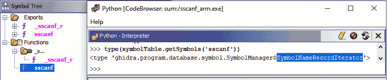

# 第九章：*第九章*：二进制审计脚本

审计二进制文件是一项耗时的任务，因此建议尽可能自动化此过程。在审计软件项目时，寻找某些漏洞（如逻辑问题或架构问题）是无法自动化的，但在其他一些情况下，例如内存损坏漏洞，它们是通用的，可以通过开发 Ghidra 脚本来实现自动化。

本章将教你如何使用 Ghidra 自动化查找可执行二进制文件中的漏洞。你将分析 Zero Day Initiative 开发的 Ghidra 脚本，通过寻找调用 `sscanf`（一个从字符串中读取格式化数据的 C 库）的位置，以实现自动化漏洞搜索，进而延续上一章的漏洞挖掘过程。

最后，我们将讨论 PCode，Ghidra 的中间语言，它允许你将脚本与处理器架构解耦。

本章将涵盖以下主要内容：

+   查找易受攻击的函数

+   查找 `sscanf` 的调用者

+   使用 PCode 分析调用函数

# 技术要求

本章的要求如下：

+   包含本章所需所有代码的 GitHub 仓库：[`github.com/PacktPublishing/Ghidra-Software-Reverse-Engineering-for-Beginners/tree/master/Chapter09`](https://github.com/PacktPublishing/Ghidra-Software-Reverse-Engineering-for-Beginners/tree/master/Chapter09)

+   `sscanf`：Zero Day Initiative 开发的 Ghidra 脚本，用于通过建模易受攻击代码来进行自动化漏洞搜索：[`github.com/thezdi/scripts/blob/master/sscanf/sscanf_ghidra.py`](https://github.com/thezdi/scripts/blob/master/sscanf/sscanf_ghidra.py)

+   Mingw-w64：Windows 64 位和 32 位架构的 GCC 编译器：[`mingw-w64.org/doku.php`](http://mingw-w64.org/doku.php)

+   GNU ARM 嵌入式工具链：一套用于编译 C、C++ 和 ASM 代码的工具，目标是 ARM 架构。它允许我们交叉编译源代码以支持 ARM 平台：[`developer.arm.com/tools-and-software/open-source-software/developer-tools/gnu-toolchain/gnu-rm/downloads`](https://developer.arm.com/tools-and-software/open-source-software/developer-tools/gnu-toolchain/gnu-rm/downloads)

+   如果你想了解更多关于工具链的信息，请参考 Packt 出版社的书籍 *掌握嵌入式 Linux 编程 - 第二版*，*Chris Simmonds*，*2017 年 6 月*：[`subscription.packtpub.com/book/networking_and_servers/9781787283282`](https://subscription.packtpub.com/book/networking_and_servers/9781787283282)

请查看以下视频，观看代码实战：[`bit.ly/2Io58y6`](https://bit.ly/2Io58y6)

# 查找易受攻击的函数

如果你记得上一章的内容，当寻找漏洞时，我们从查找符号表中列出的不安全的 C/C++函数开始。不安全的 C/C++函数可能会引入漏洞，因为开发者需要检查传递给函数的参数。因此，他们有可能犯下有安全隐患的编程错误。

在这种情况下，我们将分析一个脚本，该脚本查找预期由`sscanf`初始化但未验证正确初始化的变量的使用：

```
00  int main() {
```

```
01 	char* data = "";
```

```
02 	char name[20];
```

```
03 	int age;
```

```
04 	int return_value = sscanf(data, "%s %i", name, &age);
```

```
05 	printf("I'm %s.\n", name);
```

```
06 	printf("I'm %i years old.", age);
```

```
07 }
```

当编译这段代码并执行时，结果是不可预测的。由于`data`变量在第`01`行初始化为空字符串，当`sscanf`在第`04`行被调用时，它无法从`data`缓冲区读取`name`字符串和`age`整数。

因此，当分别在第`05`行和第`06`行检索`name`和`age`的值时，它们包含一些不可预测的值。在执行过程中，在我的情况下（可能与你不同），它产生了以下不可预测的输出：

```
C:\Users\virusito\vulns> gcc.exe sscanf.c -o sscanf.exe
```

```
C:\Users\virusito\vulns> sscanf.exe
```

```
I'm ɧã.
```

```
I'm 9 years old.
```

为了解决这个漏洞，你必须检查`sscanf`的返回值，因为在成功时，该函数会返回成功从给定缓冲区扫描的值的数量。仅在成功读取`age`和`name`的情况下，才使用这两个变量：

```
05 	if(return_value == 2){
```

```
06 		printf("I'm %s.\n", name);
```

```
07 		printf("I'm %i years old.", age);
```

```
08 	}else if(return_value == -1){
```

```
09 		printf("ERROR: Unable to read the input data.\n");
```

```
10 	}else{
```

```
11 		printf("ERROR: 2 values expected, %d given.\n", return_value);
```

```
12 	}
```

在下一节中，你将学习如何在符号表中查找`sscanf`函数，以便寻找本节中涵盖的各种漏洞。

## 从符号表中检索不安全的 C/C++函数

如你在*第二章*中所知，*使用 Ghidra 脚本自动化反向工程任务*，当开发`GhidraScript`脚本以自动化任务时，脚本提供以下状态：

+   `currentProgram`

+   `currentAddress`

+   `currentLocation`

+   `currentSelection`

+   `currentHighlight`

为了获得当前程序的符号表实例，Zero Day Initiative 脚本调用`currentProgram`中的`getSymbolTable()`方法：

```
symbolTable = currentProgram.getSymbolTable()
```

为了获取与`_sscanf`函数相关的所有符号，我们从符号表实例中调用`getSymbols()`方法：

```
list_of_scanfs = list(symbolTable.getSymbols('_sscanf'))
```

然后，如果`list_of_scanfs`列表中没有符号，我们的静态分析表明程序不会受到不安全的`_sscanf`调用的影响，因此我们可以返回：

```
if len(sscanfs) == 0:
```

```
    print("sscanf not found")
```

```
    return
```

如你所见，使用 Ghidra 脚本查找不安全函数非常简单；这种脚本可以很容易地使用 Ghidra API 实现。记得你可以在*第六章*中快速查阅它，*恶意软件分析的脚本化*。

## 使用脚本反编译程序

反编译使你能够检索程序的反汇编，这是我们在查找漏洞时使用的程序视图。以下是 Zero Day Initiative 脚本代码片段，负责反编译程序：

```
00 decompiler_options = DecompileOptions()
```

```
01 tool_options = state.getTool().getService(
```

```
02                                           OptionsService
```

```
03                              ).getOptions(
```

```
04                                           "Decompiler"
```

```
05                              )
```

```
06 decompiler_options.grabFromToolAndProgram(
```

```
07                                           None,
```

```
08                                           tool_options,
```

```
09                                           currentProgram
```

```
10                                          )
```

```
11 decompiler = DecompInterface()
```

```
12 decompiler.setOptions(decompiler_options)
```

```
13 decompiler.toggleCCode(True)
```

```
14 decompiler.toggleSyntaxTree(True)
```

```
15 decompiler.setSimplificationStyle("decompile")
```

```
16 If not decompiler.openProgram(program):
```

```
17   print("Decompiler error")
```

```
18   return
```

让我解释一下前面代码片段中进行反编译的步骤：

1.  获取`DecompilerOptions`实例：为了反编译程序，我们需要为单次反编译过程获取一个反编译器对象。我们通过实例化一个`decompiler_options`对象来开始（`00`行）。

1.  获取与反编译过程相关的选项：为了设置选项，我们使用`grabFromToolAndProgram()` API，将反编译器特定的工具选项和目标程序传递给它，这对于反编译过程至关重要。

    实现 Ghidra 接口工具的 Ghidra 类（`FrontEndTool`、`GhidraTool`、`ModalPluginTool`、`PluginTool`、`StandAlonePluginTool`、`TestFrontEndTool`和`TestTool`）都有按类别分组的相关选项。

    因此，要获取当前工具（即`PluginTool`）的反编译类别选项（与反编译相关的选项），代码片段使用选项服务来检索相关的反编译选项（`01`–`05`行）。

1.  设置获取的反编译选项的值：在获取与反编译相关的选项后，代码片段使用`grabFromToolAndProgram()` API 获取适当的反编译器选项值，将工具选项和目标程序传递给它（`06`–`10`行）。

    接下来，代码片段获取反编译器实例并设置其选项（`11`–`15`行）。

1.  设置获取的反编译选项的值：最后，代码片段通过调用`openProgram()` API 来检查是否能够反编译程序（`16`–`18`行）。

在获得能够反编译程序的配置反编译器后，我们可以开始寻找`_sscanf`不安全函数的调用者。

# 寻找`sscanf`调用者

如你所知，在程序中找到一个不安全函数并不一定意味着程序存在漏洞。为了确认函数是否存在漏洞，我们需要分析调用者函数并分析传递给不安全函数的参数。

## 枚举调用者函数

以下代码片段可用于识别调用者函数：

```
00 from ghidra.program.database.symbol import FunctionSymbol
```

```
01 functionManager = program.getFunctionManager()
```

```
02   for sscanf in list_of_sscanfs:
```

```
03     if isinstance(sscanf, FunctionSymbol):
```

```
04       for ref in sscanf.references:
```

```
05         caller = functionManager.getFunctionContaining(
```

```
06                                           ref.fromAddress
```

```
07                  )
```

```
08      caller_function_decompiled = 
```

```
09                           decompiler.decompileFunction(
```

```
10                                                   caller,
```

```
11                    decompiler.options.defaultTimeout,
```

```
12                    None
```

```
13      )
```

前面的代码片段通过使用函数管理器来寻找调用者函数。通过调用`getFunctionManager()`函数，可以轻松获取该管理器，如`01`行所示。

之后，我们可以遍历`_sscanf`符号列表，检查这些符号是否是函数，因为我们关心的是`_sscanf`函数（`02`和`03`行）。

对每个已识别的`_sscanf`符号函数，我们枚举其引用（`04`行）。

引用`_sscanf`的函数就是调用者函数，因此我们可以使用`getFunctionContaining()` API 来获取调用者函数（`05`–`07`行）。

最后，我们可以通过使用`decompileFunction()` Ghidra API 反编译调用者（`08`–`13`行）。

在下一节中，我们将使用 PCode 分析得到的`caller_function_decompiled`对象，以确定它是否存在漏洞。

# 使用 PCode 分析调用函数

Ghidra 可以同时处理汇编语言和 PCode。PCode 是汇编级别的抽象，这意味着如果你使用 PCode 编写脚本，你将自动支持所有能够从 PCode 翻译的汇编语言。（在撰写本书时，以下处理器是支持的：6502, 68000, 6805, 8048, 8051, 8085, AARCH64, ARM, Atmel, CP1600, CR16, DATA, Dalvik, HCS08, HCS12, JVM, MCS96, MIPS, PA-RISC, PIC, PowerPC, RISCV, Sparc, SuperH, SuperH4, TI_MSP430, Toy, V850, Z80, TriCore 和 x86。）真的很强大吧？

PCode 到汇编级别的翻译

PCode 汇编是使用名为 SLEIGH 的处理器规格语言生成的：[`ghidra.re/courses/languages/html/sleigh.html`](https://ghidra.re/courses/languages/html/sleigh.html)。你可以在这里查看当前支持的处理器及其 SLEIGH 规格：[`github.com/NationalSecurityAgency/ghidra/tree/master/Ghidra/Processors`](https://github.com/NationalSecurityAgency/ghidra/tree/master/Ghidra/Processors)。

要理解 PCode，你必须熟悉三个关键概念：

+   **地址空间**：是对典型处理器可访问的索引内存（RAM）的泛化。以下截图展示了一个 PCode 代码片段，突出显示了地址空间引用：

图 9.1 – PCode 中的地址空间

+   **Varnode**：PCode 操作的数据单元。某个地址空间中的一系列字节通过地址和字节数来表示（常数值也被视为 varnode）。以下截图展示了一个 PCode 代码片段，突出显示了 varnode：

图 9.2 – PCode 中的 Varnodes

+   **操作**：一个或多个 PCode 操作可用于模拟处理器指令。PCode 操作支持算术运算、数据移动、分支、逻辑运算、布尔运算、浮点数、整数比较、扩展/截断以及托管代码。以下截图展示了一个 PCode 代码片段，突出显示了操作：

图 9.3 – PCode 中的操作

你也可以通过实践学习 PCode，了解如何区分地址空间/varnode/操作。若想以这种方式学习，右键单击指令并选择 **指令信息...** 以查看详细信息：


图 9.4 – 检索 PCode 指令的信息

PCode 助记符是自我解释的。但为了更好地理解 PCode 汇编清单，请查看 PCode 参考。

PCode 引用

PCode 操作列表在此处有完整文档：[`ghidra.re/courses/languages/html/pcodedescription.html`](https://ghidra.re/courses/languages/html/pcodedescription.html)。你还可以查看`PcodeOp`的 Java 自动生成文档：[`ghidra.re/ghidra_docs/api/ghidra/program/model/pcode/PcodeOp.html`](https://ghidra.re/ghidra_docs/api/ghidra/program/model/pcode/PcodeOp.html)。

尽管 PCode 是一个强大的工具，但它不能完全取代汇编语言。我们通过对比这两者来更好地理解这个问题。

## PCode 与汇编语言

在比较汇编语言和 PCode 时，我们可以注意到，汇编语言更具可读性，因为一个汇编指令会翻译成一个或多个 PCode 操作（一对多的翻译），这使得它更为冗长。另一方面，PCode 提供了更多的细粒度控制，可以让你逐步控制每个操作，而不是通过单一指令执行很多操作（即同时移动一个值并更新标志）。

所以，总的来说，PCode 更适合用于脚本开发，而汇编语言更适合人类分析代码时使用：


图 9.5 – 比较两种 _sum 反汇编列表：x86 汇编与 PCode

在接下来的章节中，我们将使用 PCode 分析存储在`caller_function_decompiled`变量中的调用者函数。

## 获取 PCode 并分析它

我们首先通过获取`caller_function_decompiled`变量的 PCode 反编译结果开始。为此，我们只需要访问`highFunction`属性：

```
caller_pcode = caller_function_decompiled. highFunction
```

每个 PCode 基本块都是由 PCode 操作构成的。我们可以如下访问`caller_pcode`的 PCode 操作：

```
for pcode_operations in caller_pcode.pcodeOps:
```

我们还可以通过检查 PCode 操作是否为`CALL`，以及其第一个操作数是否为`sscanf`的地址，来判断操作是否为指向`sscanf`的`CALL`操作：

```
if op.opcode == PcodeOp.CALL and op.inputs[0].offset == sscanf.address.offset:
```

PCode 上的`CALL`操作通常有以下三个输入值：

+   `input0`：调用目标

+   `input1`：目标地址

+   `input2`：格式字符串

剩余的参数是变量，用于存储从格式字符串中提取的值。因此，我们可以使用以下代码计算传递给`sscanf`的变量数量：

```
num_variables = len(op.inputs) - 3
```

计算完传递给`sscanf`的变量数量后，我们可以确定`CALL`的输出（从`sscanf`输入缓冲区读取的值的数量）是否得到了正确的检查——也就是说，检查所有变量（计数器存储在整数`num_variables`中）是否成功读取。

可能`sscanf`的返回值从未被检查，所以我们正在分析的脚本开始执行此检查，如果检测到该漏洞指示符，就报告该问题：

```
if op.output is None:
```

之后，脚本检查**后代**。Ghidra 使用“后代”一词来指代变量的后续使用：

```
for use in op.output.descendants:
```

它查找包含`sscanf`输出作为操作数的整数相等比较，并将它与之进行比较的值存储在`comparand_var`变量中：

```
if use.opcode == PcodeOp.INT_EQUAL:
```

```
    if use.inputs[0].getDef() == op:
```

```
        comparand_var = use.inputs[1]
```

```
    elif use.inputs[1].getDef() == op:
```

```
        comparand_var = use.inputs[0]
```

最后，它检查比较值是否是常量值，如果小于传递给`sscanf`的变量数量，脚本会报告这个问题，因为有些变量可能在未正确初始化的情况下被使用：

```
if comparand_var.isConstant():
```

```
    comparand = comparand_var.offset
```

```
    if comparand < num_variables:
```

如你所猜测的，这种脚本逻辑可以应用于检测多种类型的漏洞；例如，它可以很容易地改编为检测“使用后释放”（use-after-free）漏洞。为此，你可以查找`free`函数调用，并确定是否在释放后的缓冲区被使用。

## 在多个架构中使用相同的基于 PCode 的脚本

在本节中，我们将分析以下脆弱的程序，但它在两种架构下编译——ARM 和 x86。得益于 PCode，我们只需编写一次脚本：

```
#include<stdio.h>
```

```
int main() {
```

```
	char* data = "";
```

```
	char name[20];
```

```
	int age;
```

```
	int return_value = sscanf(data, "%s %i", name, &age);
```

```
	if(return_value==1){
```

```
		printf("I'm %s.\n", name);
```

```
		printf("I'm %i years old.", age);
```

```
	}
```

```
}
```

如你所见，程序存在漏洞，因为它检查`return_value`是否等于`1`，但有两个变量（`name`和`age`）传递给`sscanf`函数。

现在，我们可以为 x86 和 ARM 处理器编译该程序：

1.  使用 Ming-w64 为 x86 架构编译它（不用担心是 32 位还是 64 位；对于此实验来说并不重要），生成`sscanf_x86.exe`可执行二进制文件：

    ```
    C:\Users\virusito\vulns> gcc.exe sscanf.c -o sscanf_x86.exe
    ```

1.  使用 GNU Arm Embedded Toolchain 为 ARM 架构编译它，生成`sscanf_arm.exe`二进制文件：

    ```
    C:\Users\virusito\vulns> arm-none-eabi-gcc.exe sscanf.c -o sscanf_arm.exe -lc –lnosys
    ```

我们需要对 Zero Day Initiative 开发的`sscanf`脚本进行一些小的修改，以便使其也能在 ARM 架构上运行。这些修改与 PCode 无关。之所以需要修改，是因为 Ghidra 检测到的是`sscanf`符号，而不是`_sscanf`，并且它也被检测为`SymbolNameRecordIterator`：



图 9.6 – ARM 二进制中 sscanf 的符号树和类型识别

因此，我们修改脚本，在调用`next()`方法检索给定`SymbolNameRecordIterator`的第一个元素（即函数）时，还包括`sscanf`符号：

```
sscanfs = list(symbolTable.getSymbols('_sscanf'))
```

```
sscanfs.append(symbolTable.getSymbols('sscanf').next())
```

最后一步，我们在分析后执行脚本，设置`postScript`选项。我们在 headless 模式下运行 Ghidra，分析包含两个可执行文件（`sscanf_x86.exe`和`sscanf_arm.exe`）的`vunls`目录：

```
analyzeHeadless.bat C:\Users\virusito\projects sscanf -postScript C:\Users\virusito\ghidra_scripts\sscanf_ghidra.py -import C:\Users\virusito\vulns\*.exe -overwrite
```

结果如下所示：


图 9.7 – 对 x86 和 ARM 二进制文件运行单一的`sscanf_ghidra.py`脚本

如你所见，通过使用 PCode，你只需编写一次脚本，就可以支持所有架构，而无需担心平台差异。

另一方面，PCode 允许你自动化漏洞挖掘过程，利用 PCode 所实现的单一赋值特性，能够实现细粒度的控制。细粒度的控制在漏洞挖掘中非常有用。例如，检查是否存在能够触及易受攻击函数的程序输入时，使用 PCode 比使用汇编语言更容易，因为汇编操作通常会在一次操作中修改很多内容（寄存器、内存、标志等）。

# 摘要

在本章中，你学习了如何使用 Ghidra 自动化审计程序二进制文件以进行漏洞挖掘。我们从脚本化查找符号表中的易受攻击函数开始，然后继续查找那些函数的调用者，最后分析调用者函数，判断这些函数是否存在漏洞。

你已经学习了如何使用 Ghidra 脚本化二进制审计过程，以及如何使用 PCode 和它的好处。你还了解了为什么 PCode 不能完全替代汇编语言在手动分析中的作用。

在本书的下一章中，我们将介绍如何使用插件扩展 Ghidra。我们在*第四章*，*使用 Ghidra 扩展* 中提到过这一点，但这个话题值得特别提及，因为它允许你以一种强大的方式深入扩展 Ghidra。

# 问题

1.  SLEIGH 和 PCode 之间的区别是什么？

1.  PCode 比汇编语言更易于人类阅读吗？为什么 PCode 有用？

# 延伸阅读

你可以参考以下链接，获取本章涉及的更多信息：

+   Mindshare: 通过建模易受攻击的代码进行自动化漏洞挖掘：[`www.thezdi.com/blog/2019/7/16/mindshare-automated-bug-hunting-by-modeling-vulnerable-code`](https://www.thezdi.com/blog/2019/7/16/mindshare-automated-bug-hunting-by-modeling-vulnerable-code)

+   River Loop Security: 使用 Ghidra 的 PCode 识别易受攻击的函数调用：[`www.riverloopsecurity.com/blog/2019/05/pcode/`](https://www.riverloopsecurity.com/blog/2019/05/pcode/)

+   *三人行，必有我师：掌握 NSA 的 Ghidra 反向工程工具*：[`github.com/0xAlexei/INFILTRATE2019/blob/master/INFILTRATE%20Ghidra%20Slides.pdf`](https://github.com/0xAlexei/INFILTRATE2019/blob/master/INFILTRATE%20Ghidra%20Slides.pdf)
