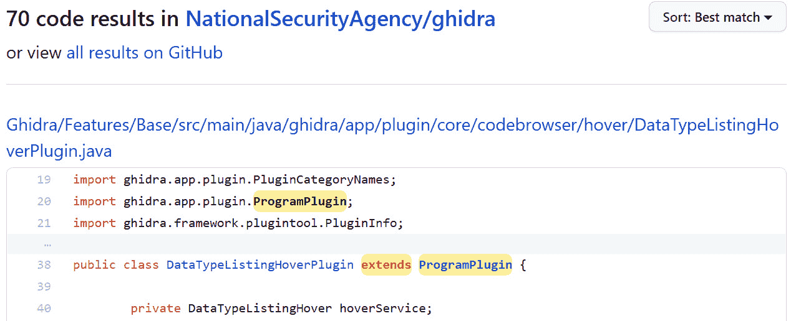
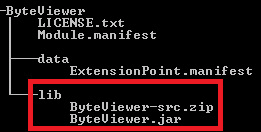
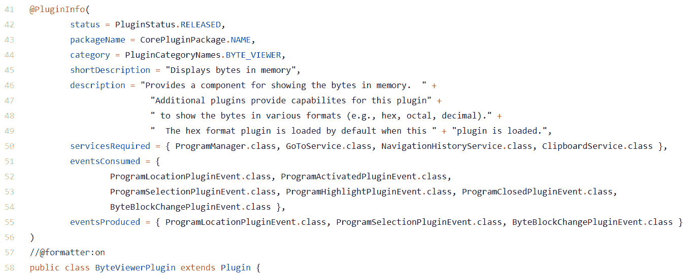
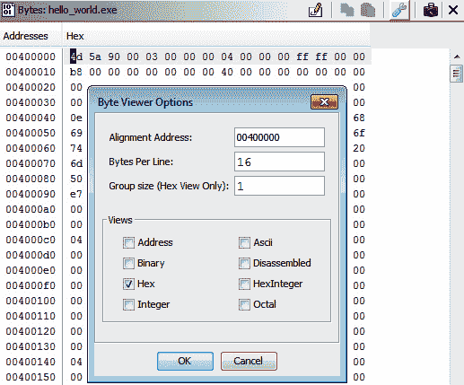
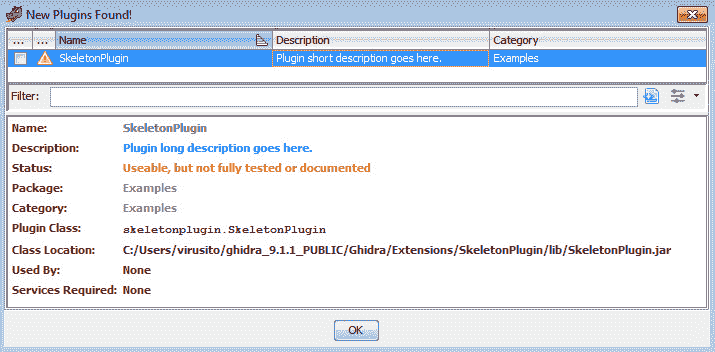
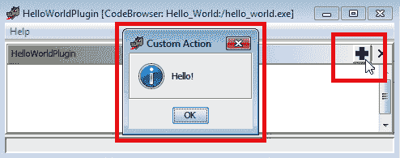
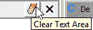
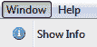

# 第十章：*第十章*：开发 Ghidra 插件

在本章中，我们将深入了解 Ghidra 插件开发的细节，正如在*第四章*中介绍的那样，*使用 Ghidra 扩展*。在本章中，你将学习如何实现你自己的插件，以便任意扩展 Ghidra 的功能。

我们将首先提供一些现有插件的概述，以便你可以从其他开发者那里探索一些可能启发你的创意。接下来，我们将分析 Ghidra 附带的插件骨架的源代码，并在 Eclipse 中创建新插件时获取它。

最后，我们将回顾一个基于之前提到的插件骨架的 Ghidra 插件示例。通过这个示例，我们将深入了解如何通过向其中添加组件和操作来实现一个新的 GUI 停靠窗口。

在本章中，我们将涵盖以下主题：

+   现有插件概述

+   Ghidra 插件骨架

+   Ghidra 插件开发

让我们开始吧！

# 技术要求

本章的技术要求如下：

+   本书的 GitHub 仓库，包含本章所需的所有代码，位于：[`github.com/PacktPublishing/Ghidra-Software-Reverse-Engineering-for-Beginners/tree/master/Chapter10`](https://github.com/PacktPublishing/Ghidra-Software-Reverse-Engineering-for-Beginners/tree/master/Chapter10)。

+   Java JDK 11 for x86_64（可在此处获取：[`adoptopenjdk.net/releases.html?variant=openjdk11&jvmVariant=hotspot`](https://adoptopenjdk.net/releases.html?variant=openjdk11&jvmVariant=hotspot)）。

+   适用于 Java 开发者的 Eclipse IDE（任何支持 JDK 11 的版本，可在此处获取：[`www.eclipse.org/downloads/packages/`](https://www.eclipse.org/downloads/packages/)），因为它是 Ghidra 官方集成和支持的 IDE。

+   Gradle，一个构建自动化工具，用于编译 Ghidra 扩展（[`gradle.org/install/`](https://gradle.org/install/)）。

+   PyDev 6.3.1（可在此处获取：[`netix.dl.sourceforge.net/project/pydev/pydev/PyDev%206.3.1/PyDev%206.3.1.zip`](https://netix.dl.sourceforge.net/project/pydev/pydev/PyDev%206.3.1/PyDev%206.3.1.zip)）。

查看以下视频，看看代码的实际演示：[`bit.ly/3gmDazk`](https://bit.ly/3gmDazk)

# 现有插件概述

正如我们在*第四章*的*分析样本表提供者插件代码*部分中看到的那样，*使用 Ghidra 扩展*，插件扩展是一个 Java 程序，它继承自`ghidra.app.plugin.ProgramPlugin`类，允许我们处理最常见的程序事件并实现 GUI 组件。

在本节中，我们将概述 Ghidra 特性是如何通过插件实现的，这些插件可以在 Ghidra 仓库中轻松找到。通过分析一个示例，我们将了解现有插件的源代码与它所实现的 Ghidra 组件之间的关系。

## Ghidra 发行版中包含的插件

很多 Ghidra 功能是作为插件实现的，因此，除了 Ghidra 自带的插件示例和 `ghidra_9.1.2\Extensions\Ghidra` 文件夹中提供的插件外，你还可以通过查看程序的源代码和/或重用它来学习如何实现自己的功能。

你可以通过查找包含字符串 `extends ProgramPlugin` 的类来轻松找到插件 ([`github.com/NationalSecurityAgency/ghidra/search?p=1&q=extends+ProgramPlugin&unscoped_q=extends+ProgramPlugin`](https://github.com/NationalSecurityAgency/ghidra/search?p=1&q=extends+ProgramPlugin&unscoped_q=extends+ProgramPlugin))，如下图所示：



图 10.1 – 查找作为插件实现的 Ghidra 功能

如你所见，70 个插件（当然，这些搜索结果包括插件示例）是 Ghidra 的一部分。你已经熟悉的 Ghidra GUI 中可用的很多功能就是以这种方式实现的。请记住，当你下载 Ghidra 的发布版本时，提到的源代码将被编译成 JAR 文件，并通过以 `*-src.zip` 命名的压缩 ZIP 文件分发。

例如，你可以在 `ghidra_9.1.2\Features` 文件夹中找到 `ByteViewer` 扩展，它以编译的 JAR 文件和源代码两种形式分发。这些文件可以在模块的 `lib` 目录中找到：



图 10.2 – ByteViewer 扩展文件树视图 – I

它作为一个 Ghidra 插件扩展实现，位于 `ghidra_9.1.2/Ghidra/Features/ByteViewer/src/main/java/ghidra/app/plugin/core/byteviewer/ByteViewerPlugin.java`，如下图所示：



图 10.3 – ByteViewer 扩展文件树视图 – II

该插件实现了一个重要的逆向工程框架功能。下图展示了当运行 *第四章*，*使用 Ghidra 扩展* 中的 `hello_world.exe` 程序时，Ghidra GUI 模式所提供的功能：



图 10.4 – ByteViewer 扩展文件树视图 – III

通过这样做，你可以将 GUI 组件与其源代码关联起来，从而在开发自己的 Ghidra 插件时，修改它或重用某些代码片段。

## 第三方插件

除了 Ghidra 发行版中自带的插件，你还可以从互联网上安装第三方插件。以下是一些有用的第三方开发插件示例：

+   `ret-sync` ([`github.com/bootleg/ret-sync`](https://github.com/bootleg/ret-sync)): 这是一个 Ghidra 插件扩展，允许你将 Ghidra 与许多常见的调试器同步，例如 WinDbg、GDB、LLDB、OllyDbg、OllyDbg2 和 x64dbg。

+   `gdbghidra` ([`github.com/Comsecuris/gdbghidra`](https://github.com/Comsecuris/gdbghidra)): 这个插件允许你将 Ghidra 与 GDB 同步，能够从 Ghidra 设置断点，调试时在 Ghidra 上显示寄存器值等。由于 Ghidra 并没有集成自己的调试器，因此这个 Ghidra 插件扩展非常有用。

+   `OOAnalyzer` ([`github.com/cmu-sei/pharos/tree/master/tools/ooanalyzer/ghidra/OOAnalyzerPlugin`](https://github.com/cmu-sei/pharos/tree/master/tools/ooanalyzer/ghidra/OOAnalyzerPlugin)): 这是一个插件，允许你导入由 Pharos 静态二进制分析框架的 OOAnalyzer 组件提供的 C++面向对象信息（https://github.com/cmu-sei/pharos/blob/master/tools/ooanalyzer/ooanalyzer.pod）。这个插件对于反向工程 C++二进制文件非常有用。

在接下来的部分，我们将提供最简单的 Ghidra 插件结构的概述：插件骨架。

# Ghidra 插件骨架

正如我们在*第四章*的*开发 Ghidra 扩展*部分中所解释的那样，*使用 Ghidra 扩展*，通过点击**新建** | **Ghidra 模块项目…**，你可以从给定的骨架开始创建任何类型的 Ghidra 扩展。

在本节中，我们将概述 Ghidra 插件扩展骨架，以便了解允许我们开发复杂插件的基础知识。

## 插件文档

插件骨架的第一部分是描述插件的文档。其文档包含四个必填字段（你可以选择添加一些其他字段）：

+   插件的状态，它可以是以下四个值之一：`HIDDEN`（隐藏）、`RELEASED`（发布）、`STABLE`（稳定）或`UNSTABLE`（不稳定）。（见下面代码的第`01`行）。

+   插件的包（见第`02`行）。

+   插件的简短描述（见第`03`行）。

+   插件的详细描述（见第`04`行）。

以下代码是插件文档骨架，你可以根据需要进行定制：

```
00  @PluginInfo(
```

```
01    status = PluginStatus.STABLE,
```

```
02    packageName = ExamplesPluginPackage.NAME,
```

```
03    category = PluginCategoryNames.EXAMPLES,
```

```
04    shortDescription = "Plugin short description.",
```

```
05    description = "Plugin long description goes here."
```

```
06  )
```

PluginInfo 文档

如果你想在`PluginInfo`中包括可选描述字段，请查看以下链接：https://ghidra.re/ghidra_docs/api/ghidra/framework/plugintool/PluginInfo.html。

如下截图所示，一旦插件安装并被检测到，Ghidra 会显示插件的信息：



图 10.5 – 插件配置

安装`PluginInfo`后，你可以编写插件的代码。

## 编写插件代码

插件及其操作由`PluginTool`管理，因此它作为参数传递给插件类。在所有 Ghidra 插件源代码中，有三件重要的事情：

+   `provider`（第 `09` 行）实现了插件的 GUI。它可以是永久性的（关闭插件只会隐藏它）或瞬时性的（关闭插件会移除插件，例如在显示搜索结果时）。

+   构造函数可以自定义 `provider` 和插件的帮助选项。

+   `init()` 方法可以用来获取如 `FileImporterService` 或 `GraphService` 等服务。请查看以下链接，获取完整的服务文档列表：https://ghidra.re/ghidra_docs/api/ghidra/app/services/package-.summary.html。

以下代码是一个极其简单的插件示例 `SkeletonPlugin` 的主体部分。当然，我们之前提到的 `MyProvider` 类（第 `09` 行）是一个插件 `provider`，实现了插件的 GUI。我们稍后会详细解释：

```
07  public class SkeletonPlugin extends ProgramPlugin {
```

```
08
```

```
09    MyProvider provider;
```

```
10    public SkeletonPlugin (PluginTool tool) {
```

```
11      super(tool, true, true);
```

```
12
```

```
13      // TODO: Customize provider (or remove if a provider
```

```
14      //       is not desired)
```

```
15      String pluginName = getName();
```

```
16      provider = new MyProvider(this, pluginName);
```

```
17
```

```
18      // TODO: Customize help (or remove if help is not
```

```
19      //       desired)
```

```
20      String topicName = 
```

```
21                   this.getClass().getPackage().getName();
```

```
22      String anchorName = "HelpAnchor";
```

```
23      provider.setHelpLocation(new HelpLocation(
```

```
24                                          topicName,
```

```
25                                          anchorName)
```

```
26      );
```

```
27    }
```

```
28
```

```
29    @Override
```

```
30    public void init() {
```

```
31      super.init();
```

```
32      // TODO: Acquire services if necessary
```

```
33    }
```

```
34  }
```

如果你想为插件提供 GUI 功能，则需要实现一个提供者。这个提供者可以使用一个单独的 Java 文件进行开发。在下一节中，我们将概述 Ghidra 插件提供者的结构。

## 插件的提供者

提供者实现了插件的 GUI 组件。它通常存储在一个名为 `*Provider.java` 的独立文件中，该文件包含以下内容：

+   构造函数（第 `05-09` 行），用于构建面板并创建所需的操作。

+   面板（第 `11-18` 行），用于创建 GUI 组件并进行自定义。

+   GUI 的操作（第 `21-43` 行），通过 `addLocalAction(docking.action.DockingActionIf)` 添加。

+   一个 getter 方法，让我们可以获取面板（第 `46-48` 行）。

以下代码实现了一个自定义插件 `provider`，即用于 `MyProvider` 类（在前述代码的第 `09` 行使用）：

```
00  private static class MyProvider extends ComponentProvider{
```

```
01  
```

```
02  		private JPanel panel;
```

```
03  		private DockingAction action;
```

```
04  
```

```
05  		public MyProvider(Plugin plugin, String owner) {
```

```
06  			super(plugin.getTool(), owner, owner);
```

```
07  			buildPanel();
```

```
08  			createActions();
```

```
09  		}
```

```
10  
```

```
11  		// Customize GUI
```

```
12  		private void buildPanel() {
```

```
13  			panel = new JPanel(new BorderLayout());
```

```
14  			JTextArea textArea = new JTextArea(5, 25);
```

```
15  			textArea.setEditable(false);
```

```
16  			panel.add(new JScrollPane(textArea));
```

```
17  			setVisible(true);
```

```
18  		}
```

```
19  
```

```
20  		// TODO: Customize actions
```

```
21  		private void createActions() {
```

```
22  			action = new DockingAction(
```

```
23                                         "My Action", 
```

```
24                                         getName()) {
```

```
25  				@Override
```

```
26  				public void actionPerformed(
```

```
27                                 ActionContext context) {
```

```
28  					Msg.showInfo(
```

```
29                               getClass(),
```

```
30                               panel,
```

```
31                               "Custom Action",
```

```
32                               "Hello!"
```

```
33                         );
```

```
34  				}
```

```
35  			};
```

```
36  			action.setToolBarData(new ToolBarData(
```

```
37                                           Icons.ADD_ICON,
```

```
38                                           null)
```

```
39              );
```

```
40  			action.setEnabled(true);
```

```
41  			action.markHelpUnnecessary();
```

```
42  			dockingTool.addLocalAction(this, action);
```

```
43  		}
```

```
44  
```

```
45  		@Override
```

```
46  		public JComponent getComponent() {
```

```
47  			return panel;
```

```
48  		}
```

```
49  	}
```

提供者操作文档

你可以通过以下链接了解更多关于 `addLocalAction` 方法（在前述代码的第 `31` 行使用）的信息：[`ghidra.re/ghidra_docs/api/docking/ComponentProvider.html#addLocalAction(docking.action.DockingActionIf`](https://ghidra.re/ghidra_docs/api/docking/ComponentProvider.html#addLocalAction(docking.action.DockingActionIf))。你还可以通过以下链接了解更多关于 Docking Actions 的信息： [`ghidra.re/ghidra_docs/api/docking/action/DockingActionIf.html`](https://ghidra.re/ghidra_docs/api/docking/action/DockingActionIf.html)。

以下截图显示了执行此插件的结果，你可以通过在 **CodeBrowser** 中选择 **Window** | **SkeletonPlugin**，然后点击屏幕右上角的绿色十字按钮来触发该操作（执行此操作后会出现消息框）：



图 10.6 – 插件配置

在下一节中，我们将学习如何使用这个框架作为参考来实现一个插件。

# 开发 Ghidra 插件

在本节中，我们将分析如何实现`ShowInfoPlugin` Ghidra 插件示例，以便了解如何开发一个更复杂的插件。

ShowInfoPlugin 的源代码

`ShowInfoPlugin`的源代码可以在这里找到：[`github.com/NationalSecurityAgency/ghidra/blob/49c2010b63b56c8f20845f3970fedd95d003b1e9/Ghidra/Extensions/sample/src/main/java/ghidra/examples/ShowInfoPlugin.java`](https://github.com/NationalSecurityAgency/ghidra/blob/49c2010b63b56c8f20845f3970fedd95d003b1e9/Ghidra/Extensions/sample/src/main/java/ghidra/examples/ShowInfoPlugin.java)。该插件使用的组件提供者代码在一个单独的文件中：[`github.com/NationalSecurityAgency/ghidra/blob/49c2010b63b56c8f20845f3970fedd95d003b1e9/Ghidra/Extensions/sample/src/main/java/ghidra/examples/ShowInfoComponentProvider.java`](https://github.com/NationalSecurityAgency/ghidra/blob/49c2010b63b56c8f20845f3970fedd95d003b1e9/Ghidra/Extensions/sample/src/main/java/ghidra/examples/ShowInfoComponentProvider.java)。

要实现一个插件，你需要掌握三个关键步骤。让我们一起看一下每个步骤！

## 插件文档

要记录插件文档，必须使用`PluginInfo`结构来描述它：

```
00  @PluginInfo(
```

```
01    status = PluginStatus.RELEASED,
```

```
02    packageName = ExamplesPluginPackage.NAME,
```

```
03    category = PluginCategoryNames.EXAMPLES,
```

```
04    shortDescription = "Show Info",
```

```
05    description = "Sample plugin demonstrating how to "
```

```
06                + "access information from a program. "
```

```
07                + "To see it work, use with the "
```

```
08                + "CodeBrowser."
```

```
09  )
```

如你所见，文档指出这是插件的发布版本（`01`行）。插件所属的包是`ExamplesPluginPackage.NAME`，如`02`行所定义。插件被归类到`PluginCategoryNames.EXAMPLES`类别，以表明这是一个示例插件。最后，插件的描述既有简短版本（`04`行），也有完整版本（`05`-`08`行）。

## 实现插件类

插件类被命名为`ShowInfoPlugin`，并从`ProgramPlugin`继承（`00`行），这是 Ghidra 在开发插件扩展时的标准要求。它声明了一个名为`provider`的`ShowInfoComponentProvider`（用于实现插件的 GUI）（`02`行），该提供者在类的构造函数中初始化（`06`行）。与往常一样，它接收`PluginTool`作为参数（`04`行）。

另一方面，`ProgramPlugin`提供的两个方法被重写。第一个方法`programDeactivated`允许我们在程序变为非活动状态时执行某些操作——在这种情况下，它让我们清除提供者（`11`行）。第二个方法`locationChanged`允许我们在接收到程序位置事件后执行操作。在这种情况下，它将当前程序和位置传递给提供者的`locationChanged`方法（`19`行）。插件的主体代码如下所示：

```
00  public class ShowInfoPlugin extends ProgramPlugin {
```

```
01
```

```
02    private ShowInfoComponentProvider provider;
```

```
03
```

```
04    public ShowInfoPlugin(PluginTool tool) {
```

```
05      super(tool, true, false);
```

```
06      provider = new ShowInfoComponentProvider(
```

```
07                                               tool,
```

```
08                                               getName()
```

```
09      );
```

```
10    }
```

```
11
```

```
12    @Override
```

```
13    protected void programDeactivated(Program program) {
```

```
14      provider.clear();
```

```
15    }
```

```
16
```

```
17    @Override
```

```
18    protected void locationChanged(ProgramLocation loc) {
```

```
19      provider.locationChanged(currentProgram, loc);
```

```
20    }
```

```
21  }
```

正如我们之前提到的，前面的代码在`02`行声明了一个`ShowInfoComponentProvider`，用于实现插件的 GUI。在接下来的章节中，我们将详细介绍该类的实现。

## 实现提供者

正如我们之前提到的，提供者由一个类（在本例中是`ShowInfoComponentProvider`）组成，该类继承自`ComponentProviderAdapter`（第`00`和`01`行），实现了 Ghidra 插件的 GUI，并处理相关事件和操作。

它首先加载两个图像资源（第`02`和`05`行）。在 Ghidra 中加载资源的正确方法是使用资源管理器（[`ghidra.re/ghidra_docs/api/resources/ResourceManager.html`](https://ghidra.re/ghidra_docs/api/resources/ResourceManager.html)），如下所示：

```
00  public class ShowInfoComponentProvider extends 
```

```
01                                  ComponentProviderAdapter {
```

```
02    private final static ImageIcon CLEAR_ICON = 
```

```
03        ResourceManager.loadImage("images/erase16.png");
```

```
04    private final static ImageIcon INFO_ICON =
```

```
05        ResourceManager.loadImage("images/information.png");
```

为了实现 GUI，`06`）和文本区域组件（第`07`行）。

在此处还定义了一个`DockingAction`（第`08`行），它将用户操作与工具栏图标和/或菜单项关联起来（[`ghidra.re/ghidra_docs/api/docking/action/DockingAction.html`](https://ghidra.re/ghidra_docs/api/docking/action/DockingAction.html)）。最后，还声明了两个属性，用于访问当前程序的当前位置（第`09`行）和当前程序（第`10`行）。

以下代码对应上述提供者的属性：

```
06    private JPanel panel;
```

```
07    private JTextArea textArea;
```

```
08    private DockingAction clearAction;
```

```
09    private Program currentProgram;
```

```
10    private ProgramLocation currentLocation;  
```

接下来，类构造函数通过调用在第`13`和`55`行声明的`create()`函数来创建 GUI。它设置了一些提供者属性，包括提供者图标（第`14`行）、默认窗口位置（第`15`行）及其标题（第`16`行），然后在第`17`行将提供者设置为可见。它还创建了`DockingActions`并调用在第`18`行定义、在第`62`行实现的`createActions()`函数：

```
11    public ShowInfoComponentProvider(
```

```
                                       PluginTool tool,
```

```
                                       String name) {
```

```
12      super(tool, name, name);
```

```
13      create();
```

```
14      setIcon(INFO_ICON);
```

```
15      setDefaultWindowPosition(WindowPosition.BOTTOM);
```

```
16      setTitle("Show Info");
```

```
17      setVisible(true);
```

```
18      createActions();
```

```
19    } 
```

由于组件提供者的`getComponent()`（第`21`行）函数返回要显示的组件，它返回`panel`（第`22`行），其中包含了 GUI 组件：

```
20    @Override
```

```
21    public JComponent getComponent() {
```

```
22      return panel;
```

```
23    }
```

`clear`函数通过将当前程序和当前位置设置为`null`（第`25`和`26`行）来清除当前程序，并清除文本区域组件的文本（第`27`行）：

```
24    void clear() {
```

```
25      currentProgram = null;
```

```
26      currentLocation = null;
```

```
27      textArea.setText("");
```

```
28    }  
```

当程序的位置发生变化时，它的位置信息会更新（第`33`和`34`行）。它不仅更改程序及其新位置，还通过调用在第`33`行实现的`updateInfo()`函数更新程序信息（第`36`行）。这是此插件的主要功能：

```
29    void locationChanged(
```

```
30                         Program program,
```

```
31                         ProgramLocation location
```

```
32                         ) {
```

```
33      this.currentProgram = program;
```

```
34      this.currentLocation = location;
```

```
35      if (isVisible()) {
```

```
36        updateInfo();
```

```
37      }
```

```
38    }  
```

`updateInfo()`函数首先检查是否可以访问当前位置的地址（第`34`行）。如果无法访问，则返回。

在这种情况下，`updateInfo()` 函数通过使用 `getCodeUnitContaining` 函数（第`46`行）从程序列表的当前位置地址获取 `CodeUnit`（[`ghidra.re/ghidra_docs/api/ghidra/program/model/listing/CodeUnit.html`](https://ghidra.re/ghidra_docs/api/ghidra/program/model/listing/CodeUnit.html)），并显示 `CodeUnit` 的字符串表示（第`52`行），用于在前面加上子字符串，指示当前的 `CodeUnit` 是一个指令（第`55`-`57`行），一个已定义的数据段（第`58`-`62`行），还是一个未定义的数据段（第`63`-`65`行）：

```
39    private void updateInfo() {
```

```
40      if (currentLocation == null || 
```

```
41          currentLocation.getAddress() == null) {
```

```
42        return;
```

```
43      }
```

```
44  
```

```
45      CodeUnit cu = 
```

```
46         currentProgram.getListing().getCodeUnitContaining(
```

```
47                          currentLocation.getAddress()
```

```
48      );
```

```
49  
```

```
50      // TODO -- create the string to set
```

```
51      String preview = 
```

```
52             CodeUnitFormat.DEFAULT.getRepresentationString(
```

```
53                                                  cu, true
```

```
54      );
```

```
55      if (cu instanceof Instruction) {
```

```
56        textArea.setText("Instruction: " + preview);
```

```
57      }
```

```
58      else {
```

```
59        Data data = (Data) cu;
```

```
60        if (data.isDefined()) {
```

```
61          textArea.setText("Defined Data: " + preview);
```

```
62        }
```

```
63        else {
```

```
64          textArea.setText("Undefined Data: " + preview);
```

```
65        }
```

```
66      }
```

```
67    }  
```

`create()` 方法创建一个包含 `BorderLayout` 的新面板（第`69`行）。这使我们可以将 GUI 组件放置在面板的四个边界上，也可以放置在面板的中央。

然后，它创建一个不可编辑的文本区域，大小为 5 行 25 列（第`70`-`71`行），并具有滚动功能（第`72`行），并将其附加到面板（第`73`行）：

```
68    private void create() {
```

```
69      panel = new JPanel(new BorderLayout());
```

```
70      textArea = new JTextArea(5, 25);
```

```
71      textArea.setEditable(false);
```

```
72      JScrollPane sp = new JScrollPane(textArea);
```

```
73      panel.add(sp);
```

```
74    }  
```

最后，`createActions()` 函数创建了一个 `DockingAction` 用于清除文本区域（您可以在以下代码片段的第 `76` 行找到它）。

在下面的截图中，您可以看到 `createActions()` 的实现是如何产生一个 GUI 按钮，从而允许我们触发 **清除文本区域** 操作的：



图 10.7 – 停靠操作 – 清除文本区域

`createActions()` 函数还重写了 `actionPerformed()` 函数（[`ghidra.re/ghidra_docs/api/ghidra/app/context/ListingContextAction.html#actionPerformed(docking.ActionContext`](https://ghidra.re/ghidra_docs/api/ghidra/app/context/ListingContextAction.html#actionPerformed(docking.ActionContext))），并实现了清除操作（第`82`行）。它还通过准备操作的工具栏图标（第`85`-`87`行）、将其设置为启用状态（第`89`行）并将其添加到当前工具（第`90`行），在操作的逻辑和 GUI 之间建立了联系：



图 10.8 – 从 CodeBrowser 的窗口菜单选项可用的 ShowInfo 插件扩展

当 GUI 组件显示时（第`94`行），它立即将对应的 `CodeUnit` 信息填充到文本区域中（第`95`行）：

```
75    private void createActions() {
```

```
76      clearAction = new DockingAction(
```

```
77                                      "Clear Text Area",
```

```
78                                      getName()
```

```
79                                      ) {
```

```
80        @Override
```

```
81        public void actionPerformed(ActionContext context) {
```

```
82          textArea.setText("");
```

```
83        }
```

```
84      };
```

```
85      clearAction.setToolBarData(new ToolBarData(CLEAR_ICON, 
```

```
86                                                 null)
```

```
87      );
```

```
88  
```

```
89      clearAction.setEnabled(true);
```

```
90      tool.addLocalAction(this, clearAction);
```

```
91    }
```

```
92  
```

```
93    @Override
```

```
94    public void componentShown() {
```

```
95      updateInfo();
```

```
96    }
```

```
97  }
```

在这里，我们学习了如何实现一个简单的插件提供者。如果你有兴趣实现更复杂的 GUI 扩展，强烈建议你深入了解 **Swing 小部件工具包**。学习相关内容时，请查阅在线文档（[`docs.oracle.com/javase/7/docs/api/javax/swing/package-summary.html`](https://docs.oracle.com/javase/7/docs/api/javax/swing/package-summary.html)），或者参考本章末尾的 *深入阅读* 部分。

# 总结

本章中，我们学习了如何结合官方和第三方扩展来使用 Ghidra。这项新技能使我们能够弥补 Ghidra 没有内置调试器的缺点。我们对 Ghidra 的源代码进行了搜索，发现 Ghidra 的许多核心功能实际上是以 Ghidra 插件的形式实现的。最后，我们学习了如何利用自己的创意扩展 Ghidra，访问被分析的程序，实现自定义 GUI 插件窗口，并向其添加功能。

在下一章中，我们将学习如何在 Ghidra 中支持新的二进制格式。这项技能将对你非常有价值，因为它将使你能够使用 Ghidra 进行外部二进制文件的逆向工程。

# 问题

1.  Ghidra 插件扩展是用 Java 语言实现的。那 Ghidra 是完全用 Java 实现的吗？

1.  如何将外部调试同步功能添加到 Ghidra 中？

1.  在 Ghidra 插件开发中，什么是提供者（provider）？

# 深入阅读

请参考以下链接，获取更多关于本章内容的信息：

+   *从 0 到 1：JavaFX 和 Swing 打造超炫 Java 界面* [视频]：[`www.packtpub.com/product/from-0-to-1-javafx-and-swing-for-awesome-java-uis-video/9781789132496`](https://www.packtpub.com/product/from-0-to-1-javafx-and-swing-for-awesome-java-uis-video/9781789132496)

+   *Swing 极限测试*，*Lindsay Peters, Tim Lavers*，*2008 年 6 月*：[`www.packtpub.com/product/swing-extreme-testing/9781847194824`](https://www.packtpub.com/product/swing-extreme-testing/9781847194824)

+   *Java 9 烹饪书*，*Mohamed Sanaulla, Nick Samoylov*，*2017 年 8 月*：[`www.packtpub.com/product/java-9-cookbook/9781786461407`](https://www.packtpub.com/product/java-9-cookbook/9781786461407)
