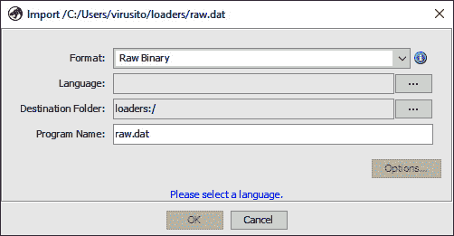
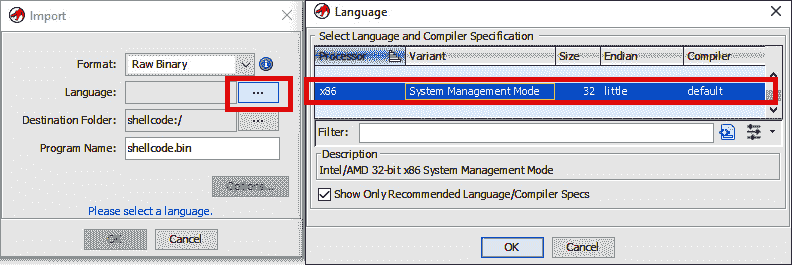
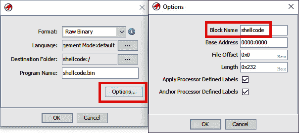
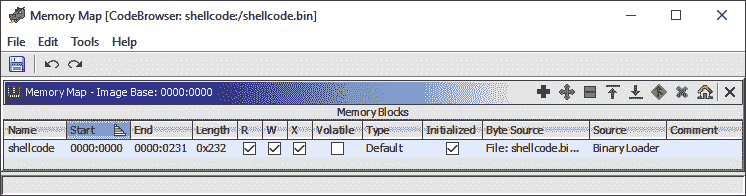
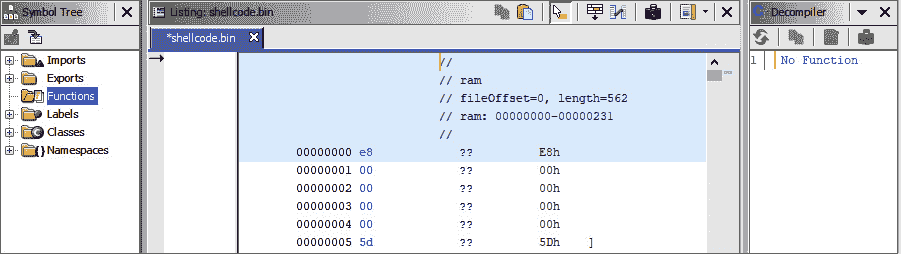
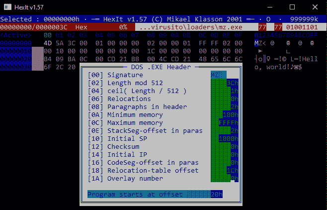
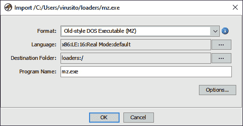
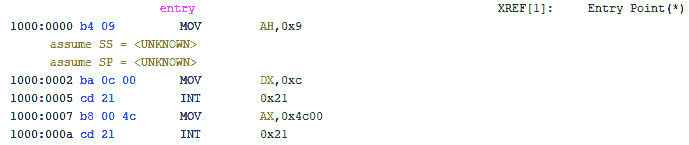
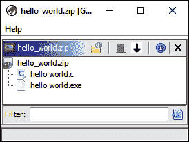

# 第十一章：*第十一章*：纳入新二进制格式

本章将讨论如何将新的二进制格式纳入 Ghidra，使您能够分析特殊的二进制文件——例如视频游戏的 ROM（来自游戏卡带或其他只读存储器的数据副本）。在本章中，您将学习如何开发 Ghidra 加载器扩展，这些扩展在 *第四章*的 *使用 Ghidra 扩展* 部分的 *加载器* 子部分中已有介绍。

我们将从了解什么是二进制文件开始。我们将探讨原始二进制文件和格式化二进制文件之间的区别，以及 Ghidra 如何处理它们。接下来，我们将进行一些 Ghidra 实验，从用户的角度理解二进制文件如何加载。最后，我们将从 Ghidra 开发者的角度分析 **旧版 DOS 可执行二进制文件** 的加载器。所分析的加载器负责使 Ghidra 能够加载 MS-DOS 可执行二进制文件，因此通过分析一个实际的例子，您将学习加载器开发。

本章将涵盖以下主要内容：

+   理解原始二进制文件与格式化二进制文件之间的区别

+   开发 Ghidra 加载器

+   理解文件系统加载器

# 技术要求

本章的要求如下：

+   **Flat assembler**（**fasm**），这是一款汇编语言编译器，可以生成多种格式的二进制文件（纯二进制、MZ、PE、COFF 或 ELF）：[`flatassembler.net/download.php`](https://flatassembler.net/download.php)

+   HexIt v.1.57，这是一款十六进制编辑器，允许您解析旧版 MS-DOS 可执行文件（MZ）：[`mklasson.com/hexit.php`](https://mklasson.com/hexit.php)

包含本章所有必要代码的 GitHub 仓库可以在以下链接找到：[`github.com/PacktPublishing/Ghidra-Software-Reverse-Engineering-for-Beginners/tree/master/Chapter11`](https://github.com/PacktPublishing/Ghidra-Software-Reverse-Engineering-for-Beginners/tree/master/Chapter11)。

查看以下链接，观看《代码实战》视频：[`bit.ly/3mQraZo`](https://bit.ly/3mQraZo)

# 理解原始二进制文件与格式化二进制文件之间的区别

在本节中，您将了解原始二进制文件与格式化二进制文件之间的区别。二进制文件的概念可以通过否定的方式简单定义；也就是说，**二进制文件**是一个不是文本文件的文件。

我们可以将二进制文件分为两类：原始二进制文件和格式化二进制文件。

**原始二进制文件**是包含未经处理数据的二进制文件，因此这些二进制文件在任何方面都没有格式。原始二进制文件的一个例子可能是从某个缓冲区中获取的一段代码的内存转储。

另一方面，**格式化二进制文件**是指具有格式规范的二进制文件，这样你就可以解析它们。格式化二进制文件的例子包括遵循**可移植可执行文件**（**PE**）格式的 Windows 可执行文件（图像）和目标文件，PE 格式的规范可以在线查阅：https://docs.microsoft.com/en-us/windows/win32/debug/pe-format。

对于 Ghidra 而言，原始二进制文件是一个非常通用的概念，意味着任何文件都可以不考虑其格式进行处理。你可以处理原始二进制文件并手动按某种方式构造数据，但使用格式化二进制文件会更为舒适。因此，你可能会想为那些尚不支持的二进制格式开发自己的加载器。

## 理解原始二进制文件

Ghidra 可以从你的文件系统中加载任何类型的文件，即使该文件不是已知的文件格式（也就是说，文件没有已知的文件结构）。例如，你可以编写一个文件，将数字与单词关联，并用分号分隔这些对，Ghidra 也能加载它。我们可以通过执行以下命令以这种方式生成一个`raw.dat`文件：

```
C:\Users\virusito\loaders> echo "1=potato;2=fish;3=person" > raw.dat
```

如果你将生成的`raw.dat`文件拖放到 Ghidra 项目中，它将作为**原始二进制**文件（没有意义的字节序列）被加载，因为 Ghidra 不知道它的文件格式。

如下图所示，Ghidra 根据加载器的结果，在导入阶段识别该文件为**原始二进制文件**，并建议将其作为最合适的格式使用：



图 11.1 – 加载原始二进制文件

文件格式的下拉列表基于两个概念**层级**和**层级优先级**进行填充，这使得你能够按从最合适的格式（*图 11.1*中的**原始二进制**）到最不合适的格式对文件格式进行排序：

+   **层级**，一个整数，范围为 0 到 3，允许我们表示四类加载器，并使我们能够按最专业（层级 0）到最不合适（层级 3）的顺序对加载器进行排序。

+   虽然更高层级的值会获胜，但一个名为**层级优先级**的整数用于在多个加载器能够加载具有相同层级的文件时进行平局打破。开发加载器时，层级和层级优先级都是必需的。

    更多关于层级和层级优先级的信息

    像往常一样，如果你希望更深入地了解层级和层级优先级，可以查阅文档：[`ghidra.re/ghidra_docs/api/ghidra/app/util/opinion/LoaderTier.html`](https://ghidra.re/ghidra_docs/api/ghidra/app/util/opinion/LoaderTier.html) 和 [`ghidra.re/ghidra_docs/api/ghidra/app/util/opinion/Loader.html#getTierPriority()`](https://ghidra.re/ghidra_docs/api/ghidra/app/util/opinion/Loader.html#getTierPriority())。

我们使用`raw.dat`做了一个小实验，通过完全理解的文件来一步步理解加载器的基本原理。现在，让我们尝试一些稍微复杂一点的东西！

为了提供一个更现实的示例，让我们加载之前在*第五章*中分析`0x004554E0`函数时展示的 Alina 恶意软件的 Shellcode，*使用 Ghidra 进行恶意软件逆向分析*一节中的*深入分析*部分。

由于未被识别，我们必须手动设置 Shellcode 的编写语言：



图 11.2 – 为原始二进制选择语言和编译器

你还可以为导入的文件设置**目标文件夹**和**程序名称**，这些将在将文件导入项目时使用。

最后，你可以通过点击**选项…**来仅导入文件的一个块，如下截图所示。它显示了一个菜单，允许你选择块名称（该数据块的名称）、基址，表示块将从哪个内存地址开始或放置，最后是文件偏移量，表示该块在导入文件中的位置以及块的长度。

该块将通过在输入框中输入`shellcode`来标记。如果勾选**应用处理器定义标签**框，导入器将在处理器指定的某些地址创建标签。另一方面，即使以后更改了图像基址，如果勾选了**锚定处理器定义标签**框，这些标签也不会被移动：



图 11.3 – 加载原始二进制块

你还可以通过访问 Ghidra 的 CodeBrowser 中的**窗口** | **内存映射**选项，添加、删除或编辑内存块：



图 11.4 – 添加、删除和编辑内存块

如下截图所示，如果 Ghidra 无法识别文件格式，你将不得不手动执行大量工作。在这种情况下，你需要将字节定义为代码或字符串，创建符号等等：



图 11.5 – 加载为原始二进制的 Alina 恶意软件 Shellcode

不必手动完成，你可以通过开发一个加载器来扩展 Ghidra 以支持这种格式。让我们看看下一部分是如何做到的。

## 理解格式化的二进制文件

可执行二进制文件是格式化的二进制文件；因此，它们的导入器必须考虑到格式结构进行导入。为了理解这一点，我们先生成并查看一个旧的 MS-DOS 可执行文件，因为它会生成一个轻量级的二进制文件，而且由于旧的 MS-DOS 可执行文件结构并不复杂，它是一个非常好的实际例子。我们这个`hello world`旧 MS-DOS 可执行程序（`mz.asm`文件）的代码，用汇编语言写成，内容如下：

```
00 format MZ
```

```
01 
```

```
02 mov ah, 9h
```

```
03 mov dx, hello
```

```
04 int 21h
```

```
05
```

```
06 mov ax, 4c00h
```

```
07 int 21h
```

```
08
```

```
09 hello db 'Hello, world!', 13, 10, '$'
```

行`00`告诉编译器这是一个旧的 MS-DOS 程序。在`04`行，我们触发了一个中断，`21h`（大多数 DOS API 调用是通过中断`21h`进行的），它在`ah`寄存器中接收`9h`作为参数（`02`行），表示程序必须将由`dx`（`03`行）引用的消息打印到`stdout`，该消息位于`09`行。

最后，程序结束，将控制权交给操作系统。这是通过将对应的值传递给`ax`寄存器，指示程序必须结束执行（`06`行），并再次触发`21h`中断来完成的。让我们使用`fasm`编译程序：

```
C:\Users\virusito\loaders> fasm mz.asm
```

```
flat assembler  version 1.73.04  (1048576 kilobytes memory)
```

```
2 passes, 60 bytes.
```

通过编译程序，我们得到了一个`mz.exe`文件。为了展示格式，我使用了 HexIt v.1.57，这是一个十六进制编辑器，当按下*F6*时，它会解析旧的 DOS 可执行文件头。

在下图中，你可以看到 DOS .EXE 头。每行以头字段的偏移量开始，字段名称之后是其值。例如，在文件的最开始（偏移**[00]**），我们有**Signature**，其值为**MZ**：



图 11.6 – 在 HexIt v1.57 中显示 DOS .EXE 头

Ghidra 包括一个加载器，能够解析这些**旧式 DOS 可执行文件（MZ）**二进制文件，因此，当你将这个文件拖入 Ghidra 时，语言和格式都会被识别：



图 11.7 – 将旧式 DOS 可执行文件（MZ）导入 Ghidra

如下图所示，当这个格式化的二进制文件被 Ghidra 的 CodeBrowser 加载时，程序的入口点成功被检测到。地址和许多有用的信息会自动提供给你：



图 11.8 – Ghidra 成功加载了旧式 DOS 可执行文件（MZ），并且它的反汇编与我们的源代码匹配

在接下来的部分，我们将概述如何实现这个**旧式 DOS 可执行文件（MZ）**加载器。

# 开发 Ghidra 加载器

加载器是一个 Ghidra 扩展模块，继承自`AbstractLibrarySupportLoader`类。该类具有以下方法：`getName`、`findSupportedLoadSpecs`、`load`，如果支持自定义选项，还可以有`getDefaultOptions`和`validateOptions`方法。

我假设你已经熟悉加载器和这些方法，因为它们在*第四章*《使用 Ghidra 扩展》中已有简要概述。

## 旧式 DOS 可执行文件（MZ）解析器

现有的 Ghidra MZ 文件加载器必须能够解析旧式 DOS 可执行文件（MZ），就像我们在本章的*格式化二进制文件*部分中使用**HexIt v.1.57**一样。为了实现这一点，Ghidra 实现了一个针对这类二进制文件的解析器，可以在此找到：[`github.com/NationalSecurityAgency/ghidra/tree/master/Ghidra/Features/Base/src/main/java/ghidra/app/util/bin/format/mz`](https://github.com/NationalSecurityAgency/ghidra/tree/master/Ghidra/Features/Base/src/main/java/ghidra/app/util/bin/format/mz)。

该链接包含三个文件：

+   `DOSHeader.java`：一个实现旧式 DOS 可执行文件解析器的文件。它依赖于`StructConverter`类来创建与`DOSHeader`类成员等效的结构数据类型。

+   `OldStyleExecutable.java`：一个使用`FactoryBundledWithBinaryReader`从通用字节提供者读取数据并将其传递给`DOSHeader`类以进行解析的类。`OldStyleExecutable`类通过 getter 方法公开了`DOSHeader`和底层的`FactoryBundledWithBinaryReader`对象。

+   `package.html`：该目录内容的简短描述。

    相关解析器类

    你可以在此找到`StructConverter`的文档：[`ghidra.re/ghidra_docs/api/ghidra/app/util/bin/StructConverter.html`](https://ghidra.re/ghidra_docs/api/ghidra/app/util/bin/StructConverter.html)。你可以在此找到`FactoryBundledWithBinaryReader`的文档：[`ghidra.re/ghidra_docs/api/ghidra/app/util/bin/format/FactoryBundledWithBinaryReader.html`](https://ghidra.re/ghidra_docs/api/ghidra/app/util/bin/format/FactoryBundledWithBinaryReader.html)。

在编写你自己的加载器时，可以将你的解析器放入 Ghidra 的`format`目录（`Ghidra/Features/Base/src/main/java/ghidra/app/util/bin/format`），这些解析器将作为`*.jar`和`*.src`文件包含在你的 Ghidra 分发版中。

## 旧式 DOS 可执行文件（MZ）加载器

在实现此格式的解析器后，加载器本身在此实现，从`AbstractLibrarySupportLoader`扩展：[`github.com/NationalSecurityAgency/ghidra/blob/master/Ghidra/Features/Base/src/main/java/ghidra/app/util/opinion/MzLoader.java`](https://github.com/NationalSecurityAgency/ghidra/blob/master/Ghidra/Features/Base/src/main/java/ghidra/app/util/opinion/MzLoader.java)。

让我们看看这个类是如何实现的。

### `getTierPriority` 方法

这个加载器定义了一个优先级为 `60` 的层级优先级，低于 PE（可移植执行文件）层级优先级。这样做是为了防止 PE 文件被当作 MZ 文件加载。这种情况可能发生，因为 PE 文件格式在开头包含一个 MZ 存根。另一方面，MZ 文件无法被 PE 加载器加载：

```
@Override
```

```
public int getTierPriority() {
```

```
  return 60; // we are less priority than PE!  Important for 
```

```
             // AutoImporter
```

```
}
```

这是一种简单的方法，但同样重要。

### `getName` 方法

如前所述，必须实现 `getName` 方法，允许我们在导入文件时显示加载器的名称：

```
public class MzLoader extends AbstractLibrarySupportLoader {
```

```
  public final static String MZ_NAME = "Old-style DOS " +
```

```
                                       "Executable (MZ)";
```

```
  @Override
```

```
  public String getName() {
```

```
    return MZ_NAME;
```

```
  }
```

返回的名称必须足够描述性，考虑到用户的视角。

### `findSupportedLoadSpecs` 方法

通过实现 `findSupportedLoadSpecs` 方法来加载加载器规范，该方法查询意见服务（[`ghidra.re/ghidra_docs/api/ghidra/app/util/opinion/QueryOpinionService.html#query(java.lang.String,java.lang.String,java.lang.String`](https://ghidra.re/ghidra_docs/api/ghidra/app/util/opinion/QueryOpinionService.html#query(java.lang.String,java.lang.String,java.lang.String))）。

`query` 方法接收加载器的名称作为第一个参数，主键作为第二个参数，最后是次键：

```
List<QueryResult> results = QueryOpinionService.query(
```

```
                                          getName(),
```

```
                                          "" + dos.e_magic(), 
```

```
                                          null
```

```
);
```

意见服务从 `*.opinion` 文件中检索加载器规范（[`github.com/NationalSecurityAgency/ghidra/blob/master/Ghidra/Processors/x86/data/languages/x86.opinion`](https://github.com/NationalSecurityAgency/ghidra/blob/master/Ghidra/Processors/x86/data/languages/x86.opinion)）。意见文件包含约束条件，允许您确定文件是否可以加载：

```
<constraint loader="Old-style DOS Executable (MZ)"
```

```
                                  compilerSpecID="default">
```

```
  <constraint primary="23117" processor="x86" endian="little" 
```

```
                             size="16" variant="Real Mode"/>
```

```
</constraint>
```

简短格式的意见文档可以在此查看：[`github.com/NationalSecurityAgency/ghidra/blob/master/Ghidra/Framework/SoftwareModeling/data/languages/Steps%20to%20creation%20of%20Format%20Opinion.txt`](https://github.com/NationalSecurityAgency/ghidra/blob/master/Ghidra/Framework/SoftwareModeling/data/languages/Steps%20to%20creation%20of%20Format%20Opinion.txt)。

无论如何，XML 属性是自解释的。

### 加载方法

最后，`load` 方法做了将文件加载到 Ghidra 中的繁重工作。让我们来分析代码。加载器开始从正在分析的程序中获取信息：

1.  它通过调用 `MemoryBlockUtils.createFileBytes` 函数（`09`–`14` 行）获取正在分析的文件的字节：

    ```
    00 @Override
    01 public void load(ByteProvider provider,
    02                  LoadSpec loadSpec, 
    03                  List<Option> options,
    04                  Program prog, 
    05                  TaskMonitor monitor,
    06                  MessageLog log) 
    07               throws IOException, CancelledException {
    08
    09   FileBytes fileBytes = 
    10               MemoryBlockUtils.createFileBytes(
    11                                              prog, 
    12                                              provider,
    13                                              monitor
    14   );
    ```

    调用 `MemoryBlockUtils.createFileBytes()` 的结果是 `fileBytes` 变量，包含文件的所有字节。

1.  它创建一个地址空间来处理 Intel 分段的地址空间。简而言之，Intel 内存分段允许您隔离内存区域，从而提供安全性。由于分段，一个内存地址由一个段寄存器（例如 `CS` 寄存器）指向内存的某个段（例如 `代码段`）和一个偏移量组成。为 Intel 分段的地址空间创建一个地址空间的任务分两步完成：

    a. 首先，它获取当前程序语言的地址工厂（第`15`行）：

    ```
    15   AddressFactory af = prog.getAddressFactory();
    16   if (!(af.getDefaultAddressSpace() instanceof 
    17      SegmentedAddressSpace)) {
    18      throw new IOException(
    19            "Selected Language must have a" +
    20            "segmented address space.");
    21   }
    ```

    `getAddressFactory()`的结果是`af`，它是一个`AddressFactory`对象，预计是一个分段地址空间。通过`instanceof`运算符进行检查。

    b. 接下来，它通过地址工厂获取分段地址空间（第`23`–`24`行）：

    ```
    22
    23 SegmentedAddressSpace space = 
    24   (SegmentedAddressSpace) af.getDefaultAddressSpace();
    ```

1.  在创建地址空间后，它检索了`25`）以及处理器寄存器上下文（第`26`行）：

    ```
    25   SymbolTable symbolTable = prog.getSymbolTable();
    26   ProgramContext context = prog.getProgramContext();
    ```

1.  最后，它获取程序的内存（第`27`行）：

    ```
    27   Memory memory = prog.getMemory();
    ```

1.  通过使用旧式 DOS 可执行文件（MZ）解析器（第`28`行），加载器获得了 DOS 头（第`34`行）和读取器（第`35`和`36`行），使其能够从通用提供程序中读取字节：

    ```
    28
    29   ContinuesFactory factory = 
    30                MessageLogContinuesFactory.create(log);
    31   OldStyleExecutable ose = new OldStyleExecutable(
    32                                         factory,
    33                                         provider);
    34   DOSHeader dos = ose.getDOSHeader();
    35   FactoryBundledWithBinaryReader reader = 
    36                                 ose.getBinaryReader();
    37
    ```

在获取了有关可执行文件的所有上述信息后，加载操作开始执行。由于操作是长任务，因此每个操作前都会调用`monitor.isCancelled()`，使其能够取消加载过程（第`38`、`43`、`47`、`51`和`55`行），并且用户在开始操作时会通过`monitor.setMessage()`调用（第`39`、`44`、`48`、`52`和`56`行）收到通知：

```
38   if (monitor.isCancelled()) return;
```

在接下来的部分中，我们将依次讨论以下操作，以深入理解`load`函数：

1.  `processSegments()`（第`34`行）：

    ```
    39   monitor.setMessage("Processing segments...");
    40   processSegments(prog, fileBytes, space, reader, dos, 
    41                   log, monitor);
    42
    ```

1.  `adjustSegmentStarts()`（第`39`行）：

    ```
    43   if (monitor.isCancelled()) return;
    44   monitor.setMessage("Adjusting segments...");
    45   adjustSegmentStarts(prog);
    46 
    ```

1.  `doRelocations()`（第`43`行）：

    ```
    47   if (monitor.isCancelled()) return;
    48   monitor.setMessage("Processing relocations...");
    49   doRelocations(prog, reader, dos);
    50 
    51   if (monitor.isCancelled()) return;
    ```

1.  `createSymbols()`（第`47`行）：

    ```
    52   monitor.setMessage("Processing symbols...");
    53   createSymbols(space, symbolTable, dos);
    54 
    55   if (monitor.isCancelled()) return;
    ```

1.  `setRegisters()`（第`56`行）：

    ```
    56   monitor.setMessage("Setting registers...");
    57 
    58   Symbol entrySymbol = 
    59      SymbolUtilities.getLabelOrFunctionSymbol(
    60        prog, ENTRY_NAME, err -> log.error("MZ", err));
    61   setRegisters(context, entrySymbol,
    62                memory.getBlocks(), dos);
    63 }
    ```

在回顾`load`函数执行的调用序列后，我们将逐一详细分析每个调用。接下来的部分将首先讨论程序段是如何被处理的。

#### 处理段

`processSegments()`函数处理程序段。以下代码片段展示了它如何计算段。代码片段通过`dos.e_cs()`从 DOS 头提取代码段相对地址，如第`04`行所示，并且由于该地址是相对于程序加载所在的段（在本例中为`csStart`，其值等于`INITIAL_SEGMENT_VAL`常量，如第`00`行所示），它将`csStart`的值加到该地址上，如第`04`行再次所示：

```
00 int csStart = INITIAL_SEGMENT_VAL;
```

```
01 HashMap<Address, Address> segMap = new HashMap<Address,
```

```
02                                                Address>();
```

```
03 SegmentedAddress codeAddress = space.getAddress(
```

```
04                  Conv.shortToInt(dos.e_cs()) + csStart, 0);
```

在计算完段地址后，`processSegments()`使用 Ghidra 的`MemoryBlockUtils.createInitializedBlock()`（第`01`行）和`MemoryBlockUtils.createUninitializedBlock()`（第`09`行）API 方法来创建先前计算出的段（内存区域）：

```
00 if (numBytes > 0) 
```

```
01   MemoryBlockUtils.createInitializedBlock(
```

```
02                           program, false, "Seg_" + i,
```

```
03                           start, fileBytes, readLoc,
```

```
04                           numBytes, "", "mz", true,
```

```
05                           true, true, log
```

```
06   );
```

```
07 }
```

```
08 if (numUninitBytes > 0) {
```

```
09   MemoryBlockUtils.createUninitializedBlock(
```

```
10                           program, false, "Seg_" + i + "u",
```

```
11                           start.add(numBytes),
```

```
12                           numUninitBytes, "", "mz", true,
```

```
13                           true, false, log
```

```
14   );
```

```
15 }
```

由于段处理不精确，因此需要进行一些调整。在下一部分中，我们将讨论如何调整这些段。

#### 调整段开始位置

负责段调整的函数是`adjustSegmentStarts()`。它接收`prog`程序对象作为参数（`Program`类的一个对象）。它还通过`prog.getMemory()`（第`00`行）获取程序的内存，并通过`getBlocks()`方法（第`01`行）访问其内存块：

```
00 Memory mem = prog.getMemory();
```

```
01 MemoryBlock[] blocks = mem.getBlocks();
```

调整段的方式是检查当前块的起始字节（`0x10` 字节）是否包含远程返回（`FAR_RETURN_OPCODE`，如第 `00` 行所示），如果包含，则通过远程返回（第 `03` 行）将其与前面的代码一起附加到前一个内存块中（第 `04` 行）：

```
00 if (val == FAR_RETURN_OPCODE) {
```

```
01   Address splitAddr = offAddr.add(1);
```

```
02   String oldName = block.getName();
```

```
03   mem.split(block, splitAddr);
```

```
04   mem.join(blocks[i - 1], blocks[i]);
```

```
05   blocks = mem.getBlocks();
```

```
06   blocks[i].setName(oldName);
```

```
07  }
```

现在我们已经讲解了段的调整，接下来我们将看到代码如何加载。

#### 代码重定位

代码重定位使我们能够加载位置相关代码的地址，调整代码和数据。它通过 `doRelocations()` 函数实现，该函数使用 `DOSHeader` 的 `e_lfarlc()` 方法检索 MZ 重定位表的地址（第 `01` 行）。通过使用 `e_crlc()`，它还检索构成重定位表的条目数量（第 `02` 行）。

对于每个条目（第 `03` 行），段和相对于段的偏移量（第 `04`–`05` 行）可以计算位置（第 `07` 行），该位置相对于程序加载的段（第 `08` 行）：

```
00  int relocationTableOffset =
```

```
01                          Conv.shortToInt(dos.e_lfarlc());
```

```
02  int numRelocationEntries = dos.e_crlc();
```

```
03  for (int i = 0; i < numRelocationEntries; i++) {
```

```
04    int off = Conv.shortToInt(reader.readNextShort());
```

```
05    int seg = Conv.shortToInt(reader.readNextShort());
```

```
06  
```

```
07    int location = (seg << 4) + off;
```

```
08    int locOffset = location + dataStart;
```

```
09  
```

```
10    SegmentedAddress fixupAddr = space.getAddress(
```

```
11                                        seg + csStart, off
```

```
12    );
```

```
13    int value = Conv.shortToInt(reader.readShort(
```

```
14                                                 locOffset
```

```
15                                                 )
```

```
16    );
```

```
17    int fixupAddrSeg = (value + csStart) & Conv.SHORT_MASK;
```

```
18    mem.setShort(fixupAddr, (short) fixupAddrSeg);
```

```
19  }
```

代码加载完成后，我们还可以创建有用的符号来引用它。在下一节中，我们将概述如何创建符号。

#### 创建符号

`createSymbols()` 函数创建程序的入口点符号。为此，它使用两个 `DOSHeader` 方法，`e_ip()`（第 `00` 行）和 `e_cs()`（第 `01`–`02` 行），它们的值是相对于程序加载的段：

```
00  int ipValue = Conv.shortToInt(dos.e_ip());
```

```
01  int codeSegment = Conv.shortToInt(dos.e_cs()) +
```

```
02                                    INITIAL_SEGMENT_VAL;
```

通过使用 `e_ip()`，程序获取 IP 起始值（相对于代码段的入口点偏移量），而代码段通过 `e_cs()` 获取。通过调用 `SegmentedAddressSpace` 的 `getAddress()` 方法，并将 `IP` 和 `CS` 值传给它，它可以检索入口点的地址（第 `00` 行）。最后，使用 `SymbolTable` 类的 `createLabel()` 方法（第 `01`–`02` 行）为入口点创建标签，并将入口点符号（第 `03` 行）添加到程序中：

```
00  Address addr = space.getAddress(codeSegment, ipValue);
```

```
01  symbolTable.createLabel(addr, ENTRY_NAME, 
```

```
02                          SourceType.IMPORTED);
```

```
03  symbolTable.addExternalEntryPoint(addr);
```

创建入口点符号后，我们来看一下如何设置段寄存器。

#### 设置寄存器

程序寄存器由 `setRegisters()` 函数设置，该函数通过调用 `ProgramContext` 的 `getRegister()` 方法获取栈和段寄存器对象（`ss`，`sp`，`ds`，`cs`）。然后，它通过 `setValue()` 方法将从 DOS 头中提取的值设置到寄存器对象中。

以下代码片段说明了如何检索 `ss` 寄存器（第 `00` 行）并将从 MZ 头中检索到的相应值（第 `04` 行）设置给它（第 `01` 行）：

```
00  Register ss = context.getRegister("ss");
```

```
01  context.setValue(ss, entry.getAddress(), 
```

```
02                   entry.getAddress(), 
```

```
03                   BigInteger.valueOf(
```

```
04                               Conv.shortToLong(dos.e_ss())
```

```
05                   )
```

```
06  );
```

MzLoader 源代码

在前面的代码片段中，为了专注于关键方面和相关部分，省略了许多实现细节。如果你想深入了解详情，请访问此链接：[`github.com/NationalSecurityAgency/ghidra/blob/master/Ghidra/Features/Base/src/main/java/ghidra/app/util/opinion/MzLoader.java`](https://github.com/NationalSecurityAgency/ghidra/blob/master/Ghidra/Features/Base/src/main/java/ghidra/app/util/opinion/MzLoader.java)。

正如你所注意到的，加载器开发的复杂性在很大程度上取决于二进制格式。我们通过分析一个真实的例子来学习加载器，因此，这里展示的代码复杂性是真实世界的复杂性。

# 理解文件系统加载器

Ghidra 还允许我们加载文件系统。文件系统本质上是归档文件（包含其他文件的文件）：



图 11.9 – 一个名为 hello_world.zip 的文件作为文件系统导入

Ghidra 实现的一个很好的文件系统加载器示例是 ZIP 压缩格式加载器，可以在这里找到：[`github.com/NationalSecurityAgency/ghidra/tree/master/Ghidra/Features/FileFormats/src/main/java/ghidra/file/formats/zip`](https://github.com/NationalSecurityAgency/ghidra/tree/master/Ghidra/Features/FileFormats/src/main/java/ghidra/file/formats/zip)。

要开发一个文件系统，你需要实现 `GFileSystem` 接口，并包含以下方法：`getDescription`、`getFileCount`、`getFSRL`、`getInfo`、`getInputStream`、`getListing`、`getName`、`getRefManager`、`getType`、`isClosed`、`isStatic`、`lookup` 和 `close`。

## 文件系统资源定位符

`GFileSystem` 接口的一个显著方法是 `getFSRL`，它允许你检索 **文件系统资源定位符** (**FSRL**)。FSRL 是一个字符串，允许 Ghidra 访问存储在文件系统中的文件和目录：

+   访问本地文件系统中文件的 FSRL：`file://directory/subdirectory/file`。

+   访问位于 ZIP 压缩文件中的文件的 FSRL：`file://directory/subdirectory/example.zip|zip://file`。

+   访问嵌套文件系统中文件的 FSRL（例如，存储在 `zip` 文件中的 `tar`）：`file://directory/subdirectory/example.zip|zip:// directory/nested.tar|tar://file`。

+   访问文件并检查其 `MD5` 的 FSRL：`file://directory/subdirectory/example.zip?MD5=6ab0553f4ffedd5d1a07ede1230c4887|zip://file?MD5=0ddb5d230a202d20a8de31a69d836379`。

+   另一个显著的方法是 `getRefManager`，它允许访问 `GFileSystem`，但通过 `close` 方法阻止其关闭。

+   最后，`FileSystemService` 可以用来实例化文件系统。

    文件系统加载器

    如果你想了解更多关于加载器的内容，请查看以下官方文档链接：

    – [`ghidra.re/ghidra_docs/api/ghidra/formats/gfilesystem/GFileSystem.html`](https://ghidra.re/ghidra_docs/api/ghidra/formats/gfilesystem/GFileSystem.html)

    – [`ghidra.re/ghidra_docs/api/ghidra/formats/gfilesystem/FSRL.html`](https://ghidra.re/ghidra_docs/api/ghidra/formats/gfilesystem/FSRL.html)

    – [`ghidra.re/ghidra_docs/api/ghidra/formats/gfilesystem/FileSystemService.html`](https://ghidra.re/ghidra_docs/api/ghidra/formats/gfilesystem/FileSystemService.html)

这是文件系统加载器的实现方式。如果你想进一步了解详细信息，请记得查看 ZIP 文件系统的实现。

# 总结

在本章中，你学习了什么是二进制文件，以及它如何被二分为原始二进制文件或格式化二进制文件，你还了解到任何格式化的二进制文件也是原始二进制文件。

你通过加载原始二进制文件和格式化二进制文件，学习了 Ghidra 文件导入的技能。这项新技能使你能够在加载文件时配置更好的选项，并在必要时手动进行一些调整。

你还通过从头开始编写一个用汇编语言编写的`hello world`程序，并通过十六进制编辑器分析它，了解了旧式 DOS 可执行文件格式。

最后，你学习了如何通过新增加载器和文件系统来扩展 Ghidra，允许你导入不支持的和冷门的二进制格式以及归档文件。你通过分析旧式 DOS 可执行文件格式加载器，开始了这个很好的实际案例学习。

在下一章，我们将讨论 Ghidra 中的一个高级话题，即处理器模块开发。这项技能将使你能够将不支持的处理器集成到 Ghidra 中。它包括在高级二进制混淆中常用的虚拟化处理器。除此之外，你还将在这个过程中学到很多关于反汇编器的知识。

# 问题

1.  原始二进制文件和格式化二进制文件有什么区别？

1.  考虑到任何格式化的二进制文件也是原始二进制文件，为什么还需要格式化的二进制文件呢？

1.  什么是旧式 DOS 可执行文件？是什么软件组件组成了使 Ghidra 能够支持它的加载器？

# 进一步阅读

你可以参考以下链接，获取有关本章讨论主题的更多信息：

+   *掌握汇编编程*，*Alexey Lyashko*，*2017 年 9 月*：[`subscription.packtpub.com/book/application_development/9781787287488`](https://subscription.packtpub.com/book/application_development/9781787287488)

+   DOS MZ 可执行文件 – 使用 Kaitai Struct 声明性语言的格式规范：[`formats.kaitai.io/dos_mz/index.html`](https://formats.kaitai.io/dos_mz/index.html)

+   在线 Ghidra 加载器文档：[`ghidra.re/ghidra_docs/api/ghidra/app/util/opinion/Loader.html`](https://ghidra.re/ghidra_docs/api/ghidra/app/util/opinion/Loader.html)
