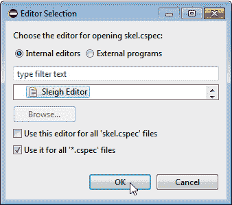

# 第十二章：*第十二章*：分析处理器模块

在本章中，我们将讨论如何在 Ghidra 中集成新的处理器模块。这是一个涉及学习**Ghidra 编码和解码规范语言**（**SLEIGH**）的高级主题，以便我们可以指定语言、反汇编代码、通过序言和尾声字节模式匹配执行函数识别、创建堆栈帧以及生成函数交叉引用。

在本章中，您将学习到分解高级逆向工程保护所需的极其有用的技能。您将通过实现一个虚拟机来实现这一点，以便对手（即您）在逆向工程原始二进制文件之前必须先对虚拟机应用逆向工程。本章涉及多个恶意软件示例（例如 ZeusVM、KINS 等）和基于虚拟化的强大软件保护（例如 VMProtect、Denuvo 等）。

**SLEIGH** 和 **SLED**

**SLEIGH**，Ghidra 处理器规范语言，其起源于**编码和解码规范语言**（**SLED**），描述了机器指令的抽象、二进制和汇编语言表示。如果您想了解更多关于 SLEIGH 的内容，这是一个广泛的主题，请查看以下链接：[`ghidra.re/courses/languages/html/sleigh.html`](https://ghidra.re/courses/languages/html/sleigh.html)。如果您想了解更多关于 SLED 的内容，请查看以下链接：[`www.cs.tufts.edu/~nr/pubs/specifying.html`](https://www.cs.tufts.edu/~nr/pubs/specifying.html)。

我们将首先概述现有的广泛的 Ghidra 处理器模块列表及其在 Ghidra 中的使用方式。最后，我们将从 Ghidra 开发者的角度分析**x86 处理器模块**。正在分析的加载程序负责启用 Ghidra，以便我们可以理解其 x86 架构及其变体（例如，16 位实模式）。与前一章节一样，我们将查看一个真实世界的例子来帮助我们理解。

在本章中，我们将涵盖以下主题：

+   理解现有的 Ghidra 处理器模块

+   Ghidra 处理器模块的框架

+   开发 Ghidra 处理器

让我们开始吧！

# 技术要求

本章的技术要求如下：

+   Java JDK 11（适用于 x86_64，可在此处获取）：[`adoptopenjdk.net/releases.html?variant=openjdk11&jvmVariant=hotspot`](https://adoptopenjdk.net/releases.html?variant=openjdk11&jvmVariant=hotspot)

+   适用于 Java 开发者的 Eclipse IDE（任何支持 JDK 11 的版本都可在此处获取：[`www.eclipse.org/downloads/`](https://www.eclipse.org/downloads/)），因为它是 Ghidra 官方集成和支持的 IDE。

+   本书的 GitHub 仓库，包含了本章所需的所有代码（[`github.com/PacktPublishing/Ghidra-Software-Reverse-Engineering-for-Beginners/tree/master/Chapter12`](https://github.com/PacktPublishing/Ghidra-Software-Reverse-Engineering-for-Beginners/tree/master/Chapter12)）。

查看以下链接以查看代码演示视频：[`bit.ly/2VQjNFt`](https://bit.ly/2VQjNFt)

# 了解现有的 Ghidra 处理器模块

本节将从用户的角度提供 Ghidra 处理器模块的概述。Ghidra 支持许多处理器架构。您可以通过列出 `Ghidra/Processors/` 目录中包含的目录，来查看支持的架构列表，该目录位于 Ghidra 的发行版和 Ghidra 的 GitHub 仓库（https://github.com/NationalSecurityAgency/ghidra/tree/master/Ghidra/Processors）中，如下图所示：


图 12.1 – 列出 Ghidra 的处理器模块（部分列表）

在撰写本书时，Ghidra 支持以下处理器列表：`6502`、`68000`、`6805`、`8048`、`8051`、`8085`、`AARCH64`、`ARM`、`Atmel`、`CP1600`、`CR16`、`DATA`、`Dalvik`、`HCS08`、`HCS12`、`JVM`、`M8C`、`MCS96`、`MIPS`、`PA-RISC`、`PIC`、`PowerPC`、`RISCV`、`Sparc`、`SuperH`、`SuperH4`、`TI_MSP430`、`Toy`、`V850`、`Z80`、`tricore` 和 `x86`。如果我们将这个列表与 IDA 专业版的处理器支持进行比较，我们会发现 IDA 支持更多的处理器，尽管它没有提供 Ghidra 支持。但如果将 Ghidra 与 IDA 家庭版进行比较，我们会注意到 Ghidra 支持更多的架构，包括一些非常常见的架构，例如 Dalvik（Android 使用的已停用虚拟机）和 **Java 虚拟机** (**JVM**)。

以加载 x86 架构的二进制文件为例，您可能还记得 *第十一章*，*融合新的二进制格式*，当加载文件时，您可以通过点击**语言**旁边的省略号按钮 (**…**)，来选择文件的显示语言，如下图所示：


图 12.2 – 导入 PE 文件时的默认语言变体

完成这个后，我取消选中了**仅显示推荐的语言/编译器规格**，以便显示所有可用的语言和编译器。通过这样做，我可以看到 x86 处理器模块实现了八个变体：


图 12.3 – 导入文件时选择适当的语言变体

让我们分析处理器模块的结构，以了解这些变体如何与 `tree` 命令相关，以提供 x86 处理器和分析器的目录结构概览。

`data` 目录包含了 x86 处理器模块：

```
C:\Users\virusito\ghidra\Ghidra\Processors\x86>tree
```

```
├───data
```

```
│   ├───languages
```

```
│   │   └───old
```

```
│   ├───manuals
```

```
│   └───patterns
```

正如你所见，有三个子文件夹在实现它：

+   `languages`：这个负责使用不同类型的文件实现 x86 处理器，所有这些文件稍后都会解释 (`*.sinc`, `*.pspec`, `*.gdis`, `*.dwarf`, `*.opinion`, `*.slaspec`, `*.spec`, 和 `*.ldefs`)。

+   `manuals`：处理器的手册文档存储在这里，使用 `*.idx` Ghidra 格式。这个索引了原始 PDF 的信息，因此允许你查询文档。

+   `patterns`：字节模式存储在 XML 文件中，用于确定导入文件是否是为 x86 架构开发的。

`src` 目录包含了 x86 分析器。你可能还记得分析器扩展是从 *The Ghidra Extension Module Skeleton* 章节中的 *第四章**，使用 Ghidra 扩展* 中介绍的。这些扩展允许我们扩展 Ghidra 的代码分析功能：

```
└───src
```

```
    ├───main
```

```
    │   └───java
```

```
    │       └───ghidra
```

```
    │           ├───app
```

```
    │           │   ├───plugin
```

```
    │           │   │   └───core
```

```
    │           │   │       └───analysis
```

```
    │           │   └───util
```

```
    │           │       └───bin
```

```
    │           │           └───format
```

```
    │           │               ├───coff
```

```
    │           │               │   └───relocation
```

```
    │           │               └───elf
```

```
    │           │                   ├───extend
```

```
    │           │                   └───relocation
```

```
    │           └───feature
```

```
    │               └───fid
```

```
    │                   └───hash
```

```
    └───test.processors
```

```
        └───java
```

```
            └───ghidra
```

```
                └───test
```

```
                    └───processors
```

分析器扩展的主文件是 `X86Analyzer` Java 类文件（完整路径：`Ghidra\Processors\x86\src\main\java\ghidra\app\plugin\core\analysis\X86Analyzer.java`）。这个类扩展自 `ConstantPropagationAnalyzer`（完整路径：`Ghidra/Features/Base/src/main/java/ghidra/app/plugin/core/analysis/ConstantPropagationAnalyzer.java`），它本身扩展自 `AbstractAnalyzer`（在编写分析器扩展时必须直接或间接扩展的类）。

在这一部分，你了解了现有处理器和分析器以及它们的源代码结构。在下一部分中，我们将探讨如何创建一个新的处理器模块。

# 查看 Ghidra 处理器模块的框架

在这一部分，我们将看一下 Ghidra 处理器模块的框架。这个框架会有一点不同，因为处理器模块不是用 Java 编写的。相反，处理器模块是用 SLEIGH 编写的，这是 Ghidra 处理器规范语言。

## 设置处理器模块开发环境

在创建新的处理器模块之前，你需要设置一个环境：

1.  安装 x86_64 的 Java JDK，如 *第三章* 中所述，*Ghidra 调试模式*，在 *安装 Java JDK* 部分。

1.  安装 Java 开发人员的 Eclipse IDE，如 *第三章* 中所述，*Ghidra 调试模式*，在 *安装 Eclipse IDE* 部分。

1.  安装 `GhidraDev` 插件到 Eclipse，如 *第三章* 中所述，*Ghidra 调试模式*，在 *安装 GhidraDev* 部分。

1.  另外，与安装`GhidraDev`的方式相同，因为你需要使用 SLEIGH 来开发处理器的规格，强烈建议你也安装`GhidraSleighEditor`。

`GhidraSleighEditor`的安装过程与`GhidraDev`相同，因为两者都是 Eclipse 插件。它是一个可以从 Eclipse IDE 安装的 ZIP 文件，你可以在 Ghidra 安装的`Extensions\Eclipse\GhidraSleighEditor`目录中找到简单的安装指南（`GhidraSleighEditor_README.html`）和插件安装程序（`GhidraSleighEditor-1.0.0.zip`）：


图 12.4 – Eclipse IDE 的 GhidraSleighEditor 插件

在下一节中，我们将学习如何创建处理器模块骨架。

## 创建处理器模块骨架

正如你可能还记得的*第四章*，*使用 Ghidra 扩展*，要创建处理器模块，你必须点击`ProcessorModuleProject`，如下面的截图所示：


图 12.5 – 创建 Ghidra 项目

点击**下一步 >**后，只需勾选最后一个选项 – **处理器 – 启用处理器/架构的反汇编/反编译** – 以创建处理器模块骨架：


图 12.6 – 配置 Ghidra 项目以包含处理器模块骨架

点击**完成**后，你将在 Eclipse 的**包资源管理器**部分看到处理器骨架：


图 12.7 – 处理器模块骨架

组成骨架的所有文件都存储在`data\languages`目录中。由于每个文件都有自己的规格目标，让我们更详细地看一下它们：

+   `skel.cspec`：顾名思义，这是一个编译器规格文件。它允许我们编码特定于编译器的信息，在反汇编和分析二进制文件时是必要的。你可以通过访问[`github.com/NationalSecurityAgency/ghidra/blob/master/Ghidra/Features/Decompiler/src/main/doc/cspec.xml`](https://github.com/NationalSecurityAgency/ghidra/blob/master/Ghidra/Features/Decompiler/src/main/doc/cspec.xml)了解更多信息。

+   `skel.ldefs`：根据扩展名，这是处理器语言的定义。

+   `skel.opinion`: 正如你可能还记得上一章所述，意见文件包含约束条件，允许我们确定导入器是否可以加载文件。您可以通过访问[`github.com/NationalSecurityAgency/ghidra/blob/master/Ghidra/Framework/SoftwareModeling/data/languages/Steps%20to%20creation%20of%20Format%20Opinion.txt`](https://github.com/NationalSecurityAgency/ghidra/blob/master/Ghidra/Framework/SoftwareModeling/data/languages/Steps%20to%20creation%20of%20Format%20Opinion.txt)了解更多信息。

+   `skel.pspec`: 正如其名称所示，这个文件是一个处理器规范文件。

+   `skel.sinc`: 正如其名称所示，这是一个指定处理器语言指令的 SLEIGH 文件（例如，如果要定义 x86 的`mov`汇编语言指令，必须在此处定义）。

+   `skel.slaspec`: 这是 SLEIGH 语言规范，允许我们指定处理器（例如，寄存器、标志等）。

正如我们之前提到的，SLEIGH 是一个广泛的主题，所以如果您想了解更多，请阅读您的 Ghidra 发行版中提供的文档（`docs\languages\html\sleigh.html`）。

现在您已经安装了 SLEIGH 编辑器，您可以通过右键单击目标文件，选择**打开方式** | **其他…**，然后选择**Sleigh 编辑器**来编辑所有上述文件：


图 12.8 – 在 Eclipse 中使用其他编辑器打开文件

如果您愿意，您还可以将此作为一个机会，通过在单击**确定**之前选中**用于所有'*.cspec'文件**选项来关联`*.cspec`文件：



图 12.9 – 选择 Sleigh 编辑器在 Eclipse 中打开文件

当您被要求将项目转换为 Xtext 项目时，请选择**否**。同时，通过选中**记住我的决定**复选框，使计算机记住这个决定，如下截图所示：


图 12.10 – 将项目转换为 Xtext 项目对话框

我们通过提供现有处理器模块（x86 处理器）的概述并从 Ghidra 用户的角度进行分析来开始本节。您浅显地探索了组成它的代码文件，以便理解处理器模块的整体情况。之后，您学会了如何设置处理器模块开发环境和处理器模块骨架，以便开始开发新的处理器模块。

在接下来的部分中，我们将探讨第一节中查看的 x86 处理器是如何实现的，*现有处理器模块*，以便深入了解其实现细节。

# 开发 Ghidra 处理器

如你所知，Ghidra 处理器模块的开发涉及许多不同的文件，这些文件位于模块的`data`目录中。这些文件在清单中列出（[`github.com/NationalSecurityAgency/ghidra/blob/master/Ghidra/Processors/x86/certification.manifest`](https://github.com/NationalSecurityAgency/ghidra/blob/master/Ghidra/Processors/x86/certification.manifest)）：


图 12.11 – certification.manifest 的部分内容转储

在下一节中，我们将查看 Ghidra 的处理器文档文件及其与官方处理器文档的关系。

## 处理器文档

x86 处理器的`manuals`目录存储着`x86.idx`文件（[`github.com/NationalSecurityAgency/ghidra/blob/master/Ghidra/Processors/x86/data/manuals/x86.idx`](https://github.com/NationalSecurityAgency/ghidra/blob/master/Ghidra/Processors/x86/data/manuals/x86.idx)），该文件包含了该架构的官方指令集参考的索引版本（[`software.intel.com/sites/default/files/managed/a4/60/325383-sdm-vol-2abcd.pdf`](https://software.intel.com/sites/default/files/managed/a4/60/325383-sdm-vol-2abcd.pdf)）。这个索引版本使得 Ghidra 在逆向过程中从 Ghidra 的图形用户界面中检索指令信息时能够访问这些信息。以下代码片段是`x86.idx`文件开头的一些行。它们与处理器指令及其文档页有关（例如，`01`行与`AAA`处理器指令相关，这可以在官方文档的`120`页找到）：

```
00  @325383-sdm-vol-2abcd.pdf [Intel 64 and IA-32 Architectures Software Developer's Manual Volume 2 (2A, 2B, 2C & 2D): Instruction Set Reference, A-Z, Oct 2019 (325383-071US)]
```

```
01  AAA, 120
```

```
02  AAD, 122
```

```
03  BLENDPS, 123
```

```
04  AAM, 124
```

```
05  AAS, 126
```

```
06  ADC, 128
```

```
07  ADCX, 131
```

```
08  ADD, 133
```

```
...................... File cut here .........................
```

在下一节中，我们将学习如何编写签名，以便 Ghidra 能够识别此架构的函数和代码片段。

## 使用模式识别函数和代码

还有一个`patterns`目录，在该目录中，使用 XML 语言指定的模式用于函数和代码的识别。该目录通过考虑不同的编译器来实现这一点。模式文件的格式（例如，[`github.com/NationalSecurityAgency/ghidra/blob/master/Ghidra/Processors/x86/data/patterns/x86gcc_patterns.xml`](https://github.com/NationalSecurityAgency/ghidra/blob/master/Ghidra/Processors/x86/data/patterns/x86gcc_patterns.xml)）是一个以`patternlist`标签开始和结束的 XML 文件：

```
00  <patternlist>
```

```
01    … patters here …
```

```
02  </patternlist>
```

你可以添加模式，允许分析器识别函数和代码。在以下示例中，来自 x86 GCC 模式文件（`x86gcc_patterns.xml`），我们可以看到一个使用`pattern`标签的模式。该模式本身以十六进制字节表示。为了帮助你理解，右侧添加了一个注释，指示这些字节的含义（在这种情况下，这是一个函数的前奏）。

在 `data` 部分之后，我们有两个标签：`codeboundary` 和 `possiblefuncstart`。这些标签的位置很重要，因为它们位于 `data` 部分之后，`codeboundary` 和 `possiblefuncstart` 的含义必须从 `data` 部分指示的模式开始理解。`codeboundary` 表示代码的开始或结束（它是一个边界），而 `possiblefuncstart` 表示匹配模式的字节可能位于函数的开头：

```
00  <patternlist>
```

```
01    <pattern>
```

```
02      <data>0x5589e583ec</data> <!-- PUSH EBP : MOV EBP,ESP 
```

```
                                                : SUB ESP, -->
```

```
03      <codeboundary/>
```

```
04      <possiblefuncstart/>
```

```
05    </pattern>
```

```
06  </patternlist>
```

您还可以使用 `patternpairs` 来定义通常一起出现的两个模式，一个在另一个之前。这些模式分别称为 `prepatterns` 和 `postpatterns`。例如，函数结束时的模式（在第 `03` 行指定的 `prepattern`）通常在另一个函数的开始之前（在第 `09` 行指定的 `postpattern`）：

```
00  <patternpairs totalbits="32" postbits="16">
```

```
01    <prepatterns>
```

```
02      <data>0x90</data> <!-- NOP filler -->
```

```
03      <data>0xc3</data> <!-- RET -->
```

```
04      <data>0xe9........</data> <!-- JMP big -->
```

```
05      <data>0xeb..</data> <!-- JMP small -->
```

```
06      <data>0x89f6</data> <!-- NOP (MOV ESI,ESI) -->
```

```
07    </prepatterns>
```

```
08    <postpatterns>
```

```
09      <data>0x5589e5</data> <!-- PUSH EBP : MOV EBP,ESP -->
```

```
10      <codeboundary/>
```

```
11      <possiblefuncstart/>
```

```
12    </postpatterns>
```

```
13  </patternpairs>
```

在下一节中，我们将学习如何为这样一个处理器指定汇编语言，使用**带有属性记录格式的调试**（**DWARF**）。

## 指定语言及其变体

在 `languages` 目录中，我们有许多不同名称的文件（每个名称实现语言的一个变体）和不同的扩展名（每个扩展名负责指定当前语言）。让我们分析实现处理器 x86 变体的 x86 文件（还有其他变体，如 x86-64 和 x86-16）。

### x86.dwarf

这个文件描述了使用 Ghidra 名称和 DWARF 寄存器编号之间的映射来描述架构的寄存器。DWARF 是一种标准化的调试数据格式。DWARF 映射由架构的**应用二进制接口**（**ABI**）描述（可在此处找到：[`www.uclibc.org/docs/psABI-i386.pdf`](https://www.uclibc.org/docs/psABI-i386.pdf)）。Ghidra DWARF 文件如下所示：

```
00  <dwarf>	
```

```
01  	 <register_mappings>
```

```
02  	   <register_mapping dwarf="0" ghidra="EAX"/>
```

```
03  	   <register_mapping dwarf="1" ghidra="ECX"/>
```

```
04  	   <register_mapping dwarf="2" ghidra="EDX"/>
```

```
 . . . . . . . . . . . . cut here . . . . . . . . . . . . . .
```

当然，除了将 Ghidra 寄存器名称与 DWARF 编号匹配之外，属性还用于指定 x86 架构中 ESP 寄存器作为堆栈指针的用途（`stackpointer` 属性）：

```
<register_mapping dwarf="4" ghidra="ESP" stackpointer="true"/>
```

属性也可以用来缩写代码。例如，它们可以用来一次性声明八个寄存器。通过 `auto_count` 属性，可以使用一行代码声明寄存器 `XMM0` 到 `XMM7`：

```
<register_mapping dwarf="11" ghidra="ST0" auto_count="8"/>
```

这个 XML 包含了映射寄存器。在下一节中，我们将学习如何定义 x86 处理器语言。

DWARF 调试格式

如果您想了解更多关于 DWARF 的信息，请访问官方网站：[`dwarfstd.org/`](http://dwarfstd.org/)。

### x86.ldefs

此文件定义了 x86 处理器语言及其变种。所有语言都在`language_definitions`标签内指定（`00`和`19`行）。例如，x86 语言的默认变种（`04`行）对应于 x86 架构（`01`行）用于 32 位机器（`03`行）并采用小端模式（`02`行），对用户显示为`x86:LE:32:default`（`09`行），其定义在`01`到`18`行（语言标签）之间。它的规范还可以包括外部工具中处理器变种的名称（`12`到`16`行）。

它还引用了一些外部文件：`x86.sla`（SLEIGH 语言规范文件）在`06`行，`x86.pspec`（处理器规范文件）在`07`行，`x86.idx`（x86 架构索引手册）在`08`行，`x86.dwarf`（DWARF 注册表映射文件）在`16`行：

```
00  <language_definitions>
```

```
01    <language processor="x86"
```

```
02              endian="little"
```

```
03              size="32"
```

```
04              variant="default"
```

```
05              version="2.9"
```

```
06              slafile="x86.sla"
```

```
07              processorspec="x86.pspec"
```

```
08              manualindexfile="../manuals/x86.idx"
```

```
09              id="x86:LE:32:default">
```

```
10      <description>Intel/AMD 32-bit x86</description>
```

```
11      <compiler name="gcc" spec="x86gcc.cspec" id="gcc"/>
```

```
12      <external_name tool="gnu" name="i386:intel"/>
```

```
13      <external_name tool="IDA-PRO" name="8086"/>
```

```
14      <external_name tool="IDA-PRO" name="80486p"/>
```

```
15      <external_name tool="IDA-PRO" name="80586p"/>
```

```
16      <external_name tool="DWARF.register.mapping.file"
```

```
17                                          name="x86.dwarf"/>
```

```
18    </language>
```

```
      . . . . . . . more languages here . . . . . .
```

```
19  </language_definitions>
```

在下一节中，我们将学习与导入文件相关的处理器规范。

### x86.opinion

此文件包含一些约束条件，允许我们确定文件是否可以被导入程序加载。例如，对于`windows`编译器（`02`行）中的`PE`文件（`01`行）的约束条件是在`03`到`10`行之间指定的。每个约束都有其主值，当你加载文件时，可以使用`opinion`查询服务来查询这些值：

```
00  <opinions>
```

```
01      <constraint loader="Portable Executable (PE)">
```

```
02        <constraint compilerSpecID="windows">
```

```
03          <constraint primary="332" processor="x86"     
```

```
04                            endian="little" size="32" />
```

```
05          <constraint primary="333" processor="x86"     
```

```
06                            endian="little" size="32" />
```

```
07          <constraint primary="334" processor="x86"     
```

```
08                            endian="little" size="32" />
```

```
09          <constraint primary="34404" processor="x86"     
```

```
10                            endian="little" size="64" />
```

```
11        </constraint>
```

在下一节中，我们将学习如何指定有关目标架构的编译器的必要信息。

### x86.pspec

编译器规范文件允许我们编码与编译器相关的信息，这是在反汇编和分析二进制文件时必需的（例如，`08`行上的程序计数器）：

```
00  <processor_spec>
```

```
01    <properties>
```

```
02      <property 
```

```
03           key="useOperandReferenceAnalyzerSwitchTables" 
```

```
04                                          value="true"/>
```

```
05      <property key="assemblyRating:x86:LE:32:default" 
```

```
06                                      value="PLATINUM"/>
```

```
07    </properties>
```

```
08    <programcounter register="EIP"/>
```

```
09    <incidentalcopy>
```

```
10      <register name="ST0"/>
```

```
11      <register name="ST1"/>
```

```
12    </incidentalcopy>
```

```
13    <context_data>
```

```
14      <context_set space="ram">
```

```
15        <set name="addrsize" val="1"/>
```

```
16        <set name="opsize" val="1"/>
```

```
17      </context_set>
```

```
18      <tracked_set space="ram">
```

```
19        <set name="DF" val="0"/>
```

```
20      </tracked_set>
```

```
21    </context_data>
```

```
22    <register_data>
```

```
23      <register name="DR0" group="DEBUG"/>
```

```
24      <register name="DR1" group="DEBUG"/>
```

```
25    </register_data>
```

```
26  </processor_spec>
```

在下一节中，我们将学习如何使用 SLEIGH 语言指定处理器架构。

### x86.slaspec

SLEIGH 语言规范允许我们指定处理器。在这种情况下，实现被拆分成许多包含在`x86.slapec`中的文件。在这里，我们关注的是`ia.sinc`，它实现了此语言的 x86 32 位变种：

```
00  @include "ia.sinc"
```

如果你想编写自己的语言，那么你需要了解更多关于 SLEIGH 的信息（https://ghidra.re/courses/languages/html/sleigh.html）。以下是`ia.sinc`的一个片段，它允许我们实现 x86 32 位交换指令与 PCode 交换操作之间的匹配：

```
00  define pcodeop swap_bytes;
```

```
:MOVBE Reg16, m16       is vexMode=0 & opsize=0 & byte=0xf; byte=0x38; byte=0xf0; Reg16 ... & m16  { Reg16 = swap_bytes( m16 ); }
```

```
:MOVBE Reg32, m32       is vexMode=0 & opsize=1 & mandover=0 & byte=0xf; byte=0x38; byte=0xf0; Reg32 ... & m32  { Reg32 = swap_bytes( m32 ); }
```

```
:MOVBE m16, Reg16       is vexMode=0 & opsize=0 & byte=0xf; byte=0x38; byte=0xf1; Reg16 ... & m16  { m16 = swap_bytes( Reg16 ); }
```

```
:MOVBE m32, Reg32       is vexMode=0 & opsize=1 & mandover=0 & byte=0xf; byte=0x38; byte=0xf1; Reg32 ... & m32  { m32 = swap_bytes( Reg32 ); }
```

```
@ifdef IA64
```

```
:MOVBE Reg64, m64       is vexMode=0 & opsize=2 & mandover=0 & byte=0xf; byte=0x38; byte=0xf0; Reg64 ... & m64  { Reg64 = swap_bytes( m64 ); }
```

```
:MOVBE m64, Reg64       is vexMode=0 & opsize=2 & mandover=0 & byte=0xf; byte=0x38; byte=0xf1; Reg64 ... & m64  { m64 = swap_bytes( Reg64 ); }
```

```
@endif
```

在本节中，你了解了 Ghidra 的 x86 处理器模块的结构以及一些实现细节。如果你计划开发自己的 Ghidra 处理器模块，这些信息将非常有用。如果你愿意，继续学习 SLEIGH 也是一个广泛且有趣的主题。

# 总结

在本章中，你了解了内置的 Ghidra 处理器及其变种。你还了解了使用 Ghidra 导入文件时这些处理器的表现。

你还学习了在 Ghidra 处理器模块开发中需要使用的技能以及 SLEIGH 语言，SLEIGH 语言更多的是用于指定而不是编程。通过学习这一点，你了解了处理器模块为何与众不同。随后，你通过动手实践并分析 x86 架构的 32 位处理器变体，了解了处理器模块的开发。

最后，你了解了如果想要进一步学习 SLEIGH 规范语言并编写自己的处理器模块，可以使用的 URL 资源。

在下一章中，我们将学习如何通过协作参与 Ghidra 项目，并成为社区的一部分。

# 问题

1.  处理器模块和分析器模块有什么区别？

1.  在编写模式时，标签的位置重要吗？

1.  语言和语言变体有什么区别？

# 深入阅读

请参阅以下链接，了解本章中涵盖的更多内容：

+   SLEIGH 文档：

    [`ghidra.re/courses/languages/html/sleigh.html`](https://ghidra.re/courses/languages/html/sleigh.html)

+   Ghidra 反编译器文档：

    [`github.com/NationalSecurityAgency/ghidra/tree/master/Ghidra/Features/Decompiler/src/main/doc`](https://github.com/NationalSecurityAgency/ghidra/tree/master/Ghidra/Features/Decompiler/src/main/doc)
