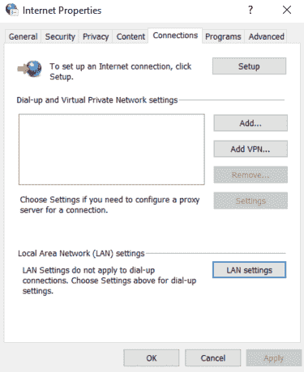
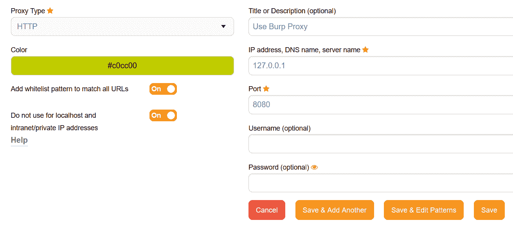
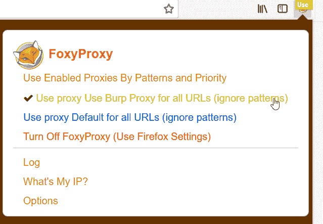
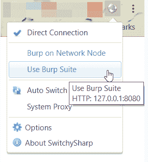

# 第二章：配置客户端和设置移动设备

一旦我们启动并配置了 Burp Suite 以充当所有通信都将发送到目标的代理，我们需要设置客户端以与 Burp 通信，以便通信路径完整。

几乎所有可以与 HTTP/HTTPS 服务器通信的客户端都有设置代理端点的方法。这告诉客户端它需要先将流量发送到代理端点，然后再将其转发到目标。不同的客户端有不同的设置代理设置的方式。一些客户端使用操作系统的代理设置来强制流量的路径。

在本章中，我们将看到如何为各种常见客户端设置代理选项，包括移动设备和传统计算设备。

我们将在本章中涵盖以下主题：

+   设置 Firefox、Chrome 和 Internet Explorer 以与 Burp Suite（HTTP 和 HTTPS）一起使用

+   可以用于管理代理设置的其他浏览器附加组件

+   为不支持代理的客户端设置系统范围的代理

+   设置 Android 和 iOS 以与 Burp Suite 一起使用

# 设置 Firefox 以与 Burp Suite（HTTP 和 HTTPS）一起使用

Firefox 长期以来一直是黑客的最爱。这在很大程度上是因为有大量的附加组件，可以扩展其功能和能力。Firefox 相对于行业中其他浏览器的主要优势之一是其能够使用与操作系统无关的代理设置。

即使操作系统设置了单独的系统代理，也可以设置 Firefox 使用特定代理。这允许使用需要单独代理的各种工具与 Firefox 一起使用，同时确保 Firefox 采用单独的路径。

请记住，包括 Firefox 在内的任何浏览器都没有专门的私人/无痕模式代理设置。

# 设置 Chrome 以与 Burp Suite（HTTP 和 HTTPS）一起使用

Google Chrome 使用系统代理来路由流量，除非使用命令行参数来指定代理服务器。这既可能很麻烦，也可能很有优势，因为您可以在不甚至打开 Chrome UI 的情况下在 Chrome 中设置代理。

要在 Chrome 中设置代理选项，请执行以下步骤：

1.  单击右上角的三个点，然后选择设置：


1.  在设置窗口中，键入代理以查找“打开代理设置”选项：


1.  这将打开 Windows Internet 属性对话框。

1.  单击 LAN 设置以打开设置页面：



1.  输入 Burp Suite 正在运行的系统的端口号和 IP 地址，如下面的屏幕截图所示：


1.  您还可以单击“高级”来使用不同协议的特定地址。请记住，这是一个系统范围的代理设置。


1.  单击确定以应用设置。

# 在 Linux 上设置 Chrome 代理选项

在 Linux 上，当您尝试设置 Google Chrome 的代理选项时，可能会遇到错误，如下所示：

```
When running Google Chrome under a supported desktop environment, the system proxy settings will be used. However, either your system is not supported or there was a problem launching your system configuration.But you can still configure via the command line. Please see man google-chrome-stable for more information on flags and environment variables.
```

在这种情况下，您可以通过命令行参数指定代理服务器，也可以通过编辑安装 Chrome/Chromium 时创建的`.desktop`文件来指定代理服务器。

启动 Google Chrome 的命令行参数是：

# 设置 Internet Explorer 以与 Burp Suite（HTTP 和 HTTPS）一起使用

Internet Explorer 和 Microsoft Edge 都使用 Windows 系统代理设置作为自己的首选项。

按照这些步骤将帮助您在 Internet Explorer 中设置代理选项：

1.  单击右上角的齿轮图标，然后选择 Internet 选项：


1.  互联网选项对话框将打开。单击连接|LAN 设置以管理 Internet Explorer 的代理设置。

请记住，这是一个系统范围的代理设置，系统上的大多数程序也会遵循这一设置，特别是如果它们没有自己的代理设置。

# 可用于管理代理设置的其他浏览器附加组件

在 Web 应用程序渗透测试期间，可能会出现需要切换代理设置的情况。有时您可能希望直接连接到互联网，而其他时候可能希望通过 Burp 传输流量。

还有一些情况，您可能希望所有流量都通过 Burp，除了[google.com](http://google.com)之外。在这种情况下，不断切换浏览器的代理设置可能会成为一种不愉快的用户体验。

因此，Firefox 和 Chrome 存在几个附加组件/扩展，允许您通过单击选项来切换浏览器的代理设置到不同的代理。

让我们...

# FoxyProxy for Firefox

在代理管理方面，Firefox 最受欢迎的附加组件是 Eric H Jung 编写的这个巧妙的小附加组件**FoxyProxy**：


FoxyProxy 允许您创建多个配置文件，可以设置为不同的代理端点，并在需要时随意选择。

这是 Firefox 中创建的多个配置文件的 FoxyProxy 外观。此菜单可作为 Firefox 窗口中的选项使用，可通过单击激活：


让我们以设置代理选项的简单示例为例：

1.  使用 Firefox 的`about:addons`页面安装 Firefox 扩展。附加组件名称是**FoxyProxy Standard**：


1.  安装完成后，右上角的设置按钮旁边会出现一个小狐狸图标。

1.  单击 FoxyProxy 图标，然后选择选项。

1.  单击**添加**以打开添加新代理的页面。

1.  添加描述您的 Burp 代理端点的所有详细信息。还要选择一个颜色。这是代理使用时狐狸图标将变成的颜色：



1.  新创建的代理将出现在可用代理配置文件列表中。

1.  单击狐狸图标以选择您的代理。您可以通过查看 Burp 中的流量来验证是否有效：



1.  要关闭代理并使用 Firefox 的默认选项（无代理），请选择关闭 FoxyProxy。

当涉及过滤域名甚至 URL 时，此附加组件非常强大。您可以添加匹配或不匹配的模式，并且只会导致特定域的流量通过 FoxyProxy，最终通过 Burp。

# Proxy SwitchySharp for Google Chrome

这是一个很棒的附加组件，可以在 Chrome 运行时轻松切换代理，特别是如果系统代理不是您想要发送网页流量的地方。


这是 Google Chrome 中创建的多个配置文件的 SwitchySharp 外观。此菜单可作为 Google Chrome 窗口中的选项使用，可通过单击激活：



1.  要开始使用这个附加组件，请通过 Chrome 网上商店安装它[`chrome.google.com/webstore/category/extensions`](https://chrome.google.com/webstore/category/extensions)：

# 为不支持代理的客户端设置系统范围的代理

在这种情况下，不支持代理的客户端是指通过 HTTPS 与互联网通信但没有设置代理服务器选项以便捕获流量的应用程序。这些应用程序使用系统代理设置。这在 Windows 上的厚客户端应用程序中很常见。

在这种情况下，我们可以设置系统范围的代理设置以与我们的应用程序配合使用。可以通过命令行和 GUI 设置系统范围的代理设置。但是，了解命令行选项可以让您编写脚本，以便您可以使用 bash 脚本或批处理文件切换系统范围的代理设置，具体取决于您所在的操作系统。

# Linux 或 macOS X

要在 Linux 命令行上使用代理，必须设置环境变量`http_proxy`、`https_proxy`或`ftp_proxy`，具体取决于流量类型。

为了有效地执行此操作，必须运行以下命令：

```
$ export http_proxy=http://127.0.0.1:8080$ export https_proxy="https:// 127.0.0.1:8080"$ export ftp_proxy="http:// 127.0.0.1:8080"
```

您可以通过`env`命令检查当前的代理设置：

```
env | grep -i proxy
```

# Windows

可以通过 Internet 选项|连接|LAN 设置应用 Windows 系统范围的代理设置。也可以使用 netsh 命令应用此设置，如以下步骤所示：

1.  以管理员身份启动 cmd

1.  运行`netsh winhttp set proxy 127.0.0.1:8080`

1.  要检查设置是否已应用，请运行以下命令：

```
netsh winhttp show proxy
```

1.  要重置代理，请运行：

```
netsh winhttp show proxy
```

# 设置 Android 与 Burp Suite 配合使用

要测试 Android 应用程序，甚至通过您的 Android 设备测试 Web 应用程序，您需要配置 Burp 代理以在接口上启动监听器，然后将 Android 设备和运行 Burp 的系统连接到相同的无线网络。

这会使 Burp 监听器对于相同网络上的 Android 设备可见和可访问。

按照以下步骤为您的 Android 设备设置代理：

1.  转到设置菜单。

1.  连接到与 Burp 相同的无线网络。

1.  如果您已连接，请单击无线连接名称，然后选择管理网络设置，如下图所示：

1.  单击“显示高级选项”，显示代理设置。单击...

# 为什么选择 Burp Suite？让我们先了解一些基础知识！

Burp Suite 是一个代理，它允许您拦截和篡改从浏览器到应用服务器的每个请求。这为测试人员提供了巨大的能力，可以对应用程序的所有途径进行渗透测试，因为它显示了所有可用的端点。它起到了中间件的作用。它给您带来的最大优势是能够绕过客户端验证。

它是一个智能工具，可以跟踪您的浏览历史，并管理站点结构，让您更清楚地了解可用的内容以及新发现的途径。Burp 的核心优势在于它允许您将 HTTP 请求转发到不同的 Burp 工具并执行所需的任务。这可能是重复或自动化攻击，解码某些参数，或比较两个或更多不同的请求。Burp 使用户能够在运行时解码参数以理解不同的格式；例如，解码`ViewState`参数，美化 JSON 请求等。

# 设置 iOS 与 Burp Suite 配合使用

要设置 iOS 设备与 Burp 配合使用，我们需要将 Burp 的网络监听器地址（与 Android 设备一样）添加到 iOS 设备的网络配置中。

要实现此目的，请按照以下步骤操作：

1.  在 iOS 设备上，打开设置。

1.  假设您已连接到无线网络，点击 Wi-Fi 选项，然后点击无线接入点名称旁边的信息图标。

1.  在 HTTP PROXY 部分下选择**手动**，并输入 Burp 监听器的 IP 地址和端口号。

1.  返回并浏览 iOS 设备浏览器上的 HTTP 站点，查看流量是否被 Burp 接收。

要能够访问 HTTPS 站点，您需要在 iOS 设备中添加 Burp 的 CA 证书。要...

# 总结

在本章中，我们学习了如何设置 Firefox、Chrome 和 Internet Explorer 通过 Burp Suite 发送和接收 HTTP 和 HTTPS 流量。我们为不支持代理的客户端配置了系统范围的代理设置。我们还了解了使在不同代理之间切换变得轻松的浏览器插件和扩展程序。

在下一章中，我们将学习如何执行应用程序渗透测试。
