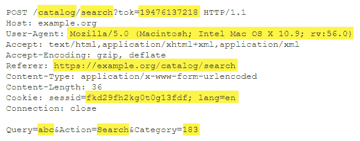
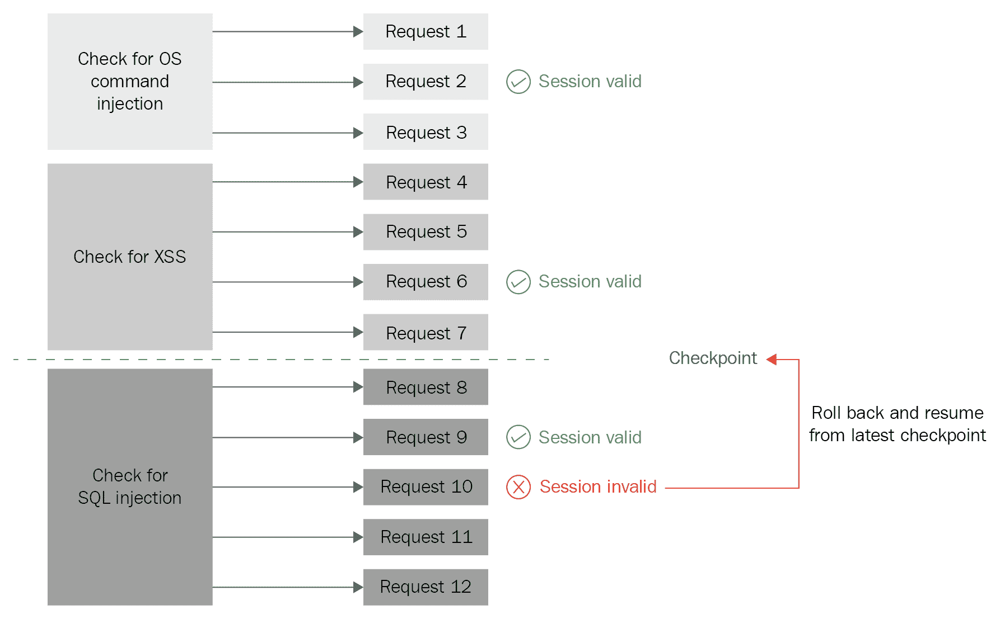

# 第三章：执行应用程序渗透测试

现在我们已经学会了如何在各种平台上配置和设置我们的 Burp 代理，我们现在可以开始进行应用程序渗透测试。在当今世界，执行渗透测试有各种目的；它可能是为了漏洞赏金，也可能是为了客户进行全面评估。初始方法通常是相同的；然而，最终存在巨大的差异。漏洞赏金猎人的目标是发现一个或一组可能导致严重不利后果的特定漏洞，以便他们可以获得赏金。

另一方面，对于一个完整的渗透测试，渗透测试人员的工作并不止于此。渗透测试人员将不得不执行完整的...

# 漏洞赏金和客户发起的渗透测试之间的区别

在我们深入了解核心细节之前，让我们首先了解这两种思维方式：

+   **漏洞赏金渗透测试思维**：

+   目标是发现具有影响并获得丰厚赏金的漏洞

+   不需要对应用程序进行完整评估

+   一个漏洞足以获得赏金

+   不报告应用程序中的所有漏洞，只报告发现的漏洞

+   没有特定的时间表；可以根据渗透测试人员的方便进行

+   **客户发起的渗透测试思维**：

+   目标是确保测试所有应用程序流程和功能

+   在整个应用程序需要进行审核的有限时间内

+   没有赏金或奖励

+   需要确保扫描器发现的所有漏洞都经过验证并报告

+   还需要确定整个应用程序的范围，了解所有相互依赖关系，并确保端点受到良好的保护，因为有时后端应用程序（如支持）可能不会向漏洞赏金猎人提供，但会在客户发起的评估中提供。

+   **两种思维方式的共同点**：

+   必须有头脑存在，以链接多个漏洞并对基础应用程序造成严重影响

+   还要确保攻击者了解特定应用程序的所有端点

+   确定整个应用程序的存在并测试所有端点以查找缺陷

花点时间思考一下这两种方法之间的区别。我相信您会同意，在执行渗透测试时需要有两种完全不同的思维方式。

# 启动渗透测试

如果不执行以下操作，应用程序渗透测试通常被认为是不完整的：

+   遵循执行侦察的标准方法

+   枚举功能

+   测试单个参数

+   创建测试用例

+   执行非侵入式利用

+   提供关于问题的报告

+   实施重现步骤，概念验证代码和可能的缓解措施

在我的职业生涯中，我多次遇到安全咨询公司或独立专业人士，他们通常运行自动扫描程序，仅检测到少数漏洞，几乎总是无法发现逻辑问题。然后这些漏洞会被利用，但是...

# 类型和特征

Burp Suite 配备了以下一组内置工具，以便于每个渗透测试人员的工作：

+   **扫描器**：帮助自动测试网站的内容和漏洞。它有主动和被动模式，可以由用户切换和配置。

+   **入侵者**：这允许用户对捕获的请求进行某些更改，并通过某些修改自动化任务，通过在每个请求中传递不同的参数值来进行暴力破解。

+   **重复器**：此功能允许用户即时修改标头值并多次向应用服务器发送请求。

+   **协作客户端**：这是 Burp 提供的一个非常有趣的功能。它允许用户检查带外漏洞。这些漏洞非常热门，因为它们不容易找到。

+   **Clickbandit**：此功能允许用户针对易受攻击的应用程序创建**点击劫持**页面。

+   **顺序器**：顺序器功能使用户能够分析应用程序的 cookie 生成机制的随机性；它为用户提供了对会话的随机性或可预测性的非常详细的分析。

+   **解码器**：这允许用户检查任何类型的编码，并允许用户将其解码为纯文本，反之亦然。

+   **比较器**：此功能允许用户比较两个或多个请求的响应，以找出它们之间的差异。

让我们看一下 Burp Suite 的以下低级图表：

您可以在以下三个部分中看到工具的分离：

+   **重建和分析**

+   **漏洞检测和利用**

+   **工具配置**

上图给出了如何处理请求的很好的想法。一旦请求被解析，工具将进行主动的蜘蛛爬行和主动的发现，同时允许用户在重建和分析阶段进行自定义发现。在此过程中，工具会将所有信息主动放入 HTTP 历史记录和站点地图以供以后使用。收集到这些信息后，用户可以将任何特定请求发送到重复器、入侵者或扫描器。扫描器可以在整个网站爬行后进行输入。

工具配置将允许用户管理身份验证、会话处理、任务调度和各种其他任务。代理是 Burp Suite 机制的核心。Burp Suite 扫描器是执行渗透测试的一体化自动化工具包。它可以从发现内容到发现漏洞等一切。还有许多插件可以用来增强扫描结果。我们将在后面的章节中讨论这些插件。Burp 扫描器主要包括两个部分：一个是内容爬行，另一个是审计：

+   **内容爬行**：Burp 爬虫几乎像真实用户一样浏览应用程序；它提交输入、表单，并捕获链接并创建应用程序的完整站点地图。它显示了找到的内容以及未返回响应的内容。

+   **审计**：这是实际的扫描器，将模糊所有参数以确定应用程序中是否存在漏洞。用户可以优化它以获得更好的性能。

现在我们熟悉了 Burp Suite 的类型和功能，我们将深入研究目录应用程序内容的爬行机制。

# 爬行

我想在这里强调一点，Burp 具有惊人的爬行机制，可以以最接近的准确度映射站点结构。爬行可能看起来是一个简单的任务，但对于现代动态应用程序来说并非如此。作为渗透测试人员，我们总是看到扫描器在爬行阶段由于 URL 方案的实现而陷入巨大的循环中，扫描似乎永远无法完成，特别是在测试购物车时。当发生这种情况时，真的很令人沮丧，因为那时你必须依赖完全手动的策略。另一方面，Burp 采取了非常聪明的方法。Burp 的爬虫模拟了用户在浏览器上浏览应用程序的方式。它模拟用户点击、导航和输入提交，...

# 为什么选择 Burp Suite 扫描器？

现在我们已经建立了对 Burp 爬虫的基本理解，是时候了解为什么 Burp 扫描器是任何渗透测试的首选扫描器了。大多数传统扫描器通常会模糊输入字段，检查响应，并确定是否存在漏洞。但是，如果应用程序有某些规则，比如，如果应用程序对每个请求强制执行动态 CSRF 呢？如果应用程序是一个非常动态的应用程序，根据状态为相同的 URL/页面提供不同的内容，或者如果应用程序在发生格式错误的请求时使用户无效呢？不用担心，因为 Burp 已经对此进行了不同处理，并理解了底层逻辑，使我们能够进行优化扫描。

# 审计员/扫描器

让我们继续了解 Burp 审计/扫描规则和机制。Burp 审计器主要分为以下三个核心类别：

+   被动阶段

+   主动阶段

+   JavaScript 分析阶段

这使得 Burp 能够主动发现和利用存储并返回给用户的功能，以响应输入。它还通过以最佳方式处理频繁发生的问题和插入点来避免重复。此外，它通过并行执行工作有效地利用系统资源。

Burp 审计器报告了大量问题，广泛涵盖以下类别：

+   **被动**：这是一种非侵入式的审计，纯粹基于接收到的请求和响应进行分析...

# 了解插入点

Burp 扫描器是一个非常高效的扫描器，因为它针对各种插入点。它针对输入字段、一组头部，如 cookie、引用者、用户代理等。Burp 扫描器通过将有效载荷单独发送到目标来单独分析目标，以查看应用程序如何处理有效载荷。以下是更好地了解插入点的方法：

Burp 还处理各种参数的数据编码。它了解正在使用的参数以及其后的任何编码。一旦检测到编码，它就会通过对有效载荷进行编码来模糊参数，如下图所示。例如，对于标准输入，它会传递一个正常的有效载荷：

对于 JSON 参数，它使用不同的有效载荷进行模糊处理：

对于 XML，它传递不同的有效载荷：

如果应用程序使用不同的编码，如 base64，Burp 会自动尝试检测正在使用的编码并相应地修改有效载荷：

如果应用程序使用嵌套编码，Burp 会尝试检测此行为并相应地创建有效载荷，以帮助测试漏洞：

还有我们之前讨论过的，Burp 通过尝试将参数传递到不同位置，如`POST`、`GET`请求，将值添加到头部，并对其进行模糊处理，来操纵参数的位置。这是为了绕过 Web 应用程序防火墙并尝试将参数发送到特定的应用程序功能：

这些都是 Burp 用来帮助对应用程序进行扫描的不同样式和机制。这里的核心问题是，它如何扫描并维护有效的会话，如果额外的安全措施已经放置？好消息是，Burp 扫描器从根节点爬到每个请求，然后根据应用程序的上下文测试请求。

Burp Suite 在从节点到节点遍历时满足以下条件：

+   直接测试是否在 cookie 中存在令牌、相同的令牌或 CSRF

+   在单个 CSRF 令牌和单次使用令牌的情况下，从根节点到请求路径的遍历

前面的图表显示了启发式爬行；如果您需要到达特定请求进行渗透测试，根节点有三个其他请求页面，Burp 将遍历所有这些页面并到达目标页面，就像模拟真实用户一样。这有什么帮助？这有助于测试使用每个请求 CSRF 令牌的严格应用程序。Burp 能够找出 CSRF 令牌的依赖关系，并通过从根节点遍历到目标请求并从响应中获取 CSRF，然后将其添加到下一个请求来执行高效的扫描，如下图所示：

您可能还想知道如果应用程序超时，会如何管理会话处理，或者会话超时，甚至会话失效，对吗？Burp 管理一个时间轴。它会创建一个时间戳并验证会话是否仍然有效。一旦验证，它会设置一个标记并进行其他测试，然后，当涉及到超时条件或无效会话时，它会返回到先前的标记并重新开始测试，以便给我们一个准确的渗透测试结果，涵盖所有参数。可以从以下截图中了解相同的参考信息：

总之，扫描器会做以下几件事情：

+   它会自动管理额外的安全设置并执行模糊测试，比如处理 CSRF 令牌类型

+   它管理编码并相应地编辑攻击有效载荷

+   它甚至通过双重编码有效载荷执行嵌套模糊测试

+   它遵循基于快照的方法来执行扫描

+   它还确保参数从`POST`到`GET`进行模糊测试，甚至将它们推送到标头中，以尝试执行有效载荷

# 总结

这涵盖了 Burp 扫描器和爬虫的完整基础，让我们完全了解工具的工作方式，并在不同的 Web 应用程序场景中执行扫描，以给出准确的结果。现在，在下一章中，我们将开始进行应用程序渗透测试所需的阶段。
