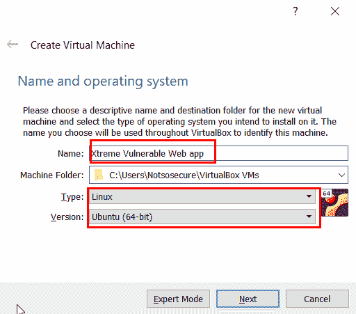
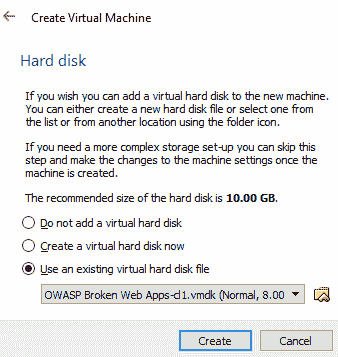
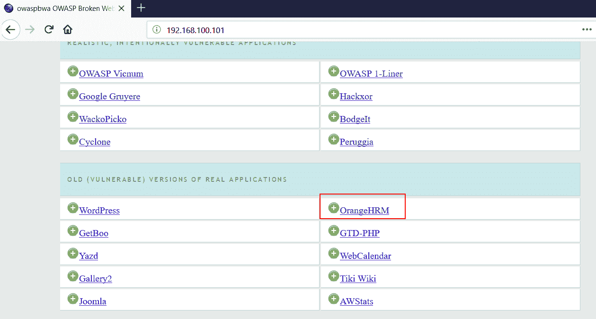
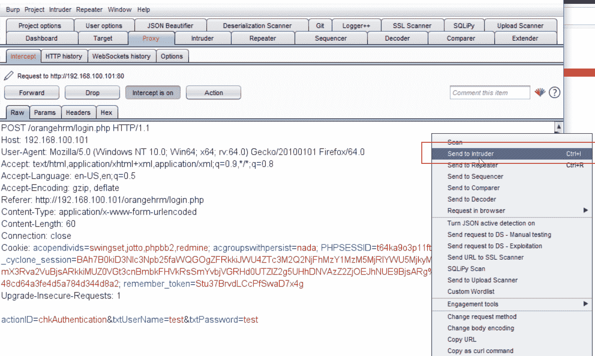
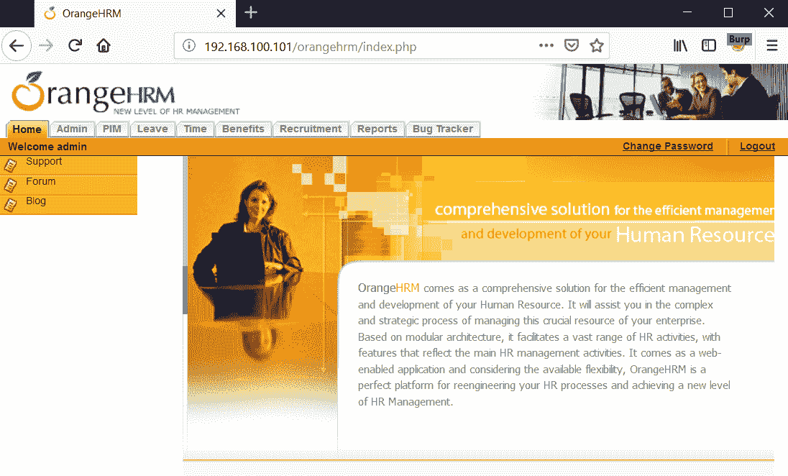

# 第五章：准备应用程序渗透测试

在本章中，我们将通过 Burp 对各种易受攻击的应用程序进行渗透测试，以更好地了解如何可以有效地使用 Burp Suite 进行渗透测试。

本章将涵盖以下主题：

+   易受攻击的 Web 应用程序的设置

+   侦察和文件发现

+   使用 Burp 测试身份验证模式

# 易受攻击的 Web 应用程序的设置

为了让我们开始本章，读者将不得不下载以下易受攻击的应用程序：

+   极端易受攻击的 Web 应用程序

+   OWASP Broken Web Applications

# 设置极端易受攻击的 Web 应用程序

为了设置极端易受攻击的 Web 应用程序，请按照以下步骤操作：

1.  下载极端易受攻击的 Web 应用程序；访问[`download.vulnhub.com/xvwa/`](https://download.vulnhub.com/xvwa/)，然后点击`xvwa.iso`。

1.  下载后，打开 VirtualBox，然后点击“新建”。

1.  设置新虚拟机的名称。我们已经给它以下名称：

1.  提供大约 1024 MB 的 RAM，如下面的屏幕截图所示：

1.  接下来，...

# 设置 OWASP Broken Web Application

为了设置 OWASP Broken Web Application，请按照以下步骤操作：

1.  从以下网址下载 OWASP BWA：[`download.vulnhub.com/owaspbwa/`](https://download.vulnhub.com/owaspbwa/)；转到网站，然后点击`OWASP_Broken_Web_Apps_VM_1.2.7z`。

1.  下载后，打开 VirtualBox，并如下图所示，点击“新建”。

1.  设置新虚拟机的名称。我们已经给它以下名称：

1.  提供大约 1024 MB 的 RAM，然后选择使用现有的虚拟硬盘文件选项，如下面的屏幕截图所示：

1.  选择提取的 OWASP Web Apps `.vmdk`文件，然后点击创建。这将创建一个虚拟机。要启动此虚拟机，请从虚拟机列表中选择该虚拟机，然后单击“启动”按钮。

# 通过 Burp 进行身份验证测试

本主题主要讨论在没有设置速率限制的情况下尝试暴力破解认证页面。我们将学习如何在各种登录页面上使用 Burp 尝试暴力破解具有一组用户名和密码字典的认证。最后，我们还将检查认证页面是否容易受到 SQL 注入的攻击。

# 使用 Burp Intruder 暴力破解登录页面

让我们不浪费时间，快速前往一些应用程序，看看我们如何使用 Burp 在认证页面上暴力破解凭据。我们将首先暴力破解 OWASP BWA 列表中的 OrangeHRM 应用程序。

一旦您打开应用程序，将显示登录页面；没有注册此应用程序的选项。因此，我们有两个选择，要么测试 SQL 注入，要么暴力破解基于字典的密码，希望其中一个用户名和密码组合有效。以下屏幕截图显示了主页：

该应用程序的默认凭据是`admin`:`admin`，但是，为了展示我们如何可以暴力破解登录页面，密码已更改为另一个字典词。让我们继续输入任意随机用户名和密码，`test`和`test`，然后点击登录。确保在这样做时，您的代理已打开，并且您收到拦截以将此请求发送到入侵者，如下面的屏幕截图所示：

转到入侵者选项卡，单击“清除”按钮以删除所有预定义的攻击点。我们的核心关注点是攻击用户名和密码值，因此我们选择用户名和密码字段，并将它们添加到我们的攻击点，并将攻击类型更改为集束炸弹，如下面的屏幕截图所示：

现在，在我们继续之前，让我们了解为什么选择集束炸弹作为攻击类型。Burp 的入侵者功能中有四种不同类型的攻击类型。这四种攻击类型是：

+   狙击手

+   攻城槌

+   Pitchfork

+   集束炸弹

我们已经在上一章中了解了这些攻击类型。现在我们已经了解了不同的攻击类型，让我们继续使用我们的集束炸弹，并为用户名和密码有效载荷输入值。转到有效载荷部分，选择有效载荷集 1，并在有效载荷选项中选择“从列表添加”，然后选择用户名。如果您使用 Burp Basic，您可以从[`github.com/danielmiessler/SecLists`](https://github.com/danielmiessler/SecLists)下载单词列表，选择“添加”选项，并提供用户名的路径。对于专业用户，请查看以下屏幕截图：

对于基本用户，一旦下载列表，只需单击“加载...”并提供顶部用户名简表文件的路径，如下面的屏幕截图所示：

同样，选择有效载荷集 2，并通过从列表中添加选项为专业用户选择密码，对于基本用户，通过加载选项选择。专业用户还可以使用自定义列表，如果不想使用 Burp 中的默认列表。因此，密码的有效载荷集已设置，如下面的屏幕截图所示：

配置完成后，我们可以单击“开始攻击”，它将暴力破解一组用户名和密码，如果任何组合命中正确，例如：

如您所见，其中一个组合成功了，并且给出了状态 302，这意味着这可能是正确的密码。让我们继续在浏览器中请求。右键单击请求，选择在浏览器中请求，然后在当前会话中，您将看到一个 Burp URL。将其复制并粘贴到 URL 空间中，如下面的屏幕截图所示，您已成功登录：

# 测试 SQL 注入的身份验证页面

在本模块中，我们将看到如何执行测试，以验证应用程序的身份验证页面是否容易受到 SQL 注入的攻击。我们将首先了解 SQL 注入如何影响登录页面，它的背景逻辑是什么，以及它如何执行并允许我们登录。然后我们将测试一些应用程序，看看应用程序是否容易受到 SQL 注入的攻击。

测试登录页面的 SQL 注入的魔术字符串具有相同的逻辑，但由于验证的原因表示不同。整个目的是尝试从 SQL 语法的输入字段中出来，并尝试执行有效载荷作为 SQL 查询的一部分，这将导致结果为 true。例如，一些样本...

# 总结

在本章中，我们设置了易受攻击的 Web 应用程序。此外，我们通过 Burp 进行了侦察，以检测应用程序中的文件和文件夹。最后，我们学习了如何在各种登录页面上使用 Burp 尝试使用一组用户名和密码字典进行暴力破解身份验证。

在下一章中，我们将使用 Burp Suite 识别漏洞
