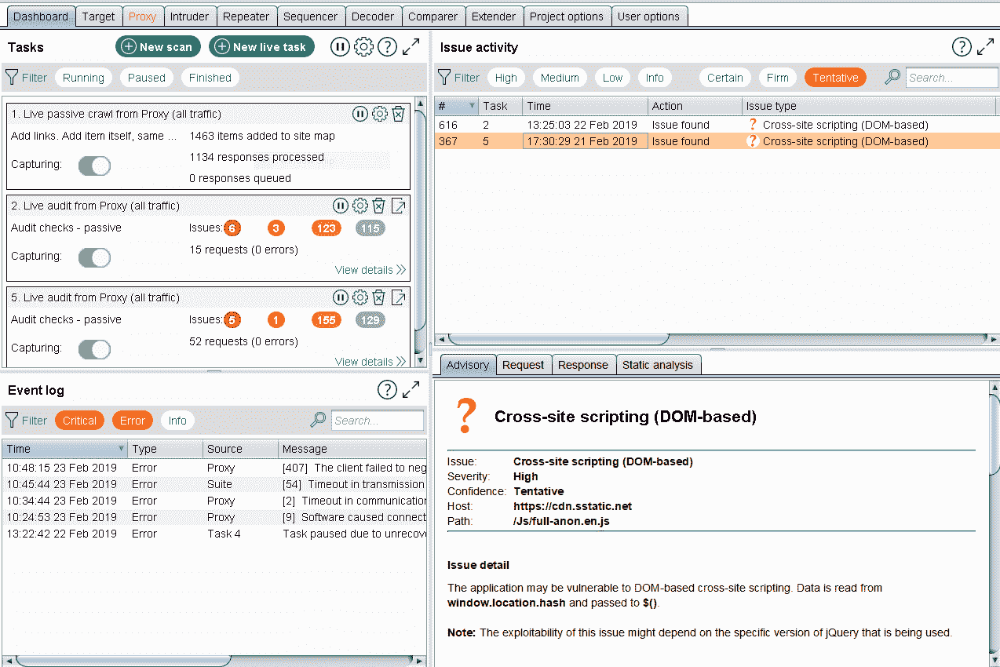
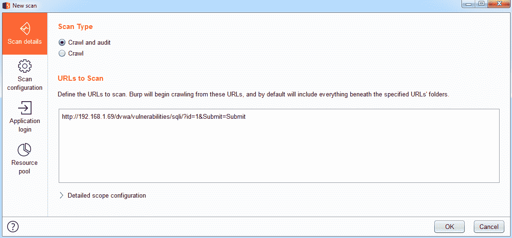
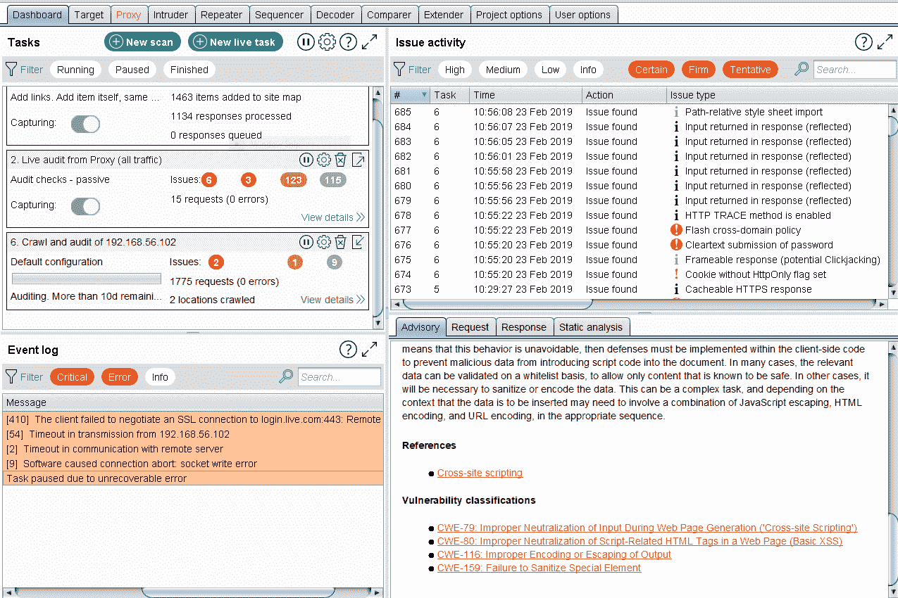
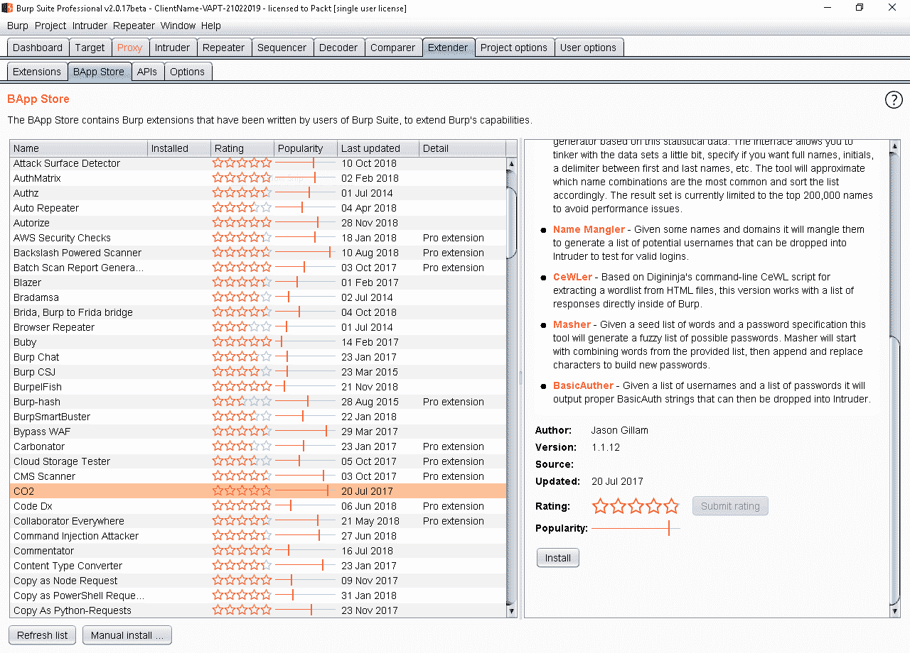
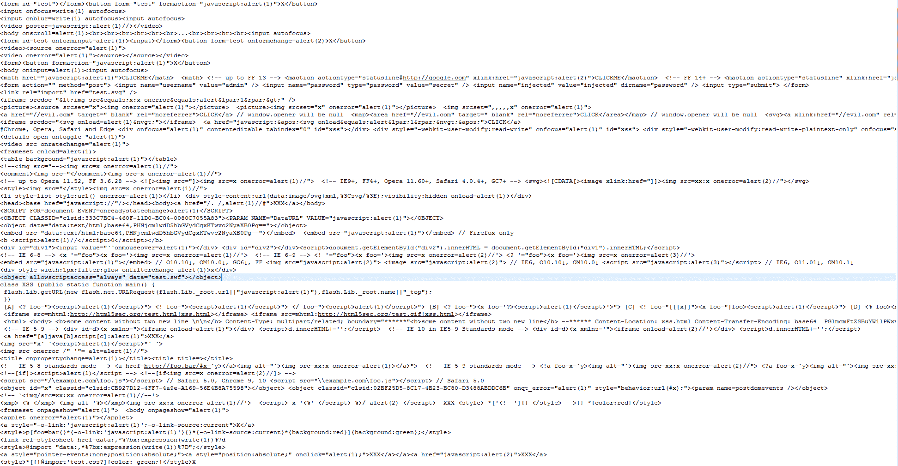
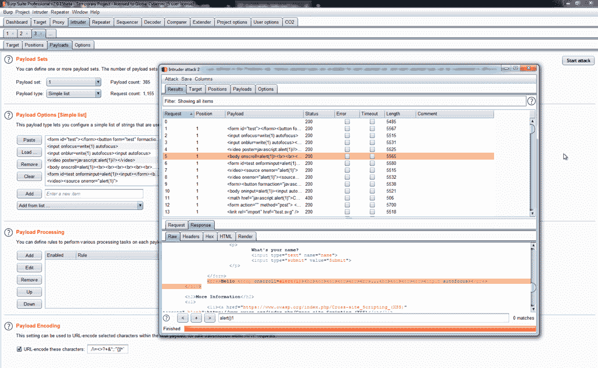
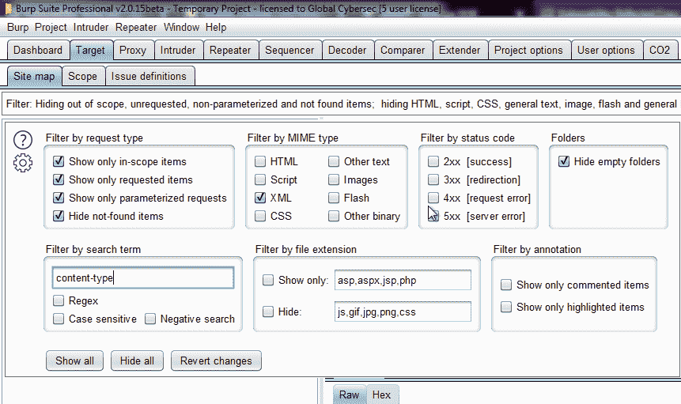

# 第六章：使用 Burp Suite 识别漏洞

Burp Suite 不仅是一个 HTTP 代理；它是一套完整的工具，用于检测和利用漏洞。事实上，我们将使用 Burp Suite 向开发人员解释这些漏洞是如何工作的，以一种他们可以理解的方式。在本章中，我们将重点介绍如何使用 Burp Suite 和一些扩展来检测漏洞。我们将涵盖以下主题：

+   检测 SQL 注入漏洞

+   检测操作系统命令注入

+   检测**跨站脚本**（**XSS**）漏洞

+   检测与 XML 相关的问题，如**XML 外部实体**（**XXE**）

+   检测**服务器端模板注入**（**SSTI**）

+   检测**服务器端请求伪造**（**SSRF**）

# 检测 SQL 注入漏洞

SQL 注入是由应用程序中弱输入验证控件生成的漏洞。它允许恶意用户执行任意的 SQL 代码，从而暴露存储的信息，并在一些关键情况下允许完全控制应用程序所在的服务器。

使用 Burp Suite 检测 SQL 注入有三种主要方法：首先，通过手动插入测试字符串；其次，通过使用扫描程序；第三，通过使用名为 CO2 的扩展，该扩展在后台使用**sqlmap**，这是一种用于利用和检测 SQL 注入的工具。让我们来看看这三种方法。

# 手动检测

手动检测意味着逐个分析请求，仅使用**代理**工具和**入侵者**工具，以检测错误或意外行为以检测 SQL 注入。

假设您有一个应用程序，允许用户查看数据库中注册用户的信息；为此，应用程序将使用以下请求：

```
GET /dvwa/vulnerabilities/sqli/?id=1&Submit=Submit HTTP/1.1 Host: 192.168.1.72 User-Agent: Mozilla/5.0 (Windows NT 6.1; Win64; x64; rv:66.0) Gecko/20100101 Firefox/66.0 Accept: text/html,application/xhtml+xml,application/xml;q=0.9,*/*;q=0.8 Accept-Language: en-US,en;q=0.5 Accept-Encoding: gzip, deflate Referer: http://192.168.1.72/dvwa/vulnerabilities/sqli/ Connection: close Cookie: security=low; ...
```

# 扫描程序检测

通过扫描程序，使用 Burp Suite 检测 SQL 注入和任何漏洞的最简单方法。要使用扫描程序，请执行以下操作：

1.  打开 Burp Suite 查看主要仪表板，如下面的屏幕截图所示。请注意，这仅适用于专业版；社区版没有“扫描程序”选项。如果您使用社区版，则使用 ZAP 代理中包含的扫描程序（可以在此处找到：[`www.owasp.org/index.php/OWASP_Zed_Attack_Proxy_Project`](https://www.owasp.org/index.php/OWASP_Zed_Attack_Proxy_Project)）：



1.  在此屏幕上，单击“新扫描”。此按钮将启动配置扫描的向导；在这里，您可以添加要扫描的所有 URL，限制扫描范围，为经过身份验证的扫描设置凭据，并创建特定任务，如过滤器。要执行应用程序扫描，请输入要扫描的 URL，如下面的屏幕截图所示：



1.  接下来，单击“应用程序登录”并为应用程序添加凭据。在这种情况下，我们为网站添加用户，如下面的屏幕截图所示：


1.  单击“确定”按钮，扫描程序将开始检测，如下面的屏幕截图所示。Burp Suite 将询问您是否需要更多信息来执行扫描：



现在，让我们继续下一个检测方法，即 CO2 检测。

# CO2 检测

CO2 是 Burp Suite 的热门扩展，集成了 Python 开发的工具 sqlmap，该工具专注于检测和利用 Web 应用程序中的 SQL 注入。让我们来看一下 CO2 的安装和工作，如下所示：

1.  要安装 CO2，请转到 Burp Suite 中的“扩展”选项卡，然后单击 BApp Store；在这里，您将找到最新版本的列表，如下面的屏幕截图所示：



1.  安装时，点击“安装”按钮，一个新的选项卡将出现在您的 Burp Suite 安装中，如下面的屏幕截图所示：

1.  CO2 实际上只是 sqlmap 的一个前端扩展。要工作，它...

# 检测 OS 命令注入

命令注入是另一个输入验证错误，直接导致与操作系统的交互。通常是因为应用程序使用函数，如`exec()`、`execve()`或`system()`。

像 SQL 注入和本章描述的所有漏洞一样，OS 命令注入可以通过使用扫描器方法和遵循类似的步骤来检测。因此，我们将描述如何以手动方式检测此漏洞。

# 手动检测

要检测命令注入漏洞，请打开 Burp Suite 并拦截您认为存在潜在漏洞的请求。

我们认为 IP 参数存在漏洞。正常应用程序流程是用户插入 IP 地址，然后应用程序执行对此 IP 地址的 ping。如果我们试图想象后端发生了什么，我们可以假设 IP 参数被 PHP 中的一个变量接收；然后它与字符串 ping 连接起来，创建一个包含命令和 IP 地址的字符串。

最后，这个完整的字符串作为参数传递给一个负责在低级命令中执行的函数。因此，如果 IP 参数没有以正确的方式验证...

# 检测 XSS 漏洞

XSS 有三种不同的类型，但它们都有一个共同点——它们源于输入验证错误，以管理用于注入 JavaScript 代码或 HTML 标记的字符。因此，我们可以使用一些输入，如下面的屏幕截图所示（这是 OWASP 项目的备忘单），并将其添加到 Intruder 工具作为负载：



OWASP 项目的备忘单

检测 XSS 漏洞的方法是在响应的 HTML 中找到这些代码，而不进行编码或修改，或者在注入测试字符串后没有收到错误。

要添加备忘单，请使用类似的过程将负载列表添加到 Intruder 中。打开 Intruder 工具，单击负载选项卡，然后选择加载按钮。最后，标记您认为有漏洞的所有参数，然后单击开始攻击，如下面的屏幕截图所示：



易受攻击的参数列表

在前面的屏幕截图中，我们可以看到 Intruder 启动了所有字符串，以及其中一个字符串是如何影响确认的 XSS 响应的。

# 检测与 XML 相关的问题，如 XXE

XML 问题需要请求接受 XML，因此我们需要在头部的`content-type`中包含这些信息，如下所示：

```
text/xml
application/xml
```

我们可以在 Burp Suite 中配置过滤器，以便检测请求头中包含这些信息的请求。要配置过滤器，请转到目标工具，然后单击过滤器栏。一旦在那里，选择 XML 文件格式，如果需要，写入我们知道所有请求都需要具有的`content-type`字符串，如下面的屏幕截图所示：



在过滤可能存在漏洞的请求之后，在 Intruder 中的负载列表中添加常见的测试字符串...

# 检测 SSTI

SSTI 漏洞在很大程度上取决于被测试应用程序使用的引擎。但是，在模板引擎中的主要思想是传递一个参数，由引擎解释，并创建视图。因此，大多数引擎都在等待解析和显示文本。请以以下内容为例：

```
any=Hello 
<b>Hello</b> 
```

在前面的示例中，应用程序接收一个字符串，引擎会自动添加 HTML 标记以显示它。此外，这些引擎可以解释作为参数传递的值，如运算符。例如：

```
any=Hello ${7*7} 
Hello 49 
```

在这种情况下，引擎使用传递的值评估`*`运算符。因此，如果您将意外的字符串作为参数传递，它可能会被反射，或者可能被用于提取敏感信息，如下所示：

```
personal_greeting=username<tag> 
Hello 

personal_greeting=username}}<tag> 
Hello user01 <tag> 
```

在这里，引擎正在解释参数以显示相关信息，就像是一个查询一样。詹姆斯·凯特尔（James Kettle）在 2015 年创建了一张地图，以依赖于使用的引擎来检测 SSTI 漏洞。以下屏幕截图显示了凯特尔的地图，以检测 SSTI 是否存在，并从输入中推断：


使用 Burp Suite 检测 SSTI 漏洞需要手动进行，并涉及捕获和输入测试参数以首先检测使用的引擎，然后检测它是否容易受攻击。

# 检测 SSRF

SSRF 的基本思想是找到可以操纵以访问未经授权资源的内部资源的访问权限。例如，想象一下我们有以下 URL：

```
    https://site.com/process.php?url=192.168.2.34/data/
```

在这种情况下，我们有一个网站，它在`site.com`域名后面是公开的，并且使用从内部 IP 检索的信息进行处理。如果开发人员不验证`url`参数，恶意用户可以访问位于内部 IP 中的未经授权的资源，或者可能是具有相同可见性的其他资源。

要检测这种类型的漏洞，我们可以使用 Burp Suite 的扫描器，它将自动检测它们，或者在目标工具中应用过滤器以查找请求...

# 摘要

在本章中，我们了解了 Burp Suite 用于检测与输入验证弱点相关的最常见漏洞的工具。

大多数漏洞都是使用 Burp Suite 的扫描器检测到的，这是一种在渗透测试人员浏览应用程序时工作的主动扫描器。因此，它更具交互性，并且比其他扫描器具有更多的隐藏区域访问权限。然而，这些漏洞可以通过发送精心制作的请求并注意响应来检测。对于这项任务，Burp Suite 的 Intruder 工具是最有用的工具。

在下一章中，我们将寻找与输入验证无关的错误。
