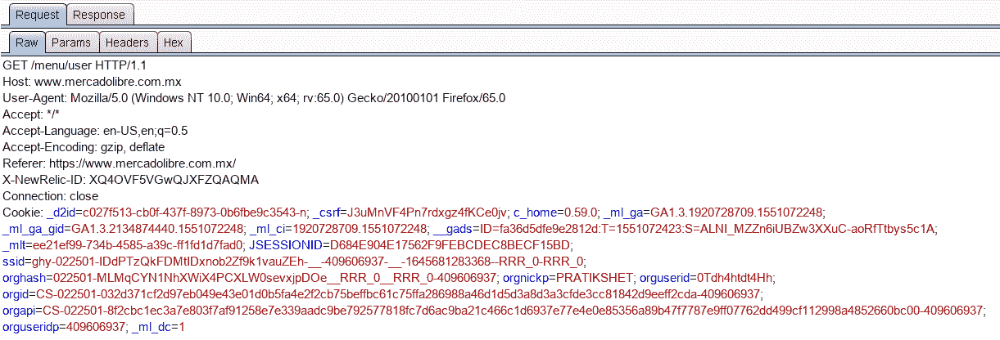
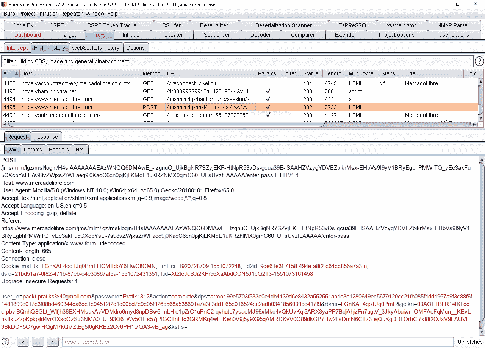
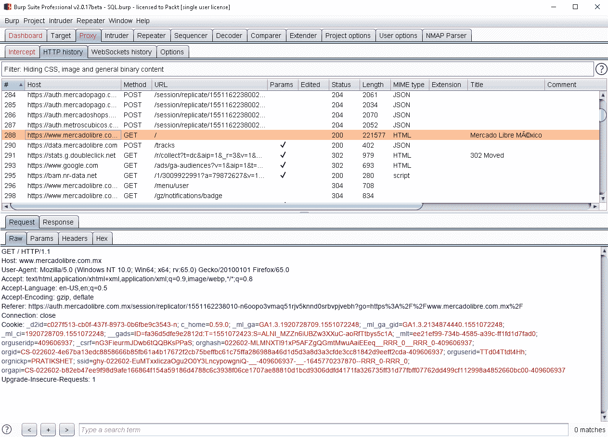
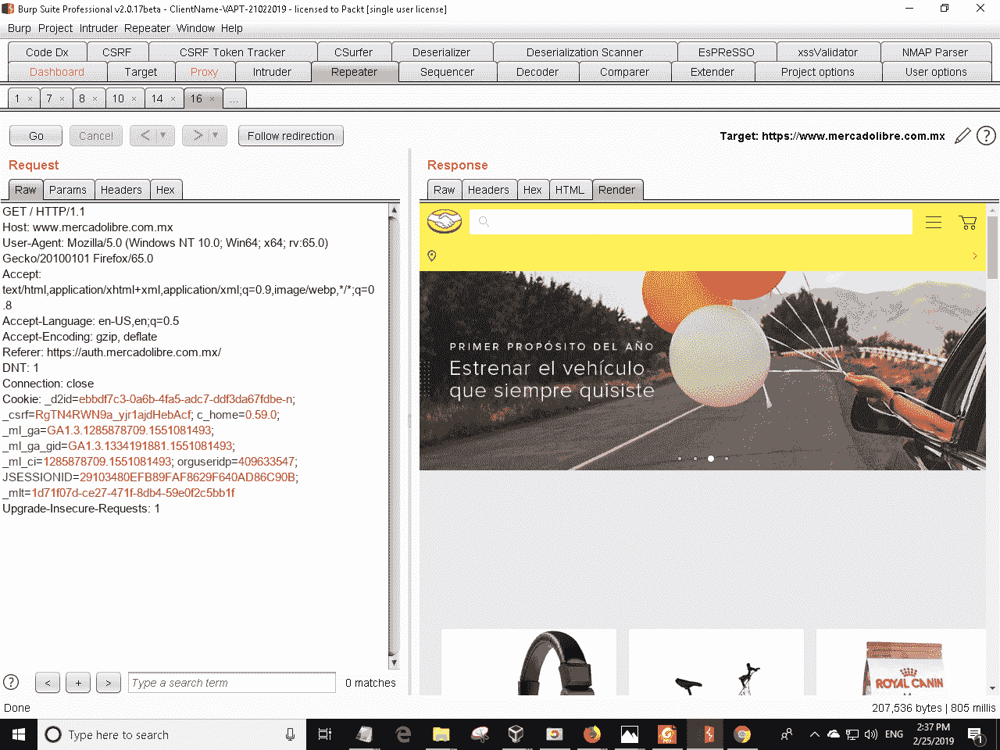

# 第十一章：突破大型在线零售商的身份验证

在之前的章节中，我们回顾了如何检测许多类型的漏洞，以及如何利用它们。我们还回顾了如何使用各种扩展，以及如何开发我们自己的扩展。在本章中，我们将总结前几章的所有概念，以评估正在生产中的应用程序，并尝试突破其身份验证。

我们将在本章中涵盖以下主题：

+   关于身份验证的事项

+   大型在线零售商

+   执行信息收集

# 关于身份验证的事项

正如你在第七章中所记得的，*使用 Burp Suite 检测漏洞*，影响身份验证控制的问题如下：

+   凭证的弱存储

+   可预测的登录凭证

+   会话 ID 暴露在 URL 中

+   会话 ID 容易受到会话固定攻击的影响

+   错误的超时实现

+   会话在注销后没有被销毁

+   通过不安全的通道发送敏感信息

现在，使用 Burp Suite，我们将分析所有这些。

# 大型在线零售商

在线零售商的列表很长，但以下是一些较受欢迎的：

+   eBay（所有地区变体）

+   Mercado Libre

+   亚马逊

我们将以其中一个作为例子进行分析。请记住，本章中使用的所有信息都是公开的；我们不会公开这些应用程序的任何公开或私人漏洞，解释也不会影响应用程序的功能。

# 执行信息收集

我们将开始收集有关目标的信息。检测特定应用程序中使用的技术以及确定潜在的安全问题的最基本方法是首先浏览整个应用程序，使用正常流程，检测并记录应用程序的每个入口点，并将我们感兴趣的不同 URL 添加到**目标**工具中的**范围**选项中。

# 端口扫描

在真实的评估中，评估应用的人或公司与应用的所有者之间建立了一项协议。这是检测服务所涉及的第一步。

通常使用 Nmap（[`nmap.org/`](https://nmap.org/)）来执行此任务，这是一个用于检测远程主机上运行的端口和服务的命令行工具。使用 Nmap 并不复杂；你只需在命令行上输入`nmap`，就可以看到我们有哪些不同的选项，如下面的屏幕截图所示：


要对主机执行标准扫描，我们可以使用以下命令：

```
nmap -vv -sV -O -Pn -p0-65535 -oA nmap_[IP] ...
```

# 身份验证方法分析

你应该逐个分析应用程序的问题，以确定它是否容易受到攻击，就像下面的章节中所解释的那样。

# 凭证的弱存储

应用程序以加密的方式存储会话 ID，因此不容易被提取。此外，会话 ID 与一个以上的令牌结合，cookie 也受到保护，如下面的屏幕截图所示：



# 发现盲目 SQL 注入

我们将要分析的 URL 是[www.dhl.com](http://www.dhl.com)。这是国际页面，但如果你查看地区网站，它们是相似的，所以可能一个网站的漏洞会复制到其他网站。这经常发生在许多在不同国家有业务的公司。有时候公司在不同国家有不同的代表，但是网站应用是一样的。

为了确定[dhl.com](http://dhl.com)是否存在 SQL 注入，我们将进行三种不同的分析：

+   自动扫描

+   SQLMap 检测

+   入侵检测

# 可预测的登录凭证

用户使用用户名或电子邮件登录应用程序，因此凭证是不可预测的。

# 会话 ID 暴露在 URL 中

通过查看历史工具，我们可以看到 URL 中暴露了一些令牌和会话，如下所示：



然而，该应用程序并不仅仅使用一个令牌，因此仅有一个令牌是没有用的。实际上，在 URL 中发送的令牌之一是一个请求跟踪器，如下截图所示：


结论是，尽管 URL 中暴露了令牌，但它们是不可利用的。

# 会话 ID 容易受到会话固定攻击的影响

1.  以正常方式在浏览器中打开用户会话。

1.  然后，为完全不同的用户打开另一个会话。

1.  现在，使用**代理**工具拦截一个请求，并修改用户信息以尝试访问第二个用户的信息，如下所示：



当您打开[`www.mercadolibre.com.mx/`](https://www.mercadolibre.com.mx/)网页时，您会注意到应用程序显示了用户的第一条信息。因此，它不容易受到会话固定攻击。

# 注销后会话并没有被销毁。

使用注销选项关闭会话，然后转到**历史记录**，查找用户登录时进行的请求。右键单击**发送到重复器**，然后在不修改任何值的情况下，单击**Go**重新发送请求，如下所示：



结果是应用程序显示出未登录用户的状态。因此，该应用程序不容易受到攻击。

由于我们使用了一个墨西哥的网站进行身份验证，所以截图中的一些文本是西班牙语。

# 通过不受保护的通道发送的敏感信息

仅使用被动扫描，也就是没有侵略性的操作，Burp Suite 就检测到用户可以强制应用程序在不受保护的通道中使用。这意味着用户可以强制使用 HTTP 协议而不是 HTTPS 协议，并以明文发送信息。这可能会被恶意用户利用，结合其他漏洞来窃取用户信息，如下例所示：


这个漏洞得到了确认。

# 总结

在本章中，我们展示了对一个真实应用程序的分析。执行的任务包括协议和服务检测、请求和提交分析以及漏洞检测。

在下一章中，我们将使用最流行的快递公司之一：DHL，执行与本章讨论的相同活动。
