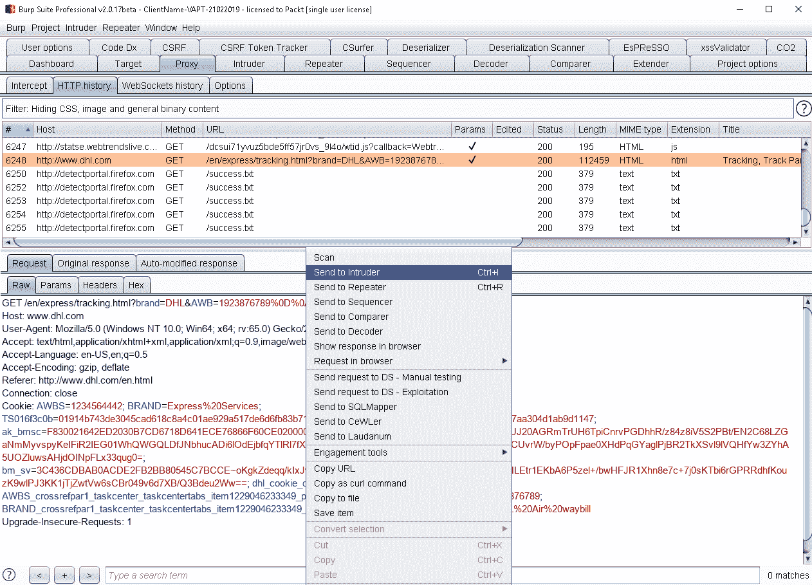
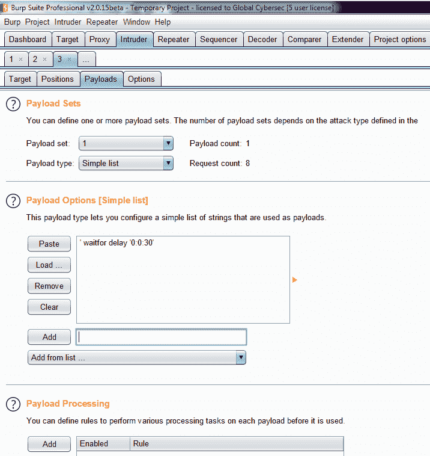

# 第十二章：从大型航运公司中利用和外泄数据

所有公司、企业和行业都使用技术，以及他们使用技术的方式是不同的。对于零售商来说，他们的网站应用程序与在线银行应用程序不同，零售商的网站有着持续服务和高性能等优先事项，而在线银行应用程序需要高度安全。当然，所有这些应用程序都有共同点，但是由于不可能应用所有的控制，最重要的是优先考虑真正的需求。

在本章中，我们将讨论另一个场景，一个航运公司。我们将执行与过去示例中相同的活动，但这次使用最受欢迎的航运公司之一：DHL。

我们将涵盖...

# 自动扫描

检测 SQL 注入等漏洞的最简单方法是使用 Burp Suite 的扫描器：

1.  要启动扫描，打开 Burp Suite，转到主仪表板，然后单击新扫描：


有一个我们之前没有探索的选项，用于在扫描期间控制范围。想象一下，您的范围不是整个 DHL 网站——只是[www.dhl.com](http://www.dhl.com)，但还有其他应用程序，比如[mydhl.dhl.com](http://mydhl.dhl.com)和[intranet.dhl.com](http://intranet.dhl.com)，等等。

1.  为了避免这种情况，Burp Suite 可以扫描这些其他应用程序；点击详细范围配置。在这里，我们将看到两个名为包括前缀选项和排除前缀选项的选项卡。转到第二个选项卡，排除前缀选项，并输入我们不想测试的应用程序，如下所示：


正如我们在前面的屏幕截图中所看到的，不需要添加所有的 URL。

1.  如果我们想对范围进行更精确的选择，我们可以选择单个 URL，并通过单击使用高级范围控制，在范围中添加我们想要测试或不想测试的每个 URL，如下所示：


Burp Suite 的扫描器为我们提供了更多控制扫描的选项。

1.  点击扫描配置。在这里，您可以配置有关扫描器如何执行应用程序发现以及如何执行安全测试的选项。

1.  点击添加新的，Burp Suite 将启动一个新窗口，可以在其中创建一个新规则，如下所示：


1.  在审计优化中，我们可以定义评估的速度。我建议选择低速。这是为了避免入侵检测系统、负载均衡器和其他可能阻止扫描器的安全和网络设备。如果您在一个 QA 环境中进行测试，在这种环境中，您可以完全控制并直接访问应用程序服务器，而没有任何网络安全控制，您可以选择快速。

1.  下一部分，报告的问题，是用于选择扫描策略。Burp Suite 默认情况下已经按类别划分了可能的问题。但是，您也可以按类型选择。例如，对于这个练习，我们只选择 SQL 注入漏洞。这对于修复或验证错误非常有用，例如：


1.  在测试期间处理应用程序错误选项卡中，可以配置 Burp Suite 在检测到错误时采取的操作。这些选项可以帮助我们在必要时停止扫描。例如，目前通常有一些应用程序托管在云服务中。云服务非常擅长阻止扫描活动，因此很可能如果我们正在测试托管在云中的网站，在测试几分钟后，我们的 IP 地址将被阻止，Burp Suite 只会收到超时错误。我们可以在出现这种类型的错误时停止扫描。

1.  在插入点类型中，可以定义要注入测试字符串的位置。例如，您可以将测试限制在 URL 参数、cookies 等。根据我的经验，最好测试所有可能的入口点。

1.  忽略插入点是一个有趣的选项，当我们想要限制应用程序生成的噪音或者减少测试数量时，这个选项可能会很有用。

您还记得在 Intruder 中可以选择要测试的参数吗？嗯，这与那个类似。如果我们有跟踪令牌或会话 ID 存储在变量中，那么测试它并不是一个好主意，因此我们可以使用这个选项来跳出范围：


配置选项后，点击“保存”，然后点击“确定”开始扫描。如果您认为这可能是一个需要应用并且将需要更多类型的应用程序的策略，您可以将其保存为库并重复使用。扫描结果将显示在右侧部分。

# SQLMap 检测

现在，我们将使用 SQLMap 来检测和利用 DHL 网站中的 SQL 注入。

# 寻找入口点

DHL 应用程序看起来是这样的：


我们可以立即看到不同的输入要测试，例如搜索栏和跟踪框，但是看一下以下请求：


在这个请求中，我们可以看到一些变量，但要确定哪些可以用作注入点，我们需要分析它们的行为，如下所示：

+   `brand`：看起来应用程序支持一些公司，所以也许“DHL”是目录的一部分，可能容易受到注入攻击。

+   `AWB`：这个变量是一个跟踪号码，用于查找包裹的位置。很明显这是一个很好的入口点。

+   `AWBS_crossrefpar1_taskcenter_taskcentertabs_item1229046233349_par_expandablelink_insideparsys_fasttrack`：它看起来也像是一个 ID，所以可能是一个注入点。

减少要测试的点很重要，因为在一个生产应用程序中，测试越多，产生的噪音就越多。

# 使用 SQLMap

使用鼠标的辅助按钮，点击“发送到 SQLMapper”，如下所示：


要限制要测试的参数，转到“注入”选项卡，输入参数，用逗号分隔，然后点击“运行”按钮。

SQLMap 将被启动，如果这些参数中有任何一个是有漏洞的，SQLMap 将检测并利用注入。当 SQLMap 检测到您正在利用盲目的 SQL 注入时，它会要求您继续。只需按*Y*。

# Intruder 检测

使用手动请求来检测 SQL 注入也是一个选项。我建议在审查应用程序时进行，而没有成功检测到漏洞。

首先，我们要检测入口点，就像我们在前一节中审查的那样。要检测与盲目 SQL 注入相关的易受攻击的点，您可以使用以下测试字符串：

```
' waitfor delay '0:0:30'—
```

我们还可以使用它在 DBMS 中的对应项。但是为什么要这样做呢？嗯，您可能记得，盲目 SQL 注入最重要的特征是它们不会直接向用户返回错误或输出。因此，通过使用这个字符串，我们期待看到响应的延迟：

1.  为了覆盖更多的参数，我们需要 Intruder 工具。对参数行为进行相同的分析，以确定哪个请求可能容易受到攻击，并使用鼠标的辅助按钮，点击“发送到 Intruder”，如下所示：



1.  在 Intruder 中，为了快速测试，将延迟查询添加为唯一的有效负载，然后启动到所有参数，如下所示：



1.  回到“位置”选项卡，点击“开始攻击”。如果你认为已经发现了可能的漏洞，右键点击请求，选择“发送到重复器”。一旦进入重复器，修改测试字符串以增加延迟时间，如下所示：

```
' waitfor delay '0:0:10'—
' waitfor delay '0:0:20'—
' waitfor delay '0:0:30'—
' waitfor delay '0:0:40'—
' waitfor delay '0:0:50'—
' waitfor delay '0:0:59'—
```

这个想法是确定何时使用时间来接收响应，以确定漏洞是否真实存在。

可以使用 Burp Suite Collaborator。在这些情况下使用它是一个很好的技巧，因为 Collaborator 是一个外部实体，作为接收器与数据库交互，如下截图所示：


# 利用

一旦你发现了一个有漏洞的变量，在入侵工具中用通配符标记它。

想象一下，你想要在运输网站上知道一个包裹的追踪号码。点击“有效载荷”选项卡，选择“数字”选项作为有效载荷类型。我们需要注入一系列数字，从 0000000000 到 9999999999，依次注入，如下所示：


由于无法转储存储在数据库中的寄存器，我们将使用布尔值来找到追踪号码。通过我们的入侵攻击发送一个使用正确追踪号码的请求；应用程序将返回一个`True`值作为响应：

为了方便检测，...

# 总结

在这最后一章中，我们回顾了其他可以用来评估应用程序的场景。在这一章中，我们寻找了 SQL 注入，并利用了其中的一种方法。

对于应用程序安全评估，我建议避免手动利用方法，因为我们将有更少的时间来使用它们。当使用其他方法无法找到漏洞时，它们是有用的。

在这一章中，你学会了如何分析请求中参数的行为，以推断可能存在漏洞并减少时间分析。之后，我们使用 Burp Suite 的扫描器、SQLMap 和入侵工具来检测盲目 SQL 注入漏洞。最后，我们学会了如何使用入侵工具猜测追踪号码来利用盲目 SQL 注入。
