# 第三章：在云上使用 Kali Linux 进行利用

在第二章中，*在云上设置 Kali PentestBox*，我们设置了一个渗透测试实验室，以及配置了远程访问的 Kali Linux PentestBox。现在是时候开始在实验室中的易受攻击主机上执行一些扫描和利用了。

本章将重点介绍使用商业工具的免费版本进行自动化漏洞扫描的过程，然后利用**Metasploit**来利用发现的漏洞。这些漏洞早已内置在实验室环境中，在之前配置的易受攻击主机上，分别在第一章和第二章中。

本章将涵盖以下主题：

+   使用 Nessus 运行自动化扫描并验证发现的漏洞

+   使用 Metasploit 和 Meterpreter 进行利用

+   利用易受攻击的 Linux 和 Windows 虚拟机（VMs）

# 技术要求

本章将使用以下工具：

+   Nessus（需要手动安装）

+   Metasploit

# 配置和运行 Nessus

Nessus 是一个流行的工具，用于自动化网络内的漏洞扫描，还具有扫描 Web 应用程序的附加功能。在第一部分中，我们将在 EC2 上的 PentestBox 上设置 Nessus。然后我们将使用它在之前设置的实验室上运行基本和高级扫描。

# 在 Kali 上安装 Nessus

使用 Nessus 进行自动化渗透测试和漏洞评估的第一步，显然是在 Kali 上安装它。为了简化操作，Nessus 以`.deb`软件包的形式直接安装，可以使用`dpkg`进行安装。

1.  要安装 Nessus，第一步是从 tenable 网站下载`.deb`软件包，网址为[`www.tenable.com/downloads/nessus`](https://www.tenable.com/downloads/nessus)：


1.  下载后，我们需要将其传输到我们在 AWS 上的 Kali PentestBox。在 Windows 上，可以使用**WinSCP**进行文件传输。在 Linux/macOS 上，可以使用本机 SCP 实用程序。设置在[`winscp.net/eng/download.php`](https://winscp.net/eng/download.php)上可用

1.  安装了 WinSCP 后，我们需要建立到 Kali PentestBox 的连接。首先，我们需要添加一个新站点：

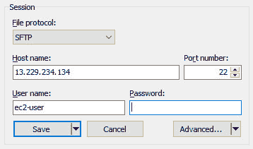

1.  接下来，我们需要添加从 AWS 下载的公钥进行身份验证。为此，需要点击高级并在 SSH | 身份验证中设置密钥的路径：


1.  完成后，只需保存站点，然后连接到它，以在远程主机上查看文件夹列表：

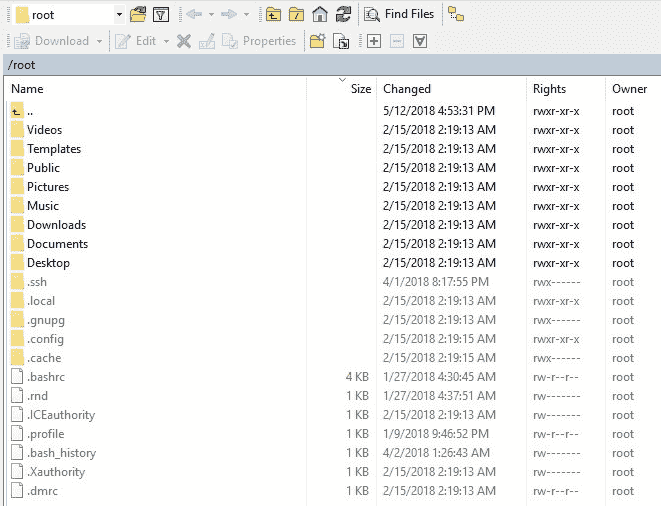

1.  从这里开始，只需将`.deb`软件包拖放到我们在上一步中访问的`root`文件夹中。完成后，我们可以开始安装软件包。可以通过 SSH shell 到 AWS EC2 实例使用`dpkg`来实现：

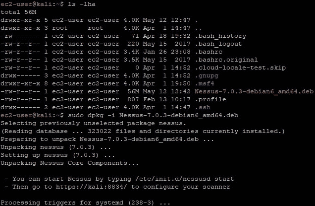

1.  完成后，启动 Nessus 服务并确认其正在运行：

```
sudo /etc/init.d/nessusd start
sudo service nessusd status
```

1.  如果`status`命令返回运行状态，则我们已成功启动服务。接下来，我们需要设置 SSH 隧道，将端口`8834`从 Kali PentestBox 转发到我们的本地主机上的 SSH 连接。在 Linux 终端上，需要使用以下语法：

```
ssh -L 8834:127.0.0.1:8834 ec2-user@<IP address>
```

1.  在 Windows 上，如果使用 PuTTY，可以在此处配置 SSH 隧道，点击 PuTTY 启动后选择 Tunnels 选项：


1.  完成后，重新连接到实例，现在可以在本地机器上访问 Nessus，网址为`https://127.0.0.1:8834`。

# 配置 Nessus

一旦 Nessus 被安装并且 SSH 隧道被配置，我们可以通过指向`https://127.0.0.1:8834`在浏览器上访问 Nessus。我们现在需要经历一系列的第一步来设置 Nessus。

1.  第一个屏幕提示用户创建一个帐户：

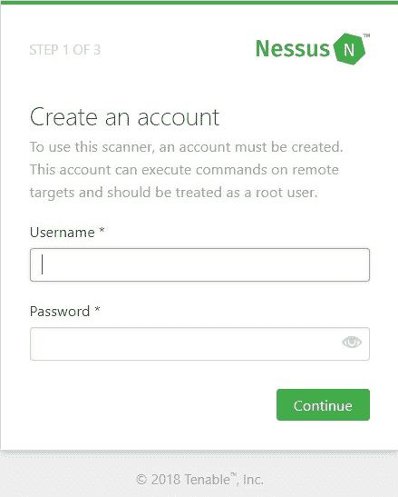

1.  输入合适的凭据并继续下一步。现在我们需要激活家庭许可证。我们可以在[`www.tenable.com/products/nessus-home`](https://www.tenable.com/products/nessus-home)填写以下表格来获取一个：


1.  一旦您通过电子邮件收到激活码，请在 Web 界面中输入它并触发初始化过程。现在 Nessus 正在下载扫描网络资产所需的数据：


这个过程通常需要几分钟，所以在这个过程中有足够的时间去拿一杯咖啡。

# 执行第一次 Nessus 扫描

初始化完成后，我们将被 Nessus 主页欢迎。在这里，我们需要点击“新扫描”来开始对我们之前设置的渗透测试实验室进行新的扫描。

1.  一旦进入新的扫描选项卡，我们需要开始一个基本的网络扫描：

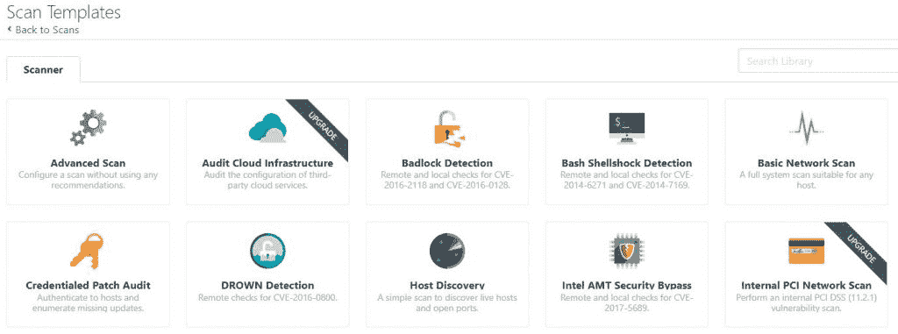

1.  点击基本网络扫描后，我们需要给出一个扫描名称，并输入实验室中设置的另外两个主机的 IP：


1.  接下来，我们配置 DISCOVERY 和 ASSESSMENT 选项。对于发现，让我们请求扫描所有服务：

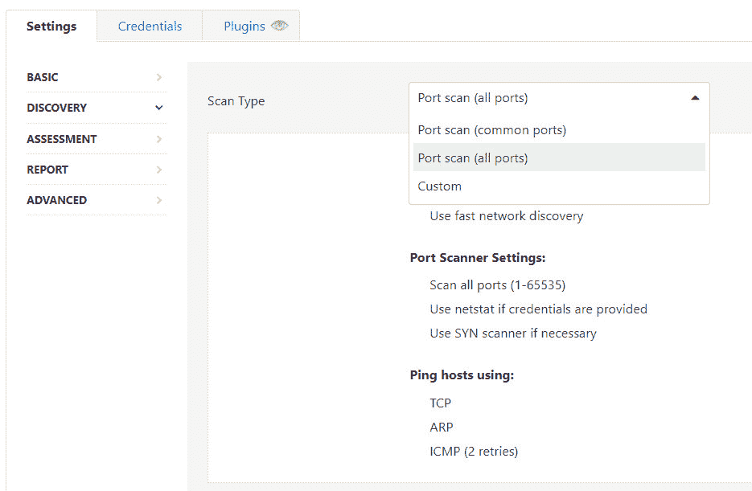

这样做的好处是枚举主机上运行的所有服务，并在它们上没有传统服务运行时发现主机。

1.  让我们配置 Nessus 来扫描 Web 应用程序：

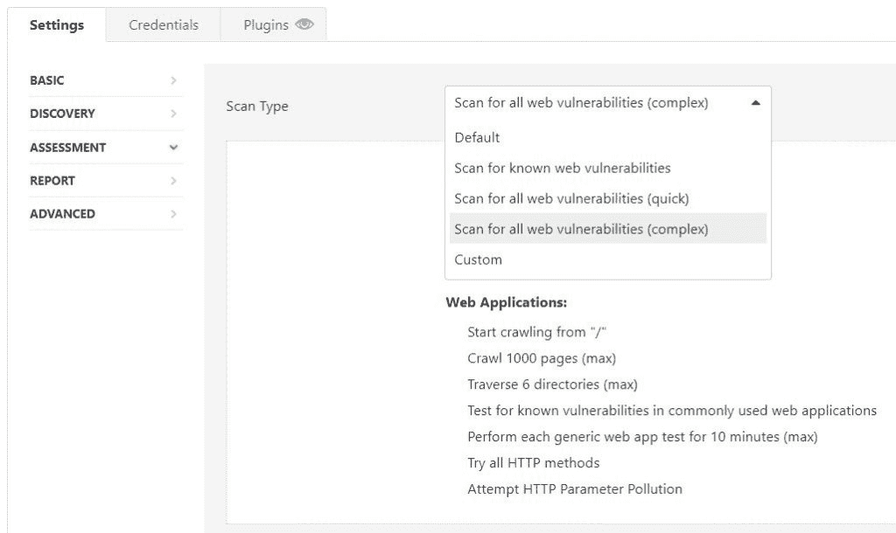

1.  最后，我们启动扫描：

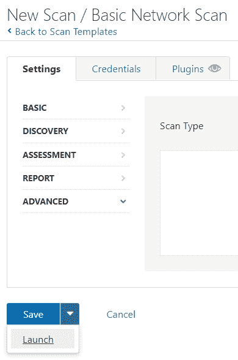

一次又一次，扫描是一个耗时的过程，所以平均需要大约 15 到 20 分钟才能完成，如果不是更多的话。

# 利用一个有漏洞的 Linux 虚拟机

现在我们已经完成了对易受攻击实验室中两个主机的扫描，是时候开始对这些主机进行利用了。我们的第一个目标是我们实验室中设置的 Ubuntu 实例。在这里，我们将查看这个主机的扫描结果，并尝试未经授权地访问这个主机。

# 了解 Linux 的 Nessus 扫描

我们首先从我们的 Ubuntu 服务器主机的 Nessus 扫描结果开始：


毫不奇怪，我们只发现了一堆信息漏洞，因为只安装了两个服务——**FTP**和**SSH**。FTP 服务器内置了一个后门；然而，它并没有成为一个关键的漏洞。如果你看一下 Linux 扫描中的最后一个结果，它确实检测到安装了带有后门的 vsftpd 2.3.4。

总结一下这个页面上的其他结果，Nessus SYN 扫描器只是列出了主机上启用的一些服务：

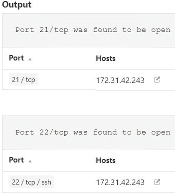

这个页面上还有一堆更有用的信息可以手动检查。目前，我们将专注于我们在 Ubuntu 服务器上安装的`vsftpd`服务的利用。

# 在 Linux 上的利用

为了利用`vsftpd`服务，我们将使用 Kali Linux 内置的`Metasploit`。只需在终端中输入`msfconsole`即可加载：


在这里，我们可以简单地搜索服务的名称，看看是否有任何相关的利用。要做到这一点，只需运行以下命令：

```
search vsftpd
```

这将列出具有特定关键字的利用列表。在这种情况下，只有一个利用：


我们可以通过运行以下命令来使用这个利用：

```
use exploit/unix/ftp/vsftpd_234_backdoor
```

这将更改提示符为利用的提示符。现在需要做的就是运行以下命令：

```
set RHOST <ip address of Ubuntu server>
```

以下是确认的显示：

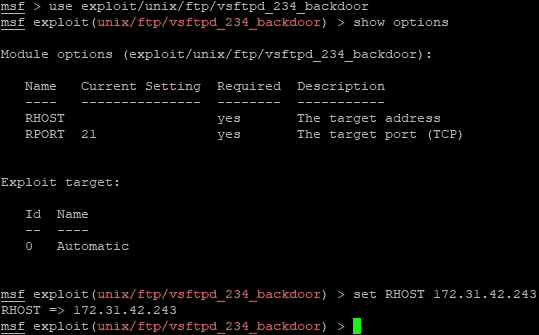

最后，只需运行`exploit`，`vsftpd exploit`将被执行，以提供具有`root`权限的交互式反向 shell：


使用这个反向 shell，您可以自由运行操作系统支持的任何命令。这是一个很好的地方，可以在`Metasploit`上玩弄辅助和后期利用模块。

# 利用易受攻击的 Windows 虚拟机

最后，让我们来看一下 Windows Nessus 扫描的结果。这有更有趣的扫描结果，因为我们使用了一个不再接收更新的 EOL 操作系统，以及一个较旧版本的 Web 应用程序服务器。

# 理解 Windows Nessus 扫描

由于使用了终止生命周期的操作系统以及过时的服务器，Windows 的 Nessus 扫描产生了大量问题。让我们首先专注于最关键的发现：


存在许多与过时的 OpenSSL 和 PHP 安装有关的问题，以及一些发现指出 Windows Server 2003 是不受支持的操作系统。然而，这里最重要的问题是检测到 SMBv1 中的多个漏洞。此漏洞的详细信息指出了相关 SMB 漏洞的**通用漏洞和暴露**（**CVEs**）以及这些漏洞的补丁：

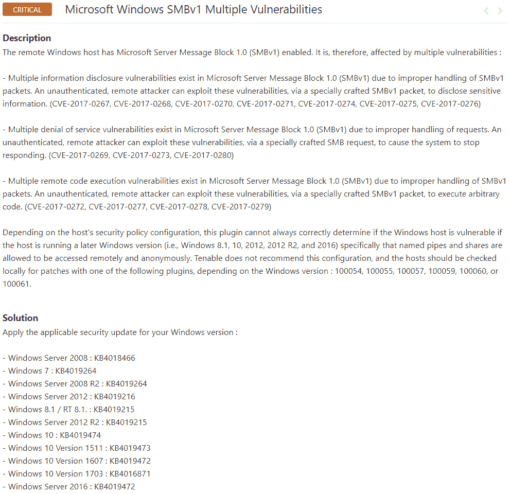

除了易受攻击和过时的服务外，扫描还发现了一些 Web 应用程序问题：

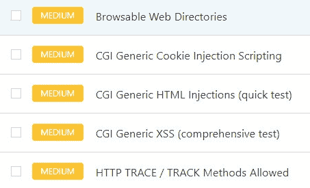

由于我们在 Linux 主机上利用了一个网络服务，我们将专注于利用 Web 应用程序的一个漏洞来获得对 shell 的访问。

# 在 Windows 上的利用

易受攻击的 Web 应用程序存在**SQL 注入**漏洞。SQL 注入允许攻击者注入任意的 SQL 查询并在后端 DBMS 上执行它们。此漏洞存在于以下 URL 上：

```
http://<ip>/books1.php?title=&author=t
```

在可能以管理员权限运行的 Web 应用程序上发生的 SQL 注入意味着可能完全接管 Web 应用程序。为此，我们将使用`sqlmap`。要使用`sqlmap`攻击 URL，语法如下：

```
sqlmap --url="http://<IP>/books1.php?title=&author=t"
```

`sqlmap`确认存在注入漏洞，如下所示：

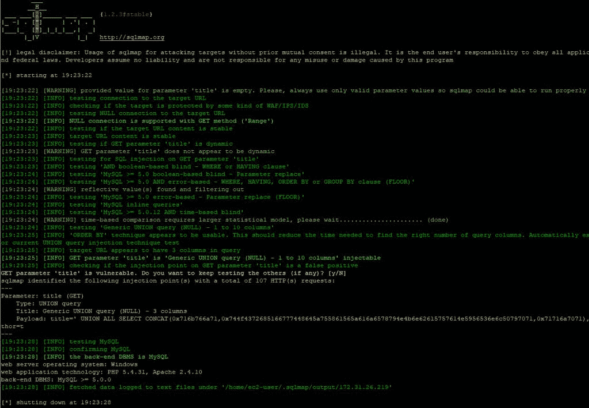

下一步是使用`sqlmap`在远程服务器上获得 shell 访问权限。`sqlmap`带有一个非常方便的功能，可以上传一个分段器，用于将进一步的文件上传到 webroot。然后它通过上传一个执行命令并返回命令输出的 Web shell 来跟进，所有这些都可以通过一个命令完成。为了触发这个，执行以下命令：

```
sqlmap --url="http://<IP>/books1.php?title=&author=t" --os-shell --tmp-path=C:\\xampp\\htdocs
```

`--os-shell`要求`sqlmap`使用先前描述的方法生成一个 shell，`--tmp-path`值指定上传 PHP 文件的位置，以生成 shell。一旦执行命令，用户输入将被提示两次。第一次是选择技术，这种情况下是 PHP。第二次是触发完整路径泄露，可以启用。如果一切顺利，我们应该会看到一个交互式 shell：

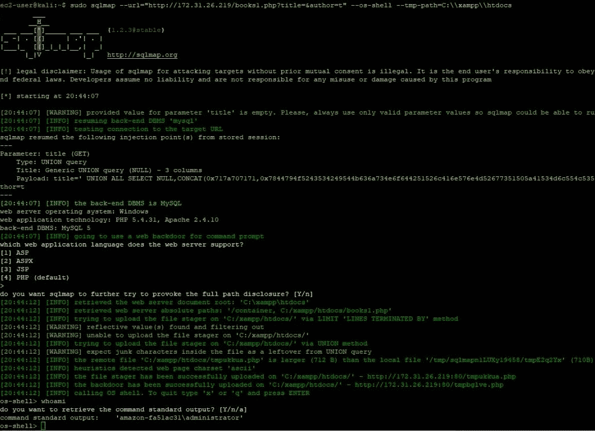

与 Linux 利用一样，通过这个交互式 shell 可以执行任何命令。

# 总结

本章介绍了在 Kali PentestBox 上在 EC2 上设置 Nessus 的过程。在此之后，解释了 SSH 隧道，以访问 Nessus 服务而不将其暴露在互联网上。一旦可以访问 Nessus 实例，我们就能激活它并对 pentest 实验室中设置的两台主机执行自动扫描。这些自动扫描产生了许多结果，进一步帮助我们利用它们。最后，本章涵盖了通过利用易受攻击的网络服务来利用和接管 Linux 主机，以及通过利用 Web 应用程序漏洞来利用和接管 Windows 主机。

这结束了本章，重点是面向首次进行渗透测试的人员，他们希望进行 AWS 渗透测试，但手头没有实验环境。在下一章中，我们将深入探讨设置 EC2 实例并执行自动和手动利用的内容。

# 问题

1.  在 Nessus 中，高级扫描相对于基本扫描有什么优势？

1.  Metasploit 的`aux`和`post`模块是什么？

1.  有没有办法通过利用`vsftpd`获得 Bash shell？

1.  有没有办法通过利用`vsftpd`在 Linux 主机上获得 VNC 访问？

1.  为什么 Windows 主机会自动给予管理员权限？

# 进一步阅读

+   精通 Metasploit: [`www.packtpub.com/networking-and-servers/mastering-metasploit`](https://www.packtpub.com/networking-and-servers/mastering-metasploit)

+   Nessus 8.2.x: [`docs.tenable.com/nessus/`](https://docs.tenable.com/nessus/)

+   Metasploit Unleashed—免费的道德黑客课程: [`www.offensive-security.com/metasploit-unleashed/`](https://www.offensive-security.com/metasploit-unleashed/)
