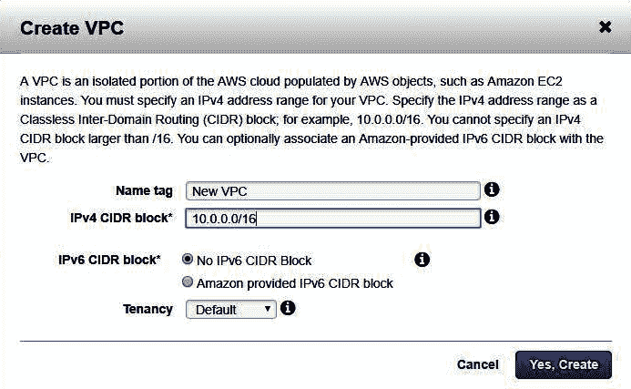
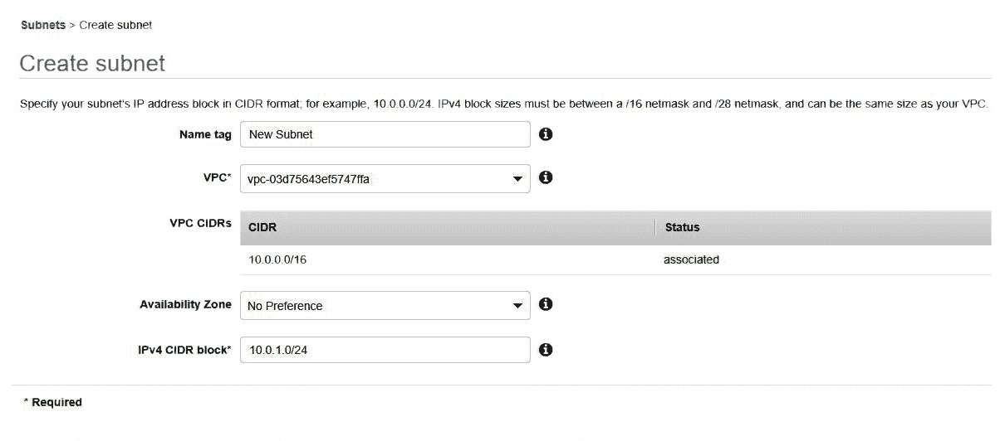
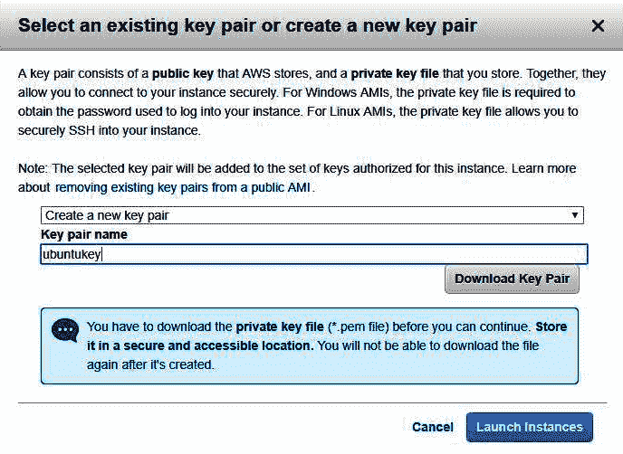
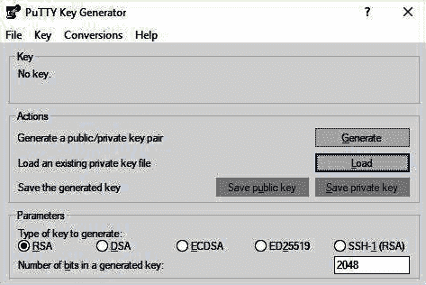
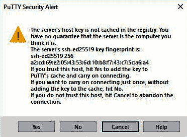
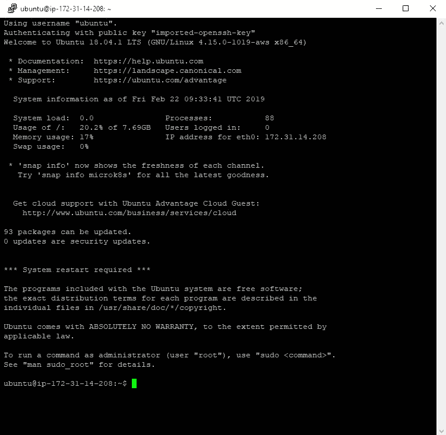

# 第四章：设置您的第一个 EC2 实例

AWS 最受欢迎和核心的组件是**弹性计算云**（**EC2**）。EC2 通过虚拟机为开发人员提供按需可扩展的计算基础设施。这意味着开发人员可以在选择的地理位置中启动具有自定义规格的虚拟机来运行他们的应用程序。

该服务是**弹性**的，这意味着开发人员可以根据操作的需要选择扩展或缩减他们的基础设施，并仅按分钟支付活动服务器。开发人员可以设置地理位置以减少延迟并实现高度冗余。

本章重点介绍创建 Amazon EC2 实例，围绕实例设置 VPC，并配置防火墙以限制对该 VPC 的远程访问。

在本章中，我们将涵盖以下主题：

+   如何使用可用的 AMI 设置定制的 EC2 实例

+   用于 EC2 实例的存储类型

+   防火墙和 VPC 配置

+   认证机制

# 技术要求

在本章中，我们将使用以下工具：

+   AWS EC2 实例

+   Ubuntu Linux AMI

+   SSH 客户端和浏览器

# 在 AWS EC2 上设置 Ubuntu

在本节中，我们将介绍如何在云上运行 Ubuntu AMI 的 EC2 实例，并查看我们可以根据需求自定义的各种设置。

# Ubuntu AMI

正如我们在之前的章节中所看到的，设置 EC2 实例可以非常简单且可以通过几次鼠标点击快速完成。AWS 市场提供了许多准备好部署的 AMI。AWS 市场还提供了一系列来自供应商如 SAP、Zend 和 Microsoft 以及开源的 AMI，专为使命关键的项目（如 DevOps 和 NAS）定制的 AMI：

1.  我们将从 AWS 市场中搜索 Ubuntu Linux AMI：


我们将使用撰写时可用的最新 Ubuntu AMI，Ubuntu 18.04 LTS - Bionic。

上述截图显示了以下信息：

+   +   我们正在使用的 AMI 的版本（18.04 LTS）

+   Ubuntu 可用的实例类型，以及每个实例的每小时定价

+   AMI 的概述和详细信息

1.  在下一页中，我们为我们的 AMI 选择实例类型：


选择实例类型

1.  AWS 为 Ubuntu 提供了一个免费的 t2.micro 实例，该实例运行在 1 个 vCPU 和 1GB 内存上，这对于本教程来说是足够的。确保选择了 t2.micro 并点击下一步。

我们已经配置了 EC2 实例的 RAM 和 CPU。在接下来的部分，我们将学习如何配置其网络和 VPC 设置。

# 配置 VPC 设置

在上一节中，我们配置了 EC2 实例的 RAM 和 CPU。在本节中，我们将学习如何为我们的 EC2 实例创建新的 VPC 和子网。

一旦我们选择了 t2.micro 作为我们的实例类型，我们就会看到配置实例详细信息页面：


在本节中，我们将看到如何配置以下选项：

+   **实例数量**：这取决于读者决定启动多少个实例。在本章中，我们只启动一个实例。

+   **网络**：我们将看一下如何为我们的 EC2 资源创建新的 VPC。

+   **子网**：我们将把我们的 EC2 资源分隔到 VPC 中的不同子网中。

+   **自动分配公共 IP**：我们将启用此功能，以便我们可以从我们的机器访问它。

让我们从创建 VPC 开始：

1.  通过点击创建新 VPC 链接，我们被带到 VPC 仪表板，我们可以看到现有的 VPC 并创建新的 VPC：


1.  点击创建 VPC 并命名为`New VPC`。

我们已经有一个 IPv4 块为`172.31.0.0/16`的 VPC 网络。让我们继续创建一个 IPv4 块为`10.0.0.0/16`的新 VPC。正如对话框中所提到的，我们的 IPv4 CIDR 块大小只能在`/16`和`/28`之间。

1.  点击是，创建，您的 VPC 将在几秒钟内创建：



要在此 VPC 中启动我们的 EC2 实例，我们将不得不创建一个子网。让我们转到子网部分，并在我们的新 VPC 中创建一个子网。

1.  单击创建子网并给它一个名称，`新子网`。我们将选择我们创建的 VPC。选择`新 VPC`后，VPC CIDR 块将显示在显示中：



用户可以从提供的可用区中选择任何可用区。但是，我们将其保持为无偏好。

我们正在使用 IPv4 CIDR 块`10.0.1.0/24`创建子网，这意味着它将为我们提供 IP 范围从`10.0.1.1`到`10.0.1.254`。但是，我们只有 251 个可用的 IP 地址。这是因为`10.0.1.1`保留给子网的网关，`10.0.1.2`保留给 AWS DNS，`10.0.1.3`保留给 AWS 的任何未来使用。

1.  完成后，我们选择我们的 VPC 作为新的 VPC，并选择子网|新子网。您的屏幕应该是这样的：


6. 让我们继续添加存储：


正如我们所看到的，每个 EC2 实例在启动时默认接收一个根存储设备。每个 EC2 实例默认获得一个默认的根存储。这是为了存放实例启动的操作系统文件。除此之外，如果需要，我们可以向 EC2 实例添加额外的存储。

# 在 EC2 实例中使用的存储类型

亚马逊为 EC2 实例提供以下存储类型：

+   **弹性块存储（EBS）**：AWS 提供的高速存储卷。这些是典型的存储卷，可用于 HDD 或 SSD 技术。这些是原始和未格式化的，可以附加到任何 EC2 实例，就像在现实生活中安装硬盘驱动器一样。这些卷需要在使用之前进行格式化。设置好后，可以将其附加、挂载或卸载到任何 EC2 实例。这些卷速度快，最适合高速和频繁的数据写入和读取。这些卷可以在 EC2 实例被销毁后设置为持久。或者，您可以创建 EBS 卷的快照并从快照中恢复数据。

+   **亚马逊 EC 实例存储**：实例存储存储卷物理附加到托管 EC2 实例的主机计算机上，用于临时存储数据。换句话说，一旦附加到的 EC2 实例被终止，实例存储卷也会丢失。

+   **亚马逊 EFS 文件系统**：**弹性文件系统**（EFS）只能与基于 Linux 的 EC2 实例一起使用，用于可伸缩的文件存储。可伸缩存储意味着文件系统可以根据用例进行大规模扩展或收缩。在多个实例上运行的应用程序可以使用 EFS 作为它们的共同数据源，这意味着 EFS 可以同时被多个 EC2 实例使用。

+   **亚马逊 S3**：Amazon S3 是 AWS 的旗舰服务之一，用于在云上存储数据。它具有高度可伸缩性，并使我们能够随时存储和检索任意数量的数据。Amazon EC2 使用 Amazon S3 存储 EBS 快照和实例存储支持的 AMI。

我们默认有一个 8GB 的根卷卷。在此活动中，让我们向 EC2 实例添加一个额外的 EBS 卷：


在 EBS 中，我们可以看到有五种不同的卷类型，可以使用不同的**每秒输入/输出操作**（**IOPS**）：

+   **通用用途 SSD（GP2）卷**：这是一个成本效益的存储解决方案，主要适用于各种工作负载。该卷可以在较长时间内维持 3,000 IOPS，最小为 100 IOPS，最大为 10,000 IOPS。GP2 卷提供非常低的延迟，并且可以以每 GB 3 IOPS 的速度扩展。GP2 卷可以分配 1GB 到 16TB 的空间。

+   **预留 IOPS SSD（IO1）卷**：这些比 GP2 卷快得多，性能也比较高。IO1 卷可以维持 100 到 32,000 IOPS 之间的性能，这比 GP2 高出三倍多。这种存储类型专为数据库等 I/O 密集型操作而设计。AWS 还允许您在创建 IO1 卷时指定 IOPS 速率，AWS 可以持续提供。IO1 卷的预留容量在最小 4GB 和最大 16TB 之间。

+   **吞吐量优化 HDD（ST1）**：ST1 是基于磁存储盘而不是 SSD 的低成本存储解决方案。这些不能用作可引导卷，而是最适合存储频繁访问的数据，如日志处理和数据仓库。这些卷只能在最小 1GB 和最大 1TB 之间。

+   **冷 HDD（SC1）**：SC1 或冷 HDD 卷，虽然与 ST1 卷相似，但不适用于保存频繁访问的数据。这些也是低成本的磁存储卷，不能用作可引导卷。与 ST1 类似，这些卷只能在最小 1GB 和最大 1TB 之间。

对于本教程，我们正在向我们的机器添加一个额外的 40GB EBS 卷通用用途 SSD（GP2）。不要忘记勾选“终止时删除”，否则存储实例将在终止 EC2 实例后继续存在。

我们不会给我们的 EC2 实例添加任何标签，所以让我们继续下一节，“安全组”。

# 配置防火墙设置

每个 EC2 实例都受到其自己的虚拟防火墙的保护，称为安全组。这就像一个典型的防火墙，通过控制入站和出站流量来管理对 EC2 实例的访问。在设置 EC2 实例时，我们可以添加规则来允许或拒绝流量到相关的 EC2 实例。EC2 实例也可以分组到一个安全组中，这在需要将一个防火墙规则应用于多个 EC2 实例时非常有用。一旦规则被修改，更改立即生效。

运行 Linux AMI 映像的 EC2 实例默认允许远程访问的 SSH 端口。在 Windows 机器的情况下，默认允许 RDP：


正如我们所看到的，由于我们的 AMI 是 Ubuntu Linux 映像，AWS 已自动配置了网络规则，只允许 SSH（端口 22）。让我们添加一些网络规则来允许 HTTP 和 HTTPS：


现在，我们已经准备好启动我们的 AMI。点击“审阅和启动”，然后点击“启动”。

在下一节中，我们将看看配置认证以访问我们的 EC2 实例。

# 配置 EC2 认证

在 AWS 中，所有 AMI Linux 映像都配置为使用密钥对认证 SSH 会话，而不是密码。

在启动 EC2 实例之前，AWS 提示我们配置 SSH 密钥对以便连接。我们可以创建自己的 SSH 密钥对，也可以使用现有的：



1.  让我们创建一个新的密钥对，并命名为`ubuntukey`。

1.  然后，下载密钥对并启动实例。我们得到的密钥对文件是`ubuntukey.pem`。文件的名称将根据先前提供的密钥名称而更改。确保密钥文件存储安全。如果密钥丢失，AWS 将不会提供另一个密钥文件，您将无法再访问您的 EC2 实例。

1.  下载密钥文件后，AWS 会将您重定向到启动状态页面，让您知道您的 EC2 实例正在启动：


现在，我们可以转到我们的 EC2 实例列表，并查找分配的公共 IP 地址。

现在，要连接到 AWS 机器，您可以从本地 Linux 机器上这样做：

+   打开终端并输入以下命令：

```
ssh -i <<keyname>>.pem ec2-user@<<your public ip>>
```

但是，从 Windows 本地计算机连接需要更多的工作：

1.  在本地计算机上安装 PuTTY。现在我们必须将`.pem`文件转换为`.ppk`文件，因为 PuTTY 只接受`.ppk`（PuTTY 私钥）。

1.  从开始菜单启动 PuTTYgen 并单击加载。选择“所有文件”：



1.  现在，将 PuTTYgen 指向我们下载的`.pem`文件。PuTTYgen 将加载并转换您的文件：


1.  加载`.pem`文件后，单击“保存私钥”以生成`.ppk`文件。PuTTY 会显示警告，并询问您是否要保存不带密码的密钥。您可以选择“是”。

1.  为您的`.ppk`文件提供一个名称，然后单击保存。

1.  一旦我们将`.pem`文件转换为`.ppk`文件，我们就可以使用 PuTTY 连接到我们的 EC2 实例。首先从开始菜单启动 PuTTY。

1.  在“主机名”字段中，输入主机名`ubuntu@<<您的公共 IP>>`。将端口保留在 22 号：


1.  接下来，单击 SSH 旁边的+按钮。转到 Auth，然后在名为“用于身份验证的私钥文件”的字段旁边，单击浏览。将 PuTTY 指向我们创建的`.ppk`文件：


1.  最后，点击“打开”开始您的 SSH 会话：



由于这是您首次登录到实例，您将收到以下警报。

1.  点击“是”继续。您将被验证到 Ubuntu 实例：



这就结束了本章的练习。我们成功创建了一个 EC2 机器，并学会了如何创建新的 VPC 和子网。我们还看到了 AWS 提供的不同类型的存储卷，并学会了如何为特定实例配置防火墙规则。最后，我们设置了身份验证并登录到我们的 Ubuntu 机器。

# 摘要

本章介绍了如何设置 EC2 实例并配置 EC2 实例设置的种种细节，例如创建新的 VPC，在 VPC 中配置新的子网以及添加额外的存储。本章解释了可用于 EC2 实例的不同类型的存储，例如 EBS 和实例存储。此外，我们了解了存储卷的类型以及它们适用于什么。随后，我们学习了如何使用 EC2 实例的安全组配置防火墙规则。这就是本章的结束。

在下一章中，我们将学习如何对运行多个 EC2 实例的 AWS 环境进行真实的渗透测试。此外，我们将学习如何使用 Metasploit 执行自动化利用，并在网络中使用主机枢纽进行横向移动。

# 进一步阅读

+   **存储**：[`docs.aws.amazon.com/AWSEC2/latest/UserGuide/Storage.html`](https://docs.aws.amazon.com/AWSEC2/latest/UserGuide/Storage.html)

+   **什么是 Amazon VPC？**：[`docs.aws.amazon.com/vpc/latest/userguide/what-is-amazon-vpc.html`](https://docs.aws.amazon.com/vpc/latest/userguide/what-is-amazon-vpc.html)

+   **Amazon VPC 网络管理员指南**：[`docs.aws.amazon.com/vpc/latest/adminguide/Welcome.html`](https://docs.aws.amazon.com/vpc/latest/adminguide/Welcome.html)
