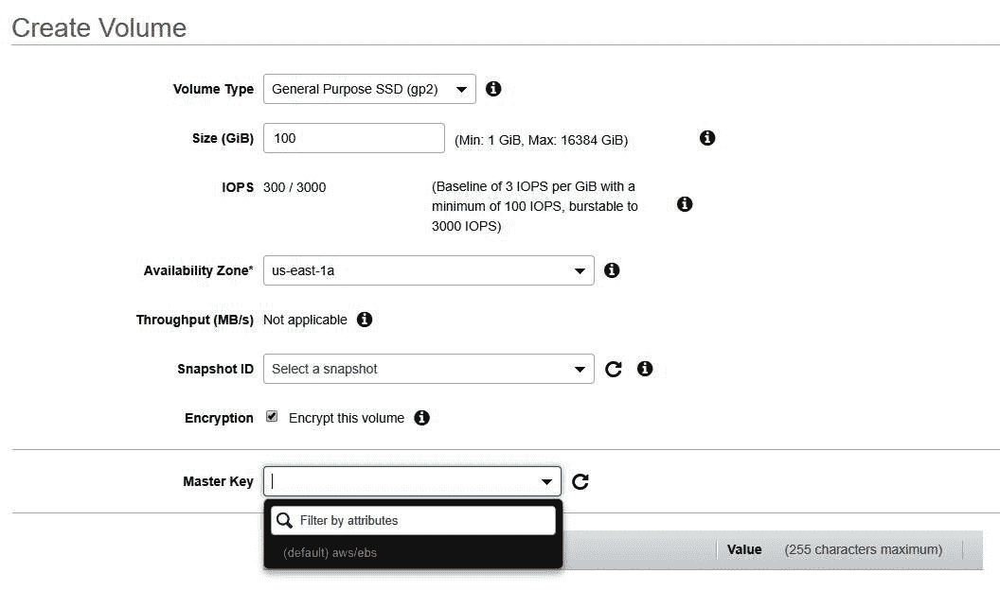
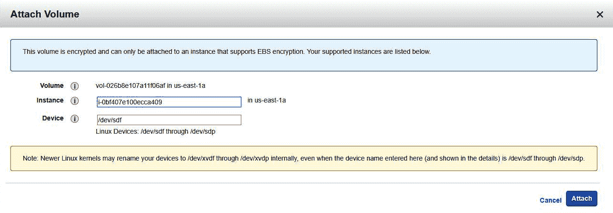
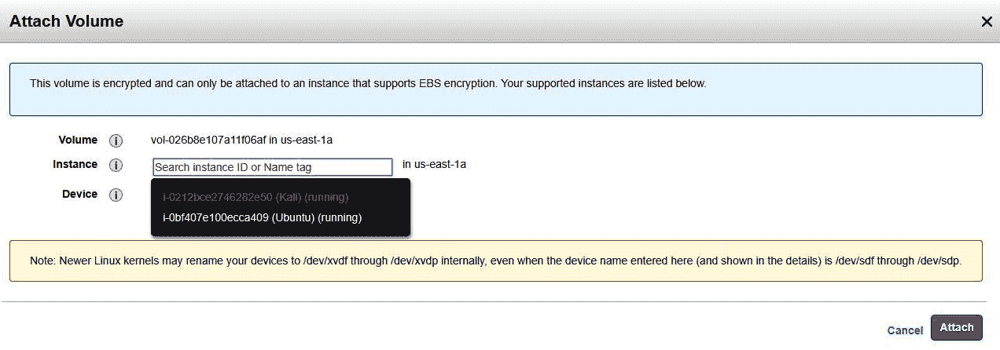

# 第六章：弹性块存储和快照 - 检索已删除的数据

本章向您介绍了通过 AWS 提供的不同存储选项，扩展了第三章中介绍的信息，即*在 Kali Linux 上利用云*。在这里，我们专注于创建独立的**弹性块存储**（**EBS**）卷，从多个 EC2 实例中附加和分离卷，并挂载分离的卷以从之前的 EC2 实例和 EBS 快照中检索数据。本章还涵盖了从 EBS 卷中取回已删除数据的取证过程。这突出了在针对 AWS 基础架构进行后期利用过程中的一个非常重要的部分，因为检查 EBS 卷和快照是获取敏感数据（如密码）的一种非常简单的方式。

在本章中，我们将涵盖以下内容：

+   在 EC2 实例中创建、附加和分离新的 EBS 卷

+   加密 EBS 卷

+   在 EC2 实例中挂载 EBS 卷以检索数据

+   从 EBS 卷中提取已删除的数据以查找敏感信息

# 技术要求

本章将使用以下工具：

+   侦探工具包（TSK）

# EBS 卷类型和加密

EBS 存储可以广泛分为两种不同的存储类型——**固态硬盘**（**SSD**）和**硬盘驱动器**（**HDD**）：

+   基于 SSD 的卷针对频繁读/写操作和小 I/O 大小的事务工作负载进行了优化，其中主要的性能属性是**每秒 I/O 操作**（**IOPS**）。

+   基于 HDD 的卷针对大型流式工作负载进行了优化，其中吞吐量（以 MiB/s 为单位）是比 IOPS 更好的性能指标。

EBS 有四种主要的存储类型，每种都适用于特定的用例：

+   **通用型 SSD（GP2）卷**：这些是成本效益高的存储解决方案，适用于各种工作负载的通用用途。这些卷可以在较长时间内维持 3,000 IOPS，最少 100 IOPS，最多 10,000 IOPS。GP2 卷提供非常低的延迟，并且可以按每 GB 3 IOPS 进行扩展。GP2 卷的空间可以分配在 1GB 到 16TB 之间。

+   **预配置 IOPS SSD（IO1）卷**：这些比 GP2 卷快得多，提供的性能也更高。IO1 卷可以维持 100 到 32,000 IOPS，比 GP2 多三倍以上。这种存储类型专为 I/O 密集型操作（如数据库）而设计。AWS 还允许您在创建 IO1 卷时指定 IOPS 速率，AWS 可以持续提供。IO1 卷的预配置范围为最少 4GB 到最大 16TB。

+   **吞吐量优化的 HDD（ST1）**：ST1 是一种基于磁存储盘而不是 SSD 的低成本存储解决方案。这些不能用作可引导卷；相反，它们最适合存储频繁访问的数据，如日志处理和数据仓库。这些卷只能在 1GB 到 1TB 的范围内。

+   **冷 HDD（SC1）**：SC1 卷，虽然与 ST1 卷相似，但不适用于保存频繁访问的数据。这些也是低成本的磁存储卷，不能用作可引导的卷。与 ST1 类似，这些卷只能在 1GB 到 1TB 的范围内。

# 从 EC2 实例中创建、附加和分离新的 EBS 卷

在本教程中，我们将学习如何在 Ubuntu EC2 实例上创建、附加和挂载 EBS 卷。然后我们将创建和删除一些文件，分离它，然后尝试提取已删除的数据：

1.  转到 EC2 | 卷并创建一个新卷。在本练习中，我们创建一个额外的 8GB 大小的卷：


如果要对卷进行加密（这是可选的），请执行以下步骤：

+   1.  选择“加密此卷”的复选框

1.  选择要在主密钥下使用的密钥管理服务（KMS）客户主密钥（CMK）

1.  选择创建卷

1.  选择创建的卷，右键单击，然后选择附加卷选项。

1.  从实例文本框中选择 Ubuntu 实例：


1.  通过 SSH 进入 Ubuntu 实例，并使用以下命令列出可用磁盘：

```
lsblk
```

这将列出您附加到实例的磁盘。在这种情况下，我们可以看到一个名为`/dev/xvdf`的设备。

1.  使用以下命令检查卷是否有任何数据：

```
sudo file -s /dev/xvdf
```

如果前面的命令输出显示`/dev/xvdf: data`，这意味着您的卷是空的。

1.  现在我们将需要将卷格式化为`ext4`文件系统。为此，请发出以下命令：

```
sudo mkfs -t ext4 /dev/xvdf
```

1.  接下来，我们将创建一个目录来挂载我们的新的`ext4`卷。在这里，我们使用名称`newvolume`：

```
sudo mkdir /newvolume
```

1.  最后，我们使用以下命令将卷挂载到`newvolume`目录：

```
sudo mount /dev/xvdf /newvolume/
```

1.  您可以进入`newvolume`目录并检查磁盘空间以确认卷挂载：

```
cd /newvolume
df -h .
```

1.  一旦卷被附加，我们就可以向其写入数据。我们将创建一个`data.txt`文件并向其写入一些数据。然后将删除此文件，并稍后尝试使用 TSK 恢复文件：

```
sudo touch data.txt
sudo chmod 666 data.txt
echo "Hello World" > data.txt
```

1.  现在让我们删除文件，稍后我们将恢复它：

```
sudo rm -rf data.txt
```

1.  是时候分离卷了。我们将首先卸载卷；退出文件夹并发出此命令：

```
sudo umount -d /dev/xvdf
```

现在，让我们从 EC2 实例中分离卷：

1.  在`https://console.aws.amazon.com/ec2/`上打开 Amazon EC2 控制台。

1.  在导航窗格中，选择卷。

1.  选择一个卷并选择操作|分离卷：


1.  在确认对话框中，选择是。

因此，我们已成功从 EC2 实例中分离了卷。

# 从 EBS 卷中提取已删除的数据

在我们的下一个活动中，我们将学习如何将卷附加到我们的 Kali 机器，然后使用取证来恢复已删除的数据。在进行实际操作之前，让我们了解一下取证是什么，以及数据恢复是如何工作的。

数字取证数据分析（FDA）属于数字取证范畴，是恢复和分析数据以了解数据创建方式，并在网络犯罪和欺诈案件中获取数字证据的方法。数据恢复可以在包括移动设备、存储设备和服务器在内的一系列设备上进行。涉及的技术包括数据解密和日志的二进制反向工程分析。

在数据恢复方面，我们面临两种类型的数据；即持久数据（写入驱动器并且易于访问）和易失性数据（临时数据，很有可能丢失）。那么，我们如何从驱动器中恢复数据？为了理解这一点，我们首先需要了解文件系统是什么，以及数据是如何存储在驱动器中的。

文件系统是操作系统用于组织数据的数据结构和算法的组合。每个操作系统都有不同类型的文件系统来组织和跟踪数据。让我们来看看最受欢迎的操作系统使用的典型文件系统：

+   Windows：通常使用新技术文件系统（NTFS）；其他支持的文件系统包括文件分配表（FAT）/FAT32 和弹性文件系统（ReFS）

+   Linux：支持多种类型的文件系统，如扩展文件系统（XFS）、Ext2/3/4、ReiserFS 和日志文件系统（JFS）/JFS2

+   macOS：早期的苹果设备使用分层文件系统加（HFS+）文件系统；自 macOS High Sierra 起，改为 Apple 文件系统（APFS）。

+   BSD/Solaris/Unix：Unix 文件系统（UFS）/UFS2

在此演示中，我们正在使用通常使用**扩展**（**ext**）文件系统的 Linux 操作系统。那么，在 Linux 文件系统中如何存储和检索数据呢？文件在文件系统中被视为一系列字节。所有文件都使用一种称为**索引节点**（**inodes**）的数据结构进行存储。每个文件被分配一个唯一的`inode`编号。每个目录都有一个将文件名映射到其`inode`编号的表。Inodes 包含指向文件的磁盘块的指针。当我们在目录中访问文件时，操作系统会查找目录表并获取给定文件名的`inode`。Inodes 还包含其他属性，如所有者和权限。

您可以使用`ls -l -i`命令在目录中看到文件的`inode`编号。

在删除数据时，Ext4 文件系统会清理文件节点，然后使用新释放的空间更新数据结构。这意味着只有文件的元数据被删除，文件本身仍然存在于磁盘上。这是至关重要的，因为我们将使用 inode 来计算和找出已删除文件的位置。

了解了这一点，让我们看看如何通过计算 inode 来恢复数据。

与之前所做的类似，转到 EC2 | 卷，并选择我们从 Ubuntu 机器上卸载的卷：

1.  选择附加，然后将其附加到您的 Kali 机器：


1.  一旦卷被附加，使用`lsblk`标识分区；镜像将是`/dev/xvdf`：

```
sudo lsblk
```

使用 TSK（取证框架），让我们尝试恢复`data.txt`文件。

1.  检查镜像上的文件系统：

```
sudo mmls /dev/xvdf
```

1.  使用 Linux 分区的起始扇区地址列出文件：

```
sudo fls -o <OFFSET> /dev/xvdf
```

您可以从`0`偏移开始，然后相应地计算后续的`inode`编号。

1.  获取文件的`inode`编号：

```
sudo fls -o <OFFSET> /dev/xvdf <inode of data.txt>
```

1.  使用`icat`来恢复我们删除的文件：

```
sudo icat -o <OFFSET> -r /dev/xvdf <inode-file-to-recover> > /tmp/data
```

如果打印`/tmp/data`的内容，您将发现我们之前写入的``"Hello World"``。

# EBS 卷上的全盘加密

通过 Amazon 的 KMS 实现数据加密，通过强制执行强加密标准以及管理和保护密钥本身来实现。数据使用 AES 256 位加密算法进行加密，这被认为是最佳的数据加密标准之一。亚马逊还确保这些标准绝对符合**1996 年健康保险可移植性和责任法案**（**HIPAA**）、**支付卡行业**（**PCI**）和**国家标准与技术研究所**（**NIST**）。

以下进行加密：

+   卷内的静态数据

+   从卷创建的所有快照

+   所有磁盘 I/O

那么，数据是如何加密的呢？AWS 使用 CMK 来加密 EBS 卷。CMK 默认包含在 AWS 的每个区域中。数据可以使用包含的 CMK 加密，或者用户可以使用 AWS KMS 创建新的 CMK。AWS 使用 CMK 为每个存储卷分配数据密钥。当卷附加到 EC2 实例时，数据密钥用于加密所有静态数据。数据密钥的副本也被加密并存储在卷中。EC2 实例上的数据加密是无缝的，并且在加密或解密数据时几乎没有延迟。

所有类型的 EBS 卷都支持全盘加密。但是，并非所有 EC2 实例都支持加密卷。

只有以下 EC2 实例支持 EBS 加密：

+   **通用型**：A1、M3、M4、M5、M5d、T2 和 T3

+   **计算优化**：C3、C4、C5、C5d 和 C5n

+   **内存优化**：cr1.8xlarge、R3、R4、R5、R5d、X1、X1e 和 z1d

+   **存储优化**：D2、h1.2xlarge、h1.4xlarge、I2 和 I3

+   **加速计算**：F1、G2、G3、P2 和 P3

+   **裸金属**：i3.metal、m5.metal、m5d.metal、r5.metal、r5d.metal、u-6tb1.metal、u-9tb1.metal、u-12tb1.metal 和 z1d.metal

任何加密存储卷的快照默认都是加密的，从这些快照创建的任何卷也默认是加密的。您可以同时将加密和未加密的存储卷附加到 EC2 实例。

# 创建加密卷

让我们看看如何加密 EBS 卷：

1.  转到 AWS EC2 页面，确保 Ubuntu 服务器正在运行。

1.  现在是创建新的 EBS 存储卷的时候了。在左侧找到弹性块存储，然后单击卷：


1.  单击创建卷，输入以下详细信息：


1.  勾选标记为加密的框。您可以选择内置的主密钥 aws/ebs，或者您可以从 KMS 服务创建自己的主密钥：



1.  选择主密钥并创建卷。一旦卷成功创建，您可以单击关闭按钮：


# 附加和挂载加密卷

一旦卷创建完成，我们将把卷附加到我们的 Ubuntu EC2 实例：

1.  转到 EBS | Volumes，并勾选我们刚刚创建的卷的框。

1.  单击操作，选择附加卷：


1.  在弹出部分，选择要附加的 Ubuntu EC2 实例，并选择附加：



1.  SSH 进入 Ubuntu 实例并检查我们附加的卷；然后发出以下命令：

```
lsblk
```

与以前一样，这将列出我们附加到实例的磁盘。在这种情况下，我们可以再次看到一个名为`/dev/xvdf`的设备。

1.  让我们再次将卷格式化为`ext4`：

```
sudo mkfs -t ext4 /dev/xvdf
```

1.  然后将卷挂载到文件夹：

```
sudo mount /dev/xvdf /newvolume/
```

1.  让我们创建另一个数据文件；稍后我们将删除此文件并尝试再次恢复它：

```
sudo touch data.txt
sudo chmod 666 data.txt
echo "Hello World" > data.txt
```

1.  现在让我们删除文件：

```
sudo rm -rf data.txt
```

1.  然后按以下步骤卸载驱动器：

```
sudo umount -d /dev/xvdf
```

1.  最后，在 AWS 的 EC2 仪表板上，转到 EBS | Volumes。

1.  选择加密驱动器，单击操作，然后单击分离卷：


1.  最后，在弹出窗口中，选择是，分离：


我们有一个加密的 EBS 卷，其中写入了数据，然后删除了。接下来，我们将看看是否可以再次检索数据。

# 从加密卷中检索数据

现在让我们看看是否可以从加密卷中检索数据：

1.  转到 EBS | Volumes 并选择加密卷。

1.  单击附加卷；这次，在弹出的警报中，将卷附加到我们的 Kali 机器上：



1.  一旦卷被附加，SSH 进入 Kali 机器。发出以下命令以识别卷：

```
lsblk
```

使用 TSK（取证框架），让我们尝试恢复`data.txt`文件。

1.  检查图像上的文件系统：

```
sudo mmls /dev/xvdf
```

1.  使用 Linux 分区的起始扇区地址列出文件：

```
sudo fls -o <OFFSET> /dev/xvdf
```

您可以从`0`偏移开始，然后相应地计算后续的`inode`编号。

1.  获取文件的`inode`编号：

```
sudo fls -o <OFFSET> /dev/xvdf <inode of data.txt>
```

由于驱动器是完全加密的，因此在发出此命令时，您将不会得到任何返回值。因此，由于您没有`inode`编号，您无法从驱动器中检索任何数据。

因此，似乎我们可以通过完全磁盘加密防止删除的数据被恢复。

# 总结

在本章中，我们了解了 EC2 实例可用的不同类型的存储以及它们的使用方式。我们还了解了数据加密和亚马逊的 KMS。我们通过 EBS 块存储的使用步骤，为 EC2 实例创建额外的存储并将其挂载到 EC2 实例中。此外，我们还学习了如何使用 TSK 通过内存分析从 EBS 存储卷中恢复丢失的数据。

为了保护我们的数据，我们学习了如何使用 AWS KMS 对 EBS 卷进行加密，以加密静态数据。我们还看到了如何使用全盘加密来防止某人检索敏感数据。

这就是本章的结束。在下一章中，我们将学习关于 S3 存储以及如何识别易受攻击的 S3 存储桶。我们还将看到 S3 存储桶踢的操作以及如何利用易受攻击的 S3 存储桶。

# 进一步阅读

+   **The Sleuth Kit**: [`www.sleuthkit.org/sleuthkit/docs.php`](https://www.sleuthkit.org/sleuthkit/docs.php)

+   **存储**: [`docs.aws.amazon.com/AWSEC2/latest/UserGuide/Storage.html`](https://docs.aws.amazon.com/AWSEC2/latest/UserGuide/Storage.html)

+   **Amazon EBS 加密**: [`docs.aws.amazon.com/AWSEC2/latest/UserGuide/EBSEncryption.html`](https://docs.aws.amazon.com/AWSEC2/latest/UserGuide/EBSEncryption.html)
