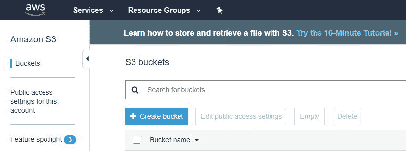
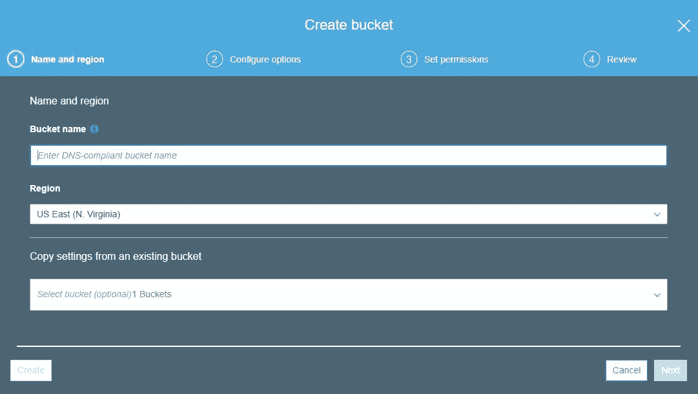
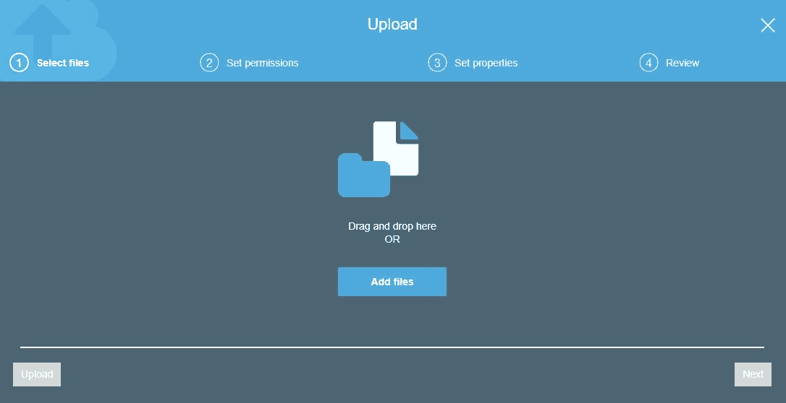
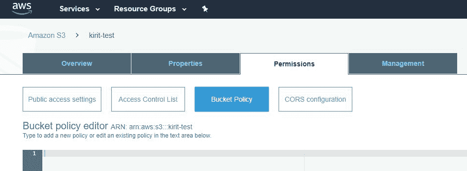

# 第七章：侦察-识别易受攻击的 S3 存储桶

**简单存储服务**（**S3**）存储桶是 AWS 基础设施中最受欢迎的攻击面之一，也是最容易受到黑客攻击的攻击面。

本章解释了 AWS S3 存储桶的概念，它们的用途以及如何设置和访问它们。然而，本章的主要重点是各种 S3 存储桶权限、识别配置不当或过于宽松的存储桶的不同方法，以及连接到这些存储桶。最后，我们将重点关注基于域名和子域名的自动化方法，以识别多个地区中易受攻击的 S3 存储桶，并探测它们的权限，以找到潜在的易受攻击的存储桶。

在本章中，我们将涵盖以下主题：

+   设置我们的第一个 S3 存储桶

+   探索 AWS S3 权限和访问 API

+   从一个易受攻击的 S3 存储桶中读取和写入

# 设置您的第一个 S3 存储桶

我们将首先前往 S3 主页，网址为[`s3.console.aws.amazon.com/s3/`](https://s3.console.aws.amazon.com/s3/)：

1.  在 S3 主页上，点击“创建存储桶”：



1.  在下一页上，为您的存储桶分配一个名称：



在分配存储桶名称时，您必须遵循以下准则：

+   +   为您的 S3 存储桶使用唯一的、符合**域名系统**（DNS）的名称。

+   存储桶名称必须至少为 3 个字符，最多为 63 个字符。

+   不允许使用大写字符或下划线。

+   存储桶名称可以以小写字母或数字开头。

+   存储桶名称可以包含小写字母、数字和连字符。存储桶名称也可以根据标签使用（.）字符进行分隔。

+   不要以 IP 地址的形式格式化存储桶名称（例如，`172.16.1.3`）。

1.  如果愿意，您可以选择地理区域；我们将为我们的存储桶命名为`kirit-bucket`。

1.  点击“创建存储桶”，您的存储桶将被创建：


一旦存储桶启动运行，您应该能够上传对象到存储桶中。如果你想知道对象是什么，它可以是任何文件，比如图像文件、音乐文件、视频文件或文档。

1.  要上传一个对象，点击存储桶并选择“上传”：



文件浏览器将打开，您可以上传任何您想要的文件。

1.  要下载一个对象，只需勾选对象的复选框，然后选择“下载”：


# S3 权限和访问 API

S3 存储桶有两种权限系统。第一种是**访问控制策略**（**ACPs**），主要由 Web UI 使用。这是一个简化的权限系统，为其他权限系统提供了一层抽象。另外，我们有**IAM 访问策略**，这是给您提供权限的 JSON 对象。

权限适用于存储桶或对象。存储桶权限就像主钥；为了让某人访问对象，您需要先让他们访问存储桶，然后再让他们访问对象本身。

S3 存储桶对象可以从 WebGUI 访问，就像我们之前看到的那样。否则，它们可以使用`aws s3` cmdlet 从 AWS 命令行界面（**CLI**）访问。您可以使用它来上传、下载或删除存储桶对象。

为了使用 AWS CLI 上传和下载对象，我们可以采取以下方法：

1.  首先安装`awscli`：

```
sudo apt install awscli
```

1.  使用新用户凭证配置`awscli`。为此，我们需要访问密钥 ID 和秘密访问密钥。要获取这些信息，请按照以下步骤进行：

1.  登录到您的 AWS 管理控制台

1.  点击页面右上角的用户名

1.  从下拉菜单中点击“安全凭证”链接

1.  找到“访问凭证”部分，并复制最新的访问密钥 ID

1.  单击同一行中的“显示”链接，并复制“秘密访问密钥”

1.  一旦您获得了这些，发出以下命令：

```
aws configure
```

输入您的访问密钥 ID 和秘密访问密钥。请记住不要公开此信息，以确保您的帐户安全。您可以将默认区域和输出格式设置为无。

1.  一旦您的帐户设置好了，就可以非常容易地访问 S3 存储桶的内容：

```
aws s3 ls s3://kirit-bucket
```

在前面的代码中，`kirit-bucket`将被替换为您的存储桶名称。

1.  如果要在存储桶内遍历目录，只需在前面的输出中列出的目录名称后面加上`/`，例如，如果我们有一个名为`new`的文件夹：

```
aws s3 ls s3://kirit-bucket/new
```

1.  要将文件上传到 S3 存储桶，发出`cp`命令，后跟文件名和目标存储桶的完整文件路径：

```
aws s3 cp abc.txt s3://kirit-bucket/new/abc.txt
```

1.  要在 S3 存储桶上删除文件，发出`rm`命令，后跟完整的文件路径：

```
aws s3 rm s3://kirit-bucket/new/abc.txt
```

# ACPs/ACLs

**访问控制列表**（**ACLs**）的概念与可用于允许访问 S3 存储桶的防火墙规则非常相似。每个 S3 存储桶都附有 ACL。这些 ACL 可以配置为向 AWS 帐户或组提供对 S3 存储桶的访问权限。

有四种主要类型的 ACLs：

+   **读取**：具有读取权限的经过身份验证的用户将能够查看存储桶内对象的文件名、大小和最后修改信息。他们还可以下载他们有权限访问的任何对象。

+   **写入**：经过身份验证的用户有权限读取和删除对象。用户还可以删除他们没有权限的对象；此外，他们可以上传新对象。

+   **read-acp**：经过身份验证的用户可以查看他们有权限访问的任何存储桶或对象的 ACL。

+   **write-acp**：经过身份验证的用户可以修改他们有权限访问的任何存储桶或对象的 ACL。

一个对象最多只能有 20 个策略，这些策略是前面四种类型的组合，针对特定的受让人。受让人是指任何个人 AWS 帐户（即电子邮件地址）或预定义组。IAM 帐户不能被视为受让人。

# 存储桶策略

每个 S3 存储桶都附有存储桶策略，可以应用于存储桶内和其中的对象。在多个存储桶的情况下，可以轻松复制策略。可以通过指定资源（例如"data/*"）将策略应用于单个文件夹。这将使策略适用于文件夹中的每个对象。

您可以使用 Web UI 向 S3 存储桶添加策略。该操作位于存储桶属性页面的权限选项卡下：



接下来，我们将看到如何为 IAM 用户配置存储桶访问权限。

# IAM 用户策略

为了向单个 IAM 帐户提供 S3 访问权限，我们可以使用 IAM 用户策略。这是一种为任何 IAM 帐户提供受限访问权限的非常简单的方法。

IAM 用户策略在必须将 ACL 权限应用于特定 IAM 帐户时非常方便。如果您在犹豫是使用 IAM 还是存储桶策略，一个简单的经验法则是确定权限是针对多个存储桶中的特定用户，还是您有多个用户，每个用户都需要自己的权限集。在这种情况下，IAM 策略比存储桶策略更合适，因为存储桶策略仅限于 20 KB。

# 访问策略

访问策略是描述授予任何用户对对象或存储桶的权限的细粒度权限。它们以 JSON 格式描述，并可分为三个主要部分：`"Statement"`、`"Action"`和`"Resource"`。

以下是 JSON 格式的存储桶策略示例：

```
{
    "Version": "2008-02-27",
    "Statement": [
     {
            "Sid": "Statement",
            "Effect": "Allow",
            "Principal": {
            "AWS": "arn:aws:iam::Account-ID:user/kirit"
        },
        "Action": [
            "s3:GetBucketLocation",
            "s3:ListBucket",
            "s3:GetObject"
        ],
        "Resource": [
            "arn:aws:s3:::kirit-bucket"
        ]
     }
  ]
}
```

JSON 对象有三个主要部分。首先，在`"Statement"`部分中，我们可以看到有两点需要注意——“Effect”：“Allow”，以及包含“AWS”：“arn:aws:iam::Account-ID:user/kirit”的`"Principal"`部分。这基本上意味着`"kirit"`用户帐户被授予对对象的权限。

其次是“操作”部分，描述了用户被允许的权限。我们可以看到用户被允许列出`"s3:ListBucket"`存储桶内的对象，并从`"s3:GetObject"`存储桶下载对象。

最后，“资源”部分描述了授予权限的资源。综合起来，策略总结为允许`kirit`用户帐户在名为`kirit-bucket`的存储桶下`GetBucketLocation`、`ListBucket`和`GetObject`。

# 创建易受攻击的 S3 存储桶

在下一个练习中，我们将尝试从一个对整个世界公开的易受攻击的 S3 存储桶中读取和写入。为此，我们将设置一个 S3 存储桶，并故意使其易受攻击，使其可以公开读取和写入。

我们将首先转到 S3 主页（[`s3.console.aws.amazon.com/s3/`](https://s3.console.aws.amazon.com/s3/)）并创建一个可以公开访问的易受攻击的存储桶：

1.  创建一个新的 S3 存储桶。

1.  存储桶创建后，选择存储桶，然后单击“编辑所选存储桶的公共访问设置”：


1.  取消选中所有复选框，然后单击保存。这样做是为了删除对存储桶施加的任何访问限制：


1.  AWS 将要求您确认更改；在字段中键入`confirm`并单击确认：


1.  单击存储桶，然后在侧边栏上单击“权限”选项卡：


1.  转到访问控制列表，在公共访问下，单击“所有人”。侧边栏将打开；启用所有复选框。这告诉 AWS 允许公共访问存储桶；这就是使存储桶容易受攻击的原因：


1.  单击保存，存储桶将变为公开。

现在我们有了易受攻击的存储桶，我们可以将一些对象上传到其中并使它们公开；例如，我们将一个小文本文件上传到存储桶中：

1.  创建一个小文本文档。

1.  输入您的存储桶并单击上传：


1.  选择文件并上传。

文件上传后，单击对象，您将收到一个 S3 URL，以从外部访问对象。您可以简单地将浏览器指向 URL 以访问存储桶：


对象 URL 链接位于页面底部，如前面的屏幕截图所示。

我们的易受攻击的 S3 存储桶现在已经设置并对公众开放；任何人都可以读取或写入该存储桶。

在下一章中，我们将学习如何识别此类易受攻击的存储桶，并使用 AWSBucketDump 外部传输数据。

# 摘要

在本章中，我们学习了什么是 S3 存储桶，如何设置 S3 存储桶以及如何在 S3 存储桶上授予访问权限。我们详细了解了 S3 权限，以及每种权限适用的方式和位置。我们演示了如何设置 AWS CLI 并通过 CLI 访问 S3 存储桶。我们还了解了可以使 S3 存储桶易受攻击的设置类型。最后，我们设置了我们自己的易受攻击的 S3 存储桶，这将在下一章中使用。

在下一章中，我们将学习如何利用 S3 存储桶。我们将研究用于利用易受攻击的 S3 存储桶的工具。此外，我们将学习在利用易受攻击的 S3 存储桶后可以应用的各种后利用技术。

# 进一步阅读

+   **Amazon S3 REST API 介绍**：[`docs.aws.amazon.com/AmazonS3/latest/API/Welcome.html`](https://docs.aws.amazon.com/AmazonS3/latest/API/Welcome.html)

+   **Amazon S3 示例**：[`boto3.amazonaws.com/v1/documentation/api/latest/guide/s3-examples.html`](https://boto3.amazonaws.com/v1/documentation/api/latest/guide/s3-examples.html)

+   在策略中指定权限：[`docs.aws.amazon.com/AmazonS3/latest/dev/using-with-s3-actions.html`](https://docs.aws.amazon.com/AmazonS3/latest/dev/using-with-s3-actions.html)
