# 第十七章：使用 Scout Suite 进行 AWS 安全审计

本章介绍了另一个自动化工具，称为 Scout Suite，它对 AWS 基础架构内的攻击面进行审计，并报告了一系列发现，可以在 Web 浏览器上查看。Scout2 在白盒测试期间对渗透测试人员非常有用，因为它允许快速评估各种 AWS 服务中的安全配置问题，并在易于阅读的仪表板上报告它们。这有助于识别一些可能需要更长时间才能检测到的低挂果。

本章将涵盖以下主题：

+   设置一个易受攻击的 AWS 基础设施

+   配置和运行 Scout Suite

+   解析 Scout Suite 扫描的结果

+   使用 Scout Suite 的规则

# 技术要求

本章将使用以下工具：

+   Scout Suite

# 设置一个易受攻击的 AWS 基础设施

在这个练习中，我们将创建一个易受攻击的 EC2 基础设施，包括一个新的 VPC、子网和一个暴露的 EC2 实例。我们还将创建一个新的 S3 存储桶，该存储桶可以公开写入和读取。

# 一个配置错误的 EC2 实例

在第四章中，*设置您的第一个 EC2 实例*，我们学习了如何创建新的 VPC 和子网。我们将从创建一个新的 VPC 和子网开始，然后启动一个所有端口都暴露的 EC2 实例。您可以参考第四章中的步骤来完成这一步骤：

1.  让我们从转到服务| VPC |您的 VPC 开始。

1.  单击创建 VPC 并分配新的 IP 范围：

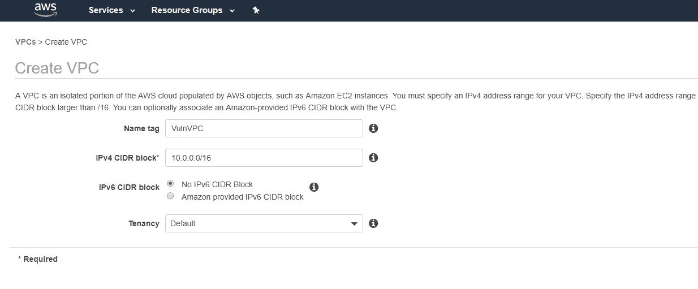

创建 VPC

在这里，我们已将 VPC 命名为`VulnVPC`，并为其分配了`10.0.0.0/16`的 IP 范围。

1.  在 VPC 内创建一个新的子网：


创建子网

我们正在在 VPC 内创建一个新的子网，IP 范围为`10.0.1.0/24`。

1.  转到 Internet 网关并创建一个新的网关；将此新网关附加到新的 VPC：


创建新的网关

1.  转到路由表并选择新的 VPC。然后，转到路由选项卡，单击编辑路由。

1.  添加一个新的`0.0.0.0/0`目标，并将目标设置为互联网网关：


添加一个新的目标并设置目标

1.  创建一个新的安全组并允许来自任何地方的所有流量：


编辑入站规则

1.  现在，在新的 VPC 和子网中启动一个新的 EC2 实例：


启动一个新的 EC2 实例

1.  将其分配给易受攻击的安全组，如下截图所示：


分配安全组 ID

1.  最后，启动 EC2 实例。

我们的易受攻击的 EC2 基础设施已经准备好。现在让我们也创建一个易受攻击的 S3 实例。

# 创建一个易受攻击的 S3 实例

在第七章中，*侦察-识别易受攻击的 S3 存储桶*，我们看到了如何创建一个易受攻击的 S3 存储桶。现在是时候再次执行这些步骤了。让我们从服务| S3 开始：

1.  创建一个新的存储桶，命名它，然后转到设置权限

1.  禁用以下截图中给出的所有设置并创建存储桶：

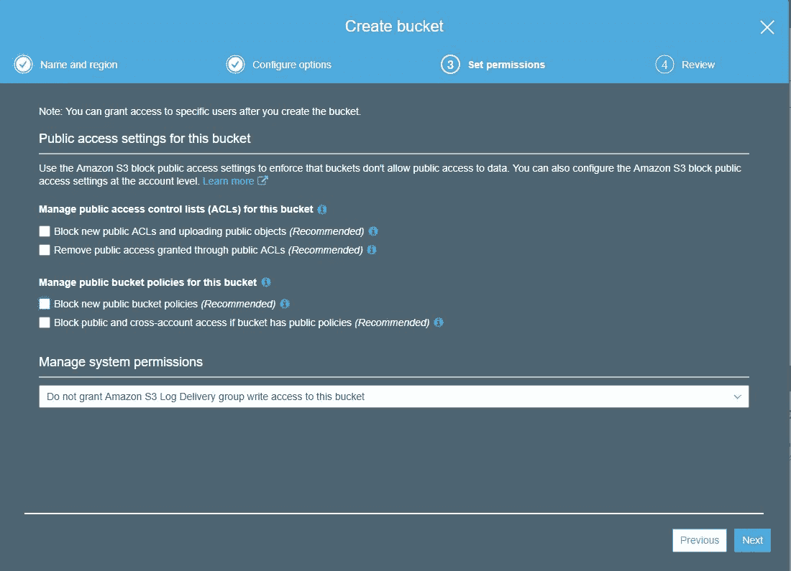

设置权限

1.  转到存储桶的**访问控制列表**并允许公开读/写访问：


访问控制列表

1.  保存所有设置

我们的易受攻击的 AWS 基础设施已经准备好。接下来，我们将配置和运行 Scout Suite，并看看它如何识别我们创建的所有安全配置错误。

# 配置和运行 Scout Suite

现在我们的易受攻击的 AWS 基础架构已经建立，是时候配置并运行 Scout Suite 了。Scout Suite 是一种自动化的云安全审计工具，可帮助我们评估和识别安全配置错误。它从云提供商公开的 API 中收集配置数据，并生成一个报告，突出显示潜在的易受攻击配置。该工具适用于多个云提供商，如 AWS、Azure 和 Google Cloud Platform（GCP）。

# 设置工具

要在我们的 AWS 基础架构上运行该工具，我们将不得不设置一个具有特定权限的 IAM 用户来配置该工具：

1.  首先，转到 IAM | 用户。

1.  点击“添加用户”按钮，如下截图所示：


添加 IAM 用户

1.  我们将为此活动创建一个新的`auditor`用户。将访问类型设置为程序化访问，然后继续。我们不需要访问 AWS 管理控制台，因此无需创建密码：

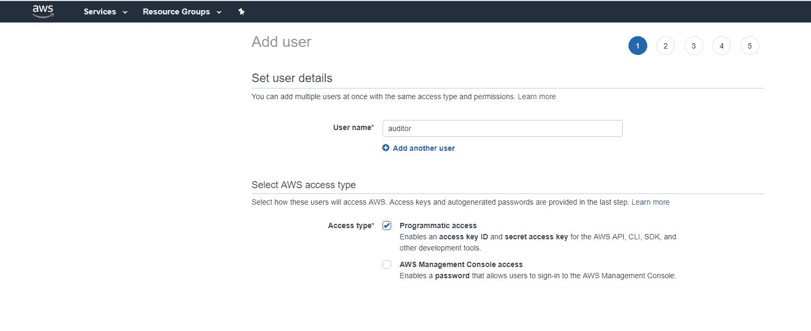

设置用户详细信息

1.  接下来，我们将为我们的新 IAM 用户设置策略。为了使工具成功运行，我们需要为该用户提供两个特定策略，即 ReadOnlyAccess 和 SecurityAudit，如下截图所示：

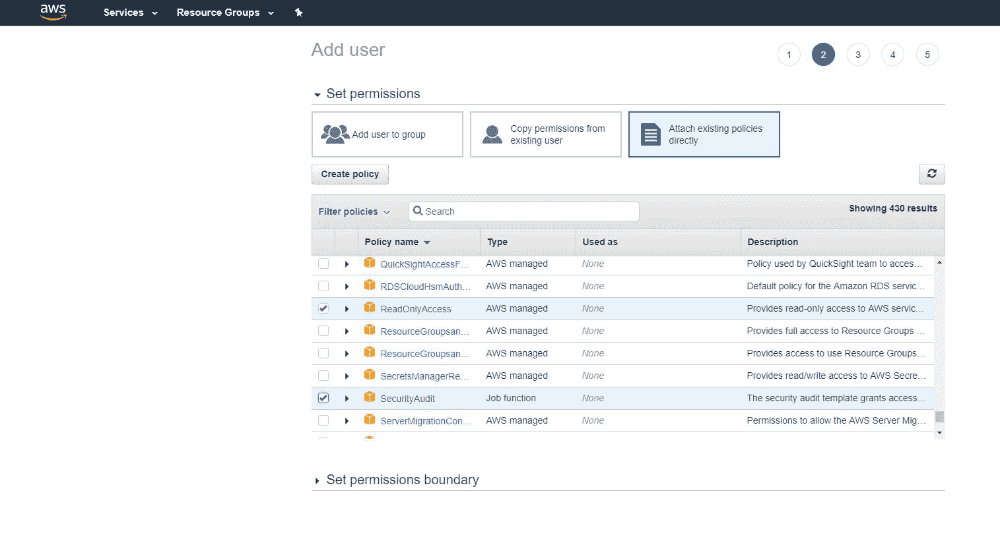

为我们的新 IAM 用户设置策略

在设置权限中选择这两个权限，然后继续。

1.  检查最终审查页面上的详细信息，然后继续：

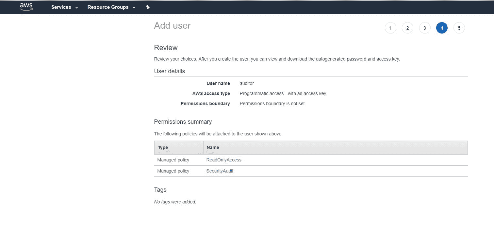

审查详细信息

1.  最后，您将收到一个成功消息，以及访问密钥 ID 和秘密访问密钥凭据。请记下这些，因为配置 AWS CLI 时将需要它们：

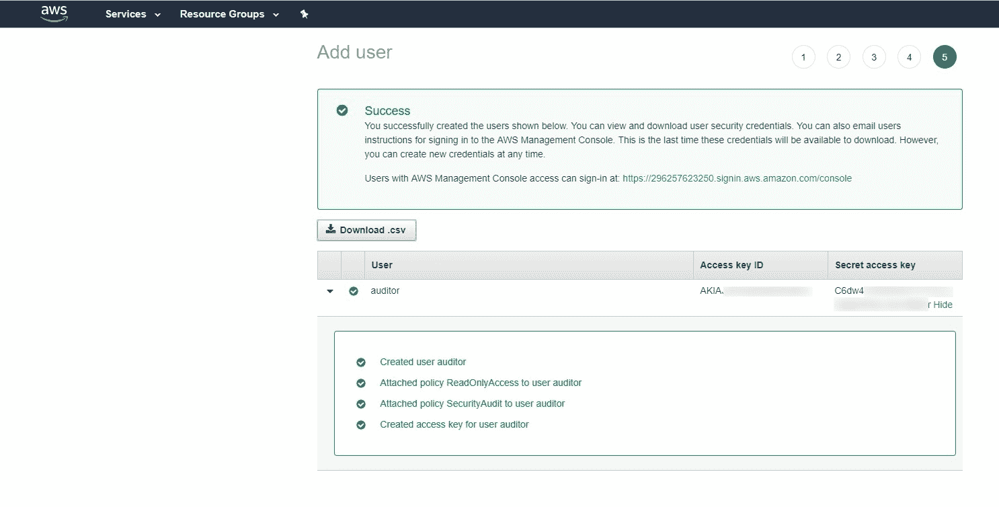

显示成功消息的屏幕

7. 点击“继续”，您将看到我们的用户已创建：

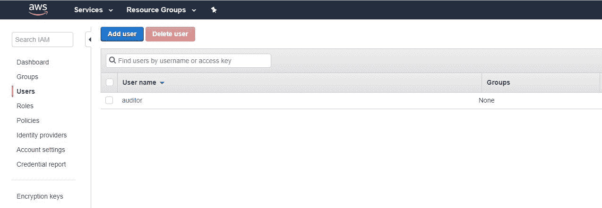

显示用户已创建的屏幕

接下来，我们将配置我们的 AWS CLI 以使 Scout Suite 能够按照以下步骤工作：

1.  运行 AWS CLI 工具，并使用刚刚收到的凭据进行配置：

```
aws configure
```

1.  输入凭据，并确保将您的区域设置为托管 AWS 基础架构的相同区域。

1.  现在让我们安装`scoutsuite`；我们可以通过`pip`进行安装，如下所示：

```
sudo pip install scoutsuite
```

或者，我们可以从 GitHub 存储库下载该工具：

```
git clone https://github.com/nccgroup/ScoutSuite
```

1.  如果您从 GitHub 下载脚本，您将需要运行以下命令来安装`ScoutSuite`的所有依赖项：

```
cd ScoutSuite
sudo pip install -r requirements.txt
```

如果您想在 Python 虚拟环境中运行该工具，请在运行`pip install -r requirements.txt`之前运行以下命令：

```
virtualenv -p python3 venv
source venv/bin/activate
```

然后，通过运行`pip install -r requirements.txt`安装所有依赖项。

1.  最后，通过运行以下命令检查工具是否正常工作：

```
python Scout.py --help
```

如果显示帮助菜单，这意味着我们的工具已成功设置。让我们看看如何运行工具并对基础架构进行评估。

# 运行 Scout Suite

我们的工具现在已准备就绪。要开始评估，只需运行以下命令。

如果使用`pip`安装，请使用以下命令：

```
Scout aws
```

如果您正在运行 GitHub 脚本，请使用此命令：

```
python Scout.py aws
```

该工具将从每个 AWS 服务收集数据，然后分析配置：

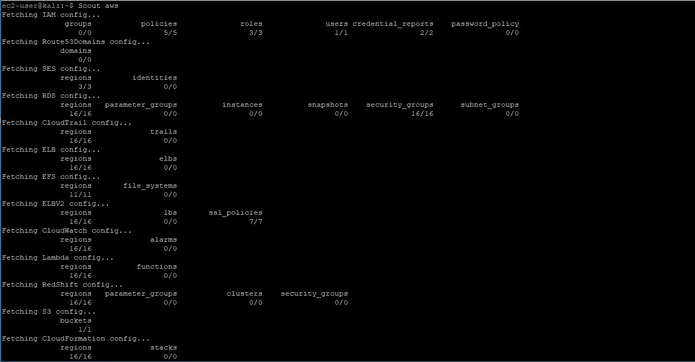

分析配置

该工具将生成一个 HTML 报告，将保存在`scoutsuite-report`文件夹中。如果您已经在 AWS 上运行的 Kali 实例上运行了该工具，您可以使用 SCP/WinSCP 简单地下载文件。

# 解析 Scout Suite 扫描结果

让我们来看看我们的报告；看起来 Scout Suite 已经在我们的 AWS 基础架构中识别出了一些问题，如下截图所示：


Scout Suite 仪表板显示 AWS 基础架构中的问题

我们将逐一查看每个报告的问题。

让我们看看 EC2 报告。从报告中可以看出，所有 EC2 实例的配置错误都已列出：

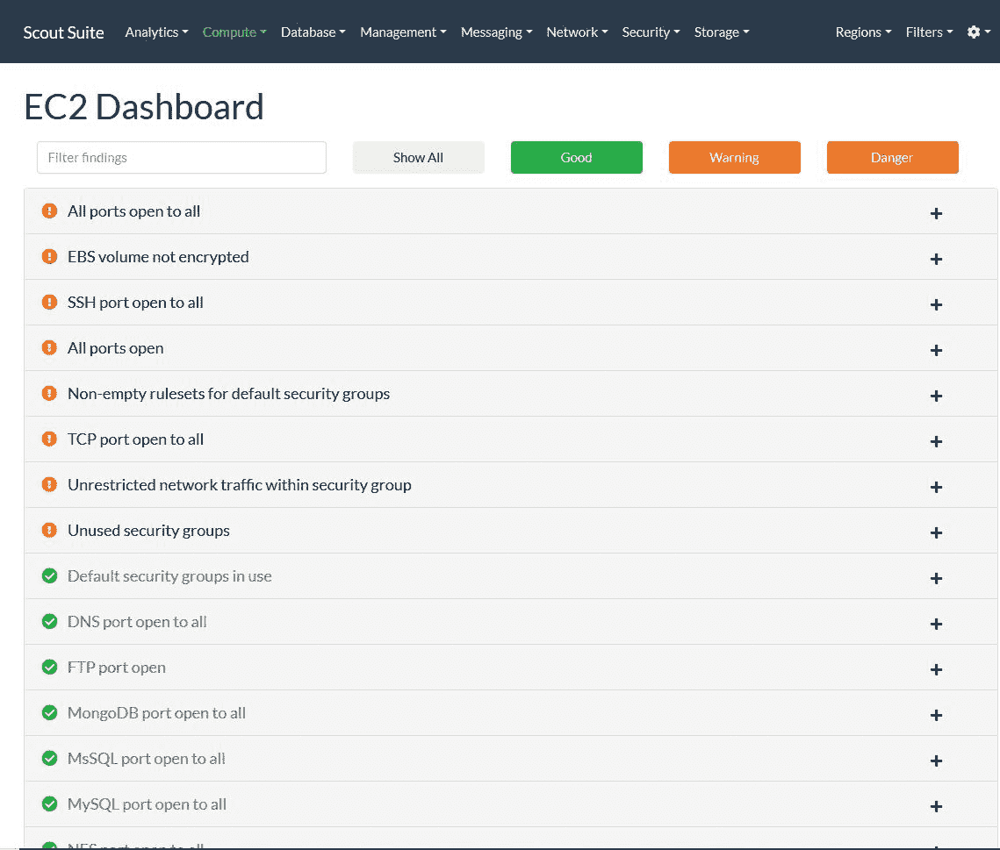

EC2 仪表板

如果您想更详细地查看每个问题，只需单击任何问题。让我们看看“所有端口对所有开放”问题的详细信息：

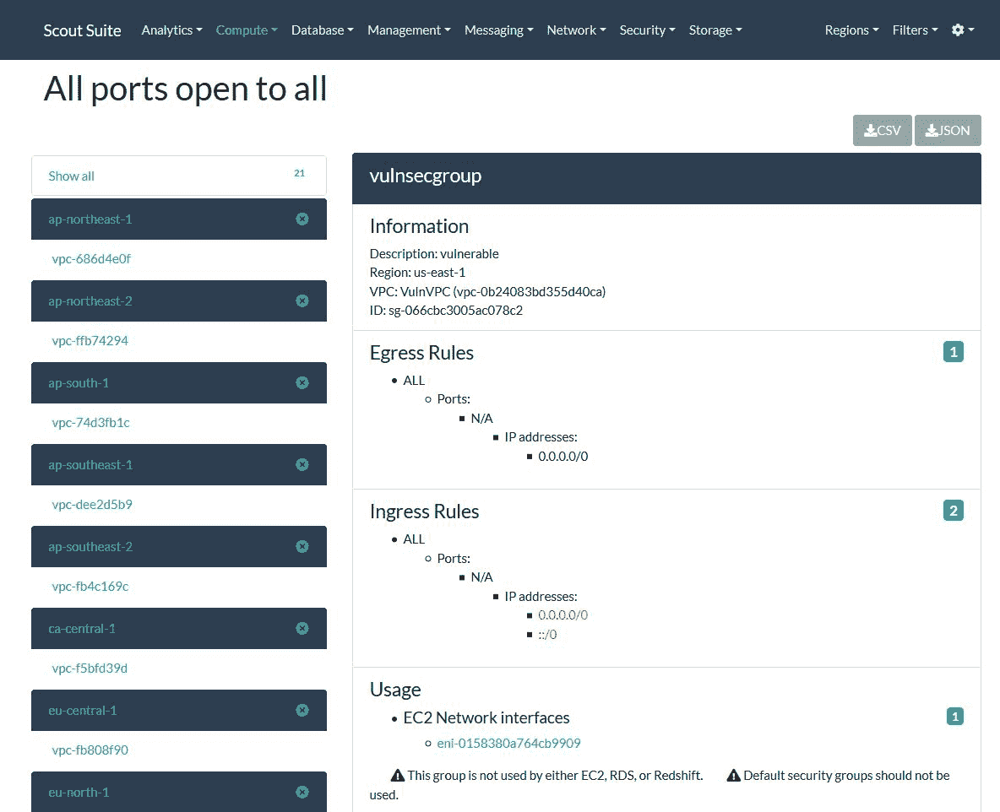

所有端口对所有开放

在这里，我们更详细地了解了配置错误的位置以及为什么会出现问题。

现在，让我们在 S3 仪表板中查看我们的 S3 存储桶报告：


S3 仪表板

正如您在前面的屏幕截图中所看到的，该工具成功识别了我们创建的易受攻击的 S3 存储桶。

那么，我们的 VPC 和子网呢？VPC 服务中没有关键发现。但是，工具已经确定了 VPC 和子网的网络 ACL 中存在潜在威胁，我们需要进行调查：


VPC 仪表板

我们还可以看到 IAM 服务中存在一些关键发现；让我们也来看看：

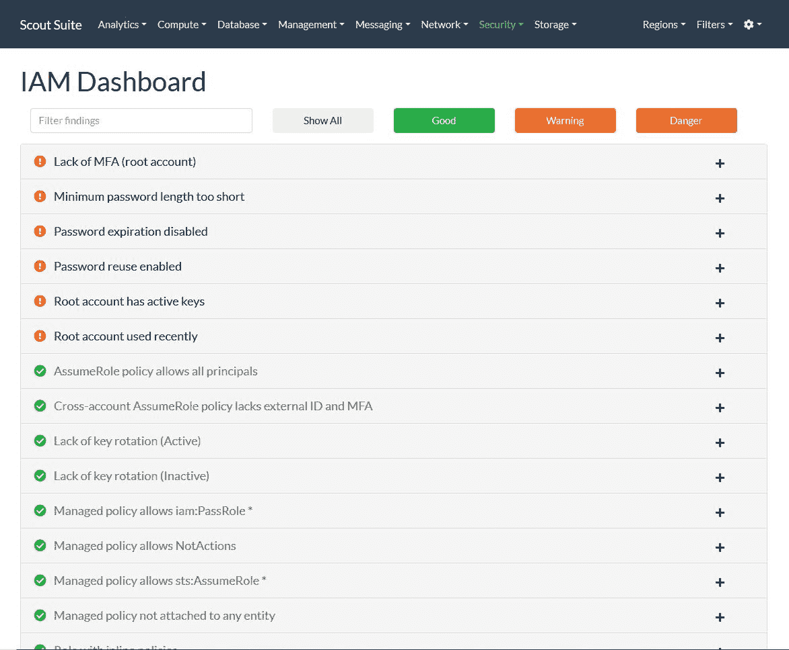

IAM 仪表板

这些发现对审计人员识别易受攻击的密码策略和访问管理问题非常有帮助。这对系统管理员来说也非常有用，可以确保遵循最佳实践。

现在让我们看看如何使用自定义规则集根据我们的需求自定义报告。

# 使用 Scout Suite 的规则

Scout Suite 为我们提供了使用自定义规则集而不是默认规则集对基础设施进行审计的选项。这非常有用，因为每个组织在设置 AWS 基础设施时都有自己的业务案例。使用自定义规则集可以帮助组织根据其需求定制工具的评估。

让我们看看如何创建自己的规则集：

1.  要创建新的规则集，我们首先需要复制现有的规则集。您可以在 GitHub 存储库中找到默认的规则集文件[`github.com/nccgroup/ScoutSuite/blob/master/ScoutSuite/providers/aws/rules/rulesets/detailed.json.`](https://github.com/nccgroup/ScoutSuite/blob/master/ScoutSuite/providers/aws/rules/rulesets/detailed.json)我们这样做的原因是确保我们有正确的规则集格式，可以从中构建我们自己的规则。

1.  下载文件并在文本编辑器中打开，如下图所示：

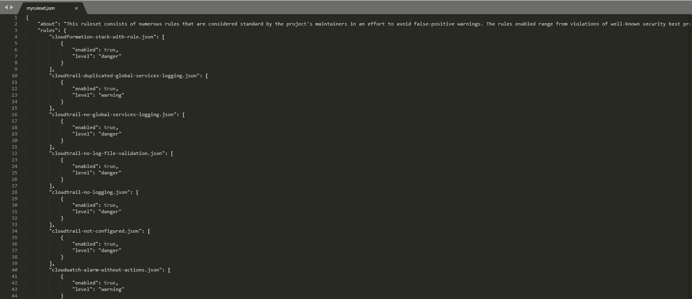

myruleset.json

1.  让我们修改文件末尾的以下设置：

+   转到名为`vpc-default-network-acls-allow-all.json`的设置。如果您没有对文件进行任何更改，则设置应在第`1046`行。

+   将`ingress`参数的严重级别从`warning`更改为`danger`：

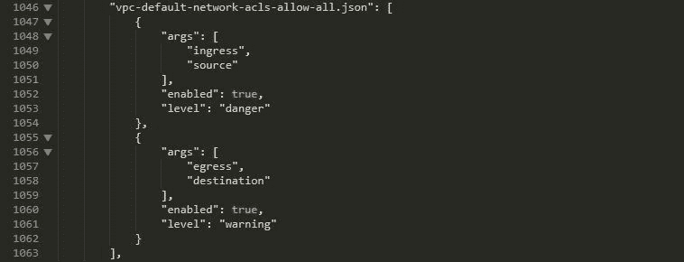

更改严重级别

+   +   转到名为`vpc-subnet-with-default-acls.json`的设置。如果您没有对文件进行任何更改，则设置应在第`1088`行：


vpc-subnet-with-default-acls.json

+   +   将`"enabled"`设置更改为`true`。

1.  我们已经准备好使用自定义规则集运行 Scout Suite。如果您使用`pip`安装，请发出以下命令：

```
Scout aws --ruleset myruleset.json
```

如果您正在使用 GitHub 脚本，请发出以下命令：

```
Scout.py aws --ruleset myruleset.json
```

如果您这次查看报告，您会看到之前报告的 VPC 相关问题现在已被标记为关键：

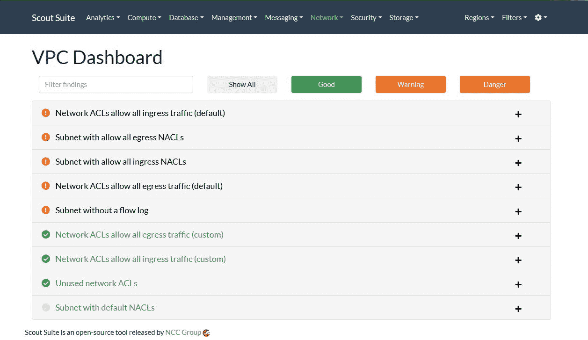

VPC 仪表板

此外，由于我们启用了`vpc-subnet-with-default-acls.json`设置，Scout Suite 这次报告了问题。

同样，其他设置可以根据其用例进行修改。

# 摘要

在本章中，我们学习了如何设置和配置 Scout Suite。为了在我们的 AWS 基础设施上运行 Scout Suite，我们创建了一个新的 VPC 和具有易受攻击配置的子网，然后启动了一个具有易受攻击安全组的 EC2 实例。然后我们运行了 Scout Suite 来识别我们 AWS 基础设施中潜在的易受攻击配置，然后分析报告以了解漏洞是如何报告的。最后，我们学习了如何修改和使用定制的规则集来调整报告，以符合我们的需求。

在下一章中，我们将看一下 AWS 基础设施的现实世界渗透测试。
