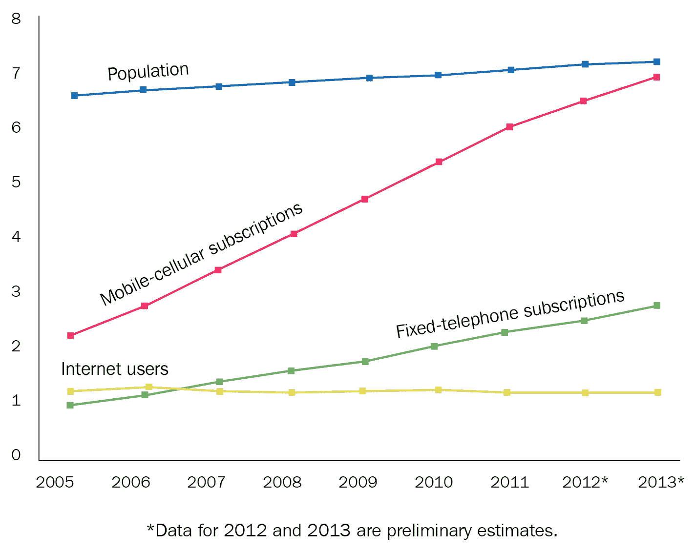
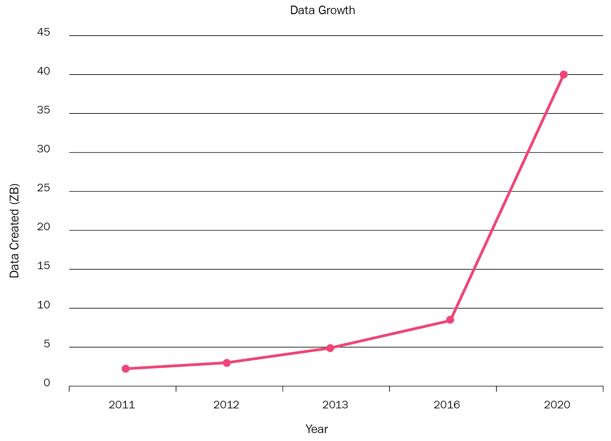

# 第一章：加入猎杀

本书旨在为你提供必要的实践经验，帮助你对安全产生兴趣，并将其转化为一项有趣且有利可图的追求。

目标是，通过专注于真实的提交报告，你可以更好地理解如何以及在哪些地方发现网络漏洞，通过在家进行渗透测试真实的网站（以及故意存在漏洞的 web 应用），你将获得宝贵的实践经验。有时候，最好的学习方式就是先学一些理论，然后直接投入其中。

本章将重点介绍你将学到的内容、如何学习以及如何从这本书中最大化收益。它将覆盖以下内容：

+   漏洞赏金计划的好处

+   在开始阅读本书之前，你的渗透测试背景应该具备哪些知识

+   设置环境和需要掌握的工具

+   你的下一步

# 技术要求

本章节不需要任何软件，虽然我们会介绍一些在后续示例中会使用到的工具。

你可以在 OWASP 的 XSS 过滤器规避备忘单中找到上一节提到的简短代码片段：[`www.owasp.org/index.php/XSS_Filter_Evasion_Cheat_Sheet`](https://www.owasp.org/index.php/XSS_Filter_Evasion_Cheat_Sheet)。

# 漏洞赏金计划的好处

网络正在迅猛发展——比任何时期都更多的人以更加多样化的方式使用网络，做更多的事情。

手机是数字生活崛起的完美例子。自 20 世纪末发明以来，手机的使用从一个小型的技术精英群体扩展到全球超过 60%的人口——预计到 2019 年底，全球将有超过 50 亿人拥有手机。我们的口袋电脑在不到 30 年的时间里征服了世界。就像大爆炸一样，手机使用并非爆炸式增长，而是以惊人的速度扩展，迅速覆盖了世界上大部分的人口。从座机的空白中迸发出了移动、无限的未来，几乎在这一想法被提出的同时，它便成为了现实。

以下是联合国 2015 年关于千年发展目标进展的研究中，展示了手机拥有率如何在 2010 年代初期迅速普及，几乎覆盖了全球大部分人群的图表：



随着互联网接入的普及以及网络复杂度的增加，越来越多的人可以轻松上网，并且一旦在线，他们就能做更多事情。购物、银行业务、社交——我们生活中越来越多的部分是在网上度过的。得益于神童般的人工神经网络（这些算法模仿人类大脑的数学模型，并且在模式识别上取得了惊人的成功）的数据分析，趋势显示数据收集将越来越多。神经网络编写起来很复杂，但使用起来足够简单——只要你给它们提供足够的信息。我们的设备比以往任何时候都更了解我们，并且它们每天都在学习更多。

这张图表显示了未来几年每分钟产生的数据量（或预计产生的数据量）。下图的 *y*-*x* 轴以泽字节（ZB）为单位：1 ZB = 10 亿太字节（TB）。这些数字令人震惊：



更多的应用程序为更多的人提供更复杂的服务，并管理更多的数据，这导致了系统的崩溃。随着公司尝试实现他们的技术目标，网页开发者的需求急剧增加，但供给却跟不上几乎无限的开发工作需求。编程训练营、在线课程以及其他四年制学位的替代方案，已经成为软件工程职业的热门入门途径，但编程公司希望完成的任务与能够完成这些任务的程序员之间仍然存在很大的差距。随着对开发者时间和注意力的要求增加，曾经被认为是昂贵且非必要的安全问题，已经变成了疏忽大意的企业面临的危机，因为漏洞导致了数据泄露、商业利用、身份盗窃，甚至是国家行为者和犯罪集团的间谍行为。

漏洞赏金是昂贵的内部安全机制的众包替代方案。科技公司（从大型企业到小型五人初创公司）已经开始使用公开的漏洞赏金计划，来发现其应用程序中通常被黑客作为突破口的逻辑错误和数据处理不当。通过在漏洞被利用之前发现它们，公司可以支付工作费用，从而直接减少暴露风险，而不必承担全面安全审计的成本。一些公司选择参与第三方平台，如 Bugcrowd 或 HackerOne，以规范他们的支付、提交报告格式、参与规则和目标清单，而另一些大公司则足够大，能够在自己的框架下运营这样的程序。

无论哪种方式，通过作为研究人员参与，你都可以通过运用你的技能来获得报酬。而且，由于许多漏洞赏金市场还会追踪你找到的漏洞数量、漏洞的严重性和你的整体成功率，因此在公共平台上做第三方研究也可以成为你获得更多安全工作机会的好桥梁。如果你来自非传统背景或没有正式的安全教育，它可能有助于证明你具备在该领域中有效工作的必要技能。你可以在此过程中，遵循发现和披露过程的责任，同时使目标应用程序和整个网络更安全。

# 你应该已经知道的 —— 渗透测试背景

本书假设读者熟悉 web 应用程序工程和基本的 web 应用程序安全知识。熟悉前端技术（如 HTML/CSS/JS 和 DOM）、客户端-服务器关系、会话管理（cookies、TTL 等）、浏览器环境将有助于理解许多内容。此外，对 RESTful API 架构、常见应用框架和语言（如 Django/Python、RoR/Ruby 等）、常见应用安全技术和常见漏洞有一般了解将会很有帮助。无论您是全职安全研究员、业余的 web 应用程序工程师，甚至只是具有轻度背景和历史兴趣的编程爱好者，本书都会为您提供有用的信息。如果您刚刚开始，也没关系 – 在后面的章节中，逐步的实例将帮助您成长为安全研究员；您可能需要通过其他上下文来填补知识空白。

除了这些主题，我们假设您也有使用命令行的经验。虽然有许多优秀的图形工具用于进行和可视化渗透测试，我们将使用其中的许多工具，但命令行界面对于从包管理到实时渗透测试执行再到自动化等各个方面都是无价的工具。虽然许多使用的工具都有兼容的 Windows 版本，但实际的操作（大部分情况下）将在装有 High Sierra（10.13.2）的 2015 年款 MacBook Pro 上进行。如果您在 Windows PC 上工作，您仍然可以通过使用虚拟机或仿真软件参与进来。

# 设置您的环境 – 需要了解的工具

本书中使用的所有工具都是免费的 – 您无需购买其他任何内容来重现操作步骤。在第十二章其他工具的调查中，将讨论其他技术（付费和免费），您可以利用它们来获得额外的功能。

这里简要概述了我们将使用的一些技术：

+   **Burp Suite** 是一个多才多艺的程序，可以拦截网络流量（Burp Proxy），触发应用程序信息提交（Burp Intruder），扫描输入以防止恶意代码片段（Burp Scanner），以及通过扩展提供的可能性进行多种其他操作。我们将介绍如何使用原生的 Burp 功能以及如何整合简单的扩展。考虑到重点放在免费版本可用功能上，部分付费功能，比如 Burp Scan，只会进行概述。

+   Nmap、sqlmap、wfuzz、arachnid 和其他 CLI 程序非常适合组装成更大的工作流程，将信息传递给相邻工具（Burp 和其他工具），启动其他自动化，或者持续可视化目标的攻击面。

+   有意设置为易受攻击的 Web 应用程序是一种不同类别的工具 - 不太适用于实际的渗透测试活动，而更多地设计用于测试新想法或校准现有方法或技术，以便在需要为特定漏洞返回积极结果时使用。我们将使用易受攻击的 Web 应用程序，如 Google Gruyere、Target Range、DAMN 易受攻击的 Web 应用程序等，来进行这两种操作。您可以在第十三章的站点部分找到更多 DVWA 的列表，*深入了解*。

虽然我们在使用这些工具时将进行设置，但浏览它们的安装和文档页面仍然是一个好主意。由于它们的深度，许多这些工具将具有我们在工作过程中无法完全涵盖的有用功能。我们还将只是浏览与安全无关的工具的表面 - 那些应用程序代表的笔记、记录和其他一般生产力功能可以轻松地被您最熟悉的任何类似物所替代。

# 您将学到什么 - 下一步

除了在本书结束时熟悉这些工具（以及更多工具）之外，您还将学习如何寻找、成功检测并撰写有关 XSS、SQLi 和 NoSQLi、CSRF、XEE、数据泄漏、不安全的会话管理和未经验证的重定向，以及特定于框架和语言的漏洞的漏洞提交报告，包括由 WordPress、Django 和 Ruby on Rails 应用程序提供支持的网站。您还将学习如何撰写最大化报酬的报告，如何将注意力集中在最大化发现漏洞的机会上，哪些漏洞不会导致报酬，为您的渗透测试会话做好准备，如何遵守会话规则，以及作为独立安全研究人员参与漏洞赏金计划时如何高效且盈利的一般提示。

获得渗透测试的实际经验，以参与漏洞奖励计划是关键。你最终会通过将本书中探索的工具应用到你自己的目标上来学到最多。因此，在阅读本书的过程中，我们鼓励你注册加入第三方社区，并开始你的第一次安全研究之旅。只要你遵守参与规则并尊重应用程序及其用户，你就可以开始尝试本书中介绍的技巧。参与论坛讨论、阅读其他用户的经验、关注博客，并普遍成为安全社区的一部分，也有助于你了解有效的策略。阅读其他研究人员已经获得批准披露的漏洞报告是一种绝佳的方式，可以帮助你理解什么样的报告是有效的，哪些漏洞通常在哪里被发现。

# 如何（不）使用本书——一个警告

在继续之前的最后一句话：

不要滥用本书。

本书中描述的技术和方法仅用于参与经过批准的、符合伦理的白帽渗透测试工作，以便发现漏洞并报告修复，从而获得报酬。

本书中的教训应当负责任地使用：

+   不应当在没有网站所有者许可的情况下应用这些技术

+   不应当应用到网站所有者认为超出范围的数据或逻辑

+   不应当以任何方式将其武器化——将其从漏洞阶段转化为实际的攻击手段

下面是一个快速的例子，说明什么是“武器化”。

假设你发现了一个存储型 XSS 漏洞，其中不正确的数据清洗导致评论线程允许未转义的 HTML 存储潜在的恶意代码。你使用 Burp Intruder 工具和手动跟进提交一个代码片段，演示你可以存储（并稍后执行）任意一段 JavaScript。这个片段实际上是一个非常简单的测试——它在一个没有正确清洗的 `src` 属性下执行 `alert()` 函数，这个属性附加在一个 `` HTML 标签上：

```


```

使用 `alert()` 或 `console.log()` 来测试是否在可能的 XSS 实例中执行 JavaScript 本身并没有错——不过，在使用 `alert()` 或记录日志时，记得输出一些关于 XSS 发生位置的信息（例如，`alert(window.location.href)`）。

但是，将漏洞转化为攻击手段是有问题的。一旦确认了 XSS 漏洞，恶意 JavaScript 很容易被找到并做出更恶意的行为。运行这些恶意代码——即使是在有限的方式下——也有可能会破坏应用数据、进程或其他可能导致法律责任的事情。

想象漏洞可能被如何利用是很有帮助的——许多漏洞悬赏计划希望在你提交报告时听到关于漏洞的具体场景，以便判断漏洞是否足够严重，是否值得支付奖励。有时，甚至该场景的形式——你能证明攻击者可能造成的损害——也能极大地影响你的奖励。

所以，考虑漏洞的整体形式是有益的——对于存储型 XSS，你可以重写执行脚本的页面的关键部分，或获取认证 cookie 并将其发送到监听这些凭证的服务器，或进行其他攻击——但评估这种漏洞的影响仍然不足以编写会损害人们和流程的代码。

不要编写利用代码。如果你在美国，法律惩罚是非常严厉的——截至本文写作时，**计算机欺诈和滥用法案**（**CFAA**）意味着即使是轻微违反网站服务条款，也可能会导致重罪。企业也很快会起诉不遵守其参与规则的独立研究人员，这些规则是研究人员在探测应用程序漏洞时必须遵循的条件。即使没有面临法律诉讼的威胁，无论是民事还是刑事，黑客攻击这些网站仍然会欺诈无辜的人，伤害小型企业，引发立法过度反应，侵蚀隐私，并且总体上让整个网络变得更糟。

这不值得。

说完这些，我们可以开始进入任何漏洞狩猎冒险的第一步：选择使用哪个计划，探索哪个网站，以及在哪里——如何——找到漏洞。

# 总结

本章介绍了漏洞悬赏计划的起源和好处，入门时所需的背景知识，参与中我们将使用的一些工具概述，如何最大化地从本书中获益（在允许的网站上实践），以及最后，不遵守目标网站的参与规则或行为准则所冒的道德和法律风险。

在下一章中，我们将介绍不同类型的漏洞悬赏计划，它们之间的关键区别，如何评估你应该参与的计划，以及哪些应用程序是好的目标，应该将你的研究重点放在哪里，最后，如何利用计划的参与规则来最大限度地减少作为安全研究人员的法律责任。

# 问题

1.  为什么网站提供漏洞悬赏计划？

1.  参与这些计划有什么价值？

1.  我们需要了解什么才能从本书中获得最大的收获？

1.  我们将使用哪些工具？它们的用途是什么？

1.  我们如何使 XSS 的`alert()`调用更有效？

1.  思考一个漏洞可能如何被利用是可以的吗？写代码来测试这个理论呢？

1.  关于渗透测试的刑事理论，适用的法律是什么？

# 进一步阅读

你可以在以下链接中了解更多关于我们在本章中讨论的一些话题：

+   **关于开放网络应用安全项目（OWASP）**: [`www.owasp.org/index.php/About_The_Open_Web_Application_Security_Project`](https://www.owasp.org/index.php/About_The_Open_Web_Application_Security_Project)

+   **2015 年联合国千年发展目标报告**: [`www.un.org/millenniumgoals/2015_MDG_Report/pdf/MDG%202015%20rev%20%28July%201%29.pdf`](http://www.un.org/millenniumgoals/2015_MDG_Report/pdf/MDG%202015%20rev%20%28July%201%29.pdf)
