# 第三章：准备进行渗透测试

当你将搜索范围缩小到想要测试的应用程序时，就可以开始收集信息了。获取完整的站点地图、揭示隐藏内容并发现开发过程中遗留的工件（注释掉的代码、内联文档等）可以帮助你将焦点集中到有价值的领域。通过了解报告漏洞所需的信息，你可以确保从一开始就收集到所有需要的内容，方便最终提交。

本章讨论了映射目标应用程序的攻击面、在站点上搜索隐藏目录和剩余（但可访问）服务、根据渗透测试会话中的工具选择做出明智决策，以及为最终报告记录会话的技巧。

我们将涵盖以下主题：

+   了解目标应用程序的关注点

+   设置和使用 Burp Suite

+   查找 XSS 代码片段、SQLi Payload 和其他代码的开源列表

+   收集目标的 DNS 和其他网络信息

+   创建一系列小巧、灵活的信息收集脚本

+   检查已知组件的漏洞

# 技术要求

本章与许多其他章节一样，将依赖于 `unix` 命令行 shell（`zsh`）来引导并与通过图形安装程序、包管理器（`homebrew`）或 tarball 安装的程序进行交互。它还将包括几个桌面应用程序，我们将通过类似的方法安装它们到 macOS High Sierra（`10.13.2`）环境中。当需要使用网页浏览器时，我们将使用 Chrome（`66.0.3359.139`）。

对于其中一些，会有明确的 Windows 选项。在这种情况下，菜单可能看起来不同，但可用的操作是相同的。如果没有 Windows 选项，可能需要通过双系统启动更易用的 Linux 发行版之一。

# 工具

本章将使用多种工具，其中一些将在本书中多次使用：

+   `wfuzz`

+   `scrapy`

+   `striker`

+   Burp Suite

+   Homebrew（包管理器）

+   SecLists

+   `virtualenv`

+   `jenv`（Java 版本管理器）

+   **Java 开发工具包**（**JDK**）

+   **Java 运行环境**（**JRE**）1.6 或更高版本

`wfuzz` 是一款由渗透测试员为渗透测试员开发的模糊测试和发现工具。要安装它，只需使用 `pip`：`pip install wfuzz`。

Homebrew 是一个出色的 macOS 包管理器，它允许你通过命令行安装依赖项，就像在 Debian 中使用 `apt-get` 或在 Redhat 风味的 Linux 发行版中使用 `yum` 一样。Homebrew 可以通过其官网轻松安装（[`brew.sh/`](https://brew.sh/)），然后可以通过 `brew install <PACKAGE_NAME>` 安装软件包。

Burp Suite 需要一个 JRE（1.6 或更高版本），但我们还需要 JDK 来使用`java`命令行工具从命令行引导 Burp Suite。从命令行运行 Burp 允许我们通过参数传递设置，从而更好地控制执行环境。

请按照 Portswigger 网站上的说明安装 Burp Suite：[`portswigger.net/burp/help/suite_gettingstarted`](https://portswigger.net/burp/help/suite_gettingstarted)。

要使用 Burp Suite，你需要运行一个旧版本的 Java。如果你尝试使用 Java 10.0.0 或更高版本从 CLI 启动 Burp，你将收到一条消息，说明 Burp 尚未在此版本上进行测试，可能会出现错误。

如果你只需要为 Burp 安装 Java，你可以安装一个旧版本——我们将使用 Java `1.8.0`（Java 8）——并在整个系统中使用。但是，如果你需要一个更新版本的 Java 安装来运行其他程序，你仍然可以通过使用`jenv`命令行实用程序来运行旧版本的 Java。`jenv`类似于 Ruby 版本管理器`rvm`或 Node 版本管理器`nvm`，它们都允许你通过几个命令添加、列出和在不同版本之间切换语言版本。

请从其网站安装`jenv`：[`www.jenv.be/`](http://www.jenv.be/)。

安装了`jenv`之后，你可以通过使用其`/Home`目录的路径简单地向其添加一个新的 Java 版本。然后我们将设置我们的系统使用它：

```
jenv add /Library/Java/JavaVirtualMachines/jdk1.8.0_172.jdk/Contents/Home
jenv global 1.8
```

你可能需要重新启动你的终端。但是你应该已经安装了 Java 8！用`java -version`检查一下是否是 Java 8。你应该看到这个输出：

```
java version "1.8.0_172"
Java(TM) SE Runtime Environment (build 1.8.0_172-b11)
Java HotSpot(TM) 64-Bit Server VM (build 25.172-b11, mixed mode)
```

# 使用 Burp

现在让我们启动 Burp - 命令中的`4G`部分是我们指定 Burp Suite 应该在 4 GB 内存上运行的地方：

```
java -jar -Xmx4G "/Applications/Burp Suite Community Edition.app/Contents/java/app/burp/burpsuite_community_1.7.33-9.jar"
```

由于这个命令太长了，我们可以创建一个小的包装脚本，使用`$@`变量来添加我们想要传递的任何选项，而不用重写我们的路径到`.jar`可执行文件。这里是`bootstrap_burp.sh`：

```
#!/bin/sh

java -jar -Xmx3G "/Applications/Burp Suite Community Edition.app/Contents/java/app/burp/burpsuite_community_1.7.33-9.jar" $@
```

现在你可以将文件设置为可执行，并将其符号链接到`/usr/local/bin`或适当的实用程序，这样它就可以在你的`$PATH`中使用：

```
chmod u+x bootstrap_burp.sh
sudo ln -s /Full/path/to/bootstrap_burp.sh /usr/local/bin/bootstrap_burp
```

这样我们就可以只用`bootstrap_burp`来启动程序。

# 攻击面侦察 - 策略和标准化的价值

应用程序的攻击面，简言之，就是数据可以进入或退出应用程序的地方。攻击面分析描述了用于描述应用程序易受攻击部分的方法。有正式的过程，比如由微软的 Michael Howard 和其他研究人员开发的**相对攻击面指数**（**RASQ**），它计算系统的攻击机会并指示应用程序的一般易受攻击性。还有通过扫描仪和手动方法可用的程序化手段，直接浏览网站，通过截图和其他笔记记录弱点。我们将讨论您可以使用的低技术和高技术方法，以便将注意力集中在有利可图的攻击线上，以及您可以使用的方法来查找网站地图上未列出的隐藏或剩余内容。

# 网站地图

网站地图是一种极其简单的方式进行基础研究，零努力。通过使用`sitemap.xml`标识进行一些 URL 黑客攻击，通常会返回一个详细描述网站结构的实际 XML 文件，或者是一个 Yoast 或其他 SEO 插件提供的 HTML 页面，记录了网站的不同区域，包括文章、页面等的单独网站地图。

以下是由 Yoast 生成的网站地图页面示例：

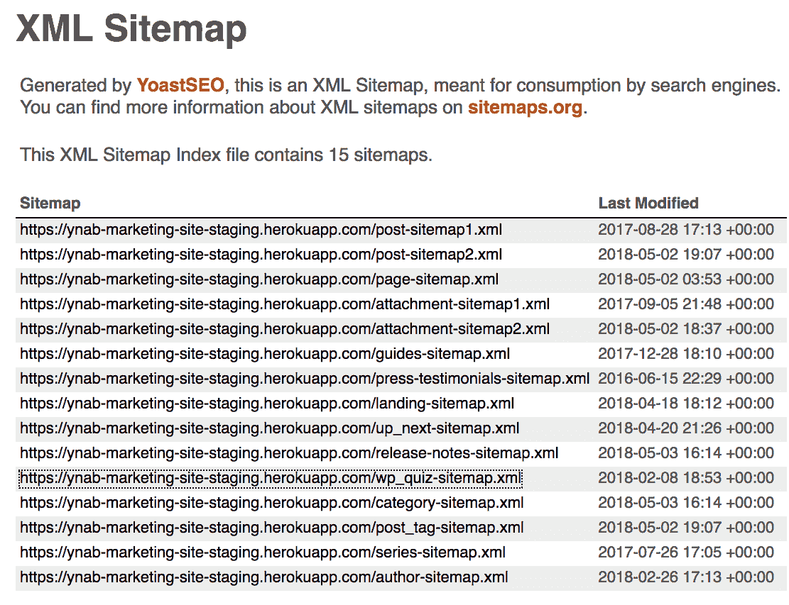

它有助于揭示网站的高层结构，同时让您专注于重要点。有些区域可以跳过：列出网站上每篇博客文章的链接的`post-sitemap1.xml`和`post-sitemap2.xml`部分并不有用，因为每篇博客文章或多或少都会有相同的攻击点（评论、喜欢/不喜欢按钮和社交分享）。

虽然`wp_quiz-sitemap.xml`暗示了一组诱人的表单字段，同时告诉我们网站是一个 WordPress 应用程序（如果我们之前不知道的话），`page-sitemap.xml`将为我们提供更广泛的网站功能：

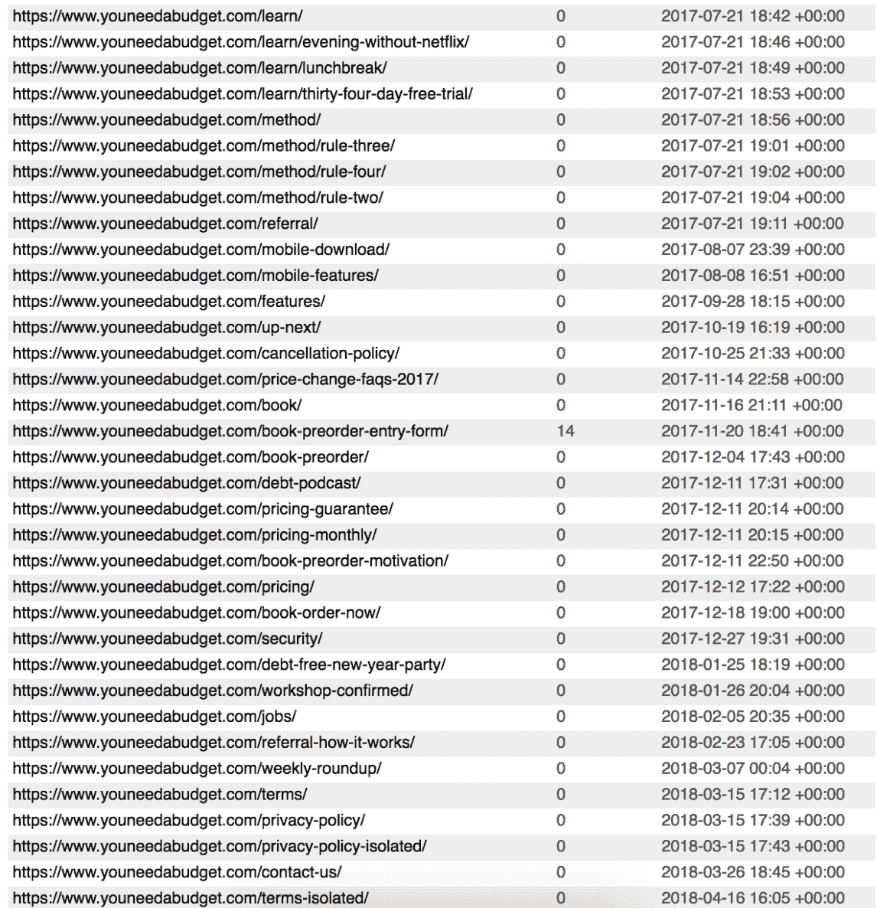

在这里，也有可以立即跟进和放弃的候选项。纯粹信息性的页面，如`/privacy-policy`、`/method/rule-two`和`/pricing-guarantee`，是简单的标记，没有与服务器或外部服务交互的机会。像`/contact-us`、`/book-preorder-entry-form`（表单在标题中！）和`/referral`（可能有一个提交表单的表单）这样的页面都值得跟进。`/jobs`可能有一个简历提交字段，也可能只是工作列表，是一个灰色区域。有些页面只需浏览一下。

网站地图并非总是可用的 - 它们总是受限于网站想要向您展示的内容 - 但它们可以作为进一步调查的有用起点。

# 扫描和目标侦察

自动信息收集是获得关于网站布局、攻击面和安全状况的一种一致、易于理解的信息的好方法。

# 强制获取网页内容

像`wfuzz`这样的模糊工具可以通过尝试不同的路径，使用来自巨大的词汇表的 URI，然后分析响应的 HTTP 状态码，发现隐藏的目录和文件。`wfuzz`功能强大，可以进行内容发现和表单操作。它易于上手，并且由于`wfuzz`支持插件、配方和其他高级功能，可以扩展并自定义为其他工作流程。

你用来暴力破解发现隐藏内容的词汇表质量非常重要。安装`wfuzz`后，克隆 SecLists GitHub 仓库（一个整理过的模糊列表集合，包括 SQLi 注入脚本、XSS 片段和其他通常是恶意的输入）到[`github.com/danielmiessler/SecLists`](https://github.com/danielmiessler/SecLists)。我们只需将想要替换为词汇表部分的 URL 用`FUZZ`字符串替换，就能启动目标站点的扫描：

```
wfuzz -w ~/Code/SecLists/Discovery/Web-Content/SVNDigger/all.txt --hc 404 http://webscantest.com/FUZZ
```

正如你从命令中看到的，我们传入了来自 SVNDigger 的 Web 内容发现列表，使用`-w`标志，`-hc`指示扫描忽略 404 状态码（隐藏代码），最后一个参数是我们想要扫描的目标 URL：

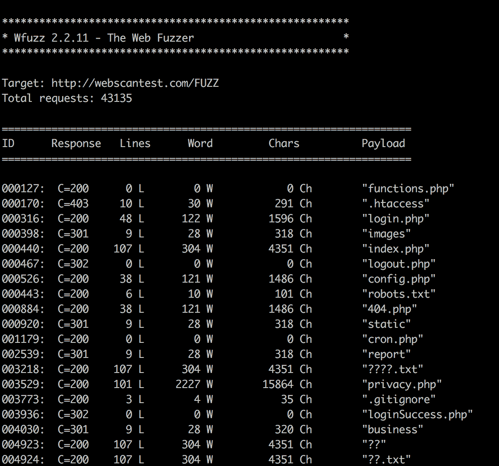

你可以看到一些有趣的探索点。虽然暴力破解工具的有效性取决于它们的词汇表，但只要你做足了研究，还是能找到有效的切入点。

请记住，暴力破解工具非常嘈杂。只应在隔离的预发布/QA 环境中使用，且必须获得许可。如果你的暴力破解工具压垮了生产服务器，这实际上与 DoS 攻击没有什么不同。

# 爬虫与其他数据收集技术

与暴力破解敏感资源并行，爬虫可以帮助你获取没有网站地图的站点的整体信息，而单靠暴力破解无法提供。这些链接基础也可以与其他工具共享，剔除任何超出范围或无关的条目，并进行更深入的分析。有几个有用的爬虫工具，每个工具都有其自身的优点。我们将介绍的第一个是 Burp 自带的爬虫功能，显然它是一个有力的竞争者，因为它是（并与）你工具集中的一个工具集成在一起。

# Burp Spider

开始爬虫会话时，确保你已经确定了适当的目标域名：

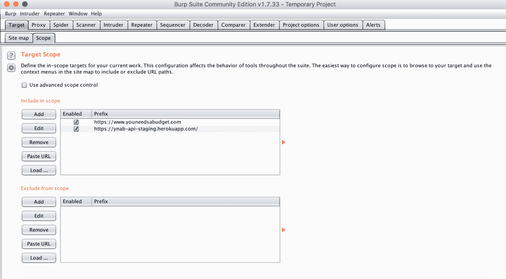

然后，你可以右键点击目标域名并选择“蜘蛛抓取此主机”：

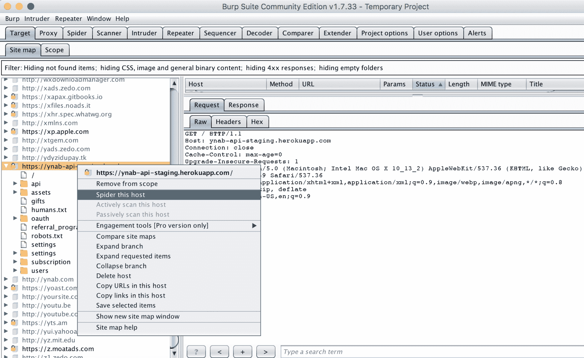

# Striker

Striker ([`github.com/s0md3v/Striker`](https://github.com/s0md3v/Striker)) 是一个 Python 攻击性信息和漏洞扫描器，使用不同的资源进行多项检查，特别关注 DNS 和网络信息。你可以通过访问其 Github 页面上的说明进行安装。像许多 Python 项目一样，它只需要克隆代码并下载 `requirements.txt` 中列出的依赖项。

Striker 提供了有用的基础网络识别和扫描功能：

+   指纹识别目标 web 服务器

+   检测 CMS（支持 197 种以上）

+   扫描目标端口

+   查找 `whois` 信息

它还提供了一些其他功能，比如为 WordPress 实例启动 WPScan 或绕过 Cloudflare：

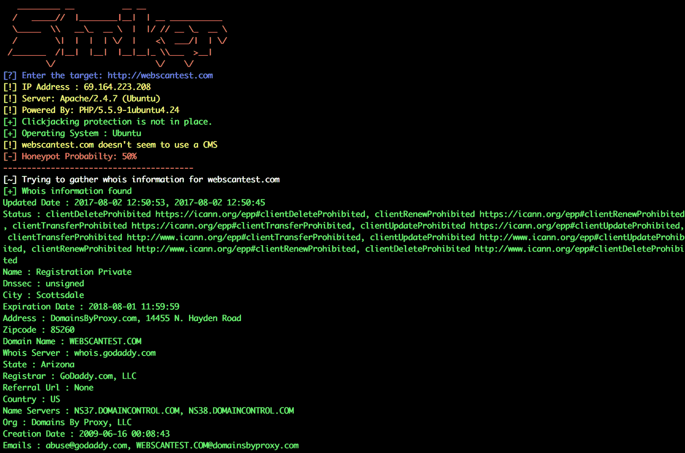

# Scrapy 和自定义管道

`scrapy` 是一个流行的 Python 网络爬虫框架，可以让你轻松创建爬虫。它是一个功能强大的通用工具，由于其高度可定制性，已经自然地融入了专业安全工作流。像 XSScrapy 这样的项目，基于 Scrapy 构建的 XSS 和 SQLi 扫描工具，展示了底层代码的适应性。与 Burp Suite Spider（它的优点在于可以轻松与其他 Burp 工具集成）以及 Striker（其价值在于通过默认配置收集 DNS 和网络信息）不同，Scrapy 的吸引力在于它可以轻松设置并进行定制，创建任何类型的数据管道。

# 手动操作演练

如果应用没有网站地图，而你又不想使用扫描器，你仍然可以通过浏览网站的方式创建网站结构的布局，无需做笔记或截图。Burp 允许你将浏览器与应用的代理链接，然后它会记录你访问的所有页面，帮助你在浏览网站时进行记录。当你绘制网站的攻击面时，你可以通过自动化工作流添加或删除页面，确保你控制哪些内容被调查。

这种手动辅助的方法实际上可能比使用自动扫描器更为优选。除了噪音更少、对目标服务器的影响更小外，手动方法还允许你精确控制哪些内容被视为范围内并进行调查。

首先，将你的浏览器连接到 Burp 代理。

Portswigger 提供支持文章帮助你。如果你使用的是 Chrome，可以跟着我一起操作。尽管我们使用的是 Chrome，但我们将使用 Burp 针对 Safari 的支持文章，因为相关设置在你的 Mac 设置中：[`support.portswigger.net/customer/portal/articles/1783070-Installing_Configuring%20your%20Browser%20-%20Safari.html`](https://support.portswigger.net/customer/portal/articles/1783070-Installing_Configuring%20your%20Browser%20-%20Safari.html)。

一旦你的浏览器连接并开启（并且你已经关闭了拦截功能），请访问 `http://burp/`。

如果您通过 Burp 代理进行此操作，您将被重定向到一个页面，您可以在该页面上下载 Burp 证书。我们需要该证书来移除任何安全警告，并允许我们的浏览器安装静态资源：

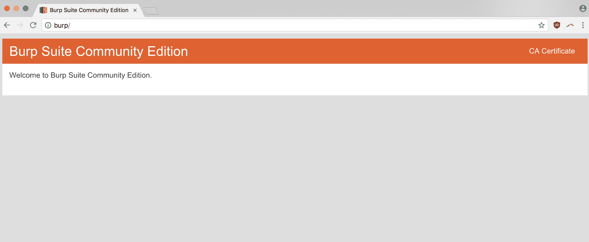

下载证书后，您只需进入您的钥匙串设置，选择文件 | 导入项目，然后上传您的 Burp 证书（`.der` 文件）。然后您可以双击它打开另一个窗口，在其中选择始终信任此证书：


在浏览一个网站后，您将开始看到它在 Burp 中填充信息。在目标 | 网站地图选项卡下，您可以看到浏览时点击的 URL：

020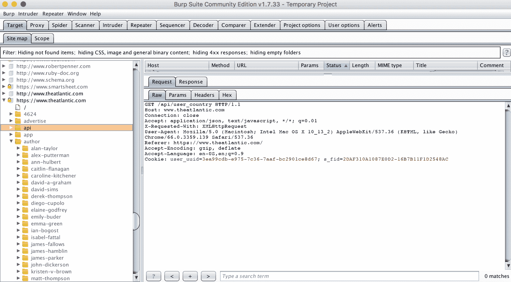

登录每个表单，点击每个选项卡，跟随每个按钮——最终您将建立一个足够清晰的应用程序图片，以指导接下来的研究。因为您是在 Burp 中建立这个图片，您可以添加或移除范围中的 URL，并将收集到的信息发送到 Burp 中的其他工具进行后续调查。

# 源代码

源代码分析通常被认为仅发生在白盒测试中，即内部测试场景，作为自动化构建链的一部分或手动审查。但分析浏览器可用的客户端代码也是作为外部研究人员寻找漏洞的有效方式。

我们将特别查看 `retire`（Retire.js），一个具有 Node 和 CLI 组件的 Node 模块，用于分析客户端 JavaScript 和 Node 模块中的已报告漏洞。您可以通过 `npm` 轻松安装它，然后使用全局标志（`-g`）将其添加到您的 `$PATH` 中：`npm install -g retire`。报告可能已经在供应商的软件中发现的错误，但仍需在公司网站应用程序中解决/修补，通常会获得奖励。`retire` 易于使用的 CLI 使得在 Unix 风格中编写简短、有目的的脚本变得简单。我们将利用它来阐述渗透测试自动化的一般理念。

`retire --help` 显示了功能的大致轮廓：

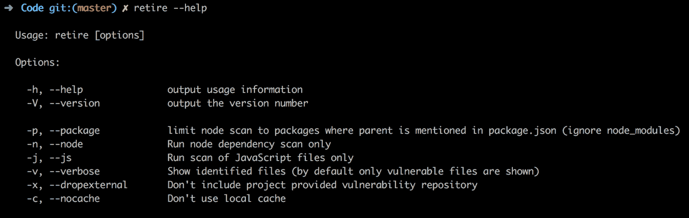

让我们用我以前写的一个 Angular 和 Node 项目进行测试：

```
retire --path ~/Code/Essences/demo
```

这有点难以阅读。尝试显示其嵌套依赖项中的脆弱模块使其变得更加困难：

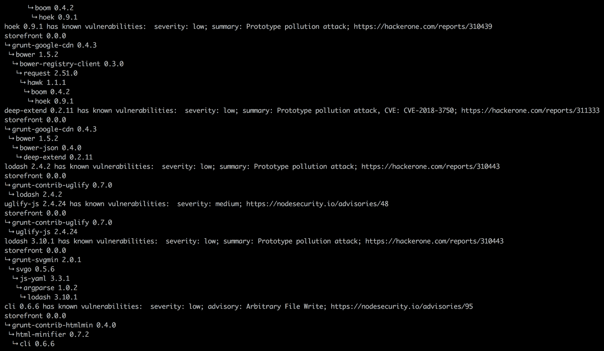

但是我们可以使用一些可用的标志来纠正这个问题。通过传递选项以将数据输出为 `json` 格式，并指定我们想要保存的文件名称，我们还可以将其包装在脚本中，从命令行中更方便地引用它。让我们创建一个名为 `scanjs.sh` 的脚本：

```
#!/bin/sh

retire --path $1 --outputformat json --outputpath $2; python -m json.tool $2
```

这个脚本需要两个参数，一个是被分析文件的路径，另一个是它将输出的文件名。基本上，脚本分析目标代码库，创建一个发现的漏洞的 `json` 文件，然后将格式化后的 `json` 文件输出到 `STDOUT`。这个脚本有两个输出，这样它就可以将 `json` 文件作为本地平面日志文件使用，并将 `STDOUT` 输出传递到下一个步骤，一个格式化脚本。

# 构建一个流程

如果我们考虑按照 Unix 的方式构建流程，每个小脚本负责一个单一的任务，通过链式连接组成更复杂的工作流（所有流程都建立在纯文本的共同基础上），那么将我们的自动化侦察工具拆解为最小的可重用部分是很有意义的。

其中一部分是我们刚才编写的包装脚本 `scanjs.sh`。该脚本扫描网站的客户端代码（目前来自一个代码库），并生成一个 `json` 格式的报告，同时保存和显示该报告。

# 格式化 JS 报告

但是为了更好地理解这个 `json`，我们需要以一种方式格式化它，从中提取关键信息（例如严重性、描述和位置），同时去除噪声（例如，依赖关系图）。我们将使用 Python，这对于字符串操作和一般的数据处理非常适合，编写一个脚本将该 `json` 格式化为纯文本报告。我们将把脚本命名为 `formatjs.py`，以便与我们的其他工具关联。首先，我们需要从 `STDIN` 获取 `json` 并将其编码为 Python 数据结构：

```
#!/usr/bin/env python2.7

import sys, json

data = json.load(sys.stdin)
```

我们的目标是创建一个表格来显示报告中的数据，涵盖每个漏洞的 `severity`、`summary`、`info` 和 `file` 属性。

我们将使用一个简单的 Python 表格库 `tabulate`（可以通过 `pip install tabulate` 安装）。根据 `tabulate` 的文档，您可以使用嵌套列表创建一个表格，其中内层列表包含单个表格行的值。我们将遍历分析过的不同文件，遍历每个漏洞，并将它们的属性处理成 `row` 列表，然后将这些 `row` 列表收集到我们的 `rows` 嵌套列表中：

```
rows = []

for item in data:
 for vulnerability in item['results'][0]['vulnerabilities']:
 vulnerability['file'] = item.get('file', 'N/A')
 row = format_bug(vulnerability)
 rows.append(row)
```

`format_bug()` 函数将从 `vulnerability` 字典中提取我们关心的信息，并将信息按正确的顺序排列在一个列表中，函数将返回该列表：

```
def format_bug(vulnerability):
 row = [
 vulnerability['severity'],
 vulnerability.get('identifiers').get('summary', 'N/A') if vulnerability.get('identifiers', False) else 'N/A',
 vulnerability['file'] + "\n" + vulnerability.get('info', ['N/A'])[0]
 ]
 return row
```

然后我们将根据严重性对漏洞进行排序，这样不同类型（高、中、低等）将被分组在一起：

```
print(
"""
 ,--. ,---.   ,-----. 
 |  |'   .-'  |  |) /_ ,--.,--. ,---.  ,---. 
,--. |  |`.  `-.  |  .-.  \|  ||  || .-. |(  .-' 
|  '-'  /.-'    | |  '--' /'  ''  '' '-' '.-'  `)
 `-----' `-----'  `------'  `----' .`-  / `----' 
 `---' 
""")
print tabulate(rows, headers=['Severity', 'Summary', 'Info & File'])
```

以下是将所有内容整合在一起后的样子，供参考：

```
#!/usr/bin/env python2.7

import sys, json
from tabulate import tabulate

data = json.load(sys.stdin)

rows = []

def format_bug(vulnerability):
 row = [
 vulnerability['severity'],
 vulnerability.get('identifiers').get('summary', 'N/A') if vulnerability.get('identifiers', False) else 'N/A',
 vulnerability['file'] + "\n" + vulnerability.get('info', ['N/A'])[0]
 ]
 return row

for item in data:
 for vulnerability in item['results'][0]['vulnerabilities']:
 vulnerability['file'] = item.get('file', 'N/A')
 row = format_bug(vulnerability)
 rows.append(row)

rows = sorted(rows, key=lambda x: x[0])

print(
"""
 ,--. ,---.   ,-----. 
 |  |'   .-'  |  |) /_ ,--.,--. ,---.  ,---. 
,--. |  |`.  `-.  |  .-.  \|  ||  || .-. |(  .-' 
|  '-'  /.-'    | |  '--' /'  ''  '' '-' '.-'  `)
 `-----' `-----'  `------'  `----' .`-  / `----' 
 `---' 
""")
print tabulate(rows, headers=['Severity', 'Summary', 'Info & File'])
```

以下是在终端运行时的样子。我正在运行 `scanjs.sh` 脚本包装器，然后将数据传输到 `formatjs.py`。这是命令：

```
./scanjs.sh ~/Code/Essences/demo test.json | python formatjs.py
```

这是输出结果：

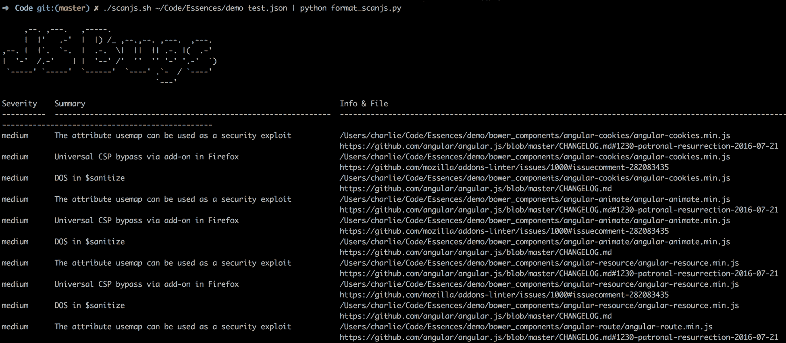

# 下载 JavaScript

在我们可以将它指向一个网站之前，还有一步——我们需要下载实际的 JavaScript！在使用我们的`scanjs`封装分析源代码之前，我们需要从目标页面提取它。一次性从单一的 URL 拉取代码意味着，即使我们围绕攻击面侦察开发更多工具，我们也可以将这个脚本与其他服务连接起来：它可以从爬虫提供的 URL 拉取 JavaScript，也可以将 JavaScript 或其他资源输入到其他分析工具中，或者分析其他页面指标。

所以这个脚本的最简单版本应该是：脚本接受一个 URL，查看该页面的源代码以查找所有 JavaScript 库，然后将这些文件下载到指定的位置。

我们需要做的第一件事是抓取我们正在检查的页面的 HTML 内容。让我们添加一些代码，接受`url`和`directory`命令行参数，定义我们的目标和存储下载的 JavaScript 的位置。然后，我们使用`requests`库来拉取数据，并使用 Beautiful Soup 将 HTML 字符串转化为可搜索的对象：

```
#!/usr/bin/env python2.7

import os, sys
import requests
from bs4 import BeautifulSoup

url = sys.argv[1]
directory = sys.argv[2]

r = requests.get(url)
soup = BeautifulSoup(r.text, 'html.parser')
```

然后，我们需要遍历每个`script`标签，并使用`src`属性的数据将文件下载到我们当前根目录内的一个目录：

```
for script in soup.find_all('script'):
 if script.get('src'): download_script(script.get('src'))
```

可能你对`download_script()`函数不太熟悉，因为我们还没有编写它。但这正是我们所需要的——一个函数，它接受`src`属性路径，构建资源链接，并将其下载到我们指定的目录：

```
def download_script(uri):
 address = url + uri if uri[0] == '/' else uri
 filename = address[address.rfind("/")+1:address.rfind("js")+2] 
 req = requests.get(url)
 with open(directory + '/' + filename, 'wb') as file:
 file.write(req.content)
```

每行代码都很直接。函数定义之后，脚本的 HTTP 地址是通过 Python 的三元表达式创建的。如果`src`属性以`/`开头，它是相对路径，可以直接附加到主机名；如果不是，它必须是完整的绝对链接。三元表达式可能看起来有点复杂，但一旦你掌握了它，它的表达能力非常强大。

函数的第二行通过查找最后一个斜杠（`address.rfind("/")`）的字符索引和`js`文件扩展名的索引，再加上 2 以避免切掉`js`部分（`address.rfind("js")+2)`），然后使用`[begin:end]`列表切片语法从指定的索引创建一个新的字符串，从而生成 JavaScript 库链接的文件名。

然后，在第三行中，脚本使用`requests`从组装好的地址拉取数据，通过上下文管理器创建一个新文件，并将页面源代码写入`/directory/filename.js`。现在你有了一个位置，路径作为参数传递，所有来自特定页面的 JavaScript 都会保存在其中。

# 将一切整合在一起

那么当我们把这一切整合在一起时会是什么样子呢？其实很简单——我们只需传递正确的目录引用，就能构造一个一行代码来扫描目标网站的 JavaScript：

```
grabjs https://www.target.site sourcejs; scanjs sourcejs output.json | formatjs
```

请记住，我们已经将这些脚本创建了符号链接并将其权限更改为`chmod u+x`，使它们可执行并可从我们的路径中访问。通过此命令，我们告诉我们的 CL 从`http://target.site`下载 JavaScript 到`sourcejs`目录，然后扫描该目录，创建一个`output.json`格式的数据表示，最后将所有内容格式化为纯文本报告。

作为测试命令的一种手段，我最近读到一篇博客，批评 jQuery（负责 Web 上大部分客户端代码）在[`jquery.com/`](http://jquery.com/)上运行过时的 WordPress 版本，于是我决定查看它们的 JavaScript 是否存在问题：

```
grabjs https://jquery.com sourcejs; scanjs sourcejs output.json | formatjs
```

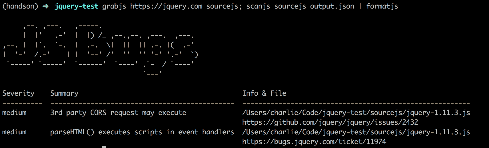

[`jquery.com/`](http://jquery.com/)存在一些问题，这并不算什么大事，但仍然令人吃惊！JavaScript 中的已知组件漏洞是一个普遍存在的问题，影响了大量网站（不同的方法论估计受影响的网站数量在整个网络中占据三分之一到四分之三之间）。

# 结构背后的价值

我们开发了多个脚本来实现一个目标。这个过程提出了一个问题：为什么我们不写一个程序呢？我们本可以将所有步骤（下载 JSON、分析、打印报告）都包含在一个 Python 或 Shell 脚本中；这样不是更方便吗？

但我们当前设置的优势在于不同工作流下各个部分的模块化。例如，我们可能希望一次性完成所有步骤，或者我们只需要其中的一部分。如果我已经下载了页面的所有 JSON 并将其放入一个文件夹，扫描了它并创建了`some-site-1-18-18.json`报告，那么，当我访问该信息时，我所需要的只是将原始`json`格式的报告转换为格式化输出。我可以通过简单的 Unix 命令实现这一点：

```
cat output.json | formatjs
```

或者我们可能想要扩展工作流。因为基础是建立在纯文本上的，所以添加新内容非常简单。如果我们的`mail`工具已经设置好，我们可以将测试结果通过邮件发送给自己：

```
grabjs https://www.target.site sourcejs; scanjs sourcejs output.json | formatjs | mail -s "JS Known Component Vulnerabilities" email@site.com
```

或者我们可以决定只向自己发送关键漏洞的邮件。我们可以使用`ag`，一个类似`grep`的自然语言搜索工具，以其惊人的速度提取我们关心的文本：

```
grabjs https://www.target.site sourcejs; scanjs sourcejs output.json | formatjs | ag critical | mail -s "Critical JS Known Component Vulnerabilities" email@site.com
```

我们可以用调用 Slack API 或其他消息服务的脚本来替代通过电子邮件作为通知的方式——这种可能性是无穷无尽的。使用这些短小的、拼接在一起的程序的好处在于，它们围绕着通用的输入和输出构建，可以随意重组和添加。它们是更广泛组合和服务的构建模块。它们本身也是非常简单的脚本，因为它们是通过命令行调用并传回信息的，可以用多种语言编写。我在这项工作中使用了 Python 和 Shell，但也可以使用 Ruby、Perl、Node 或其他脚本语言，成功的效果相似。

显然，这些短小的脚本有很多可以改进的地方。目前它们没有输入验证、错误处理、日志记录、默认参数或其他旨在使它们更干净、更可靠的功能。但随着我们逐步深入本书，我们将基于正在开发的工具进行扩展，直到它们变得更加可靠和专业。通过添加新选项，我们将展示一个小型互锁工具集的价值。

# 总结

本章介绍了如何使用自动扫描器、被动代理拦截和命令行工具（这些工具通过我们的自制设置进行连接）来发现网站攻击面的一些信息，并介绍了其中的一些内容。你学习了一些实用的第三方工具，也了解了如何在自定义自动化的背景下使用它们和其他工具。希望你不仅掌握了战术（我们编写的代码），还了解了背后的策略（设计理念）。

# 问题

1.  查找网站上隐藏的目录和秘密文件，有什么好的工具？

1.  你可以在哪里找到网站架构的地图？如果没有，如何自己创建一张？

1.  如何在不使用扫描器或自动化脚本的情况下安全地创建应用程序的攻击面地图？

1.  在 Python 中，什么是常见的网页抓取资源？

1.  根据 Unix 哲学（单一功能、可连接、基于文本）编写脚本有什么优势？

1.  查找 XSS 提交、SQLi 代码片段和其他模糊输入的好资源是什么？

1.  查找与目标相关的 DNS 信息，有什么好的资源？

# 深入阅读

你可以通过以下链接了解我们在本章中讨论的部分主题：

+   **SecLists**: [`github.com/danielmiessler/SecLists`](https://github.com/danielmiessler/SecLists)

+   **测量相对攻击面**: [`www.cs.cmu.edu/~wing/publications/Howard-Wing03.pdf`](http://www.cs.cmu.edu/~wing/publications/Howard-Wing03.pdf)

+   **XSScrapy**: [`pentestools.com/xsscrapy-xsssqli-finder/`](http://pentestools.com/xsscrapy-xsssqli-finder/)
