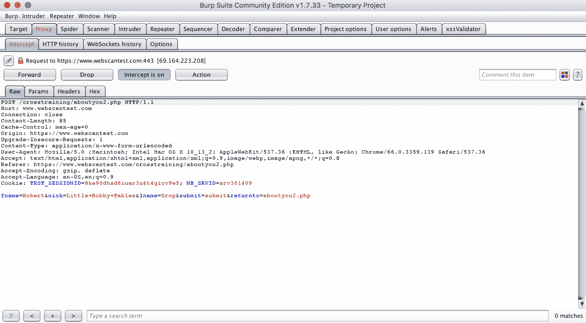
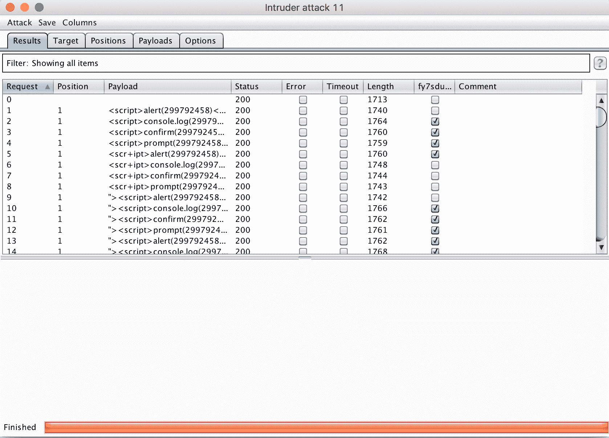

# 第四章：未经过滤的数据 &#x2013; 一个 XSS 案例研究

**跨站脚本攻击** (**XSS**) 是由浏览器的同源策略中的异常导致的漏洞，该策略限制了如何从外部来源加载资产（图片、样式表和 JavaScript）。

XSS 一直出现在 OWASP 十大网络应用程序漏洞调查中，有潜力成为影响目标站点大部分用户群体的非常破坏性的持久性利用漏洞。特别是在具有许多表单输入、登录、讨论线程等需要保护的站点中，它可能很难消除。

本章将涵盖创建 XSS 机会的浏览器机制，XSS 的不同类型（持久性、反射性、基于 DOM 等），如何测试以及一个完整的 XSS 漏洞示例 – 从发现漏洞到提交报告。

本章将涵盖以下主题：

+   XSS 概述

+   XSS 测试

+   XSS 的端到端示例

# 技术要求

在本节中，我们将继续配置和使用来自我们的 macOS 终端命令行的工具。我们还将使用 Burp Suite，Burp 扩展 XSS 验证器，并从 SecLists GitHub 仓库 ([`github.com/SecLists`](https://github.com/SecLists)) 获取信息来支持我们恶意的 XSS 代码片段提交。当我们正常使用浏览器或与 Burp 结合使用时，我们将继续使用 Chrome (`66.0.3359.139`)。使用 XSS 验证器扩展程序将需要我们安装 Phantomjs，一个可编程的无头浏览器。

请从官方 Phantomjs 下载页面下载 Phantomjs：[`phantomjs.org/download.html`](http://phantomjs.org/download.html)。

# 快速了解 XSS – XSS 的多种形式

XSS 是单一来源策略固有的弱点。单一来源策略是现代浏览器采用的安全机制，只允许页面从执行加载的页面的同一域加载。但是有一些例外允许页面加载第三方资产 – 大多数网页加载外部 JavaScript、CSS 或图像 – 这就是 XSS 发生的途径。

当浏览器加载 HTML 标签上的 `src` 属性时，它会执行该属性指向的代码。它不必是一个文件 – 它可以是包含在属性字符串中的代码。而且不仅仅是 `src` 属性可以执行 JavaScript。

以下是一个 XSS 测试片段示例。它使用 `onmouseover` 属性执行经典的 XSS 钓鱼攻击 `alert()` JavaScript：

```
<a onmouseover="alert(document.location)" href="#">snippet text</a>
```

`document.location` 包含了引用 XSS 发生位置的确切 URL 的方法。

我们刚才提到的代码片段是存储型或持久型 XSS 的一个例子，因为含有恶意 JavaScript 的 `<a>` 标签会通过表单输入作为评论或普通文本字段的一部分被插入，然后存储在 Web 应用的数据库中，其他用户查看该页面时可以检索并查看。然后，当某人将鼠标悬停在该元素上时，其 `onmouseover` 事件会触发执行恶意的 XSS 代码。

反射型 XSS 是指注入的脚本通过搜索结果页面、错误信息或由用户输入部分构成的其他消息从目标服务器反射回去。反射型 XSS 可以非常具有破坏性，因为它利用了反射代码所在服务器的信任。

还有基于 DOM 的 XSS，这是一种更为专业的攻击类型，依赖于用户接收到一个包含 XSS 负载的黑客生成链接，促使用户的浏览器打开该链接，在构建 DOM 的过程中回显负载，并执行代码。

尽管存储型/持久型 XSS、反射型 XSS 和基于 DOM 的 XSS 都可以归为 XSS 类型的不同分类，但另一种思考 XSS 类型的方法是将其分为客户端 XSS 和服务器端 XSS。在这种框架下，客户端和服务器端的变种都有存储型和反射型两种类型：服务器端 XSS 发生在服务器提供未经验证的用户数据时，无论是通过请求（反射型 XSS）还是存储位置（存储型 XSS），而客户端 XSS 则是指在客户端执行未经验证的代码，来自相同的位置。

我们将介绍一些检测 XSS 的技术，其中有些仅适用于特定类型的 XSS，而有些则适用于更广泛的攻击类型。

# 测试 XSS – 哪里可以找到它，如何验证它

有几种很好的方法可以发现 XSS。我们将从一个我们在准备进行渗透测试时已经开始使用的工具开始，深入了解 Burp 中的一些新部分以及与 XSS 相关的 Burp 扩展。

# Burp Suite 和 XSS Validator

自动化和半自动化的 XSS 解决方案存在一个问题，那就是区分信号和噪声。为了解决这个问题，XSS Validator 这一有用的 Burp 插件运行一个由 PhantomJS 驱动的 Web 服务器，用于接收 Burp 查询的结果，并寻找注入到 `alert()` 调用中的字符串，该调用嵌入在应用的 XSS 代码片段中。它提供了一种清晰的方法来筛选出 XSS 提交的结果，确保只保留绝对确认的漏洞。

下载 XSS Validator Burp 扩展的最简单方法是通过 Bapp 商店。从 Burp Suite 的扩展选项卡中进入商店，选择市场中的扩展（不用说，这是免费的）。你也可以通过参考 XSS Validator GitHub 文档中的说明手动安装该扩展。

除了安装扩展外，在实际测试过程中，你还需要运行服务器来解析传入的 Burp 请求。如果你克隆了 XSS Validator 的 git 仓库，你可以进入 `xss-validator` 目录并启动 `xss.js` 脚本。然后你可以启动服务器，并将其设置为作为一个独立的后台进程运行，只需一行命令：

```
phantomjs xss.js &
```

在 XSS Validator 服务器和 Burp Suite 启动（`boostrap_burp`）的情况下，前往你想要测试 XSS 的特定表单输入。作为在经过验证的测试环境上演示工具，我们将测试一个 Web 扫描测试站点（`webscantest.com`）上的表单输入，该站点设计为容易受到 XSS 攻击：


到达页面后——由于我们已关闭 Burp Proxy 的 Intercept 功能，因此不需要手动转发所有流量——我们在要测试的表单字段中输入一些可识别的内容：


现在我们需要返回 Burp Suite GUI，并在提交之前重新打开 Intercept：


现在当我们提交时，你应该看到浏览器的 favicon 表示已提交，但表单上没有任何变化。如果你返回 Burp，你会看到你已经拦截了表单的 `POST` 请求（注意，如果你打开了其他标签页，你可能会看到 Burp 代理已经拦截了那些页面的请求，并且需要将它们转发）：



我们希望将此请求发送到 Burp Intruder 功能，在那里我们可以进一步操作 `POST` 数据。为此，右键点击请求并选择 Send to Intruder：


一旦你进入 Intruder 窗口，前往 Positions 标签页，你可以看到已经选择为 Payload Positions 的 `POST` 请求参数和 cookie ID。我们可以保留这些默认设置，然后转到 Payloads 标签页，选择我们将要填充这些输入的内容。为了与 XSS Validator 扩展集成，我们需要对这前三个与 Payload 相关的设置进行如下更改：

# Payload 集合

对于第二个下拉框，Payload 类型，选择扩展生成的选项。

# Payload 选项

当你点击 Select generator... 时，你将打开一个模态框，在其中你可以选择 XSS Validator Payloads 作为你选择的生成器。

# Payload 处理

在这里你需要添加一个规则，选择 Invoke Burp extension 作为规则类型，然后选择 XSS Validator 作为处理器：


完成所有这些选择后，你的应用 GUI 应该如下所示：


在我们开始攻击之前，还需要做一个设置更改。如果你进入 xssValidator 标签页，你会看到 Grep Phrase 字段中生成了一个随机字符串，并且可能还会看到解释说明，成功的攻击将通过存在 *Grep Phrase* 来表示：


我们希望将这个 grep 短语添加到选项标签页的 Grep - Match 部分，以便在查看我们的攻击结果时，我们可以看到一个复选框，指示我们的短语是否出现在攻击响应中：


一旦添加了该短语，我们就准备开始攻击了。点击选项视图右上角的“开始攻击”按钮（以及其他任何视图）。

点击按钮后，你应该会看到一个攻击窗口弹出，并开始自动填充 XSS 片段提交的结果：



就这样！我们可以看到我们所用的 grep 短语，这意味着我们的提交已经成功，对于通过 XSS Validator 提交的多种标签/属性组合来说都有效。

# XSS – 一例完整的攻击示范

在本书中，我们将研究故意设定漏洞的教学网站上的错误，以及真实公司拥有的在线应用程序——通过这种方式，我们可以看到在真实环境中存在的漏洞，同时还会有一些章节，让你可以在家进行实践。

# Google Gruyere 中的 XSS

接下来的部分发生在**Google Gruyere**，这是一个由 Google 运营的 XSS 实验室，解释了 XSS 的不同方面，并提供了适当易受攻击的表单输入：


Google Gruyere 基于一个类似社交网络的模型，类似于 Instagram 或 Twitter，用户可以分享公开的片段，就像前者网站的 280 字文本块。除了显而易见的将服务宣传为容易遭受 XSS 攻击外，还有一些小段文字，类似于你在真实应用中会发现的内容，暗示了潜在的漏洞。一些 HTML 支持形式在特定情况下总会存在机会，即使站点开发人员为允许格式化标记（如 `<p></p>`、`<b></b>`、`<br/>`）而设置了过滤器，试图排除诸如 `<script></script>` 之类的危险内容，但这些过滤器仍有可能未能清除你精心构造的片段。

通过提交表单来创建一个新片段（设置好账户后），我们可以尝试探测清理过程的外部边缘。让我们尝试使用一个即使是最简单的过滤器也应该捕捉到的脚本：

```
<script>alert(1)</script>
```

一个普通的脚本标签，没有任何混淆、转义字符或特殊属性，是一个相当简单的攻击方式，如下所示：


当我们查看提交结果时，没有显示 `alert()` 窗口，也没有其他任何东西触发代码的执行，如下所示：


这个过滤器无疑有一些漏洞，但它在最基本的层面上还是能起作用，能够剥离 `<script>` 标签。我们在 `Seclists` 仓库中的 XSS 代码片段列表中找到另一个来试，确保该 HTML 标签很可能会被包含在一个旨在允许格式化代码的表单输入中：

```
<a onmouseover="alert(document.cookie)">xxs link</a> 
```

`document.cookie` 是我们提出的攻击场景的一个示例，也是一个简单的通过 `alert()` 展示的数据：


再次进行提交过程时，我们收到了不同的回应。成功了！我们的策略，利用一个无聊的格式化标签来伪装恶意负载（包含在它的属性中），成功了，现在我们有了一个确认的漏洞来报告：


# 收集报告信息

关于我们发现的漏洞，需要收集大量信息，这些信息在各个提交平台和格式中都可能是必要的或有用的。

# 类别

很简单，这是漏洞所属的类别。在我们这个例子中，它是持久性 XSS。

# 时间戳

如果你使用的是自动化或仅基于代码的解决方案来接触目标，记录时间戳是必须的——时间越准确越好。如果像我们刚才那样手动输入恶意代码片段，那么发现之后的时间就足够了。提供 UTC 时间戳可以帮助接收报告的开发者在分析日志、使用图表和其他监控工具时避免进行时区转换。

# URL

这是漏洞的 URL。在执行测试时，像 `alert()` 这样的代码有时可以用来显示位置（例如，`alert(document.location)`）。这样，在一张截图中，你可以同时展示漏洞的初步证据和它在应用中的位置。

# 负载

我们用来成功执行 JavaScript 的 XSS 代码片段将在这里展示。如果是 SQL 注入、成功的密码攻击，或者其他基于负载的攻击，这些数据也是必须的。如果在一次发现中碰到了多种负载类型，应该提到所有能够说明通用清理规则被误应用的情况：

```
<a onmouseover="alert(document.cookie)">xxs link</a> 
```

# 方法论

如果你是使用某个特定工具发现了这个漏洞，要告诉他们（如果他们明确表示不要使用扫描器，就不要使用！）。如果他们使用类似的工具，这可以帮助处理你报告的团队验证你的发现，并将其纳入重现问题的过程。在这种情况下，我们只需要说我们提交了代码片段，并手动验证了漏洞。

还需要列出一些关于发现漏洞的环境的基本信息：你的操作系统、浏览器类型和版本（如果相关的话，还包括任何插件或扩展），以及你认为相关的任何其他信息（例如，是在隐身窗口中发现的吗？如果使用 `curl`、Postman 或其他工具时，是否使用了特定的头信息？）。

# 重现步骤

确保你的指令足够清晰，以便评估人员能理解，是你提供的最重要信息之一，和实际的有效载荷一起。漏洞的截图（例如，警报窗口）是很好的证据，但如果漏洞无法复现，可能无法获得奖励。

# 攻击场景

提出一个好的攻击场景不像之前的数据点那样必要，但它可以是一个提高漏洞严重性和增加奖励的好方法。

对于这个攻击，我们将展示损害的范围，不仅仅是 Gruyere 应用。如果攻击者能够通过存储型 XSS 漏洞执行任意的 JavaScript，他们可以窃取敏感的 Cookie 信息，例如用于身份验证的金融应用程序（银行、经纪商、加密货币交易员）或社交网络（Twitter、Facebook、Instagram）的 Cookie，这些信息可能被用于身份盗窃、信用卡欺诈和其他网络犯罪。

下面是我们报告的样子：

```
CATEGORY: Persistent / Stored XSS

TIME: 1:12 AM (1:12) UTC

URL: https://google-gruyere.appspot.com/09809809887686765654654/newsnippet.gtl

PAYLOAD: <a onmouseover="alert(document.cookie)">xxs link</a>

METHODOLOGY: XSS payload submitted manually 

INSTRUCTIONS TO REPRODUCE:

1\. Navigate to "New Snippet" submission page
2\. Enter the XSS payload into the "New Snippet" form.
3\. Click "Submit" and create a new snippet.
4\. The malicious XSS contained in the payload is executed whenever someone hovers over the snippet with that link.

ATTACK SCENARIO:
With a persistent XSS vulnerability to exploit, a malicious actor could exfiltrate sensitive cookies to steal the identity of Gruyere's users, impersonating them both in the app and in whatever other accounts they are logged into at the time of the XSS script's execution.
```

# 总结

本章介绍了不同类型的 XSS 攻击，理解 XSS 片段的结构，并通过扩展 Burp Suite 与 XSS Validator 来确认注入尝试是否成功。我们还讨论了如何使用 Google Gruyere 作为教学辅助工具和测试平台，并从头到尾报告了一个 XSS 漏洞，包括如何撰写报告和示例提交。

# 问题

1.  XSS 的不同基本类型有哪些？

1.  哪些 XSS 变种最具危险性/影响力？

1.  XSS Validator 作为扩展的价值是什么？

1.  `phantomjs` 服务器的作用是什么？

1.  如何在 Burp Intruder 中选择用于模糊测试的有效载荷？

1.  在 XSS 提交报告中最重要的内容是什么？

1.  对于发现 XSS 漏洞并准备利用它的黑客来说，最糟糕的攻击场景是什么？

1.  为什么在报告提交中包含攻击场景很重要？

# 进一步阅读

你可以在以下链接找到更多关于本章讨论的主题：

+   **XSS 过滤规避备忘单**: [`www.owasp.org/index.php/XSS_Filter_Evasion_Cheat_Sheet`](https://www.owasp.org/index.php/XSS_Filter_Evasion_Cheat_Sheet)

+   **XSS 挑战**: [`xss-quiz.int21h.jp/`](https://xss-quiz.int21h.jp/)

+   **XSS 游戏**: [`xss-game.appspot.com`](https://xss-game.appspot.com)
