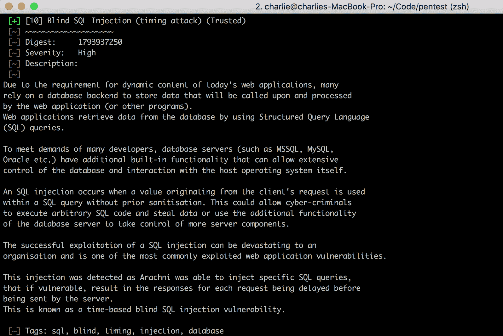

# 第五章：SQL、代码注入和扫描器

代码注入是指未经验证的数据被添加（注入）到一个脆弱的程序中并被执行。注入可以发生在 SQL、NoSQL、LDAP、XPath、NoSQL、XML 解析器，甚至通过 SMTP 头部。

在上一章讨论的 XSS 漏洞也是代码注入的例子。当一个带有恶意代码的未清理 HTML 标签通过评论线程或讨论板提交添加到 Web 应用的数据库中时，该代码会被注入到应用中，并在其他用户查看相同评论或讨论时被执行。

本章的重点是检测和防止与数据库相关的代码注入攻击——分别是 SQL 和 NoSQL。我们将讨论如何使用命令行工具测试表单输入的 SQLi 漏洞，如何使用类似的技术进行 NoSQLi 测试，如何扫描 SQLi 以及其他注入攻击，并介绍避免对目标数据库造成损害的最佳实践。

在本章中，我们将涵盖以下主题：

+   SQLi 和其他代码注入攻击

+   使用 `sqlmap` 测试 SQLi

+   寻找 bug

+   使用 Arachni 扫描 SQLi

+   NoSQL 注入

+   SQLi 的端到端示例

# 技术要求

在本章中，除了我们现有的 Burp 和 Burp Proxy 与 Chrome（`66.0.3359.139`）的集成外，我们还将使用 `sqlmap`，这是一个用于检测 SQL 和 NoSQL 注入的命令行工具。`sqlmap` 可以通过 Homebrew 安装，命令为 `brew install sqlmap`，也可以作为 Python 模块通过 `pip` 安装。`sqlmap` 是一个流行的工具，因此无论您的系统是什么，应该都有安装路径。

我们还将使用 Arachni 作为我们的首选扫描器。尽管扫描器比较吵闹，但在适当的情况下，它们是不可或缺的，并且非常擅长发现那些难以检测的 bug。Arachni 是一个出色的选择，因为它是开源的，支持多线程，能够通过插件进行扩展，且具有出色的命令行界面，允许将其集成到其他自动化工作流程中。Arachni 很容易安装；你可以通过安装 gem（`gem install arachni`）或直接从官方网站下载相应的安装包来安装。

请从 Arachni 的下载页面安装：[`www.arachni-scanner.com/download/#Mac-OSX`](http://www.arachni-scanner.com/download/#Mac-OSX)

安装完成后，如果你已经下载了适合系统的安装包，你需要将它们移动到系统内适当的位置。

然后，你可以创建一个符号链接（symlink），使得所有 `arachni` 命令行工具都可以在你的路径中使用（请填写正确的路径到你的 `arachni` 安装目录）：

```
sudo ln -s /Path/to/arachni-1.5.1-0.5.12/bin/arachni* /usr/local/bin
```

你可能会发现，在将 `arachni` 可执行文件符号链接到你的路径后，出现以下错误：

```
/usr/local/bin/arachni: line 3: /usr/local/bin/readlink_f.sh: No such file or directory
/usr/local/bin/arachni: line 4: readlink_f: command not found
/usr/local/bin/arachni: line 4: ./../system/setenv: No such file or directory
```

如果你收到这个错误，只需将 `arachni` 安装目录下的 `bin` 目录中的 `readlink_f.sh` 脚本符号链接、复制或移动到你自己的路径中。在这种情况下，我们将进行符号链接操作：

```
sudo ln -s /Path/to/arachni-1.5.1-0.5.12/bin/readlink_f.sh /usr/local/bin/readline_f.sh
```

现在，当我们在本章后面使用 `arachni` 时，我们可以直接调用它，而不需要每次都输入完整路径。

# SQLi 和其他代码注入攻击——接受未验证的数据

SQLi 是一种相对古老的漏洞。自从 1998 年首次公开披露该攻击开始，已经过去了二十年，诸如 Phrack 等出版物详细描述了这种攻击，但它仍然存在，且往往以严重破坏的方式存在。SQLi 漏洞可能允许攻击者读取敏感数据、更新数据库信息，有时甚至发出操作系统命令。正如 OWASP 简洁地指出的那样，“这个缺陷依赖于 SQL 并没有对控制平面和数据平面做出真实区分。” 这意味着 SQL 命令可以修改它们所包含的数据以及运行软件的底层系统的部分，因此当存在像 sqlmap 的 `--os-shell` 标志这样的功能访问先决条件时，SQLi 漏洞可以被用来发出系统命令。

有许多工具和设计模式用于防止 SQLi。但由于将新应用程序快速推向市场并迅速迭代功能的压力，SQLi 漏洞输入未被审计，防止此类错误的程序也没有得到实施。

作为一种广泛存在于数据库开发中最常用语言中的漏洞，并且是一种容易被发现、容易被利用并且回报丰厚的错误，SQLi 是一个值得研究的主题。

# 一个简单的 SQLi 示例

让我们看看 SQLi 是如何分解成实际代码的。

看一下下面的查询，其中 `$id` 的值是用户提供的输入：

```
SELECT title, author FROM posts WHERE id=$id
```

一种常见的 SQLi 技巧是输入可以改变 SQL 语句执行上下文或逻辑的数据。因为 `$id` 的值直接插入——没有数据清理、删除危险代码或数据类型转换——所以 SQL 语句是动态的，容易被篡改。

让我们做出一个改变，这将影响语句的执行：

```
SELECT title, author FROM posts WHERE id=10 OR 1=1
```

在这种情况下，`10 OR 1=1` 是用户提供的数据。通过修改 `WHERE` 子句，用户可以改变开发者提供的执行示例的逻辑。前面的示例相对无害，但如果语句要求从用户表中获取账户信息，或者与权限相关的数据库部分，而不仅仅是关于博客文章的信息，那就可能严重损害应用程序。

# 使用 Sqlmap 进行 SQLi 测试——在哪里找到它以及如何验证它

`sqlmap` 是一个流行的 CLI 工具，用于检测和利用 SQLi 漏洞。由于我们只对发现这些错误感兴趣，除了为报告提交集思广益的攻击场景外，我们对武器化并不那么感兴趣。

使用 `sqlmap` 的最简单方法是使用 `-u` 标志来针对特定 URL 中传递的参数。再次以 `webscantest.com` 为例，我们可以测试一个专门对 `GET` 请求易受攻击的表单提交中的参数：

```
sqlmap -u "http://webscantest.com/datastore/search_get_by_id.php?id=3"
```


当`sqlmap`开始探测目标 URL 中传递的参数时，它会提示你回答几个关于攻击方向和范围的问题：

```
it looks like the back-end DBMS is 'MySQL'. Do you want to skip test payloads specific for other DBMSes? [Y/n]
```

如果你能通过自己的调查成功识别后端，建议在这里选择“是”，以减少报告中的噪音。

你还会被问到愿意接受哪种`risk`级别的输入值：

```
for the remaining tests, do you want to include all tests for 'MySQL' extending provided level (1) and risk (1) values?
```

`sqlmap` 作为一个既能检测 SQLi 漏洞又能利用这些漏洞的工具，需要谨慎使用。除非你在一个完全独立于所有生产系统的沙盒环境中进行测试，否则你应该选择较低的风险级别设置。使用最低的风险级别可确保 `sqlmap` 使用恶意 SQL 输入测试表单，这些输入旨在让数据库休眠或枚举隐藏信息，而不是破坏数据或危害身份验证系统。由于目标 SQL 数据库中包含的信息和过程非常敏感，因此在处理与后端系统相关的漏洞时需要小心谨慎。

一旦`sqlmap`完成其测试输入范围，它会提示你是否要测试其他参数。完成对目标 URL 中所有传递参数的测试后，`sqlmap`会输出所有发现的漏洞报告：


成功！有几个与`id`参数相关的漏洞，包括一对盲注 SQLi 漏洞（注入的结果在 GUI 中不可直接看到）以及基于错误和`UNION`的输入——所有这些都被 `webscantest.com` 的文档确认。

# **抓取漏洞** – 使用 Google Dorks 和 Python 进行 SQLi 漏洞发现

使用`sqlmap`需要一个目标 URL——这个 URL 必须包含可测试的参数。接下来的技术可以用来定位特定的应用程序和表单输入——就像`sqlmap`一样——或者简单地返回一个易受 SQLi 漏洞影响的站点列表。

# Google Dorks 用于 SQLi

使用 Google Dorks——有时称为 Google 黑客技术——意味着通过精心设计的搜索查询，利用搜索引擎返回易受 SQLi 和其他漏洞攻击的网站。Google Dork 这个名字源自一个不小心配置错误的员工，他们将敏感的公司信息暴露到网上。

下面是一些常见的 Google Dorks 示例，用于发现 SQLi 漏洞：

```
inurl:index.php?id=
inurl:buy.php?category=
inurl:pageid=
inurl:page.php?file=
```

你可以看到这些查询被设计为返回结果，其中发现的站点至少在理论上是易受 SQLi 攻击的（因为这些站点的 URL 结构）。Dork 的基本形式是`search_method:domain/dork`，其中 `search_method` 和 dork 被调整为查找特定类型的漏洞，`domain` 用于在你希望针对特定应用程序时。比如，下面是一个设计用于返回不安全 CCTV 视频流的 dork：

```
intitle:”EvoCam” inurl:”webcam.html”
```

这个 Dork 并没有针对特定的 URL；它只是寻找任何页面标题包含 `Evocam` 且页面 URL 包含 `webcam.html` 的网站。

# 验证 Dork

在浏览一个小型安全网站时，我发现了以下 Dork，列在该公司 Bugtraq 部分（`intext` 字段中显示的公司标题已被更改）：

```
inurl:index.jsp? intext:"some company title"
```

尽管这个 Dork 没有指定目标 URL，但它通过 `intext` 搜索过滤器专注于特定公司。对于 `inurl` 值，`jsp` 是 JSP 的文件扩展名，JSP 是 Java Servlet 的 Web 应用框架。`jsp` 有点老——它是 Sun Microsystems 在 1999 年推出的对微软的 **Active Server Pages** (**ASP**) 的回应——但像许多技术一样，它仍然在遗留行业、小型企业和小型开发公司中被使用。

当我们使用这个 Dork 在 Google 中搜索时，第一条结果返回一个包含 `index.jsp?` 的 URL：

```
http://www.examplesite.com/index.jsp?idPagina=12
```

我们可以看到该网站正在发起一个 `GET` 请求，传递一个标识访问页面的参数（`idPagina`）。让我们检查一下，看它是否存在漏洞，我们可以通过将 URL 传递给 `sqlmap` 来进行检查。

```
sqlmap -u "http://www.examplesite.com/index.jsp?idPagina=12"
```

这是一个有效的 `sqlmap` 命令。这个工具的一个很酷的功能是，它还支持 Dorks 选项 `-g`，使得你可以传递你想要搜索的 Dork 字符串（而不是手动进行搜索）：

```
sqlmap -g 'inurl:index.jsp? intext:"some company title"'
```

在这个例子中，`sqlmap` 将使用该 Dork 在 Google 上进行搜索，然后获取第一页的结果，一一分析它们，每次都会提示你是否想要分析该 URL，跳过它，或退出。

只取第一条搜索结果——我们通过将 URL 传递给 `sqlmap` 直接进行的搜索——我们可以看到基于时间的和基于错误的 SQL 注入漏洞：


基于时间的 SQL 注入（SQLi）是指调用 `SLEEP()` 或其他类似函数，在处理查询时引入延迟。通过延迟、条件语句和其他逻辑的结合，可以慢慢枚举资源，从数据库中提取信息。如果你的有效载荷产生了延迟，你可以推测你的条件已被评估为 `true`，并且你的假设是正确的。足够多的这种操作可能会暴露敏感信息给有决心的攻击者。作为一种攻击方式，基于时间的 SQL 注入非常嘈杂。对应用程序日志的影响相对较小，但重复使用基于时间的 SQL 注入会导致 CPU 消耗急剧增加，容易被细心的系统管理员或 SRE 检测到。

如果我们将 `sqlmap` 基于时间的结果（`12 RLIKE SLEEP(5)`）中的有效载荷插入 `idPagina` URL 参数中，我们会发现它成功了！由于我们的 `SLEEP(5)` 命令未被清理，导致该命令被应用程序的 SQL 服务器错误执行，页面加载时间变长。这是一个真正的漏洞。

基于错误的 SQLi 也作为 `idPagina` 的攻击向量返回。基于错误的 SQLi 是指可以通过错误消息暴露敏感数据库信息的 SQL 命令。再一次，让我们使用这个有效载荷作为 `idPagina` URL 参数，并将其输入浏览器：

我们成功了！页面返回了一个表格 ID。暴露敏感数据库信息的程度已经超出了有效 SQLi 漏洞的阈值。

# 使用 Arachni 扫描 SQLi

正如我们在*技术要求*部分提到的，`arachni` 是我们选择的 SQLi 扫描工具，因为它是开源的、可扩展的、多线程的，并且可以从命令行界面（CLI）使用，且与其他自动化工具兼容。

按照要求安装 `arachni`（并为你安装的 `arachni` 可执行文件创建符号链接）后，你将能够在 `$PATH` 中访问 `arachni` 的命令行界面。让我们查看 Arachni 的帮助信息，探索一些可用的选项：


这是输出的截断版本。Arachni 有许多选项，数量多到这里无法全部列举。但某些命令行选项对于扩展 Arachni 的功能和创建更复杂的工作流非常有用。

# 超越默认设置

像许多扫描器一样，`arachni` 几乎可以通过点击操作来完成一切，甚至到了有些过头的程度。虽然开始从命令行对一个 URL 进行蜘蛛抓取时不需要额外的参数，但有几个关键选项我们应该关注，以获得更好的功能。

```
--timeout
```

当你让 `arachni` 扫描一个 URL 时，它会启动多个线程，开始用所有扫描器用来触发有趣行为的恶意代码片段和探索性请求来轰炸目标。然而，如果你速度过快，并且被 WAF 限制了流量，你可能会发现一些或所有的线程挂起，有时是无限期地。`--timeout` 参数允许你传入一个参数，指定 `arachni` 在关闭并基于收集到的数据生成报告之前应该等待多长时间。

```
--checks
```

默认情况下，当你扫描一个 URL 时，如果没有传递任何额外的信息，`arachni` 会应用其系统中的所有检查。但有时你可能希望排除一些优先级较低的警告——例如，`arachni` 会警告你公司邮箱被公开暴露，但通常如果邮箱是公司邮箱或本来就是面向客户的，这并不是问题。一些形式的数据泄露是重要的，但对于大多数公司来说，这不在其中。你也可能想排除一些噪声较大的检查，因为这些检查会对目标服务器或网络架构造成过大的负担。

`checks` 选项接受的参数是你应该包含和排除的检查项，星号 `*` 表示所有选项，排除的检查项则通过减号（`-`）表示。

```
--scope-include-subdomains
```

这个开关的作用正如它的名字所示——它告诉 `arachni`，当它爬取 URL 时，可以自由地跟随它找到的任何指向该网站子域的链接。

```
--plugin 'PLUGIN:OPTION=VALUE,OPTION2=VALUE2'
```

`plugin` 选项允许我们传递 `arachni` 插件可能依赖的环境变量（如 SaaS 变量的身份验证令牌、配置设置、SMTP 用户名和密码等）。

```
--http-request-concurrency MAX_CONCURRENCY
```

Arachni 控制 HTTP 请求的能力对于确保目标服务器不会被过多流量压垮至关重要。即使在特定目标范围内扫描被允许，根据约定，通常会为扫描器设置一个速度限制，以防止类似 DoS 攻击的情况发生。不管怎样，降低请求并发量可以确保你不会受到 WAF 的攻击。扫描器的默认 `MAX_CONCURRENCY` 是 `20` 个 HTTP 请求/秒。

# 编写封装脚本

就像我们将 `bootstrap_burp.sh` 脚本写作方便的封装器，来简化初始化 Burp 的 `JAR` 文件的长命令，这样每次启动应用程序时就不用每次输入完整的路径和选项一样，我们也可以对 `arachni` 做同样的事情。将我们刚才覆盖的所有选项（除了 `--plugins`）组合起来，这就是我们的脚本样子。我们将它命名为 `ascan.sh`：

```
#!/bin/sh

arachni $1 \
 --checks=*,-emails* \
 --scope-include-subdomains \
 --timeout 1:00:00 \
 --http-request-concurrency 10
```

像 `bootstrap_burp.sh` 一样，我们可以通过简单的 `chmod u+x ascan.sh` 使其可执行，并使用 `sudo ln -s /Path/to/ascan.sh /usr/local/bin/ascan` 将其添加到我们的路径中。

超时时间确实较长，目的是为了适应较小请求池所导致的长时间挂起，以及由于基于时间的 SQL 注入调用而需要的延长等待时间。

# NoSQL 注入——注入格式错误的 MongoDB 查询

根据 OWASP 的数据，市面上有超过 150 种不同的 NoSQL 数据库可以用于 Web 应用程序。我们将特别关注 MongoDB，最广泛使用的开源无结构 NoSQL 数据库，来展示如何在多种工具集中实现注入。

MongoDB API 通常期望使用安全的 BSON 查询构建工具构建的 BSON 数据（即二进制 JSON）。但在某些情况下，MongoDB 也可以接受未经序列化的 JSON 和 JavaScript 表达式——例如 `$where` 操作符的情况。

它通常用作过滤器——就像 SQL 的 `WHERE` 操作符一样：

```
db.myCollection.find( { $where: "this.foo == this.baz" } );
```

当然，你可以让这个表达式变得更加复杂。最终，如果数据没有得到适当的清理，MongoDB 的 `$where` 子句能够插入并执行整个用 JavaScript 编写的脚本。与 SQL 不同，SQL 是声明式的且作为语言具有一定的局限性，而 MongoDB 支持复杂的 JavaScript 条件表达式，拓宽了语言的全套特性，进而也使其容易遭到攻击。

你可以看到这种类型的漏洞是如何常见地被利用的。在 GitHub 和其他代码分享网站上，你可以找到列举不同恶意 MongoDB `$where`输入的清单，例如这个：[github.com/cr0hn/nosqlinjection_wordlists](https://github.com/cr0hn/nosqlinjection_wordlists)。

一些输入被设计为**拒绝服务**（**DoS**）和资源消耗攻击：

```
';sleep(5000); ';it=new%20Date();do{pt=new%20Date();}while(pt-it<5000);
```

有些人目的是发现密码：

```
' && this.password.match(/.*/)//+%00
```

MongoDB 中的另一个代码注入途径存在于 PHP 实现中。由于`$where`不仅是 MongoDB 的保留字，而且是有效的 PHP 代码，攻击者可以通过创建一个`$where`变量，将代码提交到查询中。

但无论实现方式如何，这些攻击都依赖于与一般注入攻击相同的原理——未经清理的数据被误认为并作为应用程序命令执行。

如 MongoDB 所示，输入格式不正确改变开发者代码逻辑的问题，不仅限于 SQL 或任何特定语言、框架或工具，而是一个更广泛的问题。

# SQL 注入 – 一个端到端示例

回到`arachni`，我们将其指向`webscantest.com/datastore`，并开始扫描，看看我们能发现什么：[`webscantest.com/datastore`](http://webscantest.com/datastore/)。

运行扫描（这会花费一些时间）后，`arachni`将把结果打印到控制台并生成一个`AFR`文件。`AFR`扩展名代表 Arachni 框架报告，是`arachni`用来存储扫描结果的格式。这个`AFR`文件可以转换成 HTML、JSON、XML 或其他文档格式：



我们可以立即看到这里有一个漏洞可以进一步探索。这是一个使用报告 HTML 版本的好机会，它利用浏览器可视化整个扫描结果。

当你想分析扫描结果时，可以使用`arachni_reporter`可执行文件生成一个压缩的 HTML 文件：

```
arachni_reporter some_report.afr --reporter=html:outfile=my_report.html.zip
```

重要的是要指定输出文件为压缩的 HTML 格式，因为这是`arachni_reporter`用来创建报告的格式。如果你省略`zip`后缀，直接尝试打开生成的 HTML 文件，浏览器将显示一长串未经格式化、难以理解的特殊字符。

以下是你在解压并在浏览器中查看文件时得到的内容：


Arachni 给我们展示了发现问题的概览。深入分析后，我们可以找到一些 SQL 注入的实例。让我们来看一下一个时间问题：


滚动过一些解释性文本和修复建议后，我们可以看到有效负载和受影响的 URL，如下所示：


现在我们可以开始写报告了。

# 收集报告信息

让我们一步步写出报告所需的信息。

# 类别

这是一个基于时间的 SQL 注入攻击。

# 时间戳

对于我们的时间戳，我们可以提供一个估算值。

# URL

漏洞的 URL 已在 `arachni` 报告中清楚地提供：

```
http://webscantest.com/datastore/search_by_id.php
```

# 有效载荷

SQLi 有效载荷在控制台和 HTML 报告中都显著列出，位于注入的种子下：

```
sleep(16000/1000);
```

# 方法论

再次强调，只有在获得授权的情况下才能使用扫描器！我们会报告此发现来自 Arachni 的 `1.5.1` 版本。

# 重现步骤

我们不仅仅是指向 `arachni`，我们还希望列出手动重现我们报告的漏洞的步骤。在这种情况下，步骤是导航到受影响页面上的表单，输入有效载荷并点击提交。无需编码、DOM 操作或其他技巧。

# 攻击场景

当 SQL 数据库遭受基于时间的注入攻击时，该漏洞允许攻击者通过巧妙地使用表达式和 SQLi 引发的暂停来枚举数据库中的信息。攻击可能会窃取商业或支付数据、敏感令牌/身份验证凭证，或任何其他关键数据。

# 最终报告

让我们使用这些信息来格式化我们的提交：

```
CATEGORY: Blind SQLi (time-based)

TIME: 2018-06-18 3:23 AM (3:23) UTC

URL: http://webscantest.com/datastore/search_by_id.php

PAYLOAD: sleep(16000/1000);

METHODOLOGY: Vulnerability detected with Arachni scanner, v. 1.5.1-0.5.12

INSTRUCTIONS TO REPRODUCE:

1\. Navigate to "/search_by_id.php"
2\. Enter the SQLi payload into the search form.
3\. Submit the query.
4\. The time-based SQLi code will cause a delay in the SQL thread execution.

ATTACK SCENARIO:
With a time-based SQL injection vulnerability to exploit, a malicious actor could use the time-delay combined with SQL expressions to enumerate sensitive information—authentication credentials, payment data, DB information, and more.
```

# 概要

本章介绍了 SQL 和 NoSQL 注入的基本概念，使用 `sqlmap` 测试目标主机 URL，Google Dorks 对于应用程序目标和通用漏洞分析的价值，以及如何正确报告 SQLi 漏洞，从检测到提交。

在下一章，我们将讨论跨站请求伪造（CSRF）、如何创建（并自动化）CSRF PoC、CSRF 的发生地点、验证 CSRF 漏洞、报告该漏洞的策略等。

# 问题

1.  什么是盲注 SQLi、基于错误的 SQLi 和基于时间的 SQLi？

1.  尝试使用激进字符串输入检测 SQLi 漏洞有什么危险？

1.  什么是 Google dork？它是如何得名的？

1.  `arachni` 命令行界面（CLI）有哪些特别有用的命令行选项？

1.  如何从 Arachni Framework Report（`AFR`）文件生成报告？

1.  在 MongoDB 中有哪些注入向量？

1.  使 SQL 线程休眠有什么价值？

# 进一步阅读

你可以在以下链接了解本章讨论的某些主题：

+   Arachni GitHub 页面：[`github.com/Arachni/arachni`](https://github.com/Arachni/arachni)

+   Exploit DB：[`ww.exploit-db.com`](https://ww.exploit-db.com)

+   GoogleDorking：[`www.google-dorking.com`](http://www.google-dorking.com)
